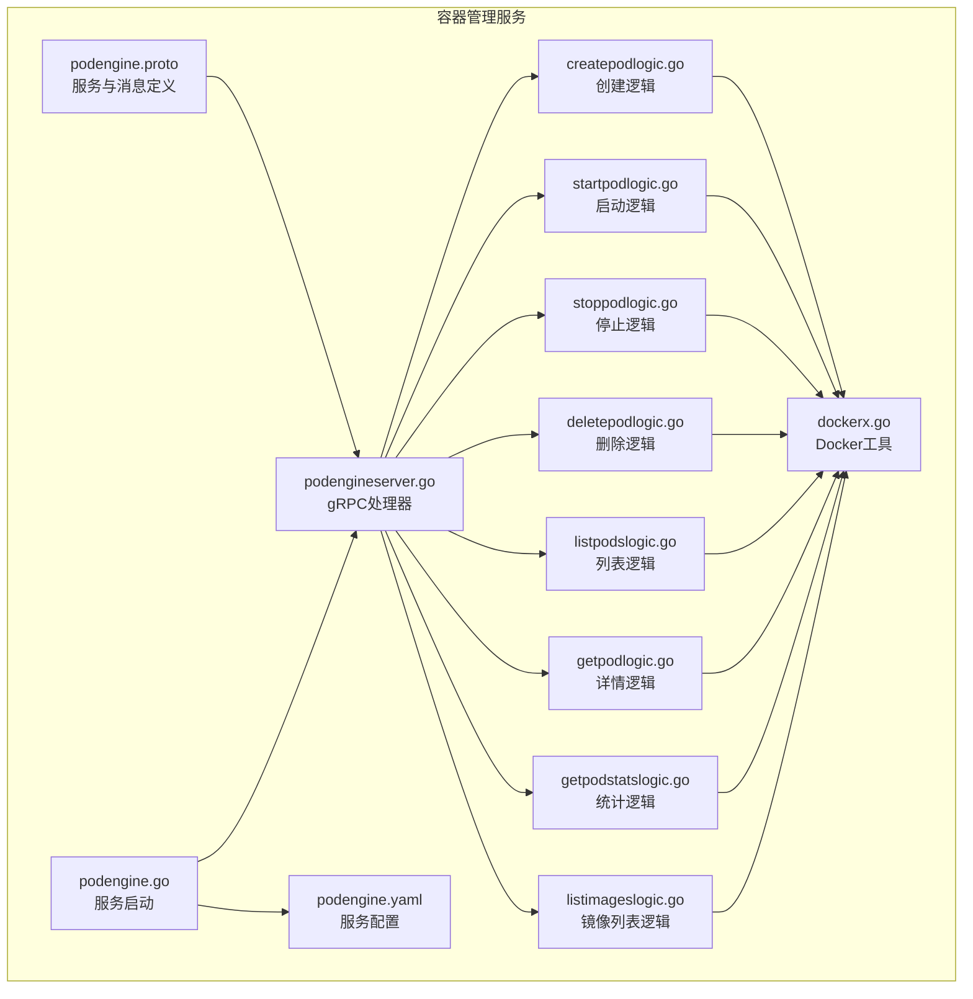
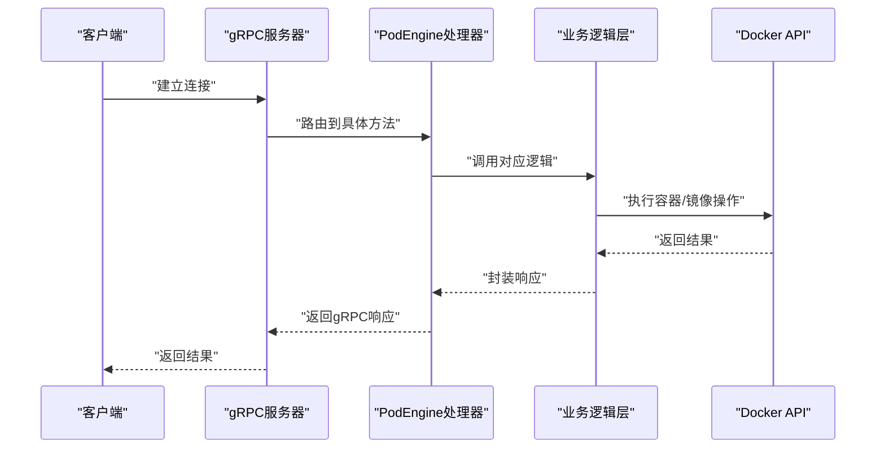
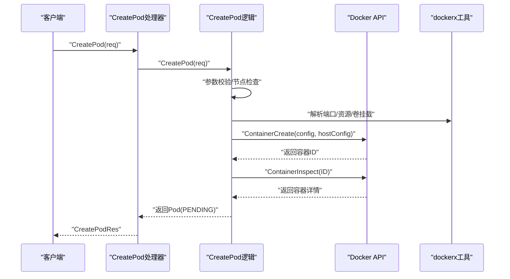
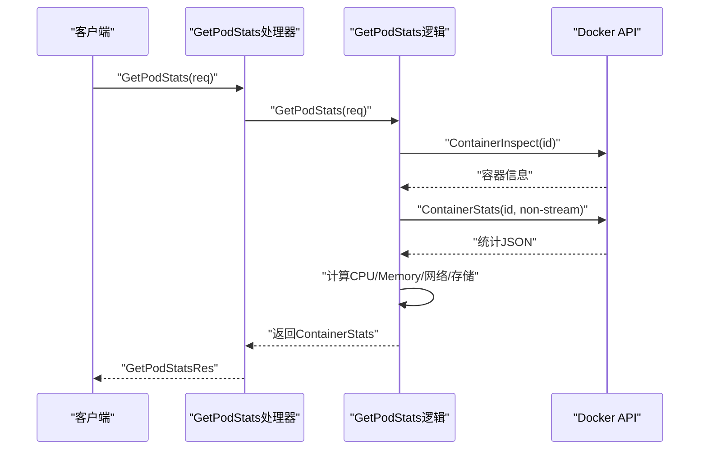
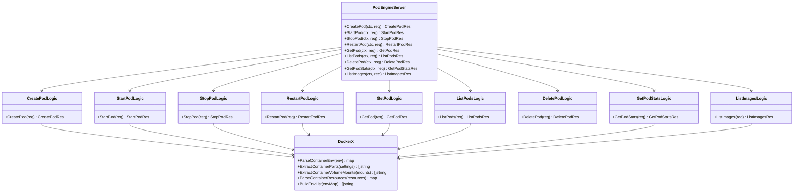

# 容器管理服务API

<cite>
**本文档引用的文件**
- [podengine.proto](file://app/podengine/podengine.proto)
- [podengineserver.go](file://app/podengine/internal/server/podengineserver.go)
- [createpodlogic.go](file://app/podengine/internal/logic/createpodlogic.go)
- [startpodlogic.go](file://app/podengine/internal/logic/startpodlogic.go)
- [stoppodlogic.go](file://app/podengine/internal/logic/stoppodlogic.go)
- [deletepodlogic.go](file://app/podengine/internal/logic/deletepodlogic.go)
- [listpodslogic.go](file://app/podengine/internal/logic/listpodslogic.go)
- [getpodlogic.go](file://app/podengine/internal/logic/getpodlogic.go)
- [getpodstatslogic.go](file://app/podengine/internal/logic/getpodstatslogic.go)
- [listimageslogic.go](file://app/podengine/internal/logic/listimageslogic.go)
- [dockerx.go](file://common/dockerx/dockerx.go)
- [podengine.go](file://app/podengine/podengine.go)
- [podengine.yaml](file://app/podengine/etc/podengine.yaml)
- [podengine.swagger.json](file://swagger/podengine.swagger.json)
</cite>

## 目录
1. [简介](#简介)
2. [项目结构](#项目结构)
3. [核心组件](#核心组件)
4. [架构总览](#架构总览)
5. [详细组件分析](#详细组件分析)
6. [依赖关系分析](#依赖关系分析)
7. [性能考虑](#性能考虑)
8. [故障排查指南](#故障排查指南)
9. [结论](#结论)
10. [附录](#附录)

## 简介
本文件面向容器管理服务的gRPC API，聚焦于基于Docker的Pod生命周期管理、容器状态监控与镜像操作能力。文档覆盖以下内容：
- Pod生命周期管理：CreatePod、StartPod、StopPod、RestartPod、DeletePod
- 查询与监控：ListPods、GetPod、GetPodStats
- 镜像管理：ListImages
- 参数结构、调用流程、返回数据格式
- Go客户端调用示例路径与注意事项
- 容器状态枚举、错误处理与异常机制
- 资源限制、网络配置、存储挂载等参数说明

## 项目结构
容器管理服务位于应用目录 app/podengine 下，采用标准的Go Zero微服务分层：
- 接口定义：podengine.proto（服务、消息、枚举）
- 服务端实现：internal/server/podengineserver.go（gRPC处理器）
- 业务逻辑：internal/logic/*（各接口逻辑实现）
- 通用工具：common/dockerx/dockerx.go（Docker相关解析与转换）
- 启动入口：app/podengine/podengine.go（gRPC服务器启动、注册服务）
- 配置文件：app/podengine/etc/podengine.yaml（监听地址、日志、Docker节点配置）

**图表来源**
- [podengine.proto:16-26](file://app/podengine/podengine.proto#L16-L26)
- [podengineserver.go:15-70](file://app/podengine/internal/server/podengineserver.go#L15-L70)
- [createpodlogic.go:20-152](file://app/podengine/internal/logic/createpodlogic.go#L20-L152)
- [startpodlogic.go:15-88](file://app/podengine/internal/logic/startpodlogic.go#L15-L88)
- [stoppodlogic.go:14-49](file://app/podengine/internal/logic/stoppodlogic.go#L14-L49)
- [deletepodlogic.go:14-50](file://app/podengine/internal/logic/deletepodlogic.go#L14-L50)
- [listpodslogic.go:17-140](file://app/podengine/internal/logic/listpodslogic.go#L17-L140)
- [getpodlogic.go:17-117](file://app/podengine/internal/logic/getpodlogic.go#L17-L117)
- [getpodstatslogic.go:18-134](file://app/podengine/internal/logic/getpodstatslogic.go#L18-L134)
- [listimageslogic.go:16-111](file://app/podengine/internal/logic/listimageslogic.go#L16-L111)
- [dockerx.go:1-95](file://common/dockerx/dockerx.go#L1-L95)
- [podengine.go:27-69](file://app/podengine/podengine.go#L27-L69)
- [podengine.yaml:1-20](file://app/podengine/etc/podengine.yaml#L1-L20)

**章节来源**
- [podengine.proto:1-338](file://app/podengine/podengine.proto#L1-L338)
- [podengineserver.go:1-70](file://app/podengine/internal/server/podengineserver.go#L1-L70)
- [podengine.go:1-69](file://app/podengine/podengine.go#L1-L69)
- [podengine.yaml:1-20](file://app/podengine/etc/podengine.yaml#L1-L20)

## 核心组件
- 服务接口：PodEngine（8个方法）
- 数据模型：Pod、Container、ContainerSpec、PodSpec、ContainerState、PodCondition、ContainerStats、Image
- 状态枚举：PodPhase、PodConditionType、ContainerState
- Docker集成：通过common/dockerx工具进行环境变量、端口、卷挂载、资源限制等解析与转换

**章节来源**
- [podengine.proto:16-26](file://app/podengine/podengine.proto#L16-L26)
- [podengine.proto:33-178](file://app/podengine/podengine.proto#L33-L178)
- [dockerx.go:20-86](file://common/dockerx/dockerx.go#L20-L86)

## 架构总览
服务采用gRPC + Go Zero框架，服务端在启动时注册PodEngine服务，并根据配置决定是否开启反射与Nacos注册。请求经由gRPC路由至对应逻辑层，逻辑层通过dockerx工具与Docker API交互。

**图表来源**
- [podengine.go:37-43](file://app/podengine/podengine.go#L37-L43)
- [podengineserver.go:26-69](file://app/podengine/internal/server/podengineserver.go#L26-L69)
- [createpodlogic.go:34-152](file://app/podengine/internal/logic/createpodlogic.go#L34-L152)
- [dockerx.go:11-18](file://common/dockerx/dockerx.go#L11-L18)

## 详细组件分析

### 服务与消息定义（podengine.proto）
- 服务：PodEngine
  - CreatePod、StartPod、StopPod、RestartPod、GetPod、ListPods、DeletePod、GetPodStats、ListImages
- 状态枚举：
  - PodPhase：UNKNOWN、PENDING、RUNNING、SUCCEEDED、FAILED、STOPPED
  - PodConditionType：POD_SCHEDULED、CONTAINERS_READY、INITIALIZED、READY
  - ContainerState：running、terminated、waiting、reason、message、startedTime、finishedTime、exitCode
- 数据模型：
  - ContainerSpec、PodSpec、Container、Pod、ContainerStats、Image

**章节来源**
- [podengine.proto:16-26](file://app/podengine/podengine.proto#L16-L26)
- [podengine.proto:33-52](file://app/podengine/podengine.proto#L33-L52)
- [podengine.proto:65-75](file://app/podengine/podengine.proto#L65-L75)
- [podengine.proto:108-155](file://app/podengine/podengine.proto#L108-L155)
- [podengine.proto:162-178](file://app/podengine/podengine.proto#L162-L178)
- [podengine.proto:282-314](file://app/podengine/podengine.proto#L282-L314)
- [podengine.proto:316-338](file://app/podengine/podengine.proto#L316-L338)

### Pod生命周期管理

#### CreatePod（创建Pod）
- 请求参数：node、name、spec（包含容器列表、标签、注解、重启策略、优雅终止时间、网络模式/名称/配置、资源限制、卷挂载）
- 处理流程：
  - 参数校验与节点检查
  - 解析端口映射、资源限制、卷挂载
  - 设置重启策略、网络模式、终止超时
  - 调用Docker创建容器并返回Pod信息（初始状态为PENDING）

**图表来源**
- [podengineserver.go:26-29](file://app/podengine/internal/server/podengineserver.go#L26-L29)
- [createpodlogic.go:34-152](file://app/podengine/internal/logic/createpodlogic.go#L34-L152)
- [dockerx.go:20-86](file://common/dockerx/dockerx.go#L20-L86)

**章节来源**
- [podengine.proto:185-189](file://app/podengine/podengine.proto#L185-L189)
- [createpodlogic.go:34-152](file://app/podengine/internal/logic/createpodlogic.go#L34-L152)

#### StartPod（启动Pod）
- 请求参数：node、id
- 处理流程：校验参数 -> 获取Docker客户端 -> 启动容器 -> 检索容器详情 -> 封装Pod（状态设为RUNNING）

**章节来源**
- [podengine.proto:195-198](file://app/podengine/podengine.proto#L195-L198)
- [startpodlogic.go:29-87](file://app/podengine/internal/logic/startpodlogic.go#L29-L87)

#### StopPod（停止Pod）
- 请求参数：node、id、force
- 处理流程：校验参数 -> 停止容器 -> 检索容器详情 -> 返回空响应

**章节来源**
- [podengine.proto:204-208](file://app/podengine/podengine.proto#L204-L208)
- [stoppodlogic.go:28-48](file://app/podengine/internal/logic/stoppodlogic.go#L28-L48)

#### RestartPod（重启Pod）
- 请求参数：node、id
- 处理流程：校验参数 -> 停止容器 -> 启动容器 -> 检索容器详情 -> 返回Pod

**章节来源**
- [podengine.proto:213-216](file://app/podengine/podengine.proto#L213-L216)
- [startpodlogic.go:29-87](file://app/podengine/internal/logic/startpodlogic.go#L29-L87)

#### DeletePod（删除Pod）
- 请求参数：node、id、force、removeVolumes
- 处理流程：校验参数 -> 删除容器（可选删除卷）-> 返回空响应

**章节来源**
- [podengine.proto:263-268](file://app/podengine/podengine.proto#L263-L268)
- [deletepodlogic.go:28-49](file://app/podengine/internal/logic/deletepodlogic.go#L28-L49)

### 查询与监控

#### ListPods（列出Pod）
- 请求参数：node、limit、offset、names、ids、labels
- 处理流程：构建过滤器 -> 列出容器 -> 转换为ListPodItem（含端口、大小、标签、状态、网络模式、挂载）-> 分页返回

**章节来源**
- [podengine.proto:231-238](file://app/podengine/podengine.proto#L231-L238)
- [listpodslogic.go:31-124](file://app/podengine/internal/logic/listpodslogic.go#L31-L124)

#### GetPod（获取Pod详情）
- 请求参数：node、id
- 处理流程：容器检查 -> 解析Pod阶段与容器状态 -> 提取端口、环境变量、资源、卷挂载 -> 返回Pod

**章节来源**
- [podengine.proto:222-225](file://app/podengine/podengine.proto#L222-L225)
- [getpodlogic.go:31-77](file://app/podengine/internal/logic/getpodlogic.go#L31-L77)

#### GetPodStats（获取Pod统计）
- 请求参数：node、id
- 处理流程：容器检查 -> 获取统计流 -> 解析CPU、内存、网络、存储指标 -> 计算百分比 -> 返回ContainerStats

**图表来源**
- [getpodstatslogic.go:32-133](file://app/podengine/internal/logic/getpodstatslogic.go#L32-L133)

**章节来源**
- [podengine.proto:273-276](file://app/podengine/podengine.proto#L273-L276)
- [getpodstatslogic.go:32-133](file://app/podengine/internal/logic/getpodstatslogic.go#L32-L133)

### 镜像管理

#### ListImages（列出镜像）
- 请求参数：node、limit、offset、references、includeDigests
- 处理流程：构建过滤器 -> 列出镜像 -> 可选镜像检查以获取摘要 -> 转换为Image（含标签、大小、创建时间）-> 分页返回

**章节来源**
- [podengine.proto:316-322](file://app/podengine/podengine.proto#L316-L322)
- [listimageslogic.go:30-110](file://app/podengine/internal/logic/listimageslogic.go#L30-L110)

### 参数与数据模型详解

#### Pod与容器模型
- Pod：包含id、name、phase、conditions、containers、labels、annotations、networkMode、创建/启动/删除时间
- Container：包含name、image、state、ports、env、args、resources、volumeMounts
- ContainerState：running、terminated、waiting、reason、message、startedTime、finishedTime、exitCode

**章节来源**
- [podengine.proto:162-178](file://app/podengine/podengine.proto#L162-L178)
- [podengine.proto:82-101](file://app/podengine/podengine.proto#L82-L101)
- [podengine.proto:65-75](file://app/podengine/podengine.proto#L65-L75)

#### 规格与期望状态
- ContainerSpec：name、image、args、env、ports、resources、volumeMounts
- PodSpec：name、containers、labels、annotations、restartPolicy、terminationGracePeriodSeconds、networkMode、networkName、networkConfig

**章节来源**
- [podengine.proto:108-155](file://app/podengine/podengine.proto#L108-L155)

#### 状态枚举
- PodPhase：UNKNOWN、PENDING、RUNNING、SUCCEEDED、FAILED、STOPPED
- PodConditionType：POD_SCHEDULED、CONTAINERS_READY、INITIALIZED、READY

**章节来源**
- [podengine.proto:33-52](file://app/podengine/podengine.proto#L33-L52)

#### 统计与镜像模型
- ContainerStats：容器ID/名称、CPU使用率/总量、内存使用量/限制/百分比、网络收发字节、存储读写字节、时间戳
- Image：id、references、digests、size、sizeDisplay、createdAt、labels

**章节来源**
- [podengine.proto:282-314](file://app/podengine/podengine.proto#L282-L314)
- [podengine.proto:329-338](file://app/podengine/podengine.proto#L329-L338)

### Go客户端调用示例（路径指引）
- 客户端连接与调用：
  - 使用生成的gRPC客户端接口进行调用（方法名与请求/响应类型见下述路径）
  - 连接建立与调用示例可参考以下生成文件中的方法签名与调用方式
- 示例路径（不直接展示代码内容）：
  - [CreatePod调用:59-67](file://app/podengine/podengine/podengine_grpc.pb.go#L59-L67)
  - [StartPod调用:69-77](file://app/podengine/podengine/podengine_grpc.pb.go#L69-L77)
  - [StopPod调用:79-87](file://app/podengine/podengine/podengine_grpc.pb.go#L79-L87)
  - [RestartPod调用:89-97](file://app/podengine/podengine/podengine_grpc.pb.go#L89-L97)
  - [GetPod调用:99-107](file://app/podengine/podengine/podengine_grpc.pb.go#L99-L107)
  - [ListPods调用:109-117](file://app/podengine/podengine/podengine_grpc.pb.go#L109-L117)
  - [DeletePod调用:119-127](file://app/podengine/podengine/podengine_grpc.pb.go#L119-L127)
  - [GetPodStats调用:129-137](file://app/podengine/podengine/podengine_grpc.pb.go#L129-L137)
  - [ListImages调用:139-147](file://app/podengine/podengine/podengine_grpc.pb.go#L139-L147)

**章节来源**
- [podengine_grpc.pb.go:55-147](file://app/podengine/podengine/podengine_grpc.pb.go#L55-L147)

### 错误处理与异常机制
- 参数校验：所有请求在进入业务逻辑前均会进行参数校验（如字段长度、范围、枚举值等）
- 节点检查：若node不存在，返回明确错误
- Docker操作错误：容器创建/启动/停止/删除失败时，返回包装后的错误
- 统一错误格式：gRPC状态码与消息遵循标准格式（Swagger定义了rpcStatus结构）

**章节来源**
- [createpodlogic.go:34-45](file://app/podengine/internal/logic/createpodlogic.go#L34-L45)
- [startpodlogic.go:29-44](file://app/podengine/internal/logic/startpodlogic.go#L29-L44)
- [stoppodlogic.go:28-41](file://app/podengine/internal/logic/stoppodlogic.go#L28-L41)
- [deletepodlogic.go:28-43](file://app/podengine/internal/logic/deletepodlogic.go#L28-L43)
- [listpodslogic.go:31-68](file://app/podengine/internal/logic/listpodslogic.go#L31-L68)
- [getpodlogic.go:31-43](file://app/podengine/internal/logic/getpodlogic.go#L31-L43)
- [getpodstatslogic.go:32-59](file://app/podengine/internal/logic/getpodstatslogic.go#L32-L59)
- [listimageslogic.go:30-55](file://app/podengine/internal/logic/listimageslogic.go#L30-L55)
- [podengine.swagger.json:29-47](file://swagger/podengine.swagger.json#L29-L47)

### 资源限制、网络配置与存储挂载

#### 资源限制（resources）
- 支持键值对形式传入，常见键：
  - cpu：CPU配额（数值），内部转换为period/quota
  - memory：内存限制（字节数）
  - cpuRequest：CPU份额（数值），映射为shares
  - memoryRequest：内存预留（字节数），映射为reservation
- 解析与转换详见dockerx工具

**章节来源**
- [podengine.proto:117-118](file://app/podengine/podengine.proto#L117-L118)
- [createpodlogic.go:189-222](file://app/podengine/internal/logic/createpodlogic.go#L189-L222)
- [dockerx.go:58-86](file://common/dockerx/dockerx.go#L58-L86)

#### 网络配置（networkMode、networkName、networkConfig）
- networkMode：bridge、host、none（默认bridge）
- networkName：自定义网络名称（优先级高于mode）
- networkConfig：扩展网络参数（由runtime解释）

**章节来源**
- [podengine.proto:147-154](file://app/podengine/podengine.proto#L147-L154)
- [createpodlogic.go:62-71](file://app/podengine/internal/logic/createpodlogic.go#L62-L71)

#### 存储挂载（volumeMounts）
- 格式：hostPath:containerPath[:ro]
- 解析后转换为Docker Mount对象

**章节来源**
- [podengine.proto:119-120](file://app/podengine/podengine.proto#L119-L120)
- [createpodlogic.go:267-287](file://app/podengine/internal/logic/createpodlogic.go#L267-L287)
- [dockerx.go:45-56](file://common/dockerx/dockerx.go#L45-L56)

## 依赖关系分析

**图表来源**
- [podengineserver.go:15-70](file://app/podengine/internal/server/podengineserver.go#L15-L70)
- [createpodlogic.go:20-32](file://app/podengine/internal/logic/createpodlogic.go#L20-L32)
- [startpodlogic.go:15-27](file://app/podengine/internal/logic/startpodlogic.go#L15-L27)
- [stoppodlogic.go:14-26](file://app/podengine/internal/logic/stoppodlogic.go#L14-L26)
- [deletepodlogic.go:14-26](file://app/podengine/internal/logic/deletepodlogic.go#L14-L26)
- [listpodslogic.go:17-29](file://app/podengine/internal/logic/listpodslogic.go#L17-L29)
- [getpodlogic.go:17-29](file://app/podengine/internal/logic/getpodlogic.go#L17-L29)
- [getpodstatslogic.go:18-30](file://app/podengine/internal/logic/getpodstatslogic.go#L18-L30)
- [listimageslogic.go:16-28](file://app/podengine/internal/logic/listimageslogic.go#L16-L28)
- [dockerx.go:20-86](file://common/dockerx/dockerx.go#L20-L86)

**章节来源**
- [podengineserver.go:1-70](file://app/podengine/internal/server/podengineserver.go#L1-L70)
- [dockerx.go:1-95](file://common/dockerx/dockerx.go#L1-L95)

## 性能考虑
- 统计查询：GetPodStats使用非流式统计接口，避免长连接开销；建议按需调用，避免频繁轮询
- 列表查询：ListPods与ListImages支持limit/offset分页，建议结合过滤条件（ids、names、labels、references）减少数据量
- 资源解析：资源限制解析为Docker原生字段，注意单位换算（CPU配额与内存字节）以避免过度限制或宽松
- 网络模式：host模式无端口映射，bridge模式需要解析端口绑定；none模式不暴露网络
- 日志与追踪：服务端启用日志拦截器，生产环境建议合理设置日志级别与保留天数

## 故障排查指南
- 参数校验失败：检查请求字段（如name非空、ids/labels过滤格式正确、limit/offset范围）
- 节点未找到：确认配置文件中Docker节点映射正确
- 容器操作失败：
  - CreatePod：检查镜像是否存在、端口冲突、资源限制是否合理
  - StartPod：检查容器状态与健康状况
  - StopPod/DeletePod：确认容器ID有效、权限足够
- 统计为空：确认容器正在运行且Docker统计可用
- 镜像列表为空：确认镜像引用过滤条件与仓库配置

**章节来源**
- [createpodlogic.go:34-45](file://app/podengine/internal/logic/createpodlogic.go#L34-L45)
- [startpodlogic.go:29-44](file://app/podengine/internal/logic/startpodlogic.go#L29-L44)
- [stoppodlogic.go:28-41](file://app/podengine/internal/logic/stoppodlogic.go#L28-L41)
- [deletepodlogic.go:28-43](file://app/podengine/internal/logic/deletepodlogic.go#L28-L43)
- [listpodslogic.go:31-68](file://app/podengine/internal/logic/listpodslogic.go#L31-L68)
- [getpodlogic.go:31-43](file://app/podengine/internal/logic/getpodlogic.go#L31-L43)
- [getpodstatslogic.go:32-59](file://app/podengine/internal/logic/getpodstatslogic.go#L32-L59)
- [listimageslogic.go:30-55](file://app/podengine/internal/logic/listimageslogic.go#L30-L55)

## 结论
该容器管理服务通过gRPC提供了完整的Docker容器生命周期管理能力，涵盖创建、启动、停止、重启、删除、查询与监控，并支持镜像列表管理。服务采用清晰的分层设计与参数校验，结合dockerx工具实现与Docker API的高效对接。生产部署时建议关注资源限制、网络模式与日志配置，确保稳定与可观测性。

## 附录

### 服务启动与配置
- 启动入口：app/podengine/podengine.go
- 监听地址与日志：app/podengine/etc/podengine.yaml
- Swagger定义：swagger/podengine.swagger.json（用于文档化与调试）

**章节来源**
- [podengine.go:27-69](file://app/podengine/podengine.go#L27-L69)
- [podengine.yaml:1-20](file://app/podengine/etc/podengine.yaml#L1-L20)
- [podengine.swagger.json:1-50](file://swagger/podengine.swagger.json#L1-L50)