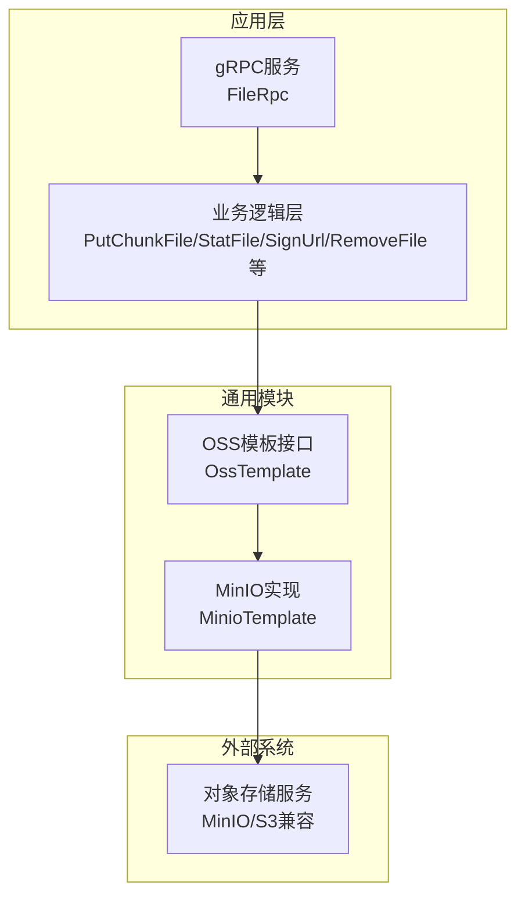
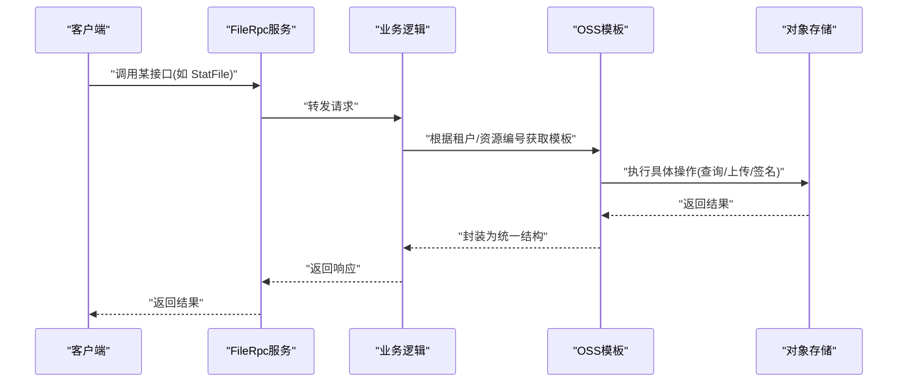
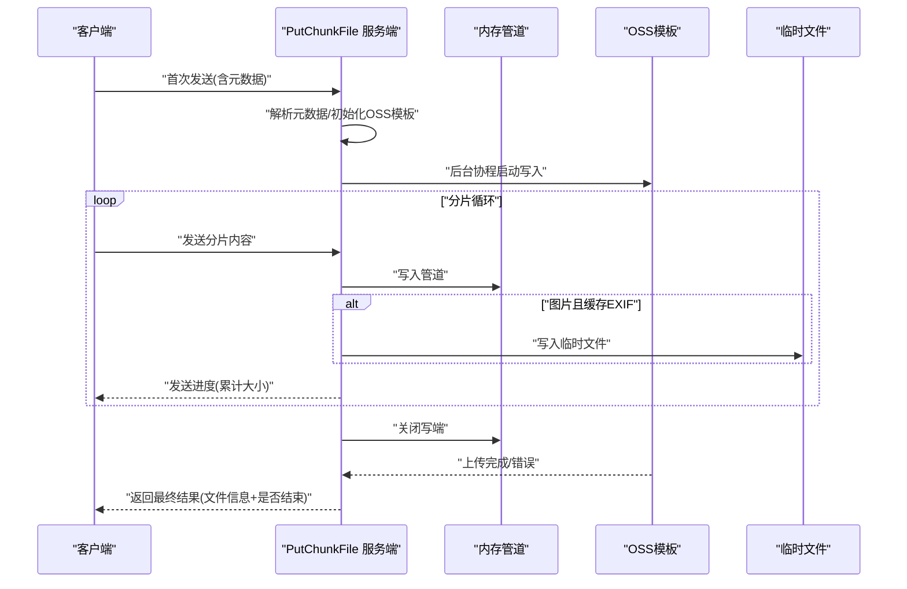
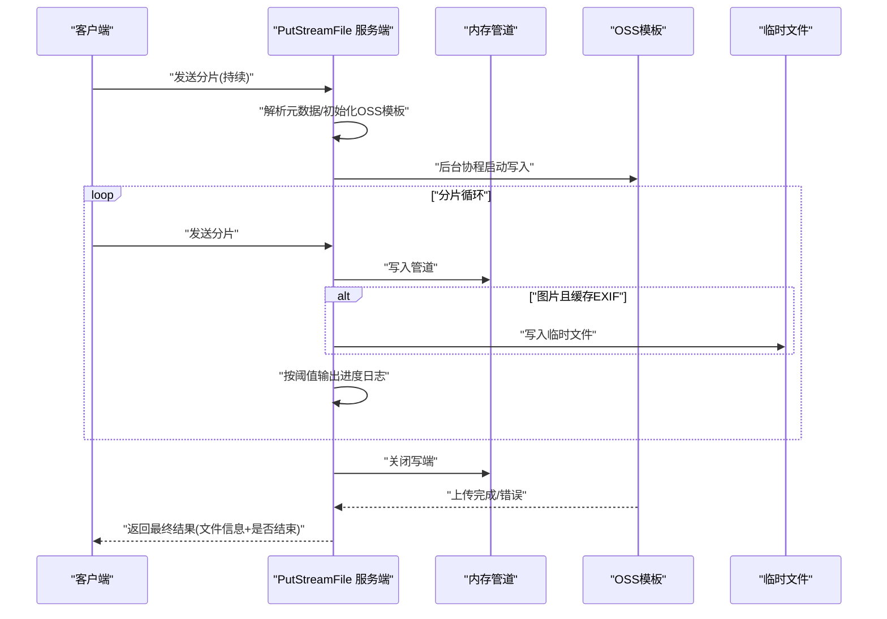
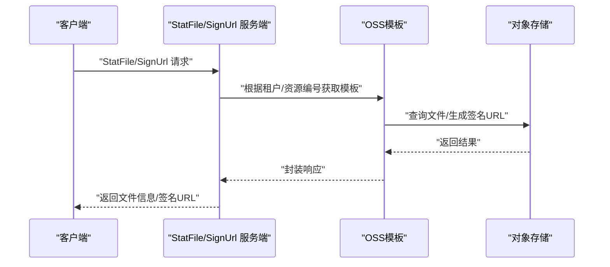
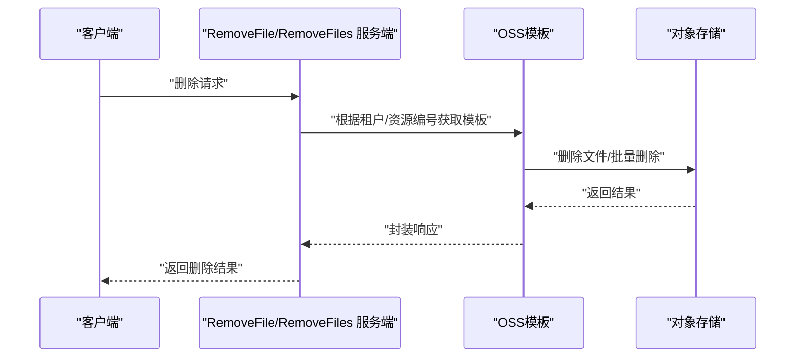
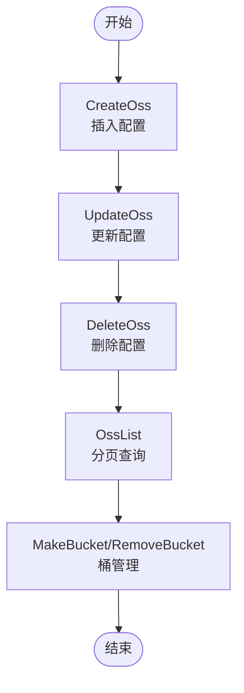
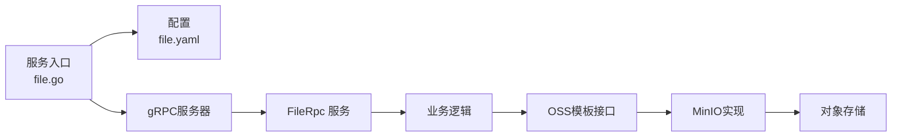

# 文件服务API

<cite>
**本文引用的文件**
- [file.proto](file://app/file/file.proto)
- [file.go](file://app/file/file.go)
- [file.yaml](file://app/file/etc/file.yaml)
- [putchunkfilelogic.go](file://app/file/internal/logic/putchunkfilelogic.go)
- [putstreamfilelogic.go](file://app/file/internal/logic/putstreamfilelogic.go)
- [statfilelogic.go](file://app/file/internal/logic/statfilelogic.go)
- [signurllogic.go](file://app/file/internal/logic/signurllogic.go)
- [removefilelogic.go](file://app/file/internal/logic/removefilelogic.go)
- [ossx.go](file://common/ossx/ossx.go)
- [minio_oss.go](file://common/ossx/minio_oss.go)
- [createosslogic.go](file://app/file/internal/logic/createosslogic.go)
- [updateosslogic.go](file://app/file/internal/logic/updateosslogic.go)
- [osslistlogic.go](file://app/file/internal/logic/osslistlogic.go)
</cite>

## 目录
1. [简介](#简介)
2. [项目结构](#项目结构)
3. [核心组件](#核心组件)
4. [架构总览](#架构总览)
5. [详细组件分析](#详细组件分析)
6. [依赖关系分析](#依赖关系分析)
7. [性能考量](#性能考量)
8. [故障排查指南](#故障排查指南)
9. [结论](#结论)
10. [附录](#附录)

## 简介
本文件服务API基于gRPC协议，提供文件上传、下载与管理能力，支持分片上传、流式传输、对象存储（OSS）集成、签名URL生成、文件元数据管理以及缩略图处理。系统通过统一的OSS模板抽象，当前实现适配MinIO，支持租户隔离与多存储配置。

## 项目结构
- 协议与服务定义位于 app/file/file.proto，包含服务接口、请求/响应消息体及OSS配置模型。
- 服务端入口位于 app/file/file.go，负责加载配置、注册服务、可选反射与Nacos注册。
- 业务逻辑位于 app/file/internal/logic 下，分别实现各RPC接口。
- 对象存储适配位于 common/ossx，提供OssTemplate接口与MinIO实现，支持桶管理、文件上传/下载/删除、签名URL与批量删除。

**图表来源**
- [file.proto:270-287](file://app/file/file.proto#L270-L287)
- [ossx.go:28-39](file://common/ossx/ossx.go#L28-L39)
- [minio_oss.go:20-243](file://common/ossx/minio_oss.go#L20-L243)

**章节来源**
- [file.go:28-71](file://app/file/file.go#L28-L71)
- [file.yaml:1-23](file://app/file/etc/file.yaml#L1-L23)

## 核心组件
- gRPC服务接口：Ping、OssDetail、OssList、CreateOss、UpdateOss、DeleteOss、MakeBucket、RemoveBucket、StatFile、SignUrl、PutFile、PutChunkFile（双向流）、PutStreamFile（单向流）、RemoveFile、RemoveFiles、CaptureVideoStream。
- 请求/响应消息体：Oss、File、ImageMeta、OssFile、各类Req/Res消息。
- OSS模板：OssTemplate接口与MinioTemplate实现，封装桶与文件操作、签名URL生成、批量删除等。
- 业务逻辑：各接口对应的逻辑实现，负责参数校验、OSS模板选择、文件元数据提取与缩略图生成。

**章节来源**
- [file.proto:17-287](file://app/file/file.proto#L17-L287)
- [ossx.go:28-152](file://common/ossx/ossx.go#L28-L152)
- [minio_oss.go:20-243](file://common/ossx/minio_oss.go#L20-L243)

## 架构总览
文件服务采用“协议定义 + 业务逻辑 + OSS模板”的分层设计。客户端通过gRPC调用，服务端根据租户与资源编号动态选择OSS配置，执行上传/查询/删除等操作，并返回统一的消息体。

**图表来源**
- [file.proto:270-287](file://app/file/file.proto#L270-L287)
- [ossx.go:109-151](file://common/ossx/ossx.go#L109-L151)
- [minio_oss.go:40-56](file://common/ossx/minio_oss.go#L40-L56)

## 详细组件分析

### 上传接口：PutChunkFile（分片上传，双向流）
- 接口特性
  - 双向流式传输，客户端发送分片数据，服务端实时返回进度与最终结果。
  - 支持内容类型探测、MD5计算、图片EXIF元数据提取、可选缩略图异步生成。
  - 支持租户隔离与路径前缀自定义。
- 参数结构
  - 元数据字段：租户ID、资源编号、存储桶、文件名、内容类型、文件总大小、是否缩略图、路径前缀。
  - 数据字段：分片内容（bytes）。
- 分片策略与断点续传
  - 服务端维护写入进度（累计字节数），在初始化阶段设置目标总大小；当累计大小达到目标时结束。
  - 断点续传：客户端可在上次累计大小基础上继续发送，服务端按累计大小判断是否结束。
- 处理流程
  - 初始化：解析元数据，动态获取OSS模板，启动后台协程将管道数据写入OSS。
  - 接收循环：接收分片，写入管道与临时文件（图片场景缓存EXIF），实时发送进度。
  - 结束：关闭写端，等待上传完成，必要时提取EXIF并异步生成缩略图，返回最终结果。

**图表来源**
- [putchunkfilelogic.go:38-269](file://app/file/internal/logic/putchunkfilelogic.go#L38-L269)

**章节来源**
- [file.proto:191-207](file://app/file/file.proto#L191-L207)
- [putchunkfilelogic.go:38-269](file://app/file/internal/logic/putchunkfilelogic.go#L38-L269)

### 上传接口：PutStreamFile（流式上传，单向流）
- 接口特性
  - 单向流，客户端持续发送分片直至EOF，服务端一次性返回最终结果。
  - 支持内容类型探测、MD5计算、图片EXIF与缩略图处理。
  - 带进度日志阈值（默认100MB），便于监控大文件上传。
- 参数结构
  - 元数据：租户ID、资源编号、存储桶、文件名、内容类型、文件总大小、是否缩略图、路径前缀。
  - 数据：分片内容（bytes）。
- 处理流程
  - 初始化：解析元数据，动态获取OSS模板，启动后台协程写入OSS。
  - 接收循环：接收分片，写入管道与临时文件（图片场景），按阈值输出进度日志。
  - 结束：关闭写端，等待上传完成，提取EXIF并异步生成缩略图，返回最终结果。

**图表来源**
- [putstreamfilelogic.go:43-286](file://app/file/internal/logic/putstreamfilelogic.go#L43-L286)

**章节来源**
- [file.proto:209-225](file://app/file/file.proto#L209-L225)
- [putstreamfilelogic.go:43-286](file://app/file/internal/logic/putstreamfilelogic.go#L43-L286)

### 文件元数据与签名：StatFile、SignUrl
- StatFile
  - 查询文件元信息（大小、上传时间、类型等），可选生成签名URL。
  - 支持过期时间参数，默认1小时。
- SignUrl
  - 生成带过期时间的签名URL，便于直链下载。
  - 支持过期时间参数，默认1小时。

**图表来源**
- [statfilelogic.go:29-58](file://app/file/internal/logic/statfilelogic.go#L29-L58)
- [signurllogic.go:29-60](file://app/file/internal/logic/signurllogic.go#L29-L60)

**章节来源**
- [file.proto:151-174](file://app/file/file.proto#L151-L174)
- [statfilelogic.go:29-58](file://app/file/internal/logic/statfilelogic.go#L29-L58)
- [signurllogic.go:29-60](file://app/file/internal/logic/signurllogic.go#L29-L60)

### 文件删除：RemoveFile、RemoveFiles
- RemoveFile：删除单个文件。
- RemoveFiles：批量删除文件，返回每个文件的删除结果（包含错误）。

**图表来源**
- [removefilelogic.go:26-38](file://app/file/internal/logic/removefilelogic.go#L26-L38)
- [ossx.go:38-39](file://common/ossx/ossx.go#L38-L39)
- [minio_oss.go:164-204](file://common/ossx/minio_oss.go#L164-L204)

**章节来源**
- [file.proto:240-256](file://app/file/file.proto#L240-L256)
- [removefilelogic.go:26-38](file://app/file/internal/logic/removefilelogic.go#L26-L38)

### OSS集成：CreateOss、UpdateOss、DeleteOss、OssList、MakeBucket、RemoveBucket
- CreateOss：创建OSS配置（租户ID、分类、资源编号、Endpoint、AK/SK、BucketName、AppId、Region、备注）。
- UpdateOss：更新OSS配置（含状态）。
- DeleteOss：删除指定ID的OSS配置。
- OssList：分页查询OSS配置，支持按租户ID与分类过滤。
- MakeBucket：在指定租户下创建存储桶（桶名规则受租户模式影响）。
- RemoveBucket：删除存储桶。

**图表来源**
- [createosslogic.go:26-45](file://app/file/internal/logic/createosslogic.go#L26-L45)
- [updateosslogic.go:26-45](file://app/file/internal/logic/updateosslogic.go#L26-L45)
- [osslistlogic.go:27-62](file://app/file/internal/logic/osslistlogic.go#L27-L62)
- [ossx.go:28-39](file://common/ossx/ossx.go#L28-L39)
- [minio_oss.go:26-38](file://common/ossx/minio_oss.go#L26-L38)

**章节来源**
- [file.proto:90-149](file://app/file/file.proto#L90-L149)
- [createosslogic.go:26-45](file://app/file/internal/logic/createosslogic.go#L26-L45)
- [updateosslogic.go:26-45](file://app/file/internal/logic/updateosslogic.go#L26-L45)
- [osslistlogic.go:27-62](file://app/file/internal/logic/osslistlogic.go#L27-L62)

### 文件下载：GetFile
- GetFile：返回文件名、内容类型与路径，可用于后续签名或直接访问（取决于存储策略）。

**章节来源**
- [file.proto:227-238](file://app/file/file.proto#L227-L238)

### 视频流截图：CaptureVideoStream
- CaptureVideoStream：从视频流URL抓取图片并保存至OSS，返回文件信息。

**章节来源**
- [file.proto:257-268](file://app/file/file.proto#L257-L268)

## 依赖关系分析
- 服务端入口依赖配置与上下文，注册FileRpc服务并可选开启反射与Nacos注册。
- 业务逻辑依赖OSS模板，通过租户ID与资源编号动态选择模板，模板内部封装MinIO客户端。
- OSS模板接口抽象了桶与文件操作，当前实现为MinIO，未来可扩展其他云厂商。

**图表来源**
- [file.go:28-71](file://app/file/file.go#L28-L71)
- [file.yaml:1-23](file://app/file/etc/file.yaml#L1-L23)
- [ossx.go:28-152](file://common/ossx/ossx.go#L28-L152)
- [minio_oss.go:214-243](file://common/ossx/minio_oss.go#L214-L243)

**章节来源**
- [file.go:28-71](file://app/file/file.go#L28-L71)
- [ossx.go:109-151](file://common/ossx/ossx.go#L109-L151)

## 性能考量
- 流式上传
  - 使用内存管道与并发写入，避免大文件落盘，降低I/O开销。
  - PutStreamFile提供进度日志阈值，便于监控大文件传输。
- 缩略图处理
  - 异步任务队列生成缩略图，避免阻塞主上传流程。
- 桶命名与租户隔离
  - 在租户模式下桶名前缀为“租户ID-”，减少冲突并提升隔离性。
- 并发与连接
  - OSS模板池按租户缓存，减少重复初始化成本。

[本节为通用性能建议，不直接分析具体文件]

## 故障排查指南
- 上传中断或部分成功
  - 检查客户端流是否正常关闭，服务端是否正确处理EOF与错误。
  - 关注分片大小与累计进度，确认目标总大小与实际写入一致。
- 签名URL无效
  - 确认过期时间设置合理，存储桶存在且文件已上传。
  - 校验租户ID与资源编号是否匹配。
- 删除失败
  - 检查文件名与存储桶是否正确，确认对象存在。
  - 批量删除时关注返回的逐项错误。
- OSS配置问题
  - 确认Endpoint、AK/SK、BucketName正确，租户模式下的桶名规则。
  - 如需创建桶，先执行MakeBucket。

**章节来源**
- [putchunkfilelogic.go:196-210](file://app/file/internal/logic/putchunkfilelogic.go#L196-L210)
- [putstreamfilelogic.go:213-220](file://app/file/internal/logic/putstreamfilelogic.go#L213-L220)
- [statfilelogic.go:44-54](file://app/file/internal/logic/statfilelogic.go#L44-L54)
- [signurllogic.go:49-53](file://app/file/internal/logic/signurllogic.go#L49-L53)
- [removefilelogic.go:33-36](file://app/file/internal/logic/removefilelogic.go#L33-L36)

## 结论
该文件服务API以清晰的gRPC协议与分层架构实现了上传、下载、管理与OSS集成能力。通过流式与分片上传、签名URL与缩略图处理，满足大文件与多媒体场景需求；通过租户隔离与模板抽象，具备良好的扩展性与可维护性。

[本节为总结性内容，不直接分析具体文件]

## 附录

### API一览与要点
- 上传类
  - PutChunkFile：双向流，适合高延迟网络与断点续传。
  - PutStreamFile：单向流，适合稳定网络与快速上传。
- 元数据与签名
  - StatFile：查询文件信息，可选生成签名URL。
  - SignUrl：生成签名URL。
- 删除类
  - RemoveFile：删除单个文件。
  - RemoveFiles：批量删除文件。
- OSS配置与桶管理
  - CreateOss/UpdateOss/DeleteOss/OssList：配置管理。
  - MakeBucket/RemoveBucket：桶管理。
- 下载与截图
  - GetFile：返回文件元信息。
  - CaptureVideoStream：从视频流抓取图片。

**章节来源**
- [file.proto:270-287](file://app/file/file.proto#L270-L287)

### 客户端调用示例（步骤说明）
- 大文件分片上传（PutChunkFile）
  - 步骤：建立gRPC连接，创建双向流；先发送包含元数据的首包；随后循环发送分片内容；接收进度与最终结果。
  - 注意：客户端应根据累计大小决定是否断点续传。
- 大文件流式上传（PutStreamFile）
  - 步骤：建立单向流；持续发送分片直至EOF；等待服务端返回最终结果。
  - 注意：关注进度日志阈值，确保网络稳定。
- 签名URL生成（SignUrl）
  - 步骤：构造请求（租户ID、资源编号、存储桶、文件名、过期时间）；调用接口；获取签名URL。
- 文件删除（RemoveFile/RemoveFiles）
  - 步骤：构造请求（租户ID、资源编号、存储桶、文件名/文件名列表）；调用接口；检查返回结果。

[本节为概念性示例说明，不直接分析具体文件]