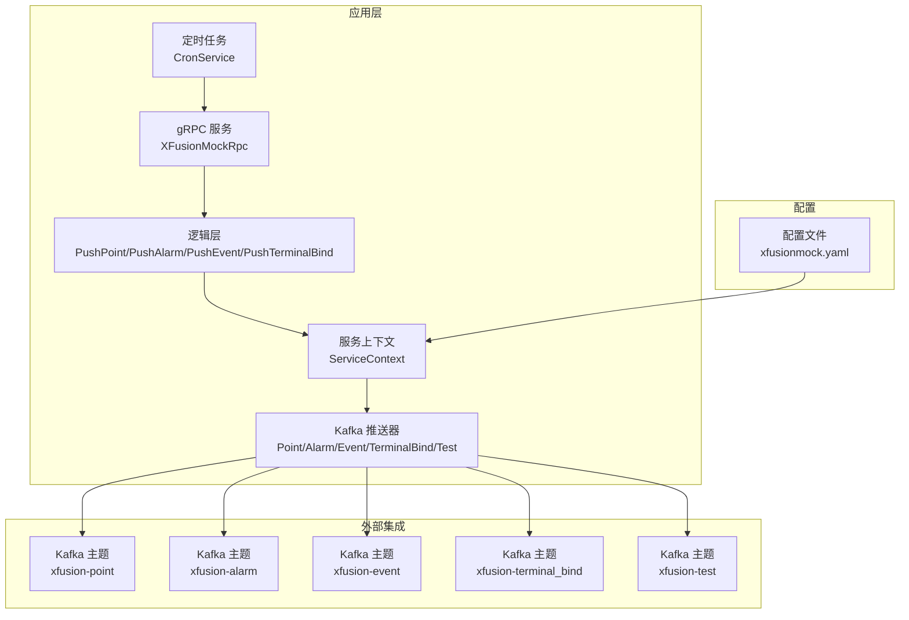
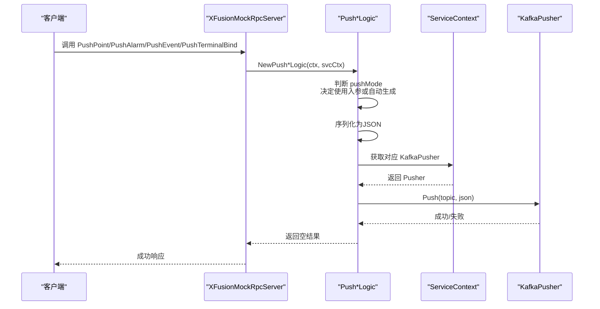
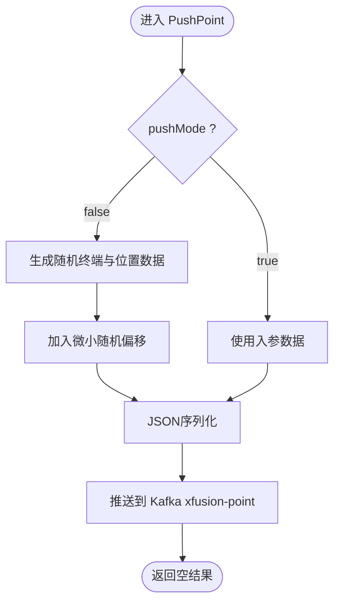
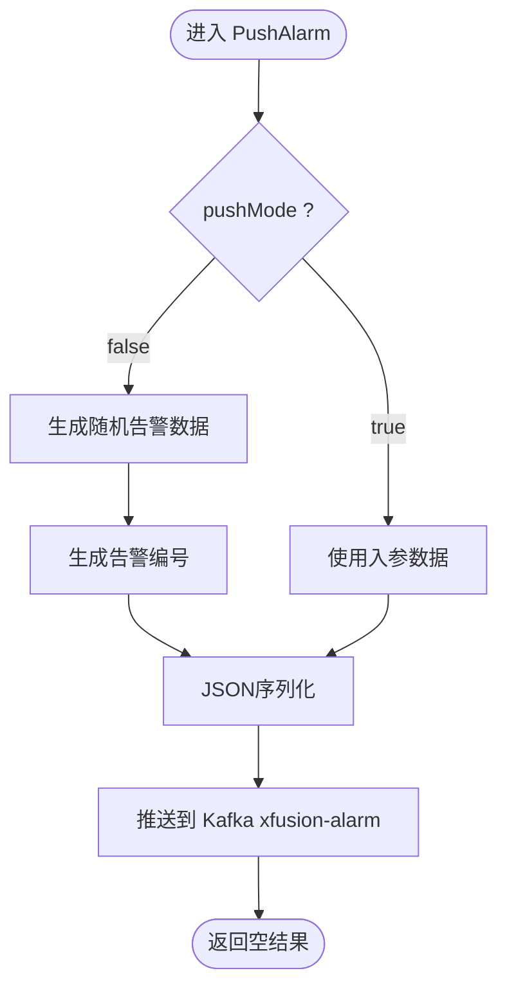
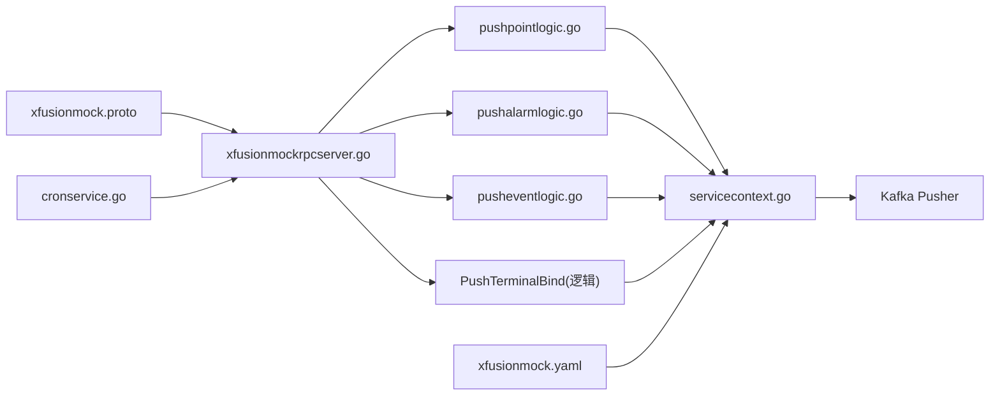

# 模拟数据服务API

<cite>
**本文引用的文件**
- [xfusionmock.proto](file://app/xfusionmock/xfusionmock.proto)
- [xfusionmock.go](file://app/xfusionmock/xfusionmock.go)
- [xfusionmock.yaml](file://app/xfusionmock/etc/xfusionmock.yaml)
- [servicecontext.go](file://app/xfusionmock/internal/svc/servicecontext.go)
- [xfusionmockrpcserver.go](file://app/xfusionmock/internal/server/xfusionmockrpcserver.go)
- [pushpointlogic.go](file://app/xfusionmock/internal/logic/pushpointlogic.go)
- [pushalarmlogic.go](file://app/xfusionmock/internal/logic/pushalarmlogic.go)
- [pusheventlogic.go](file://app/xfusionmock/internal/logic/pusheventlogic.go)
- [cronservice.go](file://app/xfusionmock/cron/cronservice.go)
- [test.go](file://app/xfusionmock/kafka/test.go)
- [devicepointmappingmodel.go](file://model/devicepointmappingmodel.go)
- [devicepointmappingmodel_gen.go](file://model/devicepointmappingmodel_gen.go)
</cite>

## 目录
1. [简介](#简介)
2. [项目结构](#项目结构)
3. [核心组件](#核心组件)
4. [架构总览](#架构总览)
5. [详细组件分析](#详细组件分析)
6. [依赖关系分析](#依赖关系分析)
7. [性能考虑](#性能考虑)
8. [故障排查指南](#故障排查指南)
9. [结论](#结论)
10. [附录](#附录)

## 简介
本文件为“模拟数据服务”的gRPC API详细文档，覆盖告警模拟、事件模拟、终端绑定以及点位数据推送等能力。文档从接口定义、数据模型、调用流程、配置项到性能与运维方面进行全面说明，并提供可直接落地的客户端使用建议与最佳实践。

## 项目结构
该服务位于应用目录 app/xfusionmock 下，采用标准的 go-zero 微服务分层：proto 定义、逻辑层、服务上下文、定时任务与 Kafka 推送。配置集中在 etc/xfusionmock.yaml 中，支持多 Kafka 主题分流与定时推送策略。

图表来源
- [xfusionmockrpcserver.go:15-55](file://app/xfusionmock/internal/server/xfusionmockrpcserver.go#L15-L55)
- [servicecontext.go:8-26](file://app/xfusionmock/internal/svc/servicecontext.go#L8-L26)
- [cronservice.go:12-54](file://app/xfusionmock/cron/cronservice.go#L12-L54)
- [xfusionmock.yaml:1-39](file://app/xfusionmock/etc/xfusionmock.yaml#L1-L39)

章节来源
- [xfusionmock.go:28-58](file://app/xfusionmock/xfusionmock.go#L28-L58)
- [xfusionmock.yaml:1-39](file://app/xfusionmock/etc/xfusionmock.yaml#L1-L39)

## 核心组件
- gRPC 服务接口：Ping、PushTest、PushPoint、PushAlarm、PushEvent、PushTerminalBind
- 数据模型：TerminalData、AlarmData、EventData、TerminalBind 及其嵌套结构
- 逻辑层：各接口对应的生成与推送逻辑
- 服务上下文：封装 Kafka 推送器与配置
- 定时任务：按配置周期自动触发各类推送
- 配置：监听地址、日志、Kafka 连接与主题、定时表达式、终端映射

章节来源
- [xfusionmock.proto:274-303](file://app/xfusionmock/xfusionmock.proto#L274-L303)
- [xfusionmockrpcserver.go:26-54](file://app/xfusionmock/internal/server/xfusionmockrpcserver.go#L26-L54)
- [servicecontext.go:8-26](file://app/xfusionmock/internal/svc/servicecontext.go#L8-L26)
- [cronservice.go:24-49](file://app/xfusionmock/cron/cronservice.go#L24-L49)

## 架构总览
服务通过 gRPC 提供统一入口，逻辑层根据请求中的 pushMode 决定使用传入数据还是自动生成数据；随后将 JSON 序列化后的消息推送到对应 Kafka 主题，供下游消费。

图表来源
- [xfusionmockrpcserver.go:36-54](file://app/xfusionmock/internal/server/xfusionmockrpcserver.go#L36-L54)
- [pushpointlogic.go:29-87](file://app/xfusionmock/internal/logic/pushpointlogic.go#L29-L87)
- [pushalarmlogic.go:69-120](file://app/xfusionmock/internal/logic/pushalarmlogic.go#L69-L120)
- [pusheventlogic.go:30-68](file://app/xfusionmock/internal/logic/pusheventlogic.go#L30-L68)
- [servicecontext.go:17-26](file://app/xfusionmock/internal/svc/servicecontext.go#L17-L26)

## 详细组件分析

### 接口与数据模型总览
- 通用请求/响应包装：Req/Res、ReqPushTest/ResPushTest
- 推送接口：
  - PushPoint：推送终端点位数据
  - PushAlarm：推送告警数据
  - PushEvent：推送事件数据
  - PushTerminalBind：推送终端绑定/解绑动作
- 数据模型要点：
  - pushMode：布尔值，false 表示自动生成，true 表示使用请求体中的数据
  - 各数据模型包含时间戳、位置、状态、围栏、终端信息等字段，均以 JSON 名称标注

章节来源
- [xfusionmock.proto:26-303](file://app/xfusionmock/xfusionmock.proto#L26-L303)

### PushPoint 终端点位推送
- 功能：推送终端实时位置、状态、建筑信息等
- pushMode=false 时，随机选择终端号并生成带偏移的位置、速度、方向、卫星数、GGA 状态、楼层与电量等
- 时间戳：epochTime 使用毫秒级 Unix 时间
- Kafka 主题：xfusion-point
- 生成策略：基于配置中的终端列表与绑定映射，结合随机种子生成近似真实轨迹

图表来源
- [pushpointlogic.go:29-87](file://app/xfusionmock/internal/logic/pushpointlogic.go#L29-L87)
- [xfusionmock.yaml:33-38](file://app/xfusionmock/etc/xfusionmock.yaml#L33-L38)

章节来源
- [pushpointlogic.go:29-87](file://app/xfusionmock/internal/logic/pushpointlogic.go#L29-L87)

### PushAlarm 告警推送
- 功能：推送各类告警，包含告警类型、级别、起止时间、围栏、终端列表与主体信息
- pushMode=false 时，随机生成告警编号（含日期与递增序号）、告警类型与名称映射、起止时间、围栏列表、终端号与主体信息
- 告警编号规则：ALARM-YYYYMMDD-XXXX
- Kafka 主题：xfusion-alarm

图表来源
- [pushalarmlogic.go:69-120](file://app/xfusionmock/internal/logic/pushalarmlogic.go#L69-L120)
- [pushalarmlogic.go:122-133](file://app/xfusionmock/internal/logic/pushalarmlogic.go#L122-L133)

章节来源
- [pushalarmlogic.go:69-157](file://app/xfusionmock/internal/logic/pushalarmlogic.go#L69-L157)

### PushEvent 事件推送
- 功能：推送事件，如进入围栏等
- pushMode=false 时，生成事件标题、事件码、服务端与终端时间戳、终端与位置信息
- Kafka 主题：xfusion-event

章节来源
- [pusheventlogic.go:30-68](file://app/xfusionmock/internal/logic/pusheventlogic.go#L30-L68)

### PushTerminalBind 终端绑定推送
- 功能：推送终端绑定/解绑动作，包含绑定标签、动作类型、终端ID/编号、人员/车辆信息、操作时间等
- 数据模型：TerminalBind
- Kafka 主题：xfusion-terminal_bind

章节来源
- [xfusionmock.proto:83-115](file://app/xfusionmock/xfusionmock.proto#L83-L115)

### Ping 与 PushTest
- Ping：基础连通性测试
- PushTest：测试推送，用于验证 Kafka 通道可用性

章节来源
- [xfusionmockrpcserver.go:26-34](file://app/xfusionmock/internal/server/xfusionmockrpcserver.go#L26-L34)
- [xfusionmock.proto:274-298](file://app/xfusionmock/xfusionmock.proto#L274-L298)

### 服务上下文与 Kafka 推送器
- ServiceContext 统一封装 Kafka 推送器：测试、点位、告警、事件、终端绑定
- 通过配置文件加载 Kafka Broker、Topic、消费者与处理器数量

章节来源
- [servicecontext.go:8-26](file://app/xfusionmock/internal/svc/servicecontext.go#L8-L26)
- [xfusionmock.yaml:6-31](file://app/xfusionmock/etc/xfusionmock.yaml#L6-L31)

### 定时任务与频率控制
- CronService 基于 cron(v3) 秒级调度，按配置周期自动触发各类推送
- 配置项：
  - PushCron：通用推送周期
  - PushCronPoint：点位推送周期
- 作用：在无客户端高频调用场景下维持稳定数据流

章节来源
- [cronservice.go:24-49](file://app/xfusionmock/cron/cronservice.go#L24-L49)
- [xfusionmock.yaml:31-32](file://app/xfusionmock/etc/xfusionmock.yaml#L31-L32)

### 数据格式标准化与序列化
- 请求体统一为 JSON 字符串，字段名遵循 proto 的 json_name 标注
- 时间戳统一使用毫秒级 Unix 时间
- 序列化采用标准 JSON 编码，便于下游解析

章节来源
- [pushpointlogic.go:81-86](file://app/xfusionmock/internal/logic/pushpointlogic.go#L81-L86)
- [pushalarmlogic.go:113-118](file://app/xfusionmock/internal/logic/pushalarmlogic.go#L113-L118)
- [pusheventlogic.go:62-67](file://app/xfusionmock/internal/logic/pusheventlogic.go#L62-L67)

### 终端绑定与状态管理
- 配置中维护终端号到业务编号的映射，用于点位推送时填充 TrackNo
- 终端绑定接口支持 BIND/UNBIND 动作，便于模拟设备与业务对象的映射关系

章节来源
- [xfusionmock.yaml:33-38](file://app/xfusionmock/etc/xfusionmock.yaml#L33-L38)
- [xfusionmock.proto:93-115](file://app/xfusionmock/xfusionmock.proto#L93-L115)

### 设备点位映射与缓存（扩展能力）
- model 层提供设备点位映射模型与缓存封装，支持按 tag_station/coa/ioa 快速查找与缓存命中
- 可用于在生成点位数据时补充更丰富的设备元数据

章节来源
- [devicepointmappingmodel.go:30-107](file://model/devicepointmappingmodel.go#L30-L107)
- [devicepointmappingmodel_gen.go:59-83](file://model/devicepointmappingmodel_gen.go#L59-L83)

## 依赖关系分析
- gRPC 服务依赖逻辑层；逻辑层依赖 ServiceContext；ServiceContext 依赖 Kafka 推送器
- 定时任务独立于 gRPC，但共享逻辑层与 ServiceContext
- 配置集中于 yaml，贯穿启动、服务上下文初始化与定时任务调度

图表来源
- [xfusionmockrpcserver.go:15-55](file://app/xfusionmock/internal/server/xfusionmockrpcserver.go#L15-L55)
- [pushpointlogic.go:15-27](file://app/xfusionmock/internal/logic/pushpointlogic.go#L15-L27)
- [pushalarmlogic.go:55-67](file://app/xfusionmock/internal/logic/pushalarmlogic.go#L55-L67)
- [pusheventlogic.go:16-28](file://app/xfusionmock/internal/logic/pusheventlogic.go#L16-L28)
- [servicecontext.go:8-26](file://app/xfusionmock/internal/svc/servicecontext.go#L8-L26)
- [cronservice.go:12-22](file://app/xfusionmock/cron/cronservice.go#L12-L22)
- [xfusionmock.yaml:1-39](file://app/xfusionmock/etc/xfusionmock.yaml#L1-L39)

## 性能考虑
- Kafka 分区与副本：确保各主题分区充足，避免单点瓶颈
- 生产者批处理：合理设置批次大小与延迟，提升吞吐
- 消费者并发：根据下游处理能力调整消费者数量与处理器数量
- 定时任务粒度：根据业务峰值与资源情况调整周期，避免瞬时洪峰
- 日志与指标：开启必要日志与监控，及时发现异常

## 故障排查指南
- gRPC 连接问题：确认 ListenOn 地址与防火墙放行
- Kafka 连接失败：检查 Broker 地址、Topic 存在性与权限
- 推送失败：查看逻辑层 JSON 序列化与 Kafka 推送返回值
- 定时任务未执行：检查 Cron 表达式与服务启动日志
- 数据不一致：核对 pushMode 与入参数据，确认时间戳与位置偏移

章节来源
- [xfusionmock.go:39-57](file://app/xfusionmock/xfusionmock.go#L39-L57)
- [test.go:19-22](file://app/xfusionmock/kafka/test.go#L19-L22)

## 结论
该模拟数据服务通过清晰的 gRPC 接口与可配置的 Kafka 推送链路，提供了点位、告警、事件与终端绑定的完整模拟能力。配合定时任务与灵活的 pushMode 控制，可在开发、测试与演示环境中快速构建稳定的数据流。

## 附录

### 客户端使用建议（不含代码示例）
- 连接方式
  - 使用标准 gRPC 客户端连接服务监听地址
  - 如需 HTTP/JSON 访问，可参考 proto 中的 openapi 注解与路由配置
- 数据生成策略
  - pushMode=false：由服务自动生成随机数据，适合快速验证
  - pushMode=true：自行构造数据模型，满足定制化场景
- 频率控制
  - 通过定时任务或客户端循环调用控制推送节奏
  - 建议在高峰期降低频率，避免 Kafka 压力过大
- 批量推送
  - 建议将多个请求合并为批量任务，减少网络往返
  - 注意单次请求体大小限制与 Kafka 生产者配置
- 数据格式与时间戳
  - 统一使用毫秒级 Unix 时间戳
  - 字段命名遵循 proto 的 json_name 标注
- 生命周期与清理
  - 告警与事件建议在结束或过期后清理状态字段
  - 终端绑定建议定期校验映射关系，避免脏数据
- 性能优化
  - 合理设置 Kafka 分区与副本
  - 消费端按主题并行处理，提高吞吐
  - 在高并发场景下启用压缩与批处理