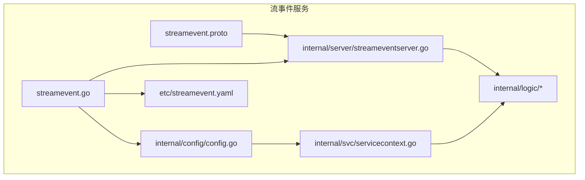
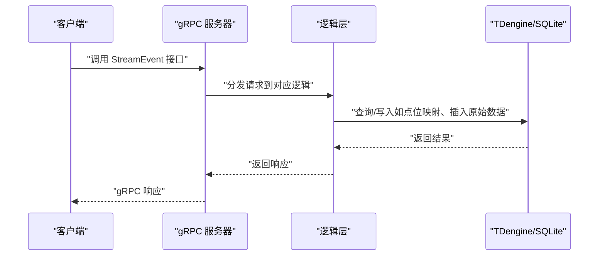
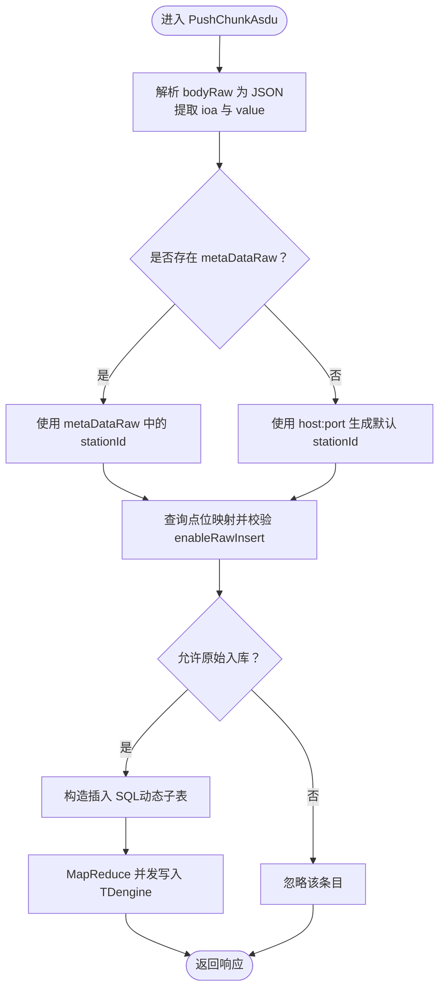
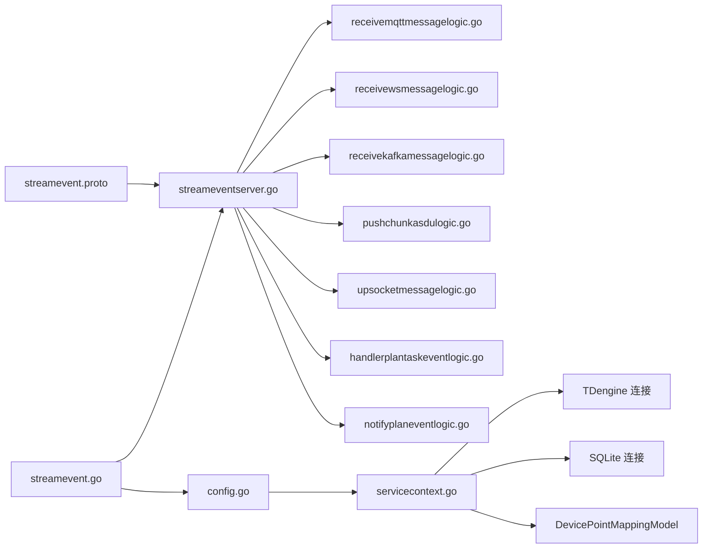

# 流事件服务API

<cite>
**本文引用的文件**
- [streamevent.proto](file://facade/streamevent/streamevent.proto)
- [streamevent.go](file://facade/streamevent/streamevent.go)
- [streamevent.yaml](file://facade/streamevent/etc/streamevent.yaml)
- [config.go](file://facade/streamevent/internal/config/config.go)
- [servicecontext.go](file://facade/streamevent/internal/svc/servicecontext.go)
- [streameventserver.go](file://facade/streamevent/internal/server/streameventserver.go)
- [receivekafkamessagelogic.go](file://facade/streamevent/internal/logic/receivekafkamessagelogic.go)
- [receivemqttmessagelogic.go](file://facade/streamevent/internal/logic/receivemqttmessagelogic.go)
- [receivewsmessagelogic.go](file://facade/streamevent/internal/logic/receivewsmessagelogic.go)
- [pushchunkasdulogic.go](file://facade/streamevent/internal/logic/pushchunkasdulogic.go)
- [upsocketmessagelogic.go](file://facade/streamevent/internal/logic/upsocketmessagelogic.go)
- [handlerplantaskeventlogic.go](file://facade/streamevent/internal/logic/handlerplantaskeventlogic.go)
- [notifyplaneventlogic.go](file://facade/streamevent/internal/logic/notifyplaneventlogic.go)
</cite>

## 目录
1. [简介](#简介)
2. [项目结构](#项目结构)
3. [核心组件](#核心组件)
4. [架构总览](#架构总览)
5. [详细组件分析](#详细组件分析)
6. [依赖分析](#依赖分析)
7. [性能考虑](#性能考虑)
8. [故障排查指南](#故障排查指南)
9. [结论](#结论)
10. [附录](#附录)

## 简介
本文件为流事件服务的 gRPC API 详细文档，覆盖统一事件流处理相关的全部接口，包括：
- 事件接收与聚合：MQTT、WebSocket、Kafka
- 协议转换与存储：IEC 60870-5-104（ASDU）消息解析、入库与点位映射
- 跨语言支持：通过 proto 定义与多语言生成（Go、Java 等）
- 事件聚合：批量处理、去重与排序能力说明
- 客户端示例：事件订阅、批量处理与错误恢复建议
- 可靠性与一致性：顺序处理、幂等性与延迟重试策略
- 过滤与路由：基于主题/标签/扩展字段的路由策略
- 性能调优：批处理、并发与数据库写入优化

## 项目结构
流事件服务位于 facade/streamevent，采用 goctl 生成的 go-zero RPC 架构，包含 proto 定义、服务端、逻辑层与配置。

图表来源
- [streamevent.proto:1-581](file://facade/streamevent/streamevent.proto#L1-L581)
- [streameventserver.go:1-67](file://facade/streamevent/internal/server/streameventserver.go#L1-L67)
- [config.go:1-25](file://facade/streamevent/internal/config/config.go#L1-L25)
- [servicecontext.go:1-33](file://facade/streamevent/internal/svc/servicecontext.go#L1-L33)
- [streamevent.go:1-72](file://facade/streamevent/streamevent.go#L1-L72)
- [streamevent.yaml:1-28](file://facade/streamevent/etc/streamevent.yaml#L1-L28)

章节来源
- [streamevent.proto:1-581](file://facade/streamevent/streamevent.proto#L1-L581)
- [streameventserver.go:1-67](file://facade/streamevent/internal/server/streameventserver.go#L1-L67)
- [config.go:1-25](file://facade/streamevent/internal/config/config.go#L1-L25)
- [servicecontext.go:1-33](file://facade/streamevent/internal/svc/servicecontext.go#L1-L33)
- [streamevent.go:1-72](file://facade/streamevent/streamevent.go#L1-L72)
- [streamevent.yaml:1-28](file://facade/streamevent/etc/streamevent.yaml#L1-L28)

## 核心组件
- gRPC 服务：StreamEvent，提供事件接收、协议转换与计划任务事件处理接口
- 服务端：将 gRPC 请求转发到对应的逻辑层
- 逻辑层：实现具体业务逻辑，如 IEC104 消息入库、点位映射查询、计划任务回调
- 服务上下文：封装数据库连接（TDengine、SQLite）、模型与配置
- 配置：监听地址、日志级别、Nacos 注册、超时、中间件统计忽略方法等

章节来源
- [streameventserver.go:15-67](file://facade/streamevent/internal/server/streameventserver.go#L15-L67)
- [servicecontext.go:14-32](file://facade/streamevent/internal/svc/servicecontext.go#L14-L32)
- [config.go:5-24](file://facade/streamevent/internal/config/config.go#L5-L24)
- [streamevent.yaml:1-28](file://facade/streamevent/etc/streamevent.yaml#L1-L28)

## 架构总览

图表来源
- [streameventserver.go:26-66](file://facade/streamevent/internal/server/streameventserver.go#L26-L66)
- [pushchunkasdulogic.go:118-222](file://facade/streamevent/internal/logic/pushchunkasdulogic.go#L118-L222)
- [servicecontext.go:26-30](file://facade/streamevent/internal/svc/servicecontext.go#L26-L30)

## 详细组件分析

### gRPC 服务与接口总览
- 服务名：StreamEvent
- 主要接口：
  - 接收MQTT消息：ReceiveMQTTMessage
  - 接收WebSocket消息：ReceiveWSMessage
  - 接收Kafka消息：ReceiveKafkaMessage
  - 推送IEC104（ASDU）消息：PushChunkAsdu
  - 上行Socket消息：UpSocketMessage
  - 处理计划任务事件：HandlerPlanTaskEvent
  - 通知计划任务事件：NotifyPlanEvent

章节来源
- [streamevent.proto:10-25](file://facade/streamevent/streamevent.proto#L10-L25)

### 参数与数据模型

#### 事件接收类
- ReceiveMQTTMessageReq
  - 字段：repeated MqttMessage
- MqttMessage
  - 字段：sessionId、msgId、topicTemplate、topic、payload、sendTime
- ReceiveWSMessageReq
  - 字段：sessionId、msgId、payload、sendTime
- ReceiveKafkaMessageReq
  - 字段：repeated KafkaMessage
- KafkaMessage
  - 字段：sessionId、topic、group、key、value、sendTime

章节来源
- [streamevent.proto:27-80](file://facade/streamevent/streamevent.proto#L27-L80)

#### IEC104（ASDU）消息类
- PushChunkAsduReq
  - 字段：tId、repeated MsgBody
- MsgBody
  - 字段：msgId、host、port、asdu、typeId、dataType、coa、bodyRaw、time、metaDataRaw、pm（PointMapping）
- PointMapping
  - 字段：deviceId、deviceName、tdTableType、ext1-ext5
- 信息体类型（示例）
  - SinglePointInfo、DoublePointInfo、MeasuredValueScaledInfo、MeasuredValueNormalInfo、StepPositionInfo、BitString32Info、MeasuredValueFloatInfo、BinaryCounterReadingInfo、EventOfProtectionEquipmentInfo、PackedStartEventsOfProtectionEquipmentInfo、PackedOutputCircuitInfo、PackedSinglePointWithSCDInfo

章节来源
- [streamevent.proto:83-447](file://facade/streamevent/streamevent.proto#L83-L447)

#### 计划任务事件类
- HandlerPlanTaskEventReq
  - 字段：plan（PbPlan）、id、planPk、planId、batchPk、batchId、execId、itemId、itemType、itemName、itemRowId、PointId、payload、planTriggerTime、lastTriggerTime、lastResult、lastMessage、lastReason
- PbPlan
  - 字段：createTime、updateTime、createUser、updateUser、deptCode、id、planId、planName、type、groupId、description、startTime、endTime、ext1-ext5
- HandlerPlanTaskEventRes
  - 字段：execResult、message、reason、delayConfig（PbDelayConfig）
- PbDelayConfig
  - 字段：nextTriggerTime、delayReason
- NotifyPlanEventReq
  - 字段：eventType（枚举）、planId、planType、batchId、attributes（map）

章节来源
- [streamevent.proto:461-581](file://facade/streamevent/streamevent.proto#L461-L581)

### 事件聚合与协议转换

#### IEC104（ASDU）消息入库流程
- 输入：PushChunkAsduReq（包含多个 MsgBody）
- 处理步骤：
  1) 解析 MsgBody.bodyRaw 为 JSON，提取 ioa 与 value
  2) 从 MsgBody.metaDataRaw 提取 stationId，若存在则覆盖默认 stationId
  3) 使用 DevicePointMappingModel 查询点位映射，校验是否允许原始入库
  4) 构造 TDengine 插入 SQL（按 stationId、coa、ioa 动态子表），写入 raw_point_data
  5) 并发 MapReduce 批量写入，统计忽略与插入数量
- 输出：PushChunkAsduRes（空）

图表来源
- [pushchunkasdulogic.go:118-222](file://facade/streamevent/internal/logic/pushchunkasdulogic.go#L118-L222)

章节来源
- [pushchunkasdulogic.go:1-223](file://facade/streamevent/internal/logic/pushchunkasdulogic.go#L1-L223)

### 事件接收与处理

#### WebSocket 事件
- 接口：ReceiveWSMessage
- 逻辑：当前返回空响应，实际可扩展为消息路由、鉴权与下行下发

章节来源
- [receivewsmessagelogic.go:1-32](file://facade/streamevent/internal/logic/receivewsmessagelogic.go#L1-L32)

#### MQTT 事件
- 接口：ReceiveMQTTMessage
- 逻辑：当前返回空响应，可扩展为批量聚合、去重与路由

章节来源
- [receivemqttmessagelogic.go:1-32](file://facade/streamevent/internal/logic/receivemqttmessagelogic.go#L1-L32)

#### Kafka 事件
- 接口：ReceiveKafkaMessage
- 逻辑：当前返回空响应，可扩展为批量消费、幂等与重试

章节来源
- [receivekafkamessagelogic.go:1-32](file://facade/streamevent/internal/logic/receivekafkamessagelogic.go#L1-L32)

#### Socket 上行事件
- 接口：UpSocketMessage
- 逻辑：读取授权头，构造测试下行负载并返回

章节来源
- [upsocketmessagelogic.go:29-55](file://facade/streamevent/internal/logic/upsocketmessagelogic.go#L29-L55)

### 计划任务事件处理

#### HandlerPlanTaskEvent
- 作用：处理计划任务事件，返回执行结果与可选延迟配置
- 当前实现：返回已完成，并设置 1 小时后下次触发

章节来源
- [handlerplantaskeventlogic.go:29-38](file://facade/streamevent/internal/logic/handlerplantaskeventlogic.go#L29-L38)

#### NotifyPlanEvent
- 作用：通知计划任务生命周期事件（如批次完成、计划完成）
- 当前实现：占位，待扩展

章节来源
- [notifyplaneventlogic.go:27-31](file://facade/streamevent/internal/logic/notifyplaneventlogic.go#L27-L31)

### 跨语言支持与序列化
- 跨语言：proto 文件中已声明 Java 包与类名，便于生成 Java 客户端
- 序列化：gRPC 默认使用 Protocol Buffers；IEC104 的 bodyRaw 与 metaDataRaw 为 JSON 字符串，便于多语言解析

章节来源
- [streamevent.proto:6-8](file://facade/streamevent/streamevent.proto#L6-L8)
- [streamevent.proto:92-114](file://facade/streamevent/streamevent.proto#L92-L114)

## 依赖分析

图表来源
- [streameventserver.go:1-67](file://facade/streamevent/internal/server/streameventserver.go#L1-L67)
- [streamevent.go:39-45](file://facade/streamevent/streamevent.go#L39-L45)
- [config.go:5-24](file://facade/streamevent/internal/config/config.go#L5-L24)
- [servicecontext.go:14-32](file://facade/streamevent/internal/svc/servicecontext.go#L14-L32)
- [pushchunkasdulogic.go:160-192](file://facade/streamevent/internal/logic/pushchunkasdulogic.go#L160-L192)

章节来源
- [streameventserver.go:1-67](file://facade/streamevent/internal/server/streameventserver.go#L1-L67)
- [streamevent.go:39-45](file://facade/streamevent/streamevent.go#L39-L45)
- [config.go:5-24](file://facade/streamevent/internal/config/config.go#L5-L24)
- [servicecontext.go:14-32](file://facade/streamevent/internal/svc/servicecontext.go#L14-L32)

## 性能考虑
- 批量处理：IEC104 接口支持批量 MsgBody，建议客户端按批次聚合，减少网络往返
- 并发写入：逻辑层使用 MapReduce 并发写入 TDengine，提升吞吐
- 去重与过滤：根据点位映射 enableRawInsert 控制入库，避免冗余写入
- 日志与中间件：配置中可忽略特定方法的统计日志，降低开销
- 数据库选择：TDengine 适合时间序列数据，SQLite 用于轻量点位映射查询

章节来源
- [streamevent.proto:83-89](file://facade/streamevent/streamevent.proto#L83-L89)
- [pushchunkasdulogic.go:127-212](file://facade/streamevent/internal/logic/pushchunkasdulogic.go#L127-L212)
- [streamevent.yaml:11-13](file://facade/streamevent/etc/streamevent.yaml#L11-L13)

## 故障排查指南
- TDengine 连接未初始化：当连接为空时，逻辑层会记录错误并跳过写入
- JSON 解析失败：bodyRaw 或 metaDataRaw 解析失败时，记录错误并忽略该条目
- 点位映射缺失：查询不到映射或不允许原始入库时，忽略该条目
- 日志定位：通过请求上下文中的 taosReqId 与日志字段进行关联排查

章节来源
- [pushchunkasdulogic.go:122-125](file://facade/streamevent/internal/logic/pushchunkasdulogic.go#L122-L125)
- [pushchunkasdulogic.go:132-136](file://facade/streamevent/internal/logic/pushchunkasdulogic.go#L132-L136)
- [pushchunkasdulogic.go:162-165](file://facade/streamevent/internal/logic/pushchunkasdulogic.go#L162-L165)

## 结论
流事件服务通过统一的 gRPC 接口，实现了对多种事件源（MQTT、WebSocket、Kafka）与 IEC104 协议的标准化接入与转换。其核心优势在于：
- 以 proto 为基础的跨语言支持
- 基于 MapReduce 的高吞吐批量写入
- 基于点位映射的灵活路由与过滤
- 计划任务事件的回调与延迟重试机制

建议在生产环境中结合客户端侧的批量聚合、幂等与重试策略，以及服务端的监控与日志体系，确保事件流的可靠性与可观测性。

## 附录

### 事件流客户端示例（概念性）
- 事件订阅
  - MQTT：按主题模板订阅，聚合多条消息后批量调用 ReceiveMQTTMessage
  - WebSocket：建立长连接，按需调用 UpSocketMessage 获取下行指令
  - Kafka：消费者组订阅，批量拉取消息后调用 ReceiveKafkaMessage
- 批量处理
  - IEC104：将同一事务 tId 的多条 MsgBody 合并为 PushChunkAsdu 请求
- 错误恢复
  - 对于解析失败或入库异常的消息，记录日志并按需重试或丢弃
- 可靠性与幂等
  - 使用消息 ID（msgId）与事务 ID（tId）实现幂等写入
  - 计划任务事件使用 HandlerPlanTaskEvent 的 execResult 与 delayConfig 实现可靠回调与延迟重试

### 配置说明
- 监听地址与模式：ListenOn、Mode
- 日志：Encoding、Path、Level、KeepDays
- 中间件统计忽略：StatConf.IgnoreContentMethods
- Nacos 注册：IsRegister、Host、Port、NamespaceId、ServiceName
- 数据库：TDengine DataSource、DBName；SQLite DataSource
- 其他：DisableStmtLog

章节来源
- [streamevent.yaml:1-28](file://facade/streamevent/etc/streamevent.yaml#L1-L28)
- [config.go:5-24](file://facade/streamevent/internal/config/config.go#L5-L24)