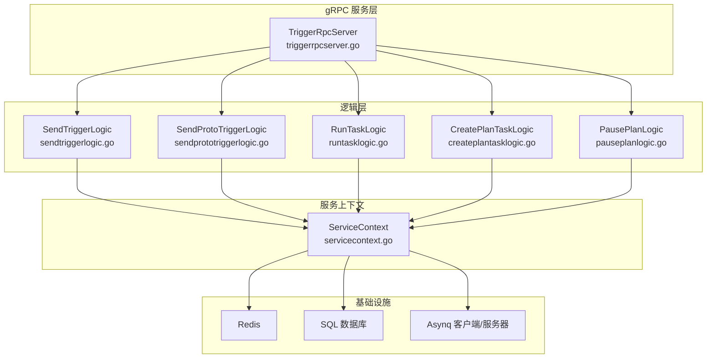
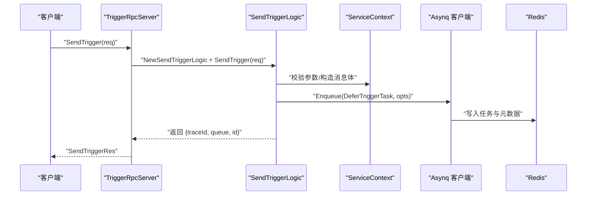
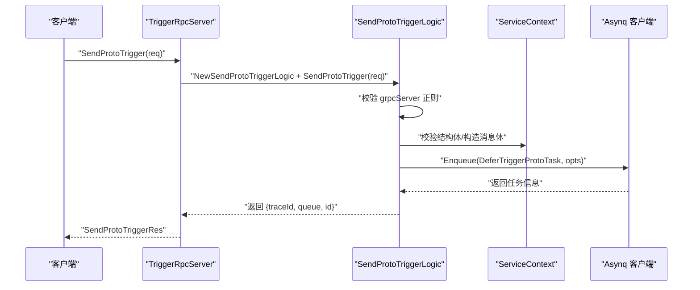
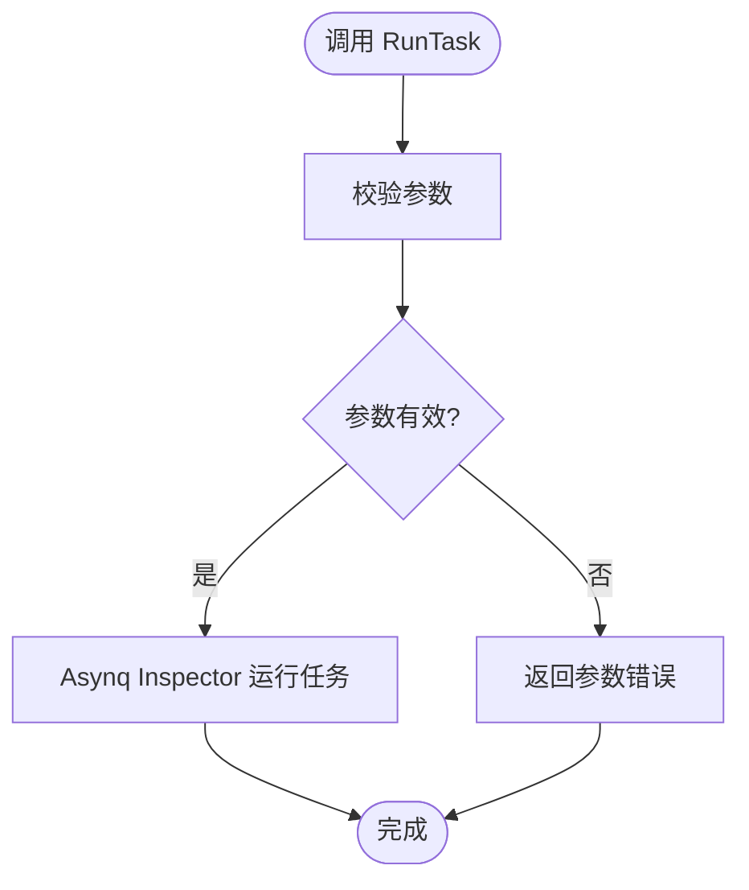
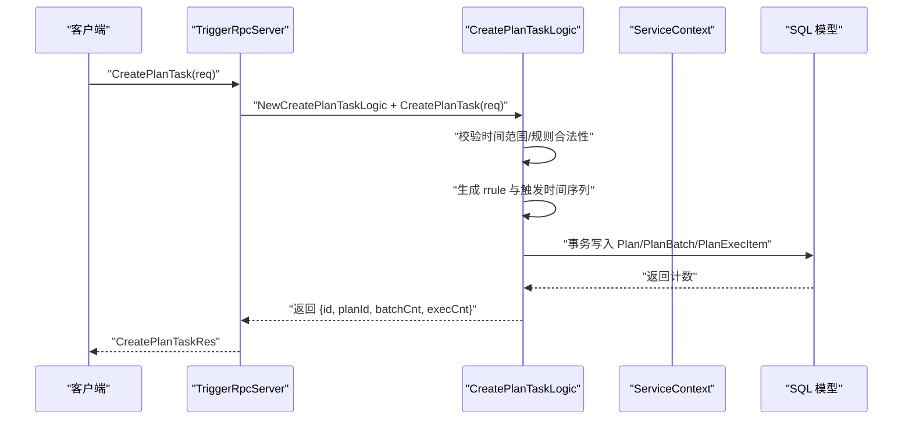
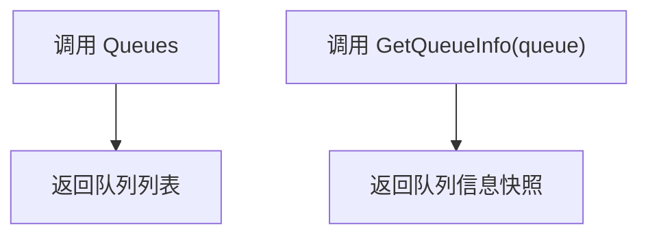
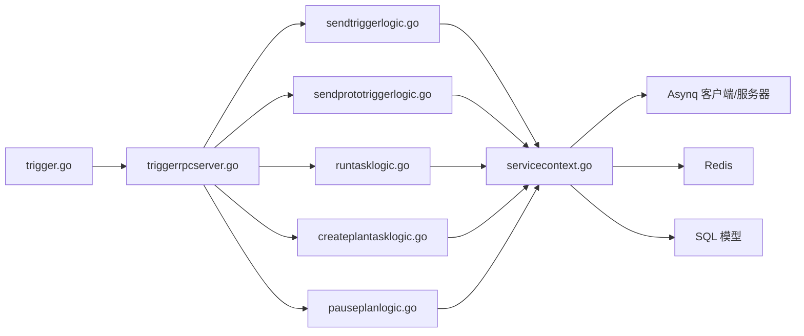

# 触发器服务API

<cite>
**本文引用的文件**
- [trigger.proto](file://app/trigger/trigger.proto)
- [trigger.pb.go](file://app/trigger/trigger/trigger.pb.go)
- [trigger.go](file://app/trigger/trigger.go)
- [triggerrpcserver.go](file://app/trigger/internal/server/triggerrpcserver.go)
- [sendtriggerlogic.go](file://app/trigger/internal/logic/sendtriggerlogic.go)
- [sendprototriggerlogic.go](file://app/trigger/internal/logic/sendprototriggerlogic.go)
- [runtasklogic.go](file://app/trigger/internal/logic/runtasklogic.go)
- [createplantasklogic.go](file://app/trigger/internal/logic/createplantasklogic.go)
- [pauseplanlogic.go](file://app/trigger/internal/logic/pauseplanlogic.go)
- [servicecontext.go](file://app/trigger/internal/svc/servicecontext.go)
- [trigger.yaml](file://app/trigger/etc/trigger.yaml)
- [deferTriggerTask.go](file://app/trigger/internal/task/deferTriggerTask.go)
- [deferTriggerProtoTask.go](file://app/trigger/internal/task/deferTriggerProtoTask.go)
- [routes.go](file://app/trigger/internal/task/routes.go)
</cite>

## 更新摘要
**所做更改**
- 更新了所有字段命名规范，从 snake_case 统一改为 camelCase
- 新增了字段命名规范章节，详细说明 camelCase 转换规则
- 更新了任务状态枚举、队列信息、计划任务等数据结构的字段命名
- 完善了客户端调用示例中的字段命名一致性

## 目录
1. [简介](#简介)
2. [项目结构](#项目结构)
3. [核心组件](#核心组件)
4. [架构总览](#架构总览)
5. [详细组件分析](#详细组件分析)
6. [字段命名规范标准化](#字段命名规范标准化)
7. [依赖分析](#依赖分析)
8. [性能考虑](#性能考虑)
9. [故障排查指南](#故障排查指南)
10. [结论](#结论)
11. [附录](#附录)

## 简介
本文件系统性地梳理触发器服务的 gRPC API，覆盖任务调度、计划任务管理与队列管理三大能力域。重点说明 SendTrigger、SendProtoTrigger 等触发接口的参数结构、调用流程与错误处理；阐述 RunTask、DeleteTask、ArchiveTask 等任务生命周期管理接口；详解 CreatePlanTask、PausePlan、ResumePlan 等计划任务接口的配置参数与执行机制；提供队列管理接口 Queues、GetQueueInfo 的使用说明；并给出任务状态枚举、重试机制与性能优化建议。

**更新** 本次更新主要反映了 protobuf 字段命名规范的标准化，所有字段从 snake_case 统一转换为 camelCase，提升了 API 的一致性和可读性。

## 项目结构
触发器服务基于 go-zero 与 asynq 构建，gRPC 服务由 proto 定义并通过 server 层路由到各 logic 实现，底层通过 asynq 客户端/服务器与 Redis 交互，持久化使用 SQL 数据库模型。

**图表来源**
- [triggerrpcserver.go:15-271](file://app/trigger/internal/server/triggerrpcserver.go#L15-L271)
- [servicecontext.go:29-91](file://app/trigger/internal/svc/servicecontext.go#L29-L91)

**章节来源**
- [trigger.go:34-88](file://app/trigger/trigger.go#L34-L88)
- [trigger.yaml:1-37](file://app/trigger/etc/trigger.yaml#L1-L37)

## 核心组件
- gRPC 服务定义：位于 [trigger.proto](file://app/trigger/trigger.proto)，包含触发、队列、任务、计划任务等接口与数据结构。
- 服务入口：启动脚本 [trigger.go](file://app/trigger/trigger.go) 初始化配置、注册 gRPC 服务、注册 asynq 任务与调度器、注册 cron 服务。
- 服务上下文：[servicecontext.go](file://app/trigger/internal/svc/servicecontext.go) 提供 asynq 客户端/服务器、SQL 连接、Redis、模型与工具集。
- 服务端路由：[triggerrpcserver.go](file://app/trigger/internal/server/triggerrpcserver.go) 将 gRPC 方法映射到对应 logic。
- 逻辑实现：各接口的业务逻辑分别在 [sendtriggerlogic.go](file://app/trigger/internal/logic/sendtriggerlogic.go)、[sendprototriggerlogic.go](file://app/trigger/internal/logic/sendprototriggerlogic.go)、[runtasklogic.go](file://app/trigger/internal/logic/runtasklogic.go)、[createplantasklogic.go](file://app/trigger/internal/logic/createplantasklogic.go)、[pauseplanlogic.go](file://app/trigger/internal/logic/pauseplanlogic.go) 等文件中实现。
- 任务执行：触发任务由 [deferTriggerTask.go](file://app/trigger/internal/task/deferTriggerTask.go) 与 [deferTriggerProtoTask.go](file://app/trigger/internal/task/deferTriggerProtoTask.go) 负责具体回调执行；路由与调度由 [routes.go](file://app/trigger/internal/task/routes.go) 管理。

**章节来源**
- [trigger.proto:13-106](file://app/trigger/trigger.proto#L13-L106)
- [trigger.go:46-87](file://app/trigger/trigger.go#L46-L87)
- [servicecontext.go:50-91](file://app/trigger/internal/svc/servicecontext.go#L50-L91)

## 架构总览
触发器服务采用"gRPC 服务层 → 逻辑层 → 服务上下文 → 底层基础设施"的分层设计。gRPC 服务负责协议编解码与路由；逻辑层封装业务规则与参数校验；服务上下文统一管理 asynq、数据库、Redis、流事件客户端等资源；基础设施层完成任务入队、持久化与外部回调。

**图表来源**
- [triggerrpcserver.go:26-36](file://app/trigger/internal/server/triggerrpcserver.go#L26-L36)
- [sendtriggerlogic.go:37-104](file://app/trigger/internal/logic/sendtriggerlogic.go#L37-L104)
- [servicecontext.go:65-66](file://app/trigger/internal/svc/servicecontext.go#L65-L66)

## 详细组件分析

### 触发接口：SendTrigger 与 SendProtoTrigger
- 接口职责
  - SendTrigger：发送 HTTP POST JSON 回调任务，支持延迟触发与重试。
  - SendProtoTrigger：发送 gRPC Proto 字节码回调任务，支持延迟触发与重试。
- 关键参数
  - 公共字段：processIn（秒）、triggerTime（二选一，优先使用）、maxRetry（最大重试次数）、msgId（消息唯一标识）、currentUser（当前用户上下文）。
  - SendTrigger 特有：url（目标地址）、body（JSON 负载）。
  - SendProtoTrigger 特有：grpcServer（gRPC 地址，支持直连与 Nacos）、method（方法名）、payload（pb 字节数据）、requestTimeout（毫秒）。
- 参数校验与错误处理
  - 通过 go-playground/validator 对请求进行结构化校验；对 triggerTime 的解析与未来时间校验；对 grpcServer 的正则校验。
  - 错误返回包括参数非法、时间无效、编码失败、入队失败等。
- 调度与重试
  - 任务入队时设置队列、保留期与重试次数；支持按秒的延迟执行；重试采用指数退避，上限封顶至 30 分钟。
- 返回值
  - traceId（链路追踪 ID）、queue（队列名）、id（任务 ID）。

**图表来源**
- [triggerrpcserver.go:32-36](file://app/trigger/internal/server/triggerrpcserver.go#L32-L36)
- [sendprototriggerlogic.go:40-101](file://app/trigger/internal/logic/sendprototriggerlogic.go#L40-L101)

**章节来源**
- [trigger.proto:216-286](file://app/trigger/trigger.proto#L216-L286)
- [sendtriggerlogic.go:37-104](file://app/trigger/internal/logic/sendtriggerlogic.go#L37-L104)
- [sendprototriggerlogic.go:40-101](file://app/trigger/internal/logic/sendprototriggerlogic.go#L40-L101)

### 任务生命周期管理：RunTask、DeleteTask、ArchiveTask 等
- RunTask
  - 功能：手动运行指定队列与 ID 的任务。
  - 参数：queue、id。
  - 行为：通过 asynq Inspector 执行运行。
- DeleteTask
  - 功能：删除指定队列与 ID 的任务。
  - 参数：queue、id。
- ArchiveTask
  - 功能：归档指定队列与 ID 的任务。
  - 参数：queue、id。
- 其他任务相关接口
  - GetTaskInfo：查询任务详情。
  - DeleteAllCompletedTasks / DeleteAllArchivedTasks：批量清理已完成/已归档任务。
  - ListActive/Pending/Scheduled/Retry/Archived/Completed/Tasks：分页查询各类任务列表。
  - HistoricalStats：按天统计任务处理情况。
- 错误处理
  - 参数校验失败直接返回；执行阶段错误透传。

**图表来源**
- [runtasklogic.go:27-36](file://app/trigger/internal/logic/runtasklogic.go#L27-L36)
- [triggerrpcserver.go:128-132](file://app/trigger/internal/server/triggerrpcserver.go#L128-L132)

**章节来源**
- [trigger.proto:307-481](file://app/trigger/trigger.proto#L307-L481)
- [runtasklogic.go:27-36](file://app/trigger/internal/logic/runtasklogic.go#L27-L36)

### 计划任务管理：CreatePlanTask、PausePlan、ResumePlan 等
- CreatePlanTask
  - 功能：基于规则生成计划任务，创建批次与执行项，并写入数据库。
  - 关键参数：planId、planName、type、groupId、startTime、endTime、rule（频率与过滤条件）、excludeDates、intervalType/intervalTime、execItems（执行项集合）、batchNumPrefix、skipTimeFilter、deptCode、扩展字段。
  - 规则转换：将 PbPlanRule 转换为 rrule 选项，生成触发时间序列；支持排除日期与当前时间过滤；限制调度项总数不超过阈值。
  - 批次与执行项：为每个触发时间生成批次与执行项，支持顺延/随机偏移的触发时间。
  - 返回：id、planId、batchCnt、execCnt。
- PausePlan / ResumePlan / TerminatePlan
  - 功能：暂停/恢复/终止计划及其批次与执行项；更新状态、暂停/恢复时间与原因。
  - 参数：id 或 planId 二选一，reason（可选）。
- 其他计划相关接口
  - PausePlanBatch/ResumePlanBatch/TerminatePlanBatch
  - PausePlanExecItem/ResumePlanExecItem/TerminatePlanExecItem
  - RunPlanExecItem：立即执行某个执行项。
  - GetPlan/ListPlans、GetPlanBatch/ListPlanBatches、GetPlanExecItem/ListPlanExecItems、GetPlanExecLog/ListPlanExecLogs、GetExecItemDashboard、CallbackPlanExecItem、NextId。
- 错误处理
  - 时间范围校验、规则合法性校验、排除日期格式校验、事务一致性保证、状态约束检查。

**图表来源**
- [triggerrpcserver.go:140-144](file://app/trigger/internal/server/triggerrpcserver.go#L140-L144)
- [createplantasklogic.go:39-250](file://app/trigger/internal/logic/createplantasklogic.go#L39-L250)

**章节来源**
- [trigger.proto:504-787](file://app/trigger/trigger.proto#L504-L787)
- [createplantasklogic.go:39-250](file://app/trigger/internal/logic/createplantasklogic.go#L39-L250)
- [pauseplanlogic.go:34-99](file://app/trigger/internal/logic/pauseplanlogic.go#L34-L99)

### 队列管理：Queues 与 GetQueueInfo
- Queues
  - 功能：获取当前可用队列列表。
  - 参数：currentUser。
  - 返回：queues（字符串数组）。
- GetQueueInfo
  - 功能：获取指定队列的统计信息快照。
  - 参数：queue（必填，最小长度 1）。
  - 返回：QueueInfoPb，包含 pending、active、scheduled、retry、aggregating、archived、completed 等数量、内存占用、延迟、是否暂停等。
- 使用场景
  - 监控队列健康度、容量与延迟。
  - 选择合适的队列进行任务投递。

**图表来源**
- [triggerrpcserver.go:38-48](file://app/trigger/internal/server/triggerrpcserver.go#L38-L48)
- [trigger.proto:288-305](file://app/trigger/trigger.proto#L288-L305)

**章节来源**
- [trigger.proto:18-21](file://app/trigger/trigger.proto#L18-L21)
- [trigger.proto:288-305](file://app/trigger/trigger.proto#L288-L305)

### 任务状态与重试机制
- 任务状态枚举（执行项）
  - WAITING：初始等待调度，可扫表触发。
  - DELAYED：延期等待（业务失败重试或业务延期），可扫表触发。
  - RUNNING：已下发，等待业务回调，扫表时需判断超时。
  - PAUSED：执行项暂停（不扫表、不触发）。
  - COMPLETED：执行完成终态，不再触发。
  - TERMINATED：人工/策略/超过重试次数终止，终态。
- 重试机制
  - 指数退避策略：第 1 次约 1 秒，第 2 次约 2 秒，第 3 次约 4 秒，依此类推，最高封顶 30 分钟。
  - 支持通过请求参数 maxRetry 设置最大重试次数。
- 保留期与队列
  - 任务默认保留期为 7 天，队列为 critical。

**章节来源**
- [trigger.proto:108-122](file://app/trigger/trigger.proto#L108-L122)
- [trigger.proto:245-266](file://app/trigger/trigger.proto#L245-L266)
- [sendtriggerlogic.go:63-66](file://app/trigger/internal/logic/sendtriggerlogic.go#L63-L66)
- [sendprototriggerlogic.go:72-75](file://app/trigger/internal/logic/sendprototriggerlogic.go#L72-L75)

### 客户端调用示例（Go 语言）
以下为典型调用步骤与要点（以 SendTrigger 为例，SendProtoTrigger 类似）：
- 初始化 gRPC 客户端连接与拦截器。
- 构造请求对象，设置 processIn 或 triggerTime、msgId、url、body、maxRetry 等。
- 调用 SendTrigger，读取 traceId、queue、id。
- 参数校验与异常处理：捕获结构化校验错误、时间解析错误、入队错误等。
- 可选：通过 GetQueueInfo 监控队列状态；通过 ListActiveTasks/ListPendingTasks 等查询任务状态。

提示：请参考服务端路由与逻辑实现以确保参数与调用顺序正确。

**章节来源**
- [triggerrpcserver.go:26-36](file://app/trigger/internal/server/triggerrpcserver.go#L26-L36)
- [sendtriggerlogic.go:37-104](file://app/trigger/internal/logic/sendtriggerlogic.go#L37-L104)

## 字段命名规范标准化

### 更新概述
本次更新实现了触发器服务 protobuf 字段命名规范的全面标准化，将原有的 snake_case 命名风格统一转换为 camelCase 风格。这一变更涉及 50+ 个字段，涵盖任务、队列、计划任务等核心数据结构。

### 字段命名转换规则
- **snake_case → camelCase**：所有下划线分隔的字段名转换为驼峰命名
- **保持语义不变**：转换后的字段含义与原字段完全一致
- **JSON 标签同步**：Go 语言生成的 JSON 标签也相应更新为 camelCase

### 主要字段转换示例

#### 任务相关字段
- `task_id` → `taskId`
- `queue_name` → `queueName`
- `process_time` → `processTime`
- `create_time` → `createTime`
- `update_time` → `updateTime`

#### 队列信息字段
- `queue_name` → `queueName`
- `memory_usage` → `memoryUsage`
- `pending_count` → `pendingCount`
- `active_count` → `activeCount`
- `scheduled_count` → `scheduledCount`

#### 计划任务字段
- `plan_id` → `planId`
- `batch_id` → `batchId`
- `exec_id` → `execId`
- `item_id` → `itemId`
- `trigger_time` → `triggerTime`
- `next_trigger_time` → `nextTriggerTime`
- `last_trigger_time` → `lastTriggerTime`

#### 时间戳字段
- `created_at` → `createdAt`
- `updated_at` → `updatedAt`
- `finished_time` → `finishedTime`
- `paused_time` → `pausedTime`

### 数据结构字段更新

#### TaskInfoPb 结构
- `id` → `id`（保持不变）
- `queue` → `queue`（保持不变）
- `type` → `type`（保持不变）
- `payload` → `payload`（保持不变）
- `state` → `state`（保持不变）
- `max_retry` → `maxRetry`
- `retried` → `retried`（保持不变）
- `last_err` → `lastErr`
- `last_failed_at` → `lastFailedAt`
- `timeout` → `timeout`（保持不变）
- `deadline` → `deadline`（保持不变）
- `group` → `group`（保持不变）
- `next_process_at` → `nextProcessAt`
- `is_orphaned` → `isOrphaned`
- `retention` → `retention`（保持不变）
- `completed_at` → `completedAt`
- `result` → `result`（保持不变）

#### QueueInfoPb 结构
- `queue` → `queue`（保持不变）
- `memory_usage` → `memoryUsage`
- `latency` → `latency`（保持不变）
- `size` → `size`（保持不变）
- `groups` → `groups`（保持不变）
- `pending` → `pending`（保持不变）
- `active` → `active`（保持不变）
- `scheduled` → `scheduled`（保持不变）
- `retry` → `retry`（保持不变）
- `archived` → `archived`（保持不变）
- `completed` → `completed`（保持不变）
- `aggregating` → `aggregating`（保持不变）
- `processed` → `processed`（保持不变）
- `failed` → `failed`（保持不变）
- `processed_total` → `processedTotal`
- `failed_total` → `failedTotal`
- `paused` → `paused`（保持不变）
- `timestamp` → `timestamp`（保持不变）

#### 计划任务相关字段
- `plan_id` → `planId`
- `batch_id` → `batchId`
- `exec_id` → `execId`
- `item_id` → `itemId`
- `plan_trigger_time` → `planTriggerTime`
- `next_trigger_time` → `nextTriggerTime`
- `last_trigger_time` → `lastTriggerTime`
- `trigger_count` → `triggerCount`
- `terminated_reason` → `terminatedReason`
- `paused_time` → `pausedTime`
- `paused_reason` → `pausedReason`

### 客户端兼容性
- **向后兼容**：现有客户端代码需要更新字段访问方式
- **迁移路径**：建议逐步更新客户端代码，确保字段命名一致性
- **API 文档**：所有接口文档已更新为新的 camelCase 字段命名

**章节来源**
- [trigger.proto:124-159](file://app/trigger/trigger.proto#L124-L159)
- [trigger.proto:173-214](file://app/trigger/trigger.proto#L173-L214)
- [trigger.proto:504-549](file://app/trigger/trigger.proto#L504-L549)
- [trigger.proto:858-928](file://app/trigger/trigger.proto#L858-L928)
- [trigger.proto:1044-1096](file://app/trigger/trigger.proto#L1044-L1096)

## 依赖分析
- 服务启动与注册
  - 启动入口 [trigger.go](file://app/trigger/trigger.go) 注册 gRPC 服务、注册 asynq 任务与调度器、注册 cron 服务，并可选注册到 Nacos。
- 服务上下文
  - [servicecontext.go](file://app/trigger/internal/svc/servicecontext.go) 提供 asynq 客户端/服务器、Inspector、SQL 连接、Redis、模型与工具集。
- 任务执行
  - [deferTriggerTask.go](file://app/trigger/internal/task/deferTriggerTask.go) 与 [deferTriggerProtoTask.go](file://app/trigger/internal/task/deferTriggerProtoTask.go) 实际执行回调；[routes.go](file://app/trigger/internal/task/routes.go) 管理路由与调度。

**图表来源**
- [trigger.go:46-87](file://app/trigger/trigger.go#L46-L87)
- [triggerrpcserver.go:26-271](file://app/trigger/internal/server/triggerrpcserver.go#L26-L271)
- [servicecontext.go:65-89](file://app/trigger/internal/svc/servicecontext.go#L65-L89)

**章节来源**
- [trigger.go:46-87](file://app/trigger/trigger.go#L46-L87)
- [servicecontext.go:50-91](file://app/trigger/internal/svc/servicecontext.go#L50-L91)

## 性能考虑
- 队列与保留期
  - 默认队列 critical，保留期 7 天，避免长时间占用内存。
- 重试策略
  - 指数退避 + 30 分钟封顶，降低抖动与风暴风险。
- 批量清理
  - 提供 DeleteAllCompletedTasks 与 DeleteAllArchivedTasks，定期清理历史数据，控制数据库与队列规模。
- 监控与告警
  - 使用 GetQueueInfo 获取 pending、active、scheduled、retry、aggregating、archived、completed 数量与延迟，结合外部监控体系建立告警。
- 资源配置
  - 参考配置文件 [trigger.yaml](file://app/trigger/etc/trigger.yaml) 中的 Redis、DB、日志与 Nacos 注册配置，按环境调整。

**章节来源**
- [trigger.yaml:19-37](file://app/trigger/etc/trigger.yaml#L19-L37)
- [trigger.proto:245-266](file://app/trigger/trigger.proto#L245-L266)

## 故障排查指南
- 参数校验失败
  - 现象：请求被拒绝。
  - 排查：确认必填字段、格式与范围（如 queue 非空、n 合法、时间范围合理）。
- 时间相关错误
  - 现象：triggerTime 无效或早于当前时间。
  - 排查：确认时间格式与时区；若使用 triggerTime，应晚于当前时间。
- 入队失败
  - 现象：返回入队错误。
  - 排查：检查 Redis 连通性、队列配置与 asynq 客户端状态。
- 计划任务异常
  - 现象：创建失败或无触发时间。
  - 排查：核对规则、排除日期格式、时间跨度限制与调度项总数阈值。
- 计划状态异常
  - 现象：暂停/恢复/终止无效。
  - 排查：确认计划状态与结束状态约束，确保参数 id 或 planId 正确。

**章节来源**
- [sendtriggerlogic.go:59-62](file://app/trigger/internal/logic/sendtriggerlogic.go#L59-L62)
- [sendprototriggerlogic.go:68-71](file://app/trigger/internal/logic/sendprototriggerlogic.go#L68-L71)
- [createplantasklogic.go:67-72](file://app/trigger/internal/logic/createplantasklogic.go#L67-L72)
- [pauseplanlogic.go:56-61](file://app/trigger/internal/logic/pauseplanlogic.go#L56-L61)

## 结论
触发器服务通过清晰的分层设计与完善的参数校验、重试与监控机制，提供了稳定可靠的触发与调度能力。本次字段命名规范标准化进一步提升了 API 的一致性和可维护性。建议在生产环境中结合队列监控、批量清理与合理的重试策略，持续优化任务吞吐与稳定性。

## 附录
- 配置文件位置与关键项
  - [trigger.yaml](file://app/trigger/etc/trigger.yaml)：监听地址、日志、Redis、DB、Nacos 注册、StreamEvent 客户端等。
- 任务执行实现
  - [deferTriggerTask.go](file://app/trigger/internal/task/deferTriggerTask.go)、[deferTriggerProtoTask.go](file://app/trigger/internal/task/deferTriggerProtoTask.go)、[routes.go](file://app/trigger/internal/task/routes.go)。
- 字段命名对照表
  - 所有 snake_case 与 camelCase 字段对照详见"字段命名规范标准化"章节。