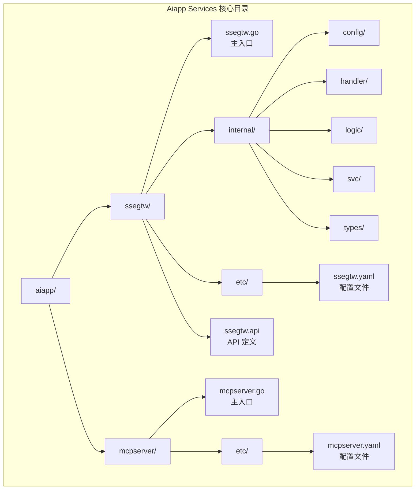
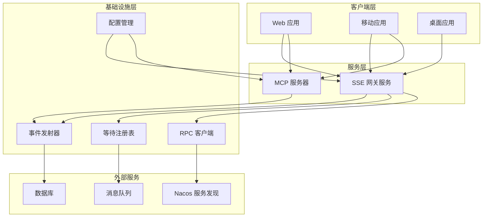
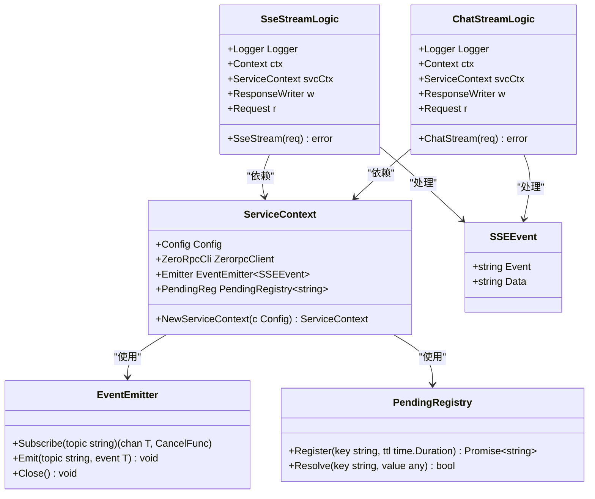
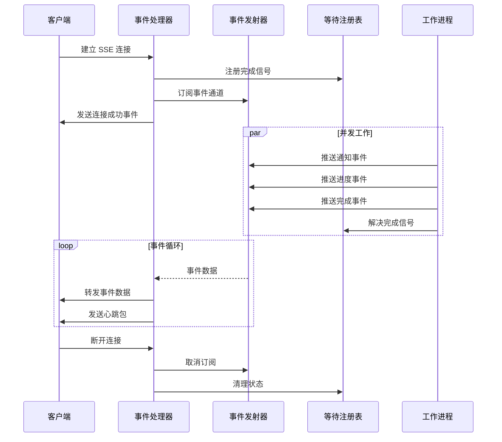
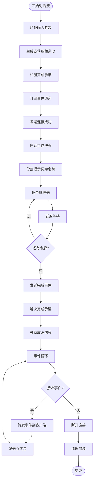
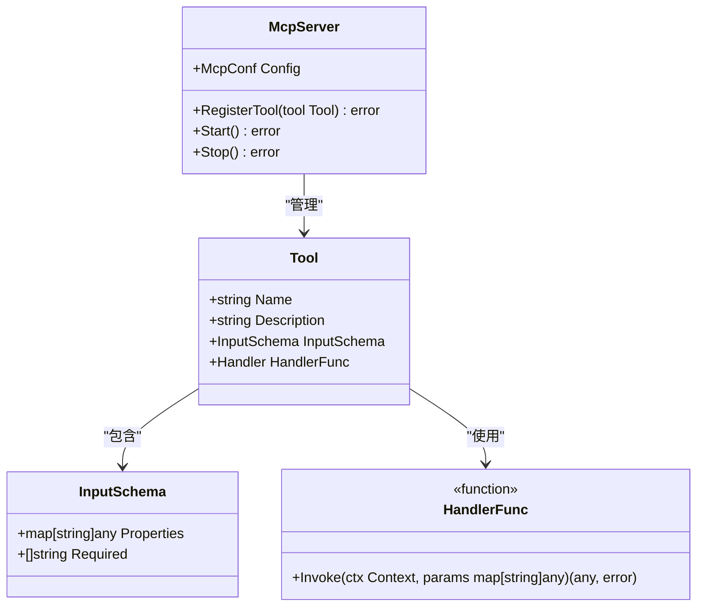
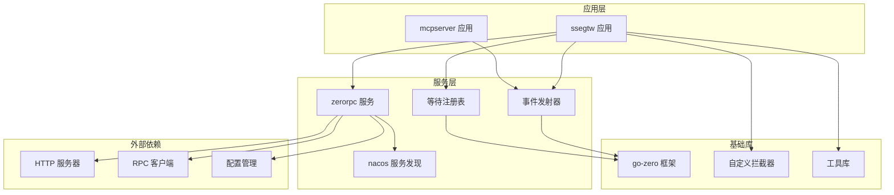

# Aiapp Services

<cite>
**本文档引用的文件**
- [aiapp/ssegtw/ssegtw.go](file://aiapp/ssegtw/ssegtw.go)
- [aiapp/mcpserver/mcpserver.go](file://aiapp/mcpserver/mcpserver.go)
- [aiapp/ssegtw/etc/ssegtw.yaml](file://aiapp/ssegtw/etc/ssegtw.yaml)
- [aiapp/mcpserver/etc/mcpserver.yaml](file://aiapp/mcpserver/etc/mcpserver.yaml)
- [aiapp/ssegtw/ssegtw.api](file://aiapp/ssegtw/ssegtw.api)
- [aiapp/ssegtw/internal/config/config.go](file://aiapp/ssegtw/internal/config/config.go)
- [aiapp/ssegtw/internal/svc/servicecontext.go](file://aiapp/ssegtw/internal/svc/servicecontext.go)
- [aiapp/ssegtw/internal/types/types.go](file://aiapp/ssegtw/internal/types/types.go)
- [aiapp/ssegtw/internal/handler/routes.go](file://aiapp/ssegtw/internal/handler/routes.go)
- [aiapp/ssegtw/internal/logic/sse/ssestreamlogic.go](file://aiapp/ssegtw/internal/logic/sse/ssestreamlogic.go)
- [aiapp/ssegtw/internal/logic/sse/chatstreamlogic.go](file://aiapp/ssegtw/internal/logic/sse/chatstreamlogic.go)
- [common/antsx/promise.go](file://common/antsx/promise.go)
- [common/antsx/antsx_test.go](file://common/antsx/antsx_test.go)
</cite>

## 目录
1. [简介](#简介)
2. [项目结构](#项目结构)
3. [核心组件](#核心组件)
4. [架构概览](#架构概览)
5. [详细组件分析](#详细组件分析)
6. [依赖关系分析](#依赖关系分析)
7. [性能考虑](#性能考虑)
8. [故障排除指南](#故障排除指南)
9. [结论](#结论)

## 简介

Aiapp Services 是一个基于 Go-zero 框架构建的微服务集合，主要包含两个核心服务：SSE 网关服务和 MCP 服务器。该项目专注于提供实时事件流处理和 AI 对话流服务，通过 Server-Sent Events (SSE) 技术实现高效的双向通信。

该服务集合采用模块化设计，支持高并发的事件订阅和发布机制，为前端应用提供流畅的实时交互体验。系统集成了 Nacos 服务发现、自定义拦截器、事件发射器等现代化微服务特性。

## 项目结构

Aiapp Services 位于项目的 `aiapp/` 目录下，包含两个主要服务：

**图表来源**
- [aiapp/ssegtw/ssegtw.go:1-60](file://aiapp/ssegtw/ssegtw.go#L1-L60)
- [aiapp/mcpserver/mcpserver.go:1-76](file://aiapp/mcpserver/mcpserver.go#L1-L76)

**章节来源**
- [aiapp/ssegtw/ssegtw.go:1-60](file://aiapp/ssegtw/ssegtw.go#L1-L60)
- [aiapp/mcpserver/mcpserver.go:1-76](file://aiapp/mcpserver/mcpserver.go#L1-L76)

## 核心组件

### SSE 网关服务 (SSE Gateway Service)

SSE 网关服务是整个 Aiapp Services 的核心组件，提供以下主要功能：

- **实时事件流处理**：通过 Server-Sent Events 技术实现实时数据推送
- **AI 对话流服务**：支持基于提示词的流式 AI 对话
- **多通道事件管理**：支持多个独立的事件通道
- **心跳保持机制**：确保长连接的稳定性

### MCP 服务器 (Model Context Protocol Server)

MCP 服务器实现了 Model Context Protocol 协议，提供：

- **工具注册机制**：支持动态注册各种工具函数
- **参数验证系统**：严格的输入参数验证和类型检查
- **异步处理能力**：支持并发的工具调用和响应处理

**章节来源**
- [aiapp/ssegtw/ssegtw.api:1-40](file://aiapp/ssegtw/ssegtw.api#L1-L40)
- [aiapp/mcpserver/mcpserver.go:35-71](file://aiapp/mcpserver/mcpserver.go#L35-L71)

## 架构概览

Aiapp Services 采用分层架构设计，各组件之间通过清晰的接口进行通信：

**图表来源**
- [aiapp/ssegtw/internal/svc/servicecontext.go:23-38](file://aiapp/ssegtw/internal/svc/servicecontext.go#L23-L38)
- [aiapp/ssegtw/internal/config/config.go:11-14](file://aiapp/ssegtw/internal/config/config.go#L11-L14)

## 详细组件分析

### SSE 事件流组件

SSE 事件流组件是系统的核心通信机制，实现了完整的事件驱动架构：

**图表来源**
- [aiapp/ssegtw/internal/svc/servicecontext.go:17-38](file://aiapp/ssegtw/internal/svc/servicecontext.go#L17-L38)
- [aiapp/ssegtw/internal/logic/sse/ssestreamlogic.go:19-36](file://aiapp/ssegtw/internal/logic/sse/ssestreamlogic.go#L19-L36)
- [aiapp/ssegtw/internal/logic/sse/chatstreamlogic.go:19-36](file://aiapp/ssegtw/internal/logic/sse/chatstreamlogic.go#L19-L36)

#### SSE 事件流处理流程

SSE 事件流的处理遵循严格的生命周期管理：

**图表来源**
- [aiapp/ssegtw/internal/logic/sse/ssestreamlogic.go:38-118](file://aiapp/ssegtw/internal/logic/sse/ssestreamlogic.go#L38-L118)

#### AI 对话流处理流程

AI 对话流实现了智能的令牌级流式输出：

**图表来源**
- [aiapp/ssegtw/internal/logic/sse/chatstreamlogic.go:38-121](file://aiapp/ssegtw/internal/logic/sse/chatstreamlogic.go#L38-L121)

**章节来源**
- [aiapp/ssegtw/internal/logic/sse/ssestreamlogic.go:1-119](file://aiapp/ssegtw/internal/logic/sse/ssestreamlogic.go#L1-L119)
- [aiapp/ssegtw/internal/logic/sse/chatstreamlogic.go:1-122](file://aiapp/ssegtw/internal/logic/sse/chatstreamlogic.go#L1-L122)

### MCP 服务器组件

MCP 服务器提供了灵活的工具注册和执行机制：

**图表来源**
- [aiapp/mcpserver/mcpserver.go:28-71](file://aiapp/mcpserver/mcpserver.go#L28-L71)

**章节来源**
- [aiapp/mcpserver/mcpserver.go:1-76](file://aiapp/mcpserver/mcpserver.go#L1-L76)

## 依赖关系分析

Aiapp Services 的依赖关系体现了清晰的分层架构：

**图表来源**
- [aiapp/ssegtw/internal/svc/servicecontext.go:6-15](file://aiapp/ssegtw/internal/svc/servicecontext.go#L6-L15)
- [aiapp/ssegtw/internal/config/config.go:6-14](file://aiapp/ssegtw/internal/config/config.go#L6-L14)

**章节来源**
- [aiapp/ssegtw/internal/config/config.go:1-15](file://aiapp/ssegtw/internal/config/config.go#L1-L15)
- [aiapp/ssegtw/internal/svc/servicecontext.go:1-39](file://aiapp/ssegtw/internal/svc/servicecontext.go#L1-L39)

## 性能考虑

### 并发处理优化

系统采用了多种并发处理策略来确保高性能：

- **事件发射器模式**：使用通道实现高效的事件分发
- **等待注册表**：提供超时控制和资源清理机制
- **goroutine 管理**：合理分配工作负载，避免阻塞

### 内存管理

- **通道缓冲**：根据预期负载设置合适的缓冲大小
- **上下文取消**：及时清理资源，防止内存泄漏
- **心跳机制**：维持连接活跃状态，减少无效连接

### 网络优化

- **CORS 配置**：灵活的跨域资源共享设置
- **连接池管理**：复用网络连接，减少建立成本
- **超时控制**：防止长时间占用系统资源

## 故障排除指南

### 常见问题诊断

#### SSE 连接问题

1. **连接无法建立**
   - 检查服务端口配置
   - 验证 CORS 设置
   - 确认防火墙规则

2. **事件流中断**
   - 检查心跳包发送
   - 验证通道订阅状态
   - 监控等待注册表状态

#### MCP 服务器问题

1. **工具注册失败**
   - 验证工具名称唯一性
   - 检查输入模式定义
   - 确认处理器函数签名

2. **参数验证错误**
   - 检查必需参数
   - 验证数据类型
   - 确认默认值设置

**章节来源**
- [aiapp/ssegtw/internal/logic/sse/ssestreamlogic.go:38-42](file://aiapp/ssegtw/internal/logic/sse/ssestreamlogic.go#L38-L42)
- [aiapp/mcpserver/mcpserver.go:52-60](file://aiapp/mcpserver/mcpserver.go#L52-L60)

## 结论

Aiapp Services 提供了一个完整、高效、可扩展的实时事件流解决方案。通过精心设计的架构和实现，系统能够满足现代 Web 应用对实时通信的需求。

### 主要优势

1. **模块化设计**：清晰的组件分离，便于维护和扩展
2. **高性能架构**：基于事件驱动的设计，支持高并发场景
3. **灵活配置**：支持多种部署模式和配置选项
4. **完善的监控**：内置日志记录和性能指标

### 技术特色

- **SSE 实时通信**：提供低延迟的双向数据传输
- **AI 对话流**：支持智能的流式对话体验
- **MCP 协议支持**：兼容主流 AI 模型协议
- **微服务架构**：基于 Go-zero 框架的现代化设计

该服务集合为构建下一代实时应用提供了坚实的技术基础，适合各种需要高效事件处理和实时通信的业务场景。