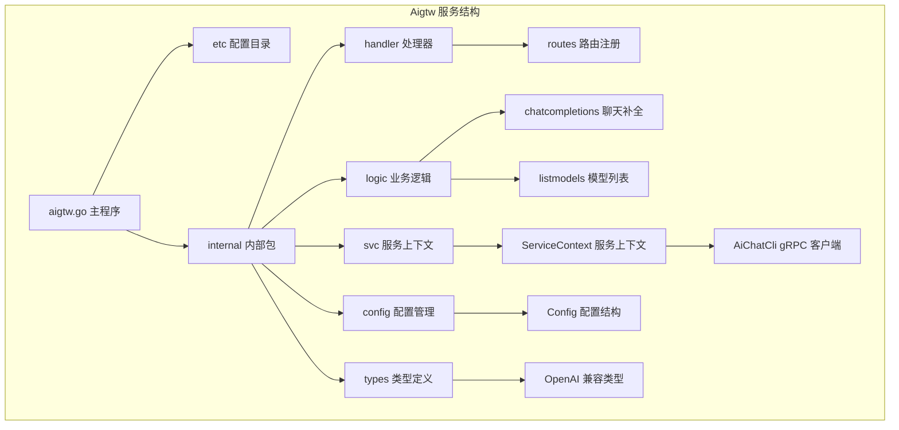
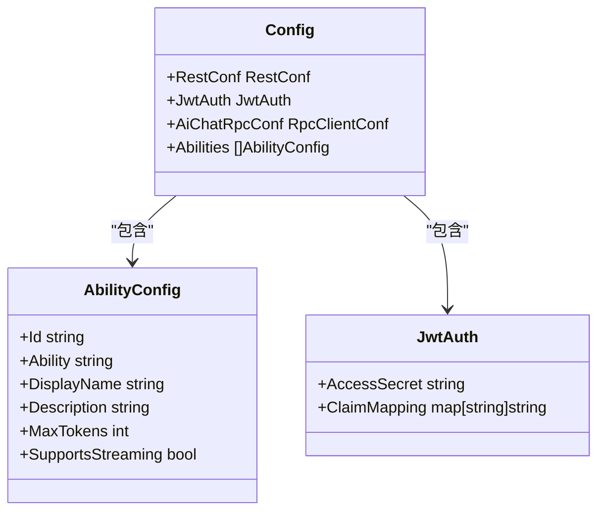
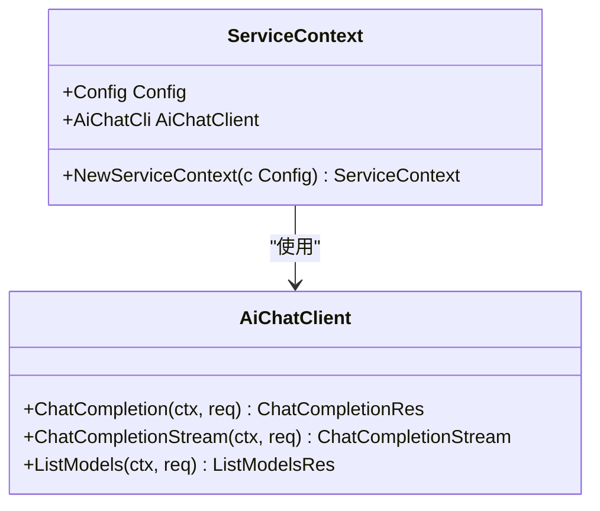
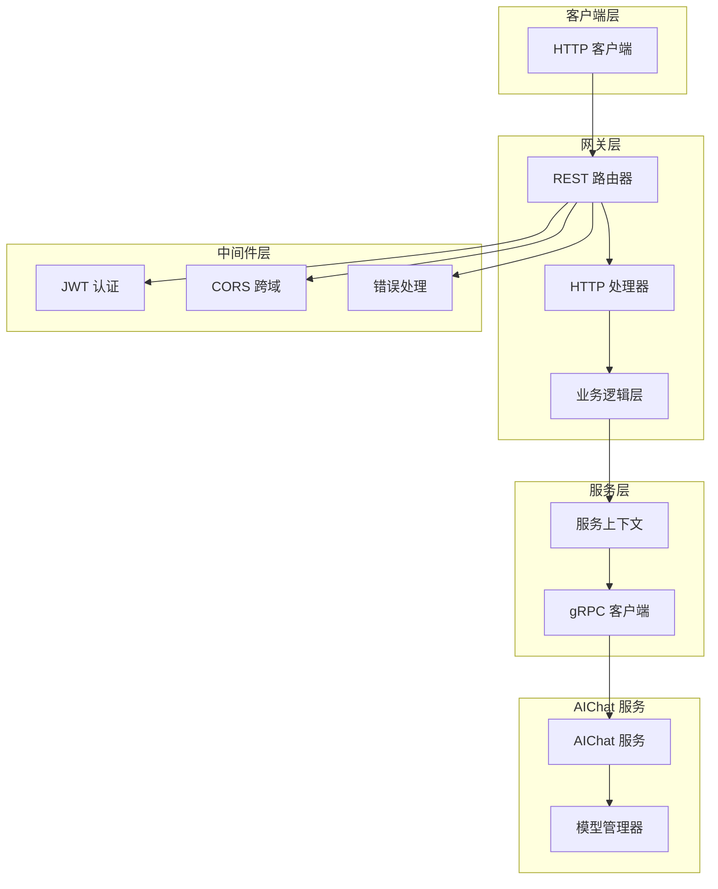
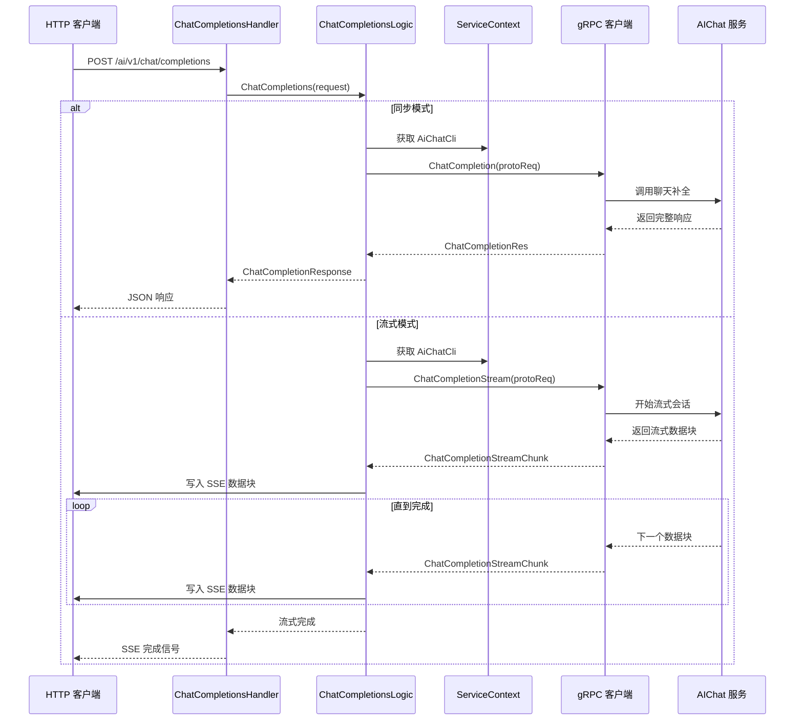
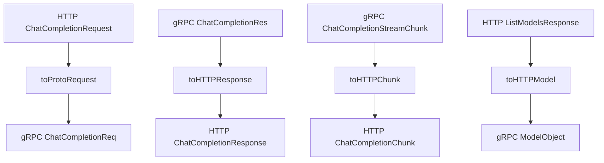
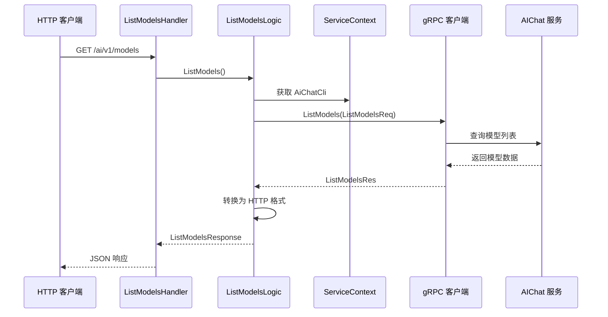
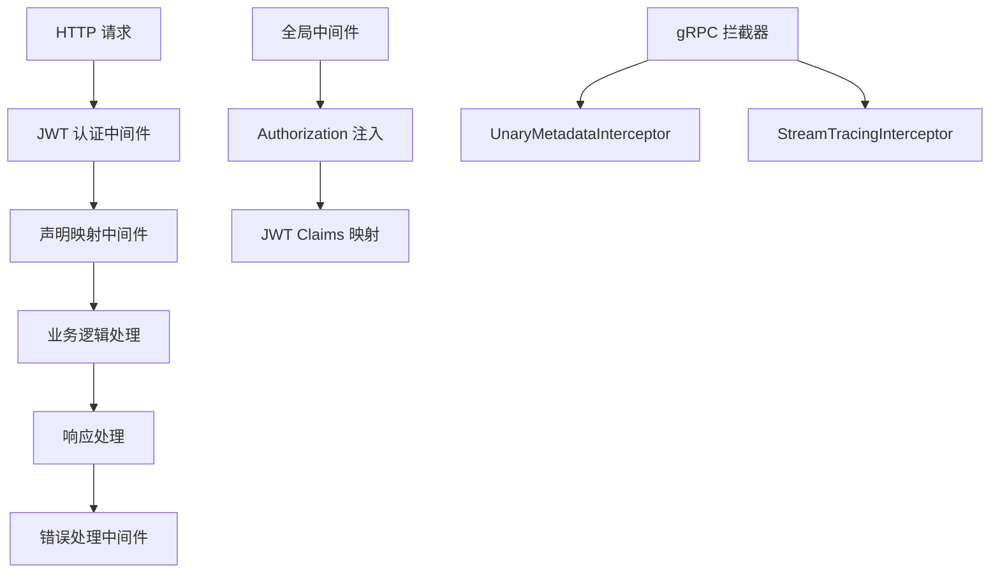
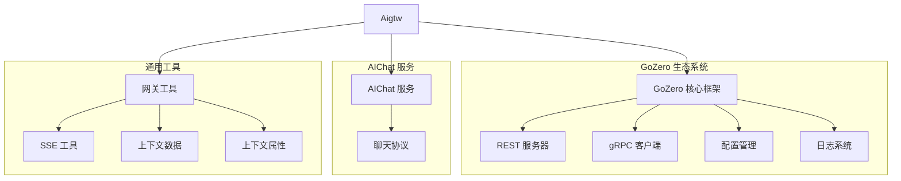
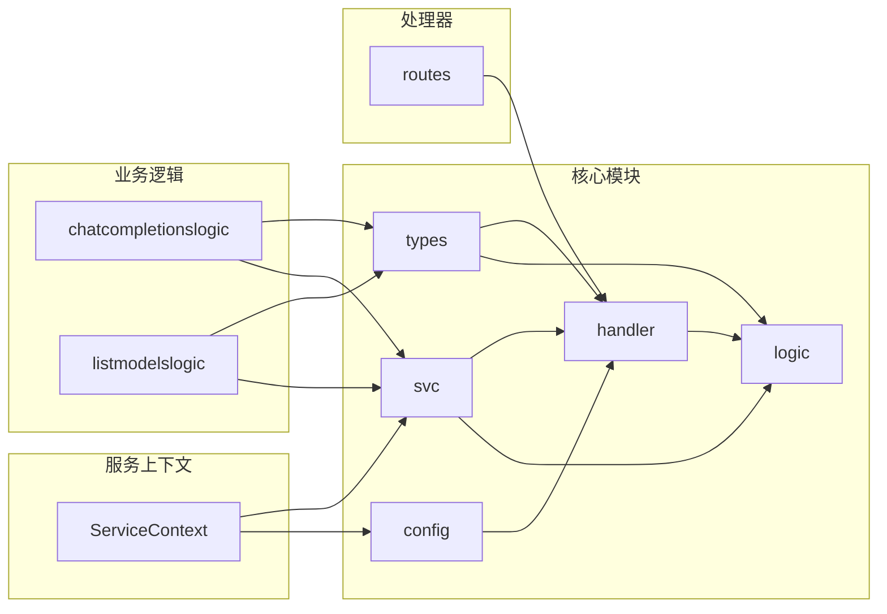

# Aigtw 网关服务

<cite>
**本文档引用的文件**
- [aigtw.go](file://aiapp/aigtw/aigtw.go)
- [aigtw.yaml](file://aiapp/aigtw/etc/aigtw.yaml)
- [config.go](file://aiapp/aigtw/internal/config/config.go)
- [aigtw.api](file://aiapp/aigtw/aigtw.api)
- [types.go](file://aiapp/aigtw/internal/types/types.go)
- [routes.go](file://aiapp/aigtw/internal/handler/routes.go)
- [chatcompletionslogic.go](file://aiapp/aigtw/internal/logic/pass/chatcompletionslogic.go)
- [listmodelslogic.go](file://aiapp/aigtw/internal/logic/pass/listmodelslogic.go)
- [servicecontext.go](file://aiapp/aigtw/internal/svc/servicecontext.go)
- [errors.go](file://aiapp/aigtw/internal/types/errors.go)
- [cors.go](file://common/gtwx/cors.go)
- [errorhandler.go](file://common/gtwx/errorhandler.go)
- [openai_error.go](file://common/gtwx/openai_error.go)
</cite>

## 目录
1. [简介](#简介)
2. [项目结构](#项目结构)
3. [核心组件](#核心组件)
4. [架构概览](#架构概览)
5. [详细组件分析](#详细组件分析)
6. [依赖关系分析](#依赖关系分析)
7. [性能考虑](#性能考虑)
8. [故障排除指南](#故障排除指南)
9. [结论](#结论)

## 简介

Aigtw 网关服务是一个基于 GoZero 框架构建的 OpenAI 兼容 API 网关，主要负责将 HTTP 请求转换为 gRPC 协议，与 AIChat 服务进行通信。该服务提供了完整的聊天补全功能，支持同步和流式两种模式，并实现了 OpenAI 风格的错误处理机制。

该网关服务的核心特性包括：
- OpenAI 兼容的 API 接口设计
- 支持同步和流式聊天补全
- 基于 JWT 的身份验证
- CORS 跨域资源共享支持
- 统一的错误处理机制
- 模型管理和路由配置

## 项目结构

Aigtw 服务采用典型的 GoZero 微服务架构，具有清晰的分层结构：

**图表来源**
- [aigtw.go:32-106](file://aiapp/aigtw/aigtw.go#L32-L106)
- [config.go:20-28](file://aiapp/aigtw/internal/config/config.go#L20-L28)

**章节来源**
- [aigtw.go:1-106](file://aiapp/aigtw/aigtw.go#L1-L106)
- [aigtw.yaml:1-25](file://aiapp/aigtw/etc/aigtw.yaml#L1-L25)

## 核心组件

### 配置管理系统

Aigtw 服务使用 GoZero 的配置系统，支持多种环境配置和动态加载：

**图表来源**
- [config.go:11-28](file://aiapp/aigtw/internal/config/config.go#L11-L28)

### 服务上下文管理

ServiceContext 负责管理服务的全局状态和依赖注入：

**图表来源**
- [servicecontext.go:12-25](file://aiapp/aigtw/internal/svc/servicecontext.go#L12-L25)

**章节来源**
- [config.go:1-29](file://aiapp/aigtw/internal/config/config.go#L1-L29)
- [servicecontext.go:1-26](file://aiapp/aigtw/internal/svc/servicecontext.go#L1-L26)

## 架构概览

Aigtw 网关服务采用分层架构设计，实现了清晰的关注点分离：

**图表来源**
- [aigtw.go:44-74](file://aiapp/aigtw/aigtw.go#L44-L74)
- [routes.go:16-44](file://aiapp/aigtw/internal/handler/routes.go#L16-L44)

### API 接口设计

服务提供两个主要的 OpenAI 兼容接口：

| 接口 | 方法 | 路径 | 功能描述 |
|------|------|------|----------|
| 模型列表 | GET | `/ai/v1/models` | 获取可用的 AI 模型列表 |
| 聊天补全 | POST | `/ai/v1/chat/completions` | 进行对话补全，支持流式和非流式 |

**章节来源**
- [aigtw.api:14-38](file://aiapp/aigtw/aigtw.api#L14-L38)
- [routes.go:16-44](file://aiapp/aigtw/internal/handler/routes.go#L16-L44)

## 详细组件分析

### 聊天补全逻辑

聊天补全功能是 Aigtw 的核心组件，支持同步和流式两种处理模式：

**图表来源**
- [chatcompletionslogic.go:35-100](file://aiapp/aigtw/internal/logic/pass/chatcompletionslogic.go#L35-L100)

#### 数据转换层

服务实现了 HTTP JSON 和 gRPC 协议之间的双向数据转换：

**图表来源**
- [chatcompletionslogic.go:102-194](file://aiapp/aigtw/internal/logic/pass/chatcompletionslogic.go#L102-L194)

**章节来源**
- [chatcompletionslogic.go:1-194](file://aiapp/aigtw/internal/logic/pass/chatcompletionslogic.go#L1-L194)

### 模型管理逻辑

模型列表功能提供了对可用 AI 模型的查询和管理：

**图表来源**
- [listmodelslogic.go:31-56](file://aiapp/aigtw/internal/logic/pass/listmodelslogic.go#L31-L56)

**章节来源**
- [listmodelslogic.go:1-57](file://aiapp/aigtw/internal/logic/pass/listmodelslogic.go#L1-L57)

### 中间件和拦截器

服务集成了多个中间件来增强功能：

**图表来源**
- [aigtw.go:48-71](file://aiapp/aigtw/aigtw.go#L48-L71)
- [servicecontext.go:21-23](file://aiapp/aigtw/internal/svc/servicecontext.go#L21-L23)

**章节来源**
- [aigtw.go:1-106](file://aiapp/aigtw/aigtw.go#L1-L106)
- [servicecontext.go:1-26](file://aiapp/aigtw/internal/svc/servicecontext.go#L1-L26)

## 依赖关系分析

### 外部依赖关系

Aigtw 服务依赖于多个外部组件和框架：

**图表来源**
- [aigtw.go:6-28](file://aiapp/aigtw/aigtw.go#L6-L28)
- [servicecontext.go:3-10](file://aiapp/aigtw/internal/svc/servicecontext.go#L3-L10)

### 内部模块依赖

服务内部模块之间存在清晰的依赖关系：

**图表来源**
- [routes.go:16-44](file://aiapp/aigtw/internal/handler/routes.go#L16-L44)
- [chatcompletionslogic.go:1-16](file://aiapp/aigtw/internal/logic/pass/chatcompletionslogic.go#L1-L16)

**章节来源**
- [aigtw.go:1-106](file://aiapp/aigtw/aigtw.go#L1-L106)
- [routes.go:1-45](file://aiapp/aigtw/internal/handler/routes.go#L1-L45)

## 性能考虑

### 流式处理优化

Aigtw 服务在流式处理方面采用了多项优化策略：

1. **SSE 桥接优化**：使用专门的 SSE 写入器来处理流式响应
2. **客户端断开检测**：实时监控客户端连接状态，及时释放资源
3. **内存管理**：避免在流式过程中累积大量数据
4. **超时控制**：支持无限超时的流式连接配置

### 缓存和连接池

服务通过配置实现了高效的连接管理：

- **gRPC 连接复用**：通过 RpcClientConf 配置实现连接池管理
- **非阻塞调用**：支持非阻塞的 RPC 调用模式
- **超时配置**：灵活的超时设置适应不同场景需求

### 错误处理性能

统一的错误处理机制减少了重复代码和提高了处理效率：

- **OpenAI 风格错误**：标准化的错误响应格式
- **类型安全**：编译时检查确保错误处理的正确性
- **性能优化**：避免不必要的字符串操作和内存分配

## 故障排除指南

### 常见问题诊断

#### 连接问题

当遇到与 AIChat 服务的连接问题时，可以按照以下步骤排查：

1. **检查服务地址配置**
   - 验证 `AiChatRpcConf.Endpoints` 配置是否正确
   - 确认目标服务端口和主机地址

2. **网络连通性测试**
   - 使用 `telnet` 或 `nc` 测试端口连通性
   - 检查防火墙和安全组规则

3. **认证问题**
   - 验证 JWT 密钥配置
   - 检查声明映射配置是否正确

#### 流式处理问题

如果流式响应出现问题：

1. **检查客户端兼容性**
   - 确认客户端支持 SSE 协议
   - 验证浏览器或客户端的事件流处理能力

2. **监控连接状态**
   - 查看服务端日志中的连接断开信息
   - 检查客户端网络稳定性

#### 错误处理问题

当错误响应不符合预期时：

1. **检查错误处理器配置**
   - 确认 `SetOpenAIErrorHandler()` 是否正确调用
   - 验证错误映射规则

2. **查看日志输出**
   - 检查详细的错误堆栈信息
   - 分析错误类型和状态码

**章节来源**
- [openai_error.go:72-102](file://common/gtwx/openai_error.go#L72-L102)
- [errorhandler.go:18-35](file://common/gtwx/errorhandler.go#L18-L35)

### 配置调试

#### 日志配置

服务支持多种日志级别和输出格式：

- **日志级别**：支持 debug、info、warn、error 等级别
- **输出格式**：支持 JSON 和纯文本格式
- **文件轮转**：自动的日志文件轮转和清理

#### 性能监控

建议启用以下监控指标：

- **请求计数**：跟踪每个接口的调用次数
- **响应时间**：监控服务响应延迟
- **错误率**：统计各类错误的发生频率
- **连接状态**：监控 gRPC 连接健康状况

## 结论

Aigtw 网关服务是一个设计精良的 OpenAI 兼容 API 网关，具有以下显著特点：

### 技术优势

1. **架构清晰**：采用分层架构，职责分离明确
2. **扩展性强**：支持多种部署模式和配置选项
3. **性能优秀**：优化的流式处理和连接管理
4. **开发友好**：完善的错误处理和日志系统

### 功能完整性

- 完整的 OpenAI API 兼容性
- 支持同步和流式两种处理模式
- 丰富的配置选项和中间件支持
- 统一的错误处理机制

### 最佳实践

该服务体现了微服务架构的最佳实践：
- 清晰的模块划分和依赖管理
- 标准化的配置和部署流程
- 完善的监控和故障排除机制
- 良好的性能优化和资源管理

Aigtw 网关服务为构建 AI 应用提供了稳定可靠的基础平台，适合在生产环境中部署和使用。