# Aigtw 网关服务

<cite>
**本文档引用的文件**
- [aigtw.go](file://aiapp/aigtw/aigtw.go)
- [aigtw.yaml](file://aiapp/aigtw/etc/aigtw.yaml)
- [config.go](file://aiapp/aigtw/internal/config/config.go)
- [aigtw.api](file://aiapp/aigtw/aigtw.api)
- [types.go](file://aiapp/aigtw/internal/types/types.go)
- [routes.go](file://aiapp/aigtw/internal/handler/routes.go)
- [chatcompletionslogic.go](file://aiapp/aigtw/internal/logic/pass/chatcompletionslogic.go)
- [listmodelslogic.go](file://aiapp/aigtw/internal/logic/pass/listmodelslogic.go)
- [asyncToolCallLogic.go](file://aiapp/aigtw/internal/logic/pass/asyncToolCallLogic.go)
- [asynctoolresultlogic.go](file://aiapp/aigtw/internal/logic/pass/asynctoolresultlogic.go)
- [servicecontext.go](file://aiapp/aigtw/internal/svc/servicecontext.go)
- [errors.go](file://aiapp/aigtw/internal/types/errors.go)
- [cors.go](file://common/gtwx/cors.go)
- [errorhandler.go](file://common/gtwx/errorhandler.go)
- [openai_error.go](file://common/gtwx/openai_error.go)
- [chat.html](file://aiapp/aigtw/chat.html)
- [tool.html](file://aiapp/aigtw/tool.html)
- [http.go](file://common/ctxprop/http.go)
- [claims.go](file://common/ctxprop/claims.go)
- [ctx.go](file://common/ctxprop/ctx.go)
- [ctxData.go](file://common/ctxdata/ctxData.go)
- [metadataInterceptor.go](file://common/Interceptor/rpcclient/metadataInterceptor.go)
- [chatcompletionshandler.go](file://aiapp/aigtw/internal/handler/pass/chatcompletionshandler.go)
- [asyncToolCallHandler.go](file://aiapp/aigtw/internal/handler/pass/asyncToolCallHandler.go)
- [asyncToolResultHandler.go](file://aiapp/aigtw/internal/handler/pass/asyncToolResultHandler.go)
- [aichat.proto](file://aiapp/aichat/aichat.proto)
</cite>

## 更新摘要
**变更内容**
- 新增异步工具调用HTTP接口，支持MCP工具的异步执行
- 在路由中添加POST /async/tool/call和GET /async/tool/result/:task_id接口
- 实现异步工具调用处理器和结果查询处理器
- 新增完整的HTML工具界面用于测试异步工具调用
- 扩展API定义包含异步工具调用相关类型
- 新增异步工具调用的gRPC接口定义

## 目录
1. [简介](#简介)
2. [项目结构](#项目结构)
3. [核心组件](#核心组件)
4. [架构概览](#架构概览)
5. [详细组件分析](#详细组件分析)
6. [异步工具调用功能](#异步工具调用功能)
7. [认证头处理优化](#认证头处理优化)
8. [依赖关系分析](#依赖关系分析)
9. [性能考虑](#性能考虑)
10. [故障排除指南](#故障排除指南)
11. [结论](#结论)

## 简介

Aigtw 网关服务是一个基于 GoZero 框架构建的 OpenAI 兼容 API 网关，主要负责将 HTTP 请求转换为 gRPC 协议，与 AIChat 服务进行通信。该服务提供了完整的聊天补全功能，支持同步和流式两种模式，并实现了 OpenAI 风格的错误处理机制。

**更新** 该服务现已新增异步工具调用功能，支持MCP（Model Context Protocol）工具的异步执行。用户可以通过RESTful接口提交工具调用任务，获取任务ID后轮询查询执行结果，为长时间运行的任务提供了可靠的异步处理能力。同时优化HTTP网关的认证头处理逻辑，采用请求上下文直接处理Authorization头部的方式，通过引入ctxprop包实现统一的上下文属性提取和注入机制，提升了性能并保持了相同的功能特性。

该网关服务的核心特性包括：
- OpenAI 兼容的 API 接口设计
- 支持同步和流式聊天补全
- 基于 JWT 的身份验证
- CORS 跨域资源共享支持
- 统一的错误处理机制
- 模型管理和路由配置
- **新增** 异步工具调用接口和HTML测试界面
- **新增** 优化的认证头处理和上下文管理

## 项目结构

Aigtw 服务采用典型的 GoZero 微服务架构，具有清晰的分层结构：

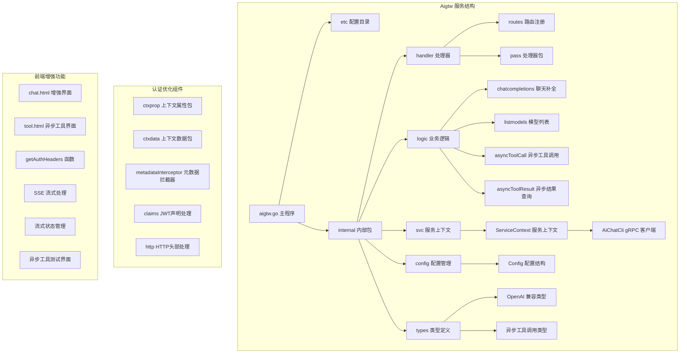

**图表来源**
- [aigtw.go:32-106](file://aiapp/aigtw/aigtw.go#L32-L106)
- [config.go:20-28](file://aiapp/aigtw/internal/config/config.go#L20-L28)
- [http.go:10-20](file://common/ctxprop/http.go#L10-L20)
- [ctxData.go:32-39](file://common/ctxdata/ctxData.go#L32-L39)

**章节来源**
- [aigtw.go:1-106](file://aiapp/aigtw/aigtw.go#L1-L106)
- [aigtw.yaml:1-25](file://aiapp/aigtw/etc/aigtw.yaml#L1-L25)

## 核心组件

### 配置管理系统

Aigtw 服务使用 GoZero 的配置系统，支持多种环境配置和动态加载：

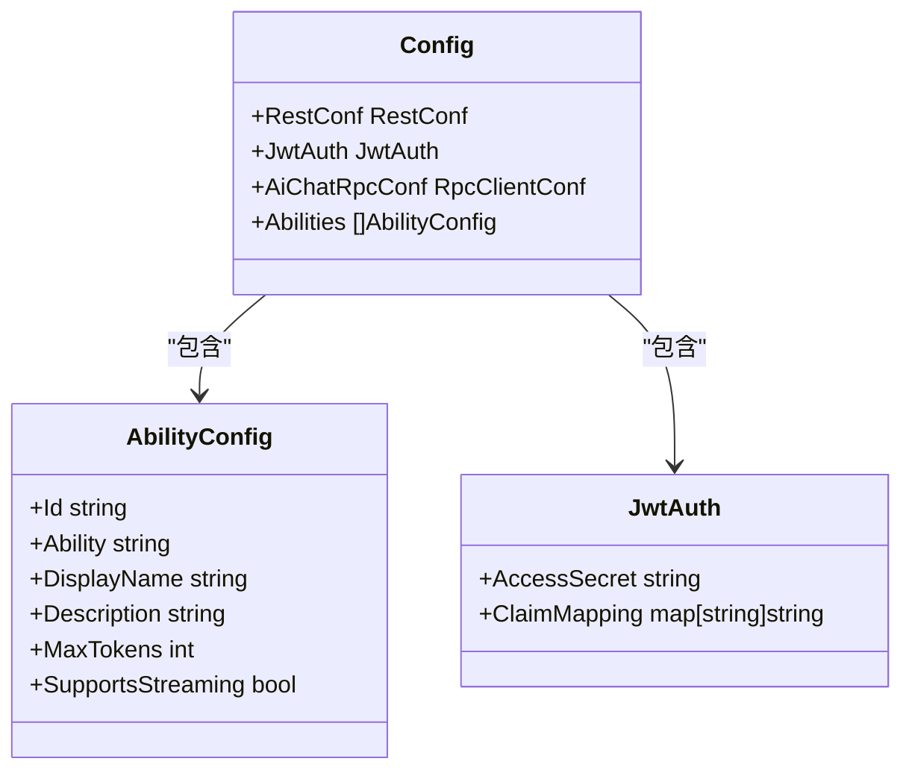

**图表来源**
- [config.go:11-28](file://aiapp/aigtw/internal/config/config.go#L11-L28)

### 服务上下文管理

ServiceContext 负责管理服务的全局状态和依赖注入：

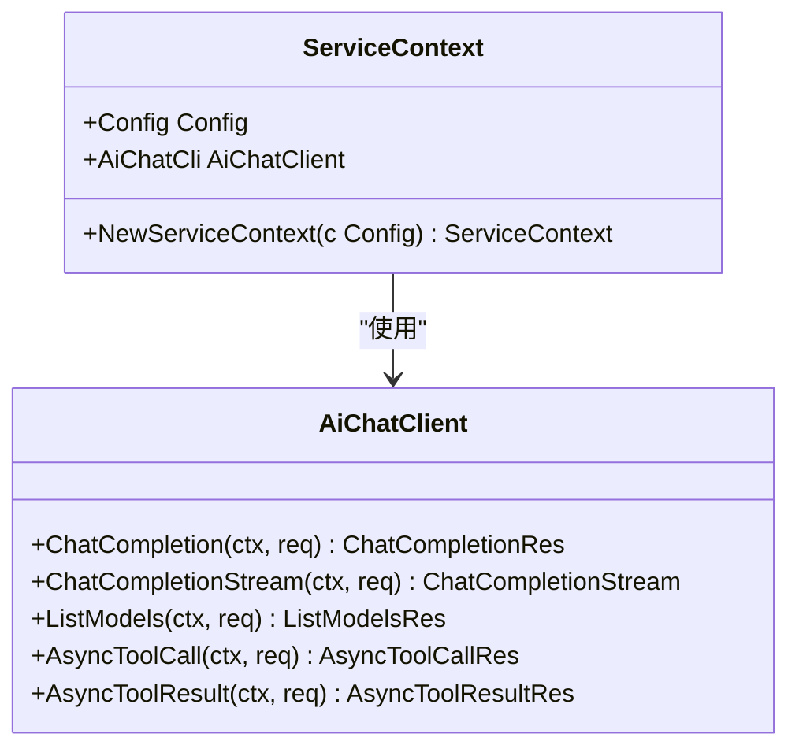

**图表来源**
- [servicecontext.go:12-25](file://aiapp/aigtw/internal/svc/servicecontext.go#L12-L25)

**章节来源**
- [config.go:1-29](file://aiapp/aigtw/internal/config/config.go#L1-L29)
- [servicecontext.go:1-26](file://aiapp/aigtw/internal/svc/servicecontext.go#L1-L26)

## 架构概览

Aigtw 网关服务采用分层架构设计，实现了清晰的关注点分离：

```mermaid
graph TB
subgraph "客户端层"
Client[HTTP 客户端]
Client --> Frontend[前端界面]
Frontend --> Auth[认证处理]
Auth --> StreamHeader[流式头部管理]
Auth --> ToolInterface[异步工具界面]
end
subgraph "网关层"
Router[REST 路由器]
Handler[HTTP 处理器]
Logic[业务逻辑层]
end
subgraph "认证优化层"
CtxProp[ctxprop 上下文属性]
CtxData[ctxdata 上下文数据]
Claims[JWT声明处理]
End
subgraph "服务层"
ServiceContext[服务上下文]
GRPCClient[gRPC 客户端]
SSEWriter[SSE 写入器]
ToolExecutor[工具执行器]
end
subgraph "AIChat 服务"
AIChat[AIChat 服务]
ModelManager[模型管理器]
ToolManager[MCP 工具管理器]
end
Client --> Router
Router --> Handler
Handler --> Logic
Logic --> ServiceContext
ServiceContext --> GRPCClient
GRPCClient --> AIChat
AIChat --> ModelManager
AIChat --> ToolManager
subgraph "中间件层"
JWT[JWT 认证]
CORS[CORS 跨域]
ErrorHandler[错误处理]
SSE[SSE 流式支持]
MetadataInterceptor[元数据拦截器]
End
Router --> JWT
Router --> CORS
Router --> ErrorHandler
Router --> SSE
Router --> MetadataInterceptor
CtxProp --> Claims
CtxProp --> CtxData
Claims --> CtxData
```

**图表来源**
- [aigtw.go:44-74](file://aiapp/aigtw/aigtw.go#L44-L74)
- [routes.go:16-62](file://aiapp/aigtw/internal/handler/routes.go#L16-L62)
- [metadataInterceptor.go:11-19](file://common/Interceptor/rpcclient/metadataInterceptor.go#L11-L19)

### API 接口设计

服务提供三个主要的 OpenAI 兼容接口和两个异步工具调用接口：

| 接口组 | 接口 | 方法 | 路径 | 功能描述 |
|--------|------|------|------|----------|
| 模型管理 | 模型列表 | GET | `/ai/v1/models` | 获取可用的 AI 模型列表 |
| 聊天补全 | 聊天补全 | POST | `/ai/v1/chat/completions` | 进行对话补全，支持流式和非流式 |
| 异步工具调用 | 异步调用 | POST | `/ai/v1/async/tool/call` | 提交MCP工具异步调用任务 |
| 异步工具调用 | 查询结果 | GET | `/ai/v1/async/tool/result/:task_id` | 查询异步工具调用执行结果 |

**章节来源**
- [aigtw.api:14-54](file://aiapp/aigtw/aigtw.api#L14-L54)
- [routes.go:16-62](file://aiapp/aigtw/internal/handler/routes.go#L16-L62)

## 详细组件分析

### 聊天补全逻辑

聊天补全功能是 Aigtw 的核心组件，支持同步和流式两种处理模式：

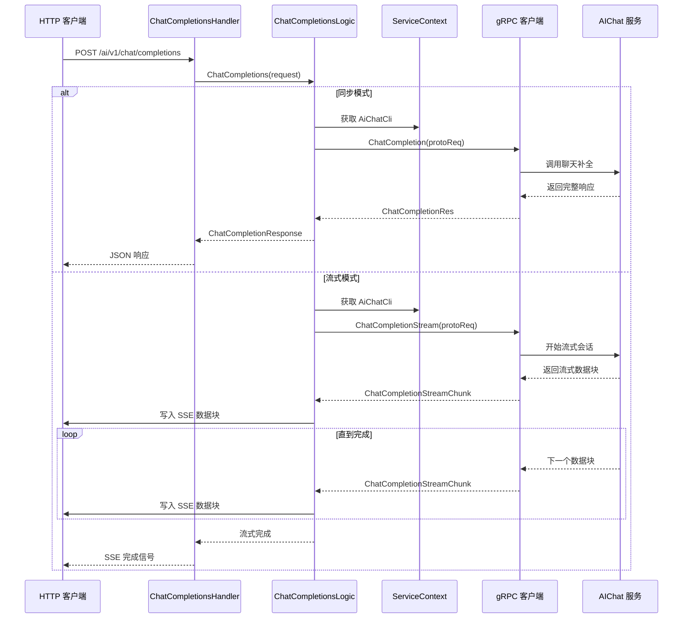

**图表来源**
- [chatcompletionslogic.go:35-100](file://aiapp/aigtw/internal/logic/pass/chatcompletionslogic.go#L35-L100)

#### 数据转换层

服务实现了 HTTP JSON 和 gRPC 协议之间的双向数据转换：

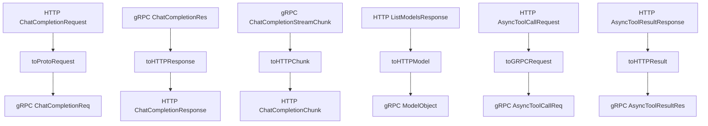

**图表来源**
- [chatcompletionslogic.go:102-194](file://aiapp/aigtw/internal/logic/pass/chatcompletionslogic.go#L102-L194)

**章节来源**
- [chatcompletionslogic.go:1-194](file://aiapp/aigtw/internal/logic/pass/chatcompletionslogic.go#L1-L194)

### 模型管理逻辑

模型列表功能提供了对可用 AI 模型的查询和管理：

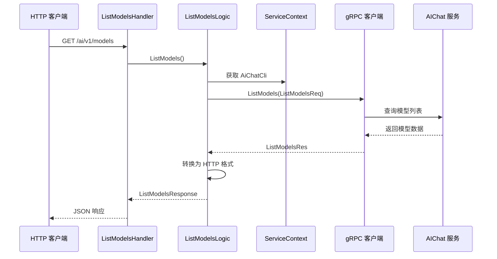

**图表来源**
- [listmodelslogic.go:31-56](file://aiapp/aigtw/internal/logic/pass/listmodelslogic.go#L31-L56)

**章节来源**
- [listmodelslogic.go:1-57](file://aiapp/aigtw/internal/logic/pass/listmodelslogic.go#L1-L57)

### 中间件和拦截器

服务集成了多个中间件来增强功能：

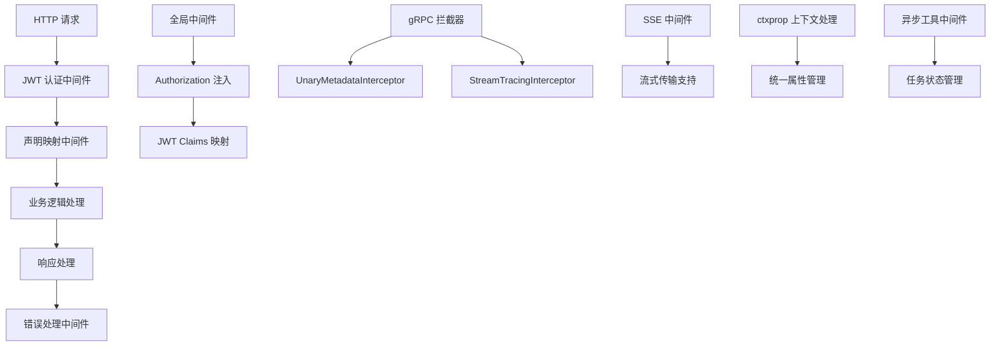

**图表来源**
- [aigtw.go:48-71](file://aiapp/aigtw/aigtw.go#L48-L71)
- [servicecontext.go:21-23](file://aiapp/aigtw/internal/svc/servicecontext.go#L21-L23)
- [metadataInterceptor.go:11-19](file://common/Interceptor/rpcclient/metadataInterceptor.go#L11-L19)

**章节来源**
- [aigtw.go:1-106](file://aiapp/aigtw/aigtw.go#L1-L106)
- [servicecontext.go:1-26](file://aiapp/aigtw/internal/svc/servicecontext.go#L1-L26)

## 异步工具调用功能

### 异步工具调用架构

**更新** Aigtw 服务新增了完整的异步工具调用功能，支持MCP工具的异步执行：

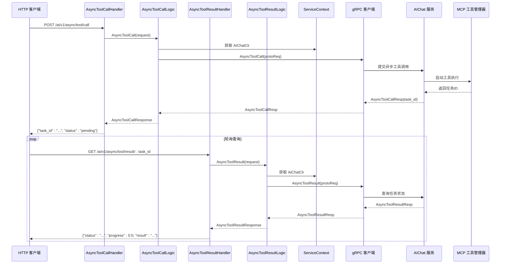

**图表来源**
- [asyncToolCallHandler.go:16-32](file://aiapp/aigtw/internal/handler/pass/asyncToolCallHandler.go#L16-L32)
- [asyncToolResultHandler.go:17-33](file://aiapp/aigtw/internal/handler/pass/asyncToolResultHandler.go#L17-L33)
- [asyncToolCallLogic.go:26-48](file://aiapp/aigtw/internal/logic/pass/asyncToolCallLogic.go#L26-L48)
- [asynctoolresultlogic.go:25-41](file://aiapp/aigtw/internal/logic/pass/asynctoolresultlogic.go#L25-L41)

### 异步工具调用处理器

异步工具调用处理器负责接收HTTP请求并调用业务逻辑：

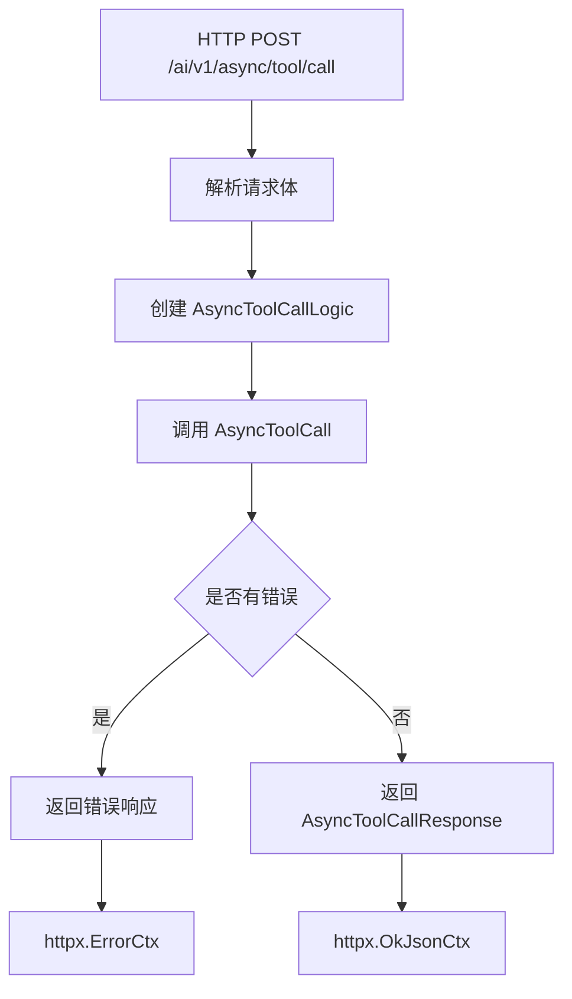

**图表来源**
- [asyncToolCallHandler.go:16-32](file://aiapp/aigtw/internal/handler/pass/asyncToolCallHandler.go#L16-L32)

### 异步结果查询处理器

异步结果查询处理器负责根据任务ID查询执行状态：

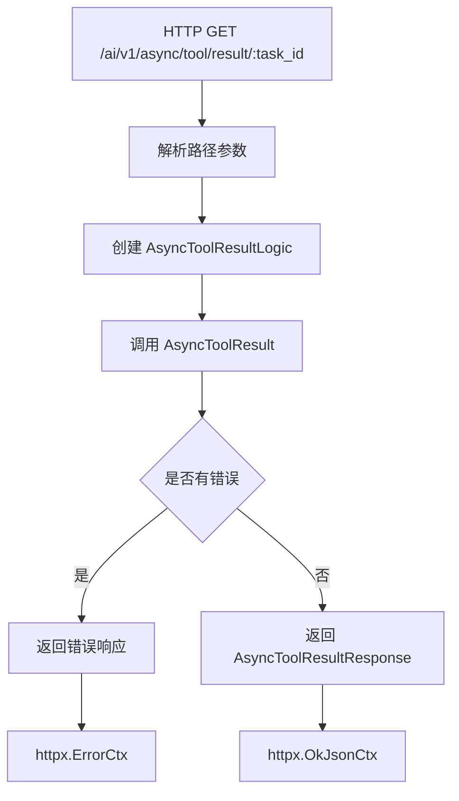

**图表来源**
- [asyncToolResultHandler.go:17-33](file://aiapp/aigtw/internal/handler/pass/asyncToolResultHandler.go#L17-L33)

### 异步工具调用业务逻辑

异步工具调用业务逻辑负责与AIChat服务通信：

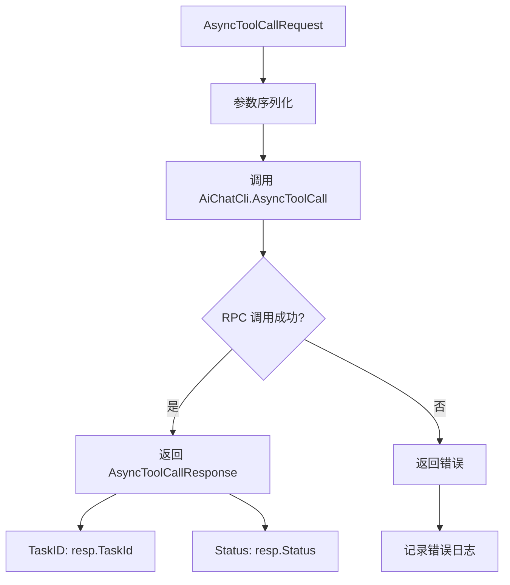

**图表来源**
- [asyncToolCallLogic.go:26-48](file://aiapp/aigtw/internal/logic/pass/asyncToolCallLogic.go#L26-L48)

### 异步结果查询业务逻辑

异步结果查询业务逻辑负责获取执行结果：

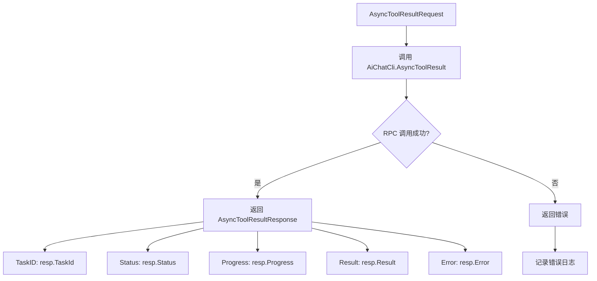

**图表来源**
- [asynctoolresultlogic.go:25-41](file://aiapp/aigtw/internal/logic/pass/asynctoolresultlogic.go#L25-L41)

### 异步工具调用类型定义

服务定义了完整的异步工具调用数据类型：

```mermaid
classDiagram
class AsyncToolCallRequest {
+string Server
+string Tool
+map[string]interface{} Args
}
class AsyncToolCallResponse {
+string TaskID
+string Status
}
class AsyncToolResultRequest {
+string TaskID
}
class AsyncToolResultResponse {
+string TaskID
+string Status
+float64 Progress
+string Result
+string Error
}
AsyncToolCallRequest --> AsyncToolCallResponse : "调用后返回"
AsyncToolResultRequest --> AsyncToolResultResponse : "查询后返回"
```

**图表来源**
- [types.go:6-27](file://aiapp/aigtw/internal/types/types.go#L6-L27)

### 异步工具调用HTML界面

**新增** 服务提供了完整的HTML工具界面用于测试异步工具调用：

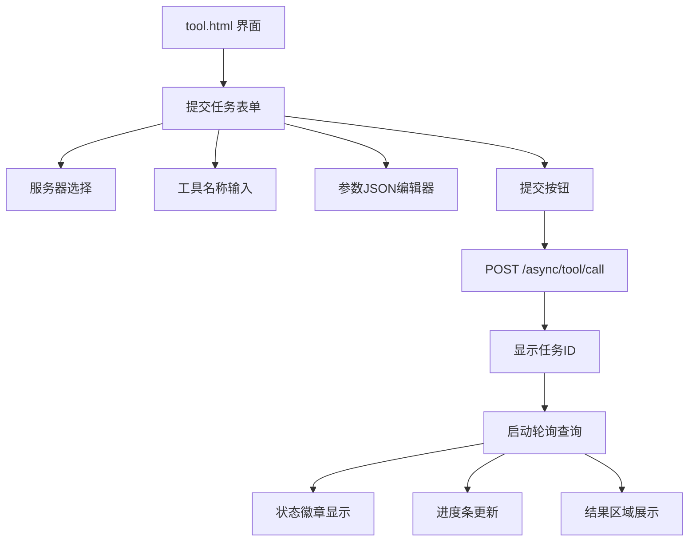

**图表来源**
- [tool.html:172-213](file://aiapp/aigtw/tool.html#L172-L213)

**章节来源**
- [asyncToolCallHandler.go:1-33](file://aiapp/aigtw/internal/handler/pass/asyncToolCallHandler.go#L1-L33)
- [asyncToolResultHandler.go:1-34](file://aiapp/aigtw/internal/handler/pass/asyncToolResultHandler.go#L1-L34)
- [asyncToolCallLogic.go:1-49](file://aiapp/aigtw/internal/logic/pass/asyncToolCallLogic.go#L1-L49)
- [asynctoolresultlogic.go:1-42](file://aiapp/aigtw/internal/logic/pass/asynctoolresultlogic.go#L1-L42)
- [types.go:1-110](file://aiapp/aigtw/internal/types/types.go#L1-L110)
- [tool.html:1-452](file://aiapp/aigtw/tool.html#L1-L452)

## 认证头处理优化

### 上下文属性管理

**更新** Aigtw 服务引入了全新的认证头处理机制，通过ctxprop包实现统一的上下文属性提取和注入：

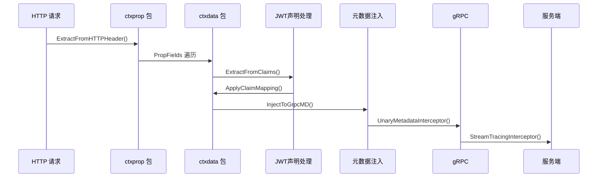

**图表来源**
- [http.go:24-36](file://common/ctxprop/http.go#L24-L36)
- [claims.go:13-23](file://common/ctxprop/claims.go#L13-L23)
- [ctxData.go:32-39](file://common/ctxdata/ctxData.go#L32-L39)
- [metadataInterceptor.go:11-19](file://common/Interceptor/rpcclient/metadataInterceptor.go#L11-L19)

#### HTTP头部提取

新的HTTP头部处理机制通过ExtractFromHTTPHeader函数实现：

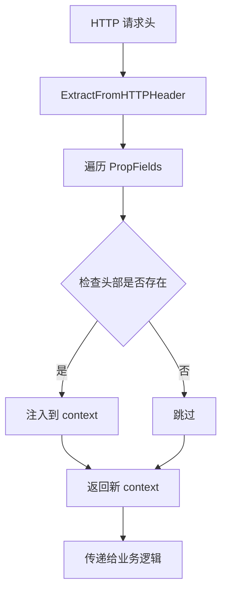

**图表来源**
- [http.go:24-36](file://common/ctxprop/http.go#L24-L36)

#### JWT声明映射

JWT声明处理通过ApplyClaimMappingToCtx函数实现：

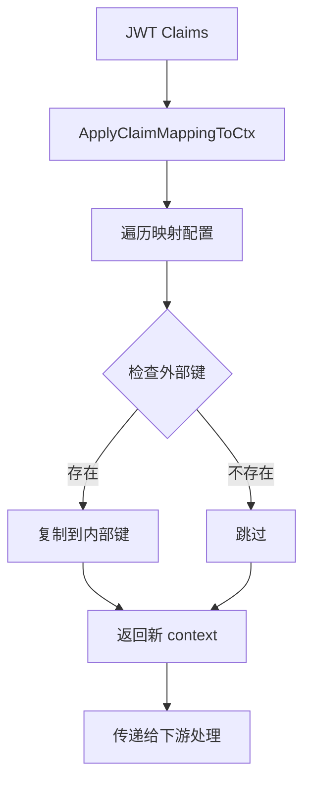

**图表来源**
- [claims.go:41-47](file://common/ctxprop/claims.go#L41-L47)

#### gRPC元数据拦截

元数据拦截器通过UnaryMetadataInterceptor和StreamTracingInterceptor实现：

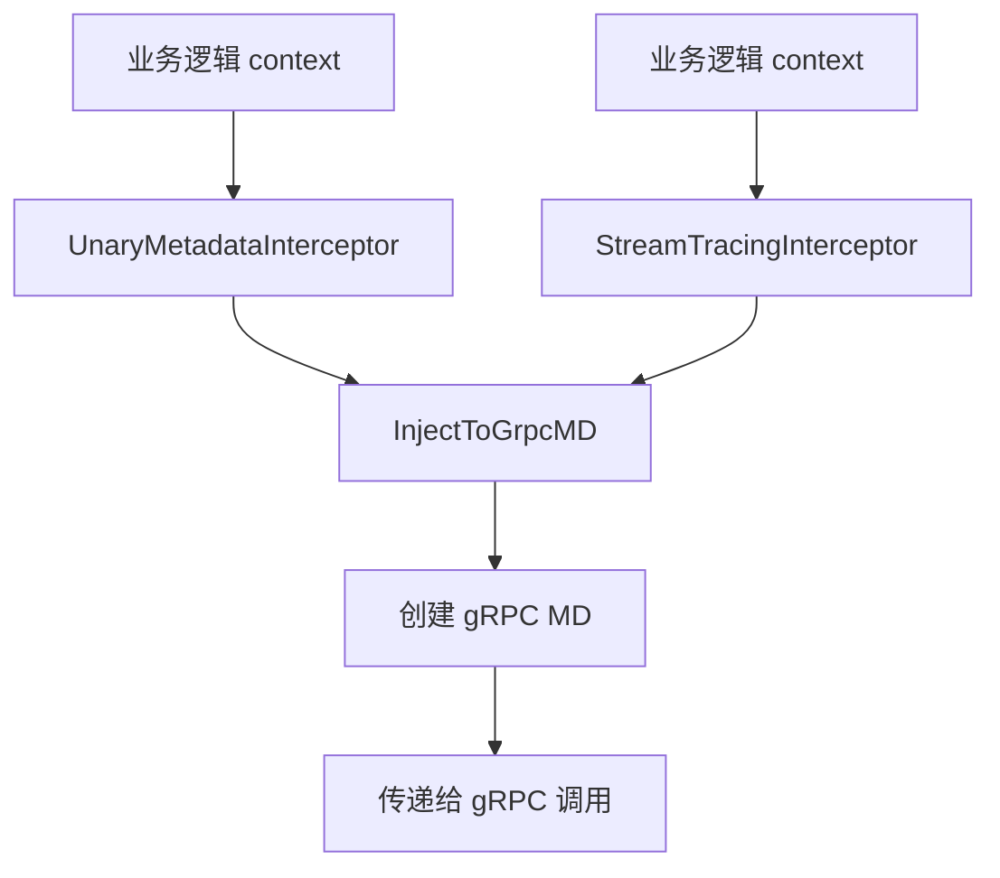

**图表来源**
- [metadataInterceptor.go:11-19](file://common/Interceptor/rpcclient/metadataInterceptor.go#L11-L19)

**章节来源**
- [http.go:1-37](file://common/ctxprop/http.go#L1-L37)
- [claims.go:1-69](file://common/ctxprop/claims.go#L1-L69)
- [ctx.go:1-78](file://common/ctxprop/ctx.go#L1-L78)
- [ctxData.go:1-77](file://common/ctxdata/ctxData.go#L1-L77)
- [metadataInterceptor.go:1-20](file://common/Interceptor/rpcclient/metadataInterceptor.go#L1-L20)

## 依赖关系分析

### 外部依赖关系

Aigtw 服务依赖于多个外部组件和框架：

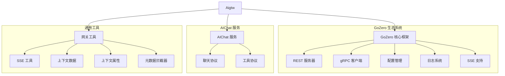

**图表来源**
- [aigtw.go:6-28](file://aiapp/aigtw/aigtw.go#L6-L28)
- [servicecontext.go:3-10](file://aiapp/aigtw/internal/svc/servicecontext.go#L3-L10)
- [metadataInterceptor.go:3-9](file://common/Interceptor/rpcclient/metadataInterceptor.go#L3-L9)

### 内部模块依赖

服务内部模块之间存在清晰的依赖关系：

```mermaid
graph LR
subgraph "核心模块"
Config[config] --> Handler[handler]
Types[types] --> Handler
Types --> Logic[logic]
Svc[svc] --> Handler
Svc --> Logic
end
subgraph "处理器"
Routes[routes] --> Handler
Handler --> Logic
Handler --> AsyncToolCallHandler
Handler --> AsyncToolResultHandler
end
subgraph "业务逻辑"
ChatLogic[chatcompletionslogic] --> Types
ChatLogic --> Svc
ModelLogic[listmodelslogic] --> Types
ModelLogic --> Svc
AsyncCallLogic[asyncToolCallLogic] --> Types
AsyncCallLogic --> Svc
AsyncResultLogic[asyncToolResultLogic] --> Types
AsyncResultLogic --> Svc
end
subgraph "服务上下文"
ServiceContext --> Svc
ServiceContext --> Config
end
subgraph "认证优化"
CtxData[ctxdata] --> CtxProp[ctxprop]
CtxProp --> MetadataInterceptor
end
```

**图表来源**
- [routes.go:16-62](file://aiapp/aigtw/internal/handler/routes.go#L16-L62)
- [chatcompletionslogic.go:1-16](file://aiapp/aigtw/internal/logic/pass/chatcompletionslogic.go#L1-L16)
- [asyncToolCallHandler.go:16-32](file://aiapp/aigtw/internal/handler/pass/asyncToolCallHandler.go#L16-L32)
- [asyncToolResultHandler.go:17-33](file://aiapp/aigtw/internal/handler/pass/asyncToolResultHandler.go#L17-L33)
- [ctxData.go:32-39](file://common/ctxdata/ctxData.go#L32-L39)

**章节来源**
- [aigtw.go:1-106](file://aiapp/aigtw/aigtw.go#L1-L106)
- [routes.go:1-64](file://aiapp/aigtw/internal/handler/routes.go#L1-L64)

## 性能考虑

### 认证头处理优化

**更新** Aigtw 服务在认证头处理方面采用了多项优化策略：

1. **上下文直接处理**：使用请求上下文直接处理Authorization头部，避免额外的字符串操作
2. **统一属性管理**：通过ctxprop包实现统一的上下文属性提取和注入机制
3. **批量头部处理**：一次性处理所有配置的头部字段，减少循环开销
4. **智能缓存**：利用GoZero的上下文缓存机制，避免重复计算
5. **零拷贝优化**：在可能的情况下避免不必要的数据复制

### 流式处理优化

服务在流式处理方面采用了多项优化策略：

1. **SSE 桥接优化**：使用专门的 SSE 写入器来处理流式响应
2. **客户端断开检测**：实时监控客户端连接状态，及时释放资源
3. **内存管理**：避免在流式过程中累积大量数据
4. **超时控制**：支持无限超时的流式连接配置
5. **流式头部管理**：智能的Accept: text/event-stream头部处理

### 异步工具调用性能优化

**新增** 异步工具调用功能采用了多项性能优化策略：

1. **任务状态缓存**：使用内存缓存存储任务状态，减少数据库访问
2. **轮询间隔优化**：默认500ms轮询间隔，平衡响应性和资源消耗
3. **连接池管理**：通过RpcClientConf配置实现gRPC连接池复用
4. **超时配置**：灵活的超时设置适应不同工具执行时间
5. **错误重试机制**：对临时性错误进行自动重试

### 缓存和连接池

服务通过配置实现了高效的连接管理：

- **gRPC 连接复用**：通过 RpcClientConf 配置实现连接池管理
- **非阻塞调用**：支持非阻塞的 RPC 调用模式
- **超时配置**：灵活的超时设置适应不同场景需求

### 错误处理性能

统一的错误处理机制减少了重复代码和提高了处理效率：

- **OpenAI 风格错误**：标准化的错误响应格式
- **类型安全**：编译时检查确保错误处理的正确性
- **性能优化**：避免不必要的字符串操作和内存分配

## 故障排除指南

### 常见问题诊断

#### 连接问题

当遇到与 AIChat 服务的连接问题时，可以按照以下步骤排查：

1. **检查服务地址配置**
   - 验证 `AiChatRpcConf.Endpoints` 配置是否正确
   - 确认目标服务端口和主机地址

2. **网络连通性测试**
   - 使用 `telnet` 或 `nc` 测试端口连通性
   - 检查防火墙和安全组规则

3. **认证问题**
   - 验证 JWT 密钥配置
   - 检查声明映射配置是否正确
   - **新增** 验证Authorization头部是否正确注入到gRPC元数据

#### 流式处理问题

如果流式响应出现问题：

1. **检查客户端兼容性**
   - 确认客户端支持 SSE 协议
   - 验证浏览器或客户端的事件流处理能力

2. **验证流式头部**
   - 确认前端getAuthHeaders函数正确设置了Accept: text/event-stream头部
   - 检查流式传输开关是否正确启用

3. **监控连接状态**
   - 查看服务端日志中的连接断开信息
   - 检查客户端网络稳定性

4. **SSE 处理器检查**
   - 确认后端routes.go中已启用rest.WithSSE()
   - 验证handleStream处理器正常工作

#### 异步工具调用问题

**新增** 当异步工具调用出现问题时：

1. **检查工具配置**
   - 验证MCP服务器配置是否正确
   - 确认工具名称和参数格式是否正确

2. **验证任务状态**
   - 检查任务ID格式是否正确
   - 确认轮询间隔设置合理

3. **监控工具执行**
   - 查看AIChat服务中的工具执行日志
   - 验证工具是否正常启动和执行

4. **检查结果查询**
   - 确认AsyncToolResult接口正常工作
   - 验证任务状态转换逻辑

5. **HTML界面测试**
   - 使用tool.html界面测试异步工具调用
   - 验证轮询机制和状态更新

#### 认证头处理问题

**新增** 当认证头处理出现问题时：

1. **检查上下文属性**
   - 验证ctxdata.PropFields配置是否正确
   - 确认Authorization头部映射是否正确

2. **验证JWT声明处理**
   - 检查claims映射配置是否正确
   - 确认ApplyClaimMappingToCtx函数正常工作

3. **gRPC元数据检查**
   - 验证UnaryMetadataInterceptor是否正确注入
   - 检查StreamTracingInterceptor配置

4. **日志分析**
   - 查看ctxprop包的日志输出
   - 分析认证头处理的详细流程

#### 错误处理问题

当错误响应不符合预期时：

1. **检查错误处理器配置**
   - 确认 `SetOpenAIErrorHandler()` 是否正确调用
   - 验证错误映射规则

2. **查看日志输出**
   - 检查详细的错误堆栈信息
   - 分析错误类型和状态码

**章节来源**
- [openai_error.go:72-102](file://common/gtwx/openai_error.go#L72-L102)
- [errorhandler.go:18-35](file://common/gtwx/errorhandler.go#L18-L35)
- [http.go:10-20](file://common/ctxprop/http.go#L10-L20)
- [claims.go:25-47](file://common/ctxprop/claims.go#L25-L47)

### 配置调试

#### 日志配置

服务支持多种日志级别和输出格式：

- **日志级别**：支持 debug、info、warn、error 等级别
- **输出格式**：支持 JSON 和纯文本格式
- **文件轮转**：自动的日志文件轮转和清理

#### 性能监控

建议启用以下监控指标：

- **请求计数**：跟踪每个接口的调用次数
- **响应时间**：监控服务响应延迟
- **错误率**：统计各类错误的发生频率
- **连接状态**：监控 gRPC 连接健康状况
- **流式传输统计**：监控流式连接数量和数据传输量
- **异步任务统计**：监控异步任务数量和执行成功率
- **认证头处理统计**：监控上下文属性处理的性能指标

## 结论

Aigtw 网关服务是一个设计精良的 OpenAI 兼容 API 网关，具有以下显著特点：

### 技术优势

1. **架构清晰**：采用分层架构，职责分离明确
2. **扩展性强**：支持多种部署模式和配置选项
3. **性能优秀**：优化的流式处理和连接管理
4. **开发友好**：完善的错误处理和日志系统
5. **用户体验优秀**：增强的流式传输支持提供实时对话体验
6. **认证优化**：**新增** 基于上下文的认证头处理机制，提升性能和安全性
7. **异步处理能力**：**新增** 完整的异步工具调用功能，支持长时间运行的任务

### 功能完整性

- 完整的 OpenAI API 兼容性
- 支持同步和流式两种处理模式
- 丰富的配置选项和中间件支持
- 统一的错误处理机制
- 增强的流式传输支持和SSE桥接
- **新增** 异步工具调用接口和HTML测试界面
- **新增** 优化的认证头处理和上下文管理

### 最佳实践

该服务体现了微服务架构的最佳实践：
- 清晰的模块划分和依赖管理
- 标准化的配置和部署流程
- 完善的监控和故障排除机制
- 良好的性能优化和资源管理
- 现代化的前端交互和实时通信支持
- **新增** 统一的上下文属性管理和认证头处理机制
- **新增** 完整的异步任务管理和状态查询机制

Aigtw 网关服务为构建 AI 应用提供了稳定可靠的基础平台，适合在生产环境中部署和使用。**更新** 新增的异步工具调用功能使其能够处理更复杂的任务场景，配合优化的认证头处理机制，在保持功能完整性的同时，显著提升了整体性能表现，特别适用于高并发和长时间运行的AI应用场景。