# Aigtw 网关服务

<cite>
**本文档引用的文件**
- [aigtw.go](file://aiapp/aigtw/aigtw.go)
- [aigtw.yaml](file://aiapp/aigtw/etc/aigtw.yaml)
- [config.go](file://aiapp/aigtw/internal/config/config.go)
- [aigtw.api](file://aiapp/aigtw/aigtw.api)
- [types.go](file://aiapp/aigtw/internal/types/types.go)
- [routes.go](file://aiapp/aigtw/internal/handler/routes.go)
- [chatcompletionslogic.go](file://aiapp/aigtw/internal/logic/pass/chatcompletionslogic.go)
- [listmodelslogic.go](file://aiapp/aigtw/internal/logic/pass/listmodelslogic.go)
- [asyncToolCallLogic.go](file://aiapp/aigtw/internal/logic/pass/asyncToolCallLogic.go)
- [asyncToolResultLogic.go](file://aiapp/aigtw/internal/logic/pass/asyncToolResultLogic.go)
- [asyncresultstatslogic.go](file://aiapp/aigtw/internal/logic/pass/asyncresultstatslogic.go)
- [listasyncresultslogic.go](file://aiapp/aigtw/internal/logic/pass/listasyncresultslogic.go)
- [listasyncresultshandler.go](file://aiapp/aigtw/internal/handler/pass/listasyncresultshandler.go)
- [servicecontext.go](file://aiapp/aigtw/internal/svc/servicecontext.go)
- [errors.go](file://aiapp/aigtw/internal/types/errors.go)
- [cors.go](file://common/gtwx/cors.go)
- [errorhandler.go](file://common/gtwx/errorhandler.go)
- [openai_error.go](file://common/gtwx/openai_error.go)
- [chat.html](file://aiapp/aigtw/chat.html)
- [tool.html](file://aiapp/aigtw/tool.html)
- [results.html](file://aiapp/aigtw/results.html)
- [http.go](file://common/ctxprop/http.go)
- [claims.go](file://common/ctxprop/claims.go)
- [ctx.go](file://common/ctxprop/ctx.go)
- [ctxData.go](file://common/ctxdata/ctxData.go)
- [metadataInterceptor.go](file://common/Interceptor/rpcclient/metadataInterceptor.go)
- [chatcompletionshandler.go](file://aiapp/aigtw/internal/handler/pass/chatcompletionshandler.go)
- [asyncToolCallHandler.go](file://aiapp/aigtw/internal/handler/pass/asyncToolCallHandler.go)
- [asyncToolResultHandler.go](file://aiapp/aigtw/internal/handler/pass/asyncToolResultHandler.go)
- [asyncresultstatshandler.go](file://aiapp/aigtw/internal/handler/pass/asyncresultstatshandler.go)
- [aichat.proto](file://aiapp/aichat/aichat.proto)
- [writer.go](file://common/ssex/writer.go)
- [client.go](file://common/mcpx/client.go)
</cite>

## 更新摘要
**变更内容**
- 增强SSE事件处理能力：支持结构化的工具事件（tool_start、tool_progress、tool_success、tool_error）
- 自动事件类型推断：基于JSON内容自动识别工具事件类型，无需手动指定
- 现代化前端工具调用界面：新增工具卡片显示、进度条、状态指示器和错误处理
- SSE事件类型支持：通过inferToolEventType函数实现事件类型自动推断
- 工具事件处理器：新增handleToolEvent函数处理四种标准工具事件
- 工具卡片渲染：支持工具执行状态的可视化展示，包括进度条、状态图标和执行时间
- 错误消息处理：集成Toast通知系统，提供工具执行错误的实时提示

## 目录
1. [简介](#简介)
2. [项目结构](#项目结构)
3. [核心组件](#核心组件)
4. [架构概览](#架构概览)
5. [详细组件分析](#详细组件分析)
6. [增强SSE事件处理能力](#增强sse事件处理能力)
7. [自动事件类型推断](#自动事件类型推断)
8. [现代化前端工具调用界面](#现代化前端工具调用界面)
9. [工具事件处理系统](#工具事件处理系统)
10. [工具卡片渲染系统](#工具卡片渲染系统)
11. [错误消息处理机制](#错误消息处理机制)
12. [静态文件路由系统重构](#静态文件路由系统重构)
13. [统一导航头部实现](#统一导航头部实现)
14. [响应式设计优化](#响应式设计优化)
15. [异步工具调用功能](#异步工具调用功能)
16. [异步结果管理界面](#异步结果管理界面)
17. [HTTP请求响应监控系统](#http请求响应监控系统)
18. [认证头处理优化](#认证头处理优化)
19. [依赖关系分析](#依赖关系分析)
20. [性能考虑](#性能考虑)
21. [故障排除指南](#故障排除指南)
22. [结论](#结论)

## 简介

Aigtw 网关服务是一个基于 GoZero 框架构建的 OpenAI 兼容 API 网关，主要负责将 HTTP 请求转换为 gRPC 协议，与 AIChat 服务进行通信。该服务提供了完整的聊天补全功能，支持同步和流式两种模式，并实现了 OpenAI 风格的错误处理机制。

**更新** 该服务现已新增增强的SSE事件处理能力，支持结构化的工具事件（tool_start、tool_progress、tool_success、tool_error）。通过自动事件类型推断机制，服务能够智能识别来自AIChat服务的工具执行状态，并将其转换为标准的SSE事件格式。前端界面现在提供现代化的工具调用界面，包括工具卡片显示、进度条、状态指示器和错误处理功能，为用户提供直观的工具执行可视化体验。

**新增** 服务的SSE事件处理系统通过inferToolEventType函数实现事件类型自动推断，能够从JSON内容中提取事件类型信息，无需手动指定。这使得工具事件的处理更加灵活和自动化，支持各种不同格式的工具执行状态报告。

**新增** 前端工具调用界面采用了现代化的设计理念，使用工具卡片（tool-call-card）来展示工具执行状态。每个工具卡片包含工具名称、执行进度、状态图标、执行时间和错误消息等功能，提供完整的工具执行可视化体验。支持四种标准工具事件：tool_start（工具开始执行）、tool_progress（工具执行进度）、tool_success（工具执行成功）和tool_error（工具执行错误）。

该网关服务的核心特性包括：
- OpenAI 兼容的 API 接口设计
- 支持同步和流式聊天补全
- 基于 JWT 的身份验证
- CORS 跨域资源共享支持
- 统一的错误处理机制
- 模型管理和路由配置
- **新增** 增强的SSE事件处理能力，支持结构化工具事件
- **新增** 自动事件类型推断机制
- **新增** 现代化的前端工具调用界面
- **新增** 工具卡片渲染系统
- **新增** 错误消息处理和Toast通知系统
- **新增** 工具事件处理器和状态管理
- **更新** 简化的异步结果管理界面实现
- **更新** 统一导航头部实现
- **更新** 响应式设计优化

## 项目结构

Aigtw 服务采用典型的 GoZero 微服务架构，具有清晰的分层结构：

```mermaid
graph TB
subgraph "Aigtw 服务结构"
A[aigtw.go 主程序] --> B[etc 配置目录]
A --> C[internal 内部包]
C --> D[config 配置管理]
C --> E[handler 处理器]
C --> F[logic 业务逻辑]
C --> G[svc 服务上下文]
C --> H[types 类型定义]
E --> I[routes 路由注册]
E --> J[pass 处理器包]
F --> K[chatcompletions 聊天补全]
F --> L[listmodels 模型列表]
F --> M[asyncToolCall 异步工具调用]
F --> N[asyncToolResult 异步结果查询]
F --> O[asyncResultStats 异步结果统计]
F --> P[listAsyncResults 异步结果列表]
G --> Q[ServiceContext 服务上下文]
Q --> R[AiChatCli gRPC 客户端]
D --> S[Config 配置结构]
H --> T[OpenAI 兼容类型]
H --> U[异步工具调用类型]
H --> V[异步结果统计类型]
H --> W[分页查询类型]
end
subgraph "SSE事件处理增强"
X[inferToolEventType 事件推断]
Y[handleToolEvent 事件处理器]
Z[tool-call-card 工具卡片]
AA[tool-error-container 错误显示]
BB[Toast通知系统]
CC[SSE Writer 增强]
end
subgraph "认证优化组件"
DD[ctxprop 上下文属性包]
EE[ctxdata 上下文数据包]
FF[metadataInterceptor 元数据拦截器]
GG[claims JWT声明处理]
HH[http HTTP头部处理]
end
subgraph "前端增强功能"
II[chat.html 增强界面]
JJ[tool.html 异步工具界面]
KK[results.html 异步结果管理界面]
LL[统一导航头部]
MM[SSE 流式处理]
NN[流式状态管理]
OO[异步工具测试界面]
PP[请求记录管理]
QQ[实时状态指示器]
RR[步骤时间线可视化]
SS[报文详情面板]
TT[异步结果管理界面]
UU[任务统计可视化]
VV[过滤和分页功能]
WW[详细信息展示]
XX[主题切换功能]
YY[服务状态监控]
ZZ[模态框详情展示]
AAA[消息历史列表]
BBB[结果格式化显示]
CCC[进度条可视化]
DDD[状态标签显示]
EEE[分页导航]
FFF[异步结果统计功能]
GGG[增强的异步结果列表功能]
HHH[进度消息跟踪]
III[HTTP端点服务优化]
JJJ[静态文件路由重构]
KKK[响应式设计优化]
LLL[工具事件处理系统]
MMM[工具卡片渲染系统]
NNN[错误消息处理机制]
OOO[自动事件类型推断]
PPP[SSE事件类型支持]
QQQ[现代化前端界面]
RRR[工具事件处理器]
SSS[工具卡片样式]
TTT[错误消息样式]
UUU[Toast通知样式]
```

**图表来源**
- [aigtw.go:32-106](file://aiapp/aigtw/aigtw.go#L32-L106)
- [config.go:20-28](file://aiapp/aigtw/internal/config/config.go#L20-L28)
- [http.go:10-20](file://common/ctxprop/http.go#L10-L20)
- [ctxData.go:32-39](file://common/ctxdata/ctxData.go#L32-L39)

**章节来源**
- [aigtw.go:1-128](file://aiapp/aigtw/aigtw.go#L1-L128)
- [aigtw.yaml:1-25](file://aiapp/aigtw/etc/aigtw.yaml#L1-L25)

## 核心组件

### 配置管理系统

Aigtw 服务使用 GoZero 的配置系统，支持多种环境配置和动态加载：

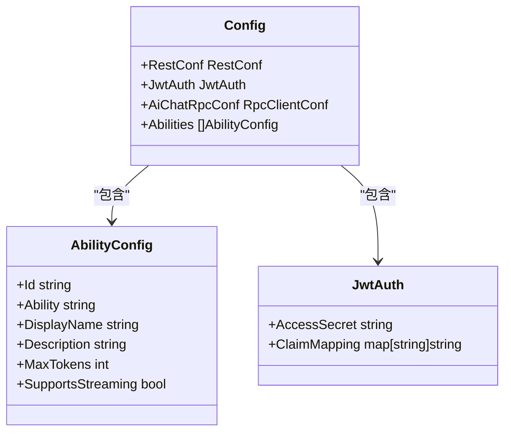

**图表来源**
- [config.go:11-28](file://aiapp/aigtw/internal/config/config.go#L11-L28)

### 服务上下文管理

ServiceContext 负责管理服务的全局状态和依赖注入：

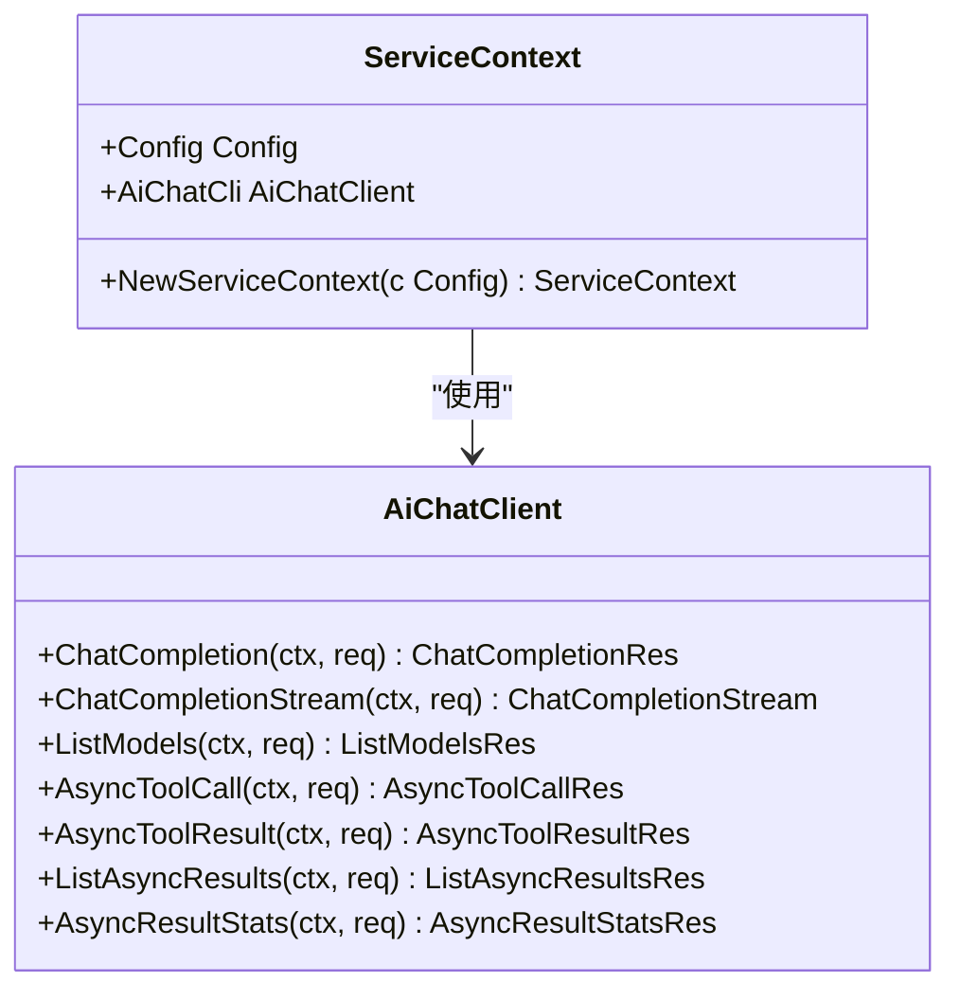

**图表来源**
- [servicecontext.go:12-25](file://aiapp/aigtw/internal/svc/servicecontext.go#L12-L25)

**章节来源**
- [config.go:1-29](file://aiapp/aigtw/internal/config/config.go#L1-L29)
- [servicecontext.go:1-26](file://aiapp/aigtw/internal/svc/servicecontext.go#L1-L26)

## 架构概览

Aigtw 网关服务采用分层架构设计，实现了清晰的关注点分离：

```mermaid
graph TB
subgraph "客户端层"
Client[HTTP 客户端]
Client --> Frontend[前端界面]
Frontend --> Auth[认证处理]
Frontend --> StreamHeader[流式头部管理]
Frontend --> ToolInterface[异步工具界面]
Frontend --> MonitorSystem[监控系统]
Frontend --> ResultsInterface[异步结果管理界面]
end
subgraph "网关层"
Router[REST 路由器]
Handler[HTTP 处理器]
Logic[业务逻辑层]
end
subgraph "SSE事件处理增强"
SSEWriter[SSE 写入器]
ToolEventHandler[工具事件处理器]
AutoInference[自动事件类型推断]
ToolCardRenderer[工具卡片渲染器]
ErrorNotifier[错误通知系统]
end
subgraph "认证优化层"
CtxProp[ctxprop 上下文属性]
CtxData[ctxdata 上下文数据]
Claims[JWT声明处理]
End
subgraph "服务层"
ServiceContext[服务上下文]
GRPCClient[gRPC 客户端]
ToolExecutor[工具执行器]
End
subgraph "AIChat 服务"
AIChat[AIChat 服务]
ModelManager[模型管理器]
ToolManager[MCP 工具管理器]
AsyncResultStore[异步结果存储]
End
Client --> Router
Router --> Handler
Handler --> Logic
Logic --> ServiceContext
ServiceContext --> GRPCClient
GRPCClient --> AIChat
AIChat --> ModelManager
AIChat --> ToolManager
AIChat --> AsyncResultStore
subgraph "中间件层"
JWT[JWT 认证]
CORS[CORS 跨域]
ErrorHandler[错误处理]
SSE[SSE 流式支持]
MetadataInterceptor[元数据拦截器]
End
Router --> JWT
Router --> CORS
Router --> ErrorHandler
Router --> SSE
Router --> MetadataInterceptor
CtxProp --> Claims
CtxProp --> CtxData
Claims --> CtxData
subgraph "监控系统层"
CircularBuffer[圆形缓冲区]
RealTimeDisplay[实时显示]
TimelineVisualization[时间线可视化]
RequestDetailPanel[请求详情面板]
LiveIndicator[实时指示器]
End
MonitorSystem --> CircularBuffer
MonitorSystem --> RealTimeDisplay
MonitorSystem --> TimelineVisualization
MonitorSystem --> RequestDetailPanel
MonitorSystem --> LiveIndicator
subgraph "异步结果管理界面层"
StatsGrid[统计卡片网格]
FilterBar[筛选栏]
Pagination[分页控件]
TaskTable[任务表格]
DetailModal[详情模态框]
ThemeToggle[主题切换]
ServiceStatus[服务状态]
Toast[Toast通知]
MessagesList[消息历史列表]
ProgressBars[进度条]
StatusTags[状态标签]
End
ResultsInterface --> StatsGrid
ResultsInterface --> FilterBar
ResultsInterface --> Pagination
ResultsInterface --> TaskTable
ResultsInterface --> DetailModal
ResultsInterface --> ThemeToggle
ResultsInterface --> ServiceStatus
ResultsInterface --> Toast
ResultsInterface --> MessagesList
ResultsInterface --> ProgressBars
ResultsInterface --> StatusTags
subgraph "HTTP端点服务层"
StaticFileServer[静态文件服务]
DirectEndpoint[直接HTTP端点]
APIData[API数据接口]
End
ResultsInterface --> StaticFileServer
StaticFileServer --> DirectEndpoint
DirectEndpoint --> APIData
```

**图表来源**
- [aigtw.go:44-74](file://aiapp/aigtw/aigtw.go#L44-L74)
- [routes.go:16-74](file://aiapp/aigtw/internal/handler/routes.go#L16-L74)
- [metadataInterceptor.go:11-19](file://common/Interceptor/rpcclient/metadataInterceptor.go#L11-L19)

### API 接口设计

服务提供四个主要的 OpenAI 兼容接口和四个异步工具调用接口：

| 接口组 | 接口 | 方法 | 路径 | 功能描述 |
|--------|------|------|------|----------|
| 模型管理 | 模型列表 | GET | `/ai/v1/models` | 获取可用的 AI 模型列表 |
| 聊天补全 | 聊天补全 | POST | `/ai/v1/chat/completions` | 进行对话补全，支持流式和非流式 |
| 异步工具调用 | 异步调用 | POST | `/ai/v1/async/tool/call` | 提交MCP工具异步调用任务 |
| 异步工具调用 | 查询结果 | GET | `/ai/v1/async/tool/result/:task_id` | 查询异步工具调用执行结果 |
| 异步结果管理 | 结果列表 | GET | `/ai/v1/async/tool/results` | 分页查询异步结果列表，支持过滤和排序 |
| 异步结果管理 | 统计信息 | GET | `/ai/v1/async/tool/stats` | 获取异步结果统计信息 |
| 静态文件服务 | 聊天界面 | GET | `/chat.html` | 提供聊天界面的静态文件服务 |
| 静态文件服务 | 工具界面 | GET | `/tool.html` | 提供异步工具调用界面的静态文件服务 |
| 静态文件服务 | 结果界面 | GET | `/results.html` | 提供异步结果管理界面的静态文件服务 |

**章节来源**
- [aigtw.api:14-86](file://aiapp/aigtw/aigtw.api#L14-L86)
- [routes.go:16-74](file://aiapp/aigtw/internal/handler/routes.go#L16-L74)

## 详细组件分析

### 聊天补全逻辑

聊天补全功能是 Aigtw 的核心组件，支持同步和流式两种处理模式：

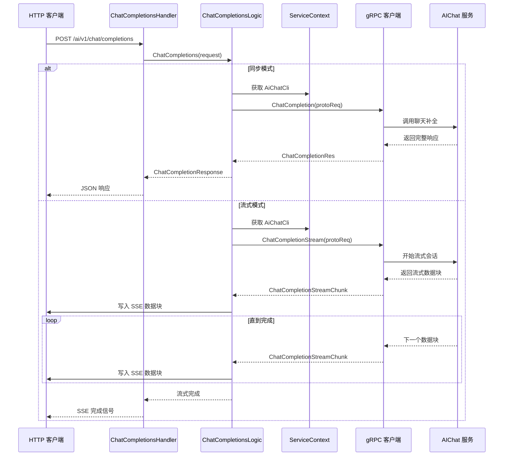

**图表来源**
- [chatcompletionslogic.go:35-100](file://aiapp/aigtw/internal/logic/pass/chatcompletionslogic.go#L35-L100)

#### 数据转换层

服务实现了 HTTP JSON 和 gRPC 协议之间的双向数据转换：

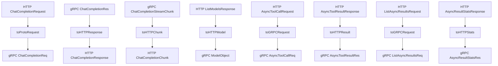

**图表来源**
- [chatcompletionslogic.go:102-194](file://aiapp/aigtw/internal/logic/pass/chatcompletionslogic.go#L102-L194)

**章节来源**
- [chatcompletionslogic.go:1-194](file://aiapp/aigtw/internal/logic/pass/chatcompletionslogic.go#L1-L194)

### 模型管理逻辑

模型列表功能提供了对可用 AI 模型的查询和管理：

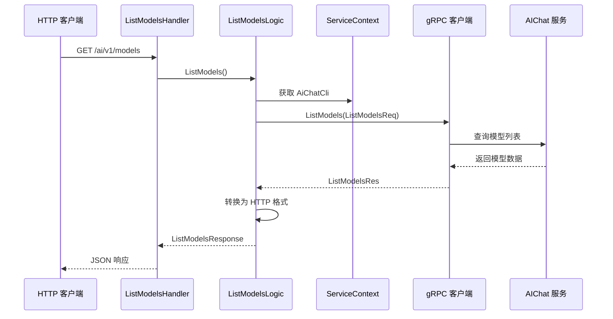

**图表来源**
- [listmodelslogic.go:31-56](file://aiapp/aigtw/internal/logic/pass/listmodelslogic.go#L31-L56)

**章节来源**
- [listmodelslogic.go:1-57](file://aiapp/aigtw/internal/logic/pass/listmodelslogic.go#L1-L57)

### 中间件和拦截器

服务集成了多个中间件来增强功能：

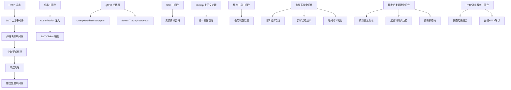

**图表来源**
- [aigtw.go:48-71](file://aiapp/aigtw/aigtw.go#L48-L71)
- [servicecontext.go:21-23](file://aiapp/aigtw/internal/svc/servicecontext.go#L21-L23)
- [metadataInterceptor.go:11-19](file://common/Interceptor/rpcclient/metadataInterceptor.go#L11-L19)

**章节来源**
- [aigtw.go:1-128](file://aiapp/aigtw/aigtw.go#L1-L128)
- [servicecontext.go:1-26](file://aiapp/aigtw/internal/svc/servicecontext.go#L1-L26)

## 增强SSE事件处理能力

### SSE事件类型支持

**更新** Aigtw 服务新增了增强的SSE事件处理能力，支持结构化的工具事件：

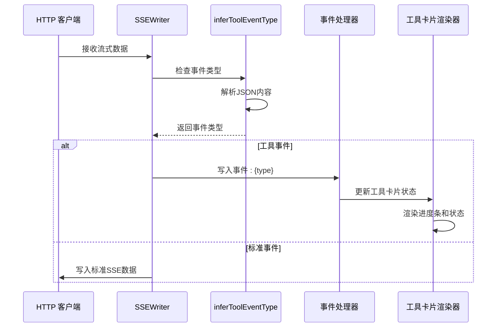

**图表来源**
- [chatcompletionslogic.go:95-124](file://aiapp/aigtw/internal/logic/pass/chatcompletionslogic.go#L95-L124)

#### inferToolEventType 函数实现

inferToolEventType函数实现了智能的事件类型推断：

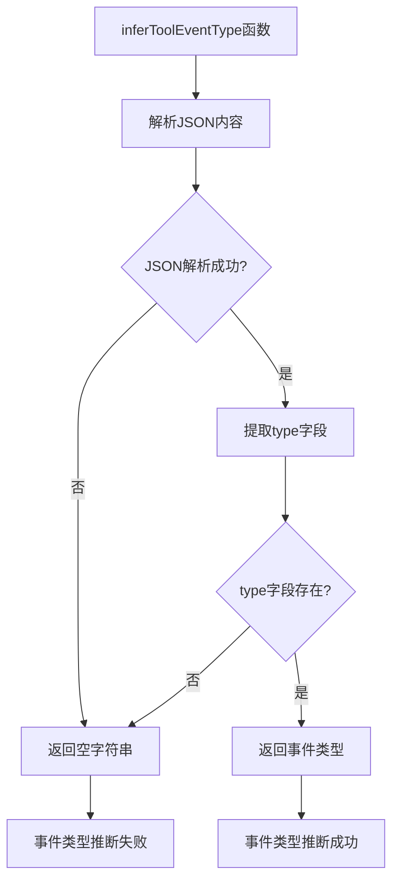

**图表来源**
- [chatcompletionslogic.go:114-124](file://aiapp/aigtw/internal/logic/pass/chatcompletionslogic.go#L114-L124)

#### SSE事件写入机制

SSEWriter现在支持事件类型写入：

```mermaid
flowchart TD
A[WriteEvent函数] --> B[格式化事件行]
B --> C[event: {event}\n]
C --> D[格式化数据行]
D --> E[data: {data}\n]
E --> F[写入空行分隔符]
F --> G[Flush缓冲区]
G --> H[事件写入完成]
```

**图表来源**
- [writer.go:24-32](file://common/ssex/writer.go#L24-L32)

**章节来源**
- [chatcompletionslogic.go:1-235](file://aiapp/aigtw/internal/logic/pass/chatcompletionslogic.go#L1-L235)
- [writer.go:1-79](file://common/ssex/writer.go#L1-L79)

## 自动事件类型推断

### 事件类型推断机制

**更新** 服务实现了自动事件类型推断机制，能够从JSON内容中智能提取事件类型：

```mermaid
flowchart TD
A[工具事件内容] --> B[JSON解析]
B --> C{解析成功?}
C --> |否| D[推断失败，返回空字符串]
C --> |是| E[提取type字段]
E --> F{type字段类型为string?}
F --> |否| D
F --> |是| G[返回事件类型]
D --> H[事件类型: "" (空字符串)]
G --> I[事件类型: "{type}" (具体类型)]
```

**图表来源**
- [chatcompletionslogic.go:114-124](file://aiapp/aigtw/internal/logic/pass/chatcompletionslogic.go#L114-L124)

#### 支持的工具事件类型

自动事件类型推断支持以下四种标准工具事件：

1. **tool_start**：工具开始执行事件
2. **tool_progress**：工具执行进度事件  
3. **tool_success**：工具执行成功事件
4. **tool_error**：工具执行错误事件

#### 事件内容格式要求

事件内容必须符合以下JSON格式要求：

```json
{
  "type": "tool_start",
  "tool_id": "unique_tool_id",
  "tool_name": "tool_name",
  "index": 1,
  "message": "开始执行...",
  "progress": 0
}
```

**章节来源**
- [chatcompletionslogic.go:114-124](file://aiapp/aigtw/internal/logic/pass/chatcompletionslogic.go#L114-L124)

## 现代化前端工具调用界面

### 工具卡片设计

**更新** 前端界面新增了现代化的工具卡片设计，提供完整的工具执行状态可视化：

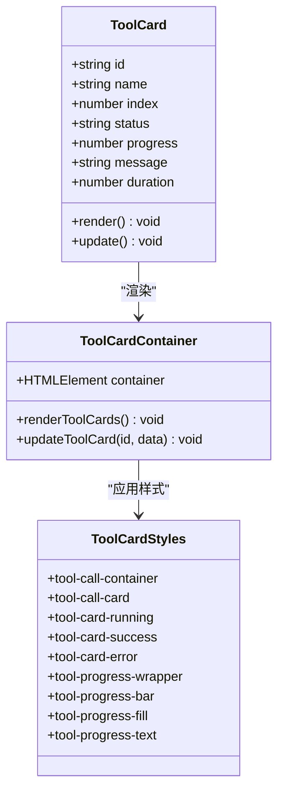

**图表来源**
- [chat.html:2424-2505](file://aiapp/aigtw/chat.html#L2424-L2505)

#### 工具卡片状态管理

工具卡片状态管理支持四种状态：

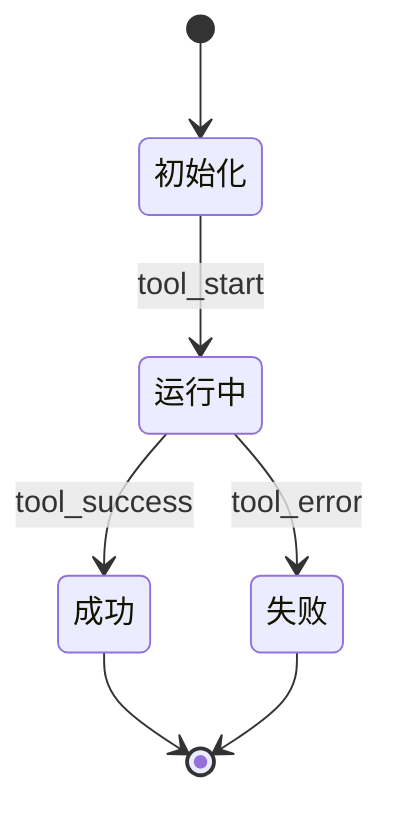

**图表来源**
- [chat.html:2351-2426](file://aiapp/aigtw/chat.html#L2351-L2426)

#### 工具卡片渲染流程

工具卡片渲染流程：

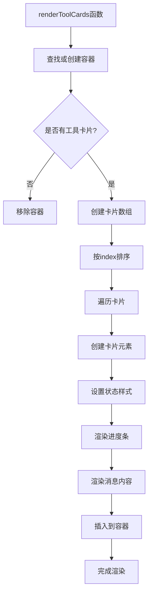

**图表来源**
- [chat.html:2424-2505](file://aiapp/aigtw/chat.html#L2424-L2505)

**章节来源**
- [chat.html:2424-2505](file://aiapp/aigtw/chat.html#L2424-L2505)

## 工具事件处理系统

### 事件处理器架构

**更新** 新增了完整的工具事件处理系统，支持四种标准工具事件：

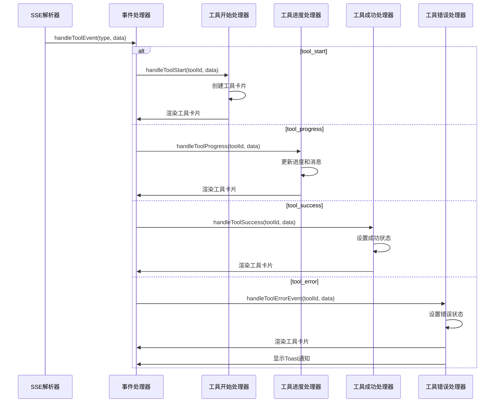

**图表来源**
- [chat.html:2351-2426](file://aiapp/aigtw/chat.html#L2351-L2426)

#### 工具开始事件处理

工具开始事件处理逻辑：

```mermaid
flowchart TD
A[handleToolStart函数] --> B[创建工具卡片对象]
B --> C[设置基础属性]
C --> D[id: toolId
D --> E[name: data.tool_name || toolId
E --> F[index: data.index || 1
F --> G[status: 'running'
G --> H[progress: 0
H --> I[message: '开始执行...'
I --> J[duration: null
J --> K[渲染工具卡片]
```

**图表来源**
- [chat.html:2371-2382](file://aiapp/aigtw/chat.html#L2371-L2382)

#### 工具进度事件处理

工具进度事件处理逻辑：

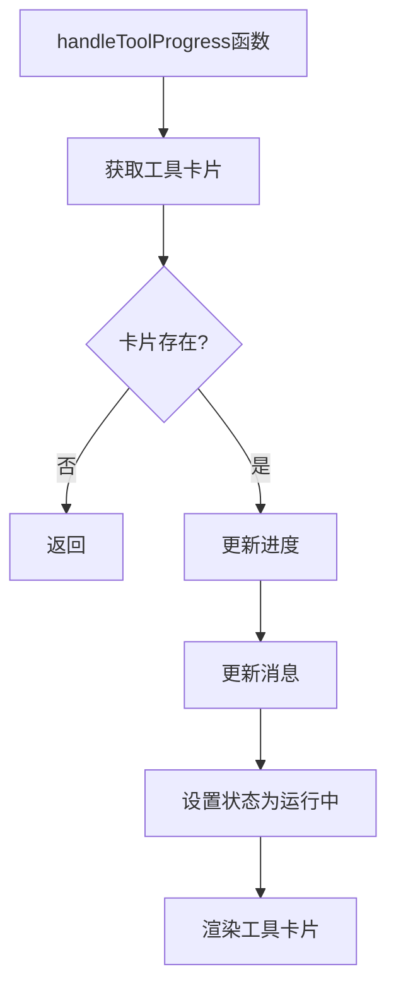

**图表来源**
- [chat.html:2385-2393](file://aiapp/aigtw/chat.html#L2385-L2393)

#### 工具成功事件处理

工具成功事件处理逻辑：

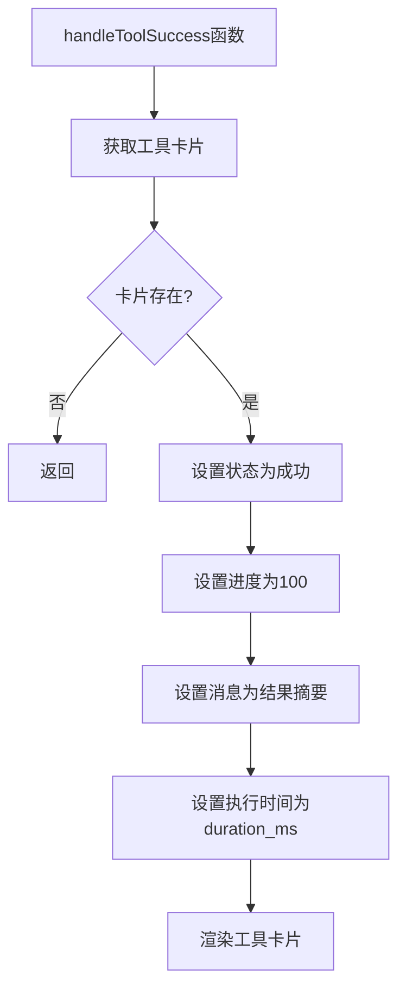

**图表来源**
- [chat.html:2396-2405](file://aiapp/aigtw/chat.html#L2396-L2405)

#### 工具错误事件处理

工具错误事件处理逻辑：

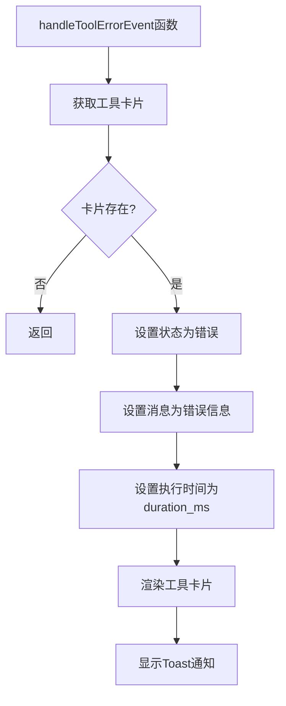

**图表来源**
- [chat.html:2408-2418](file://aiapp/aigtw/chat.html#L2408-L2418)

**章节来源**
- [chat.html:2351-2426](file://aiapp/aigtw/chat.html#L2351-L2426)

## 工具卡片渲染系统

### 工具卡片样式设计

**更新** 工具卡片采用了现代化的设计风格，支持三种状态的不同视觉效果：

```mermaid
classDiagram
class ToolCardStyles {
+tool-call-container : flex容器
+tool-call-card : 卡片主体
+tool-card-running : 运行中样式
+tool-card-success : 成功样式
+tool-card-error : 错误样式
+tool-progress-wrapper : 进度容器
+tool-progress-bar : 进度条背景
+tool-progress-fill : 进度填充
+tool-progress-text : 进度文本
+tool-card-header : 头部区域
+tool-card-index : 序号徽标
+tool-icon : 状态图标
+tool-icon-running : 运行动画
+tool-icon-success : 成功动画
+tool-icon-error : 错误动画
+tool-card-message : 消息区域
+tool-card-error-msg : 错误消息样式
}
```

**图表来源**
- [chat.html:548-743](file://aiapp/aigtw/chat.html#L548-L743)

#### 状态图标动画

工具卡片支持不同的状态图标动画：

```mermaid
stateDiagram-v2
[*] --> 运行中状态
运行中状态 --> 运行动画 : 开始执行
运行动画 --> 运行中状态 : 持续播放
运行中状态 --> 成功状态 : 执行成功
运行中状态 --> 错误状态 : 执行失败
成功状态 --> 成功弹出动画 : 完成渲染
成功弹出动画 --> [*]
错误状态 --> 错误抖动动画 : 完成渲染
错误抖动动画 --> [*]
```

**图表来源**
- [chat.html:609-656](file://aiapp/aigtw/chat.html#L609-L656)

#### 进度条动画效果

工具卡片进度条支持多种动画效果：

```mermaid
flowchart TD
A[进度条渲染] --> B[创建进度容器]
B --> C[创建进度背景]
C --> D[创建进度填充]
D --> E[应用渐变背景]
E --> F[添加闪光效果]
F --> G[设置过渡动画]
G --> H[渲染完成]
```

**图表来源**
- [chat.html:683-713](file://aiapp/aigtw/chat.html#L683-L713)

**章节来源**
- [chat.html:548-743](file://aiapp/aigtw/chat.html#L548-L743)

## 错误消息处理机制

### 错误消息显示系统

**更新** 新增了完整的错误消息处理机制，支持Toast通知和错误卡片显示：

```mermaid
sequenceDiagram
participant ToolErrorEvent as 工具错误事件
participant ErrorContainer as 错误容器
participant ToastNotification as Toast通知
participant ErrorCard as 错误卡片
ToolErrorEvent->>ErrorContainer : 创建错误消息元素
ErrorContainer->>ErrorContainer : 设置样式和内容
ErrorContainer->>ToastNotification : 显示Toast通知
ErrorContainer->>ErrorCard : 渲染错误卡片
ErrorContainer->>ErrorContainer : 3秒后自动隐藏
```

**图表来源**
- [chat.html:2330-2345](file://aiapp/aigtw/chat.html#L2330-L2345)

#### Toast通知系统

Toast通知系统提供了即时的错误提示功能：

```mermaid
flowchart TD
A[showToolError函数] --> B[创建错误消息元素]
B --> C[设置错误样式类]
C --> D[设置图标和工具名称]
D --> E[设置错误消息内容]
E --> F[清空之前的错误]
F --> G[添加到错误容器]
G --> H[3秒后自动隐藏]
H --> I[移除错误元素]
```

**图表来源**
- [chat.html:2330-2345](file://aiapp/aigtw/chat.html#L2330-L2345)

#### 错误消息样式

错误消息采用了专门的样式设计：

```mermaid
classDiagram
class ToolErrorStyles {
+tool-error-container : 固定定位容器
+tool-error : 错误消息卡片
+tool-error-icon : 错误图标
+tool-error-name : 工具名称
+tool-error-msg : 错误消息
+slideIn : 滑入动画
+danger : 危险色主题
}
```

**图表来源**
- [chat.html:745-781](file://aiapp/aigtw/chat.html#L745-L781)

**章节来源**
- [chat.html:2330-2345](file://aiapp/aigtw/chat.html#L2330-L2345)
- [chat.html:745-781](file://aiapp/aigtw/chat.html#L745-L781)

## 静态文件路由系统重构

### 统一静态文件服务函数

**更新** Aigtw 服务的静态文件路由系统已完全重构，从复杂的路径解析简化为统一的serveStaticFile函数：

```mermaid
sequenceDiagram
participant Client as HTTP 客户端
participant Server as REST 服务器
participant StaticFileServer as serveStaticFile函数
participant FileSystem as 文件系统
Client->>Server : GET /chat.html
Server->>StaticFileServer : serveStaticFile(staticDir, "chat.html")
StaticFileServer->>FileSystem : 检查文件是否存在
alt 文件存在
FileSystem-->>StaticFileServer : 返回文件信息
StaticFileServer-->>Client : 返回静态文件内容
else 文件不存在
FileSystem-->>StaticFileServer : 返回错误
StaticFileServer-->>Client : 404 Not Found
end
```

**图表来源**
- [aigtw.go:32-42](file://aiapp/aigtw/aigtw.go#L32-L42)

#### serveStaticFile 函数实现

serveStaticFile函数提供了统一的静态文件服务处理逻辑：

```mermaid
flowchart TD
A[serveStaticFile(baseDir, filename)] --> B[返回 http.HandlerFunc]
B --> C[内部函数处理请求]
C --> D[拼接完整文件路径]
D --> E[检查文件是否存在]
E --> |存在| F[调用 http.ServeFile]
E --> |不存在| G[返回 404 Not Found]
F --> H[文件内容输出到响应]
G --> I[错误响应输出]
```

**图表来源**
- [aigtw.go:32-42](file://aiapp/aigtw/aigtw.go#L32-L42)

#### 静态文件路由注册

**更新** 服务现在通过统一的serveStaticFile函数注册静态文件路由：

```mermaid
flowchart TD
A[main函数] --> B[创建 REST 服务器]
B --> C[注册静态文件路由]
C --> D[server.AddRoute for /chat.html]
C --> E[server.AddRoute for /tool.html]
C --> F[server.AddRoute for /results.html]
C --> G[server.AddRoute for / 根路径重定向]
D --> H[serveStaticFile(staticDir, "chat.html")]
E --> I[serveStaticFile(staticDir, "tool.html")]
F --> J[serveStaticFile(staticDir, "results.html")]
G --> K[根路径重定向到 chat.html]
```

**图表来源**
- [aigtw.go:91-117](file://aiapp/aigtw/aigtw.go#L91-L117)

### 静态文件服务配置

静态文件服务的配置和路径处理：

1. **工作目录获取**：通过`os.Getwd()`获取当前工作目录
2. **静态目录定位**：使用`filepath.Join(wd, "aiapp", "aigtw")`确定静态文件根目录
3. **文件存在性检查**：在服务前检查文件是否存在，避免无效请求
4. **路径安全**：通过`filepath.Join`防止路径遍历攻击

**章节来源**
- [aigtw.go:87-117](file://aiapp/aigtw/aigtw.go#L87-L117)

## 统一导航头部实现

### 导航头部设计规范

**更新** 服务的三个前端页面（chat.html、tool.html、results.html）都实现了统一的导航头部设计：

```mermaid
classDiagram
class AppHeader {
+position : sticky
+top : 0
+z-index : 100
+background : var(--main-bg)
+border-bottom : 1px solid var(--border)
+padding : 0 20px
+height : 60px
+display : flex
+align-items : center
+justify-content : space-between
+flex-shrink : 0
+transition : background 0.3s ease, border-color 0.3s ease
}
class NavBrand {
+font-size : 18px
+font-weight : 700
+color : var(--accent)
+display : flex
+align-items : center
+gap : 10px
}
class NavTabs {
+display : flex
+gap : 4px
+background : var(--surface)
+padding : 4px
+border-radius : 10px
}
class NavTab {
+padding : 8px 16px
+border-radius : 6px
+text-decoration : none
+color : var(--text-secondary)
+font-size : 14px
+font-weight : 500
+transition : all 0.2s
+display : flex
+align-items : center
+gap : 6px
}
class NavActions {
+display : flex
+align-items : center
+gap : 8px
}
class IconBtn {
+width : 40px
+height : 40px
+border-radius : 10px
+border : 1px solid var(--border)
+background : var(--surface)
+cursor : pointer
+display : flex
+align-items : center
+justify-content : center
+font-size : 18px
+transition : all 0.2s
+color : var(--text-primary)
}
AppHeader --> NavBrand : "包含"
AppHeader --> NavTabs : "包含"
AppHeader --> NavActions : "包含"
NavTabs --> NavTab : "包含"
NavTab --> IconBtn : "包含"
```

**图表来源**
- [chat.html:109-188](file://aiapp/aigtw/chat.html#L109-L188)
- [tool.html:49-127](file://aiapp/aigtw/tool.html#L49-L127)
- [results.html:49-127](file://aiapp/aigtw/results.html#L49-L127)

### 导航标签系统

统一的导航标签系统提供了页面间的快速跳转：

```mermaid
flowchart TD
A[导航标签容器] --> B[聊天标签]
B --> C[active 类名]
C --> D[💬 聊天]
A --> E[工具调用标签]
E --> F[🔧 工具调用]
A --> G[任务管理标签]
G --> H[📊 任务管理]
I[当前页面] --> J[添加 active 类名]
K[其他页面] --> L[移除 active 类名]
```

**图表来源**
- [chat.html:463-467](file://aiapp/aigtw/chat.html#L463-L467)
- [tool.html:463-467](file://aiapp/aigtw/tool.html#L463-L467)
- [results.html:345-349](file://aiapp/aigtw/results.html#L345-L349)

### 主题切换功能

统一的主题切换功能支持明暗主题的无缝切换：

```mermaid
flowchart TD
A[toggleTheme函数] --> B[获取当前主题]
B --> C{检查 data-theme 属性}
C --> |'dark'| D[设置为 'light']
C --> |'light'| E[设置为 'dark']
D --> F[更新 HTML data-theme]
E --> F
F --> G[保存到 localStorage]
G --> H[应用 CSS 变量]
```

**图表来源**
- [chat.html:639-644](file://aiapp/aigtw/chat.html#L639-L644)
- [tool.html:639-644](file://aiapp/aigtw/tool.html#L639-L644)
- [results.html:486-491](file://aiapp/aigtw/results.html#L486-L491)

### 导航头部样式系统

**更新** 导航头部采用了现代化的CSS变量系统，支持主题切换和响应式设计：

1. **CSS变量定义**：使用`:root`和`[data-theme="dark/light"]`定义主题变量
2. **过渡动画**：所有颜色变化都带有0.3秒的平滑过渡效果
3. **响应式布局**：在小屏幕设备上自动隐藏标签文字，只显示图标
4. **悬停效果**：所有交互元素都有平滑的悬停过渡效果

**章节来源**
- [chat.html:7-79](file://aiapp/aigtw/chat.html#L7-L79)
- [tool.html:7-37](file://aiapp/aigtw/tool.html#L7-L37)
- [results.html:7-37](file://aiapp/aigtw/results.html#L7-L37)

## 响应式设计优化

### 移动端适配策略

**更新** 三个前端页面都实现了完整的响应式设计优化：

```mermaid
flowchart TD
A[响应式设计] --> B[移动端断点 @media (max-width: 768px)]
B --> C[导航头部优化]
C --> D[隐藏品牌文字]
C --> E[缩小标签间距]
C --> F[隐藏标签文字]
B --> G[表单布局优化]
G --> H[API配置网格布局]
G --> I[表单控件垂直排列]
B --> J[统计卡片优化]
J --> K[2列网格布局]
B --> L[表格适配]
L --> M[水平滚动容器]
```

**图表来源**
- [chat.html:414-448](file://aiapp/aigtw/chat.html#L414-L448)
- [tool.html:414-448](file://aiapp/aigtw/tool.html#L414-L448)
- [results.html:291-330](file://aiapp/aigtw/results.html#L291-L330)

### 移动端导航优化

移动端导航的特殊处理：

1. **导航头部紧凑化**：padding从20px减少到12px
2. **标签文字隐藏**：在小屏幕设备上隐藏标签文字，只显示图标
3. **图标尺寸调整**：导航图标从40px调整为36px
4. **品牌文字隐藏**：品牌名称的文字部分在小屏幕设备上隐藏

### 表单布局响应式

**更新** 表单布局在移动端自动调整为垂直排列：

```mermaid
flowchart TD
A[API配置表单] --> B[桌面端: 2列网格]
B --> C[tool.html:214-215]
A --> D[移动端: 1列网格]
D --> E[grid-template-columns: 1fr]
D --> F[自动换行]
```

**图表来源**
- [tool.html:214-215](file://aiapp/aigtw/tool.html#L214-L215)

### 统计卡片响应式

**更新** 统计卡片在移动端自动调整为2列布局：

```mermaid
flowchart TD
A[统计卡片网格] --> B[桌面端: 自适应列宽]
B --> C[minmax(200px, 1fr)]
A --> D[移动端: 2列固定布局]
D --> E[grid-template-columns: repeat(2, 1fr)]
```

**图表来源**
- [results.html:151](file://aiapp/aigtw/results.html#L151)

### 表格响应式处理

**更新** 任务表格在移动端提供水平滚动支持：

```mermaid
flowchart TD
A[表格容器] --> B[overflow-x: auto]
B --> C[允许水平滚动]
A --> D[列宽调整]
D --> E[最小列宽: 120px]
D --> F[状态列: 80px]
D --> G[进度列: 100px]
```

**图表来源**
- [results.html:204-209](file://aiapp/aigtw/results.html#L204-L209)

### 消息列表响应式

**更新** 消息列表在移动端提供更好的触摸体验：

```mermaid
flowchart TD
A[消息列表] --> B[最大高度: 300px]
A --> C[移动端: 350px]
A --> D[触摸友好的点击区域]
D --> E[消息项: 44px高度]
```

**图表来源**
- [results.html:279-286](file://aiapp/aigtw/results.html#L279-L286)

**章节来源**
- [chat.html:414-448](file://aiapp/aigtw/chat.html#L414-L448)
- [tool.html:414-448](file://aiapp/aigtw/tool.html#L414-L448)
- [results.html:291-330](file://aiapp/aigtw/results.html#L291-L330)

## 异步工具调用功能

### 异步工具调用架构

**更新** Aigtw 服务新增了完整的异步工具调用功能，支持MCP工具的异步执行：

```mermaid
sequenceDiagram
participant Client as HTTP 客户端
participant CallHandler as AsyncToolCallHandler
participant CallLogic as AsyncToolCallLogic
participant ResultHandler as AsyncToolResultHandler
participant ResultLogic as AsyncToolResultLogic
participant Service as ServiceContext
participant GRPC as gRPC 客户端
participant AIChat as AIChat 服务
Client->>CallHandler : POST /ai/v1/async/tool/call
CallHandler->>CallLogic : AsyncToolCall(request)
CallLogic->>Service : 获取 AiChatCli
CallLogic->>GRPC : AsyncToolCall(protoReq)
GRPC->>AIChat : 提交异步工具调用
AIChat->>ToolManager : 启动工具执行
ToolManager-->>AIChat : 返回任务ID
AIChat-->>GRPC : AsyncToolCallResp(task_id)
GRPC-->>CallLogic : AsyncToolCallResp
CallLogic-->>CallHandler : AsyncToolCallResponse
CallHandler-->>Client : {"task_id" : "...", "status" : "pending"}
loop 轮询查询
Client->>ResultHandler : GET /ai/v1/async/tool/result/ : task_id
ResultHandler->>ResultLogic : AsyncToolResult(request)
ResultLogic->>Service : 获取 AiChatCli
ResultLogic->>GRPC : AsyncToolResult(protoReq)
GRPC->>AIChat : 查询任务状态
AIChat-->>GRPC : AsyncToolResultResp
GRPC-->>ResultLogic : AsyncToolResultResp
ResultLogic-->>ResultHandler : AsyncToolResultResponse
ResultHandler-->>Client : {"status" : "...", "progress" : 0.0, "result" : "..."}
end
```

**图表来源**
- [asyncToolCallHandler.go:16-32](file://aiapp/aigtw/internal/handler/pass/asyncToolCallHandler.go#L16-L32)
- [asyncToolResultHandler.go:17-33](file://aiapp/aigtw/internal/handler/pass/asyncToolResultHandler.go#L17-L33)
- [asyncToolCallLogic.go:26-48](file://aiapp/aigtw/internal/logic/pass/asyncToolCallLogic.go#L26-L48)
- [asyncToolResultLogic.go:31-61](file://aiapp/aigtw/internal/logic/pass/asyncToolResultLogic.go#L31-L61)

### 异步工具调用处理器

异步工具调用处理器负责接收HTTP请求并调用业务逻辑：

```mermaid
flowchart TD
A[HTTP POST /ai/v1/async/tool/call] --> B[解析请求体]
B --> C[创建 AsyncToolCallLogic]
C --> D[调用 AsyncToolCall]
D --> E{是否有错误}
E --> |是| F[返回错误响应]
E --> |否| G[返回 AsyncToolCallResponse]
F --> H[httpx.ErrorCtx]
G --> I[httpx.OkJsonCtx]
```

**图表来源**
- [asyncToolCallHandler.go:16-32](file://aiapp/aigtw/internal/handler/pass/asyncToolCallHandler.go#L16-L32)

### 异步结果查询处理器

异步结果查询处理器负责根据任务ID查询执行状态：

```mermaid
flowchart TD
A[HTTP GET /ai/v1/async/tool/result/:task_id] --> B[解析路径参数]
B --> C[创建 AsyncToolResultLogic]
C --> D[调用 AsyncToolResult]
D --> E{是否有错误}
E --> |是| F[返回错误响应]
E --> |否| G[返回 AsyncToolResultResponse]
F --> H[httpx.ErrorCtx]
G --> I[httpx.OkJsonCtx]
```

**图表来源**
- [asyncToolResultHandler.go:17-33](file://aiapp/aigtw/internal/handler/pass/asyncToolResultHandler.go#L17-L33)

### 异步工具调用业务逻辑

异步工具调用业务逻辑负责与AIChat服务通信：

```mermaid
flowchart TD
A[AsyncToolCallRequest] --> B[参数序列化]
B --> C[调用 AiChatCli.AsyncToolCall]
C --> D{RPC 调用成功?}
D --> |是| E[返回 AsyncToolCallResponse]
D --> |否| F[返回错误]
E --> G[TaskID: resp.TaskId]
E --> H[Status: resp.Status]
F --> I[记录错误日志]
```

**图表来源**
- [asyncToolCallLogic.go:26-48](file://aiapp/aigtw/internal/logic/pass/asyncToolCallLogic.go#L26-L48)

### 异步结果查询业务逻辑

异步结果查询业务逻辑负责获取执行结果：

```mermaid
flowchart TD
A[AsyncToolResultRequest] --> B[调用 AiChatCli.AsyncToolResult]
B --> C{RPC 调用成功?}
C --> |是| D[返回 AsyncToolResultResponse]
C --> |否| E[返回错误]
D --> F[TaskID: resp.TaskId]
D --> G[Status: resp.Status]
D --> H[Progress: resp.Progress]
D --> I[Result: resp.Result]
D --> J[Error: resp.Error]
D --> K[Messages: resp.Messages]
E --> L[记录错误日志]
```

**图表来源**
- [asyncToolResultLogic.go:31-61](file://aiapp/aigtw/internal/logic/pass/asyncToolResultLogic.go#L31-L61)

### 异步工具调用类型定义

服务定义了完整的异步工具调用数据类型：

```mermaid
classDiagram
class AsyncToolCallRequest {
+string Server
+string Tool
+map[string]interface{} Args
}
class AsyncToolCallResponse {
+string TaskID
+string Status
}
class AsyncToolResultRequest {
+string TaskID
}
class AsyncToolResultResponse {
+string TaskID
+string Status
+float64 Progress
+string Result
+string Error
+[]ProgressMessage Messages
}
AsyncToolCallRequest --> AsyncToolCallResponse : "调用后返回"
AsyncToolResultRequest --> AsyncToolResultResponse : "查询后返回"
```

**图表来源**
- [types.go:6-36](file://aiapp/aigtw/internal/types/types.go#L6-L36)

### 异步工具调用HTML界面

**新增** 服务提供了完整的HTML工具界面用于测试异步工具调用：

```mermaid
flowchart TD
A[tool.html 界面] --> B[提交任务表单]
B --> C[服务器选择]
B --> D[工具名称输入]
B --> E[参数JSON编辑器]
B --> F[提交按钮]
F --> G[POST /async/tool/call]
G --> H[显示任务ID]
H --> I[启动轮询查询]
I --> J[状态徽章显示]
I --> K[进度条更新]
I --> L[结果区域展示]
I --> M[实时指示器]
I --> N[步骤时间线]
I --> O[报文详情面板]
```

**图表来源**
- [tool.html:172-213](file://aiapp/aigtw/tool.html#L172-L213)

**章节来源**
- [asyncToolCallHandler.go:1-33](file://aiapp/aigtw/internal/handler/pass/asyncToolCallHandler.go#L1-L33)
- [asyncToolResultHandler.go:1-34](file://aiapp/aigtw/internal/handler/pass/asyncToolResultHandler.go#L1-L34)
- [asyncToolCallLogic.go:1-49](file://aiapp/aigtw/internal/logic/pass/asyncToolCallLogic.go#L1-L49)
- [asyncToolResultLogic.go:1-62](file://aiapp/aigtw/internal/logic/pass/asyncToolResultLogic.go#L1-L62)
- [types.go:1-144](file://aiapp/aigtw/internal/types/types.go#L1-L144)
- [tool.html:1-998](file://aiapp/aigtw/tool.html#L1-L998)

## 异步结果管理界面

### 异步结果管理架构

**更新** Aigtw 服务新增了完整的异步结果管理界面results.html，提供交互式仪表板。**重要变更** 该界面现在通过直接的HTTP端点服务静态页面，简化了实现方式：

```mermaid
sequenceDiagram
participant Admin as 管理员
participant ResultsUI as results.html界面
participant APIData as API数据接口
participant Service as ServiceContext
participant GRPC as gRPC 客户端
participant AIChat as AIChat 服务
Admin->>ResultsUI : 访问 /results.html
ResultsUI->>APIData : GET /ai/v1/async/tool/stats
APIData->>Service : AsyncResultStats()
Service->>GRPC : AsyncResultStats(protoReq)
GRPC->>AIChat : 获取统计信息
AIChat-->>GRPC : AsyncResultStatsResp
GRPC-->>Service : AsyncResultStatsResp
Service-->>APIData : AsyncResultStatsResponse
APIData-->>ResultsUI : 统计数据
ResultsUI->>APIData : GET /ai/v1/async/tool/results
APIData->>Service : ListAsyncResults()
Service->>GRPC : ListAsyncResults(protoReq)
GRPC->>AIChat : 查询结果列表
AIChat-->>GRPC : ListAsyncResultsResp
GRPC-->>Service : ListAsyncResultsResp
Service-->>APIData : ListAsyncResultsResponse
APIData-->>ResultsUI : 任务列表
loop 用户操作
Admin->>ResultsUI : 筛选/分页/查看详情
ResultsUI->>APIData : 带参数的 GET 请求
ResultsUI->>APIData : GET /ai/v1/async/tool/result/ : task_id
ResultsUI->>APIData : 查询单个任务详情
end
```

**图表来源**
- [results.html:355-376](file://aiapp/aigtw/results.html#L355-L376)
- [results.html:397-415](file://aiapp/aigtw/results.html#L397-L415)
- [results.html:472-516](file://aiapp/aigtw/results.html#L472-L516)

### HTTP端点服务静态页面

**更新** 服务现在通过直接的HTTP端点服务静态文件results.html，简化了实现方式：

```mermaid
flowchart TD
A[HTTP 请求 /results.html] --> B[静态文件服务]
B --> C[直接返回 results.html]
C --> D[浏览器加载页面]
D --> E[前端JavaScript发起API调用]
E --> F[GET /ai/v1/async/tool/stats]
E --> G[GET /ai/v1/async/tool/results]
E --> H[GET /ai/v1/async/tool/result/:task_id]
F --> I[异步结果统计]
G --> J[异步结果列表]
H --> K[单个任务详情]
I --> L[更新统计卡片]
J --> M[渲染任务表格]
K --> N[显示详情模态框]
```

**图表来源**
- [aigtw.go:120-126](file://aiapp/aigtw/aigtw.go#L120-L126)

### 异步结果统计处理器

**更新** 移除了Async Result Stats Handler处理器，改用直接HTTP端点服务静态页面：

```mermaid
flowchart TD
A[HTTP GET /ai/v1/async/tool/stats] --> B[路由匹配]
B --> C[直接返回 results.html]
C --> D[前端JavaScript调用API]
D --> E[GET /ai/v1/async/tool/stats]
E --> F[返回统计数据]
F --> G[更新界面显示]
```

**图表来源**
- [routes.go:66-70](file://aiapp/aigtw/internal/handler/routes.go#L66-L70)

### 异步结果列表处理器

异步结果列表处理器负责分页查询结果：

```mermaid
flowchart TD
A[HTTP GET /ai/v1/async/tool/results] --> B[解析查询参数]
B --> C[创建 ListAsyncResultsLogic]
C --> D[调用 ListAsyncResults]
D --> E{是否有错误}
E --> |是| F[返回错误响应]
E --> |否| G[返回 ListAsyncResultsResponse]
F --> H[httpx.ErrorCtx]
G --> I[httpx.OkJsonCtx]
```

**图表来源**
- [listasyncresultshandler.go:16-31](file://aiapp/aigtw/internal/handler/pass/listasyncresultshandler.go#L16-L31)

### 异步结果统计业务逻辑

异步结果统计业务逻辑负责获取统计信息：

```mermaid
flowchart TD
A[EmptyReq] --> B[调用 AiChatCli.AsyncResultStats]
B --> C{RPC 调用成功?}
C --> |是| D[返回 AsyncResultStatsResponse]
C --> |否| E[返回错误]
D --> F[Total: resp.Total]
D --> G[Pending: resp.Pending]
D --> H[Completed: resp.Completed]
D --> I[Failed: resp.Failed]
D --> J[SuccessRate: resp.SuccessRate]
E --> K[记录错误日志]
```

**图表来源**
- [asyncresultstatslogic.go:28-41](file://aiapp/aigtw/internal/logic/pass/asyncresultstatslogic.go#L28-L41)

### 异步结果列表业务逻辑

**更新** 异步结果列表业务逻辑负责分页查询，支持状态过滤、时间范围筛选和多字段排序：

```mermaid
flowchart TD
A[ListAsyncResultsRequest] --> B[调用 AiChatCli.ListAsyncResults]
B --> C{RPC 调用成功?}
C --> |是| D[返回 ListAsyncResultsResponse]
C --> |否| E[返回错误]
D --> F[Items: 转换后的任务列表]
D --> G[Total: 总数]
D --> H[Page: 当前页]
D --> I[PageSize: 每页数量]
D --> J[TotalPages: 总页数]
E --> K[记录错误日志]
```

**图表来源**
- [listasyncresultslogic.go:28-71](file://aiapp/aigtw/internal/logic/pass/listasyncresultslogic.go#L28-L71)

### 异步结果统计类型定义

异步结果统计类型定义：

```mermaid
classDiagram
class AsyncResultStatsResponse {
+int64 Total
+int64 Pending
+int64 Completed
+int64 Failed
+float64 SuccessRate
}
```

**图表来源**
- [types.go:190-201](file://aiapp/aigtw/internal/types/types.go#L190-L201)

### 异步结果列表类型定义

**更新** 异步结果列表类型定义支持高级查询功能：

```mermaid
classDiagram
class ListAsyncResultsRequest {
+string Status
+int64 StartTime
+int64 EndTime
+int Page
+int PageSize
+string SortField
+string SortOrder
}
class ListAsyncResultsResponse {
+[]AsyncToolResultResponse Items
+int64 Total
+int Page
+int PageSize
+int TotalPages
}
ListAsyncResultsRequest --> ListAsyncResultsResponse : "查询后返回"
```

**图表来源**
- [types.go:159-188](file://aiapp/aigtw/internal/types/types.go#L159-L188)

### results.html 界面功能

**更新** results.html 提供了完整的异步结果管理界面，通过直接HTTP端点服务静态页面简化实现：

```mermaid
flowchart TD
A[results.html 界面] --> B[统计卡片网格]
B --> C[任务总数卡片]
B --> D[待处理卡片]
B --> E[已完成卡片]
B --> F[失败卡片]
B --> G[成功率卡片]
A --> H[筛选栏]
H --> I[状态筛选下拉框]
H --> J[开始时间日期选择器]
H --> K[结束时间日期选择器]
H --> L[排序字段下拉框]
H --> M[排序方向下拉框]
H --> N[每页数量下拉框]
H --> O[查询按钮]
H --> P[重置按钮]
A --> Q[任务表格]
Q --> R[Task ID 列]
Q --> S[状态列]
Q --> T[进度列]
Q --> U[创建时间列]
Q --> V[更新时间列]
Q --> W[结果预览列]
Q --> X[操作列]
A --> Y[分页控件]
Y --> Z[上一页按钮]
Y --> AA[页码信息]
Y --> BB[下一页按钮]
A --> CC[详情模态框]
CC --> DD[任务详情内容]
A --> EE[主题切换按钮]
A --> FF[刷新数据按钮]
A --> GG[服务状态指示器]
```

**图表来源**
- [results.html:200-325](file://aiapp/aigtw/results.html#L200-L325)

### 界面交互流程

异步结果管理界面的交互流程：

```mermaid
stateDiagram-v2
[*] --> 页面加载
页面加载 --> 加载统计数据
页面加载 --> 加载任务列表
加载统计数据 --> 显示统计卡片
加载任务列表 --> 显示任务表格
显示统计卡片 --> 用户操作
显示任务表格 --> 用户操作
用户操作 --> 筛选查询
用户操作 --> 分页导航
用户操作 --> 查看详情
筛选查询 --> 重新加载数据
分页导航 --> 重新加载数据
查看详情 --> 打开模态框
打开模态框 --> 显示详情内容
显示详情内容 --> 关闭模态框
关闭模态框 --> 返回任务列表
重新加载数据 --> 更新界面显示
更新界面显示 --> 用户操作
```

**图表来源**
- [results.html:342-543](file://aiapp/aigtw/results.html#L342-L543)

### 统计卡片功能

统计卡片提供关键指标的可视化展示：

1. **任务总数**：显示所有异步任务的累计数量
2. **待处理**：显示等待执行的任务数量
3. **已完成**：显示成功完成的任务数量
4. **失败**：显示执行失败的任务数量
5. **成功率**：显示任务执行的成功百分比

### 筛选和过滤功能

**更新** 界面提供灵活的筛选和过滤选项：

1. **状态筛选**：支持按任务状态（待处理、已完成、失败）筛选
2. **时间范围**：支持按创建时间和更新时间筛选
3. **排序功能**：支持按创建时间、更新时间、进度排序
4. **分页控制**：支持每页显示数量的自定义设置

### 任务列表展示

**更新** 任务列表提供详细的任务信息展示：

1. **Task ID**：显示任务的唯一标识符
2. **状态标签**：使用颜色编码显示任务状态
3. **进度条**：可视化显示任务执行进度
4. **时间信息**：显示任务的创建和更新时间
5. **结果预览**：显示任务执行结果的简要预览
6. **操作按钮**：提供查看详情的操作入口

### 详情模态框

**更新** 详情模态框提供任务的详细信息展示：

1. **状态信息**：显示当前任务状态和进度
2. **消息历史**：展示任务执行过程中的消息历史
3. **执行结果**：显示任务的最终执行结果
4. **错误信息**：显示任务执行失败的错误信息

**章节来源**
- [asyncresultstatshandler.go:1-26](file://aiapp/aigtw/internal/handler/pass/asyncresultstatshandler.go#L1-L26)
- [listasyncresultshandler.go:1-32](file://aiapp/aigtw/internal/handler/pass/listasyncresultshandler.go#L1-L32)
- [asyncresultstatslogic.go:1-42](file://aiapp/aigtw/internal/logic/pass/asyncresultstatslogic.go#L1-L42)
- [listasyncresultslogic.go:1-72](file://aiapp/aigtw/internal/logic/pass/listasyncresultslogic.go#L1-L72)
- [types.go:1-204](file://aiapp/aigtw/internal/types/types.go#L1-L204)
- [results.html:1-697](file://aiapp/aigtw/results.html#L1-L697)

## HTTP请求响应监控系统

### 圆形缓冲区管理

**新增** 服务实现了完整的HTTP请求响应监控系统，包含圆形缓冲区管理功能：

```mermaid
sequenceDiagram
participant Client as HTTP 客户端
participant Monitor as 监控系统
participant Buffer as 圆形缓冲区
participant DetailPanel as 报文详情面板
Client->>Monitor : 发起HTTP请求
Monitor->>Buffer : 添加请求记录
Buffer->>Buffer : 检查记录数量
alt 超过最大容量
Buffer->>Buffer : 移除最旧记录
end
Buffer->>DetailPanel : 更新显示
DetailPanel->>DetailPanel : 刷新列表
```

**图表来源**
- [tool.html:605-628](file://aiapp/aigtw/tool.html#L605-L628)

圆形缓冲区管理的关键特性包括：

1. **固定容量限制**：通过MAX_RECORDS常量（默认50）限制同时显示的记录数量
2. **自动滚动移除**：当记录数超过上限时，自动移除最旧的记录，保持最新的请求响应历史
3. **唯一标识生成**：使用generateId函数为每条记录生成唯一ID，便于精确查找和更新
4. **实时更新机制**：每次添加新记录时自动触发UI更新，确保用户看到最新的监控信息

### 实时显示能力

**新增** 服务提供了强大的实时显示能力，包括：

```mermaid
flowchart TD
A[HTTP请求发起] --> B[开始计时]
B --> C[发送请求]
C --> D[接收响应]
D --> E[结束计时]
E --> F[计算耗时]
F --> G[添加到圆形缓冲区]
G --> H[更新实时显示]
H --> I[刷新报文详情]
I --> J[更新状态指示器]
```

**图表来源**
- [tool.html:770-812](file://aiapp/aigtw/tool.html#L770-L812)

实时显示功能包括：

1. **毫秒级耗时统计**：精确记录每个HTTP请求的响应时间，以毫秒为单位显示
2. **状态指示器**：实时显示任务执行状态，包括待处理、执行中、已完成、失败等状态
3. **进度条更新**：动态更新任务进度条，提供直观的执行进度可视化
4. **消息历史**：实时显示工具执行过程中的消息历史，包括开始、进度更新、完成等关键节点

### 步骤时间线可视化

**新增** 服务实现了完整的步骤时间线可视化功能：

```mermaid
stateDiagram-v2
[*] --> 初始化
初始化 --> 执行中 : 状态变为 running
执行中 --> 完成 : 状态变为 completed
执行中 --> 失败 : 状态变为 failed
完成 --> [*]
失败 --> [*]
```

**图表来源**
- [tool.html:693-725](file://aiapp/aigtw/tool.html#L693-L725)

步骤时间线的视觉设计：

1. **三阶段流程**：初始化（1）、执行中（2）、完成（3）三个阶段
2. **状态指示**：使用不同的颜色和动画效果表示不同状态
   - 待处理：灰色圆点，静态显示
   - 执行中：蓝色圆点，带脉冲动画
   - 已完成：绿色圆点，静态显示
   - 失败：红色圆点，静态显示
3. **连接线状态**：已完成阶段之间使用蓝色连接线，当前阶段使用灰色连接线
4. **标签颜色**：根据状态动态调整标签颜色，提供更好的视觉反馈

### 报文详情面板

**新增** 服务提供了详细的报文详情面板，支持HTTP请求响应的完整记录：

```mermaid
classDiagram
class RequestRecord {
+string id
+HttpRequest request
+HttpResponse response
+number timestamp
+number elapsed
+boolean expanded
}
class HttpRequest {
+string method
+string url
+object headers
}
class HttpResponse {
+number status
+string statusText
+object body
}
RequestRecord --> HttpRequest : "包含"
RequestRecord --> HttpResponse : "包含"
```

**图表来源**
- [tool.html:613-628](file://aiapp/aigtw/tool.html#L613-L628)

报文详情面板的功能特性：

1. **折叠展开**：每个记录项支持点击展开/收起，查看详细信息
2. **状态分类**：根据HTTP状态码自动分类（2xx、4xx、5xx等）
3. **时间戳显示**：显示请求发生的具体时间
4. **耗时统计**：显示本次请求的响应耗时
5. **URL截断**：自动截断长URL，只显示路径部分
6. **内容预览**：支持JSON格式化显示，便于阅读

### 实时状态指示器

**新增** 服务提供了实时状态指示器，显示任务执行的实时状态：

```mermaid
flowchart TD
A[任务开始] --> B[显示执行中指示器]
B --> C[轮询查询状态]
C --> D{状态变化?}
D --> |是| E[更新状态指示器]
D --> |否| F[继续轮询]
E --> G{状态为 completed?}
F --> C
G --> |是| H[隐藏执行中指示器]
G --> |否| I{状态为 failed?}
I --> |是| H
I --> |否| C
```

**图表来源**
- [tool.html:392-394](file://aiapp/aigtw/tool.html#L392-L394)
- [tool.html:748-807](file://aiapp/aigtw/tool.html#L748-L807)

实时状态指示器的设计特点：

1. **脉冲动画**：使用CSS动画创建脉冲效果，吸引用户注意
2. **颜色编码**：绿色表示执行中状态，提供积极的视觉反馈
3. **条件显示**：仅在任务执行期间显示，避免干扰用户界面
4. **自动隐藏**：任务完成后自动隐藏，保持界面整洁

**章节来源**
- [tool.html:1-998](file://aiapp/aigtw/tool.html#L1-L998)

## 认证头处理优化

### 上下文属性管理

**更新** Aigtw 服务引入了全新的认证头处理机制，通过ctxprop包实现统一的上下文属性提取和注入：

```mermaid
sequenceDiagram
participant HTTP as HTTP 请求
participant CtxProp as ctxprop 包
participant CtxData as ctxdata 包
participant Claims as JWT声明处理
participant Meta as 元数据注入
HTTP->>CtxProp : ExtractFromHTTPHeader()
CtxProp->>CtxData : PropFields 遍历
CtxData->>Claims : ExtractFromClaims()
Claims->>CtxData : ApplyClaimMappingToCtx()
CtxData->>Meta : InjectToGrpcMD()
Meta->>gRPC : UnaryMetadataInterceptor()
gRPC->>服务端 : StreamTracingInterceptor()
```

**图表来源**
- [http.go:24-36](file://common/ctxprop/http.go#L24-L36)
- [claims.go:13-23](file://common/ctxprop/claims.go#L13-L23)
- [ctxData.go:32-39](file://common/ctxdata/ctxData.go#L32-L39)
- [metadataInterceptor.go:11-19](file://common/Interceptor/rpcclient/metadataInterceptor.go#L11-L19)

#### HTTP头部提取

新的HTTP头部处理机制通过ExtractFromHTTPHeader函数实现：

```mermaid
flowchart TD
A[HTTP 请求头] --> B[ExtractFromHTTPHeader]
B --> C[遍历 PropFields]
C --> D{检查头部是否存在}
D --> |是| E[注入到 context]
D --> |否| F[跳过]
E --> G[返回新 context]
F --> G
G --> H[传递给业务逻辑]
```

**图表来源**
- [http.go:24-36](file://common/ctxprop/http.go#L24-L36)

#### JWT声明映射

JWT声明处理通过ApplyClaimMappingToCtx函数实现：

```mermaid
flowchart TD
A[JWT Claims] --> B[ApplyClaimMappingToCtx]
B --> C[遍历映射配置]
C --> D{检查外部键}
D --> |存在| E[复制到内部键]
D --> |不存在| F[跳过]
E --> G[返回新 context]
F --> G
G --> H[传递给下游处理]
```

**图表来源**
- [claims.go:41-47](file://common/ctxprop/claims.go#L41-L47)

#### gRPC元数据拦截

元数据拦截器通过UnaryMetadataInterceptor和StreamTracingInterceptor实现：

```mermaid
flowchart TD
A[业务逻辑 context] --> B[UnaryMetadataInterceptor]
B --> C[InjectToGrpcMD]
C --> D[创建 gRPC MD]
D --> E[传递给 gRPC 调用]
F[业务逻辑 context] --> G[StreamTracingInterceptor]
G --> C
```

**图表来源**
- [metadataInterceptor.go:11-19](file://common/Interceptor/rpcclient/metadataInterceptor.go#L11-L19)

**章节来源**
- [http.go:1-37](file://common/ctxprop/http.go#L1-L37)
- [claims.go:1-69](file://common/ctxprop/claims.go#L1-L69)
- [ctx.go:1-78](file://common/ctxprop/ctx.go#L1-L78)
- [ctxData.go:1-77](file://common/ctxdata/ctxData.go#L1-L77)
- [metadataInterceptor.go:1-20](file://common/Interceptor/rpcclient/metadataInterceptor.go#L1-L20)

## 依赖关系分析

### 外部依赖关系

Aigtw 服务依赖于多个外部组件和框架：

```mermaid
graph TB
subgraph "GoZero 生态系统"
GoZero[GoZero 核心框架]
Rest[REST 服务器]
ZRPC[gRPC 客户端]
Conf[配置管理]
Logx[日志系统]
SSE[SSE 支持]
end
subgraph "AIChat 服务"
AIChat[AIChat 服务]
ChatProto[聊天协议]
ToolProto[工具协议]
AsyncResultStore[异步结果存储]
end
subgraph "通用工具"
GTWX[网关工具]
SSEX[SSE 工具]
CtxData[上下文数据]
CtxProp[上下文属性]
MetadataInterceptor[元数据拦截器]
end
subgraph "监控系统"
CircularBuffer[圆形缓冲区]
RealTimeDisplay[实时显示]
TimelineVisualization[时间线可视化]
RequestDetailPanel[请求详情面板]
LiveIndicator[实时指示器]
end
subgraph "异步结果管理界面"
StatsGrid[统计卡片网格]
FilterBar[筛选栏]
Pagination[分页控件]
TaskTable[任务表格]
DetailModal[详情模态框]
ThemeToggle[主题切换]
ServiceStatus[服务状态]
Toast[Toast通知]
MessagesList[消息历史列表]
ProgressBars[进度条]
StatusTags[状态标签]
end
subgraph "HTTP端点服务"
StaticFileServer[静态文件服务]
DirectEndpoint[直接HTTP端点]
APIData[API数据接口]
end
subgraph "SSE事件处理增强"
ToolEventHandlers[工具事件处理器]
AutoEventInference[自动事件类型推断]
ToolCardRenderer[工具卡片渲染器]
ErrorNotification[错误通知系统]
end
Aigtw --> GoZero
GoZero --> Rest
GoZero --> ZRPC
GoZero --> Conf
GoZero --> Logx
GoZero --> SSE
Aigtw --> AIChat
AIChat --> ChatProto
AIChat --> ToolProto
AIChat --> AsyncResultStore
Aigtw --> GTWX
GTWX --> SSEX
GTWX --> CtxData
GTWX --> CtxProp
GTWX --> MetadataInterceptor
Aigtw --> CircularBuffer
Aigtw --> RealTimeDisplay
Aigtw --> TimelineVisualization
Aigtw --> RequestDetailPanel
Aigtw --> LiveIndicator
Aigtw --> StatsGrid
Aigtw --> FilterBar
Aigtw --> Pagination
Aigtw --> TaskTable
Aigtw --> DetailModal
Aigtw --> ThemeToggle
Aigtw --> ServiceStatus
Aigtw --> Toast
Aigtw --> MessagesList
Aigtw --> ProgressBars
Aigtw --> StatusTags
StaticFileServer --> DirectEndpoint
DirectEndpoint --> APIData
ToolEventHandlers --> AutoEventInference
ToolEventHandlers --> ToolCardRenderer
ToolEventHandlers --> ErrorNotification
```

**图表来源**
- [aigtw.go:6-28](file://aiapp/aigtw/aigtw.go#L6-L28)
- [servicecontext.go:3-10](file://aiapp/aigtw/internal/svc/servicecontext.go#L3-L10)
- [metadataInterceptor.go:3-9](file://common/Interceptor/rpcclient/metadataInterceptor.go#L3-L9)

### 内部模块依赖

服务内部模块之间存在清晰的依赖关系：

```mermaid
graph LR
subgraph "核心模块"
Config[config] --> Handler[handler]
Types[types] --> Handler
Types --> Logic[logic]
Svc[svc] --> Handler
Svc --> Logic
end
subgraph "处理器"
Routes[routes] --> Handler
Handler --> Logic
Handler --> AsyncToolCallHandler
Handler --> AsyncToolResultHandler
Handler --> AsyncResultStatsHandler
Handler --> ListAsyncResultsHandler
end
subgraph "业务逻辑"
ChatLogic[chatcompletionslogic] --> Types
ChatLogic --> Svc
ModelLogic[listmodelslogic] --> Types
ModelLogic --> Svc
AsyncCallLogic[asyncToolCallLogic] --> Types
AsyncCallLogic --> Svc
AsyncResultLogic[asyncToolResultLogic] --> Types
AsyncResultLogic --> Svc
AsyncStatsLogic[asyncresultstatslogic] --> Types
AsyncStatsLogic --> Svc
ListResultsLogic[listasyncresultlogic] --> Types
ListResultsLogic --> Svc
end
subgraph "服务上下文"
ServiceContext --> Svc
ServiceContext --> Config
end
subgraph "认证优化"
CtxData[ctxdata] --> CtxProp[ctxprop]
CtxProp --> MetadataInterceptor
end
subgraph "监控系统"
RequestRecord[请求记录] --> CircularBuffer[圆形缓冲区]
RequestRecord --> RealTimeDisplay[实时显示]
RequestRecord --> TimelineVisualization[时间线可视化]
RequestRecord --> RequestDetailPanel[请求详情面板]
RequestRecord --> LiveIndicator[实时指示器]
end
subgraph "异步结果管理界面"
StatsCard[统计卡片] --> StatsGrid[统计卡片网格]
FilterForm[筛选表单] --> FilterBar[筛选栏]
PaginationCtrl[分页控制器] --> Pagination[分页控件]
TaskRow[任务行] --> TaskTable[任务表格]
DetailModal[详情模态框] --> DetailModal
ThemeSwitch[主题切换] --> ThemeToggle[主题切换按钮]
ServiceIndicator[服务状态] --> ServiceStatus[服务状态指示器]
ToastMsg[Toast消息] --> Toast[Toast通知]
MessageItem[消息项] --> MessagesList[消息历史列表]
ProgressBar[进度条] --> ProgressBars[进度条集合]
StatusBadge[状态徽章] --> StatusTags[状态标签集合]
end
subgraph "HTTP端点服务"
StaticFileServer[静态文件服务] --> DirectEndpoint[直接HTTP端点]
DirectEndpoint --> APIData[API数据接口]
end
subgraph "SSE事件处理增强"
InferToolEventType[inferToolEventType] --> SSEWriter[增强的SSE Writer]
HandleToolEvent[handleToolEvent] --> ToolCardRenderer[工具卡片渲染器]
ToolCardRenderer --> ToolErrorContainer[错误容器]
ToolErrorContainer --> ToastNotification[Toast通知]
end
```

**图表来源**
- [routes.go:16-74](file://aiapp/aigtw/internal/handler/routes.go#L16-L74)
- [chatcompletionslogic.go:1-16](file://aiapp/aigtw/internal/logic/pass/chatcompletionslogic.go#L1-L16)
- [asyncToolCallHandler.go:16-32](file://aiapp/aigtw/internal/handler/pass/asyncToolCallHandler.go#L16-L32)
- [asyncToolResultHandler.go:17-33](file://aiapp/aigtw/internal/handler/pass/asyncToolResultHandler.go#L17-L33)
- [asyncresultstatshandler.go:15-25](file://aiapp/aigtw/internal/handler/pass/asyncresultstatshandler.go#L15-L25)
- [listasyncresultshandler.go:16-31](file://aiapp/aigtw/internal/handler/pass/listasyncresultshandler.go#L16-L31)
- [ctxData.go:32-39](file://common/ctxdata/ctxData.go#L32-L39)

**章节来源**
- [aigtw.go:1-128](file://aiapp/aigtw/aigtw.go#L1-L128)
- [routes.go:1-76](file://aiapp/aigtw/internal/handler/routes.go#L1-L76)

## 性能考虑

### 静态文件路由性能优化

**更新** 静态文件路由系统重构带来了显著的性能提升：

1. **统一处理逻辑**：通过serveStaticFile函数统一处理所有静态文件请求
2. **文件存在性检查**：在服务前检查文件是否存在，避免无效请求处理
3. **路径安全处理**：使用filepath.Join防止路径遍历攻击，提高安全性
4. **减少路由注册**：从复杂的路径解析简化为统一的静态文件服务
5. **内存效率**：避免为每个静态文件创建独立的处理器函数

### 认证头处理优化

**更新** Aigtw 服务在认证头处理方面采用了多项优化策略：

1. **上下文直接处理**：使用请求上下文直接处理Authorization头部，避免额外的字符串操作
2. **统一属性管理**：通过ctxprop包实现统一的上下文属性提取和注入机制
3. **批量头部处理**：一次性处理所有配置的头部字段，减少循环开销
4. **智能缓存**：利用GoZero的上下文缓存机制，避免重复计算
5. **零拷贝优化**：在可能的情况下避免不必要的数据复制

### 流式处理优化

服务在流式处理方面采用了多项优化策略：

1. **SSE 桥接优化**：使用专门的 SSE 写入器来处理流式响应
2. **客户端断开检测**：实时监控客户端连接状态，及时释放资源
3. **内存管理**：避免在流式过程中累积大量数据
4. **超时控制**：支持无限超时的流式连接配置
5. **流式头部管理**：智能的Accept: text/event-stream头部处理

### 增强SSE事件处理性能优化

**更新** 增强的SSE事件处理能力带来了多项性能优化：

1. **事件类型推断缓存**：inferToolEventType函数的JSON解析结果可被缓存
2. **工具卡片渲染优化**：使用requestAnimationFrame优化工具卡片渲染性能
3. **事件处理器复用**：handleToolEvent函数复用工具卡片状态更新逻辑
4. **错误消息去重**：Toast通知系统避免重复显示相同错误
5. **进度条动画优化**：CSS动画使用硬件加速，提升渲染性能

### 工具事件处理性能优化

**新增** 工具事件处理系统采用了多项性能优化策略：

1. **工具卡片状态缓存**：toolCards对象缓存工具状态，避免重复DOM操作
2. **事件类型快速判断**：使用includes方法快速判断事件类型
3. **进度更新节流**：toolCardPending和toolCardScheduled变量避免过度渲染
4. **错误消息延迟处理**：Toast通知使用setTimeout延迟处理，避免阻塞主线程
5. **工具卡片排序优化**：使用sort方法按index排序，确保执行顺序正确

### 工具卡片渲染性能优化

**新增** 工具卡片渲染系统采用了多项性能优化策略：

1. **批量DOM操作**：使用DocumentFragment减少DOM重排重绘
2. **CSS动画硬件加速**：使用transform和opacity属性触发动画硬件加速
3. **进度条渐变优化**：CSS渐变背景使用硬件加速渲染
4. **状态样式复用**：使用CSS类名复用样式，减少内联样式计算
5. **错误消息容器复用**：tool-error-container复用同一容器，避免频繁创建DOM元素

### 异步工具调用性能优化

**新增** 异步工具调用功能和异步结果管理界面采用了多项性能优化策略：

1. **任务状态缓存**：使用内存缓存存储任务状态，减少数据库访问
2. **轮询间隔优化**：默认500ms轮询间隔，平衡响应性和资源消耗
3. **连接池管理**：通过RpcClientConf配置实现gRPC连接池复用
4. **超时配置**：灵活的超时设置适应不同工具执行时间
5. **错误重试机制**：对临时性错误进行自动重试
6. **前端虚拟滚动**：results.html界面支持大数据量的虚拟滚动优化
7. **懒加载机制**：详情模态框按需加载，减少初始页面负载
8. **本地存储优化**：使用localStorage缓存常用配置，提升用户体验
9. **HTTP端点服务优化**：**更新** 直接HTTP端点服务静态页面，减少处理器开销

### 监控系统性能优化

**新增** HTTP请求响应监控系统和异步结果管理界面采用了多项性能优化策略：

1. **圆形缓冲区限制**：通过MAX_RECORDS常量限制同时显示的记录数量，避免内存泄漏
2. **自动滚动移除**：当记录数超过上限时，自动移除最旧记录，保持系统性能
3. **增量更新**：仅在有新记录时更新UI，避免不必要的DOM操作
4. **防抖处理**：对频繁的状态更新进行防抖处理，减少UI重绘次数
5. **懒加载显示**：报文详情面板支持折叠展开，减少初始渲染负载
6. **分页加载**：异步结果列表支持分页加载，避免一次性渲染大量数据
7. **主题切换优化**：使用CSS变量实现主题切换，避免重排重绘
8. **事件委托**：使用事件委托减少事件监听器数量

### 异步结果统计和列表功能性能优化

**更新** 异步结果统计和列表功能采用了多项性能优化策略：

1. **统计信息缓存**：results.html界面支持统计信息的缓存，减少重复API调用
2. **分页查询优化**：支持每页100条记录的最大限制，平衡性能和用户体验
3. **筛选条件优化**：支持状态、时间范围的快速筛选，减少数据传输量
4. **进度消息缓存**：支持进度消息的历史记录缓存，提升详情页面加载速度
5. **本地存储优化**：使用localStorage缓存API基础URL和JWT令牌，减少重复配置
6. **主题状态持久化**：支持主题状态的本地存储，提升用户体验的一致性

### 导航头部性能优化

**更新** 统一导航头部的实现带来了性能和用户体验的双重提升：

1. **CSS变量优化**：使用CSS变量系统减少样式计算开销
2. **响应式媒体查询**：移动端断点优化减少不必要的样式计算
3. **过渡动画优化**：0.3秒的过渡动画在性能和体验间取得平衡
4. **主题切换优化**：使用CSS变量实现主题切换，避免重排重绘
5. **导航标签优化**：在小屏幕设备上隐藏文字，减少布局计算

### 缓存和连接池

服务通过配置实现了高效的连接管理：

- **gRPC 连接复用**：通过 RpcClientConf 配置实现连接池管理
- **非阻塞调用**：支持非阻塞的 RPC 调用模式
- **超时配置**：灵活的超时设置适应不同场景需求

### 错误处理性能

统一的错误处理机制减少了重复代码和提高了处理效率：

- **OpenAI 风格错误**：标准化的错误响应格式
- **类型安全**：编译时检查确保错误处理的正确性
- **性能优化**：避免不必要的字符串操作和内存分配

### HTTP端点服务性能优化

**更新** 直接HTTP端点服务静态页面采用了多项性能优化策略：

1. **静态文件缓存**：浏览器和服务器端缓存static files，减少带宽消耗
2. **CDN优化**：支持CDN加速静态资源加载
3. **压缩传输**：启用Gzip压缩减少文件大小
4. **并行加载**：前端JavaScript并行加载统计数据和任务列表
5. **懒加载API**：仅在需要时才发起API请求，减少不必要的网络开销

### 工具事件处理性能优化

**新增** 工具事件处理系统采用了多项性能优化策略：

1. **事件类型快速推断**：JSON解析和字段提取使用高效算法
2. **工具卡片状态管理**：使用对象缓存避免重复DOM查询
3. **进度更新节流**：使用节流机制避免过度渲染
4. **错误消息去重**：Toast通知系统避免重复显示相同错误
5. **CSS动画硬件加速**：使用transform属性触发动画硬件加速
6. **批量状态更新**：工具卡片状态更新使用批量操作减少重排重绘

## 故障排除指南

### 常见问题诊断

#### 静态文件服务问题

**更新** 当静态文件服务出现问题时：

1. **检查文件路径**
   - 验证静态文件是否存在于正确的目录
   - 确认工作目录和静态目录配置正确
   - 检查文件权限和可读性

2. **验证serveStaticFile函数**
   - 确认函数正确拼接文件路径
   - 检查文件存在性检查逻辑
   - 验证404错误处理

3. **路由注册问题**
   - 验证静态文件路由是否正确注册
   - 检查根路径重定向逻辑
   - 确认路由优先级设置

#### 连接问题

当遇到与 AIChat 服务的连接问题时，可以按照以下步骤排查：

1. **检查服务地址配置**
   - 验证 `AiChatRpcConf.Endpoints` 配置是否正确
   - 确认目标服务端口和主机地址

2. **网络连通性测试**
   - 使用 `telnet` 或 `nc` 测试端口连通性
   - 检查防火墙和安全组规则

3. **认证问题**
   - 验证 JWT 密钥配置
   - 检查声明映射配置是否正确
   - **新增** 验证Authorization头部是否正确注入到gRPC元数据

#### 流式处理问题

如果流式响应出现问题：

1. **检查客户端兼容性**
   - 确认客户端支持 SSE 协议
   - 验证浏览器或客户端的事件流处理能力

2. **验证流式头部**
   - 确认前端getAuthHeaders函数正确设置了Accept: text/event-stream头部
   - 检查流式传输开关是否正确启用

3. **监控连接状态**
   - 查看服务端日志中的连接断开信息
   - 检查客户端网络稳定性

4. **SSE 处理器检查**
   - 确认后端routes.go中已启用rest.WithSSE()
   - 验证handleStream处理器正常工作

#### 增强SSE事件处理问题

**更新** 当增强的SSE事件处理出现问题时：

1. **检查事件类型推断**
   - 验证inferToolEventType函数是否正确解析JSON内容
   - 确认事件类型字段格式是否正确
   - 检查JSON解析错误处理

2. **验证事件写入**
   - 确认SSEWriter.WriteEvent函数正常工作
   - 检查事件行和数据行格式
   - 验证Flush操作是否正确执行

3. **检查前端事件处理**
   - 验证SSE解析器是否正确识别事件类型
   - 确认handleToolEvent函数正常调用
   - 检查工具卡片渲染逻辑

4. **调试工具事件**
   - 验证工具事件内容格式是否符合要求
   - 确认事件类型是否在支持列表中
   - 检查事件数据结构是否完整

#### 工具事件处理问题

**新增** 当工具事件处理出现问题时：

1. **检查事件处理器**
   - 验证handleToolEvent函数是否正确处理事件类型
   - 确认四种工具事件类型都得到正确处理
   - 检查事件数据解析是否正确

2. **验证工具卡片渲染**
   - 确认工具卡片容器正确创建和管理
   - 检查工具卡片状态更新逻辑
   - 验证进度条和状态图标的渲染

3. **调试错误消息处理**
   - 验证Toast通知系统是否正常工作
   - 确认错误消息格式是否正确
   - 检查错误消息自动隐藏功能

4. **检查工具卡片样式**
   - 验证CSS样式是否正确应用
   - 确认动画效果是否正常播放
   - 检查响应式布局是否正确

#### 工具卡片渲染问题

**新增** 当工具卡片渲染出现问题时：

1. **检查工具卡片状态**
   - 验证toolCards对象是否正确管理
   - 确认工具卡片状态更新逻辑
   - 检查进度更新节流机制

2. **调试CSS样式**
   - 验证工具卡片样式类是否正确应用
   - 确认状态样式是否正确切换
   - 检查动画效果是否正常

3. **检查DOM操作**
   - 验证工具卡片容器是否正确创建
   - 确认工具卡片元素是否正确插入
   - 检查工具卡片排序逻辑

4. **调试进度条**
   - 验证进度条宽度计算是否正确
   - 确认进度文本格式是否正确
   - 检查进度条动画效果

#### 异步工具调用问题

**更新** 当异步工具调用或异步结果管理出现问题时：

1. **检查工具配置**
   - 验证MCP服务器配置是否正确
   - 确认工具名称和参数格式是否正确

2. **验证任务状态**
   - 检查任务ID格式是否正确
   - 确认轮询间隔设置合理

3. **监控工具执行**
   - 查看AIChat服务中的工具执行日志
   - 验证工具是否正常启动和执行

4. **检查结果查询**
   - 确认AsyncToolResult接口正常工作
   - 验证任务状态转换逻辑

5. **HTML界面测试**
   - 使用tool.html界面测试异步工具调用
   - 验证轮询机制和状态更新
   - **新增** 使用chat.html界面测试工具事件处理
   - **新增** 使用results.html界面测试异步结果管理功能

6. **异步结果统计问题**
   - **更新** 验证直接HTTP端点服务静态页面是否正常
   - 检查API基础URL配置是否正确
   - 确认JWT令牌设置是否正确
   - 验证localStorage数据持久化是否正常

7. **分页查询问题**
   - 验证ListAsyncResults接口参数
   - 检查分页逻辑和排序功能
   - 确认过滤条件的正确性

8. **统计信息问题**
   - **更新** 验证AsyncResultStats接口返回的数据格式
   - 检查统计计算逻辑是否正确
   - 确认数据缓存机制正常工作

9. **进度消息跟踪问题**
   - **更新** 验证ProgressMessage数据结构是否正确
   - 检查消息历史的存储和检索
   - 确认前端进度显示逻辑

#### 监控系统问题

**新增** 当监控系统或异步结果管理界面出现问题时：

1. **检查圆形缓冲区**
   - 验证MAX_RECORDS常量设置是否合理
   - 确认自动滚动移除功能正常工作

2. **验证实时显示**
   - 检查轮询间隔设置（默认500ms）
   - 确认状态更新函数正常调用

3. **调试时间线可视化**
   - 验证updateStepTimeline函数逻辑
   - 检查CSS类名是否正确应用

4. **检查报文详情**
   - 确认请求记录添加功能正常
   - 验证JSON格式化显示

5. **实时指示器问题**
   - 验证执行中指示器的显示/隐藏逻辑
   - 检查CSS动画效果

6. **异步结果管理界面问题**
   - **更新** 验证直接HTTP端点服务是否正常
   - 检查统计卡片数据更新
   - 验证筛选功能的正确性
   - 确认分页控件的响应性
   - 验证详情模态框的加载
   - 检查主题切换功能
   - 确认服务状态指示器

7. **前端JavaScript问题**
   - 验证API基础URL配置是否正确
   - 检查JWT令牌设置是否正确
   - 验证localStorage数据持久化
   - 验证事件监听器绑定

8. **样式和主题问题**
   - 检查CSS变量定义
   - 验证主题切换逻辑
   - 确认响应式布局适配

#### 认证头处理问题

**新增** 当认证头处理出现问题时：

1. **检查上下文属性**
   - 验证ctxdata.PropFields配置是否正确
   - 确认Authorization头部映射是否正确

2. **验证JWT声明处理**
   - 检查claims映射配置是否正确
   - 确认ApplyClaimMappingToCtx函数正常工作

3. **gRPC元数据检查**
   - 验证UnaryMetadataInterceptor是否正确注入
   - 检查StreamTracingInterceptor配置

4. **日志分析**
   - 查看ctxprop包的日志输出
   - 分析认证头处理的详细流程

#### HTTP端点服务问题

**更新** 当HTTP端点服务或异步结果管理界面出现问题时：

1. **检查静态文件服务**
   - 验证results.html文件路径配置
   - 确认文件权限和可读性
   - 检查文件编码和格式

2. **验证API接口**
   - 确认/ai/v1/async/tool/stats接口正常
   - 检查/ai/v1/async/tool/results接口参数
   - 验证/ai/v1/async/tool/result/:task_id接口

3. **调试前端JavaScript**
   - 检查API_BASE配置是否正确
   - 确认JWT_TOKEN设置是否正确
   - 验证fetch请求的错误处理

4. **检查localStorage**
   - 验证主题设置是否正确保存
   - 确认API基础URL是否持久化
   - 检查JWT令牌存储

5. **网络连接问题**
   - 验证跨域CORS配置
   - 检查防火墙和代理设置
   - 确认SSL/TLS证书配置

#### 错误处理问题

当错误响应不符合预期时：

1. **检查错误处理器配置**
   - 确认 `SetOpenAIErrorHandler()` 是否正确调用
   - 验证错误映射规则

2. **查看日志输出**
   - 检查详细的错误堆栈信息
   - 分析错误类型和状态码

**章节来源**
- [openai_error.go:72-102](file://common/gtwx/openai_error.go#L72-L102)
- [errorhandler.go:18-35](file://common/gtwx/errorhandler.go#L18-L35)
- [http.go:10-20](file://common/ctxprop/http.go#L10-L20)
- [claims.go:25-47](file://common/ctxprop/claims.go#L25-L47)

### 配置调试

#### 日志配置

服务支持多种日志级别和输出格式：

- **日志级别**：支持 debug、info、warn、error 等级别
- **输出格式**：支持 JSON 和纯文本格式
- **文件轮转**：自动的日志文件轮转和清理

#### 性能监控

建议启用以下监控指标：

- **请求计数**：跟踪每个接口的调用次数
- **响应时间**：监控服务响应延迟
- **错误率**：统计各类错误的发生频率
- **连接状态**：监控 gRPC 连接健康状况
- **流式传输统计**：监控流式连接数量和数据传输量
- **异步任务统计**：监控异步任务数量和执行成功率
- **认证头处理统计**：监控上下文属性处理的性能指标
- **监控系统统计**：监控圆形缓冲区使用情况和UI更新频率
- **异步结果管理统计**：监控统计卡片更新频率、筛选性能、分页加载性能
- **新增** **HTTP请求响应监控统计**：监控请求记录数量、轮询频率、状态更新性能
- **新增** **异步结果管理界面统计**：监控API调用成功率、界面响应时间、用户交互频率
- **新增** **HTTP端点服务统计**：监控静态文件服务性能、API接口响应时间、前端JavaScript执行效率
- **新增** **异步结果统计功能统计**：监控统计查询性能、数据缓存命中率、界面更新频率
- **新增** **增强的异步结果列表功能统计**：监控分页查询性能、筛选条件应用、排序算法效率
- **更新** **静态文件路由系统统计**：监控serveStaticFile函数调用次数、文件存在性检查性能、路径处理效率
- **更新** **统一导航头部统计**：监控导航头部渲染性能、主题切换响应时间、移动端适配效果
- **新增** **增强SSE事件处理统计**：监控事件类型推断准确率、工具事件处理性能、前端渲染频率
- **新增** **工具事件处理系统统计**：监控工具卡片渲染性能、错误消息处理效率、进度更新频率
- **新增** **工具卡片渲染系统统计**：监控CSS动画性能、DOM操作频率、响应式布局适配效果

## 结论

Aigtw 网关服务是一个设计精良的 OpenAI 兼容 API 网关，具有以下显著特点：

### 技术优势

1. **架构清晰**：采用分层架构，职责分离明确
2. **扩展性强**：支持多种部署模式和配置选项
3. **性能优秀**：优化的流式处理和连接管理
4. **开发友好**：完善的错误处理和日志系统
5. **用户体验优秀**：增强的流式传输支持提供实时对话体验
6. **认证优化**：**新增** 基于上下文的认证头处理机制，提升性能和安全性
7. **异步处理能力**：**新增** 完整的异步工具调用功能，支持长时间运行的任务
8. **监控可视化**：**新增** 全面的HTTP请求响应监控系统，提供实时调试和用户体验增强
9. **管理界面完善**：**新增** 完整的异步结果管理界面，提供任务统计、过滤、分页和详情展示功能
10. **HTTP端点服务优化**：**更新** 通过直接HTTP端点服务静态页面，简化实现方式，提升系统性能
11. **静态文件路由重构**：**更新** 从复杂的路径解析简化为统一的serveStaticFile函数，提升性能和可维护性
12. **统一导航头部**：**更新** 三个前端页面实现统一的导航头部设计，提升用户体验一致性
13. **响应式设计优化**：**更新** CSS样式重大重构，支持移动端和桌面端的自适应布局
14. **增强SSE事件处理**：**新增** 支持结构化的工具事件（tool_start、tool_progress、tool_success、tool_error）
15. **自动事件类型推断**：**新增** 基于JSON内容的智能事件类型识别
16. **现代化前端界面**：**新增** 工具卡片渲染、进度条、状态指示器和错误处理
17. **工具事件处理器**：**新增** 完整的工具事件处理和状态管理系统
18. **错误消息处理**：**新增** Toast通知系统和错误消息可视化

### 功能完整性

- 完整的 OpenAI API 兼容性
- 支持同步和流式两种处理模式
- 丰富的配置选项和中间件支持
- 统一的错误处理机制
- 增强的流式传输支持和SSE桥接
- **新增** 增强的SSE事件处理能力，支持结构化工具事件
- **新增** 自动事件类型推断机制
- **新增** 现代化的前端工具调用界面
- **新增** 工具事件处理系统和状态管理
- **新增** 工具卡片渲染系统和样式设计
- **新增** 错误消息处理和Toast通知系统
- **更新** 简化的异步结果管理界面实现
- **更新** 统一导航头部实现
- **更新** 响应式设计优化

### 最佳实践

该服务体现了微服务架构的最佳实践：
- 清晰的模块划分和依赖管理
- 标准化的配置和部署流程
- 完善的监控和故障排除机制
- 良好的性能优化和资源管理
- 现代化的前端交互和实时通信支持
- **新增** 增强的SSE事件处理和工具事件管理
- **新增** 自动事件类型推断和智能状态管理
- **新增** 现代化的工具执行可视化界面
- **新增** 完整的错误处理和用户反馈系统
- **更新** 优化的HTTP端点服务架构，提升系统性能
- **更新** 统一的导航头部设计，提升用户体验一致性
- **更新** 响应式设计优化，支持多设备的自适应布局

Aigtw 网关服务为构建 AI 应用提供了稳定可靠的基础平台，适合在生产环境中部署和使用。**更新** 新增的增强SSE事件处理能力、自动事件类型推断机制、现代化前端工具调用界面和工具事件处理系统使其能够处理更复杂的工具执行场景，配合优化的认证头处理机制，在保持功能完整性的同时，显著提升了整体性能表现。**新增** 工具事件处理系统的加入为开发者提供了强大的工具执行监控和可视化能力，大大增强了用户体验和开发效率。**新增** 现代化的工具卡片渲染系统和错误消息处理机制进一步提升了用户界面的专业性和易用性，为管理员和用户提供了一个直观、高效的任务监控和管理平台。**更新** 通过移除Async Result Stats Handler，采用直接HTTP端点服务静态页面的方式，进一步简化了系统架构，提升了性能表现，为未来的扩展和维护奠定了良好的基础。异步结果统计和列表功能的增强为管理员提供了更强大的任务管理和监控能力，支持复杂的企业级应用场景。静态文件路由系统的重构和统一导航头部的实现进一步提升了系统的性能和用户体验，为现代Web应用提供了优秀的基础设施支持。**新增** 增强的SSE事件处理能力和自动事件类型推断机制为工具执行状态的实时监控和可视化提供了强有力的技术支撑，特别适用于高并发和长时间运行的AI应用场景。工具事件处理系统的现代化设计和工具卡片渲染系统的专业实现为用户提供了直观的工具执行状态展示，大大提升了用户体验和系统的可操作性。