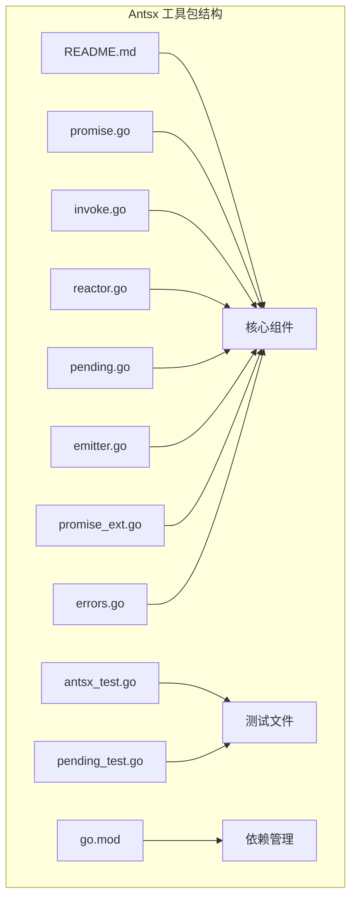
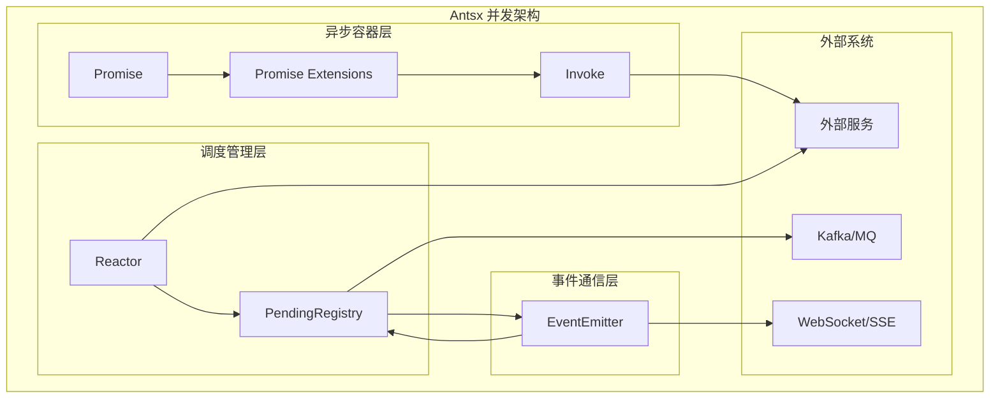
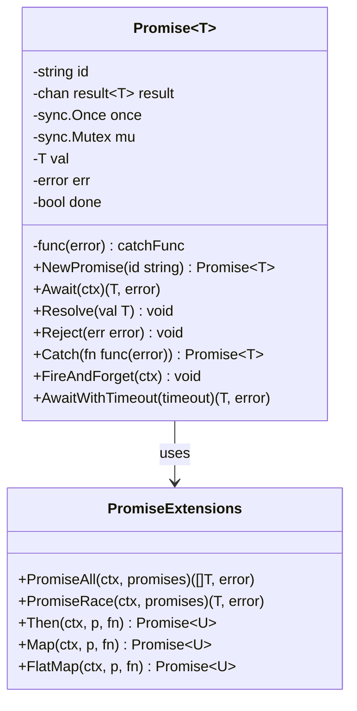
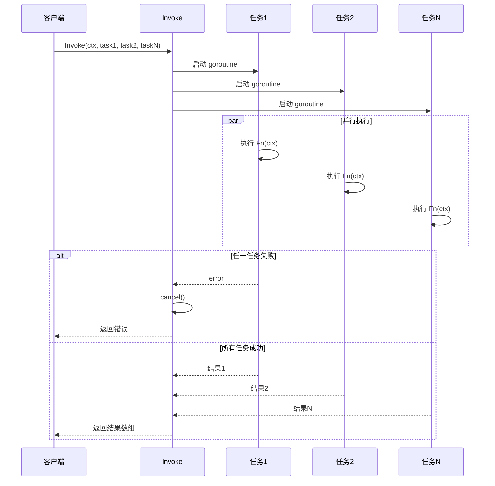
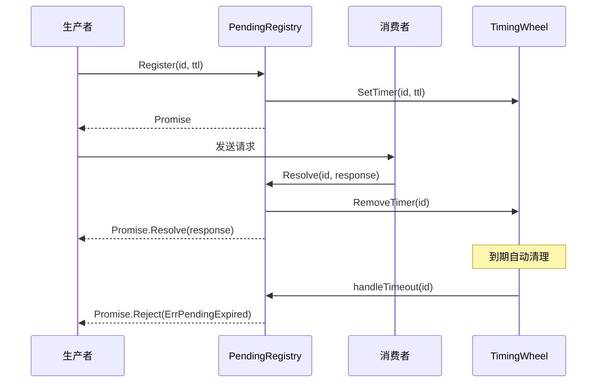
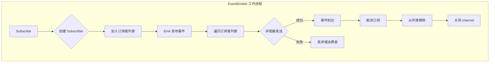
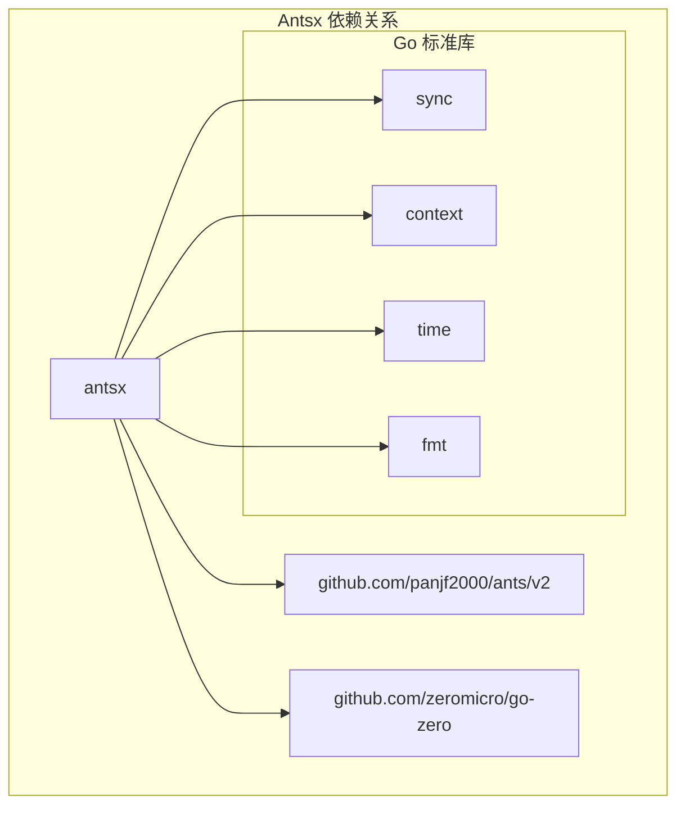

# Antsx并发工具

<cite>
**本文档引用的文件**
- [README.md](file://common/antsx/README.md)
- [emitter.go](file://common/antsx/emitter.go)
- [invoke.go](file://common/antsx/invoke.go)
- [promise.go](file://common/antsx/promise.go)
- [reactor.go](file://common/antsx/reactor.go)
- [pending.go](file://common/antsx/pending.go)
- [errors.go](file://common/antsx/errors.go)
- [promise_ext.go](file://common/antsx/promise_ext.go)
- [antsx_test.go](file://common/antsx/antsx_test.go)
- [pending_test.go](file://common/antsx/pending_test.go)
- [go.mod](file://go.mod)
</cite>

## 更新摘要
**变更内容**
- 新增了EventEmitter工具的TopicCount和SubscriberCount方法
- 更新了EventEmitter组件分析，增加了同步广播事件功能说明
- 新增了订阅者数量查询和主题统计功能
- 更新了详细组件分析中的EventEmitter部分

## 目录
1. [简介](#简介)
2. [项目结构](#项目结构)
3. [核心组件](#核心组件)
4. [架构概览](#架构概览)
5. [详细组件分析](#详细组件分析)
6. [依赖关系分析](#依赖关系分析)
7. [性能考虑](#性能考虑)
8. [故障排除指南](#故障排除指南)
9. [结论](#结论)

## 简介

Antsx 是一个基于 Go 语言的响应式并发工具包，参考 Java Project Reactor 的设计理念，专门为 Go 语言环境提供并发编程解决方案。该工具包提供了完整的异步编程基础设施，包括 Promise 异步容器、Invoke 并行编排、Reactor 池调度器、PendingRegistry 请求响应匹配、EventEmitter 事件发布订阅等功能模块。

**核心特性：**
- **并发安全**：所有类型均采用并发安全设计，内置 panic 恢复机制
- **资源控制**：通过 goroutine 池化实现资源限制和复用
- **超时控制**：支持多种超时机制，包括固定超时和上下文超时
- **错误处理**：完善的错误传播和处理机制
- **ID 去重**：防止重复任务提交，避免资源浪费
- **详细调试日志**：EventEmitter 增强了调试能力，提供订阅生命周期和空订阅场景的日志输出
- **灵活的事件广播模式**：支持非阻塞和同步两种事件广播方式
- **订阅者统计功能**：提供TopicCount和SubscriberCount方法进行运行时监控

## 项目结构

Antsx 工具包位于 `common/antsx/` 目录下，包含以下核心文件：



**图表来源**
- [README.md:1-50](file://common/antsx/README.md#L1-L50)
- [promise.go:1-50](file://common/antsx/promise.go#L1-L50)
- [invoke.go:1-50](file://common/antsx/invoke.go#L1-L50)
- [reactor.go:1-50](file://common/antsx/reactor.go#L1-L50)

**章节来源**
- [README.md:1-100](file://common/antsx/README.md#L1-L100)
- [go.mod:1-63](file://go.mod#L1-L63)

## 核心组件

Antsx 工具包包含五个核心组件，每个组件针对不同的并发场景提供专门的解决方案：

### 1. Promise[T] - 异步结果容器

Promise 是泛型异步结果容器，用于包装可能阻塞的操作，提供超时和取消机制。

**关键特性：**
- 泛型支持，类型安全
- 链式调用支持（Then、Map、FlatMap）
- 错误捕获和处理
- 多次 Await 并发安全

### 2. Invoke - 并行流程编排

Invoke 用于并行执行多个独立的任务，支持超时控制和结果聚合。

**关键特性：**
- 并发执行多个任务
- 快速失败机制（任一任务失败立即取消其余）
- 超时控制
- 结果回调聚合

### 3. Reactor - 池调度器

Reactor 基于 ants goroutine 池，提供资源控制和 ID 去重功能。

**关键特性：**
- goroutine 池化复用
- ID 去重防止重复提交
- Submit、Post、Go 三种提交方式
- 活动任务数监控

### 4. PendingRegistry[T] - 请求响应匹配

用于异步请求-响应场景，通过关联 ID 将响应路由回对应的请求方。

**关键特性：**
- 关联 ID 匹配
- 自动过期机制
- TimingWheel 定时器
- RequestReply 便捷封装

### 5. EventEmitter[T] - 事件发布订阅

支持 topic 级别的发布订阅模式，适合 SSE 推送和实时通知场景。

**关键特性：**
- 一对多事件广播
- topic 级别隔离
- **非阻塞发布**：默认 Emit 方法采用非阻塞模式，避免阻塞生产者
- **同步发布**：EmitSync 方法提供同步广播，等待慢消费者处理
- **订阅者统计**：TopicCount和SubscriberCount方法提供运行时监控
- 订阅者管理
- **增强调试日志**：提供订阅生命周期和空订阅场景的日志输出

**章节来源**
- [README.md:41-438](file://common/antsx/README.md#L41-L438)

## 架构概览

Antsx 工具包采用模块化设计，各组件之间通过清晰的接口进行交互：



**图表来源**
- [promise.go:16-37](file://common/antsx/promise.go#L16-L37)
- [reactor.go:14-29](file://common/antsx/reactor.go#L14-L29)
- [pending.go:43-53](file://common/antsx/pending.go#L43-L53)
- [emitter.go:13-25](file://common/antsx/emitter.go#L13-L25)

## 详细组件分析

### Promise 组件分析

Promise 是整个并发工具包的核心抽象，提供了异步编程的基础能力。



**图表来源**
- [promise.go:16-150](file://common/antsx/promise.go#L16-L150)
- [promise_ext.go:10-134](file://common/antsx/promise_ext.go#L10-L134)

Promise 的设计特点：

1. **并发安全**：使用 sync.Once 确保 Resolve/Reject 只能调用一次
2. **缓存机制**：先检查缓存再等待 channel，支持多次 Await
3. **链式调用**：提供 Then、Map、FlatMap 等函数式编程支持
4. **错误恢复**：内置 panic 恢复，防止 goroutine 泄漏

**章节来源**
- [promise.go:16-150](file://common/antsx/promise.go#L16-L150)
- [promise_ext.go:10-134](file://common/antsx/promise_ext.go#L10-L134)

### Invoke 组件分析

Invoke 提供了并行流程编排的能力，支持多个独立任务的并发执行和结果聚合。



**图表来源**
- [invoke.go:17-72](file://common/antsx/invoke.go#L17-L72)
- [invoke.go:85-149](file://common/antsx/invoke.go#L85-L149)

Invoke 的关键特性：

1. **快速失败**：任一任务失败立即取消其余任务
2. **超时控制**：支持单任务超时和整体超时
3. **并发安全**：使用 WaitGroup 和 sync.Once 确保线程安全
4. **资源控制**：可选的 Reactor 池化执行

**章节来源**
- [invoke.go:17-149](file://common/antsx/invoke.go#L17-L149)

### Reactor 组件分析

Reactor 基于 ants goroutine 池，提供了资源控制和 ID 去重功能。

```mermaid
classDiagram
class Reactor {
-Pool pool
-sync.Map registry
+NewReactor(size int) Reactor
+Submit(ctx, id, task) Promise~T~
+Post(ctx, task) error
+Go(fn) error
+Release() void
+ActiveCount() int
}
class Pool {
+Running() int
+Submit(fn) error
+Release() void
}
class Registry {
+LoadOrStore(key, val) (interface{}, bool)
+Delete(key) void
}
Reactor --> Pool : uses
Reactor --> Registry : uses
```

**图表来源**
- [reactor.go:14-93](file://common/antsx/reactor.go#L14-L93)

Reactor 的设计优势：

1. **资源限制**：通过 ants 池限制最大并发数
2. **ID 去重**：使用 sync.Map 实现任务去重
3. **多种提交方式**：
   - Submit：带 ID 去重，返回 Promise
   - Post：fire-and-forget，错误仅记录
   - Go：最轻量的提交方式
4. **监控能力**：提供活动任务数统计

**章节来源**
- [reactor.go:14-93](file://common/antsx/reactor.go#L14-L93)

### PendingRegistry 组件分析

PendingRegistry 用于异步请求-响应场景，通过关联 ID 实现解耦的通信。



**图表来源**
- [pending.go:105-140](file://common/antsx/pending.go#L105-L140)
- [pending.go:88-103](file://common/antsx/pending.go#L88-L103)

PendingRegistry 的核心功能：

1. **ID 匹配**：通过字符串 ID 关联请求和响应
2. **自动过期**：使用 TimingWheel 实现精确的超时控制
3. **内存优化**：共享时间轮刻度，避免内存泄漏
4. **便捷封装**：RequestReply 一行代码完成完整流程

**章节来源**
- [pending.go:43-244](file://common/antsx/pending.go#L43-L244)

### EventEmitter 组件分析

EventEmitter 实现了 topic 级别的发布订阅模式，支持一对多的事件广播。**最新版本增强了调试能力，提供详细的日志输出，并新增了同步广播方法和订阅者统计功能**。



**图表来源**
- [emitter.go:27-77](file://common/antsx/emitter.go#L27-L77)
- [emitter.go:79-93](file://common/antsx/emitter.go#L79-L93)

EventEmitter 的设计特点：

1. **非阻塞发布**：使用 select 语句避免阻塞生产者
2. **慢消费者保护**：自动丢弃慢消费者的事件
3. **订阅者管理**：支持动态订阅和取消
4. **并发安全**：使用 RWMutex 保护内部状态
5. **增强调试日志**：提供订阅生命周期和空订阅场景的日志输出
6. **灵活的广播模式**：支持非阻塞 Emit 和同步 EmitSync 两种模式
7. **运行时监控**：提供TopicCount和SubscriberCount方法进行统计

**新增功能详情**：

- **订阅生命周期日志**：在取消订阅时输出 `logx.Debugf("unsubscribe topic: %s, index: %d", topic, i)`，记录取消的 topic 和索引位置
- **空订阅场景日志**：在发布事件时检测到没有订阅者时输出 `logx.Debugf("no subscriber for topic: %s", topic)`，便于排查订阅问题
- **同步广播方法**：注释掉的 EmitSync 方法提供了等待慢消费者处理的同步广播功能，适用于需要确保所有订阅者都能接收到事件的场景
- **订阅者统计功能**：新增TopicCount和SubscriberCount方法，提供运行时监控能力

**EmitSync 方法分析**：

EmitSync 方法虽然当前被注释掉，但其设计体现了以下特性：

```go
// EmitSync 向指定 topic 的所有订阅者同步广播事件（会等待慢消费者）
//func (e *EventEmitter[T]) EmitSync(topic string, value T) {
//	e.mu.RLock()
//	subs := make([]*Subscriber[T], len(e.subscribers[topic]))
//	copy(subs, e.subscribers[topic])
//	e.mu.RUnlock()
//	for _, sub := range subs {
//		sub.ch <- value  // 直接发送，不使用 select，会阻塞直到消费者接收
//	}
//}
```

**使用场景**：
- 需要确保所有订阅者都能接收到事件
- 对事件传递的可靠性要求极高
- 订阅者处理速度较慢，需要等待处理完成

**注意事项**：
- 同步模式可能导致生产者阻塞
- 需要谨慎使用，避免影响系统性能
- 适用于小规模、高可靠性的事件传递场景

**订阅者统计功能**：

EventEmitter 新增了两个重要的统计方法：

```go
// TopicCount 返回当前活跃的 topic 数量
func (e *EventEmitter[T]) TopicCount() int {
	e.mu.RLock()
	defer e.mu.RUnlock()
	return len(e.subscribers)
}

// SubscriberCount 返回指定 topic 的订阅者数量
func (e *EventEmitter[T]) SubscriberCount(topic string) int {
	e.mu.RLock()
	defer e.mu.RUnlock()
	return len(e.subscribers[topic])
}
```

**使用场景**：
- 监控系统运行状态
- 调试订阅者数量异常
- 性能优化和容量规划
- 诊断订阅者泄漏问题

**章节来源**
- [emitter.go:13-146](file://common/antsx/emitter.go#L13-L146)

## 依赖关系分析

Antsx 工具包的依赖关系相对简单，主要依赖于 ants goroutine 池库：



**图表来源**
- [reactor.go:3-10](file://common/antsx/reactor.go#L3-L10)
- [go.mod:34](file://go.mod#L34)

依赖管理特点：

1. **最小依赖**：只依赖 ants 池库和标准库
2. **版本控制**：明确的依赖版本要求
3. **零拷贝优化**：使用 ants 的高效 goroutine 池
4. **日志集成**：与 go-zero 日志系统集成

**章节来源**
- [go.mod:1-63](file://go.mod#L1-L63)

## 性能考虑

Antsx 工具包在设计时充分考虑了性能优化：

### 内存优化策略

1. **Channel 缓冲**：Promise 使用带缓冲的 channel，减少 goroutine 切换开销
2. **对象复用**：Reactor 池化 goroutine，避免频繁创建销毁
3. **非阻塞设计**：EventEmitter 采用非阻塞发布，防止生产者阻塞

### 并发优化

1. **RWMutex 使用**：EventEmitter 使用读写锁，提高并发读取性能
2. **sync.Once 保证**：确保 Resolve/Reject 只执行一次
3. **WaitGroup 协调**：Invoke 使用 WaitGroup 精确控制任务完成

### 资源控制

1. **池化限制**：Reactor 通过 ants 限制最大并发数
2. **超时机制**：多种超时控制防止资源泄露
3. **自动清理**：PendingRegistry 自动清理过期条目

### 广播模式选择

EventEmitter 提供了两种广播模式，需要根据具体场景选择：

**非阻塞模式（推荐）**：
- 性能最佳，不会阻塞生产者
- 适用于大多数事件推送场景
- 可能丢失慢消费者的事件

**同步模式（谨慎使用）**：
- 确保所有订阅者都能接收到事件
- 可能阻塞生产者，影响性能
- 适用于高可靠性的关键事件

### 统计功能使用建议

EventEmitter 的统计功能应该谨慎使用：

**TopicCount 使用场景**：
- 系统健康监控
- 订阅者数量异常告警
- 性能基准测试

**SubscriberCount 使用场景**：
- 订阅者数量异常排查
- 事件负载均衡决策
- 资源分配优化

**性能影响**：
- 统计方法都是O(1)操作，开销很小
- 频繁调用统计方法会影响性能
- 建议定期采样而非实时监控

## 故障排除指南

### 常见问题及解决方案

#### 1. Promise 超时问题

**症状**：Promise.Await 返回 context.DeadlineExceeded

**原因**：
- 任务执行时间超过设定超时
- 任务内部阻塞操作未正确处理

**解决方案**：
- 检查任务执行逻辑
- 适当增加超时时间
- 使用 AwaitWithTimeout 替代固定超时

#### 2. Reactor 池满载

**症状**：Submit 返回池已满错误

**原因**：
- 活动任务数达到池大小上限
- 任务执行时间过长

**解决方案**：
- 增大 Reactor 池大小
- 优化任务执行效率
- 使用 Post 进行 fire-and-forget 操作

#### 3. PendingRegistry 过期

**症状**：PendingRegistry 返回 ErrPendingExpired

**原因**：
- 响应未在 TTL 时间内到达
- 网络延迟或服务异常

**解决方案**：
- 增加 TTL 时间
- 检查网络连接
- 实现重试机制

#### 4. EventEmitter 内存泄漏

**症状**：订阅者数量持续增长

**原因**：
- 未正确调用取消函数
- 订阅者忘记取消订阅

**解决方案**：
- 确保每次订阅后调用 cancel()
- 使用 defer 语句自动取消
- 定期检查订阅者数量

#### 5. EventEmitter 调试日志问题

**症状**：EventEmitter 无法输出预期的日志

**原因**：
- 日志级别配置不当
- 调试日志仅在特定场景触发

**解决方案**：
- **订阅生命周期日志**：当调用取消函数时，系统会输出 `unsubscribe topic: %s, index: %d` 格式的调试日志，帮助追踪订阅者的取消过程
- **空订阅场景日志**：当向没有订阅者的 topic 发布事件时，系统会输出 `no subscriber for topic: %s` 格式的调试日志，便于排查订阅问题
- 检查日志配置，确保 Debug 级别日志被启用
- 在开发环境中启用详细的调试日志输出

#### 6. EventEmitter 同步广播需求

**症状**：需要确保所有订阅者都能接收到事件，但使用 Emit 时出现事件丢失

**原因**：
- Emit 采用非阻塞模式，慢消费者可能错过事件
- 对事件传递的可靠性要求较高

**解决方案**：
- 考虑使用注释掉的 EmitSync 方法（需要手动启用）
- 或者在业务层实现重试机制
- 评估是否需要切换到同步模式

#### 7. EventEmitter 统计功能问题

**症状**：TopicCount和SubscriberCount返回值异常

**原因**：
- 统计方法调用时机不当
- 订阅者数量变化频繁
- 并发访问竞争条件

**解决方案**：
- 确保在适当的时机调用统计方法
- 避免在高并发场景下频繁调用统计方法
- 使用原子操作或互斥锁保护统计数据
- 检查是否存在订阅者泄漏问题

#### 8. EventEmitter 性能问题

**症状**：EventEmitter 导致系统性能下降

**原因**：
- 订阅者数量过多
- 事件发布频率过高
- 缓冲区设置不当

**解决方案**：
- 优化订阅者数量，及时取消不再使用的订阅
- 调整事件发布频率，避免过度频繁的事件推送
- 合理设置订阅者缓冲区大小
- 考虑使用同步模式以提高可靠性但注意性能影响

**章节来源**
- [errors.go:5-9](file://common/antsx/errors.go#L5-L9)
- [antsx_test.go:84-104](file://common/antsx/antsx_test.go#L84-L104)
- [emitter.go:56](file://common/antsx/emitter.go#L56)
- [emitter.go:89](file://common/antsx/emitter.go#L89)
- [emitter.go:100-109](file://common/antsx/emitter.go#L100-L109)

## 结论

Antsx 并发工具包是一个设计精良的 Go 语言响应式编程解决方案，具有以下显著优势：

### 设计优势

1. **模块化设计**：五个核心组件各司其职，功能清晰分离
2. **并发安全**：所有组件都经过精心设计，确保线程安全
3. **资源控制**：提供多层次的资源限制和监控
4. **错误处理**：完善的错误传播和恢复机制
5. **增强调试能力**：EventEmitter 新增详细的调试日志，便于故障排查
6. **灵活的广播模式**：支持非阻塞和同步两种事件广播方式，满足不同场景需求
7. **运行时监控**：新增的统计功能提供系统运行状态的可视化监控

### 应用场景

- **微服务通信**：gRPC 超时控制和错误处理
- **批量数据处理**：并行任务编排和结果聚合
- **实时事件系统**：SSE 推送和 WebSocket 事件分发
- **异步消息处理**：MQ 请求-响应模式实现
- **高可靠性事件传递**：需要确保所有订阅者都能接收到事件的场景
- **系统监控和运维**：通过统计功能进行系统状态监控

### 技术特色

- **Go 语言惯用法**：完全符合 Go 语言编程风格
- **泛型支持**：充分利用 Go 1.18+ 泛型特性
- **性能优化**：多处性能优化，包括池化和非阻塞设计
- **测试覆盖**：完整的单元测试和集成测试
- **详细日志**：EventEmitter 提供订阅生命周期和空订阅场景的详细日志输出
- **可扩展性**：注释掉的 EmitSync 方法展示了工具包的可扩展性设计
- **监控能力**：新增的统计功能为系统监控提供了基础支撑

Antsx 工具包为 Go 语言开发者提供了一套完整的并发编程基础设施，既保持了简洁性，又具备了企业级应用所需的可靠性、性能和可维护性。最新的调试日志增强功能、可选的同步广播方法以及订阅者统计功能进一步提升了工具包的可观测性和适用场景的广泛性。开发者可以根据具体需求选择合适的广播模式，在性能和可靠性之间找到最佳平衡点，同时利用统计功能进行系统的有效监控和运维。