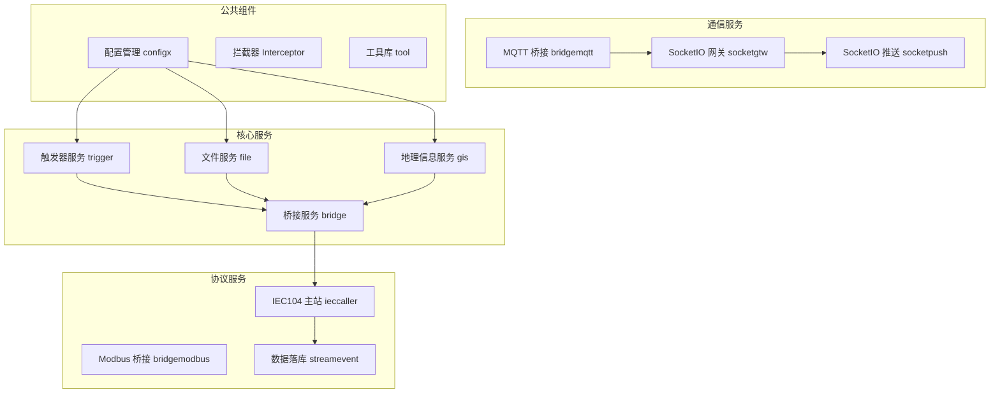
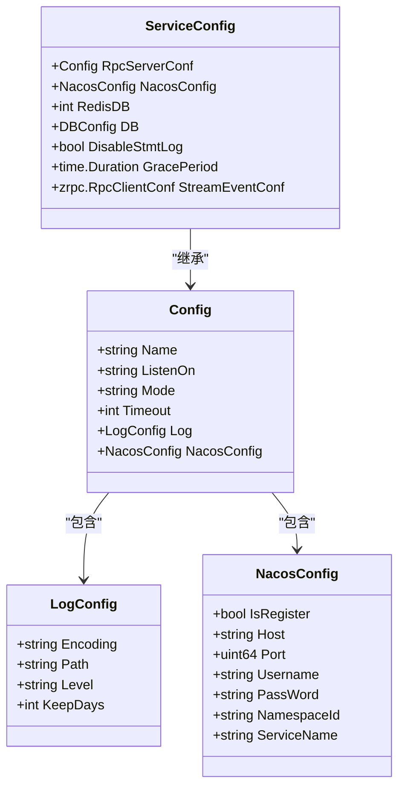
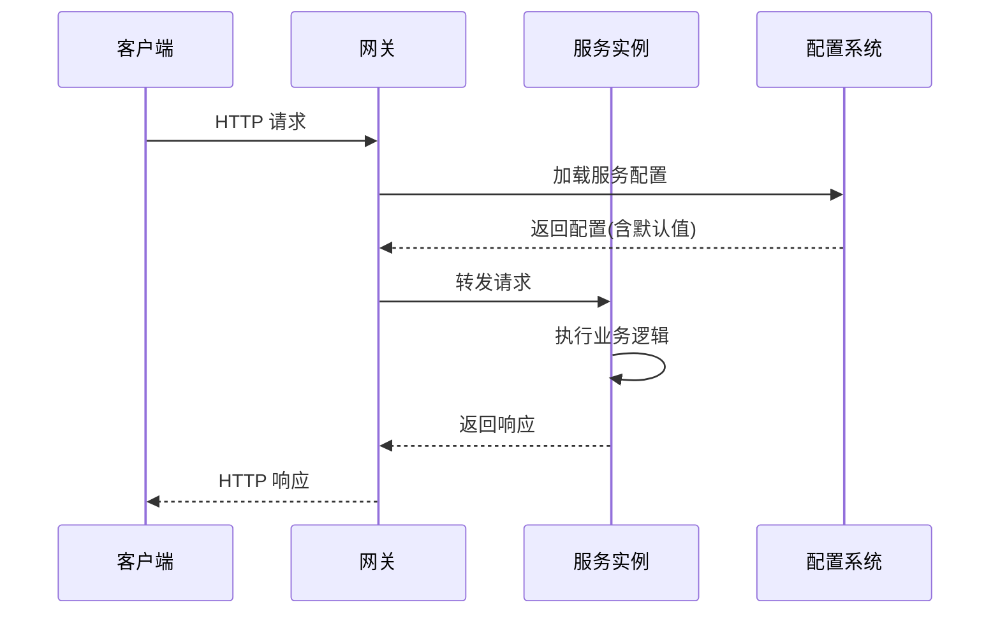
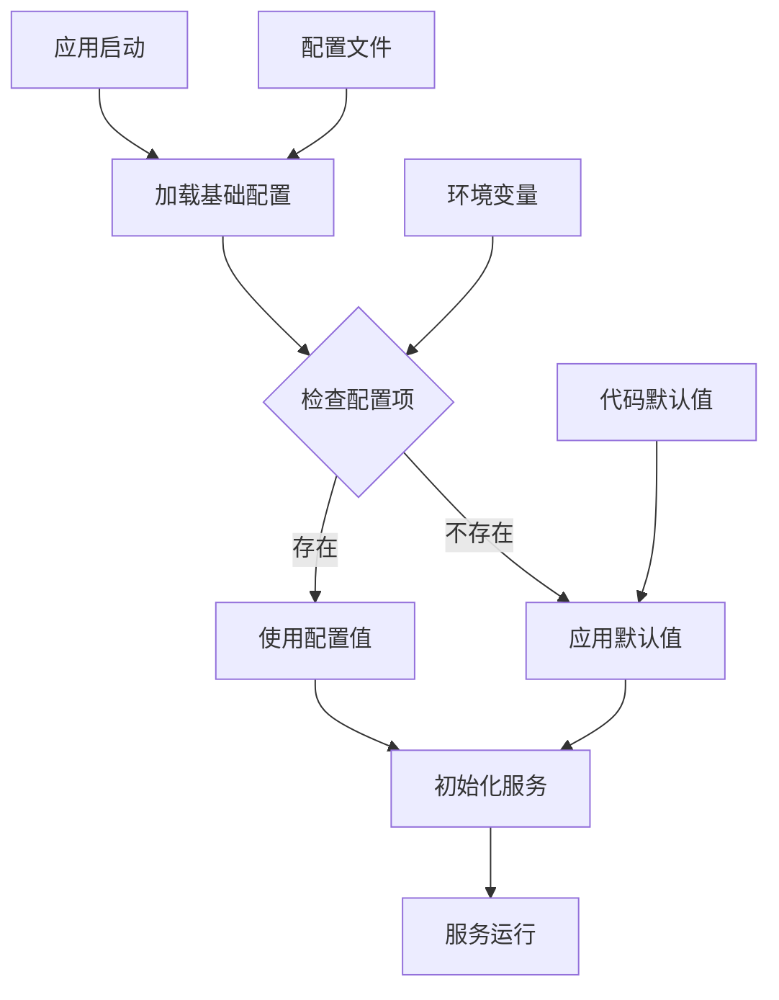
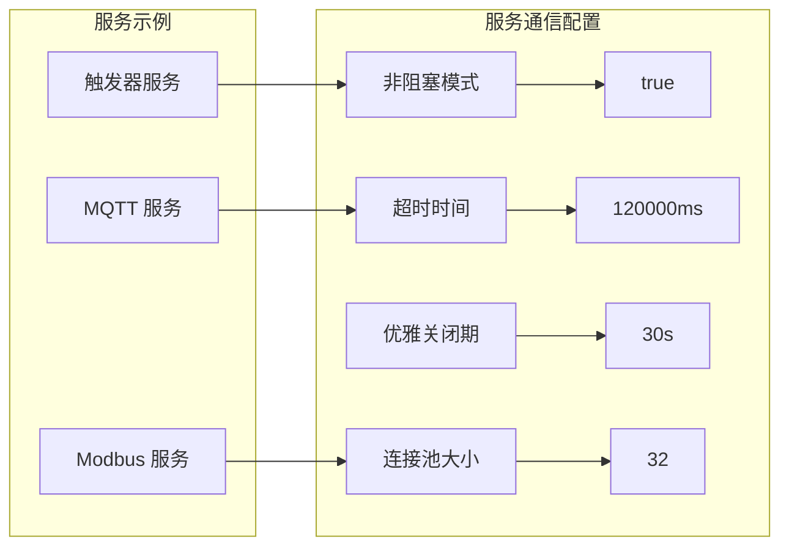
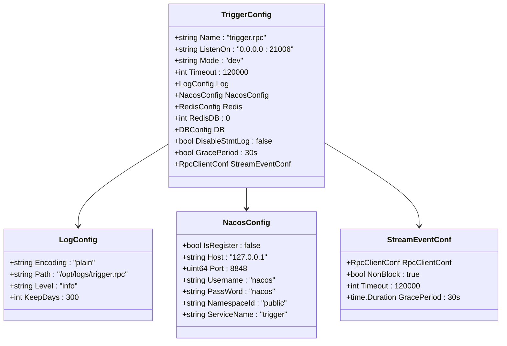
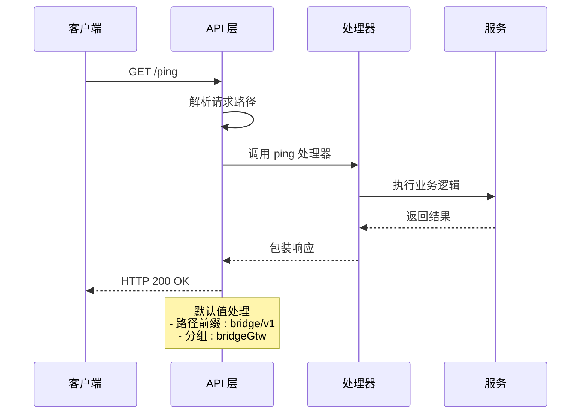
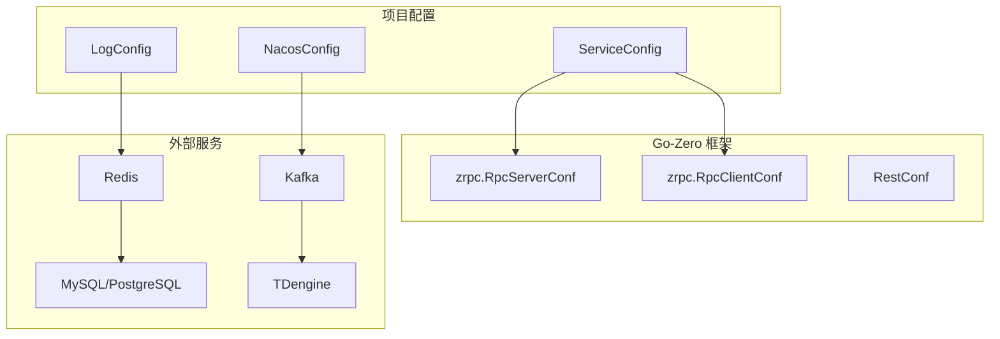
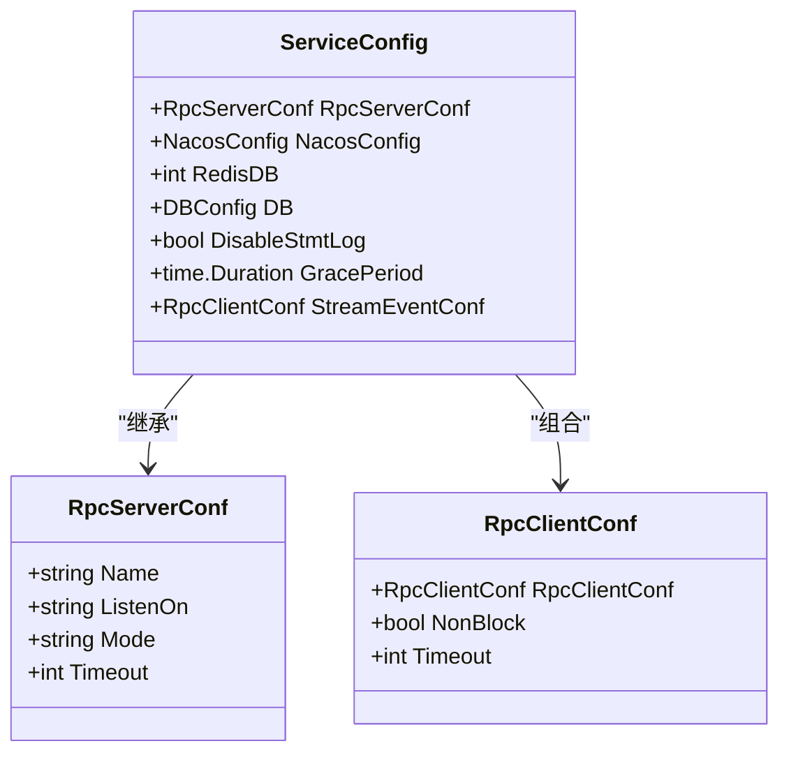

# Api Default Values

<cite>
**本文档引用的文件**
- [go.mod](file://go.mod)
- [README.md](file://README.md)
- [trigger.yaml](file://app/trigger/etc/trigger.yaml)
- [config.go](file://app/trigger/internal/config/config.go)
- [bridgegtw.yaml](file://app/bridgegtw/etc/bridgegtw.yaml)
- [bridgegtw.api](file://app/bridgegtw/bridgegtw.api)
- [file.yaml](file://app/file/etc/file.yaml)
- [gis.yaml](file://app/gis/etc/gis.yaml)
- [bridgemodbus.yaml](file://app/bridgemodbus/etc/bridgemodbus.yaml)
- [bridgemqtt.yaml](file://app/bridgemqtt/etc/bridgemqtt.yaml)
- [ieccaller.yaml](file://app/ieccaller/etc/ieccaller.yaml)
- [kqConfig.go](file://common/configx/kqConfig.go)
</cite>

## 目录
1. [简介](#简介)
2. [项目结构](#项目结构)
3. [核心组件](#核心组件)
4. [架构概览](#架构概览)
5. [详细组件分析](#详细组件分析)
6. [依赖分析](#依赖分析)
7. [性能考虑](#性能考虑)
8. [故障排除指南](#故障排除指南)
9. [结论](#结论)

## 简介

Zero-Service 是一个基于 go-zero 的工业级微服务脚手架，专注于物联网数据采集、异步任务调度和实时通信等场景。该项目提供了开箱即用的多协议接入和高性能数据处理能力，支持 IEC 60870-5-104、Modbus TCP/RTU、MQTT、gRPC、HTTP 等多种协议。

该文档重点关注 API 默认值的实现机制，通过分析各个服务的配置文件和代码结构，展示如何在不同组件中设置和使用默认值。

## 项目结构

项目采用模块化的微服务架构，主要分为以下几个核心部分：



**图表来源**
- [README.md: 59-108:59-108](file://README.md#L59-L108)

**章节来源**
- [README.md: 15-51:15-51](file://README.md#L15-L51)
- [README.md: 59-108:59-108](file://README.md#L59-L108)

## 核心组件

### 配置系统架构

项目采用统一的配置管理系统，通过 YAML 配置文件和 Go 结构体定义相结合的方式实现默认值管理：



**图表来源**
- [config.go: 9-27:9-27](file://app/trigger/internal/config/config.go#L9-L27)

### API 定义结构

每个服务都通过 .api 文件定义其对外提供的 API 接口：



**图表来源**
- [bridgegtw.api: 17-21:17-21](file://app/bridgegtw/bridgegtw.api#L17-L21)

**章节来源**
- [config.go: 1-28:1-28](file://app/trigger/internal/config/config.go#L1-L28)
- [bridgegtw.api: 1-23:1-23](file://app/bridgegtw/bridgegtw.api#L1-L23)

## 架构概览

### 配置层次结构

项目中的配置采用多层次的设计，确保默认值的一致性和可维护性：



**图表来源**
- [trigger.yaml: 1-37:1-37](file://app/trigger/etc/trigger.yaml#L1-L37)
- [config.go: 25-26:25-26](file://app/trigger/internal/config/config.go#L25-L26)

### 服务间通信默认值

不同服务之间通过 gRPC 进行通信，配置了相应的超时和阻塞策略：



**图表来源**
- [trigger.yaml: 34-36:34-36](file://app/trigger/etc/trigger.yaml#L34-L36)
- [bridgemodbus.yaml: 11](file://app/bridgemodbus/etc/bridgemodbus.yaml#L11)
- [bridgemqtt.yaml: 47](file://app/bridgemqtt/etc/bridgemqtt.yaml#L47)

**章节来源**
- [trigger.yaml: 1-37:1-37](file://app/trigger/etc/trigger.yaml#L1-L37)
- [bridgemodbus.yaml: 1-26:1-26](file://app/bridgemodbus/etc/bridgemodbus.yaml#L1-L26)
- [bridgemqtt.yaml: 1-48:1-48](file://app/bridgemqtt/etc/bridgemqtt.yaml#L1-L48)

## 详细组件分析

### 触发器服务配置分析

触发器服务是项目的核心调度服务，其配置体现了丰富的默认值设置策略：

#### 配置结构分析



**图表来源**
- [trigger.yaml: 1-37:1-37](file://app/trigger/etc/trigger.yaml#L1-L37)
- [config.go: 9-27:9-27](file://app/trigger/internal/config/config.go#L9-L27)

#### 默认值实现机制

触发器服务通过以下方式实现默认值：

1. **结构体标签默认值**：使用 `json:",default=30s"` 为 `GracePeriod` 字段设置默认值
2. **配置文件覆盖**：YAML 文件中的具体值可以覆盖代码中的默认值
3. **条件配置**：某些配置项只有在特定条件下才生效

**章节来源**
- [trigger.yaml: 1-37:1-37](file://app/trigger/etc/trigger.yaml#L1-L37)
- [config.go: 25-26:25-26](file://app/trigger/internal/config/config.go#L25-L26)

### 网关服务 API 默认值

桥接网关服务展示了 API 层面的默认值处理：

#### API 定义默认值



**图表来源**
- [bridgegtw.api: 13-21:13-21](file://app/bridgegtw/bridgegtw.api#L13-L21)

**章节来源**
- [bridgegtw.api: 1-23:1-23](file://app/bridgegtw/bridgegtw.api#L1-L23)
- [bridgegtw.yaml: 12-40:12-40](file://app/bridgegtw/etc/bridgegtw.yaml#L12-L40)

### 协议服务配置默认值

#### IEC104 服务默认值

IEC104 主站服务配置体现了工业协议的特殊需求：

| 配置项 | 默认值 | 说明 |
|--------|--------|------|
| DeployMode | standalone | 部署模式 |
| TaskConcurrency | 16 | 任务并发数 |
| PushAsduChunkBytes | 1048576 | 推送块大小(1MB) |
| GracePeriod | 30s | 优雅关闭期 |
| KafkaConfig.Topic | asdu | Kafka 主题 |
| MqttConfig.Qos | 0 | MQTT 服务质量 |

#### Modbus 服务默认值

Modbus 桥接服务的配置特点：

| 配置项 | 默认值 | 说明 |
|--------|--------|------|
| ModbusPool | 32 | 连接池大小 |
| ModbusClientConf.Address | 127.0.0.1:5020 | 服务器地址 |
| ModbusClientConf.Slave | 1 | 从站号 |

**章节来源**
- [ieccaller.yaml: 1-79:1-79](file://app/ieccaller/etc/ieccaller.yaml#L1-L79)
- [bridgemodbus.yaml: 1-26:1-26](file://app/bridgemodbus/etc/bridgemodbus.yaml#L1-L26)

### 通信服务默认值

#### MQTT 服务配置

MQTT 桥接服务的默认配置：

```mermaid
flowchart TD
A[MQTT 配置] --> B[Broker: ["tcp://localhost:1883"]]
A --> C[Username: "mqtt"]
A --> D[Password: "password"]
A --> E[Qos: 0]
A --> F[SubscribeTopics: ["test", "test/topic2", "iec/#"]]
A --> G[SocketPushConf: 10000ms 超时]
H[事件映射] --> I[可选配置]
J[广播主题] --> K[可选配置]
```

**图表来源**
- [bridgemqtt.yaml: 19-48:19-48](file://app/bridgemqtt/etc/bridgemqtt.yaml#L19-L48)

**章节来源**
- [bridgemqtt.yaml: 1-48:1-48](file://app/bridgemqtt/etc/bridgemqtt.yaml#L1-L48)

## 依赖分析

### 外部依赖与默认值

项目使用 go-zero 微服务框架，其依赖关系对默认值实现有重要影响：



**图表来源**
- [go.mod: 50-51:50-51](file://go.mod#L50-L51)
- [config.go: 6](file://app/trigger/internal/config/config.go#L6)

### 配置继承关系



**图表来源**
- [config.go: 9-27:9-27](file://app/trigger/internal/config/config.go#L9-L27)

**章节来源**
- [go.mod: 50-51:50-51](file://go.mod#L50-L51)
- [config.go: 1-28:1-28](file://app/trigger/internal/config/config.go#L1-L28)

## 性能考虑

### 默认值对性能的影响

1. **超时设置**：合理的超时配置避免服务阻塞
2. **连接池大小**：根据硬件资源调整连接池大小
3. **并发控制**：任务并发数需要平衡吞吐量和资源消耗
4. **缓冲区大小**：数据传输缓冲区影响内存使用和延迟

### 监控与调优

- 使用 `DisableStmtLog` 控制数据库语句日志输出
- 通过 `KeepDays` 管理日志保留策略
- 利用 `GracePeriod` 实现优雅停机

## 故障排除指南

### 常见配置问题

1. **端口冲突**：检查 `ListenOn` 配置是否被占用
2. **超时设置不当**：根据网络状况调整 `Timeout` 值
3. **连接池耗尽**：监控 `ModbusPool` 使用情况
4. **日志配置错误**：确认 `Log.Path` 权限和磁盘空间

### 调试建议

- 启用详细的日志记录进行问题定位
- 使用 `Mode: dev` 进行开发调试
- 检查 Nacos 服务注册状态
- 验证数据库连接配置

**章节来源**
- [trigger.yaml: 5-10:5-10](file://app/trigger/etc/trigger.yaml#L5-L10)
- [file.yaml: 17-20:17-20](file://app/file/etc/file.yaml#L17-L20)

## 结论

Zero-Service 项目通过精心设计的配置系统实现了灵活而可靠的默认值管理。主要特点包括：

1. **多层次默认值**：代码默认值、配置文件覆盖、运行时动态配置相结合
2. **类型安全**：通过结构体标签确保类型安全的默认值设置
3. **可扩展性**：支持服务特定的配置扩展
4. **监控友好**：完善的日志和监控配置选项

这种设计使得服务既能在开发环境中快速启动，又能在生产环境中进行精细调优，为工业级应用场景提供了坚实的基础。