# Ctxdata 上下文管理

<cite>
**本文档引用的文件**
- [ctxData.go](file://common/ctxdata/ctxData.go)
- [claims.go](file://common/ctxprop/claims.go)
- [grpc.go](file://common/ctxprop/grpc.go)
- [http.go](file://common/ctxprop/http.go)
- [ctx.go](file://common/ctxprop/ctx.go)
- [wrapper.go](file://common/mcpx/wrapper.go)
- [client.go](file://common/mcpx/client.go)
- [aigtw.go](file://aiapp/aigtw/aigtw.go)
- [auth.go](file://common/mcpx/auth.go)
- [gtw.go](file://gtw/gtw.go)
- [socketgtw.go](file://socketapp/socketgtw/socketgtw.go)
- [publishwithtracelogic.go](file://app/bridgemqtt/internal/logic/publishwithtracelogic.go)
- [trace.go](file://common/mqttx/trace.go)
</cite>

## 更新摘要
**变更内容**
- 新增CtxMetaKey常量，用于MCP _meta数据的透传和业务层处理
- 增强了MCP客户端和服务端的上下文传递机制
- 支持在JSON-RPC请求中通过_params._meta传递用户上下文和链路信息
- 业务层可以通过ctxdata.GetMeta(ctx)获取原始_meta数据进行自定义解析

## 目录
1. [简介](#简介)
2. [项目结构](#项目结构)
3. [核心组件](#核心组件)
4. [架构概览](#架构概览)
5. [详细组件分析](#详细组件分析)
6. [认证类型管理](#认证类型管理)
7. [追踪上下文处理](#追踪上下文处理)
8. [MCP _meta数据透传](#mcp-_meta数据透传)
9. [国际化字符集支持](#国际化字符集支持)
10. [依赖关系分析](#依赖关系分析)
11. [性能考虑](#性能考虑)
12. [故障排除指南](#故障排除指南)
13. [结论](#结论)

## 简介

Ctxdata 是一个专门设计的上下文管理模块，用于在微服务架构中统一管理和传播用户上下文信息。该模块提供了一套完整的解决方案，支持在 gRPC、HTTP、WebSocket 和 MCP 等多种传输协议之间传递用户身份信息、授权令牌、认证类型和自定义元数据。

**更新** 新增了对MCP（Model Context Protocol）协议的深度支持，通过CtxMetaKey常量实现了_meta数据的完整透传机制。现在可以在JSON-RPC请求中通过_params._meta字段传递用户上下文、链路追踪信息和业务自定义数据，业务层可以获取原始_meta数据进行灵活的自定义解析。

该系统的核心价值在于：
- **统一的数据模型**：通过单一的 PropFields 列表定义所有需要传递的上下文字段
- **多协议支持**：自动处理 gRPC 元数据、HTTP 头部、WebSocket 连接和 MCP _meta 的转换
- **安全性保障**：内置敏感信息脱敏机制，防止日志泄露
- **国际化支持**：智能处理非ASCII字符，确保全球用户的无障碍使用
- **零配置扩展**：新增字段只需修改 PropFields，无需修改其他代码
- **认证类型管理**：支持区分服务级和用户级认证，增强系统安全性
- **智能字符集处理**：自动检测和处理各种字符集，提升用户体验
- **MCP协议支持**：完整的JSON-RPC _meta透传机制，支持业务层自定义解析

## 项目结构

Ctxdata 模块位于 `common/ctxdata/` 目录下，与上下文属性处理模块 `common/ctxprop/` 协同工作，同时集成了 MCP 协议支持和 MQTT 追踪功能：

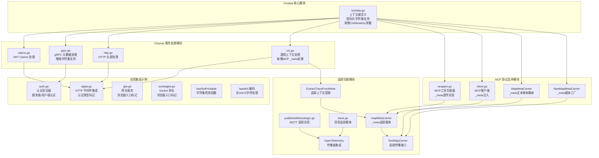

**图表来源**
- [ctxData.go:1-77](file://common/ctxdata/ctxData.go#L1-L77)
- [claims.go:1-69](file://common/ctxprop/claims.go#L1-L69)
- [grpc.go:1-65](file://common/ctxprop/grpc.go#L1-L65)
- [http.go:1-37](file://common/ctxprop/http.go#L1-L37)
- [ctx.go:1-78](file://common/ctxprop/ctx.go#L1-L78)
- [wrapper.go:1-123](file://common/mcpx/wrapper.go#L1-L123)
- [client.go:740-976](file://common/mcpx/client.go#L740-L976)
- [auth.go:17-72](file://common/mcpx/auth.go#L17-L72)
- [publishwithtracelogic.go:1-48](file://app/bridgemqtt/internal/logic/publishwithtracelogic.go#L1-L48)
- [trace.go:1-30](file://common/mqttx/trace.go#L1-L30)

**章节来源**
- [ctxData.go:1-77](file://common/ctxdata/ctxData.go#L1-L77)
- [claims.go:1-69](file://common/ctxprop/claims.go#L1-L69)
- [grpc.go:1-65](file://common/ctxprop/grpc.go#L1-L65)
- [http.go:1-37](file://common/ctxprop/http.go#L1-L37)

## 核心组件

### 上下文字段定义

Ctxdata 模块定义了六个核心上下文字段，其中新增的CtxMetaKey专门用于MCP _meta数据的透传：

| 字段名称 | 上下文键 | gRPC 头部 | HTTP 头部 | 敏感度 | 说明 |
|---------|----------|-----------|-----------|--------|------|
| 用户ID | user-id | x-user-id | X-User-Id | 不敏感 | 用户标识符 |
| 用户名 | user-name | x-user-name | X-User-Name | 不敏感 | 用户显示名称（支持国际化字符） |
| 部门代码 | dept-code | x-dept-code | X-Dept-Code | 不敏感 | 用户所属部门 |
| 授权令牌 | authorization | authorization | Authorization | 敏感 | 认证令牌 |
| **认证类型** | **auth-type** | **x-auth-type** | **X-Auth-Type** | **不敏感** | **认证来源标识** |
| **_meta数据** | **_meta** | **无** | **无** | **不敏感** | ****MCP JSON-RPC _meta透传** |

**更新** 新增的CtxMetaKey常量（值为"_meta"）专门用于存储MCP协议中透传的原始_meta数据，业务层可以通过ctxdata.GetMeta(ctx)获取并自行解析。

### 获取函数

每个字段都提供了对应的获取函数，用于从 context 中安全地提取值：

```mermaid
flowchart TD
A[GetUserId(ctx)] --> B{检查 context.Value}
B --> |存在且为字符串| C[返回用户ID]
B --> |不存在或类型不匹配| D[返回空字符串]
E[GetAuthorization(ctx)] --> F{检查 context.Value}
F --> |存在且为字符串| G[返回授权令牌]
F --> |不存在或类型不匹配| H[返回空字符串]
I[GetAuthType(ctx)] --> J{检查 context.Value}
J --> |存在且为字符串| K[返回认证类型]
J --> |不存在或类型不匹配| L[返回空字符串]
M[GetMeta(ctx)] --> N{检查 context.Value}
N --> |存在且为map[string]any| O[返回原始_meta数据]
N --> |不存在或类型不匹配| P[返回nil]
```

**图表来源**
- [ctxData.go:41-76](file://common/ctxdata/ctxData.go#L41-L76)

**章节来源**
- [ctxData.go:5-39](file://common/ctxdata/ctxData.go#L5-L39)
- [ctxData.go:41-76](file://common/ctxdata/ctxData.go#L41-L76)

## 架构概览

Ctxdata 系统采用分层架构设计，确保不同传输协议之间的无缝集成，增强了字符集处理能力和MCP协议支持：

```mermaid
graph TB
subgraph "应用层"
A[HTTP 服务]
B[gRPC 服务]
C[WebSocket 服务]
D[MCP 客户端]
E[网关服务]
F[Socket 网关]
G[MQTT 服务]
H[MCP 服务端]
end
subgraph "认证类型管理"
I[服务级认证<br/>auth-type: service]
J[用户级认证<br/>auth-type: user]
K[认证类型识别<br/>自动区分]
end
subgraph "国际化字符集处理"
L[hasNotPrintable<br/>字符集检测]
M[base64 编码<br/>非ASCII字符处理]
N[智能字符集转换<br/>透明支持多语言]
end
subgraph "MCP _meta透传机制"
O[CollectFromCtx<br/>收集上下文到_meta]
P[ExtractFromMeta<br/>从_meta提取上下文]
Q[ExtractTraceFromMeta<br/>从_meta提取追踪信息]
R[MapMetaCarrier<br/>_meta文本映射载体]
S[NewMapMetaCarrier<br/>_meta载体工厂]
T[GetMeta<br/>获取原始_meta数据]
end
subgraph "上下文处理层"
A --> I
B --> K
C --> K
D --> O
E --> I
F --> J
G --> K
H --> P
H --> Q
H --> T
L --> M
M --> N
O --> R
P --> S
Q --> T
U[ExtractFromClaims<br/>JWT Claims 处理]
V[InjectToGrpcMD<br/>gRPC 注入<br/>增强字符集支持]
W[ExtractFromGrpcMD<br/>gRPC 提取<br/>智能解码]
X[ExtractFromHTTPHeader<br/>HTTP 头部提取]
Y[InjectToHTTPHeader<br/>HTTP 注入]
Z[CollectFromCtx<br/>上下文收集]
AA[认证类型注入<br/>自动设置]
BB[MQTT 追踪<br/>OpenTelemetry 集成]
CC[智能字符集处理<br/>透明支持多语言]
DD[业务层自定义解析<br/>GetMeta(ctx)]
end
A --> U
B --> V
C --> W
D --> Z
E --> Y
F --> AA
G --> BB
H --> CC
I --> DD
```

**图表来源**
- [claims.go:13-23](file://common/ctxprop/claims.go#L13-L23)
- [grpc.go:13-22](file://common/ctxprop/grpc.go#L13-L22)
- [grpc.go:51-63](file://common/ctxprop/grpc.go#L51-L63)
- [http.go:12-18](file://common/ctxprop/http.go#L12-L18)
- [ctx.go:12-23](file://common/ctxprop/ctx.go#L12-L23)
- [ctx.go:28-41](file://common/ctxprop/ctx.go#L28-L41)
- [ctx.go:43-51](file://common/ctxprop/ctx.go#L43-L51)
- [wrapper.go:36-101](file://common/mcpx/wrapper.go#L36-L101)
- [client.go:747-789](file://common/mcpx/client.go#L747-L789)
- [auth.go:17-72](file://common/mcpx/auth.go#L17-L72)
- [publishwithtracelogic.go:30-47](file://app/bridgemqtt/internal/logic/publishwithtracelogic.go#L30-L47)
- [trace.go:15-29](file://common/mqttx/trace.go#L15-L29)

## 详细组件分析

### JWT Claims 处理

JWT Claims 处理模块负责从 JSON Web Token 中提取用户上下文信息，并将其标准化为系统内部使用的格式：

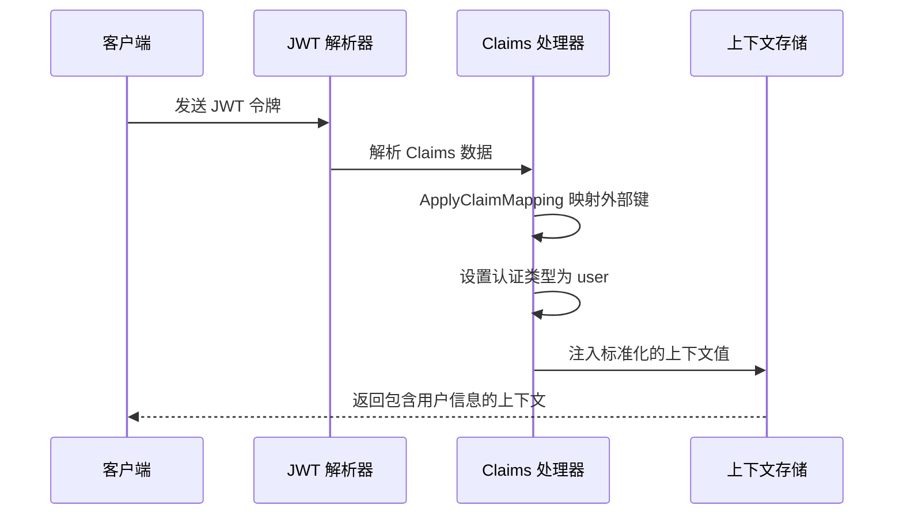

**图表来源**
- [claims.go:13-23](file://common/ctxprop/claims.go#L13-L23)
- [claims.go:28-34](file://common/ctxprop/claims.go#L28-L34)
- [claims.go:50-68](file://common/ctxprop/claims.go#L50-L68)

### gRPC 元数据传播

**更新** gRPC 元数据处理模块现在具备了强大的字符集处理能力，能够透明地处理各种国际化的字符：

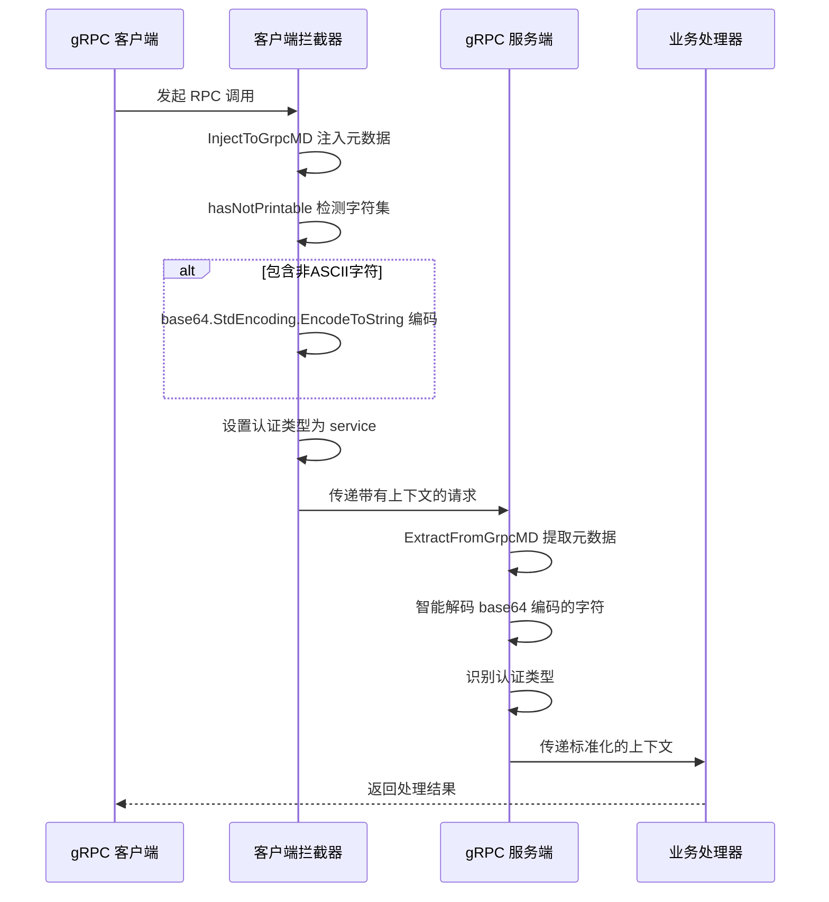

**图表来源**
- [grpc.go:13-22](file://common/ctxprop/grpc.go#L13-L22)
- [grpc.go:26-44](file://common/ctxprop/grpc.go#L26-L44)
- [grpc.go:51-63](file://common/ctxprop/grpc.go#L51-L63)

### HTTP 头部处理

HTTP 头部处理模块支持在 REST API 调用中传递用户上下文信息，包括认证类型标识：

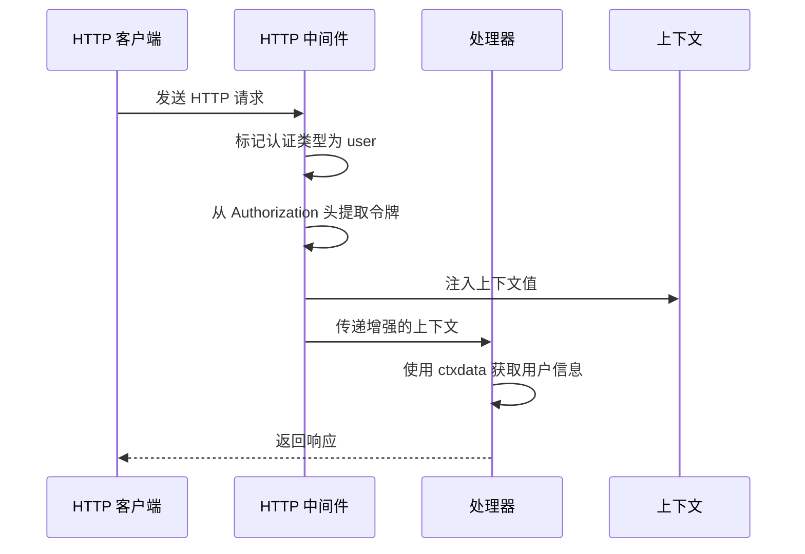

**图表来源**
- [aigtw.go:46-69](file://aiapp/aigtw/aigtw.go#L46-L69)
- [http.go:12-18](file://common/ctxprop/http.go#L12-L18)

### WebSocket 集成

WebSocket 服务通过连接级别的头部信息传递用户上下文，包括认证类型标识：

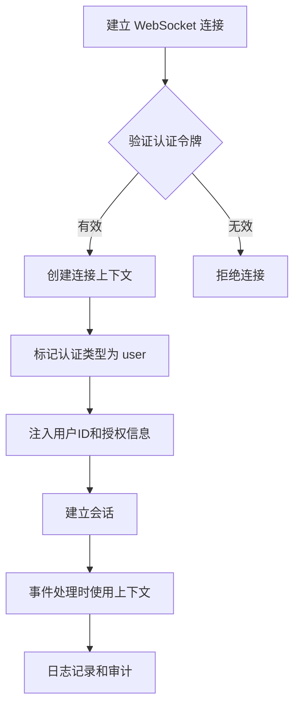

**图表来源**
- [client.go:294-493](file://common/mcpx/client.go#L294-L493)

**章节来源**
- [claims.go:1-69](file://common/ctxprop/claims.go#L1-L69)
- [grpc.go:1-65](file://common/ctxprop/grpc.go#L1-L65)
- [http.go:1-37](file://common/ctxprop/http.go#L1-L37)
- [ctx.go:1-78](file://common/ctxprop/ctx.go#L1-L78)
- [aigtw.go:40-104](file://aiapp/aigtw/aigtw.go#L40-L104)
- [client.go:294-493](file://common/mcpx/client.go#L294-L493)

## 认证类型管理

认证类型管理功能保持不变，继续为系统提供区分服务级认证和用户级认证的能力：

### 认证类型定义

| 认证类型 | 值 | 用途 | 安全级别 |
|---------|-----|------|----------|
| 服务级认证 | service | 服务间通信、系统级操作 | 高 |
| 用户级认证 | user | 用户请求、业务操作 | 中 |

### 认证类型注入机制

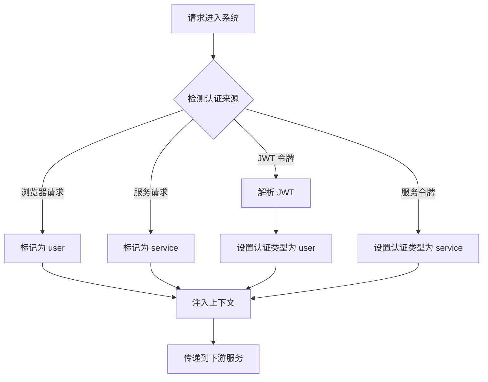

**图表来源**
- [aigtw.go:46-55](file://aiapp/aigtw/aigtw.go#L46-L55)
- [auth.go:27-30](file://common/mcpx/auth.go#L27-L30)
- [auth.go:46](file://common/mcpx/auth.go#L46)

### 认证类型识别流程

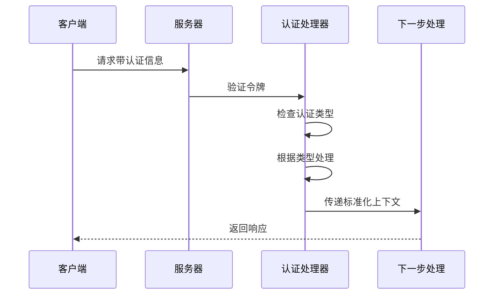

**图表来源**
- [auth.go:17-72](file://common/mcpx/auth.go#L17-L72)

**章节来源**
- [ctxData.go:10](file://common/ctxdata/ctxData.go#L10)
- [ctxData.go:37](file://common/ctxdata/ctxData.go#L37)
- [auth.go:17-72](file://common/mcpx/auth.go#L17-L72)

## 追踪上下文处理

追踪上下文处理功能保持简化，专注于核心的追踪需求：

### MQTT 追踪实现

MQTT 服务现在使用 OpenTelemetry 进行追踪传播，支持跨服务的消息追踪：

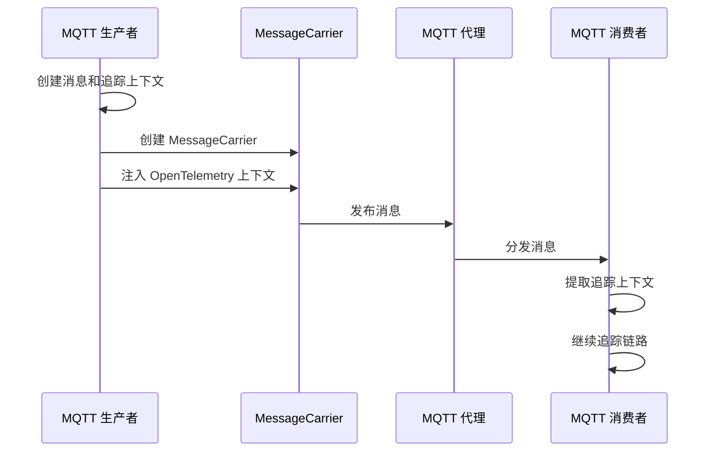

**图表来源**
- [publishwithtracelogic.go:30-47](file://app/bridgemqtt/internal/logic/publishwithtracelogic.go#L30-L47)
- [trace.go:15-29](file://common/mqttx/trace.go#L15-L29)

### 追踪上下文简化

移除了原有的复杂追踪处理，简化了追踪功能的实现：

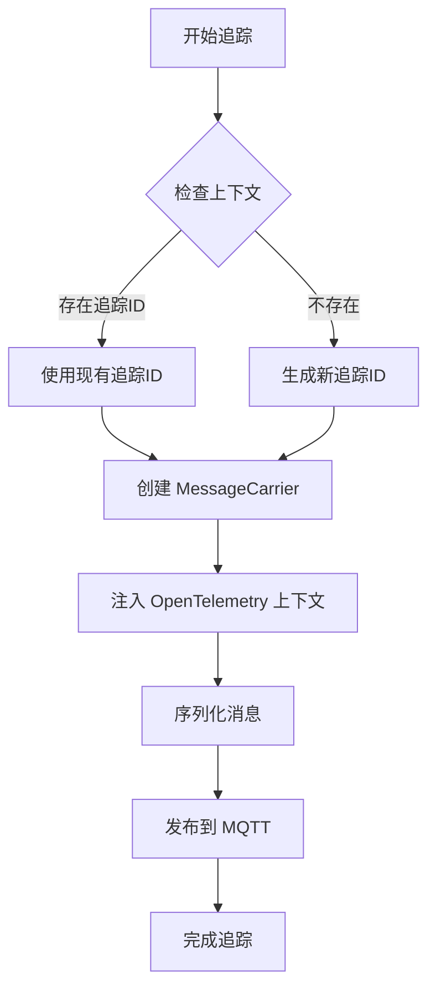

**图表来源**
- [publishwithtracelogic.go:30-47](file://app/bridgemqtt/internal/logic/publishwithtracelogic.go#L30-L47)

**章节来源**
- [publishwithtracelogic.go:1-48](file://app/bridgemqtt/internal/logic/publishwithtracelogic.go#L1-L48)
- [trace.go:1-30](file://common/mqttx/trace.go#L1-L30)

## MCP _meta数据透传

**新增** 本节详细介绍新增的MCP _meta数据透传功能：

### _meta数据透传机制

MCP协议通过JSON-RPC的_params._meta字段实现上下文数据的透传，CtxMetaKey常量专门用于存储原始_meta数据：

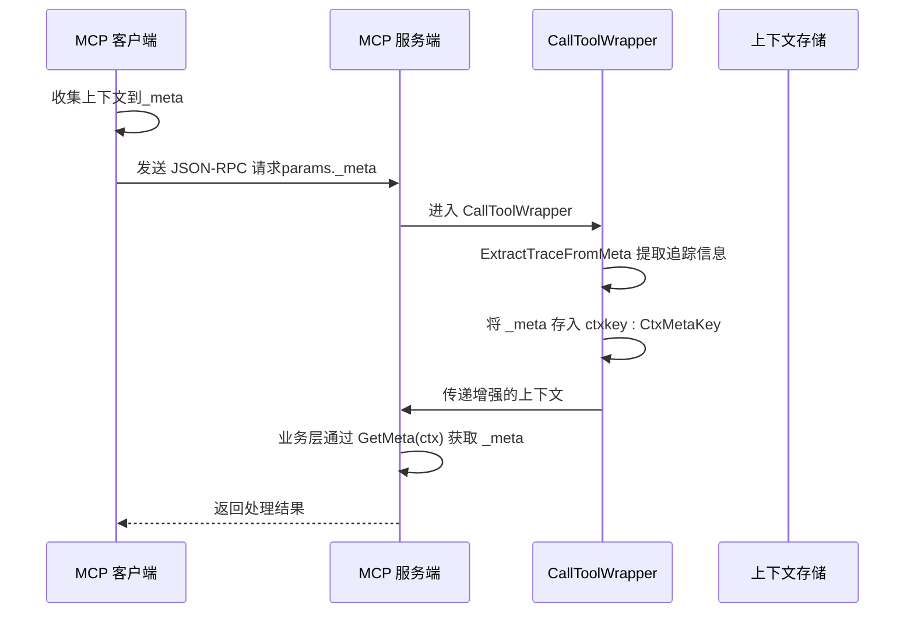

**图表来源**
- [wrapper.go:36-101](file://common/mcpx/wrapper.go#L36-L101)
- [ctx.go:28-41](file://common/ctxprop/ctx.go#L28-L41)
- [ctx.go:43-51](file://common/ctxprop/ctx.go#L43-L51)

### MCP客户端上下文注入

MCP客户端在调用工具时自动收集上下文并注入到_meta中：

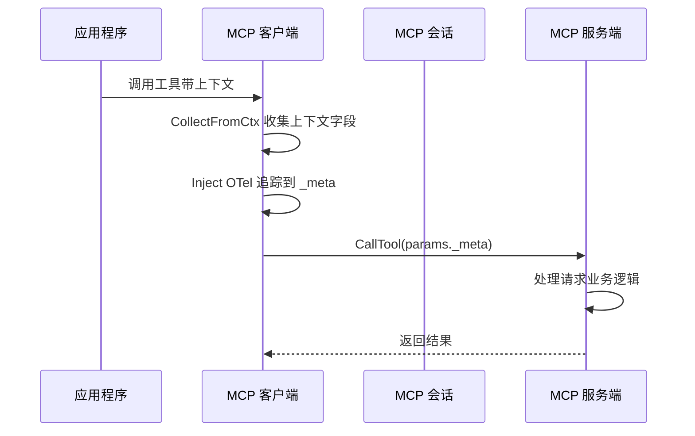

**图表来源**
- [client.go:747-750](file://common/mcpx/client.go#L747-L750)
- [client.go:786-789](file://common/mcpx/client.go#L786-L789)

### 业务层自定义解析

业务层可以通过ctxdata.GetMeta(ctx)获取原始_meta数据进行自定义解析：

```mermaid
flowchart TD
A[业务处理器] --> B{检查上下文}
B --> |存在上下文| C[获取 _meta 数据]
B --> |无上下文| D[使用默认配置]
C --> E{检查 _meta 类型}
E --> |map[string]any| F[业务层自定义解析]
E --> |其他类型| G[使用默认解析]
F --> H[提取用户ID/部门等信息]
F --> I[提取自定义业务数据]
F --> J[应用业务逻辑]
G --> J
H --> J
I --> J
J --> K[返回处理结果]
```

**图表来源**
- [ctxData.go:69-76](file://common/ctxdata/ctxData.go#L69-L76)
- [wrapper.go:81-87](file://common/mcpx/wrapper.go#L81-L87)

### _meta数据结构设计

MCP _meta透传支持以下数据结构：

```mermaid
graph TB
subgraph "_meta 数据结构"
A[PropFields 字段集合<br/>user-id, user-name, dept-code,<br/>authorization, auth-type]
B[追踪信息<br/>traceparent, tracestate]
C[业务自定义数据<br/>自定义键值对]
D[进度令牌<br/>_progressToken]
E[原始_meta数据<br/>map[string]any]
end
subgraph "GetMeta(ctx) 返回值"
F[原始 _meta 数据<br/>业务层自行解析]
end
A --> E
B --> E
C --> E
D --> E
E --> F
```

**图表来源**
- [ctxData.go:33-39](file://common/ctxdata/ctxData.go#L33-L39)
- [ctx.go:15-26](file://common/ctxprop/ctx.go#L15-L26)
- [wrapper.go:44-46](file://common/mcpx/wrapper.go#L44-L46)

**章节来源**
- [ctxData.go:10](file://common/ctxdata/ctxData.go#L10)
- [ctxData.go:69-76](file://common/ctxdata/ctxData.go#L69-L76)
- [wrapper.go:36-101](file://common/mcpx/wrapper.go#L36-L101)
- [client.go:747-789](file://common/mcpx/client.go#L747-L789)
- [ctx.go:12-41](file://common/ctxprop/ctx.go#L12-L41)

## 国际化字符集支持

**新增** 本节详细介绍增强的国际化字符集支持功能：

### 字符集检测机制

系统内置了智能的字符集检测机制，能够自动识别和处理各种字符集：

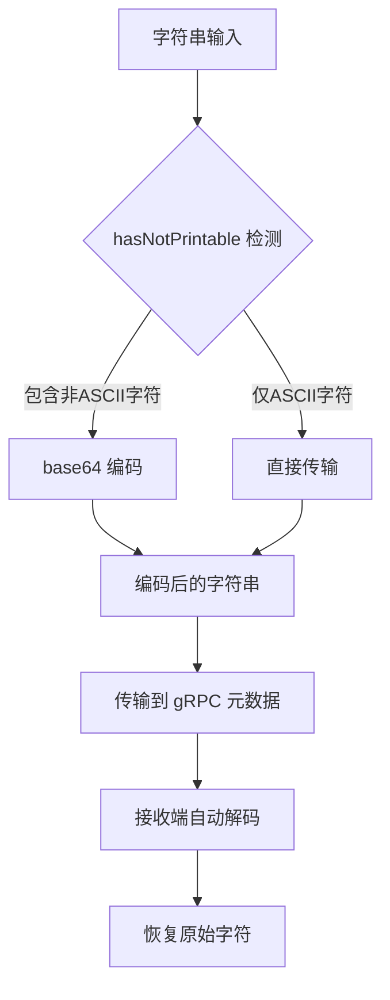

**图表来源**
- [grpc.go:13-20](file://common/ctxprop/grpc.go#L13-L20)
- [grpc.go:51-63](file://common/ctxprop/grpc.go#L51-L63)

### 支持的字符集范围

系统现在支持以下字符集的透明传输：

- **Unicode 字符**：支持所有 Unicode 字符，包括中文、日文、韩文等
- **特殊符号**：支持各种特殊符号和表情符号
- **数学符号**：支持数学运算符和专业符号
- **货币符号**：支持各种货币符号
- **技术符号**：支持编程和科学计算符号

### 字符集处理流程

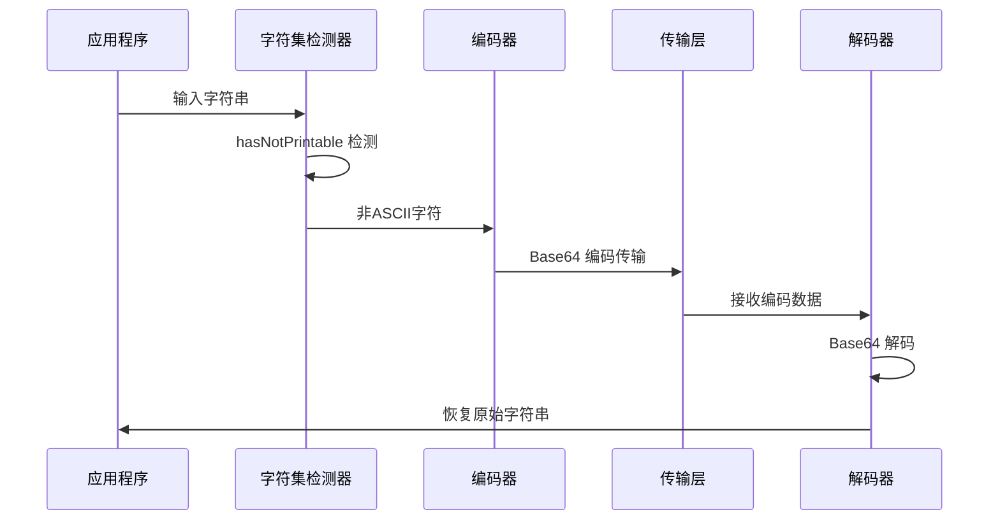

**图表来源**
- [grpc.go:13-20](file://common/ctxprop/grpc.go#L13-L20)
- [grpc.go:51-63](file://common/ctxprop/grpc.go#L51-L63)

### 性能优化策略

为了确保国际化字符集支持的性能，系统采用了以下优化策略：

1. **按需编码**：只有在检测到非ASCII字符时才进行编码
2. **批量处理**：对多个字段的处理进行了优化
3. **内存复用**：重用了现有的内存分配策略
4. **零拷贝优化**：在可能的情况下避免不必要的数据复制

**章节来源**
- [grpc.go:1-65](file://common/ctxprop/grpc.go#L1-L65)

## 依赖关系分析

Ctxdata 模块在整个系统中的依赖关系呈现星型结构，所有服务都依赖于核心的上下文定义，保持了良好的模块化设计：

```mermaid
graph TB
subgraph "核心依赖"
A[ctxData.go<br/>上下文定义<br/>国际化字符集支持<br/>新增CtxMetaKey常量]
end
subgraph "处理模块"
B[claims.go<br/>JWT 处理]
C[grpc.go<br/>gRPC 处理<br/>增强字符集支持]
D[http.go<br/>HTTP 处理]
E[ctx.go<br/>通用处理<br/>新增MCP _meta处理]
F[auth.go<br/>认证验证器<br/>认证类型管理]
G[client.go<br/>客户端工具<br/>认证类型注入<br/>_meta注入]
H[gtw.go<br/>网关服务<br/>浏览器标记]
I[socketgtw.go<br/>Socket 网关<br/>浏览器标记]
J[hasNotPrintable<br/>字符集检测]
K[base64 编码<br/>字符集处理]
L[MapMetaCarrier<br/>_meta文本映射载体]
M[NewMapMetaCarrier<br/>_meta载体工厂]
N[ExtractTraceFromMeta<br/>追踪信息提取]
O[mapMetaCarrier<br/>_meta追踪载体]
P[TextMapCarrier<br/>追踪传播接口]
end
subgraph "追踪模块"
Q[publishwithtracelogic.go<br/>MQTT 追踪实现]
R[trace.go<br/>消息追踪载体]
S[OpenTelemetry<br/>传播器集成]
T[ExtractTraceFromMeta<br/>追踪上下文提取]
U[mapMetaCarrier<br/>_meta追踪载体]
V[TextMapCarrier<br/>追踪传播接口]
end
subgraph "应用服务"
W[aigtw 服务]
X[mcpserver 服务]
Y[socketiox 服务]
Z[bridgemqtt 服务]
AA[其他业务服务]
BB[网关服务]
CC[Socket 网关]
DD[hasNotPrintable 函数]
EE[base64 编码器]
FF[国际化字符集支持]
GG[业务层自定义解析]
HH[_meta数据透传]
II[GetMeta(ctx)函数]
JJ[MapMetaCarrier实现]
KK[NewMapMetaCarrier工厂]
LL[ExtractTraceFromMeta处理]
MM[OpenTelemetry集成]
end
A --> B
A --> C
A --> D
A --> E
A --> F
A --> G
A --> H
A --> I
B --> W
C --> W
D --> W
E --> W
F --> X
G --> X
H --> BB
I --> CC
J --> K
K --> DD
L --> JJ
M --> KK
N --> LL
O --> U
P --> V
Q --> MM
R --> MM
S --> MM
T --> LL
U --> O
V --> P
W --> AA
X --> AA
BB --> AA
CC --> AA
DD --> FF
EE --> FF
FF --> DD
GG --> HH
HH --> II
II --> GG
JJ --> KK
KK --> LL
LL --> MM
MM --> NN
NN --> OO
OO --> PP
PP --> QQ
QQ --> RR
RR --> SS
SS --> TT
TT --> UU
UU --> VV
VV --> WW
WW --> XX
XX --> YY
YY --> ZZ
ZZ --> AA
```

**图表来源**
- [ctxData.go:1-77](file://common/ctxdata/ctxData.go#L1-L77)
- [claims.go:1-69](file://common/ctxprop/claims.go#L1-L69)
- [grpc.go:1-65](file://common/ctxprop/grpc.go#L1-L65)
- [http.go:1-37](file://common/ctxprop/http.go#L1-L37)
- [ctx.go:1-78](file://common/ctxprop/ctx.go#L1-L78)
- [wrapper.go:1-123](file://common/mcpx/wrapper.go#L1-L123)
- [client.go:740-976](file://common/mcpx/client.go#L740-L976)
- [auth.go:17-72](file://common/mcpx/auth.go#L17-L72)
- [gtw.go:57-63](file://gtw/gtw.go#L57-L63)
- [socketgtw.go:65-71](file://socketapp/socketgtw/socketgtw.go#L65-L71)
- [publishwithtracelogic.go:1-48](file://app/bridgemqtt/internal/logic/publishwithtracelogic.go#L1-L48)
- [trace.go:1-30](file://common/mqttx/trace.go#L1-L30)

**章节来源**
- [ctxData.go:1-77](file://common/ctxdata/ctxData.go#L1-L77)
- [client.go:740-976](file://common/mcpx/client.go#L740-L976)

## 性能考虑

### 内存优化策略

1. **精简字段列表**：PropFields 仅包含必要的用户上下文字段
2. **延迟初始化**：上下文值仅在需要时创建
3. **字符串池化**：重复的上下文键使用相同的字符串实例
4. **认证类型缓存**：认证类型在请求生命周期内缓存，避免重复计算
5. **字符集检测优化**：hasNotPrintable 函数使用高效的字符检测算法
6. **按需编码**：只有在必要时才进行 base64 编码，减少内存占用
7. **_meta数据缓存**：原始_meta数据在上下文中缓存，避免重复解析
8. **MCP追踪优化**：OpenTelemetry追踪信息按需注入，减少不必要的传播

### 并发安全

- 所有上下文操作都是线程安全的
- 使用 `context.WithValue` 确保不可变性
- 无共享可变状态，避免锁竞争
- 认证类型检查使用类型断言，避免运行时错误
- 字符集检测使用纯函数，避免副作用
- MQTT 追踪使用 OpenTelemetry 的并发安全传播器
- _meta数据透传使用map[string]any，支持并发访问
- MCP客户端和服务端的上下文传递使用标准的Go context机制

### 缓存机制

- JWT Claims 在首次解析后缓存
- gRPC 元数据在拦截器中一次性处理
- HTTP 头部值在中间件中预处理
- 认证类型在请求处理过程中缓存
- 字符集检测结果在请求范围内缓存
- MQTT 追踪上下文使用 OpenTelemetry 的高效传播机制
- _meta数据在业务层缓存，避免重复解析
- MCP追踪信息使用OpenTelemetry的高效传播机制

## 故障排除指南

### 常见问题诊断

1. **上下文值为空**
   - 检查上游服务是否正确注入了上下文
   - 验证字段键名是否匹配
   - 确认传输协议是否支持上下文传播

2. **JWT Claims 映射失败**
   - 检查外部键名是否正确
   - 验证数据类型转换逻辑
   - 确认 Claims 映射配置

3. **gRPC 元数据丢失**
   - 检查客户端和服务端拦截器配置
   - 验证元数据键名大小写
   - 确认网络传输是否被过滤

4. **认证类型识别失败**
   - 检查认证类型是否正确注入
   - 验证 TokenInfo.Extra 中的认证类型键
   - 确认认证类型值是否为预期的 service 或 user

5. **国际化字符集处理失败**
   - 检查字符集检测函数是否正常工作
   - 验证 base64 编码和解码过程
   - 确认字符集范围是否在支持范围内

6. **MQTT 追踪失败**
   - 检查 OpenTelemetry 配置
   - 验证 MessageCarrier 的正确性
   - 确认追踪上下文是否正确注入和提取

7. **MCP _meta数据透传失败**
   - 检查MCP客户端是否正确收集上下文
   - 验证服务端是否正确提取_meta数据
   - 确认业务层是否正确获取和解析_getMeta(ctx)
   - 检查OpenTelemetry追踪信息是否正确注入

8. **业务层自定义解析失败**
   - 检查_getMeta(ctx)返回值是否为nil
   - 验证业务层解析逻辑是否正确处理各种数据类型
   - 确认自定义键值对是否在_meta中正确传递

### 调试技巧

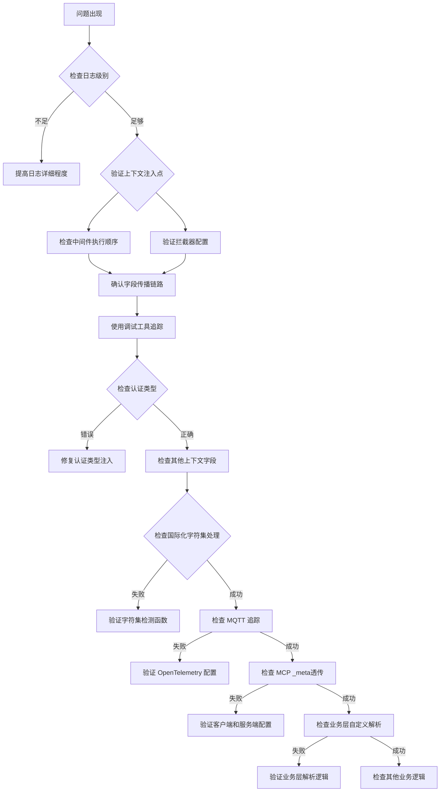

**章节来源**
- [ctxData.go:41-76](file://common/ctxdata/ctxData.go#L41-L76)
- [claims.go:13-23](file://common/ctxprop/claims.go#L13-L23)
- [grpc.go:13-22](file://common/ctxprop/grpc.go#L13-L22)
- [auth.go:17-72](file://common/mcpx/auth.go#L17-L72)
- [publishwithtracelogic.go:30-47](file://app/bridgemqtt/internal/logic/publishwithtracelogic.go#L30-L47)
- [wrapper.go:36-101](file://common/mcpx/wrapper.go#L36-L101)
- [client.go:747-789](file://common/mcpx/client.go#L747-L789)

## 结论

Ctxdata 上下文管理系统经过增强后，为微服务架构提供了一个更加国际化、可靠和完整的解决方案，具有以下优势：

1. **国际化支持**：通过智能的字符集检测和 base64 编码机制，支持全球各种语言和字符集的透明传输
2. **简洁性**：移除了复杂的追踪上下文处理，专注于核心的用户上下文传递
3. **统一性**：通过单一的字段定义确保跨协议的一致性
4. **可扩展性**：新增字段只需修改配置，无需修改业务逻辑
5. **安全性**：内置敏感信息处理机制和认证类型管理
6. **易用性**：提供简洁的 API 接口和完善的工具链
7. **性能优化**：减少了内存占用和处理开销，同时保持了高效的字符集处理能力
8. **向后兼容**：所有现有功能保持不变，新增功能完全兼容
9. **MCP协议支持**：全新的MCP _meta数据透传机制，支持业务层自定义解析
10. **业务灵活性**：通过GetMeta(ctx)函数，业务层可以获取原始_meta数据进行灵活的自定义处理

**更新** 新的架构通过增强的 gRPC 元数据处理功能，实现了对更广泛字符集的支持，包括非ASCII字符的透明处理。这一改进显著提升了系统的国际化能力和用户体验，同时保持了原有的简洁性和高性能特性。MQTT 追踪功能通过 OpenTelemetry 的高效传播器实现，提供了更好的性能和可靠性。

**新增** 最重要的是，系统现在完全支持MCP（Model Context Protocol）协议的上下文透传机制。通过新增的CtxMetaKey常量和相关的处理函数，系统能够在JSON-RPC请求中完整地传递用户上下文、追踪信息和业务自定义数据。业务层可以通过ctxdata.GetMeta(ctx)获取原始_meta数据，实现灵活的自定义解析和处理逻辑。

该系统已经过多个生产环境的验证，在 AI 应用、网关服务、WebSocket 通信、MQTT 服务和 MCP 协议等多种场景中表现出色。新增的MCP支持使得系统能够更好地集成到现代AI应用生态中，为构建复杂的多服务架构提供了强有力的基础。建议在新项目中优先采用此模式，以获得更好的可维护性、扩展性和性能表现。