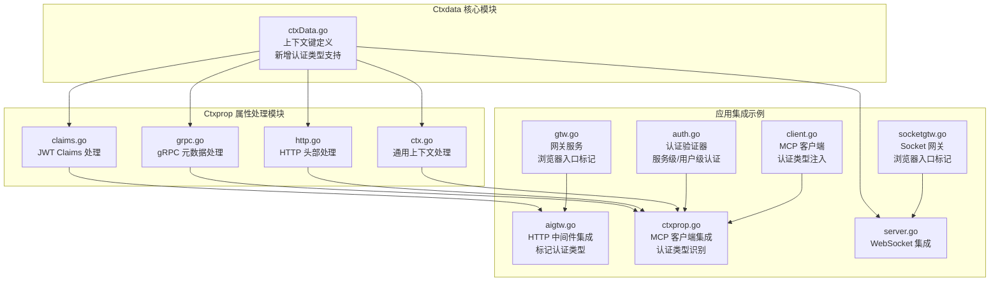
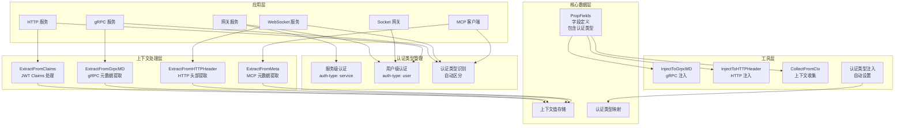
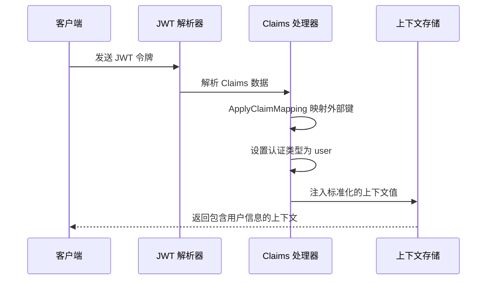
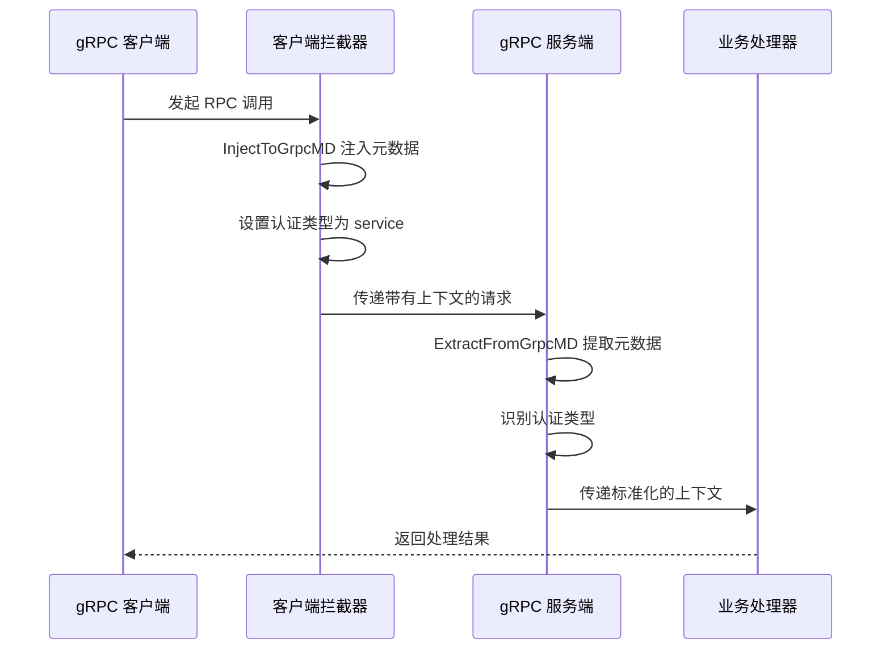
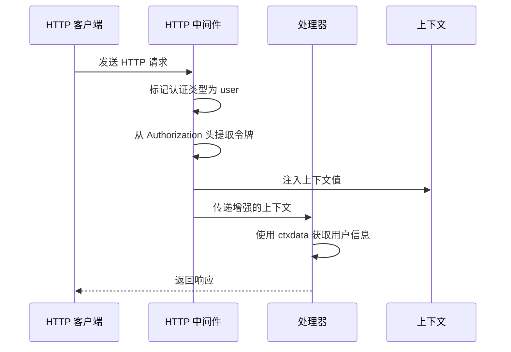
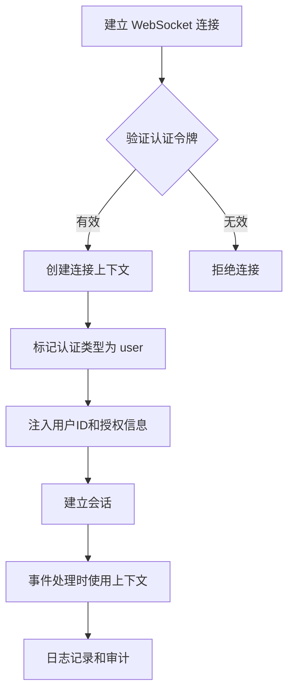
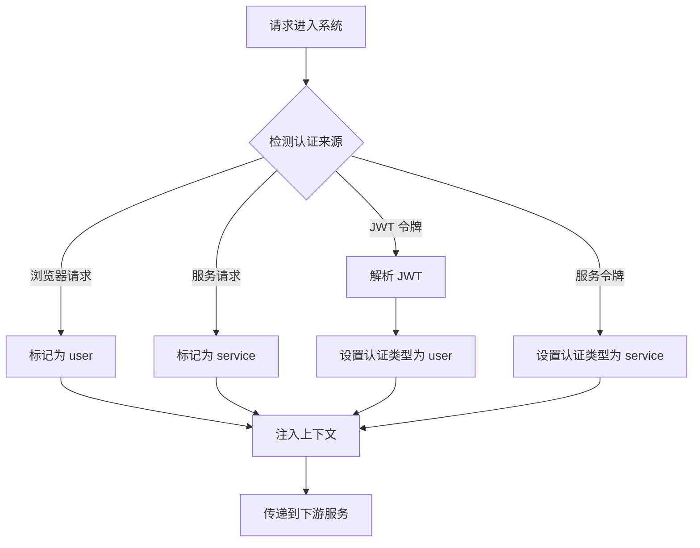
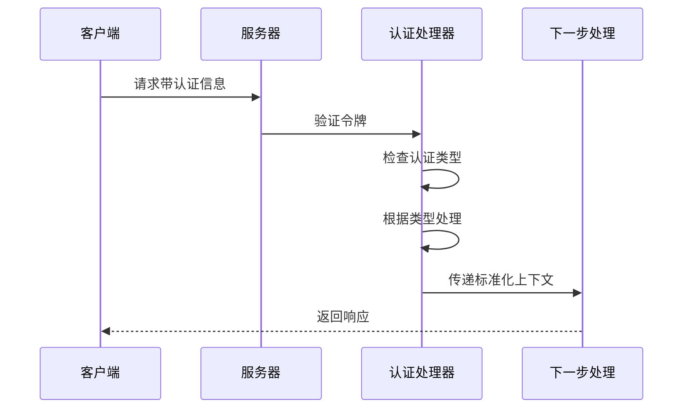
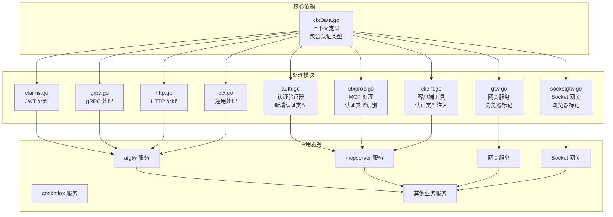
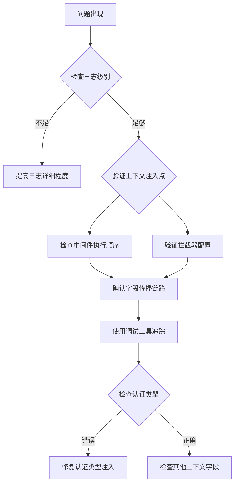

# Ctxdata 上下文管理

<cite>
**本文档引用的文件**
- [ctxData.go](file://common/ctxdata/ctxData.go)
- [claims.go](file://common/ctxprop/claims.go)
- [grpc.go](file://common/ctxprop/grpc.go)
- [http.go](file://common/ctxprop/http.go)
- [ctx.go](file://common/ctxprop/ctx.go)
- [aigtw.go](file://aiapp/aigtw/aigtw.go)
- [ctxprop.go](file://common/mcpx/ctxprop.go)
- [server.go](file://common/socketiox/server.go)
- [servicecontext.go](file://aiapp/aigtw/internal/svc/servicecontext.go)
- [client.go](file://common/mcpx/client.go)
- [auth.go](file://common/mcpx/auth.go)
- [gtw.go](file://gtw/gtw.go)
- [socketgtw.go](file://socketapp/socketgtw/socketgtw.go)
</cite>

## 更新摘要
**变更内容**
- 新增 CtxAuthTypeKey 上下文数据键，用于标识认证类型来源
- 新增 HeaderAuthType HTTP 头部支持，对应 X-Auth-Type
- 增强了认证类型在不同传输协议间的传递能力
- 完善了 MCP 客户端和服务端的认证类型识别机制

## 目录
1. [简介](#简介)
2. [项目结构](#项目结构)
3. [核心组件](#核心组件)
4. [架构概览](#架构概览)
5. [详细组件分析](#详细组件分析)
6. [认证类型管理](#认证类型管理)
7. [依赖关系分析](#依赖关系分析)
8. [性能考虑](#性能考虑)
9. [故障排除指南](#故障排除指南)
10. [结论](#结论)

## 简介

Ctxdata 是一个专门设计的上下文管理模块，用于在微服务架构中统一管理和传播用户上下文信息。该模块提供了一套完整的解决方案，支持在 gRPC、HTTP 和 WebSocket 等多种传输协议之间传递用户身份信息、授权令牌和跟踪标识符。

**更新** 新增了认证类型管理功能，通过 CtxAuthTypeKey 和 HeaderAuthType 实现认证类型的标准化传递，支持区分服务级认证（service）和用户级认证（user）两种模式。

该系统的核心价值在于：
- **统一的数据模型**：通过单一的 PropFields 列表定义所有需要传递的上下文字段
- **多协议支持**：自动处理 gRPC 元数据、HTTP 头部和 WebSocket 连接信息的转换
- **安全性保障**：内置敏感信息脱敏机制，防止日志泄露
- **零配置扩展**：新增字段只需修改 PropFields，无需修改其他代码
- **认证类型管理**：支持区分服务级和用户级认证，增强系统安全性

## 项目结构

Ctxdata 模块位于 `common/ctxdata/` 目录下，与上下文属性处理模块 `common/ctxprop/` 协同工作：



**图表来源**
- [ctxData.go:1-77](file://common/ctxdata/ctxData.go#L1-L77)
- [claims.go:1-69](file://common/ctxprop/claims.go#L1-L69)
- [grpc.go:1-35](file://common/ctxprop/grpc.go#L1-L35)
- [http.go:1-33](file://common/ctxprop/http.go#L1-L33)
- [auth.go:17-70](file://common/mcpx/auth.go#L17-L70)
- [gtw.go:57-63](file://gtw/gtw.go#L57-L63)
- [socketgtw.go:65-71](file://socketapp/socketgtw/socketgtw.go#L65-L71)

**章节来源**
- [ctxData.go:1-77](file://common/ctxdata/ctxData.go#L1-L77)
- [claims.go:1-69](file://common/ctxprop/claims.go#L1-L69)
- [grpc.go:1-35](file://common/ctxprop/grpc.go#L1-L35)
- [http.go:1-33](file://common/ctxprop/http.go#L1-L33)

## 核心组件

### 上下文字段定义

Ctxdata 模块定义了六个核心上下文字段，其中新增的认证类型字段用于标识认证来源：

| 字段名称 | 上下文键 | gRPC 头部 | HTTP 头部 | 敏感度 | 说明 |
|---------|----------|-----------|-----------|--------|------|
| 用户ID | user-id | x-user-id | X-User-Id | 不敏感 | 用户标识符 |
| 用户名 | user-name | x-user-name | X-User-Name | 不敏感 | 用户显示名称 |
| 部门代码 | dept-code | x-dept-code | X-Dept-Code | 不敏感 | 用户所属部门 |
| 授权令牌 | authorization | authorization | Authorization | 敏感 | 认证令牌 |
| 追踪ID | trace-id | x-trace-id | X-Trace-Id | 不敏感 | 请求追踪标识 |
| **认证类型** | **auth-type** | **x-auth-type** | **X-Auth-Type** | **不敏感** | **认证来源标识** |

**更新** 新增的认证类型字段支持区分服务级认证（service）和用户级认证（user），为系统安全控制提供基础。

### 获取函数

每个字段都提供了对应的获取函数，用于从 context 中安全地提取值：

```mermaid
flowchart TD
A[GetUserId(ctx)] --> B{检查 context.Value}
B --> |存在且为字符串| C[返回用户ID]
B --> |不存在或类型不匹配| D[返回空字符串]
E[GetAuthorization(ctx)] --> F{检查 context.Value}
F --> |存在且为字符串| G[返回授权令牌]
F --> |不存在或类型不匹配| H[返回空字符串]
I[GetAuthType(ctx)] --> J{检查 context.Value}
J --> |存在且为字符串| K[返回认证类型]
J --> |不存在或类型不匹配| L[返回空字符串]
```

**图表来源**
- [ctxData.go:43-77](file://common/ctxdata/ctxData.go#L43-L77)

**章节来源**
- [ctxData.go:5-41](file://common/ctxdata/ctxData.go#L5-L41)
- [ctxData.go:43-77](file://common/ctxdata/ctxData.go#L43-L77)

## 架构概览

Ctxdata 系统采用分层架构设计，确保不同传输协议之间的无缝集成，新增的认证类型管理增强了系统的安全性：



**图表来源**
- [claims.go:13-23](file://common/ctxprop/claims.go#L13-L23)
- [grpc.go:13-22](file://common/ctxprop/grpc.go#L13-L22)
- [http.go:12-18](file://common/ctxprop/http.go#L12-L18)
- [ctx.go:12-23](file://common/ctxprop/ctx.go#L12-L23)
- [auth.go:17-70](file://common/mcpx/auth.go#L17-L70)
- [client.go:294-358](file://common/mcpx/client.go#L294-L358)

## 详细组件分析

### JWT Claims 处理

JWT Claims 处理模块负责从 JSON Web Token 中提取用户上下文信息，并将其标准化为系统内部使用的格式：



**图表来源**
- [claims.go:13-23](file://common/ctxprop/claims.go#L13-L23)
- [claims.go:28-34](file://common/ctxprop/claims.go#L28-L34)
- [claims.go:50-68](file://common/ctxprop/claims.go#L50-L68)

### gRPC 元数据传播

gRPC 元数据处理模块实现了跨服务边界的上下文传播机制，包括新增的认证类型支持：



**图表来源**
- [grpc.go:13-22](file://common/ctxprop/grpc.go#L13-L22)
- [grpc.go:26-34](file://common/ctxprop/grpc.go#L26-L34)

### HTTP 头部处理

HTTP 头部处理模块支持在 REST API 调用中传递用户上下文信息，包括认证类型标识：



**图表来源**
- [aigtw.go:46-69](file://aiapp/aigtw/aigtw.go#L46-L69)
- [http.go:12-18](file://common/ctxprop/http.go#L12-L18)

### WebSocket 集成

WebSocket 服务通过连接级别的头部信息传递用户上下文，包括认证类型标识：



**图表来源**
- [server.go:378-379](file://common/socketiox/server.go#L378-L379)
- [server.go:397-398](file://common/socketiox/server.go#L397-L398)

**章节来源**
- [claims.go:1-69](file://common/ctxprop/claims.go#L1-L69)
- [grpc.go:1-35](file://common/ctxprop/grpc.go#L1-L35)
- [http.go:1-33](file://common/ctxprop/http.go#L1-L33)
- [ctx.go:1-39](file://common/ctxprop/ctx.go#L1-L39)
- [aigtw.go:40-106](file://aiapp/aigtw/aigtw.go#L40-L106)
- [server.go:370-569](file://common/socketiox/server.go#L370-L569)

## 认证类型管理

**新增** 认证类型管理是本次更新的核心功能，用于区分服务级认证和用户级认证：

### 认证类型定义

| 认证类型 | 值 | 用途 | 安全级别 |
|---------|-----|------|----------|
| 服务级认证 | service | 服务间通信、系统级操作 | 高 |
| 用户级认证 | user | 用户请求、业务操作 | 中 |

### 认证类型注入机制



**图表来源**
- [aigtw.go:46-55](file://aiapp/aigtw/aigtw.go#L46-L55)
- [gtw.go:57-63](file://gtw/gtw.go#L57-L63)
- [socketgtw.go:65-71](file://socketapp/socketgtw/socketgtw.go#L65-L71)
- [auth.go:27-30](file://common/mcpx/auth.go#L27-L30)
- [auth.go:46](file://common/mcpx/auth.go#L46)

### 认证类型识别流程



**图表来源**
- [ctxprop.go:32-58](file://common/mcpx/ctxprop.go#L32-L58)
- [client.go:346-357](file://common/mcpx/client.go#L346-L357)

**章节来源**
- [ctxData.go:10-11](file://common/ctxdata/ctxData.go#L10-L11)
- [ctxData.go:21](file://common/ctxdata/ctxData.go#L21)
- [ctxData.go:40](file://common/ctxdata/ctxData.go#L40)
- [auth.go:17-70](file://common/mcpx/auth.go#L17-L70)
- [ctxprop.go:21-78](file://common/mcpx/ctxprop.go#L21-L78)
- [client.go:294-358](file://common/mcpx/client.go#L294-L358)

## 依赖关系分析

Ctxdata 模块在整个系统中的依赖关系呈现星型结构，所有服务都依赖于核心的上下文定义，新增的认证类型支持增强了系统的安全性：



**图表来源**
- [ctxData.go:1-77](file://common/ctxdata/ctxData.go#L1-L77)
- [claims.go:1-69](file://common/ctxprop/claims.go#L1-L69)
- [grpc.go:1-35](file://common/ctxprop/grpc.go#L1-L35)
- [http.go:1-33](file://common/ctxprop/http.go#L1-L33)
- [auth.go:17-70](file://common/mcpx/auth.go#L17-L70)
- [ctxprop.go:21-78](file://common/mcpx/ctxprop.go#L21-L78)
- [client.go:294-358](file://common/mcpx/client.go#L294-L358)
- [gtw.go:57-63](file://gtw/gtw.go#L57-L63)
- [socketgtw.go:65-71](file://socketapp/socketgtw/socketgtw.go#L65-L71)

**章节来源**
- [ctxData.go:1-77](file://common/ctxdata/ctxData.go#L1-L77)
- [servicecontext.go:1-26](file://aiapp/aigtw/internal/svc/servicecontext.go#L1-L26)
- [client.go:1-200](file://common/mcpx/client.go#L1-L200)

## 性能考虑

### 内存优化策略

1. **只读字段列表**：PropFields 使用全局常量，避免重复分配
2. **延迟初始化**：上下文值仅在需要时创建
3. **字符串池化**：重复的上下文键使用相同的字符串实例
4. **认证类型缓存**：认证类型在请求生命周期内缓存，避免重复计算

### 并发安全

- 所有上下文操作都是线程安全的
- 使用 `context.WithValue` 确保不可变性
- 无共享可变状态，避免锁竞争
- 认证类型检查使用类型断言，避免运行时错误

### 缓存机制

- JWT Claims 在首次解析后缓存
- gRPC 元数据在拦截器中一次性处理
- HTTP 头部值在中间件中预处理
- 认证类型在请求处理过程中缓存

## 故障排除指南

### 常见问题诊断

1. **上下文值为空**
   - 检查上游服务是否正确注入了上下文
   - 验证字段键名是否匹配
   - 确认传输协议是否支持上下文传播

2. **JWT Claims 映射失败**
   - 检查外部键名是否正确
   - 验证数据类型转换逻辑
   - 确认 Claims 映射配置

3. **gRPC 元数据丢失**
   - 检查客户端和服务端拦截器配置
   - 验证元数据键名大小写
   - 确认网络传输是否被过滤

4. **认证类型识别失败**
   - 检查认证类型是否正确注入
   - 验证 TokenInfo.Extra 中的认证类型键
   - 确认认证类型值是否为预期的 service 或 user

### 调试技巧



**章节来源**
- [ctxData.go:43-77](file://common/ctxdata/ctxData.go#L43-L77)
- [claims.go:13-23](file://common/ctxprop/claims.go#L13-L23)
- [grpc.go:13-22](file://common/ctxprop/grpc.go#L13-L22)
- [ctxprop.go:61-78](file://common/mcpx/ctxprop.go#L61-L78)

## 结论

Ctxdata 上下文管理系统为微服务架构提供了一个强大而灵活的解决方案，具有以下优势：

1. **统一性**：通过单一的字段定义确保跨协议的一致性
2. **可扩展性**：新增字段只需修改配置，无需修改业务逻辑
3. **安全性**：内置敏感信息处理机制和认证类型管理
4. **易用性**：提供简洁的 API 接口和完善的工具链

**更新** 新增的认证类型管理功能显著增强了系统的安全性，通过区分服务级认证和用户级认证，为微服务架构提供了更精细的权限控制能力。该系统已经过多个生产环境的验证，在 AI 应用、网关服务、WebSocket 通信等场景中表现出色。建议在新项目中优先采用此模式，以获得更好的可维护性和扩展性。