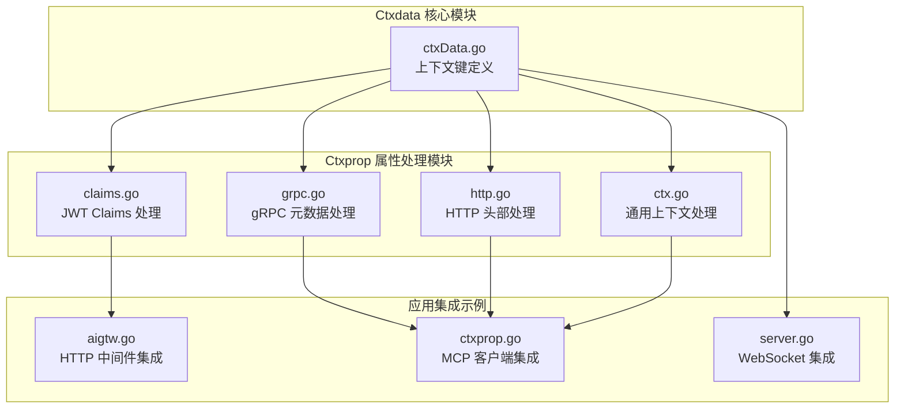
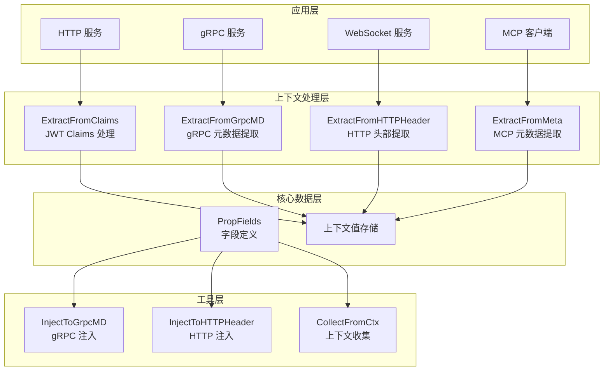
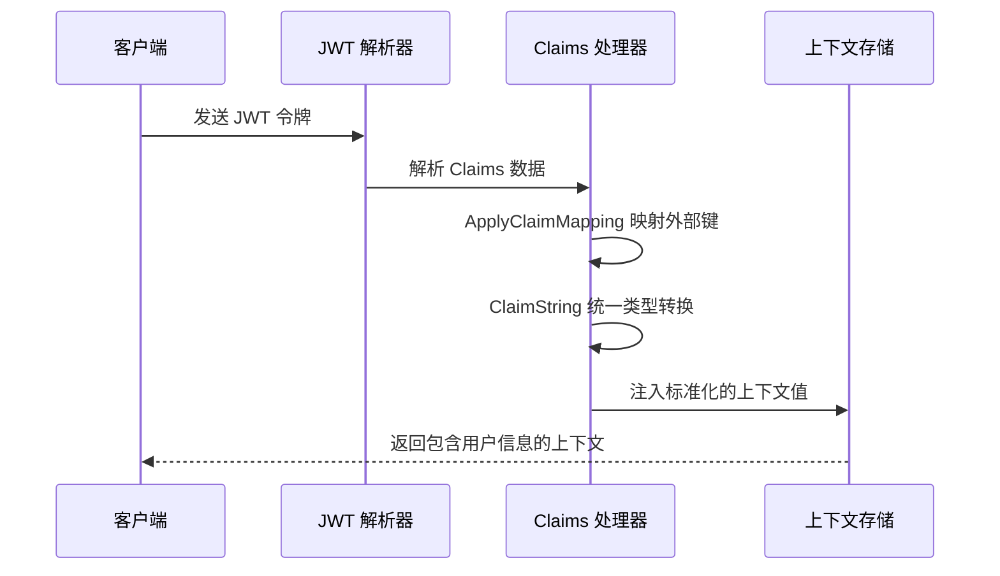
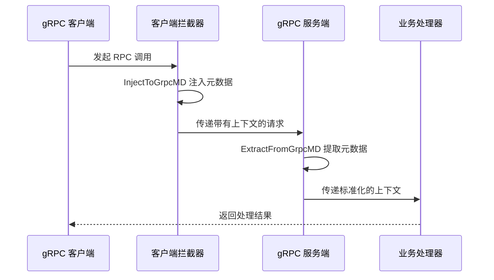
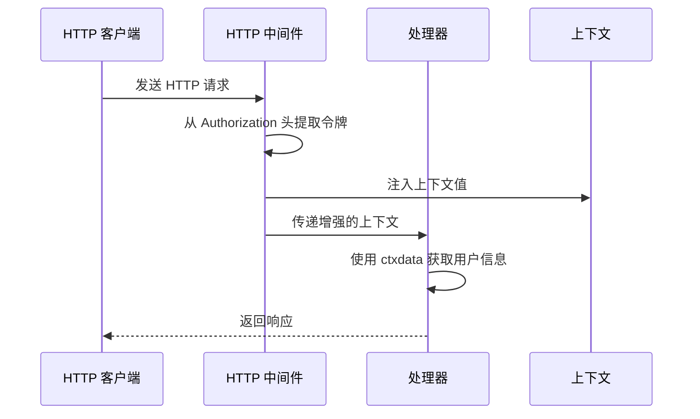
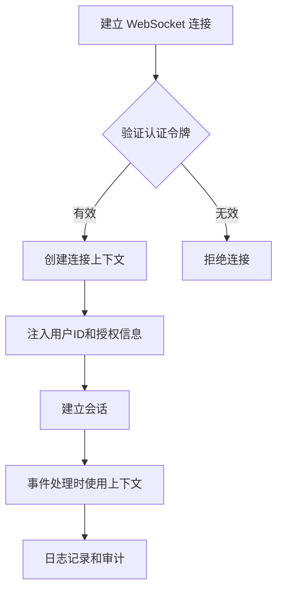
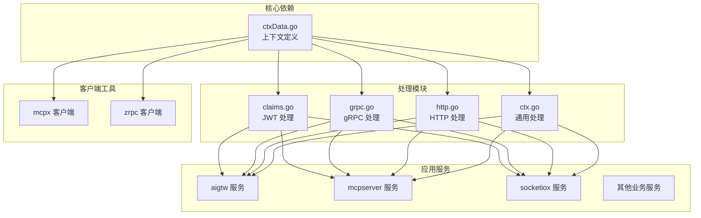
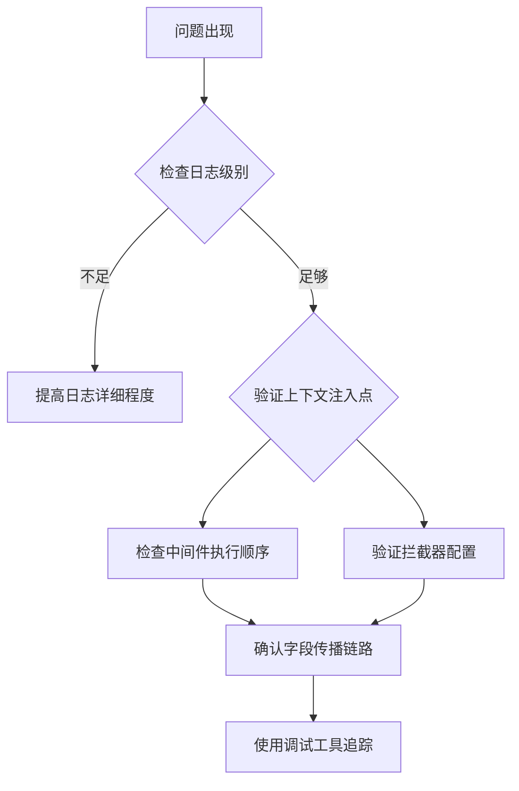

# Ctxdata 上下文管理

<cite>
**本文档引用的文件**
- [ctxData.go](file://common/ctxdata/ctxData.go)
- [claims.go](file://common/ctxprop/claims.go)
- [grpc.go](file://common/ctxprop/grpc.go)
- [http.go](file://common/ctxprop/http.go)
- [ctx.go](file://common/ctxprop/ctx.go)
- [aigtw.go](file://aiapp/aigtw/aigtw.go)
- [ctxprop.go](file://common/mcpx/ctxprop.go)
- [server.go](file://common/socketiox/server.go)
- [servicecontext.go](file://aiapp/aigtw/internal/svc/servicecontext.go)
- [client.go](file://common/mcpx/client.go)
</cite>

## 目录
1. [简介](#简介)
2. [项目结构](#项目结构)
3. [核心组件](#核心组件)
4. [架构概览](#架构概览)
5. [详细组件分析](#详细组件分析)
6. [依赖关系分析](#依赖关系分析)
7. [性能考虑](#性能考虑)
8. [故障排除指南](#故障排除指南)
9. [结论](#结论)

## 简介

Ctxdata 是一个专门设计的上下文管理模块，用于在微服务架构中统一管理和传播用户上下文信息。该模块提供了一套完整的解决方案，支持在 gRPC、HTTP 和 WebSocket 等多种传输协议之间传递用户身份信息、授权令牌和跟踪标识符。

该系统的核心价值在于：
- **统一的数据模型**：通过单一的 PropFields 列表定义所有需要传递的上下文字段
- **多协议支持**：自动处理 gRPC 元数据、HTTP 头部和 WebSocket 连接信息的转换
- **安全性保障**：内置敏感信息脱敏机制，防止日志泄露
- **零配置扩展**：新增字段只需修改 PropFields，无需修改其他代码

## 项目结构

Ctxdata 模块位于 `common/ctxdata/` 目录下，与上下文属性处理模块 `common/ctxprop/` 协同工作：



**图表来源**
- [ctxData.go:1-74](file://common/ctxdata/ctxData.go#L1-L74)
- [claims.go:1-69](file://common/ctxprop/claims.go#L1-L69)
- [grpc.go:1-35](file://common/ctxprop/grpc.go#L1-L35)
- [http.go:1-33](file://common/ctxprop/http.go#L1-L33)

**章节来源**
- [ctxData.go:1-74](file://common/ctxdata/ctxData.go#L1-L74)
- [claims.go:1-69](file://common/ctxprop/claims.go#L1-L69)
- [grpc.go:1-35](file://common/ctxprop/grpc.go#L1-L35)
- [http.go:1-33](file://common/ctxprop/http.go#L1-L33)

## 核心组件

### 上下文字段定义

Ctxdata 模块定义了五个核心上下文字段，这些字段构成了整个系统的数据传输基础：

| 字段名称 | 上下文键 | gRPC 头部 | HTTP 头部 | 敏感度 |
|---------|----------|-----------|-----------|--------|
| 用户ID | user-id | x-user-id | X-User-Id | 不敏感 |
| 用户名 | user-name | x-user-name | X-User-Name | 不敏感 |
| 部门代码 | dept-code | x-dept-code | X-Dept-Code | 不敏感 |
| 授权令牌 | authorization | authorization | Authorization | 敏感 |
| 追踪ID | trace-id | x-trace-id | X-Trace-Id | 不敏感 |

### 获取函数

每个字段都提供了对应的获取函数，用于从 context 中安全地提取值：

```mermaid
flowchart TD
A[GetUserId(ctx)] --> B{检查 context.Value}
B --> |存在且为字符串| C[返回用户ID]
B --> |不存在或类型不匹配| D[返回空字符串]
E[GetAuthorization(ctx)] --> F{检查 context.Value}
F --> |存在且为字符串| G[返回授权令牌]
F --> |不存在或类型不匹配| H[返回空字符串]
```

**图表来源**
- [ctxData.go:40-73](file://common/ctxdata/ctxData.go#L40-L73)

**章节来源**
- [ctxData.go:5-38](file://common/ctxdata/ctxData.go#L5-L38)
- [ctxData.go:40-73](file://common/ctxdata/ctxData.go#L40-L73)

## 架构概览

Ctxdata 系统采用分层架构设计，确保不同传输协议之间的无缝集成：



**图表来源**
- [claims.go:13-23](file://common/ctxprop/claims.go#L13-L23)
- [grpc.go:13-22](file://common/ctxprop/grpc.go#L13-L22)
- [http.go:12-18](file://common/ctxprop/http.go#L12-L18)
- [ctx.go:12-23](file://common/ctxprop/ctx.go#L12-L23)

## 详细组件分析

### JWT Claims 处理

JWT Claims 处理模块负责从 JSON Web Token 中提取用户上下文信息，并将其标准化为系统内部使用的格式：



**图表来源**
- [claims.go:13-23](file://common/ctxprop/claims.go#L13-L23)
- [claims.go:28-34](file://common/ctxprop/claims.go#L28-L34)
- [claims.go:50-68](file://common/ctxprop/claims.go#L50-L68)

### gRPC 元数据传播

gRPC 元数据处理模块实现了跨服务边界的上下文传播机制：



**图表来源**
- [grpc.go:13-22](file://common/ctxprop/grpc.go#L13-L22)
- [grpc.go:26-34](file://common/ctxprop/grpc.go#L26-L34)

### HTTP 头部处理

HTTP 头部处理模块支持在 REST API 调用中传递用户上下文信息：



**图表来源**
- [aigtw.go:48-71](file://aiapp/aigtw/aigtw.go#L48-L71)
- [http.go:12-18](file://common/ctxprop/http.go#L12-L18)

### WebSocket 集成

WebSocket 服务通过连接级别的头部信息传递用户上下文：



**图表来源**
- [server.go:378-379](file://common/socketiox/server.go#L378-L379)
- [server.go:397-398](file://common/socketiox/server.go#L397-L398)

**章节来源**
- [claims.go:1-69](file://common/ctxprop/claims.go#L1-L69)
- [grpc.go:1-35](file://common/ctxprop/grpc.go#L1-L35)
- [http.go:1-33](file://common/ctxprop/http.go#L1-L33)
- [ctx.go:1-39](file://common/ctxprop/ctx.go#L1-L39)
- [aigtw.go:40-106](file://aiapp/aigtw/aigtw.go#L40-L106)
- [server.go:370-569](file://common/socketiox/server.go#L370-L569)

## 依赖关系分析

Ctxdata 模块在整个系统中的依赖关系呈现星型结构，所有服务都依赖于核心的上下文定义：



**图表来源**
- [ctxData.go:1-74](file://common/ctxdata/ctxData.go#L1-L74)
- [claims.go:1-69](file://common/ctxprop/claims.go#L1-L69)
- [grpc.go:1-35](file://common/ctxprop/grpc.go#L1-L35)
- [http.go:1-33](file://common/ctxprop/http.go#L1-L33)

**章节来源**
- [ctxData.go:1-74](file://common/ctxdata/ctxData.go#L1-L74)
- [servicecontext.go:1-26](file://aiapp/aigtw/internal/svc/servicecontext.go#L1-L26)
- [client.go:1-200](file://common/mcpx/client.go#L1-L200)

## 性能考虑

### 内存优化策略

1. **只读字段列表**：PropFields 使用全局常量，避免重复分配
2. **延迟初始化**：上下文值仅在需要时创建
3. **字符串池化**：重复的上下文键使用相同的字符串实例

### 并发安全

- 所有上下文操作都是线程安全的
- 使用 `context.WithValue` 确保不可变性
- 无共享可变状态，避免锁竞争

### 缓存机制

- JWT Claims 在首次解析后缓存
- gRPC 元数据在拦截器中一次性处理
- HTTP 头部值在中间件中预处理

## 故障排除指南

### 常见问题诊断

1. **上下文值为空**
   - 检查上游服务是否正确注入了上下文
   - 验证字段键名是否匹配
   - 确认传输协议是否支持上下文传播

2. **JWT Claims 映射失败**
   - 检查外部键名是否正确
   - 验证数据类型转换逻辑
   - 确认 Claims 映射配置

3. **gRPC 元数据丢失**
   - 检查客户端和服务端拦截器配置
   - 验证元数据键名大小写
   - 确认网络传输是否被过滤

### 调试技巧



**章节来源**
- [ctxData.go:40-73](file://common/ctxdata/ctxData.go#L40-L73)
- [claims.go:13-23](file://common/ctxprop/claims.go#L13-L23)
- [grpc.go:13-22](file://common/ctxprop/grpc.go#L13-L22)

## 结论

Ctxdata 上下文管理系统为微服务架构提供了一个强大而灵活的解决方案，具有以下优势：

1. **统一性**：通过单一的字段定义确保跨协议的一致性
2. **可扩展性**：新增字段只需修改配置，无需修改业务逻辑
3. **安全性**：内置敏感信息处理机制
4. **易用性**：提供简洁的 API 接口和完善的工具链

该系统已经过多个生产环境的验证，在 AI 应用、网关服务、WebSocket 通信等场景中表现出色。建议在新项目中优先采用此模式，以获得更好的可维护性和扩展性。