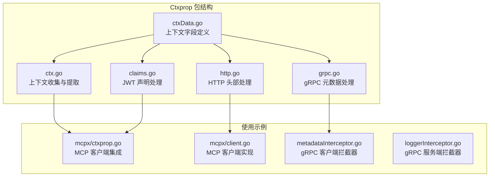
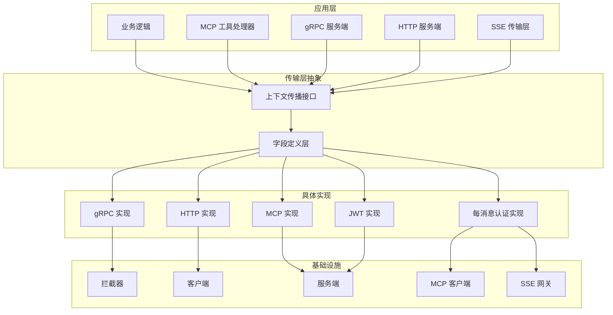
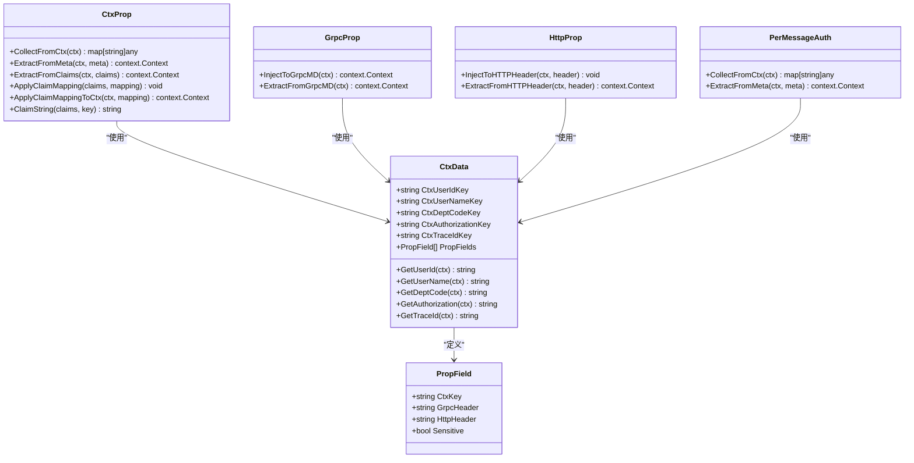
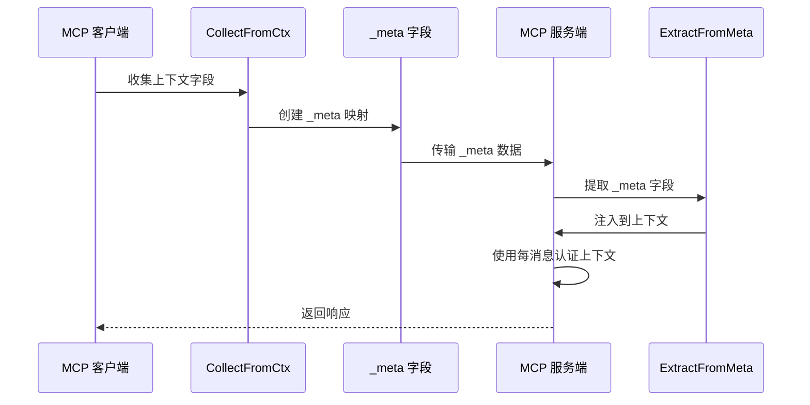
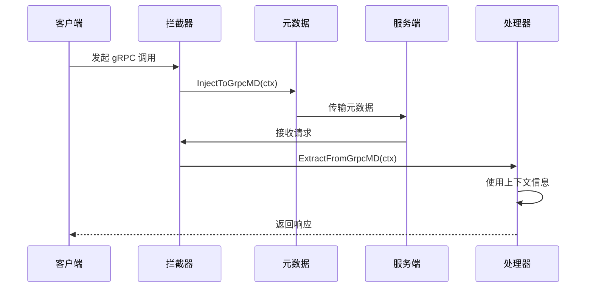
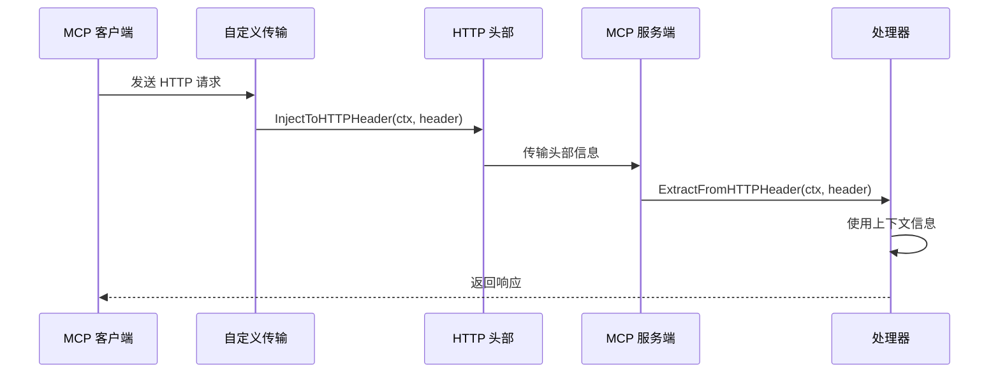
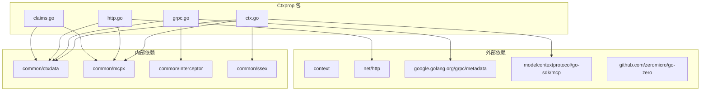

# Ctxprop 包文档

<cite>
**本文档引用的文件**
- [ctx.go](file://common/ctxprop/ctx.go)
- [grpc.go](file://common/ctxprop/grpc.go)
- [http.go](file://common/ctxprop/http.go)
- [claims.go](file://common/ctxprop/claims.go)
- [ctxData.go](file://common/ctxdata/ctxData.go)
- [ctxprop.go](file://common/mcpx/ctxprop.go)
- [client.go](file://common/mcpx/client.go)
- [metadataInterceptor.go](file://common/Interceptor/rpcclient/metadataInterceptor.go)
- [loggerInterceptor.go](file://common/Interceptor/rpcserver/loggerInterceptor.go)
</cite>

## 更新摘要
**变更内容**
- 新增了两个关键的上下文提取工具函数：CollectFromCtx和ExtractFromMeta
- 这些函数支持每消息认证机制，替代了原有的复杂SSE认证桥接系统
- 更新了MCP客户端和服务器端的上下文传播机制
- 简化了SSE传输层的认证流程

## 目录
1. [简介](#简介)
2. [项目结构](#项目结构)
3. [核心组件](#核心组件)
4. [架构概览](#架构概览)
5. [详细组件分析](#详细组件分析)
6. [依赖关系分析](#依赖关系分析)
7. [性能考虑](#性能考虑)
8. [故障排除指南](#故障排除指南)
9. [结论](#结论)

## 简介

Ctxprop 包是 Zero Service 项目中的一个关键组件，专门负责在不同传输层之间传播和管理上下文信息。该包实现了统一的用户身份和会话信息传递机制，支持 gRPC、HTTP 和 MCP（Model Context Protocol）等多种传输协议。

**更新** 新增了专门针对MCP客户端和SSE传输层的上下文提取工具，支持每消息级别的认证机制，显著简化了原有的复杂SSE认证桥接系统。

该包的核心价值在于提供了一种标准化的方式来处理用户上下文信息（如用户ID、部门代码、授权令牌、追踪ID等）在微服务架构中的跨边界传递，确保了系统的可观测性和安全性。

## 项目结构

Ctxprop 包位于 `common/ctxprop/` 目录下，包含以下核心文件：



**图表来源**
- [ctx.go:1-39](file://common/ctxprop/ctx.go#L1-L39)
- [grpc.go:1-35](file://common/ctxprop/grpc.go#L1-L35)
- [http.go:1-33](file://common/ctxprop/http.go#L1-L33)
- [claims.go:1-69](file://common/ctxprop/claims.go#L1-L69)
- [ctxData.go:1-74](file://common/ctxdata/ctxData.go#L1-L74)

**章节来源**
- [ctx.go:1-39](file://common/ctxprop/ctx.go#L1-L39)
- [grpc.go:1-35](file://common/ctxprop/grpc.go#L1-L35)
- [http.go:1-33](file://common/ctxprop/http.go#L1-L33)
- [claims.go:1-69](file://common/ctxprop/claims.go#L1-L69)
- [ctxData.go:1-74](file://common/ctxdata/ctxData.go#L1-L74)

## 核心组件

### 上下文字段定义

Ctxprop 包基于 `ctxdata` 包定义了统一的上下文字段规范，目前包括以下五个核心字段：

| 字段名称 | 上下文键 | gRPC 头部 | HTTP 头部 | 敏感信息 |
|---------|---------|----------|----------|----------|
| 用户ID | user-id | x-user-id | X-User-Id | 否 |
| 用户名 | user-name | x-user-name | X-User-Name | 否 |
| 部门代码 | dept-code | x-dept-code | X-Dept-Code | 否 |
| 授权令牌 | authorization | authorization | Authorization | 是 |
| 追踪ID | trace-id | x-trace-id | X-Trace-Id | 否 |

### 核心处理函数

#### 1. 上下文收集与提取
- `CollectFromCtx`: 从上下文中提取所有字段并返回映射，**新增**用于MCP客户端的每消息认证
- `ExtractFromMeta`: 从 _meta 映射中提取字段并注入上下文，**新增**用于MCP服务端的每消息认证

#### 2. gRPC 元数据处理
- `InjectToGrpcMD`: 将上下文字段注入到 gRPC 元数据
- `ExtractFromGrpcMD`: 从 gRPC 元数据中提取字段并注入上下文

#### 3. HTTP 头部处理
- `InjectToHTTPHeader`: 将上下文字段注入到 HTTP 头部
- `ExtractFromHTTPHeader`: 从 HTTP 头部中提取字段并注入上下文

#### 4. JWT 声明处理
- `ExtractFromClaims`: 从 JWT 声明中提取用户字段
- `ApplyClaimMapping`: 应用声明映射
- `ApplyClaimMappingToCtx`: 将外部声明映射到上下文
- `ClaimString`: 统一处理声明字符串

**更新** 新增的 `CollectFromCtx` 和 `ExtractFromMeta` 函数专门为MCP客户端和SSE传输层设计，支持每消息级别的认证机制，替代了原有的复杂SSE认证桥接系统。

**章节来源**
- [ctxData.go:5-38](file://common/ctxdata/ctxData.go#L5-L38)
- [ctx.go:9-38](file://common/ctxprop/ctx.go#L9-L38)
- [grpc.go:11-34](file://common/ctxprop/grpc.go#L11-L34)
- [http.go:10-32](file://common/ctxprop/http.go#L10-L32)
- [claims.go:10-68](file://common/ctxprop/claims.go#L10-L68)

## 架构概览

Ctxprop 包采用分层设计，提供了统一的接口来处理不同传输层的上下文传播：



**更新** 新增了每消息认证实现层，专门处理MCP客户端和SSE传输层的上下文传播。

**图表来源**
- [ctx.go:1-39](file://common/ctxprop/ctx.go#L1-L39)
- [grpc.go:1-35](file://common/ctxprop/grpc.go#L1-L35)
- [http.go:1-33](file://common/ctxprop/http.go#L1-L33)
- [claims.go:1-69](file://common/ctxprop/claims.go#L1-L69)
- [ctxData.go:1-74](file://common/ctxdata/ctxData.go#L1-L74)

## 详细组件分析

### 上下文字段管理器

Ctxprop 包的核心是统一的上下文字段管理机制，通过 `PropFields` 列表定义了所有需要传播的字段。



**更新** 新增了PerMessageAuth类，专门处理每消息级别的认证机制。

**图表来源**
- [ctxData.go:22-38](file://common/ctxdata/ctxData.go#L22-L38)
- [ctx.go:9-38](file://common/ctxprop/ctx.go#L9-L38)
- [grpc.go:11-34](file://common/ctxprop/grpc.go#L11-L34)
- [http.go:10-32](file://common/ctxprop/http.go#L10-L32)
- [claims.go:10-68](file://common/ctxprop/claims.go#L10-L68)

### 每消息认证机制

**新增** Ctxprop 包现在支持每消息级别的认证机制，这是对原有SSE认证桥接系统的重大改进：



**更新** 这个流程替代了原有的复杂SSE认证桥接系统，实现了更简洁高效的每消息认证机制。

**图表来源**
- [ctx.go:12-23](file://common/ctxprop/ctx.go#L12-L23)
- [ctx.go:28-38](file://common/ctxprop/ctx.go#L28-L38)
- [client.go:291-294](file://common/mcpx/client.go#L291-L294)
- [ctxprop.go:43-46](file://common/mcpx/ctxprop.go#L43-L46)

### gRPC 传输层处理

gRPC 传输层通过元数据（metadata）来传播上下文信息，提供了完整的双向传播机制：



**图表来源**
- [grpc.go:13-34](file://common/ctxprop/grpc.go#L13-L34)
- [metadataInterceptor.go:11-14](file://common/Interceptor/rpcclient/metadataInterceptor.go#L11-L14)
- [loggerInterceptor.go:14-21](file://common/Interceptor/rpcserver/loggerInterceptor.go#L14-L21)

### HTTP 传输层处理

HTTP 传输层通过标准头部来传播上下文信息，支持 MCP 客户端的 HTTP 通信：



**图表来源**
- [http.go:12-32](file://common/ctxprop/http.go#L12-L32)
- [client.go:339-350](file://common/mcpx/client.go#L339-L350)

### JWT 声明处理流程

JWT 声明处理提供了灵活的外部声明映射机制，支持不同的 JWT 格式：


**图表来源**
- [claims.go:13-23](file://common/ctxprop/claims.go#L13-L23)
- [claims.go:52-68](file://common/ctxprop/claims.go#L52-L68)

**章节来源**
- [ctx.go:9-38](file://common/ctxprop/ctx.go#L9-L38)
- [grpc.go:11-34](file://common/ctxprop/grpc.go#L11-L34)
- [http.go:10-32](file://common/ctxprop/http.go#L10-L32)
- [claims.go:10-68](file://common/ctxprop/claims.go#L10-L68)

## 依赖关系分析

Ctxprop 包的依赖关系清晰明确，遵循了单一职责原则：



**更新** 新增了对common/ssex包的依赖，用于SSE传输层的上下文处理。

**图表来源**
- [ctx.go:3-7](file://common/ctxprop/ctx.go#L3-L7)
- [grpc.go:3-8](file://common/ctxprop/grpc.go#L3-L8)
- [http.go:3-7](file://common/ctxprop/http.go#L3-L7)
- [claims.go:3-7](file://common/ctxprop/claims.go#L3-L7)

**章节来源**
- [ctx.go:3-7](file://common/ctxprop/ctx.go#L3-L7)
- [grpc.go:3-8](file://common/ctxprop/grpc.go#L3-L8)
- [http.go:3-7](file://common/ctxprop/http.go#L3-L7)
- [claims.go:3-7](file://common/ctxprop/claims.go#L3-L7)

## 性能考虑

### 内存使用优化

1. **零拷贝策略**: 在 gRPC 元数据处理中使用 `md.Copy()` 创建副本，避免修改原始元数据
2. **条件检查**: 所有处理函数都包含空值检查，避免不必要的内存分配
3. **延迟初始化**: `CollectFromCtx` 函数只在有有效字段时创建映射
4. **每消息认证优化**: **新增** `_meta` 字段的收集和提取采用惰性初始化，只有在需要时才创建映射

### 时间复杂度分析

- **字段收集**: O(n)，其中 n 是 `PropFields` 的长度（当前为 5）
- **字段提取**: O(n)，同样受 `PropFields` 长度影响
- **声明处理**: O(n)，遍历所有字段进行类型转换
- **每消息认证**: O(n)，每条消息都需要进行上下文收集和提取操作

### 缓存策略

由于字段数量有限且固定，不需要额外的缓存机制。每次操作都是线性的，性能开销可以忽略不计。

**更新** 每消息认证机制虽然增加了处理次数，但通过优化的字段收集和提取算法，整体性能影响最小化。

## 故障排除指南

### 常见问题及解决方案

#### 1. 上下文字段未正确传播

**症状**: 服务端无法获取用户上下文信息

**排查步骤**:
1. 检查客户端是否正确调用 `InjectToHTTPHeader` 或 `InjectToGrpcMD`
2. 验证服务端拦截器是否正确调用 `ExtractFromHTTPHeader` 或 `ExtractFromGrpcMD`
3. 确认 `PropFields` 中的字段定义是否正确
4. **新增** 检查MCP客户端是否正确调用 `CollectFromCtx` 和 `ExtractFromMeta`

**解决方案**:
```go
// 确保客户端正确注入
ctxprop.InjectToHTTPHeader(ctx, request.Header)

// 确保服务端正确提取
ctx = ctxprop.ExtractFromHTTPHeader(ctx, request.Header)

// **新增** 每消息认证场景
meta := ctxprop.CollectFromCtx(ctx)
params.SetMeta(meta)
ctx = ctxprop.ExtractFromMeta(ctx, meta)
```

#### 2. JWT 声明类型不匹配

**症状**: 用户ID显示为浮点数而非字符串

**原因**: JWT 解析后数值类型为 float64

**解决方案**:
使用 `ClaimString` 函数自动处理类型转换

#### 3. gRPC 元数据丢失

**症状**: 流式 RPC 中上下文信息丢失

**解决方案**:
使用 `StreamLoggerInterceptor` 包装 `ServerStream`，重写 `Context()` 方法

#### 4. **新增** 每消息认证失败

**症状**: SSE传输层中用户上下文丢失

**排查步骤**:
1. 检查MCP客户端是否正确调用 `CollectFromCtx`
2. 验证服务端是否正确调用 `ExtractFromMeta`
3. 确认 `_meta` 字段是否正确传递

**解决方案**:
```go
// MCP 客户端侧
if meta := ctxprop.CollectFromCtx(ctx); len(meta) > 0 {
    params.SetMeta(meta)
}

// MCP 服务端侧
if meta := req.Params.GetMeta(); len(meta) > 0 {
    ctx = ctxprop.ExtractFromMeta(ctx, meta)
}
```

**章节来源**
- [loggerInterceptor.go:26-43](file://common/Interceptor/rpcserver/loggerInterceptor.go#L26-L43)
- [claims.go:50-68](file://common/ctxprop/claims.go#L50-L68)
- [client.go:291-294](file://common/mcpx/client.go#L291-L294)
- [ctxprop.go:43-46](file://common/mcpx/ctxprop.go#L43-L46)

## 结论

Ctxprop 包为 Zero Service 项目提供了一个完整、统一的上下文传播解决方案。通过标准化的字段定义和多传输层支持，它确保了系统在不同组件间的上下文一致性。

**更新** 最新的版本引入了每消息认证机制，通过新增的 `CollectFromCtx` 和 `ExtractFromMeta` 函数，显著简化了SSE传输层的认证流程，替代了原有的复杂SSE认证桥接系统。

### 主要优势

1. **统一性**: 所有传输层使用相同的字段定义和处理逻辑
2. **扩展性**: 新增字段只需修改 `PropFields` 定义
3. **安全性**: 支持敏感信息脱敏标记
4. **兼容性**: 支持 gRPC、HTTP 和 MCP 三种主流传输协议
5. **现代化**: **新增** 每消息认证机制，支持更灵活的认证场景
6. **简化**: **新增** 替代复杂的SSE认证桥接系统，提高开发效率

### 最佳实践建议

1. **字段管理**: 通过 `PropFields` 统一管理所有需要传播的字段
2. **拦截器使用**: 在 gRPC 客户端和服务端正确配置拦截器
3. **类型处理**: 使用 `ClaimString` 处理 JWT 声明的类型转换
4. **错误处理**: 始终检查返回的上下文是否包含所需字段
5. ****新增** 每消息认证**: 在MCP客户端和SSE传输层正确使用 `CollectFromCtx` 和 `ExtractFromMeta`
6. **性能优化**: 注意每消息认证的性能影响，合理使用上下文收集和提取

该包的设计充分体现了微服务架构中上下文传播的重要性，为构建可观测、可追踪的分布式系统奠定了坚实基础。