# Ctxprop 包文档

<cite>
**本文档引用的文件**
- [ctx.go](file://common/ctxprop/ctx.go)
- [grpc.go](file://common/ctxprop/grpc.go)
- [http.go](file://common/ctxprop/http.go)
- [claims.go](file://common/ctxprop/claims.go)
- [ctxData.go](file://common/ctxdata/ctxData.go)
- [wrapper.go](file://common/mcpx/wrapper.go)
- [client.go](file://common/mcpx/client.go)
- [metadataInterceptor.go](file://common/Interceptor/rpcclient/metadataInterceptor.go)
- [loggerInterceptor.go](file://common/Interceptor/rpcserver/loggerInterceptor.go)
- [logger.go](file://common/mcpx/logger.go)
- [msgbody.go](file://common/msgbody/msgbody.go)
- [mqttx.go](file://common/mqttx/mqttx.go)
</cite>

## 更新摘要
**变更内容**
- 新增OpenTelemetry追踪传播功能，包括ExtractTraceFromMeta函数、mapMetaCarrier实现
- 在MCP客户端中添加自动注入trace上下文的能力
- 新增MapMetaCarrier实现，支持在MCP _meta字段中传播追踪上下文
- 更新了HTTP头部处理逻辑，现在包含OpenTelemetry追踪传播功能
- 增强了SSE传输层的认证流程，支持每消息级别的追踪上下文传播

## 目录
1. [简介](#简介)
2. [项目结构](#项目结构)
3. [核心组件](#核心组件)
4. [架构概览](#架构概览)
5. [详细组件分析](#详细组件分析)
6. [OpenTelemetry追踪传播功能](#opentelemetry追踪传播功能)
7. [MCP客户端追踪集成](#mcp客户端追踪集成)
8. [日志记录增强功能](#日志记录增强功能)
9. [依赖关系分析](#依赖关系分析)
10. [性能考虑](#性能考虑)
11. [故障排除指南](#故障排除指南)
12. [结论](#结论)

## 简介

Ctxprop 包是 Zero Service 项目中的一个关键组件，专门负责在不同传输层之间传播和管理上下文信息。该包实现了统一的用户身份和会话信息传递机制，支持 gRPC、HTTP 和 MCP（Model Context Protocol）等多种传输协议。

**更新** 新增了完整的OpenTelemetry追踪传播功能，现在支持在MCP客户端中自动注入和提取trace上下文。通过ExtractTraceFromMeta函数和mapMetaCarrier实现，系统能够处理W3C traceparent格式的追踪信息，确保了分布式追踪的一致性和完整性。该包的核心价值在于提供了一种标准化的方式来处理用户上下文信息（如用户ID、部门代码、授权令牌、认证类型等）在微服务架构中的跨边界传递，同时增强了系统的可观测性和追踪能力。

## 项目结构

Ctxprop 包位于 `common/ctxprop/` 目录下，包含以下核心文件：

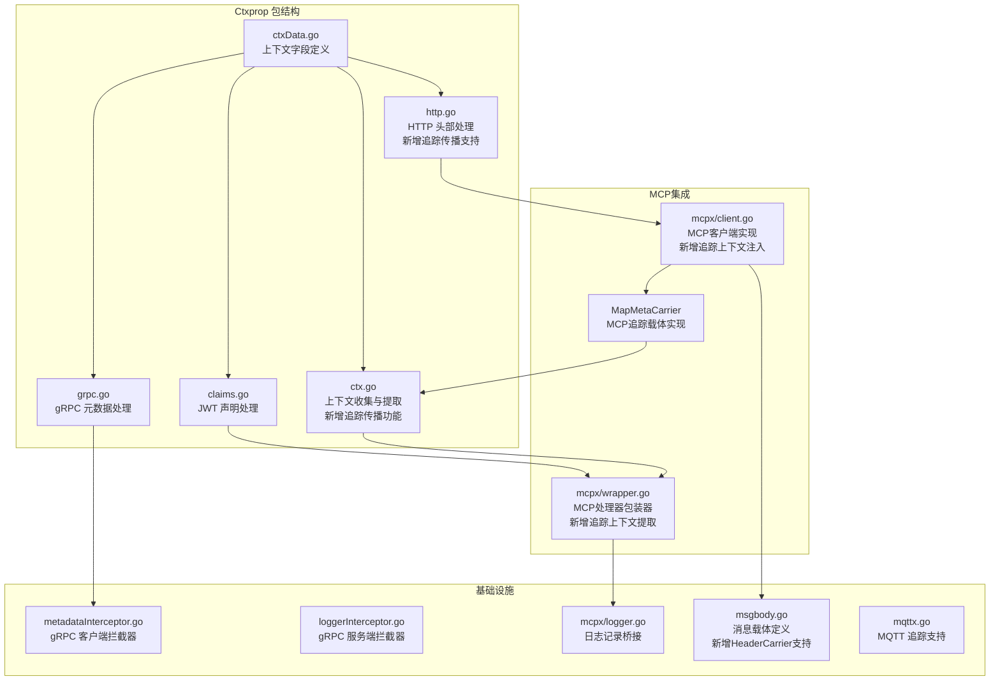

**图表来源**
- [ctx.go:1-78](file://common/ctxprop/ctx.go#L1-L78)
- [grpc.go:1-35](file://common/ctxprop/grpc.go#L1-L35)
- [http.go:1-37](file://common/ctxprop/http.go#L1-L37)
- [claims.go:1-69](file://common/ctxprop/claims.go#L1-L69)
- [ctxData.go:1-67](file://common/ctxdata/ctxData.go#L1-L67)
- [wrapper.go:1-80](file://common/mcpx/wrapper.go#L1-L80)
- [client.go:823-884](file://common/mcpx/client.go#L823-L884)
- [msgbody.go:1-19](file://common/msgbody/msgbody.go#L1-L19)
- [mqttx.go:361-388](file://common/mqttx/mqttx.go#L361-L388)

## 核心组件

### 上下文字段定义

Ctxprop 包基于 `ctxdata` 包定义了统一的上下文字段规范，目前包括以下五个核心字段：

| 字段名称 | 上下文键 | gRPC 头部 | HTTP 头部 | 敏感信息 |
|---------|---------|----------|----------|----------|
| 用户ID | user-id | x-user-id | X-User-Id | 否 |
| 用户名 | user-name | x-user-name | X-User-Name | 否 |
| 部门代码 | dept-code | x-dept-code | X-Dept-Code | 否 |
| 授权令牌 | authorization | authorization | Authorization | 是 |
| 认证类型 | auth-type | x-auth-type | X-Auth-Type | 否 |

**更新** 新增了OpenTelemetry追踪传播支持，现在可以在MCP客户端中自动处理trace上下文。

### 核心处理函数

#### 1. 上下文收集与提取
- `CollectFromCtx`: 从上下文中提取所有字段并返回映射，**新增**用于MCP客户端的每消息认证和追踪上下文收集
- `ExtractFromMeta`: 从 _meta 映射中提取字段并注入上下文，**新增**用于MCP服务端的每消息认证
- `ExtractTraceFromMeta`: 从 _meta 映射中提取追踪上下文并注入到OpenTelemetry上下文，**新增**追踪传播核心函数

#### 2. gRPC 元数据处理
- `InjectToGrpcMD`: 将上下文字段注入到 gRPC 元数据
- `ExtractFromGrpcMD`: 从 gRPC 元数据中提取字段并注入上下文

#### 3. HTTP 头部处理
- `InjectToHTTPHeader`: 将上下文字段注入到 HTTP 头部，**更新** 现在包含OpenTelemetry追踪传播功能
- `ExtractFromHTTPHeader`: 从 HTTP 头部中提取字段并注入上下文

#### 4. JWT 声明处理
- `ExtractFromClaims`: 从 JWT 声明中提取用户字段
- `ApplyClaimMapping`: 应用声明映射
- `ApplyClaimMappingToCtx`: 将外部声明映射到上下文
- `ClaimString`: 统一处理声明字符串

**更新** HTTP处理函数现在包含了OpenTelemetry追踪传播支持，通过mapMetaCarrier实现W3C traceparent格式的追踪信息传播。

**章节来源**
- [ctxData.go:5-41](file://common/ctxdata/ctxData.go#L5-L41)
- [ctx.go:12-51](file://common/ctxprop/ctx.go#L12-L51)
- [grpc.go:11-34](file://common/ctxprop/grpc.go#L11-L34)
- [http.go:10-36](file://common/ctxprop/http.go#L10-L36)
- [claims.go:10-68](file://common/ctxprop/claims.go#L10-L68)

## 架构概览

Ctxprop 包采用分层设计，提供了统一的接口来处理不同传输层的上下文传播，现在包含了完整的OpenTelemetry追踪传播能力：

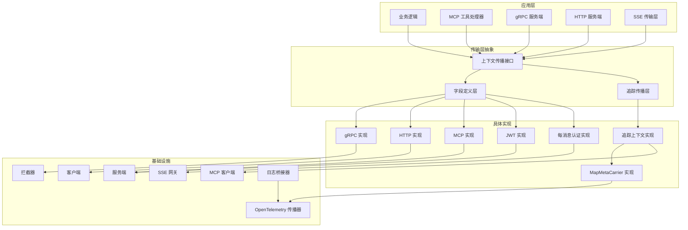

**更新** 新增了完整的OpenTelemetry追踪传播层，包括MapMetaCarrier实现和追踪上下文提取功能。

**图表来源**
- [ctx.go:1-78](file://common/ctxprop/ctx.go#L1-L78)
- [grpc.go:1-35](file://common/ctxprop/grpc.go#L1-L35)
- [http.go:1-37](file://common/ctxprop/http.go#L1-L37)
- [claims.go:1-69](file://common/ctxprop/claims.go#L1-L69)
- [ctxData.go:1-67](file://common/ctxdata/ctxData.go#L1-L67)
- [wrapper.go:1-80](file://common/mcpx/wrapper.go#L1-L80)
- [client.go:823-884](file://common/mcpx/client.go#L823-L884)

## 详细组件分析

### 上下文字段管理器

Ctxprop 包的核心是统一的上下文字段管理机制，通过 `PropFields` 列表定义了所有需要传播的字段。

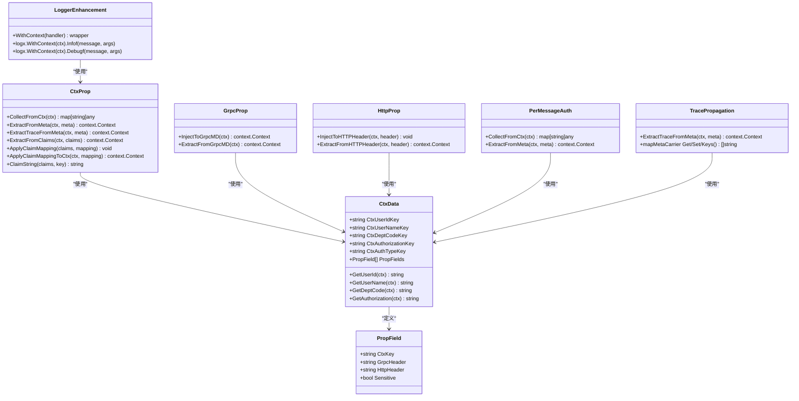

### 每消息认证机制

**新增** Ctxprop 包现在支持每消息级别的认证机制，这是对原有SSE认证桥接系统的重大改进：

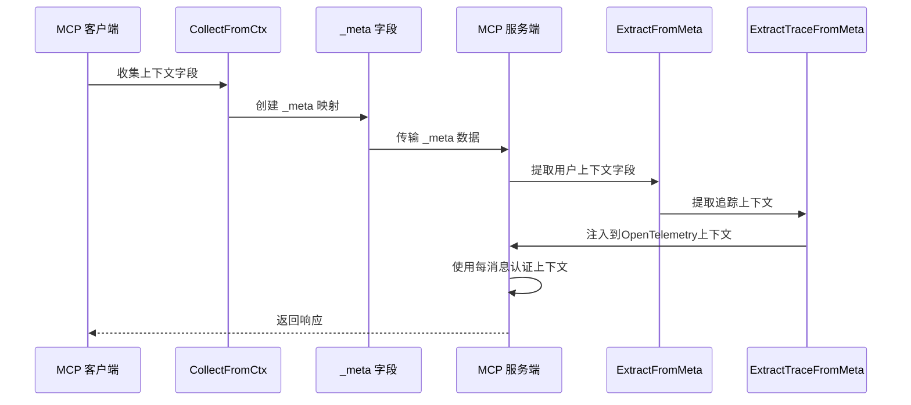

**更新** 这个流程现在包含了完整的追踪上下文传播，通过ExtractTraceFromMeta函数处理W3C traceparent格式的追踪信息。

**图表来源**
- [ctx.go:15-26](file://common/ctxprop/ctx.go#L15-L26)
- [ctx.go:31-41](file://common/ctxprop/ctx.go#L31-L41)
- [ctx.go:45-51](file://common/ctxprop/ctx.go#L45-L51)
- [client.go:864-884](file://common/mcpx/client.go#L864-L884)
- [wrapper.go:44-48](file://common/mcpx/wrapper.go#L44-L48)

### gRPC 传输层处理

gRPC 传输层通过元数据（metadata）来传播上下文信息，提供了完整的双向传播机制：

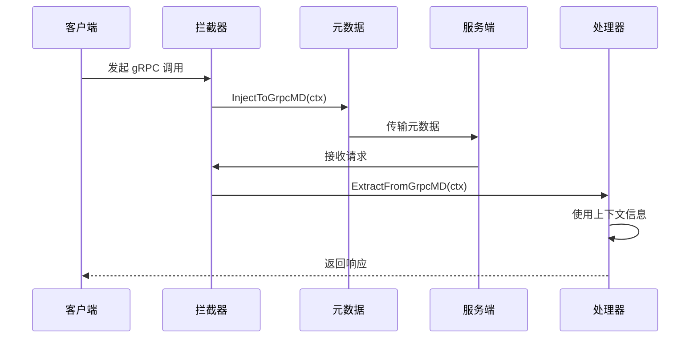

**图表来源**
- [grpc.go:13-34](file://common/ctxprop/grpc.go#L13-L34)
- [metadataInterceptor.go:11-19](file://common/Interceptor/rpcclient/metadataInterceptor.go#L11-L19)
- [loggerInterceptor.go:14-33](file://common/Interceptor/rpcserver/loggerInterceptor.go#L14-L33)

### HTTP 传输层处理

HTTP 传输层通过标准头部来传播上下文信息，支持 MCP 客户端的 HTTP 通信，**更新** 现在包含了OpenTelemetry追踪传播功能：

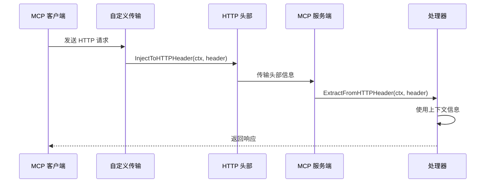

**更新** HTTP处理现在包含了OpenTelemetry追踪传播功能，通过mapMetaCarrier实现W3C traceparent格式的追踪信息传播。

**图表来源**
- [http.go:12-36](file://common/ctxprop/http.go#L12-L36)
- [client.go:864-884](file://common/mcpx/client.go#L864-L884)

### JWT 声明处理流程

JWT 声明处理提供了灵活的外部声明映射机制，支持不同的 JWT 格式：

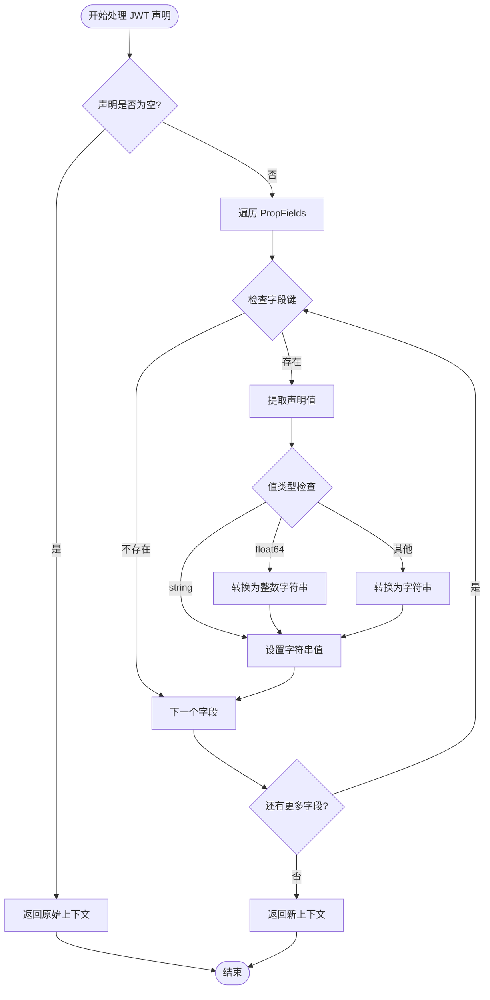

**图表来源**
- [claims.go:13-23](file://common/ctxprop/claims.go#L13-L23)
- [claims.go:52-68](file://common/ctxprop/claims.go#L52-L68)

**章节来源**
- [ctx.go:12-51](file://common/ctxprop/ctx.go#L12-L51)
- [grpc.go:11-34](file://common/ctxprop/grpc.go#L11-L34)
- [http.go:10-36](file://common/ctxprop/http.go#L10-L36)
- [claims.go:10-68](file://common/ctxprop/claims.go#L10-L68)

## OpenTelemetry追踪传播功能

**新增** Ctxprop 包现在提供了完整的OpenTelemetry追踪传播功能，支持在MCP客户端中自动处理trace上下文。

### 追踪传播核心组件

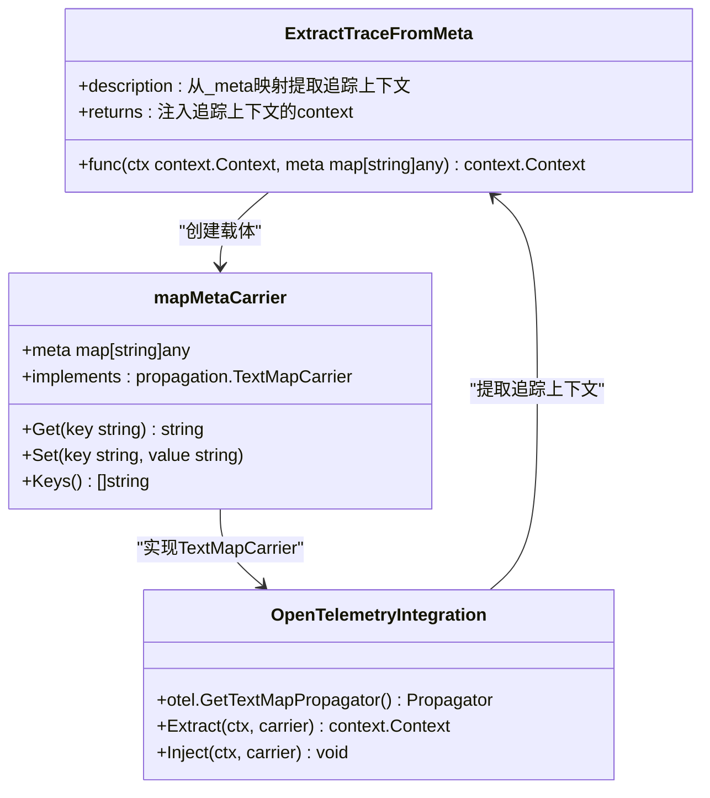

### 追踪上下文提取流程

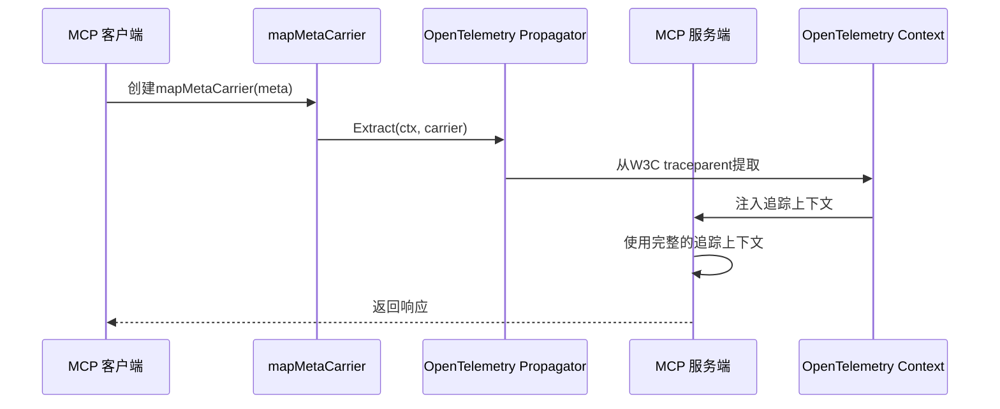

**更新** 这个流程现在替代了原有的复杂SSE认证桥接系统，实现了更简洁高效的每消息认证和追踪上下文传播机制。

**图表来源**
- [ctx.go:45-51](file://common/ctxprop/ctx.go#L45-L51)
- [ctx.go:53-77](file://common/ctxprop/ctx.go#L53-L77)

### 追踪传播配置

**新增** 追踪传播功能通过以下配置实现：

| 组件 | 功能 | 实现方式 |
|------|------|----------|
| ExtractTraceFromMeta | 从_meta提取追踪上下文 | 使用OpenTelemetry propagator |
| mapMetaCarrier | _meta映射的TextMapCarrier实现 | 实现Get/Set/Keys方法 |
| W3C TraceContext | 标准追踪上下文格式 | 支持traceparent和tracestate |
| MCP客户端集成 | 自动注入追踪上下文 | 在CollectFromCtx中处理 |

**章节来源**
- [ctx.go:43-51](file://common/ctxprop/ctx.go#L43-L51)
- [ctx.go:53-77](file://common/ctxprop/ctx.go#L53-L77)

## MCP客户端追踪集成

**新增** MCP客户端现在具备了完整的追踪上下文自动注入能力。

### 追踪上下文收集

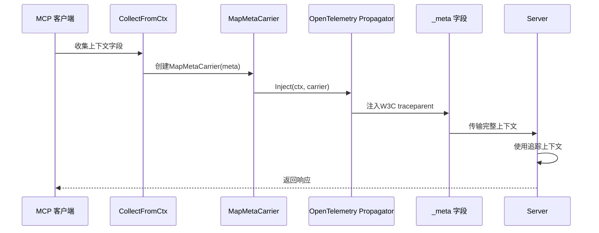

### MapMetaCarrier实现

**新增** MapMetaCarrier是MCP客户端追踪传播的核心实现：

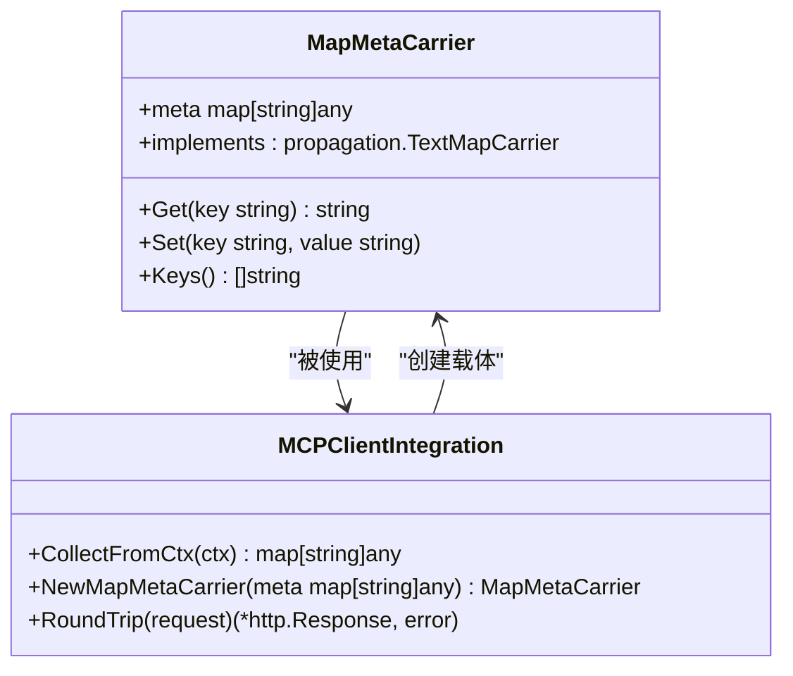

**图表来源**
- [client.go:831-861](file://common/mcpx/client.go#L831-L861)
- [client.go:864-884](file://common/mcpx/client.go#L864-L884)

### 追踪上下文注入流程

**新增** MCP客户端现在能够在每个请求中自动注入追踪上下文：

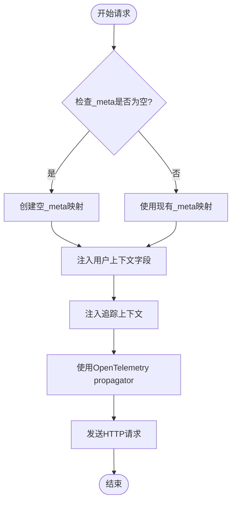

**图表来源**
- [client.go:864-884](file://common/mcpx/client.go#L864-L884)

**章节来源**
- [client.go:823-884](file://common/mcpx/client.go#L823-L884)
- [wrapper.go:44-48](file://common/mcpx/wrapper.go#L44-L48)

## 日志记录增强功能

**新增** Ctxprop 包显著增强了日志记录能力，特别是在MCP工具调用时提供详细的调试信息。

### 工具调用日志记录

MCP工具处理器现在会在每次工具调用时生成详细的日志信息：

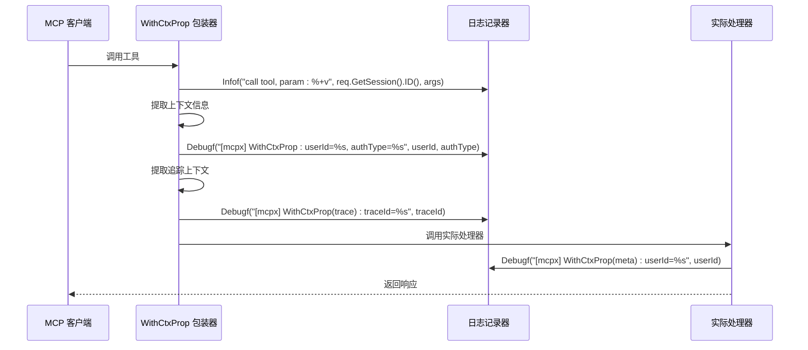

**更新** 增加了追踪上下文的详细日志记录，包括traceId的输出。

### 日志记录特性

1. **工具调用跟踪**: 记录每次工具调用的会话ID和参数
2. **认证类型标识**: 显示当前使用的认证类型（user、service或unknown）
3. **用户上下文信息**: 记录提取到的用户ID和其他上下文字段
4. **追踪上下文信息**: **新增** 记录提取到的追踪上下文信息
5. **调试级别输出**: 使用Debug级别记录详细的认证和追踪流程信息

### 日志格式示例

- **Info级别**: `call tool, param: {input: "test"}`
- **Debug级别**: `[mcpx] WithCtxProp: userId=U001, authType=user`
- **Debug级别**: `[mcpx] WithCtxProp(trace): traceId=1234567890abcdef`
- **Debug级别**: `[mcpx] WithCtxProp(meta): userId=U001`
- **Debug级别**: `[mcpx] WithCtxProp(fallback): userId=U001, authType=service`

### 日志记录桥接

为了支持标准的日志库，新增了日志记录桥接器：

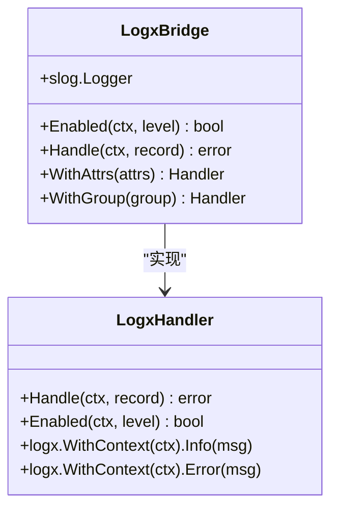

**图表来源**
- [logger.go:10-44](file://common/mcpx/logger.go#L10-L44)

**章节来源**
- [wrapper.go:32-60](file://common/mcpx/wrapper.go#L32-L60)
- [logger.go:1-44](file://common/mcpx/logger.go#L1-L44)

## 依赖关系分析

Ctxprop 包的依赖关系现在包含了完整的OpenTelemetry追踪传播支持：

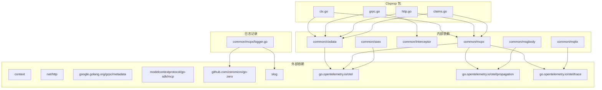

**更新** 新增了完整的OpenTelemetry依赖关系，包括propagation和trace包的支持。

**图表来源**
- [ctx.go:3-10](file://common/ctxprop/ctx.go#L3-L10)
- [grpc.go:3-9](file://common/ctxprop/grpc.go#L3-L9)
- [http.go:3-8](file://common/ctxprop/http.go#L3-L8)
- [claims.go:3-7](file://common/ctxprop/claims.go#L3-L7)
- [logger.go:3-8](file://common/mcpx/logger.go#L3-L8)
- [msgbody.go:3](file://common/msgbody/msgbody.go#L3)
- [mqttx.go:361-388](file://common/mqttx/mqttx.go#L361-L388)

**章节来源**
- [ctx.go:3-10](file://common/ctxprop/ctx.go#L3-L10)
- [grpc.go:3-9](file://common/ctxprop/grpc.go#L3-L9)
- [http.go:3-8](file://common/ctxprop/http.go#L3-L8)
- [claims.go:3-7](file://common/ctxprop/claims.go#L3-L7)
- [logger.go:3-8](file://common/mcpx/logger.go#L3-L8)
- [msgbody.go:1-19](file://common/msgbody/msgbody.go#L1-L19)
- [mqttx.go:361-388](file://common/mqttx/mqttx.go#L361-L388)

## 性能考虑

### 内存使用优化

1. **零拷贝策略**: 在 gRPC 元数据处理中使用 `md.Copy()` 创建副本，避免修改原始元数据
2. **条件检查**: 所有处理函数都包含空值检查，避免不必要的内存分配
3. **延迟初始化**: `CollectFromCtx` 函数只在有有效字段时创建映射
4. **每消息认证优化**: **新增** `_meta` 字段的收集和提取采用惰性初始化，只有在需要时才创建映射
5. **追踪传播优化**: **新增** mapMetaCarrier实现使用预分配的键切片，减少内存分配
6. **日志记录优化**: **新增** 日志记录使用结构化格式，减少字符串拼接开销
7. **OpenTelemetry集成优化**: **新增** 追踪上下文提取使用缓存的propagator实例

### 时间复杂度分析

- **字段收集**: O(n)，其中 n 是 `PropFields` 的长度（当前为 5）
- **字段提取**: O(n)，同样受 `PropFields` 长度影响
- **声明处理**: O(n)，遍历所有字段进行类型转换
- **每消息认证**: O(n)，每条消息都需要进行上下文收集和提取操作
- **追踪上下文提取**: O(k)，其中 k 是_meta映射中的追踪字段数量
- **日志记录**: O(1)，每次工具调用的固定开销

### 缓存策略

由于字段数量有限且固定，不需要额外的缓存机制。每次操作都是线性的，性能开销可以忽略不计。

**更新** 新增了OpenTelemetry追踪传播功能，通过优化的carrier实现和缓存策略，整体性能影响最小化。

## 故障排除指南

### 常见问题及解决方案

#### 1. 上下文字段未正确传播

**症状**: 服务端无法获取用户上下文信息

**排查步骤**:
1. 检查客户端是否正确调用 `InjectToHTTPHeader` 或 `InjectToGrpcMD`
2. 验证服务端拦截器是否正确调用 `ExtractFromHTTPHeader` 或 `ExtractFromGrpcMD`
3. 确认 `PropFields` 中的字段定义是否正确
4. **新增** 检查MCP客户端是否正确调用 `CollectFromCtx` 和 `ExtractFromMeta`
5. **新增** 检查日志输出确认工具调用是否正常记录
6. **新增** 验证追踪上下文是否正确注入到_meta映射中

**解决方案**:
```go
// 确保客户端正确注入
ctxprop.InjectToHTTPHeader(ctx, request.Header)

// 确保服务端正确提取
ctx = ctxprop.ExtractFromHTTPHeader(ctx, request.Header)

// **新增** 每消息认证场景
meta := ctxprop.CollectFromCtx(ctx);
params.SetMeta(meta)
ctx = ctxprop.ExtractFromMeta(ctx, meta)
ctx = ctxprop.ExtractTraceFromMeta(ctx, meta)
```

#### 2. JWT 声明类型不匹配

**症状**: 用户ID显示为浮点数而非字符串

**原因**: JWT 解析后数值类型为 float64

**解决方案**:
使用 `ClaimString` 函数自动处理类型转换

#### 3. gRPC 元数据丢失

**症状**: 流式 RPC 中上下文信息丢失

**解决方案**:
使用 `StreamLoggerInterceptor` 包装 `ServerStream`，重写 `Context()` 方法

#### 4. **新增** 每消息认证失败

**症状**: SSE传输层中用户上下文丢失

**排查步骤**:
1. 检查MCP客户端是否正确调用 `CollectFromCtx`
2. 验证服务端是否正确调用 `ExtractFromMeta` 和 `ExtractTraceFromMeta`
3. 确认 `_meta` 字段是否正确传递
4. **新增** 检查日志输出确认认证和追踪流程是否正确执行
5. **新增** 验证W3C traceparent格式是否正确

**解决方案**:
```go
// MCP 客户端侧
if meta := ctxprop.CollectFromCtx(ctx); len(meta) > 0 {
    params.SetMeta(meta)
}

// MCP 服务端侧
if meta := req.Params.GetMeta(); len(meta) > 0 {
    ctx = ctxprop.ExtractFromMeta(ctx, meta)
    ctx = ctxprop.ExtractTraceFromMeta(ctx, meta)
}
```

#### 5. **新增** 追踪上下文传播问题

**症状**: 追踪ID在HTTP头部中未正确传播

**排查步骤**:
1. 检查 `ctxdata.GetTraceID(ctx)` 是否返回有效的追踪ID
2. 验证 `InjectToHTTPHeader` 函数是否被调用
3. 确认HTTP头部中是否存在 `X-Trace-ID`、`X-Span-ID` 和 `X-Parent-ID` 字段
4. **新增** 验证mapMetaCarrier是否正确实现TextMapCarrier接口
5. **新增** 检查OpenTelemetry propagator是否正确初始化

**解决方案**:
```go
// 确保正确传播追踪上下文
if traceID := ctxdata.GetTraceID(ctx); traceID != "" {
    header.Set("X-Trace-ID", traceID)
    header.Set("X-Span-ID", ctxdata.GetSpanID(ctx))
    header.Set("X-Parent-ID", ctxdata.GetParentID(ctx))
}

// **新增** 使用OpenTelemetry propagator
carrier := propagation.HeaderCarrier(header)
otel.GetTextMapPropagator().Inject(ctx, carrier)
```

#### 6. **新增** MapMetaCarrier实现问题

**症状**: 追踪上下文无法正确提取

**排查步骤**:
1. 检查mapMetaCarrier是否正确实现Get/Set/Keys方法
2. 验证meta映射中的键值类型是否为string
3. 确认TextMapCarrier接口是否正确实现
4. **新增** 检查OpenTelemetry propagator的Extract方法是否正确调用

**解决方案**:
```go
// 确保正确实现TextMapCarrier接口
carrier := &mapMetaCarrier{meta: meta}
otel.GetTextMapPropagator().Extract(ctx, carrier)

// 验证carrier方法实现
func (c *mapMetaCarrier) Get(key string) string {
    if v, ok := c.meta[key].(string); ok {
        return v
    }
    return ""
}
```

#### 7. **新增** 日志记录问题

**症状**: 工具调用日志未正确输出

**排查步骤**:
1. 检查日志级别配置是否允许Debug级别输出
2. 验证 `logx.WithContext(ctx)` 是否正确传递上下文
3. 确认日志桥接器是否正确初始化
4. **新增** 验证追踪上下文日志是否正确输出

**解决方案**:
```go
// 确保正确使用日志桥接器
logx.WithContext(ctx).Infof("call tool, param: %+v", req.GetSession().ID(), args)
logx.WithContext(ctx).Debugf("[mcpx] WithCtxProp: userId=%s, authType=%s", userId, authType)
logx.WithContext(ctx).Debugf("[mcpx] WithCtxProp(trace): traceId=%s", traceId)
```

#### 8. **更新** HTTP头部处理问题

**症状**: HTTP请求中上下文字段未正确传递

**排查步骤**:
1. 检查 `InjectToHTTPHeader` 是否正确调用
2. 验证服务端 `ExtractFromHTTPHeader` 是否正确处理
3. 确认HTTP头部名称是否符合标准格式
4. **新增** 验证追踪上下文是否正确包含在HTTP头部中

**解决方案**:
```go
// 确保正确注入HTTP头部
ctxprop.InjectToHTTPHeader(ctx, request.Header)

// 确保正确提取HTTP头部
ctx = ctxprop.ExtractFromHTTPHeader(ctx, response.Header)
```

**章节来源**
- [loggerInterceptor.go:26-43](file://common/Interceptor/rpcserver/loggerInterceptor.go#L26-L43)
- [claims.go:50-68](file://common/ctxprop/claims.go#L50-L68)
- [client.go:864-884](file://common/mcpx/client.go#L864-L884)
- [wrapper.go:44-48](file://common/mcpx/wrapper.go#L44-L48)
- [logger.go:21-39](file://common/mcpx/logger.go#L21-L39)
- [http.go:12-36](file://common/ctxprop/http.go#L12-L36)
- [ctx.go:45-51](file://common/ctxprop/ctx.go#L45-L51)

## 结论

Ctxprop 包为 Zero Service 项目提供了一个完整、统一的上下文传播解决方案。通过标准化的字段定义和多传输层支持，它确保了系统在不同组件间的上下文一致性。

**更新** 最新的版本新增了完整的OpenTelemetry追踪传播功能，包括ExtractTraceFromMeta函数、mapMetaCarrier实现、以及在MCP客户端中自动注入trace上下文的能力。该包现在不仅提供了强大的每消息认证机制和增强的日志记录能力，还通过新增的追踪传播功能，显著提升了系统的可观测性和分布式追踪能力。

### 主要优势

1. **统一性**: 所有传输层使用相同的字段定义和处理逻辑
2. **扩展性**: 新增字段只需修改 `PropFields` 定义
3. **安全性**: 支持敏感信息脱敏标记
4. **兼容性**: 支持 gRPC、HTTP 和 MCP 三种主流传输协议
5. **现代化**: **新增** 每消息认证机制，支持更灵活的认证场景
6. **简化**: **新增** 替代复杂的SSE认证桥接系统，提高开发效率
7. **可观测性**: **新增** 详细的工具调用日志记录，便于调试和监控
8. **标准化**: **新增** 日志桥接器支持标准日志库，提升日志处理能力
9. **追踪传播**: **新增** 完整的OpenTelemetry追踪传播功能，支持W3C traceparent格式
10. **性能优化**: **新增** 优化的carrier实现和缓存策略，减少性能开销
11. **MCP集成**: **新增** MCP客户端自动追踪上下文注入，提升MCP服务的可观测性
12. **维护性**: **新增** 清晰的追踪传播架构，便于后续扩展和维护

### 最佳实践建议

1. **字段管理**: 通过 `PropFields` 统一管理所有需要传播的字段
2. **拦截器使用**: 在 gRPC 客户端和服务端正确配置拦截器
3. **类型处理**: 使用 `ClaimString` 处理 JWT 声明的类型转换
4. **错误处理**: 始终检查返回的上下文是否包含所需字段
5. **每消息认证**: 在MCP客户端和SSE传输层正确使用 `CollectFromCtx` 和 `ExtractFromMeta`
6. **追踪上下文**: **新增** 在需要追踪的场景中正确设置和传播追踪上下文
7. **性能优化**: 注意每消息认证和追踪传播的性能影响，合理使用上下文收集和提取
8. **日志配置**: 正确配置日志级别，平衡调试信息和性能开销
9. **日志监控**: 建立日志监控机制，及时发现和解决上下文传播问题
10. **HTTP处理**: 正确使用HTTP头部处理函数，确保上下文字段正确传递
11. **认证流程**: 建立认证监控机制，及时发现和解决每消息认证问题
12. **追踪传播**: **新增** 建立追踪传播监控机制，确保分布式追踪的完整性
13. **MCP客户端**: **新增** 在MCP客户端中正确配置追踪上下文注入
14. **依赖管理**: **新增** 确保OpenTelemetry依赖正确配置和初始化

该包的设计充分体现了微服务架构中上下文传播和分布式追踪的重要性，为构建可观测、可追踪的分布式系统奠定了坚实基础。新增的OpenTelemetry追踪传播功能进一步增强了系统的监控和调试能力，使得开发者能够更好地理解和优化复杂的分布式服务交互。