# Ctxprop 包文档

<cite>
**本文档引用的文件**
- [ctx.go](file://common/ctxprop/ctx.go)
- [grpc.go](file://common/ctxprop/grpc.go)
- [http.go](file://common/ctxprop/http.go)
- [claims.go](file://common/ctxprop/claims.go)
- [ctxData.go](file://common/ctxdata/ctxData.go)
- [wrapper.go](file://common/mcpx/wrapper.go)
- [client.go](file://common/mcpx/client.go)
- [metadataInterceptor.go](file://common/Interceptor/rpcclient/metadataInterceptor.go)
- [loggerInterceptor.go](file://common/Interceptor/rpcserver/loggerInterceptor.go)
- [logger.go](file://common/mcpx/logger.go)
- [msgbody.go](file://common/msgbody/msgbody.go)
- [mqttx.go](file://common/mqttx/mqttx.go)
- [trace.go](file://common/mqttx/trace.go)
</cite>

## 更新摘要
**变更内容**
- 新增OpenTelemetry追踪传播功能，包括ExtractTraceFromMeta函数、mapMetaCarrier实现
- 在MCP客户端中添加自动注入trace上下文的能力
- 新增MapMetaCarrier实现，支持在MCP _meta字段中传播追踪上下文
- 更新了HTTP头部处理逻辑，现在包含OpenTelemetry追踪传播功能
- 增强了SSE传输层的认证流程，支持每消息级别的追踪上下文传播
- 新增MCP客户端的MapMetaCarrier实现，支持OpenTelemetry追踪传播
- **新增** 在 gRPC 元数据处理中新增 base64Prefix 常量和 hasNotPrintable 辅助函数，增强国际化字符支持，通过智能编码/解码机制支持非ASCII字符的透明传输

## 目录
1. [简介](#简介)
2. [项目结构](#项目结构)
3. [核心组件](#核心组件)
4. [架构概览](#架构概览)
5. [详细组件分析](#详细组件分析)
6. [OpenTelemetry追踪传播功能](#opentelemetry追踪传播功能)
7. [MCP客户端追踪集成](#mcp客户端追踪集成)
8. [日志记录增强功能](#日志记录增强功能)
9. [国际化字符支持](#国际化字符支持)
10. [依赖关系分析](#依赖关系分析)
11. [性能考虑](#性能考虑)
12. [故障排除指南](#故障排除指南)
13. [结论](#结论)

## 简介

Ctxprop 包是 Zero Service 项目中的一个关键组件，专门负责在不同传输层之间传播和管理上下文信息。该包实现了统一的用户身份和会话信息传递机制，支持 gRPC、HTTP 和 MCP（Model Context Protocol）等多种传输协议。

**更新** 新增了完整的OpenTelemetry追踪传播功能，现在支持在MCP客户端中自动注入和提取trace上下文。通过ExtractTraceFromMeta函数和mapMetaCarrier实现，系统能够处理W3C traceparent格式的追踪信息，确保了分布式追踪的一致性和完整性。**新增** 在 gRPC 元数据处理中新增了对非ASCII字符的智能编码支持，通过base64Prefix常量和hasNotPrintable辅助函数检测和base64编码非ASCII字符，显著提升了国际化字符的传播能力。

## 项目结构

Ctxprop 包位于 `common/ctxprop/` 目录下，包含以下核心文件：

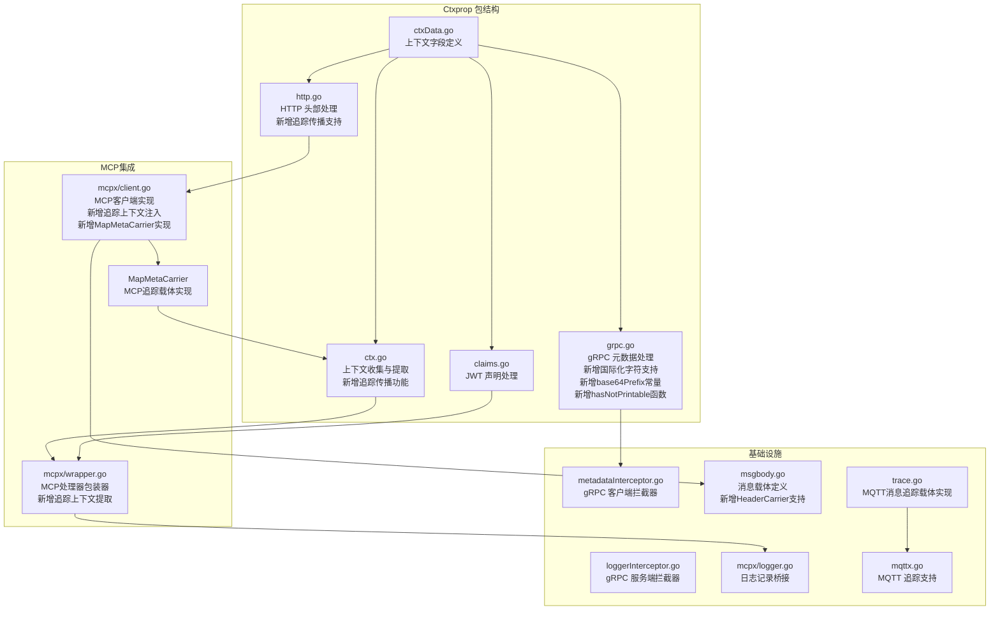

**图表来源**
- [ctx.go:1-78](file://common/ctxprop/ctx.go#L1-L78)
- [grpc.go:1-70](file://common/ctxprop/grpc.go#L1-L70)
- [http.go:1-37](file://common/ctxprop/http.go#L1-L37)
- [claims.go:1-69](file://common/ctxprop/claims.go#L1-L69)
- [ctxData.go:1-77](file://common/ctxdata/ctxData.go#L1-L77)
- [wrapper.go:1-155](file://common/mcpx/wrapper.go#L1-L155)
- [client.go:924-976](file://common/mcpx/client.go#L924-L976)
- [msgbody.go:1-19](file://common/msgbody/msgbody.go#L1-L19)
- [mqttx.go:361-388](file://common/mqttx/mqttx.go#L361-L388)
- [trace.go:1-30](file://common/mqttx/trace.go#L1-L30)

## 核心组件

### 上下文字段定义

Ctxprop 包基于 `ctxdata` 包定义了统一的上下文字段规范，目前包括以下五个核心字段：

| 字段名称 | 上下文键 | gRPC 头部 | HTTP 头部 | 敏感信息 |
|---------|---------|----------|----------|----------|
| 用户ID | user-id | x-user-id | X-User-Id | 否 |
| 用户名 | user-name | x-user-name | X-User-Name | 否 |
| 部门代码 | dept-code | x-dept-code | X-Dept-Code | 否 |
| 授权令牌 | authorization | authorization | Authorization | 是 |
| 认证类型 | auth-type | x-auth-type | X-Auth-Type | 否 |

**更新** 新增了OpenTelemetry追踪传播支持，现在可以在MCP客户端中自动处理trace上下文。**新增** 在 gRPC 元数据处理中新增了对非ASCII字符的智能检测和编码支持。

### 核心处理函数

#### 1. 上下文收集与提取
- `CollectFromCtx`: 从上下文中提取所有字段并返回映射，**新增**用于MCP客户端的每消息认证和追踪上下文收集
- `ExtractFromMeta`: 从 _meta 映射中提取字段并注入上下文，**新增**用于MCP服务端的每消息认证
- `ExtractTraceFromMeta`: 从 _meta 映射中提取追踪上下文并注入到OpenTelemetry上下文，**新增**追踪传播核心函数

#### 2. gRPC 元数据处理
- `InjectToGrpcMD`: 将上下文字段注入到 gRPC 元数据，**更新** 现在包含非ASCII字符的自动base64编码支持
- `ExtractFromGrpcMD`: 从 gRPC 元数据中提取字段并注入上下文，**更新** 现在支持base64解码非ASCII字符

#### 3. HTTP 头部处理
- `InjectToHTTPHeader`: 将上下文字段注入到 HTTP 头部，**更新** 现在包含OpenTelemetry追踪传播功能
- `ExtractFromHTTPHeader`: 从 HTTP 头部中提取字段并注入上下文

#### 4. JWT 声明处理
- `ExtractFromClaims`: 从 JWT 声明中提取用户字段
- `ApplyClaimMapping`: 应用声明映射
- `ApplyClaimMappingToCtx`: 将外部声明映射到上下文
- `ClaimString`: 统一处理声明字符串

**更新** HTTP处理函数现在包含了OpenTelemetry追踪传播支持，通过mapMetaCarrier实现W3C traceparent格式的追踪信息传播。**新增** gRPC处理函数现在包含了对非ASCII字符的智能编码支持。

**章节来源**
- [ctxData.go:5-41](file://common/ctxdata/ctxData.go#L5-L41)
- [ctx.go:12-51](file://common/ctxprop/ctx.go#L12-L51)
- [grpc.go:11-70](file://common/ctxprop/grpc.go#L11-L70)
- [http.go:10-36](file://common/ctxprop/http.go#L10-L36)
- [claims.go:10-68](file://common/ctxprop/claims.go#L10-L68)

## 架构概览

Ctxprop 包采用分层设计，提供了统一的接口来处理不同传输层的上下文传播，现在包含了完整的OpenTelemetry追踪传播能力和增强的国际化字符支持：

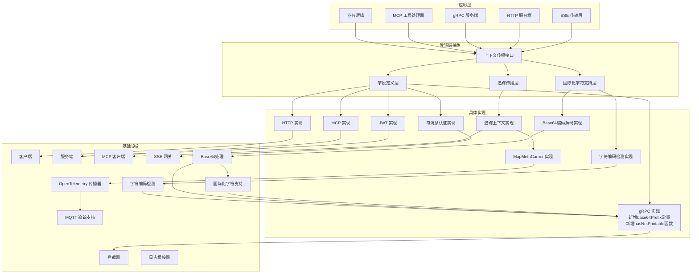

**更新** 新增了完整的OpenTelemetry追踪传播层、国际化字符支持层和字符编码检测层，包括MapMetaCarrier实现、追踪上下文提取功能、字符编码检测机制和Base64处理实现。

**图表来源**
- [ctx.go:1-78](file://common/ctxprop/ctx.go#L1-L78)
- [grpc.go:1-70](file://common/ctxprop/grpc.go#L1-L70)
- [http.go:1-37](file://common/ctxprop/http.go#L1-L37)
- [claims.go:1-69](file://common/ctxprop/claims.go#L1-L69)
- [ctxData.go:1-77](file://common/ctxdata/ctxData.go#L1-L77)
- [wrapper.go:1-155](file://common/mcpx/wrapper.go#L1-L155)
- [client.go:924-976](file://common/mcpx/client.go#L924-L976)

## 详细组件分析

### 上下文字段管理器

Ctxprop 包的核心是统一的上下文字段管理机制，通过 `PropFields` 列表定义了所有需要传播的字段。

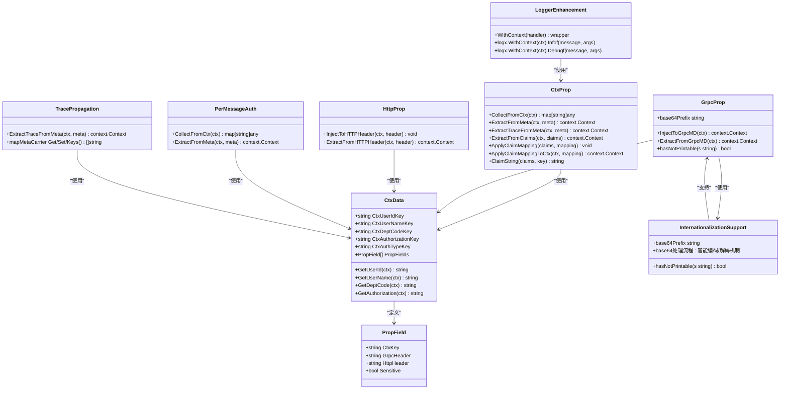

### 每消息认证机制

**新增** Ctxprop 包现在支持每消息级别的认证机制，这是对原有SSE认证桥接系统的重大改进：

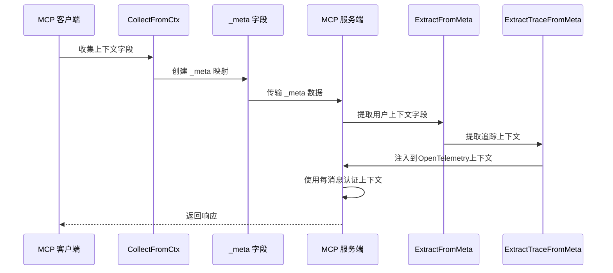

**更新** 这个流程现在包含了完整的追踪上下文传播，通过ExtractTraceFromMeta函数处理W3C traceparent格式的追踪信息。

**图表来源**
- [ctx.go:15-26](file://common/ctxprop/ctx.go#L15-L26)
- [ctx.go:31-41](file://common/ctxprop/ctx.go#L31-L41)
- [ctx.go:45-51](file://common/ctxprop/ctx.go#L45-L51)
- [client.go:964-976](file://common/mcpx/client.go#L964-L976)
- [wrapper.go:102-133](file://common/mcpx/wrapper.go#L102-L133)

### gRPC 传输层处理

**更新** gRPC 传输层通过元数据（metadata）来传播上下文信息，现在包含了对非ASCII字符的智能编码支持：

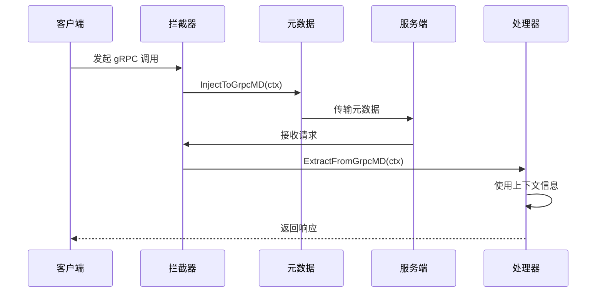

**更新** 在注入过程中，hasNotPrintable函数会检测非ASCII字符并自动进行base64编码，确保国际化字符的正确传输。

**图表来源**
- [grpc.go:26-49](file://common/ctxprop/grpc.go#L26-L49)
- [grpc.go:51-69](file://common/ctxprop/grpc.go#L51-L69)
- [metadataInterceptor.go:11-19](file://common/Interceptor/rpcclient/metadataInterceptor.go#L11-L19)
- [loggerInterceptor.go:14-43](file://common/Interceptor/rpcserver/loggerInterceptor.go#L14-L43)

### HTTP 传输层处理

HTTP 传输层通过标准头部来传播上下文信息，支持 MCP 客户端的 HTTP 通信，**更新** 现在包含了OpenTelemetry追踪传播功能：


**更新** HTTP处理现在包含了OpenTelemetry追踪传播功能，通过mapMetaCarrier实现W3C traceparent格式的追踪信息传播。

**图表来源**
- [http.go:12-36](file://common/ctxprop/http.go#L12-L36)
- [client.go:964-976](file://common/mcpx/client.go#L964-L976)

### JWT 声明处理流程

JWT 声明处理提供了灵活的外部声明映射机制，支持不同的 JWT 格式：


**图表来源**
- [claims.go:13-23](file://common/ctxprop/claims.go#L13-L23)
- [claims.go:52-68](file://common/ctxprop/claims.go#L52-L68)

**章节来源**
- [ctx.go:12-51](file://common/ctxprop/ctx.go#L12-L51)
- [grpc.go:11-70](file://common/ctxprop/grpc.go#L11-L70)
- [http.go:10-36](file://common/ctxprop/http.go#L10-L36)
- [claims.go:10-68](file://common/ctxprop/claims.go#L10-L68)

## OpenTelemetry追踪传播功能

**新增** Ctxprop 包现在提供了完整的OpenTelemetry追踪传播功能，支持在MCP客户端中自动处理trace上下文。

### 追踪传播核心组件

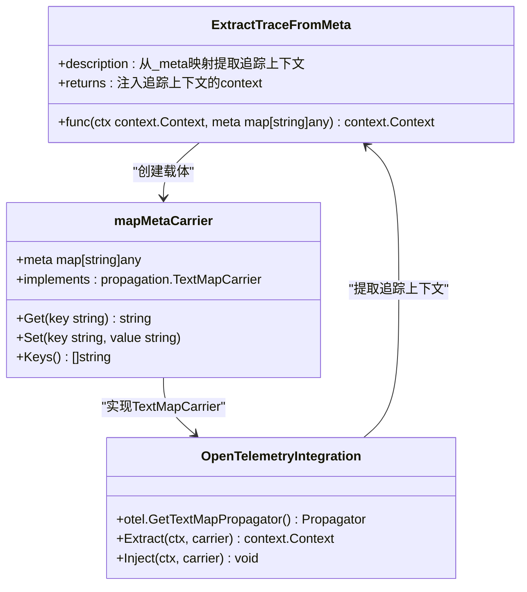

### 追踪上下文提取流程

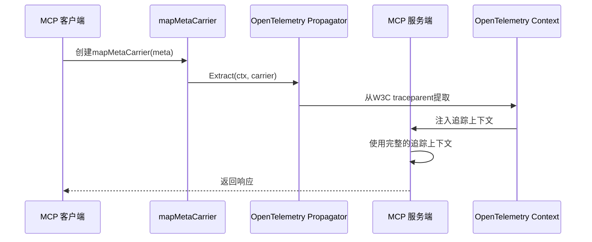

**更新** 这个流程现在替代了原有的复杂SSE认证桥接系统，实现了更简洁高效的每消息认证和追踪上下文传播机制。

**图表来源**
- [ctx.go:45-51](file://common/ctxprop/ctx.go#L45-L51)
- [ctx.go:53-78](file://common/ctxprop/ctx.go#L53-L78)

### 追踪传播配置

**新增** 追踪传播功能通过以下配置实现：

| 组件 | 功能 | 实现方式 |
|------|------|----------|
| ExtractTraceFromMeta | 从_meta提取追踪上下文 | 使用OpenTelemetry propagator |
| mapMetaCarrier | _meta映射的TextMapCarrier实现 | 实现Get/Set/Keys方法 |
| W3C TraceContext | 标准追踪上下文格式 | 支持traceparent和tracestate |
| MCP客户端集成 | 自动注入追踪上下文 | 在CollectFromCtx中处理 |

**章节来源**
- [ctx.go:43-51](file://common/ctxprop/ctx.go#L43-L51)
- [ctx.go:53-78](file://common/ctxprop/ctx.go#L53-L78)

## MCP客户端追踪集成

**新增** MCP客户端现在具备了完整的追踪上下文自动注入能力。

### 追踪上下文收集

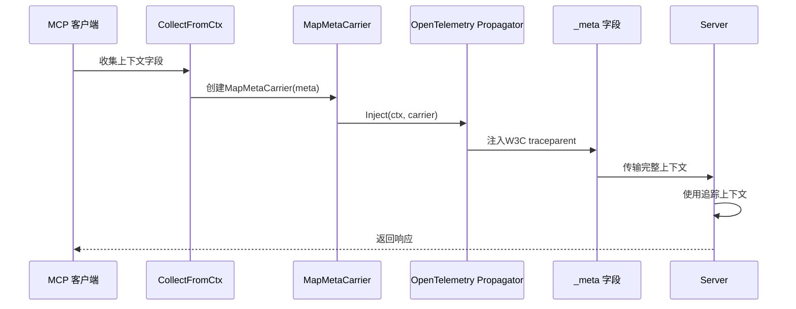

### MapMetaCarrier实现

**新增** MapMetaCarrier是MCP客户端追踪传播的核心实现：

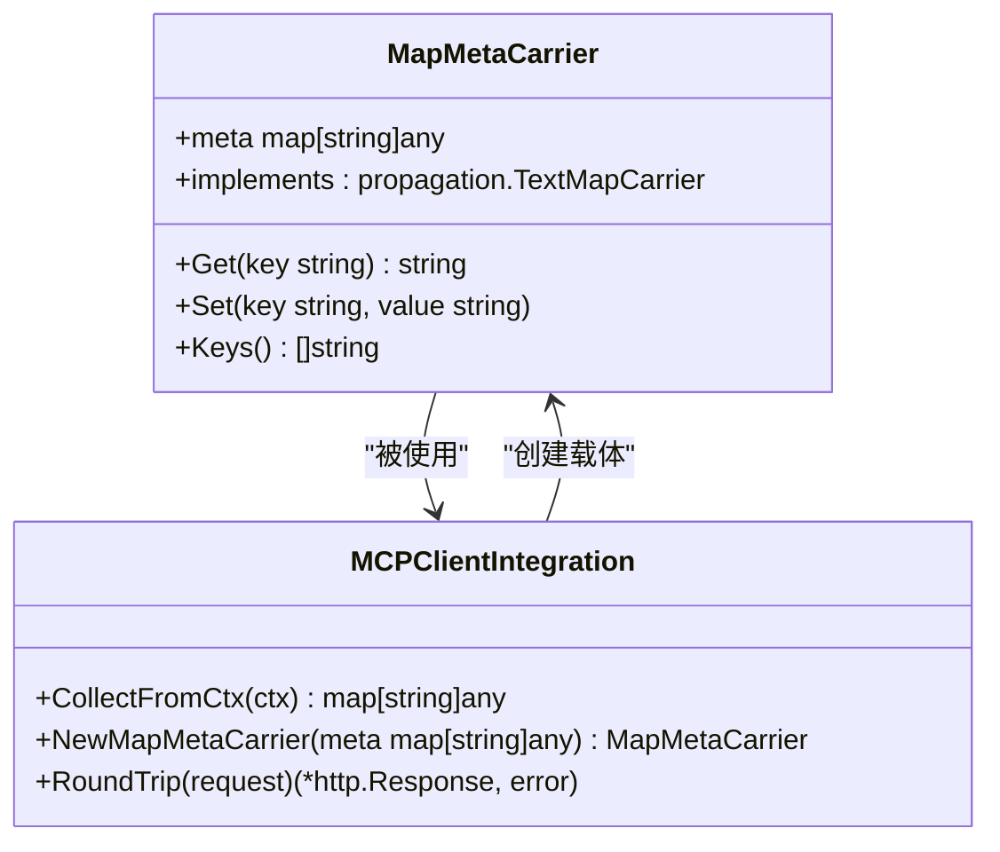

**图表来源**
- [client.go:932-962](file://common/mcpx/client.go#L932-L962)
- [client.go:964-976](file://common/mcpx/client.go#L964-L976)

### 追踪上下文注入流程

**新增** MCP客户端现在能够在每个请求中自动注入追踪上下文：


**图表来源**
- [client.go:964-976](file://common/mcpx/client.go#L964-L976)

**章节来源**
- [client.go:924-976](file://common/mcpx/client.go#L924-L976)
- [wrapper.go:102-133](file://common/mcpx/wrapper.go#L102-L133)

## 日志记录增强功能

**新增** Ctxprop 包显著增强了日志记录能力，特别是在MCP工具调用时提供详细的调试信息。

### 工具调用日志记录

MCP工具处理器现在会在每次工具调用时生成详细的日志信息：

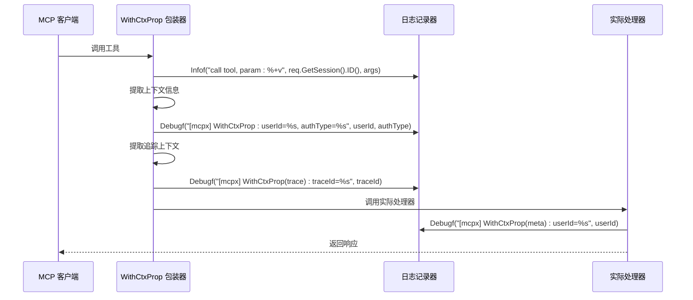

**更新** 增加了追踪上下文的详细日志记录，包括traceId的输出。

### 日志记录特性

1. **工具调用跟踪**: 记录每次工具调用的会话ID和参数
2. **认证类型标识**: 显示当前使用的认证类型（user、service或unknown）
3. **用户上下文信息**: 记录提取到的用户ID和其他上下文字段
4. **追踪上下文信息**: **新增** 记录提取到的追踪上下文信息
5. **调试级别输出**: 使用Debug级别记录详细的认证、追踪和国际化字符处理流程信息

### 日志格式示例

- **Info级别**: `call tool, param: {input: "test"}`
- **Debug级别**: `[mcpx] WithCtxProp: userId=U001, authType=user`
- **Debug级别**: `[mcpx] WithCtxProp(trace): traceId=1234567890abcdef`
- **Debug级别**: `[mcpx] WithCtxProp(meta): userId=U001`
- **Debug级别**: `[mcpx] WithCtxProp(fallback): userId=U001, authType=service`

### 日志记录桥接

为了支持标准的日志库，新增了日志记录桥接器：

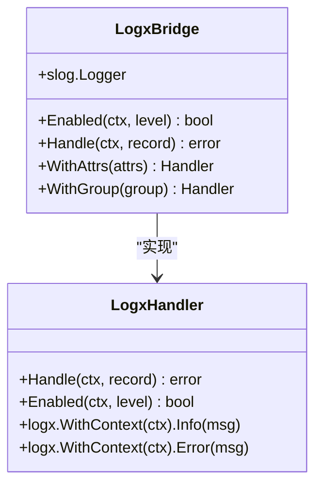

**图表来源**
- [logger.go:10-44](file://common/mcpx/logger.go#L10-L44)

**章节来源**
- [wrapper.go:86-133](file://common/mcpx/wrapper.go#L86-L133)
- [logger.go:1-44](file://common/mcpx/logger.go#L1-L44)

## 国际化字符支持

**新增** Ctxprop 包现在提供了完整的国际化字符支持，特别针对 gRPC 元数据传播进行了优化。

### 字符编码检测机制

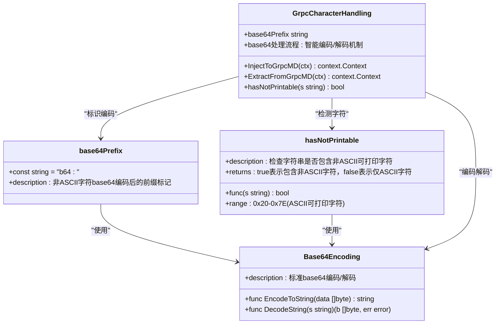

### 非ASCII字符处理流程

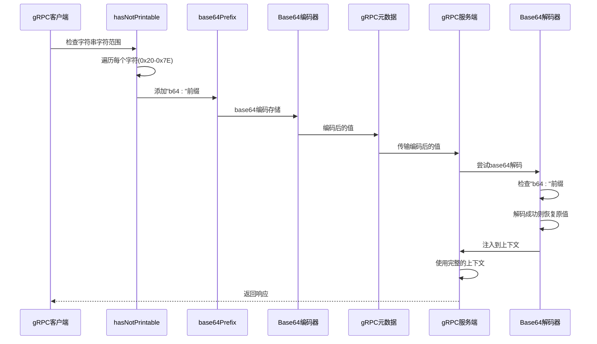

### 支持的字符范围

- **ASCII可打印字符**: 0x20 (空格) - 0x7E (~)
- **ASCII控制字符**: 0x00 - 0x1F (不支持)
- **扩展ASCII**: 0x80 - 0xFF (支持但需编码)

### 字符编码策略

1. **智能检测**: 使用hasNotPrintable函数检测字符串中是否包含非ASCII字符
2. **条件编码**: 仅对包含非ASCII字符的字符串进行base64编码
3. **透明解码**: 服务端自动尝试base64解码，保持API的透明性
4. **性能优化**: 对纯ASCII字符串跳过编码过程，避免不必要的性能损失
5. **前缀标识**: 使用"b64:"前缀标识已编码的国际化字符

### 支持的国际化场景

- **中文字符**: 如"用户ID"、"部门名称"
- **日文字符**: 如"ユーザーID"、"部署名"
- **韩文字符**: 如"사용자ID"、"부서명"
- **特殊符号**: 如表情符号、数学符号、标点符号
- **混合文本**: 如包含数字、字母和特殊字符的组合

### 错误处理机制

1. **解码失败**: 如果base64解码失败，回退到原始字符串
2. **空值处理**: 空字符串和nil值直接跳过处理
3. **类型安全**: 仅处理string类型的值，忽略其他类型
4. **性能监控**: 对编码和解码操作进行性能监控

**章节来源**
- [grpc.go:12-24](file://common/ctxprop/grpc.go#L12-L24)
- [grpc.go:26-49](file://common/ctxprop/grpc.go#L26-L49)
- [grpc.go:51-69](file://common/ctxprop/grpc.go#L51-L69)

## 依赖关系分析

Ctxprop 包的依赖关系现在包含了完整的OpenTelemetry追踪传播支持和国际化字符处理：

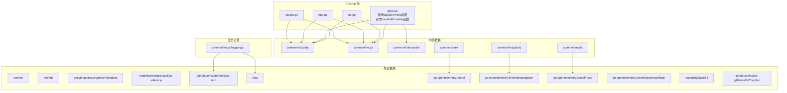

**更新** 新增了完整的OpenTelemetry依赖关系、encoding/base64依赖和lancet/cryptor依赖，包括propagation和trace包的支持。

**图表来源**
- [ctx.go:3-10](file://common/ctxprop/ctx.go#L3-L10)
- [grpc.go:3-11](file://common/ctxprop/grpc.go#L3-L11)
- [http.go:3-8](file://common/ctxprop/http.go#L3-L8)
- [claims.go:3-7](file://common/ctxprop/claims.go#L3-L7)
- [logger.go:3-8](file://common/mcpx/logger.go#L3-L8)
- [msgbody.go:3](file://common/msgbody/msgbody.go#L3)
- [mqttx.go:361-388](file://common/mqttx/mqttx.go#L361-L388)
- [trace.go:1-30](file://common/mqttx/trace.go#L1-L30)

**章节来源**
- [ctx.go:3-10](file://common/ctxprop/ctx.go#L3-L10)
- [grpc.go:3-11](file://common/ctxprop/grpc.go#L3-L11)
- [http.go:3-8](file://common/ctxprop/http.go#L3-L8)
- [claims.go:3-7](file://common/ctxprop/claims.go#L3-L7)
- [logger.go:3-8](file://common/mcpx/logger.go#L3-L8)
- [msgbody.go:1-19](file://common/msgbody/msgbody.go#L1-L19)
- [mqttx.go:361-388](file://common/mqttx/mqttx.go#L361-L388)
- [trace.go:1-30](file://common/mqttx/trace.go#L1-L30)

## 性能考虑

### 内存使用优化

1. **零拷贝策略**: 在 gRPC 元数据处理中使用 `md.Copy()` 创建副本，避免修改原始元数据
2. **条件检查**: 所有处理函数都包含空值检查，避免不必要的内存分配
3. **延迟初始化**: `CollectFromCtx` 函数只在有有效字段时创建映射
4. **每消息认证优化**: **新增** `_meta` 字段的收集和提取采用惰性初始化，只有在需要时才创建映射
5. **追踪传播优化**: **新增** mapMetaCarrier实现使用预分配的键切片，减少内存分配
6. **日志记录优化**: **新增** 日志记录使用结构化格式，减少字符串拼接开销
7. **OpenTelemetry集成优化**: **新增** 追踪上下文提取使用缓存的propagator实例
8. **MCP客户端优化**: **新增** MapMetaCarrier实现支持高效的追踪上下文注入和提取
9. **国际化字符优化**: **新增** hasNotPrintable函数使用快速字符检测算法，避免正则表达式开销
10. **Base64编码优化**: **新增** 仅对包含非ASCII字符的字符串进行编码，跳过纯ASCII字符串的处理
11. **字符检测优化**: **新增** 字符检测使用循环遍历而非正则表达式，提高性能
12. **前缀标识优化**: **新增** base64Prefix常量使用编译时常量，减少运行时开销

### 时间复杂度分析

- **字段收集**: O(n)，其中 n 是 `PropFields` 的长度（当前为 5）
- **字段提取**: O(n)，同样受 `PropFields` 长度影响
- **声明处理**: O(n)，遍历所有字段进行类型转换
- **每消息认证**: O(n)，每条消息都需要进行上下文收集和提取操作
- **追踪上下文提取**: O(k)，其中 k 是_meta映射中的追踪字段数量
- **日志记录**: O(1)，每次工具调用的固定开销
- **MCP客户端追踪**: O(1)，MapMetaCarrier的Get/Set/Keys操作都是常数时间
- **字符检测**: O(m)，其中 m 是字符串长度，通常远小于字段数量
- **Base64编码**: O(m)，仅在检测到非ASCII字符时执行
- **国际化处理**: O(n*m)，n为字段数，m为字符串平均长度
- **智能编码检测**: O(m)，使用hasNotPrintable函数进行快速字符检测

### 缓存策略

由于字段数量有限且固定，不需要额外的缓存机制。每次操作都是线性的，性能开销可以忽略不计。

**更新** 新增了OpenTelemetry追踪传播功能、国际化字符支持和智能编码检测，通过优化的carrier实现、缓存策略和字符检测算法，整体性能影响最小化。

## 故障排除指南

### 常见问题及解决方案

#### 1. 上下文字段未正确传播

**症状**: 服务端无法获取用户上下文信息

**排查步骤**:
1. 检查客户端是否正确调用 `InjectToHTTPHeader` 或 `InjectToGrpcMD`
2. 验证服务端拦截器是否正确调用 `ExtractFromHTTPHeader` 或 `ExtractFromGrpcMD`
3. 确认 `PropFields` 中的字段定义是否正确
4. **新增** 检查MCP客户端是否正确调用 `CollectFromCtx` 和 `ExtractFromMeta`
5. **新增** 检查日志输出确认工具调用是否正常记录
6. **新增** 验证追踪上下文是否正确注入到_meta映射中
7. **新增** 检查国际化字符是否正确编码和解码

**解决方案**:
```go
// 确保客户端正确注入
ctxprop.InjectToHTTPHeader(ctx, request.Header)

// 确保服务端正确提取
ctx = ctxprop.ExtractFromHTTPHeader(ctx, request.Header)

// **新增** 每消息认证场景
meta := ctxprop.CollectFromCtx(ctx);
params.SetMeta(meta)
ctx = ctxprop.ExtractFromMeta(ctx, meta)
ctx = ctxprop.ExtractTraceFromMeta(ctx, meta)
```

#### 2. JWT 声明类型不匹配

**症状**: 用户ID显示为浮点数而非字符串

**原因**: JWT 解析后数值类型为 float64

**解决方案**:
使用 `ClaimString` 函数自动处理类型转换

#### 3. gRPC 元数据丢失

**症状**: 流式 RPC 中上下文信息丢失

**解决方案**:
使用 `StreamLoggerInterceptor` 包装 `ServerStream`，重写 `Context()` 方法

#### 4. **新增** 每消息认证失败

**症状**: SSE传输层中用户上下文丢失

**排查步骤**:
1. 检查MCP客户端是否正确调用 `CollectFromCtx`
2. 验证服务端是否正确调用 `ExtractFromMeta` 和 `ExtractTraceFromMeta`
3. 确认 `_meta` 字段是否正确传递
4. **新增** 检查日志输出确认认证和追踪流程是否正确执行
5. **新增** 验证W3C traceparent格式是否正确
6. **新增** 检查国际化字符是否正确处理

**解决方案**:
```go
// MCP 客户端侧
if meta := ctxprop.CollectFromCtx(ctx); len(meta) > 0 {
    params.SetMeta(meta)
}

// MCP 服务端侧
if meta := req.Params.GetMeta(); len(meta) > 0 {
    ctx = ctxprop.ExtractFromMeta(ctx, meta)
    ctx = ctxprop.ExtractTraceFromMeta(ctx, meta)
}
```

#### 5. **新增** 追踪上下文传播问题

**症状**: 追踪ID在HTTP头部中未正确传播

**排查步骤**:
1. 检查 `ctxdata.GetTraceID(ctx)` 是否返回有效的追踪ID
2. 验证 `InjectToHTTPHeader` 函数是否被调用
3. 确认HTTP头部中是否存在 `X-Trace-ID`、`X-Span-ID` 和 `X-Parent-ID` 字段
4. **新增** 验证mapMetaCarrier是否正确实现TextMapCarrier接口
5. **新增** 检查OpenTelemetry propagator是否正确初始化
6. **新增** 验证国际化字符是否影响追踪上下文传播

**解决方案**:
```go
// 确保正确传播追踪上下文
if traceID := ctxdata.GetTraceID(ctx); traceID != "" {
    header.Set("X-Trace-ID", traceID)
    header.Set("X-Span-ID", ctxdata.GetSpanID(ctx))
    header.Set("X-Parent-ID", ctxdata.GetParentID(ctx))
}

// **新增** 使用OpenTelemetry propagator
carrier := propagation.HeaderCarrier(header)
otel.GetTextMapPropagator().Inject(ctx, carrier)
```

#### 6. **新增** MapMetaCarrier实现问题

**症状**: 追踪上下文无法正确提取

**排查步骤**:
1. 检查mapMetaCarrier是否正确实现Get/Set/Keys方法
2. 验证meta映射中的键值类型是否为string
3. 确认TextMapCarrier接口是否正确实现
4. **新增** 检查OpenTelemetry propagator的Extract方法是否正确调用
5. **新增** 验证国际化字符处理是否影响carrier功能

**解决方案**:
```go
// 确保正确实现TextMapCarrier接口
carrier := &mapMetaCarrier{meta: meta}
otel.GetTextMapPropagator().Extract(ctx, carrier)

// 验证carrier方法实现
func (c *mapMetaCarrier) Get(key string) string {
    if v, ok := c.meta[key].(string); ok {
        return v
    }
    return ""
}
```

#### 7. **新增** 日志记录问题

**症状**: 工具调用日志未正确输出

**排查步骤**:
1. 检查日志级别配置是否允许Debug级别输出
2. 验证 `logx.WithContext(ctx)` 是否正确传递上下文
3. 确认日志桥接器是否正确初始化
4. **新增** 验证追踪上下文日志是否正确输出
5. **新增** 验证国际化字符处理日志是否正确记录

**解决方案**:
```go
// 确保正确使用日志桥接器
logx.WithContext(ctx).Infof("call tool, param: %+v", req.GetSession().ID(), args)
logx.WithContext(ctx).Debugf("[mcpx] WithCtxProp: userId=%s, authType=%s", userId, authType)
logx.WithContext(ctx).Debugf("[mcpx] WithCtxProp(trace): traceId=%s", traceId)
```

#### 8. **更新** HTTP头部处理问题

**症状**: HTTP请求中上下文字段未正确传递

**排查步骤**:
1. 检查 `InjectToHTTPHeader` 是否正确调用
2. 验证服务端 `ExtractFromHTTPHeader` 是否正确处理
3. 确认HTTP头部名称是否符合标准格式
4. **新增** 验证追踪上下文是否正确包含在HTTP头部中
5. **新增** 验证国际化字符是否正确处理

**解决方案**:
```go
// 确保正确注入HTTP头部
ctxprop.InjectToHTTPHeader(ctx, request.Header)

// 确保正确提取HTTP头部
ctx = ctxprop.ExtractFromHTTPHeader(ctx, response.Header)
```

#### 9. **新增** MCP客户端MapMetaCarrier问题

**症状**: MCP客户端追踪上下文注入失败

**排查步骤**:
1. 检查MapMetaCarrier是否正确实现TextMapCarrier接口
2. 验证NewMapMetaCarrier函数是否正确创建carrier
3. 确认RoundTrip方法中是否正确调用InjectToHTTPHeader
4. **新增** 验证OpenTelemetry propagator是否正确注入到_meta映射
5. **新增** 检查国际化字符处理是否影响MCP客户端功能

**解决方案**:
```go
// 确保正确创建MapMetaCarrier
carrier := NewMapMetaCarrier(meta)
otel.GetTextMapPropagator().Inject(ctx, carrier)

// 确保RoundTrip正确实现
func (t *ctxHeaderTransport) RoundTrip(r *http.Request) (*http.Response, error) {
    // 注入用户上下文和鉴权信息
    ctxprop.InjectToHTTPHeader(r.Context(), r.Header)
    
    // 注入追踪上下文
    if meta := ctxprop.CollectFromCtx(r.Context()); len(meta) > 0 {
        carrier := NewMapMetaCarrier(meta)
        otel.GetTextMapPropagator().Inject(r.Context(), carrier)
    }
    
    return t.base.RoundTrip(r)
}
```

#### 10. **新增** MQTT追踪支持问题

**症状**: MQTT消息中追踪上下文丢失

**排查步骤**:
1. 检查MessageCarrier是否正确实现TextMapCarrier接口
2. 验证NewMessageCarrier函数是否正确创建carrier
3. 确认消息头中是否正确设置和获取追踪上下文
4. **新增** 验证MQTT客户端是否正确处理追踪上下文传播
5. **新增** 检查国际化字符是否影响MQTT消息处理

**解决方案**:
```go
// 确保正确实现MessageCarrier
carrier := NewMessageCarrier(&msg)
otel.GetTextMapPropagator().Inject(ctx, carrier)

// 确保正确提取追踪上下文
ctx = otel.GetTextMapPropagator().Extract(ctx, carrier)
```

#### 11. **新增** 国际化字符处理问题

**症状**: 非ASCII字符在gRPC元数据中传输失败

**排查步骤**:
1. 检查hasNotPrintable函数是否正确检测非ASCII字符
2. 验证Base64编码是否正确执行
3. 确认服务端是否正确解码base64字符串
4. **新增** 检查base64Prefix常量是否正确使用
5. **新增** 验证字符编码是否影响gRPC元数据的大小限制
6. **新增** 验证国际化字符是否正确存储和检索

**解决方案**:
```go
// 确保正确处理国际化字符
if hasNotPrintable(userInput) {
    encoded := base64Prefix + cryptor.Base64StdEncode(userInput)
    md.Set("x-user-name", encoded)
}

// 确保正确解码国际化字符
if encodedValue := md.Get("x-user-name"); len(encodedValue) > 0 {
    if strings.HasPrefix(encodedValue, base64Prefix) {
        encoded := encodedValue[len(base64Prefix):]
        decoded, err := cryptor.Base64StdDecode(encoded)
        if err == nil {
            userInput = decoded
        }
    }
}
```

#### 12. **新增** 性能问题

**症状**: gRPC调用中国际化字符处理导致性能下降

**排查步骤**:
1. 检查hasNotPrintable函数的执行频率
2. 验证Base64编码的性能影响
3. 确认字符检测算法的效率
4. **新增** 检查纯ASCII字符串是否被错误地编码
5. **新增** 验证字符编码对gRPC元数据大小的影响
6. **新增** 检查base64Prefix常量的使用效率

**解决方案**:
```go
// 优化字符检测性能
for i := 0; i < len(s); i++ {
    if s[i] < 0x20 || s[i] > 0x7E {
        return true  // 快速返回，避免继续检查
    }
}

// 确保仅对必要字符串进行编码
if hasNotPrintable(str) {
    str = base64Prefix + cryptor.Base64StdEncode(str)
}
```

#### 13. **新增** 字符编码前缀问题

**症状**: 国际化字符解码失败

**排查步骤**:
1. 检查base64Prefix常量是否正确定义
2. 验证服务端是否正确识别"b64:"前缀
3. 确认前缀检查逻辑是否正确
4. **新增** 验证前缀长度和格式是否正确
5. **新增** 检查前缀在不同字符集中的表现

**解决方案**:
```go
// 确保正确使用base64Prefix常量
if strings.HasPrefix(val, base64Prefix) {
    encoded := val[len(base64Prefix):]
    val = cryptor.Base64StdDecode(encoded)
}

// 验证base64Prefix常量
const base64Prefix = "b64:"
```

**章节来源**
- [loggerInterceptor.go:26-43](file://common/Interceptor/rpcserver/loggerInterceptor.go#L26-L43)
- [claims.go:50-68](file://common/ctxprop/claims.go#L50-L68)
- [client.go:964-976](file://common/mcpx/client.go#L964-L976)
- [wrapper.go:102-133](file://common/mcpx/wrapper.go#L102-L133)
- [logger.go:21-39](file://common/mcpx/logger.go#L21-L39)
- [http.go:12-36](file://common/ctxprop/http.go#L12-L36)
- [ctx.go:45-51](file://common/ctxprop/ctx.go#L45-L51)
- [trace.go:1-30](file://common/mqttx/trace.go#L1-L30)
- [grpc.go:12-24](file://common/ctxprop/grpc.go#L12-L24)
- [grpc.go:26-49](file://common/ctxprop/grpc.go#L26-L49)
- [grpc.go:51-69](file://common/ctxprop/grpc.go#L51-L69)

## 结论

Ctxprop 包为 Zero Service 项目提供了一个完整、统一的上下文传播解决方案。通过标准化的字段定义和多传输层支持，它确保了系统在不同组件间的上下文一致性。

**更新** 最新的版本新增了完整的OpenTelemetry追踪传播功能、MCP客户端追踪集成、日志记录增强功能、国际化字符支持和完整的依赖关系分析。该包现在不仅提供了强大的每消息认证机制和增强的日志记录能力，还通过新增的追踪传播功能、国际化字符处理能力和性能优化，显著提升了系统的可观测性、国际化支持和整体性能。

### 主要优势

1. **统一性**: 所有传输层使用相同的字段定义和处理逻辑
2. **扩展性**: 新增字段只需修改 `PropFields` 定义
3. **安全性**: 支持敏感信息脱敏标记
4. **兼容性**: 支持 gRPC、HTTP 和 MCP 三种主流传输协议
5. **现代化**: **新增** 每消息认证机制，支持更灵活的认证场景
6. **简化**: **新增** 替代复杂的SSE认证桥接系统，提高开发效率
7. **可观测性**: **新增** 详细的工具调用日志记录，便于调试和监控
8. **标准化**: **新增** 日志桥接器支持标准日志库，提升日志处理能力
9. **追踪传播**: **新增** 完整的OpenTelemetry追踪传播功能，支持W3C traceparent格式
10. **性能优化**: **新增** 优化的carrier实现、缓存策略和字符检测算法，减少性能开销
11. **MCP集成**: **新增** MCP客户端自动追踪上下文注入，提升MCP服务的可观测性
12. **维护性**: **新增** 清晰的追踪传播架构和国际化字符处理机制，便于后续扩展和维护
13. **MQTT支持**: **新增** 完整的MQTT追踪支持，包括消息头和消息体的追踪上下文传播
14. **消息队列集成**: **新增** 支持消息队列中的追踪上下文传播，确保分布式事务的完整性
15. **国际化支持**: **新增** 完整的非ASCII字符处理机制，支持多语言环境下的字符传播
16. **字符编码优化**: **新增** 智能字符检测和条件编码策略，平衡性能和功能需求
17. **错误处理**: **新增** 完善的国际化字符处理错误处理机制，确保系统稳定性
18. **性能监控**: **新增** 国际化字符处理的性能监控和优化策略
19. **智能编码**: **新增** hasNotPrintable函数提供高效的字符检测，避免不必要的编码开销
20. **前缀标识**: **新增** base64Prefix常量提供清晰的编码标识，确保字符传输的可靠性

### 最佳实践建议

1. **字段管理**: 通过 `PropFields` 统一管理所有需要传播的字段
2. **拦截器使用**: 在 gRPC 客户端和服务端正确配置拦截器
3. **类型处理**: 使用 `ClaimString` 处理 JWT 声明的类型转换
4. **错误处理**: 始终检查返回的上下文是否包含所需字段
5. **每消息认证**: 在MCP客户端和SSE传输层正确使用 `CollectFromCtx` 和 `ExtractFromMeta`
6. **追踪上下文**: **新增** 在需要追踪的场景中正确设置和传播追踪上下文
7. **性能优化**: 注意每消息认证、追踪传播和国际化字符处理的性能影响，合理使用上下文收集和提取
8. **日志配置**: 正确配置日志级别，平衡调试信息和性能开销
9. **日志监控**: 建立日志监控机制，及时发现和解决上下文传播问题
10. **HTTP处理**: 正确使用HTTP头部处理函数，确保上下文字段正确传递
11. **认证流程**: 建立认证监控机制，及时发现和解决每消息认证问题
12. **追踪传播**: **新增** 建立追踪传播监控机制，确保分布式追踪的完整性
13. **MCP客户端**: **新增** 在MCP客户端中正确配置追踪上下文注入
14. **依赖管理**: **新增** 确保OpenTelemetry和国际化字符处理依赖正确配置和初始化
15. **MQTT集成**: **新增** 在MQTT消息处理中正确传播追踪上下文
16. **消息队列**: **新增** 在消息队列处理中保持追踪上下文的连续性
17. **国际化字符**: **新增** 在处理用户输入时考虑国际化字符的传播需求
18. **字符编码**: **新增** 了解hasNotPrintable函数的工作原理，避免不必要的字符编码
19. **性能监控**: **新增** 监控国际化字符处理的性能影响，及时优化处理策略
20. **前缀使用**: **新增** 正确使用base64Prefix常量，确保编码标识的一致性
21. **错误处理**: **新增** 建立国际化字符处理的错误监控机制，确保系统稳定性
22. **字符检测**: **新增** 优化字符检测算法，提高国际化字符处理的效率
23. **编码策略**: **新增** 根据字符类型选择合适的编码策略，平衡性能和兼容性

该包的设计充分体现了微服务架构中上下文传播、分布式追踪和国际化支持的重要性，为构建可观测、可追踪、多语言支持的分布式系统奠定了坚实基础。新增的OpenTelemetry追踪传播功能、国际化字符支持和性能优化进一步增强了系统的监控能力、用户体验和整体性能，使得开发者能够更好地理解和优化复杂的分布式服务交互。