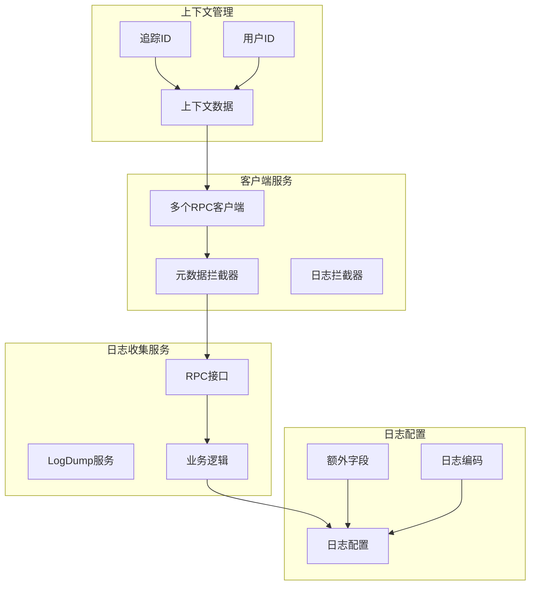
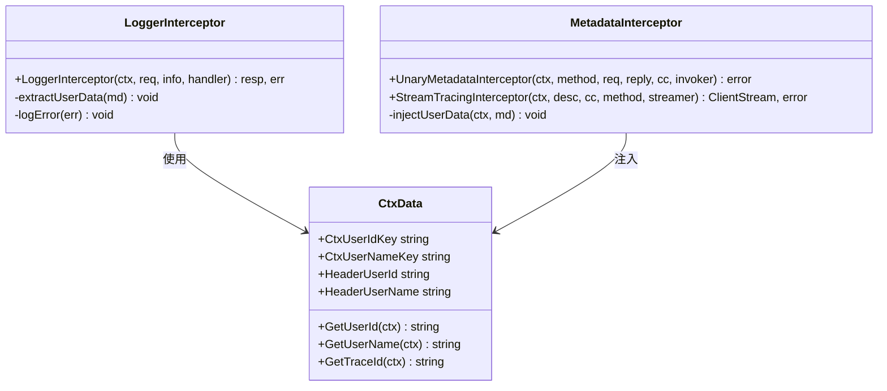
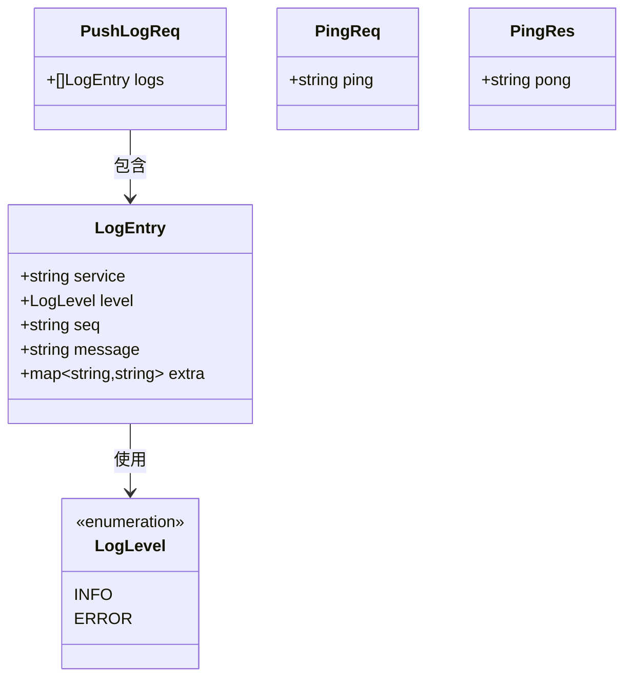
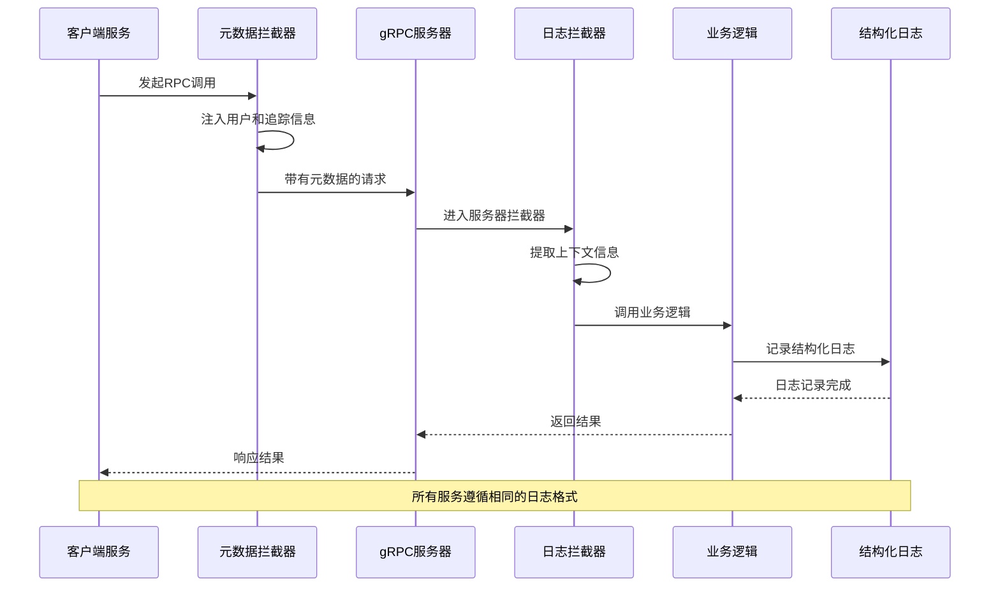
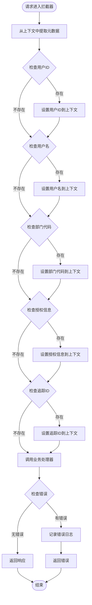
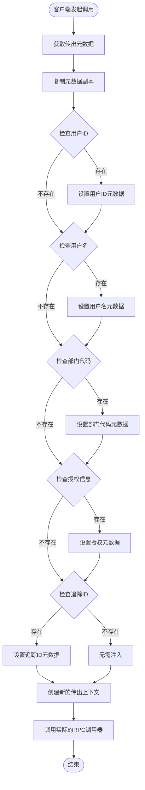
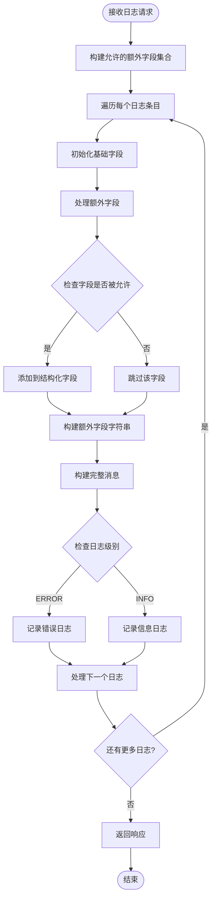
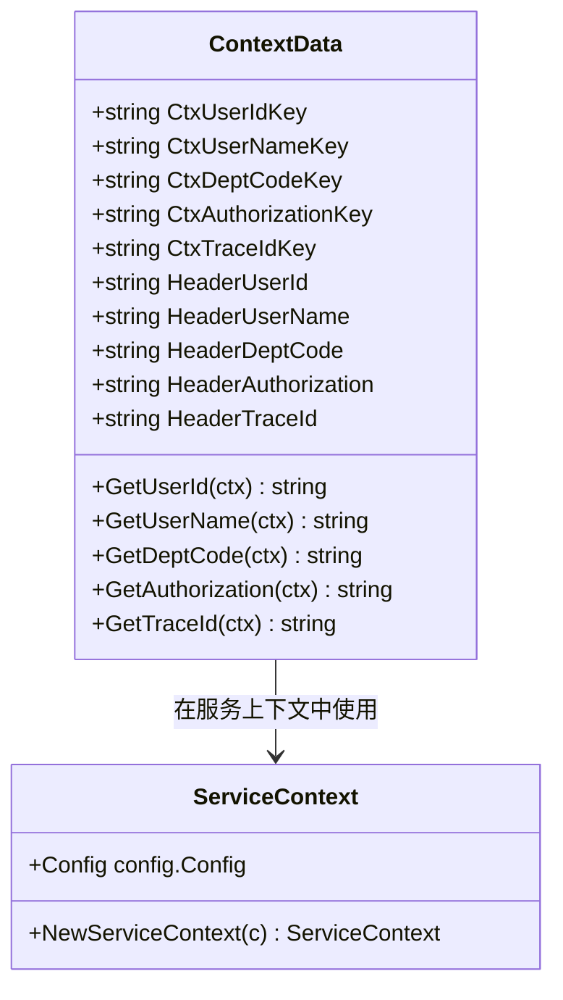
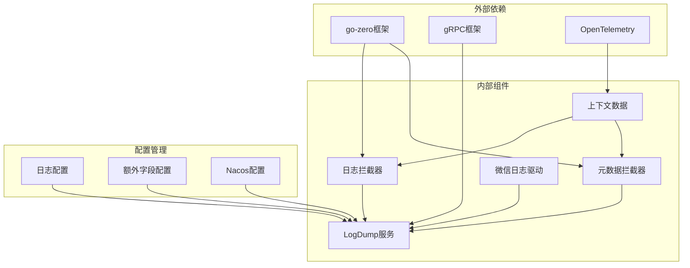

# 日志一致性

<cite>
**本文档引用的文件**
- [loggerInterceptor.go](file://common/Interceptor/rpcserver/loggerInterceptor.go)
- [metadataInterceptor.go](file://common/Interceptor/rpcclient/metadataInterceptor.go)
- [ctxData.go](file://common/ctxdata/ctxData.go)
- [logdump.yaml](file://app/logdump/etc/logdump.yaml)
- [logdump.go](file://app/logdump/logdump.go)
- [pinglogic.go](file://app/logdump/internal/logic/pinglogic.go)
- [pushloglogic.go](file://app/logdump/internal/logic/pushloglogic.go)
- [logdump_grpc.pb.go](file://app/logdump/logdump/logdump_grpc.pb.go)
- [logdump.pb.go](file://app/logdump/logdump/logdump.pb.go)
- [errorhandler.go](file://common/gtwx/errorhandler.go)
- [cors.go](file://common/gtwx/cors.go)
- [types.go](file://common/powerwechatx/types.go)
- [servicecontext.go](file://zerorpc/internal/svc/servicecontext.go)
</cite>

## 目录
1. [简介](#简介)
2. [项目结构](#项目结构)
3. [核心组件](#核心组件)
4. [架构概览](#架构概览)
5. [详细组件分析](#详细组件分析)
6. [依赖关系分析](#依赖关系分析)
7. [性能考虑](#性能考虑)
8. [故障排除指南](#故障排除指南)
9. [结论](#结论)

## 简介

本项目中的日志一致性方案旨在建立一个统一的日志管理机制，确保分布式系统中各个服务的日志格式、内容和传输方式保持一致。该方案通过gRPC服务、中间件拦截器、上下文数据传递和结构化日志输出来实现跨服务的日志标准化。

日志一致性对于现代微服务架构至关重要，它能够：
- 提供统一的日志格式和结构
- 支持跨服务的链路追踪
- 实现日志的集中管理和分析
- 确保关键业务信息的一致性记录

## 项目结构

项目采用模块化的微服务架构，每个服务都遵循统一的日志处理模式：

**图表来源**
- [logdump.go:27-70](file://app/logdump/logdump.go#L27-L70)
- [loggerInterceptor.go:12-44](file://common/Interceptor/rpcserver/loggerInterceptor.go#L12-L44)
- [metadataInterceptor.go:11-32](file://common/Interceptor/rpcclient/metadataInterceptor.go#L11-L32)

**章节来源**
- [logdump.go:27-70](file://app/logdump/logdump.go#L27-L70)
- [logdump.yaml:1-26](file://app/logdump/etc/logdump.yaml#L1-L26)

## 核心组件

### 日志拦截器系统

日志拦截器是实现日志一致性的核心组件，负责在RPC请求处理过程中自动注入和处理日志信息。

**图表来源**
- [loggerInterceptor.go:12-44](file://common/Interceptor/rpcserver/loggerInterceptor.go#L12-L44)
- [metadataInterceptor.go:11-32](file://common/Interceptor/rpcclient/metadataInterceptor.go#L11-L32)
- [ctxData.go:9-24](file://common/ctxdata/ctxData.go#L9-L24)

### 日志数据模型

LogDump服务使用标准化的日志数据模型来确保所有服务发送的日志格式一致：

**图表来源**
- [logdump.pb.go:113-146](file://app/logdump/logdump/logdump.pb.go#L113-L146)
- [logdump.pb.go:334-337](file://app/logdump/logdump/logdump.pb.go#L334-L337)

**章节来源**
- [loggerInterceptor.go:12-44](file://common/Interceptor/rpcserver/loggerInterceptor.go#L12-L44)
- [metadataInterceptor.go:11-32](file://common/Interceptor/rpcclient/metadataInterceptor.go#L11-L32)
- [ctxData.go:9-24](file://common/ctxdata/ctxData.go#L9-L24)

## 架构概览

整个日志一致性架构通过以下流程实现：

**图表来源**
- [logdump.go:38-64](file://app/logdump/logdump.go#L38-L64)
- [loggerInterceptor.go:12-44](file://common/Interceptor/rpcserver/loggerInterceptor.go#L12-L44)
- [metadataInterceptor.go:11-32](file://common/Interceptor/rpcclient/metadataInterceptor.go#L11-L32)

## 详细组件分析

### 日志拦截器实现

日志拦截器负责在RPC请求到达业务逻辑之前提取和处理上下文信息：

**图表来源**
- [loggerInterceptor.go:12-44](file://common/Interceptor/rpcserver/loggerInterceptor.go#L12-L44)

**章节来源**
- [loggerInterceptor.go:12-44](file://common/Interceptor/rpcserver/loggerInterceptor.go#L12-L44)

### 元数据拦截器实现

元数据拦截器负责在客户端调用RPC服务时注入必要的上下文信息：

**图表来源**
- [metadataInterceptor.go:11-32](file://common/Interceptor/rpcclient/metadataInterceptor.go#L11-L32)

**章节来源**
- [metadataInterceptor.go:11-32](file://common/Interceptor/rpcclient/metadataInterceptor.go#L11-L32)

### 日志数据处理逻辑

LogDump服务的核心逻辑负责处理和格式化接收到的日志条目：

**图表来源**
- [pushloglogic.go:28-67](file://app/logdump/internal/logic/pushloglogic.go#L28-L67)

**章节来源**
- [pushloglogic.go:28-67](file://app/logdump/internal/logic/pushloglogic.go#L28-L67)

### 上下文数据管理

上下文数据系统确保用户信息和追踪信息在整个请求生命周期中保持一致：

**图表来源**
- [ctxData.go:9-75](file://common/ctxdata/ctxData.go#L9-L75)
- [servicecontext.go:19-33](file://zerorpc/internal/svc/servicecontext.go#L19-L33)

**章节来源**
- [ctxData.go:9-75](file://common/ctxdata/ctxData.go#L9-L75)

## 依赖关系分析

日志一致性系统的依赖关系如下：

**图表来源**
- [logdump.go:3-23](file://app/logdump/logdump.go#L3-L23)
- [logdump.yaml:13-25](file://app/logdump/etc/logdump.yaml#L13-L25)

**章节来源**
- [logdump.go:3-23](file://app/logdump/logdump.go#L3-L23)
- [logdump.yaml:13-25](file://app/logdump/etc/logdump.yaml#L13-L25)

## 性能考虑

日志一致性系统在设计时充分考虑了性能影响：

### 异步日志处理
- 使用go-zero的异步日志机制减少阻塞
- 结构化日志输出避免格式化开销
- 批量日志处理支持高并发场景

### 内存优化
- 字段集合预分配避免动态扩容
- 字符串拼接使用缓冲区减少分配
- 上下文数据复用减少重复创建

### 网络优化
- gRPC二进制协议减少传输开销
- 元数据拦截器批量处理提高效率
- 连接池复用降低连接建立成本

## 故障排除指南

### 常见问题及解决方案

**日志格式不一致**
- 检查所有服务是否正确使用结构化日志
- 验证LogDump服务的额外字段配置
- 确认日志级别映射规则

**追踪ID丢失**
- 验证元数据拦截器是否正确注入追踪ID
- 检查上下文数据传递链路
- 确认gRPC元数据头名称一致性

**性能问题**
- 监控日志吞吐量和延迟
- 检查磁盘I/O性能
- 分析网络带宽使用情况

**章节来源**
- [errorhandler.go:18-35](file://common/gtwx/errorhandler.go#L18-L35)
- [cors.go:9-24](file://common/gtwx/cors.go#L9-L24)

## 结论

本项目的日志一致性方案通过以下关键特性实现了跨服务的日志标准化：

1. **统一的数据模型**：LogEntry结构确保所有服务发送的日志格式一致
2. **自动化的上下文传递**：元数据拦截器和日志拦截器自动处理用户和追踪信息
3. **结构化的日志输出**：基于go-zero的结构化日志系统提供高性能的日志记录
4. **灵活的配置管理**：支持动态配置额外字段和日志级别
5. **完整的监控集成**：与Nacos等监控系统无缝集成

该方案为微服务架构提供了可靠的日志基础设施，支持高效的日志收集、分析和故障排查，为系统的可观测性和可维护性奠定了坚实基础。