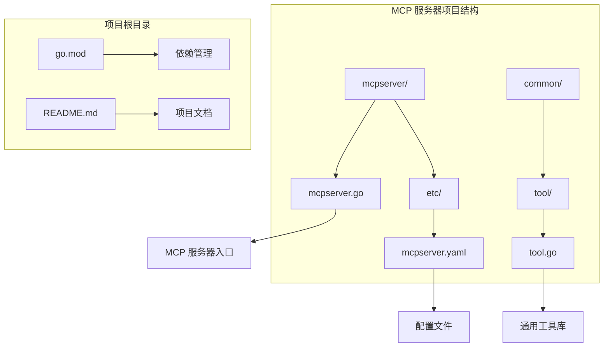
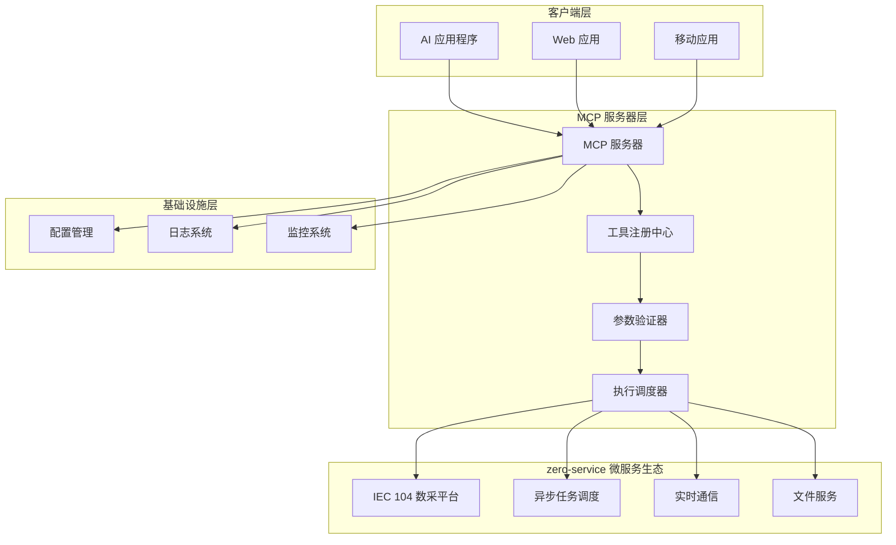
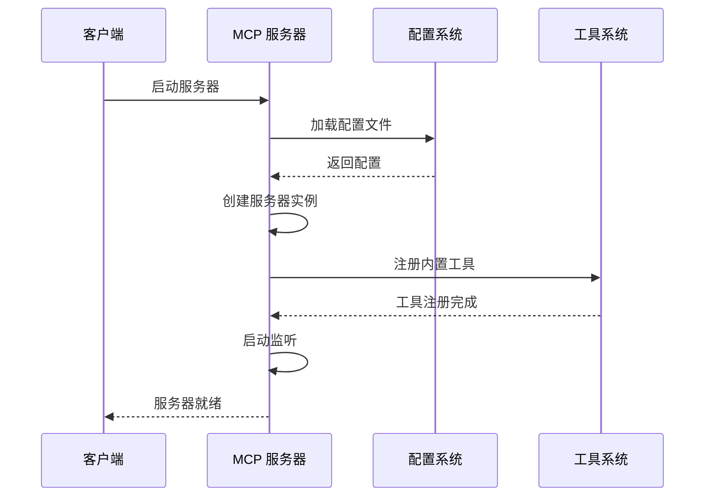
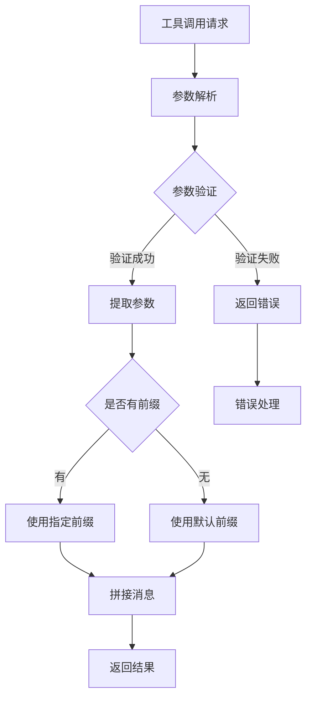
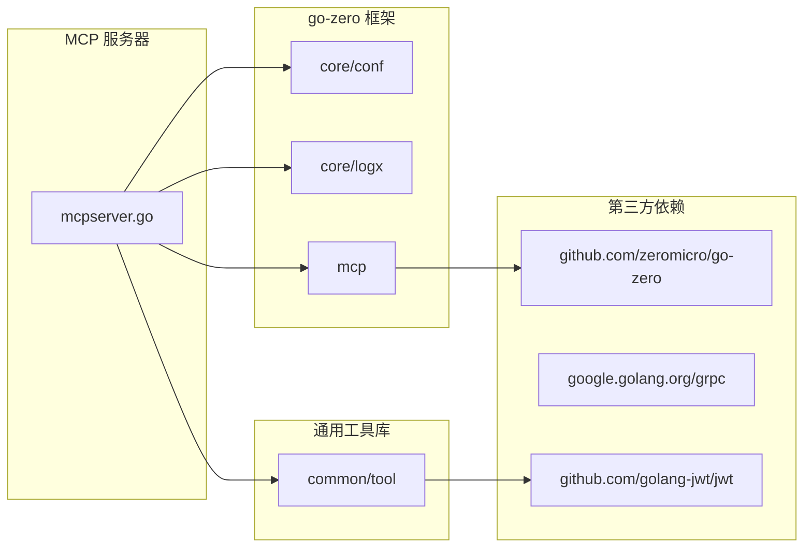

# MCP 服务器服务

<cite>
**本文档引用的文件**
- [mcpserver.go](file://aiapp/mcpserver/mcpserver.go)
- [mcpserver.yaml](file://aiapp/mcpserver/etc/mcpserver.yaml)
- [tool.go](file://common/tool/tool.go)
- [go.mod](file://go.mod)
- [README.md](file://README.md)
</cite>

## 目录
1. [简介](#简介)
2. [项目结构](#项目结构)
3. [核心组件](#核心组件)
4. [架构概览](#架构概览)
5. [详细组件分析](#详细组件分析)
6. [依赖分析](#依赖分析)
7. [性能考虑](#性能考虑)
8. [故障排除指南](#故障排除指南)
9. [结论](#结论)

## 简介

MCP（Model Context Protocol）服务器服务是基于 go-zero 微服务框架构建的智能助手工具平台。该服务实现了 MCP 协议，允许外部应用程序通过标准化的工具接口与系统进行交互。MCP 服务器提供了统一的工具注册、参数验证和执行机制，支持动态工具扩展和灵活的参数传递。

该项目作为 zero-service 微服务架构的重要组成部分，专注于提供智能化的工具服务能力和协议兼容性。通过 MCP 协议，系统能够与各种 AI 助手应用无缝集成，实现丰富的工具调用和参数处理功能。

## 项目结构

MCP 服务器服务位于 `aiapp/mcpserver/` 目录下，采用标准的 go-zero 项目结构：

**图表来源**
- [mcpserver.go:1-76](file://aiapp/mcpserver/mcpserver.go#L1-L76)
- [mcpserver.yaml:1-9](file://aiapp/mcpserver/etc/mcpserver.yaml#L1-L9)

**章节来源**
- [mcpserver.go:1-76](file://aiapp/mcpserver/mcpserver.go#L1-L76)
- [mcpserver.yaml:1-9](file://aiapp/mcpserver/etc/mcpserver.yaml#L1-L9)
- [README.md:59-108](file://README.md#L59-L108)

## 核心组件

### MCP 服务器核心架构

MCP 服务器基于 go-zero 框架构建，主要包含以下核心组件：

#### 1. 服务器初始化与配置
- **配置加载**：通过 `conf.MustLoad()` 加载 YAML 配置文件
- **服务器实例**：使用 `mcp.NewMcpServer()` 创建 MCP 服务器实例
- **日志配置**：禁用统计日志以减少性能开销

#### 2. 工具注册系统
- **工具定义**：通过 `mcp.Tool` 结构体定义工具属性
- **输入模式**：支持 JSON Schema 验证的参数输入
- **处理器接口**：提供统一的工具执行接口

#### 3. Echo 工具实现
系统内置了一个简单的 echo 工具作为演示示例：
- **名称**：echo
- **描述**：回显用户提供的消息
- **参数**：
  - message（必需）：要回显的消息
  - prefix（可选）：消息前缀，默认为 "Echo: "

**章节来源**
- [mcpserver.go:19-75](file://aiapp/mcpserver/mcpserver.go#L19-L75)
- [mcpserver.yaml:1-9](file://aiapp/mcpserver/etc/mcpserver.yaml#L1-L9)

## 架构概览

MCP 服务器在整个微服务架构中扮演着重要的工具服务角色：

**图表来源**
- [mcpserver.go:22-32](file://aiapp/mcpserver/mcpserver.go#L22-L32)
- [README.md:15-51](file://README.md#L15-L51)

## 详细组件分析

### MCP 服务器入口组件

#### 服务器初始化流程

**图表来源**
- [mcpserver.go:19-75](file://aiapp/mcpserver/mcpserver.go#L19-L75)

#### Echo 工具实现分析

Echo 工具展示了 MCP 协议的核心功能：

**图表来源**
- [mcpserver.go:52-68](file://aiapp/mcpserver/mcpserver.go#L52-L68)

**章节来源**
- [mcpserver.go:34-71](file://aiapp/mcpserver/mcpserver.go#L34-L71)

### 配置管理系统

#### 配置文件结构

MCP 服务器使用 YAML 格式的配置文件，支持以下关键配置项：

| 配置项 | 类型 | 描述 | 默认值 |
|--------|------|------|--------|
| Name | string | 服务器名称 | mcpserver |
| Host | string | 监听主机地址 | 0.0.0.0 |
| Port | int | 监听端口号 | 8888 |
| mcp.messageTimeout | string | 工具调用超时时间 | 30s |
| mcp.cors | array | CORS 允许的源列表 | [] |

**章节来源**
- [mcpserver.yaml:1-9](file://aiapp/mcpserver/etc/mcpserver.yaml#L1-L9)

### 通用工具库集成

#### 工具函数支持

MCP 服务器集成了通用工具库，提供了以下实用功能：

- **版本信息打印**：通过 `tool.PrintGoVersion()` 输出 Go 版本信息
- **JWT 令牌解析**：支持多种算法的 JWT 令牌验证
- **数据格式转换**：提供多种数据格式的转换工具
- **时间戳生成**：支持秒、毫秒、微秒级时间戳生成

**章节来源**
- [mcpserver.go:25-26](file://aiapp/mcpserver/mcpserver.go#L25-L26)
- [tool.go:201-204](file://common/tool/tool.go#L201-L204)

## 依赖分析

### 外部依赖关系

MCP 服务器主要依赖以下关键组件：

**图表来源**
- [mcpserver.go:6-15](file://aiapp/mcpserver/mcpserver.go#L6-L15)
- [go.mod:50-51](file://go.mod#L50-L51)

### 依赖版本要求

根据项目配置，MCP 服务器需要以下最低版本要求：

- **Go 语言**：1.25+
- **go-zero 框架**：1.10.0
- **JWT 处理**：v4.5.2

**章节来源**
- [go.mod:3-3](file://go.mod#L3-L3)
- [go.mod:50-51](file://go.mod#L50-L51)

## 性能考虑

### 服务器性能优化

MCP 服务器在性能方面采用了多项优化措施：

#### 1. 日志优化
- 禁用统计日志以减少性能开销
- 仅保留必要的调试信息

#### 2. 内存管理
- 使用高效的参数解析机制
- 避免不必要的数据复制

#### 3. 并发处理
- 支持多工具并发执行
- 合理的 goroutine 管理

### 工具执行性能

每个工具的执行都经过了性能优化：

- **参数验证**：使用 JSON Schema 进行快速验证
- **错误处理**：提供清晰的错误信息
- **超时控制**：支持工具调用超时设置

## 故障排除指南

### 常见问题诊断

#### 1. 服务器启动失败

**症状**：服务器无法正常启动
**可能原因**：
- 端口被占用
- 配置文件格式错误
- 权限不足

**解决方法**：
- 检查端口占用情况
- 验证 YAML 配置格式
- 确认运行权限

#### 2. 工具调用超时

**症状**：工具执行超时
**可能原因**：
- 工具执行时间过长
- 网络延迟过高
- 服务器负载过高

**解决方法**：
- 增加 `messageTimeout` 配置
- 优化工具执行逻辑
- 检查服务器资源使用情况

#### 3. 参数验证失败

**症状**：工具调用返回参数错误
**可能原因**：
- 参数类型不匹配
- 缺少必需参数
- 参数值超出范围

**解决方法**：
- 检查 JSON Schema 定义
- 验证参数格式
- 查看错误详细信息

**章节来源**
- [mcpserver.go:58-60](file://aiapp/mcpserver/mcpserver.go#L58-L60)
- [mcpserver.yaml:6-6](file://aiapp/mcpserver/etc/mcpserver.yaml#L6-L6)

## 结论

MCP 服务器服务作为 zero-service 微服务架构的重要组成部分，提供了强大的工具服务能力和协议兼容性。通过基于 go-zero 框架构建，该服务具备了高性能、可扩展和易于维护的特点。

### 主要优势

1. **协议兼容性**：完全支持 MCP 协议，确保与其他系统的无缝集成
2. **工具扩展性**：提供灵活的工具注册机制，支持动态工具扩展
3. **性能优化**：采用多项性能优化措施，确保高效的服务响应
4. **配置灵活**：支持详细的配置选项，满足不同环境需求
5. **错误处理**：完善的错误处理机制，提供清晰的错误信息

### 应用场景

MCP 服务器适用于以下应用场景：
- AI 助手工具集成
- 智能化服务调用
- 多协议数据交换
- 微服务工具共享

该服务为整个 zero-service 生态系统提供了重要的工具服务能力，是实现智能化系统集成的关键基础设施。