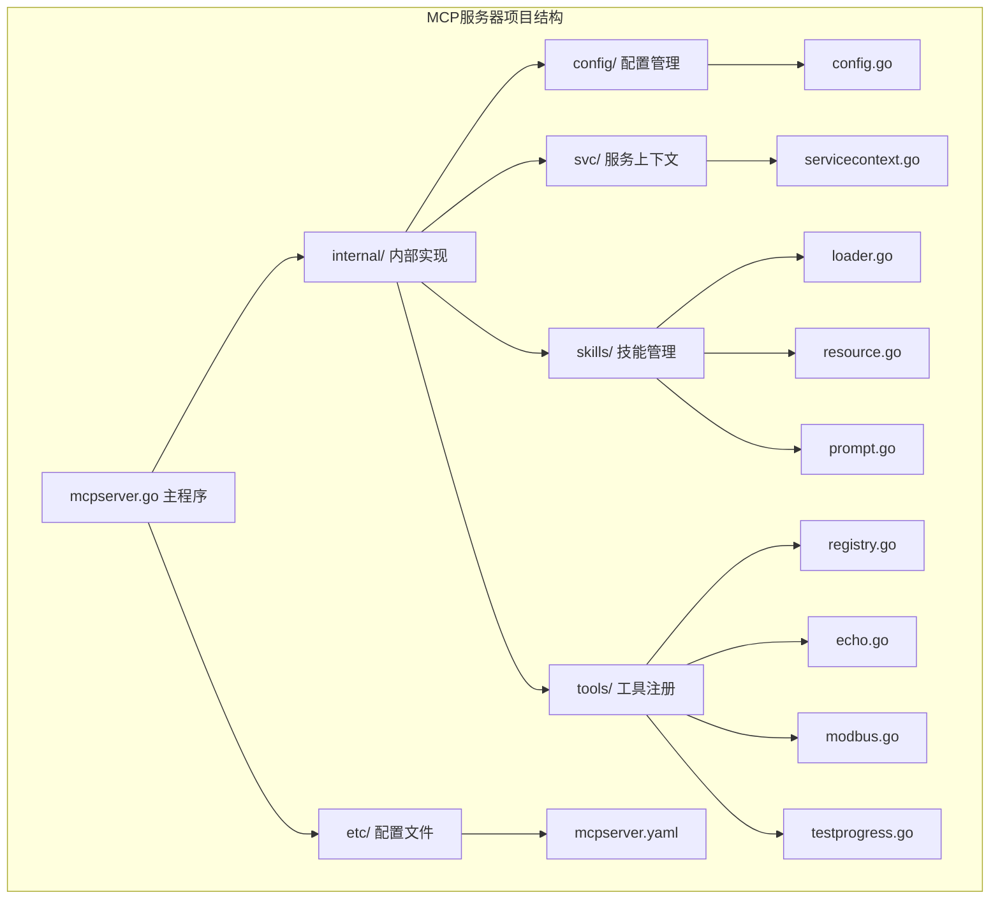
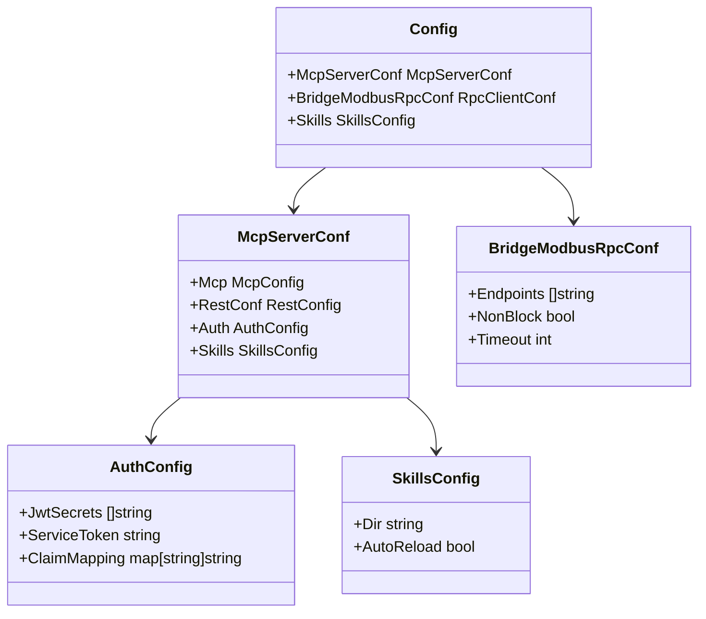
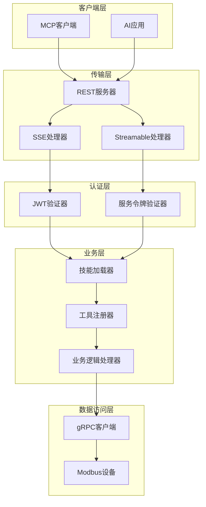
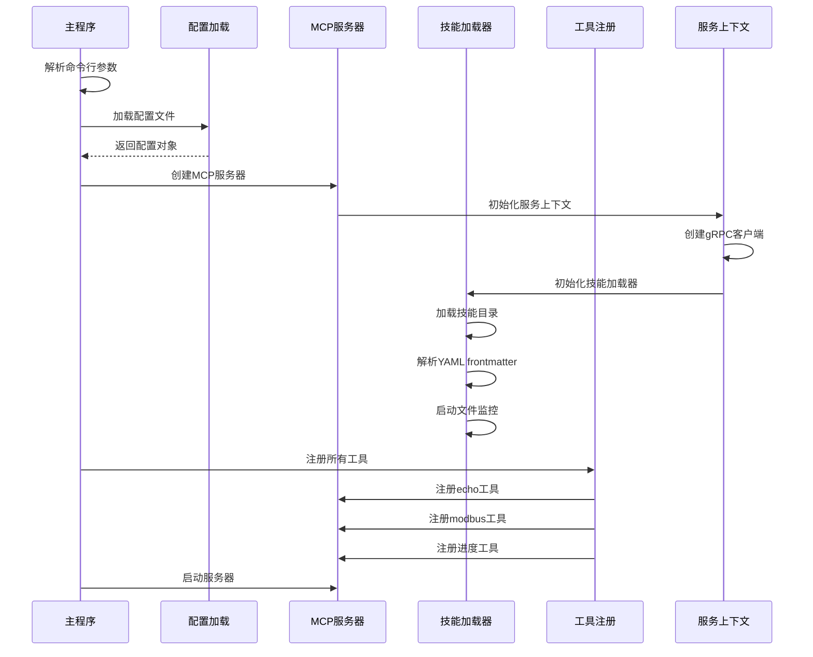
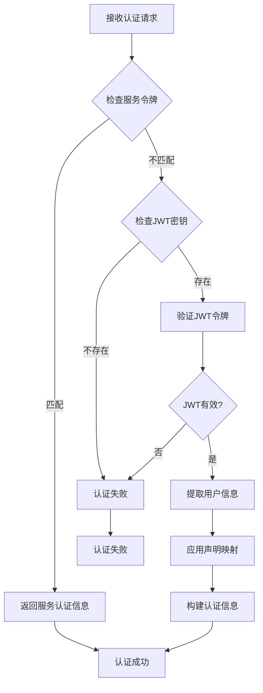
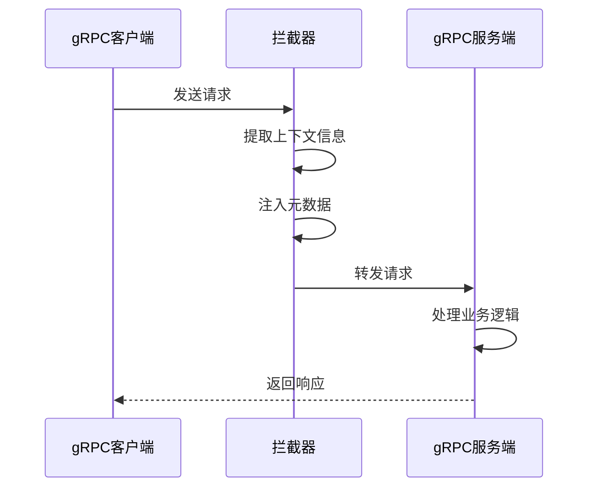
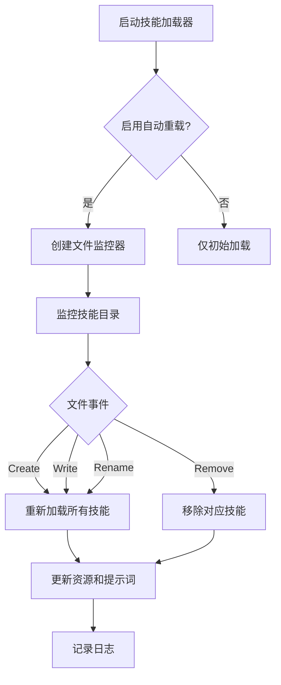
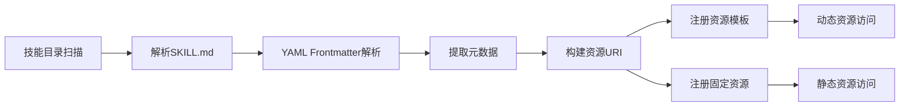
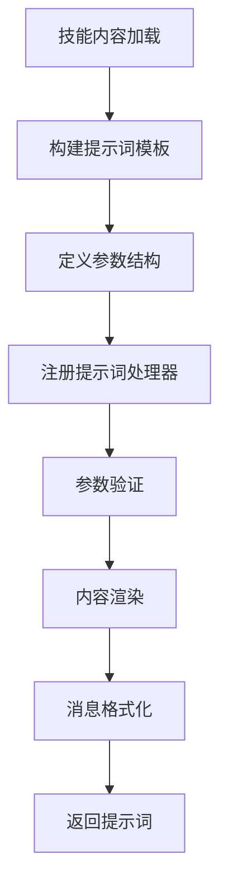
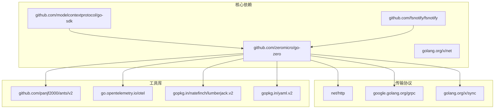

# MCP服务器配置

<cite>
**本文档引用的文件**
- [mcpserver.yaml](file://aiapp/mcpserver/etc/mcpserver.yaml)
- [config.go](file://aiapp/mcpserver/internal/config/config.go)
- [mcpserver.go](file://aiapp/mcpserver/mcpserver.go)
- [servicecontext.go](file://aiapp/mcpserver/internal/svc/servicecontext.go)
- [loader.go](file://aiapp/mcpserver/internal/skills/loader.go)
- [resource.go](file://aiapp/mcpserver/internal/skills/resource.go)
- [prompt.go](file://aiapp/mcpserver/internal/skills/prompt.go)
- [registry.go](file://aiapp/mcpserver/internal/tools/registry.go)
- [echo.go](file://aiapp/mcpserver/internal/tools/echo.go)
- [modbus.go](file://aiapp/mcpserver/internal/tools/modbus.go)
- [testprogress.go](file://aiapp/mcpserver/internal/tools/testprogress.go)
- [server.go](file://common/mcpx/server.go)
- [config.go](file://common/mcpx/config.go)
- [auth.go](file://common/mcpx/auth.go)
- [wrapper.go](file://common/mcpx/wrapper.go)
- [metadataInterceptor.go](file://common/Interceptor/rpcclient/metadataInterceptor.go)
- [go.mod](file://go.mod)
- [SKILL.md](file://aiapp/mcpserver/skills/example/SKILL.md)
</cite>

## 更新摘要
**所做更改**
- 新增技能管理配置章节，详细介绍Skills配置项
- 更新配置系统架构图，包含技能管理组件
- 新增技能加载器和资源管理器的详细说明
- 更新服务启动流程，包含技能初始化步骤
- 新增技能目录结构和文件格式规范
- 新增YAML frontmatter解析和fsnotify文件监控功能说明

## 目录
1. [简介](#简介)
2. [项目结构](#项目结构)
3. [核心组件](#核心组件)
4. [架构概览](#架构概览)
5. [详细组件分析](#详细组件分析)
6. [技能管理系统](#技能管理系统)
7. [依赖分析](#依赖分析)
8. [性能考虑](#性能考虑)
9. [故障排除指南](#故障排除指南)
10. [结论](#结论)

## 简介

MCP服务器配置文档详细介绍了基于Go-Zero框架构建的MCP（Model Context Protocol）服务器的配置和实现。该服务器提供了Modbus设备通信、进度通知等工具功能，并集成了JWT认证和gRPC拦截器机制。

**更新** 新增技能管理系统配置，支持技能目录配置和自动重载功能，为AI应用提供灵活的知识管理和提示词服务。技能系统采用YAML frontmatter格式，支持fsnotify文件监控，实现热重载功能。

MCP服务器采用现代化的微服务架构，支持两种传输协议：SSE（Server-Sent Events）和Streamable HTTP，为AI应用提供灵活的工具调用接口。

## 项目结构

MCP服务器位于`aiapp/mcpserver`目录下，采用标准的Go-Zero项目结构：



**图表来源**
- [mcpserver.go:1-41](file://aiapp/mcpserver/mcpserver.go#L1-L41)
- [config.go:1-13](file://aiapp/mcpserver/internal/config/config.go#L1-L13)

**章节来源**
- [mcpserver.go:1-41](file://aiapp/mcpserver/mcpserver.go#L1-L41)
- [config.go:1-13](file://aiapp/mcpserver/internal/config/config.go#L1-L13)

## 核心组件

### 配置系统

MCP服务器的配置系统采用分层设计，支持环境特定的配置管理：



**图表来源**
- [config.go:9-18](file://aiapp/mcpserver/internal/config/config.go#L9-L18)
- [server.go:21-29](file://common/mcpx/server.go#L21-L29)

### 服务器配置

服务器配置包含网络设置、传输协议选择、日志配置和技能管理配置：

| 配置项 | 默认值 | 描述 |
|--------|--------|------|
| Name | mcpserver | 服务器名称 |
| Host | 0.0.0.0 | 绑定地址 |
| Port | 13003 | 端口号 |
| Mode | dev | 运行模式 |
| UseStreamable | false | 是否使用Streamable协议 |
| SseTimeout | 24h | SSE连接超时 |
| MessageTimeout | 18000s | 工具执行超时 |
| Skills.Dir | ./skills | 技能目录路径 |
| Skills.AutoReload | true | 是否启用热加载 |

**章节来源**
- [mcpserver.yaml:1-37](file://aiapp/mcpserver/etc/mcpserver.yaml#L1-L37)
- [config.go:9-18](file://aiapp/mcpserver/internal/config/config.go#L9-L18)

## 架构概览

MCP服务器采用多层架构设计，实现了清晰的关注点分离：



**图表来源**
- [server.go:35-72](file://common/mcpx/server.go#L35-L72)
- [auth.go:22-72](file://common/mcpx/auth.go#L22-L72)

## 详细组件分析

### 服务器启动流程

MCP服务器的启动过程遵循标准的Go-Zero应用程序模式：



**图表来源**
- [mcpserver.go:19-60](file://aiapp/mcpserver/mcpserver.go#L19-L60)
- [servicecontext.go:16-38](file://aiapp/mcpserver/internal/svc/servicecontext.go#L16-L38)

### 认证机制

MCP服务器实现了双重认证机制，支持服务令牌和JWT两种认证方式：



**图表来源**
- [auth.go:22-72](file://common/mcpx/auth.go#L22-L72)
- [server.go:115-122](file://common/mcpx/server.go#L115-L122)

### 工具注册系统

MCP服务器支持三种核心工具：

#### Echo工具
Echo工具提供简单的消息回显功能，支持可选前缀和用户信息显示。

#### Modbus工具
Modbus工具集成了读取保持寄存器和读取线圈功能，支持多种数据格式转换。

#### 进度通知工具
进度通知工具模拟长时间运行任务，支持实时进度更新。

**章节来源**
- [registry.go:9-15](file://aiapp/mcpserver/internal/tools/registry.go#L9-L15)
- [echo.go:18-43](file://aiapp/mcpserver/internal/tools/echo.go#L18-L43)
- [modbus.go:29-70](file://aiapp/mcpserver/internal/tools/modbus.go#L29-L70)
- [testprogress.go:20-70](file://aiapp/mcpserver/internal/tools/testprogress.go#L20-L70)

### gRPC拦截器机制

MCP服务器通过拦截器实现跨服务的上下文传递：



**图表来源**
- [metadataInterceptor.go:11-19](file://common/Interceptor/rpcclient/metadataInterceptor.go#L11-L19)
- [servicecontext.go:19-23](file://aiapp/mcpserver/internal/svc/servicecontext.go#L19-L23)

**章节来源**
- [metadataInterceptor.go:1-20](file://common/Interceptor/rpcclient/metadataInterceptor.go#L1-L20)
- [servicecontext.go:1-26](file://aiapp/mcpserver/internal/svc/servicecontext.go#L1-L26)

## 技能管理系统

### 技能配置

MCP服务器新增了完整的技能管理功能，支持技能目录配置和自动重载：

```mermaid
classDiagram
class SkillsConfig {
+Dir string
+AutoReload bool
}
class Loader {
-mu sync.RWMutex
-dir string
-skills map[string]*Skill
-autoReload bool
-watcher *fsnotify.Watcher
-stopCh chan struct{}
+Load() error
+GetSkill(name string) (*Skill, bool)
+ListSkills() []*Skill
+StartWatcher() error
+Stop()
}
class Skill {
-Name string
-Description string
-AllowedTools []string
-Content string
-FilePath string
}
SkillsConfig --> Loader
Loader --> Skill
```

**图表来源**
- [config.go:14-18](file://aiapp/mcpserver/internal/config/config.go#L14-L18)
- [loader.go:30-58](file://aiapp/mcpserver/internal/skills/loader.go#L30-L58)

### 技能文件格式

技能内容通过SKILL.md文件管理，支持YAML frontmatter和Markdown正文：

**Frontmatter配置**：
```yaml
name: skill-name           # 技能唯一标识
description: "描述信息"      # 技能功能描述
allowed-tools:             # 可选：允许使用的工具列表
  - Read
  - Grep
  - Glob
```

**资源内容格式**：
```
# {skill_name}

{description}

**Allowed Tools:** {tools}

---
{content}
```

**提示词内容格式**：
```
你是 {name} 领域的专家。

## 领域描述
{description}

## 用户任务
{task}

## 参考知识
{content}
```

### 自动重载机制

技能系统支持热重载功能，通过fsnotify监听文件变化：



**图表来源**
- [loader.go:142-212](file://aiapp/mcpserver/internal/skills/loader.go#L142-L212)

**章节来源**
- [mcpserver.yaml:33-37](file://aiapp/mcpserver/etc/mcpserver.yaml#L33-L37)
- [config.go:14-18](file://aiapp/mcpserver/internal/config/config.go#L14-L18)
- [loader.go:61-120](file://aiapp/mcpserver/internal/skills/loader.go#L61-L120)
- [resource.go:15-41](file://aiapp/mcpserver/internal/skills/resource.go#L15-L41)
- [prompt.go:20-59](file://aiapp/mcpserver/internal/skills/prompt.go#L20-L59)

### 技能资源注册

技能系统支持两种资源访问方式：

1. **动态URI模板**：`skill://{skill_name}/content`
2. **固定资源**：每个技能注册为独立资源



**图表来源**
- [resource.go:15-41](file://aiapp/mcpserver/internal/skills/resource.go#L15-L41)
- [loader.go:88-120](file://aiapp/mcpserver/internal/skills/loader.go#L88-L120)

### 提示词生成系统

技能系统自动生成MCP提示词，支持参数化模板：



**图表来源**
- [prompt.go:20-59](file://aiapp/mcpserver/internal/skills/prompt.go#L20-L59)
- [prompt.go:97-125](file://aiapp/mcpserver/internal/skills/prompt.go#L97-L125)

**章节来源**
- [resource.go:15-141](file://aiapp/mcpserver/internal/skills/resource.go#L15-L141)
- [prompt.go:127-179](file://aiapp/mcpserver/internal/skills/prompt.go#L127-L179)

## 依赖分析

MCP服务器依赖于多个关键库和框架：



**图表来源**
- [go.mod:5-62](file://go.mod#L5-L62)

### 关键依赖说明

| 依赖库 | 版本 | 用途 |
|--------|------|------|
| github.com/zeromicro/go-zero | v1.10.0 | 核心框架 |
| github.com/modelcontextprotocol/go-sdk | v1.3.0 | MCP协议支持 |
| github.com/fsnotify/fsnotify | v1.9.0 | 文件监控 |
| github.com/panjf2000/ants/v2 | v2.12.0 | 并发控制 |
| go.opentelemetry.io/otel | v1.42.0 | 链路追踪 |
| google.golang.org/grpc | v1.79.3 | gRPC通信 |
| gopkg.in/yaml.v2 | v2.4.0 | YAML解析 |

**章节来源**
- [go.mod:1-245](file://go.mod#L1-L245)

## 性能考虑

### 连接池管理
MCP服务器使用连接池优化资源使用，支持非阻塞模式和超时控制。

### 并发处理
通过ants并发库实现高效的并发控制，支持大量同时进行的工具调用。

### 缓存策略
服务器实现了智能缓存机制，减少重复计算和网络请求。

### 技能加载优化
技能系统采用懒加载和缓存机制，避免频繁的文件系统操作。

### 文件监控优化
fsnotify监控器采用goroutine异步处理，避免阻塞主程序执行。

## 故障排除指南

### 常见问题及解决方案

#### 服务器启动失败
- 检查端口占用情况
- 验证配置文件语法
- 确认依赖库版本兼容性

#### 认证失败
- 验证JWT密钥配置
- 检查服务令牌设置
- 确认声明映射配置

#### 工具调用超时
- 调整MessageTimeout配置
- 检查下游服务响应时间
- 优化工具执行逻辑

#### 技能加载失败
- 验证技能目录权限
- 检查SKILL.md文件格式
- 确认YAML frontmatter语法
- 查看文件监控器状态

#### 自动重载失效
- 检查文件监控权限
- 验证目录路径配置
- 确认文件系统支持inotify
- 查看fsnotify错误日志

#### 资源访问异常
- 验证资源URI格式
- 检查技能名称匹配
- 确认资源模板注册

#### 提示词生成错误
- 验证参数完整性
- 检查技能内容格式
- 确认提示词模板配置

**章节来源**
- [server.go:80-91](file://common/mcpx/server.go#L80-L91)
- [auth.go:69-71](file://common/mcpx/auth.go#L69-L71)
- [loader.go:142-167](file://aiapp/mcpserver/internal/skills/loader.go#L142-L167)

## 结论

MCP服务器配置文档详细介绍了基于Go-Zero框架构建的MCP服务器的完整配置方案。该服务器通过模块化的架构设计，提供了灵活的工具调用接口、强大的认证机制和全新的技能管理系统。

**更新** 新增的技能管理系统为AI应用提供了强大的知识管理能力，支持技能目录配置、自动重载和资源管理功能。技能系统采用标准化的SKILL.md文件格式，支持YAML frontmatter解析和fsnotify文件监控，实现了完整的热重载机制。

主要特点包括：
- 支持两种传输协议（SSE和Streamable HTTP）
- 双重认证机制（服务令牌和JWT）
- 模块化的工具注册系统
- 完善的gRPC拦截器机制
- 高性能的并发处理能力
- **新增** 技能管理系统（目录配置、自动重载、资源管理）
- **新增** 提示词生成和模板系统
- **新增** YAML frontmatter格式支持
- **新增** fsnotify文件监控功能

该配置方案为AI应用提供了可靠的MCP服务器基础，技能管理系统的加入使其能够更好地支持复杂的企业级应用场景，可以根据具体需求进行扩展和定制。