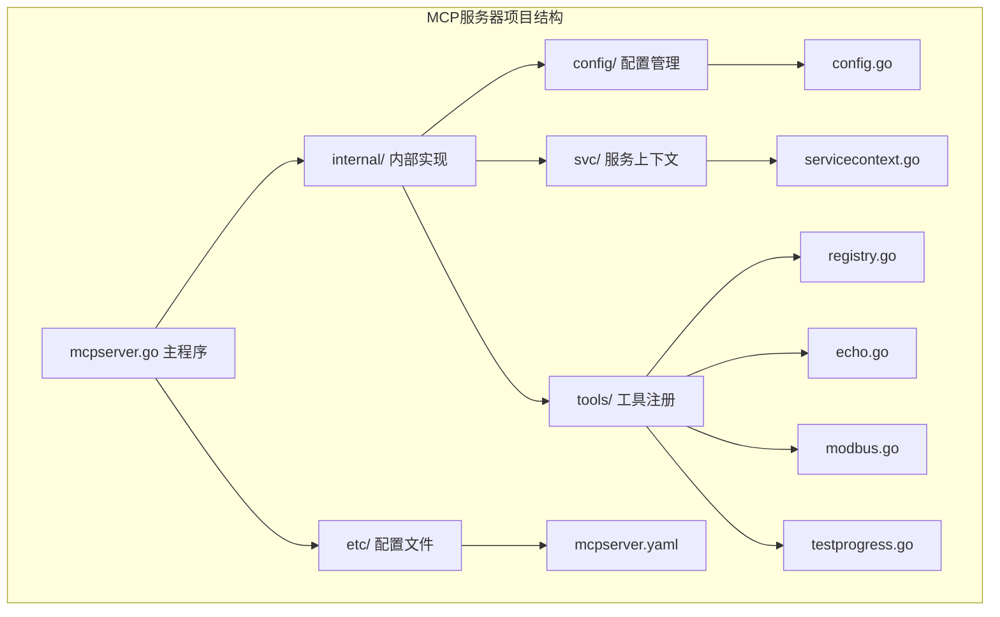
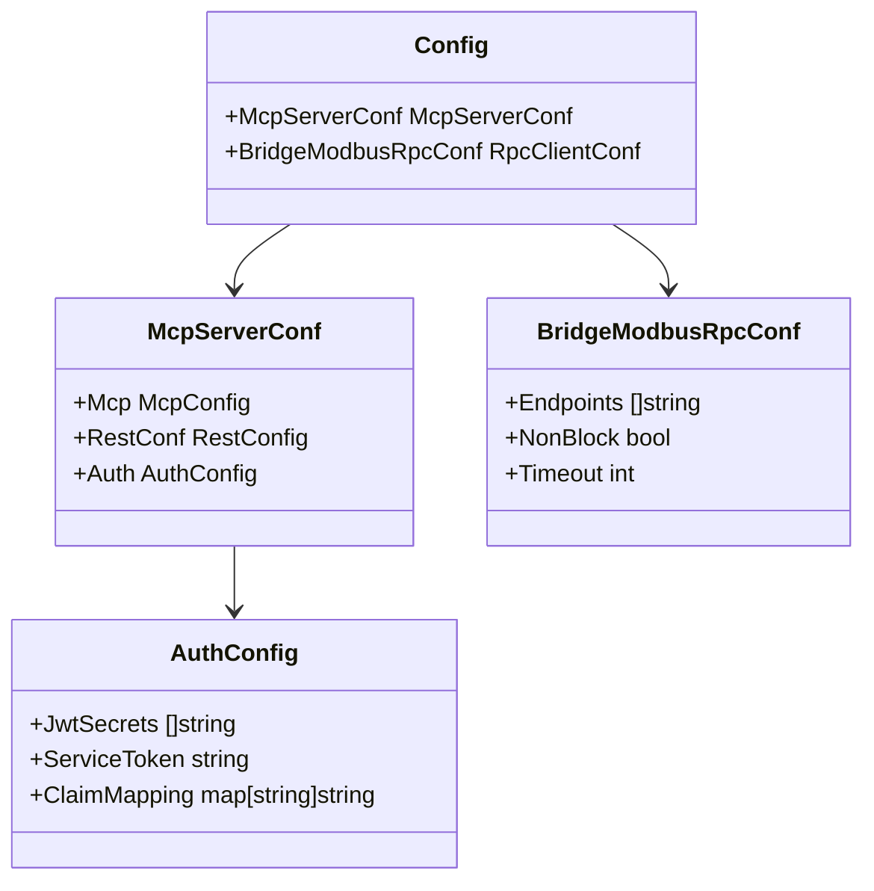
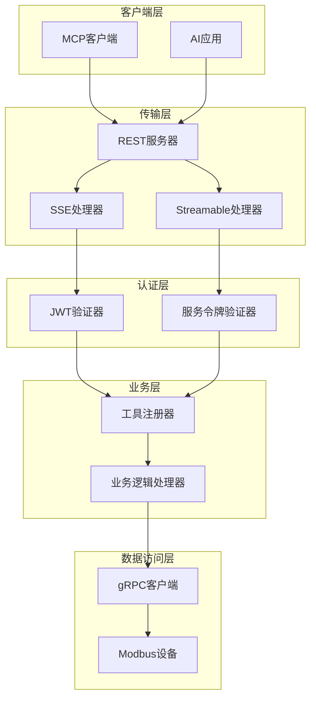
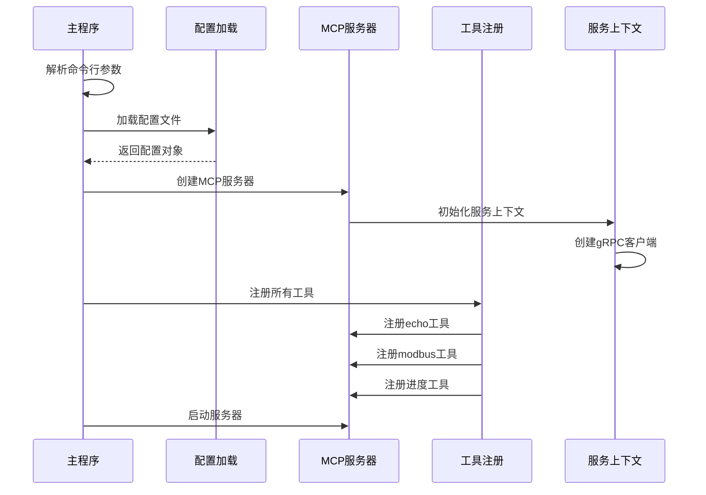
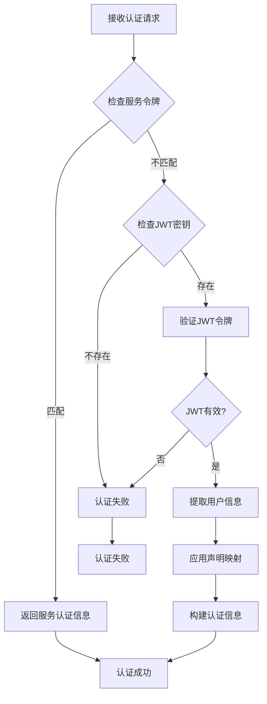
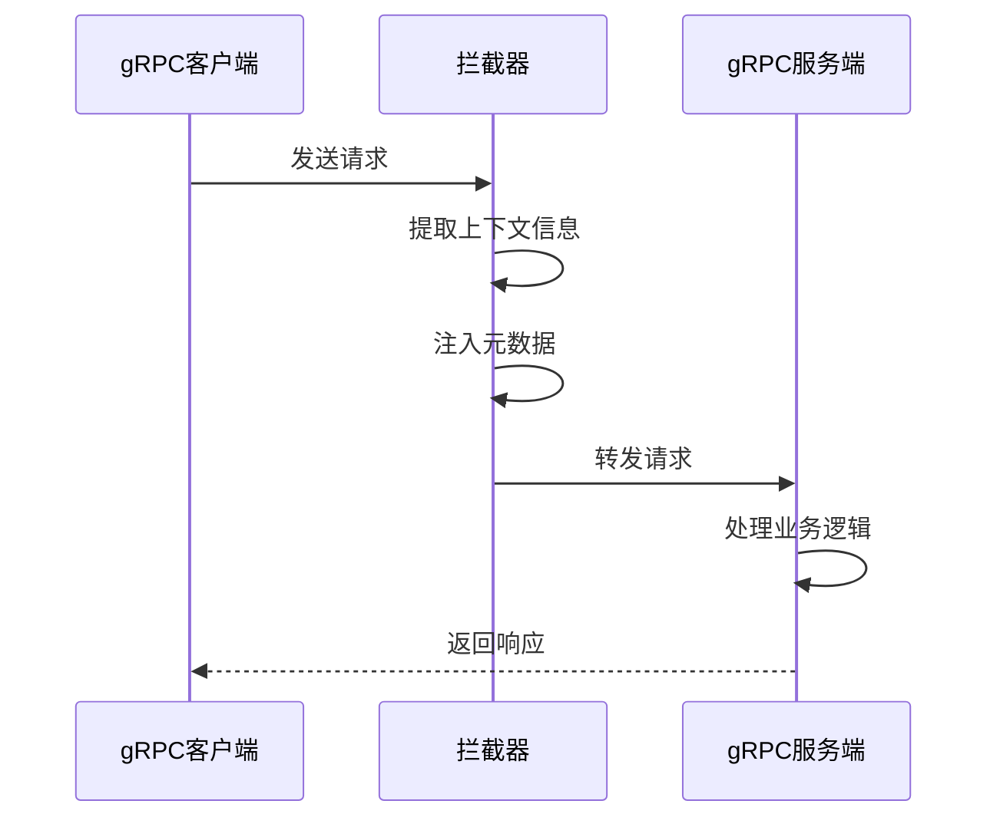
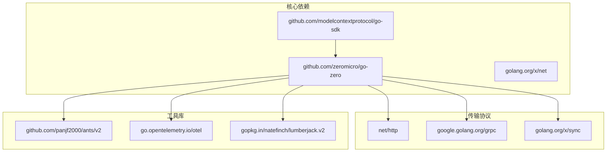

# MCP服务器配置

<cite>
**本文档引用的文件**
- [mcpserver.yaml](file://aiapp/mcpserver/etc/mcpserver.yaml)
- [config.go](file://aiapp/mcpserver/internal/config/config.go)
- [mcpserver.go](file://aiapp/mcpserver/mcpserver.go)
- [servicecontext.go](file://aiapp/mcpserver/internal/svc/servicecontext.go)
- [registry.go](file://aiapp/mcpserver/internal/tools/registry.go)
- [echo.go](file://aiapp/mcpserver/internal/tools/echo.go)
- [modbus.go](file://aiapp/mcpserver/internal/tools/modbus.go)
- [testprogress.go](file://aiapp/mcpserver/internal/tools/testprogress.go)
- [server.go](file://common/mcpx/server.go)
- [config.go](file://common/mcpx/config.go)
- [auth.go](file://common/mcpx/auth.go)
- [wrapper.go](file://common/mcpx/wrapper.go)
- [metadataInterceptor.go](file://common/Interceptor/rpcclient/metadataInterceptor.go)
- [go.mod](file://go.mod)
</cite>

## 目录
1. [简介](#简介)
2. [项目结构](#项目结构)
3. [核心组件](#核心组件)
4. [架构概览](#架构概览)
5. [详细组件分析](#详细组件分析)
6. [依赖分析](#依赖分析)
7. [性能考虑](#性能考虑)
8. [故障排除指南](#故障排除指南)
9. [结论](#结论)

## 简介

MCP服务器配置文档详细介绍了基于Go-Zero框架构建的MCP（Model Context Protocol）服务器的配置和实现。该服务器提供了Modbus设备通信、进度通知等工具功能，并集成了JWT认证和gRPC拦截器机制。

MCP服务器采用现代化的微服务架构，支持两种传输协议：SSE（Server-Sent Events）和Streamable HTTP，为AI应用提供灵活的工具调用接口。

## 项目结构

MCP服务器位于`aiapp/mcpserver`目录下，采用标准的Go-Zero项目结构：

**图表来源**
- [mcpserver.go:1-41](file://aiapp/mcpserver/mcpserver.go#L1-L41)
- [config.go:1-13](file://aiapp/mcpserver/internal/config/config.go#L1-L13)

**章节来源**
- [mcpserver.go:1-41](file://aiapp/mcpserver/mcpserver.go#L1-L41)
- [config.go:1-13](file://aiapp/mcpserver/internal/config/config.go#L1-L13)

## 核心组件

### 配置系统

MCP服务器的配置系统采用分层设计，支持环境特定的配置管理：

**图表来源**
- [config.go:9-12](file://aiapp/mcpserver/internal/config/config.go#L9-L12)
- [server.go:15-22](file://common/mcpx/server.go#L15-L22)

### 服务器配置

服务器配置包含网络设置、传输协议选择和日志配置：

| 配置项 | 默认值 | 描述 |
|--------|--------|------|
| Name | mcpserver | 服务器名称 |
| Host | 0.0.0.0 | 绑定地址 |
| Port | 13003 | 端口号 |
| Mode | dev | 运行模式 |
| UseStreamable | true | 是否使用Streamable协议 |
| SseTimeout | 24h | SSE连接超时 |
| MessageTimeout | 18000s | 工具执行超时 |

**章节来源**
- [mcpserver.yaml:1-32](file://aiapp/mcpserver/etc/mcpserver.yaml#L1-L32)
- [config.go:9-12](file://aiapp/mcpserver/internal/config/config.go#L9-L12)

## 架构概览

MCP服务器采用多层架构设计，实现了清晰的关注点分离：

**图表来源**
- [server.go:35-72](file://common/mcpx/server.go#L35-L72)
- [auth.go:22-72](file://common/mcpx/auth.go#L22-L72)

## 详细组件分析

### 服务器启动流程

MCP服务器的启动过程遵循标准的Go-Zero应用程序模式：

**图表来源**
- [mcpserver.go:19-40](file://aiapp/mcpserver/mcpserver.go#L19-L40)
- [servicecontext.go:16-25](file://aiapp/mcpserver/internal/svc/servicecontext.go#L16-L25)

### 认证机制

MCP服务器实现了双重认证机制，支持服务令牌和JWT两种认证方式：

**图表来源**
- [auth.go:22-72](file://common/mcpx/auth.go#L22-L72)
- [server.go:115-122](file://common/mcpx/server.go#L115-L122)

### 工具注册系统

MCP服务器支持三种核心工具：

#### Echo工具
Echo工具提供简单的消息回显功能，支持可选前缀和用户信息显示。

#### Modbus工具
Modbus工具集成了读取保持寄存器和读取线圈功能，支持多种数据格式转换。

#### 进度通知工具
进度通知工具模拟长时间运行任务，支持实时进度更新。

**章节来源**
- [registry.go:9-15](file://aiapp/mcpserver/internal/tools/registry.go#L9-L15)
- [echo.go:18-43](file://aiapp/mcpserver/internal/tools/echo.go#L18-L43)
- [modbus.go:29-70](file://aiapp/mcpserver/internal/tools/modbus.go#L29-L70)
- [testprogress.go:20-70](file://aiapp/mcpserver/internal/tools/testprogress.go#L20-L70)

### gRPC拦截器机制

MCP服务器通过拦截器实现跨服务的上下文传递：

**图表来源**
- [metadataInterceptor.go:11-19](file://common/Interceptor/rpcclient/metadataInterceptor.go#L11-L19)
- [servicecontext.go:19-23](file://aiapp/mcpserver/internal/svc/servicecontext.go#L19-L23)

**章节来源**
- [metadataInterceptor.go:1-20](file://common/Interceptor/rpcclient/metadataInterceptor.go#L1-L20)
- [servicecontext.go:1-26](file://aiapp/mcpserver/internal/svc/servicecontext.go#L1-L26)

## 依赖分析

MCP服务器依赖于多个关键库和框架：

**图表来源**
- [go.mod:5-62](file://go.mod#L5-L62)

### 关键依赖说明

| 依赖库 | 版本 | 用途 |
|--------|------|------|
| github.com/zeromicro/go-zero | v1.10.0 | 核心框架 |
| github.com/modelcontextprotocol/go-sdk | v1.3.0 | MCP协议支持 |
| github.com/panjf2000/ants/v2 | v2.12.0 | 并发控制 |
| go.opentelemetry.io/otel | v1.42.0 | 链路追踪 |
| google.golang.org/grpc | v1.79.3 | gRPC通信 |

**章节来源**
- [go.mod:1-245](file://go.mod#L1-L245)

## 性能考虑

### 连接池管理
MCP服务器使用连接池优化资源使用，支持非阻塞模式和超时控制。

### 并发处理
通过ants并发库实现高效的并发控制，支持大量同时进行的工具调用。

### 缓存策略
服务器实现了智能缓存机制，减少重复计算和网络请求。

## 故障排除指南

### 常见问题及解决方案

#### 服务器启动失败
- 检查端口占用情况
- 验证配置文件语法
- 确认依赖库版本兼容性

#### 认证失败
- 验证JWT密钥配置
- 检查服务令牌设置
- 确认声明映射配置

#### 工具调用超时
- 调整MessageTimeout配置
- 检查下游服务响应时间
- 优化工具执行逻辑

**章节来源**
- [server.go:80-91](file://common/mcpx/server.go#L80-L91)
- [auth.go:69-71](file://common/mcpx/auth.go#L69-L71)

## 结论

MCP服务器配置文档详细介绍了基于Go-Zero框架构建的MCP服务器的完整配置方案。该服务器通过模块化的架构设计，提供了灵活的工具调用接口和强大的认证机制。

主要特点包括：
- 支持两种传输协议（SSE和Streamable HTTP）
- 双重认证机制（服务令牌和JWT）
- 模块化的工具注册系统
- 完善的gRPC拦截器机制
- 高性能的并发处理能力

该配置方案为AI应用提供了可靠的MCP服务器基础，可以根据具体需求进行扩展和定制。