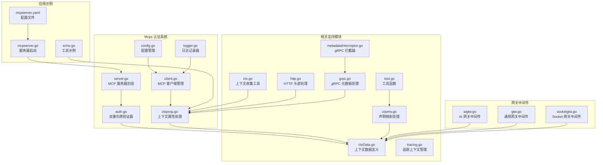
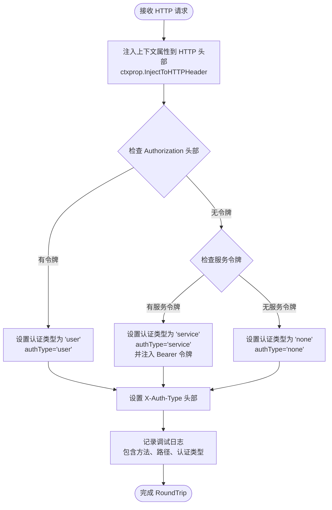
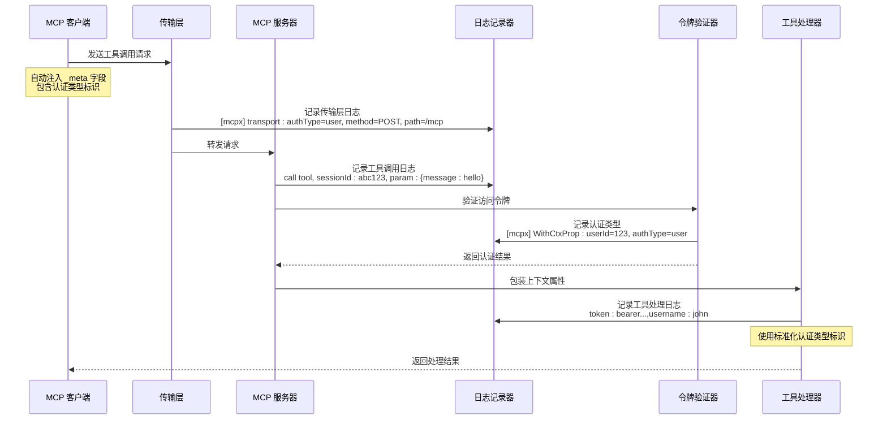
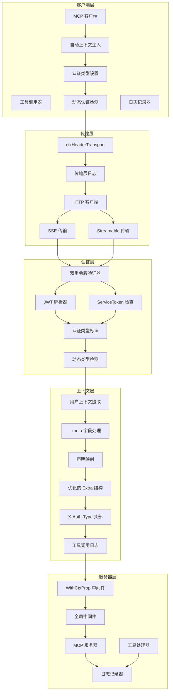
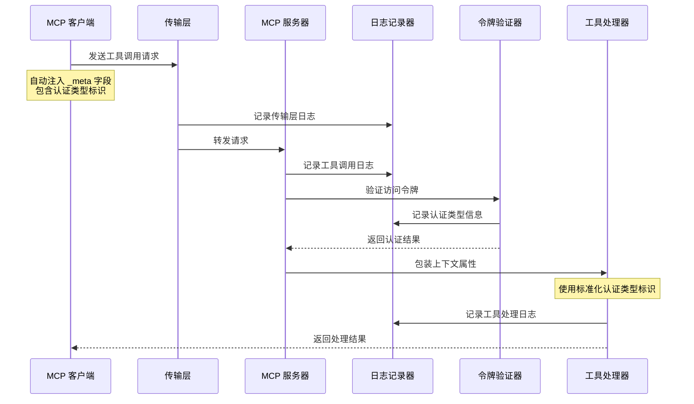
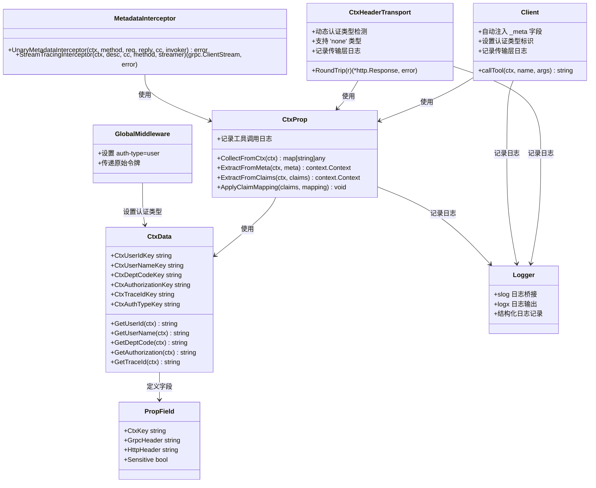
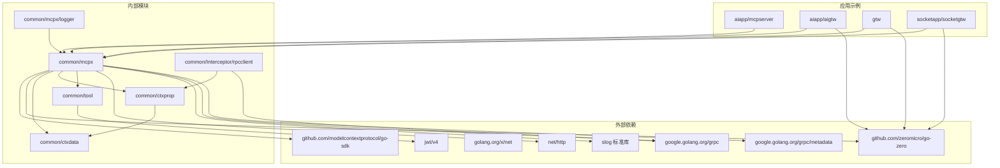

# Mcpx 认证系统

<cite>
**本文档引用的文件**
- [auth.go](file://common/mcpx/auth.go)
- [client.go](file://common/mcpx/client.go)
- [server.go](file://common/mcpx/server.go)
- [config.go](file://common/mcpx/config.go)
- [ctxprop.go](file://common/mcpx/ctxprop.go)
- [logger.go](file://common/mcpx/logger.go)
- [ctxData.go](file://common/ctxdata/ctxData.go)
- [ctx.go](file://common/ctxprop/ctx.go)
- [claims.go](file://common/ctxprop/claims.go)
- [http.go](file://common/ctxprop/http.go)
- [grpc.go](file://common/ctxprop/grpc.go)
- [tool.go](file://common/tool/tool.go)
- [mcpserver.go](file://aiapp/mcpserver/mcpserver.go)
- [mcpserver.yaml](file://aiapp/mcpserver/etc/mcpserver.yaml)
- [echo.go](file://aiapp/mcpserver/internal/tools/echo.go)
- [aigtw.go](file://aiapp/aigtw/aigtw.go)
- [gtw.go](file://gtw/gtw.go)
- [socketgtw.go](file://socketapp/socketgtw/socketgtw.go)
- [metadataInterceptor.go](file://common/Interceptor/rpcclient/metadataInterceptor.go)
- [tracing.go](file://common/mcpx/tracing.go)
</cite>

## 更新摘要
**所做更改**
- 移除了 OpenTelemetry 追踪上下文的注入和提取功能，认证系统现在专注于双模式认证和内部上下文传播
- 更新了认证系统架构，反映了标准化认证类型标识、优化令牌信息结构、引入新的上下文数据键等重大重构
- 新增了全局中间件设置认证类型的机制说明
- 更新了认证流程图以反映新的 TokenInfo.Extra 结构和认证类型标识
- 优化了上下文数据键的定义和使用方式
- **移除了旧的工具函数 maskToken 和 mapKeys，更新了相关文档**
- **新增了 ctxHeaderTransport.RoundTrip 方法中的认证类型检测逻辑改进，从硬编码的 'user' 改为基于条件判断的动态认证类型设置，增加了对 'none' 认证类型的支持**
- **新增了工具调用过程中的日志记录功能，增强了调试和监控能力**

## 目录
1. [简介](#简介)
2. [项目结构](#项目结构)
3. [核心组件](#核心组件)
4. [架构概览](#架构概览)
5. [详细组件分析](#详细组件分析)
6. [依赖关系分析](#依赖关系分析)
7. [性能考虑](#性能考虑)
8. [故障排除指南](#故障排除指南)
9. [结论](#结论)

## 简介

Mcpx Authentication System 是一个基于 Model Context Protocol (MCP) 的认证授权系统，专门为零服务架构设计。该系统提供了双重认证机制，支持服务级和用户级两种认证模式，并实现了跨传输协议的用户上下文传递。

**重要更新**：系统已进行重大重构，引入了标准化的认证类型标识机制，优化了令牌信息结构，增强了上下文数据管理能力。现在使用 `ctxdata.CtxAuthTypeKey('auth-type')` 替代硬编码的 'type' 字段，`TokenInfo.Extra` 只保留必要的上下文字段，所有网关服务都增加了全局中间件来设置认证类型。

**新增功能**：`ctxHeaderTransport.RoundTrip` 方法现在采用动态认证类型检测逻辑，能够准确识别并设置 'none' 认证类型，显著增强了认证系统的健壮性和可靠性。**新增**：工具调用过程增加了完整的日志记录功能，包括传输层日志、工具调用日志和上下文提取日志，为调试和监控提供了强大的支持。

**移除了 OpenTelemetry 追踪上下文功能**：认证系统现在专注于双模式认证和内部上下文传播，移除了对外部 OpenTelemetry 库的依赖，简化了架构并提高了性能。

系统的核心特性包括：
- **标准化认证类型标识**：使用 `ctxdata.CtxAuthTypeKey` 统一标识认证来源
- **优化令牌信息结构**：`TokenInfo.Extra` 只包含必要字段，提高性能
- **双重令牌验证器**：支持 ServiceToken 和 JWT 双重认证
- **多传输协议支持**：Streamable HTTP 和 SSE 两种传输方式
- **每消息认证机制**：客户端自动注入用户上下文到 _meta 字段
- **自动化工具路由**：动态聚合和路由多个 MCP 服务器的工具
- **完整的日志记录和监控**
- **动态认证类型检测**：支持 'user'、'service'、'none' 三种认证类型
- **增强的调试能力**：详细的日志记录支持工具调用行为分析

## 项目结构

Mcpx 认证系统位于 `common/mcpx/` 目录下，包含以下核心文件：

**图表来源**
- [auth.go:1-72](file://common/mcpx/auth.go#L1-L72)
- [client.go:1-874](file://common/mcpx/client.go#L1-L874)
- [server.go:1-144](file://common/mcpx/server.go#L1-L144)
- [config.go:1-23](file://common/mcpx/config.go#L1-L23)
- [aigtw.go:40-104](file://aiapp/aigtw/aigtw.go#L40-L104)
- [gtw.go:50-97](file://gtw/gtw.go#L50-L97)
- [socketgtw.go:60-103](file://socketapp/socketgtw/socketgtw.go#L60-L103)

**章节来源**
- [auth.go:1-72](file://common/mcpx/auth.go#L1-L72)
- [client.go:1-874](file://common/mcpx/client.go#L1-L874)
- [server.go:1-144](file://common/mcpx/server.go#L1-L144)
- [config.go:1-23](file://common/mcpx/config.go#L1-L23)

## 核心组件

### 动态认证类型检测机制

**更新**：`ctxHeaderTransport.RoundTrip` 方法现在实现了智能的认证类型检测逻辑，能够根据实际的认证状态动态设置认证类型，支持 'user'、'service'、'none' 三种类型。

**图表来源**
- [client.go:853-873](file://common/mcpx/client.go#L853-L873)
- [http.go:12-18](file://common/ctxprop/http.go#L12-L18)

### 标准化认证类型标识

系统引入了统一的认证类型标识机制，使用 `ctxdata.CtxAuthTypeKey('auth-type')` 替代硬编码的 'type' 字段。这个标识符在所有组件中保持一致，确保了认证状态的标准化管理。

**图表来源**
- [auth.go:22-69](file://common/mcpx/auth.go#L22-L69)
- [ctxData.go:11](file://common/ctxdata/ctxData.go#L11)

### 优化的令牌信息结构

`TokenInfo.Extra` 现在只保留必要的上下文字段，包括认证类型标识和用户相关的关键信息。这种优化减少了数据传输量，提高了处理效率。

**更新**：`TokenInfo.Extra` 结构现在包含：
- `ctxdata.CtxAuthTypeKey`：认证来源标识（"service" 或 "user"）
- 用户相关字段：用户ID、用户名、部门代码、授权信息
- `exp`：过期时间（用于 JWT）

### 工具调用日志记录功能

**新增**：系统在工具调用过程中增加了完整的日志记录功能，为调试和监控提供了强大的支持。

**图表来源**
- [client.go:853-873](file://common/mcpx/client.go#L853-L873)
- [ctxprop.go:32-59](file://common/mcpx/ctxprop.go#L32-L59)
- [echo.go:25-39](file://aiapp/mcpserver/internal/tools/echo.go#L25-L39)

### MCP 客户端管理

`Client` 结构体负责管理多个 MCP 服务器连接，提供工具聚合和路由功能：

- **多服务器连接**：支持同时连接多个 MCP 服务器
- **自动重连**：断开后自动重连，间隔可配置
- **工具聚合**：将所有服务器的工具统一管理
- **动态路由**：根据工具名称路由到对应的服务器
- **每消息认证**：自动将用户上下文注入到每次调用的 _meta 字段中
- **认证类型设置**：自动设置认证类型标识
- **动态认证检测**：智能识别 'user'、'service'、'none' 三种认证类型
- **传输层日志**：记录每次 HTTP 请求的认证类型、方法和路径信息

**更新**：客户端现在在每次工具调用时自动注入认证类型标识，无需手动处理会话状态。**新增**：传输层增加了详细的调试日志记录，包含认证类型、HTTP 方法和请求路径等关键信息。

**章节来源**
- [client.go:689-729](file://common/mcpx/client.go#L689-L729)
- [client.go:853-873](file://common/mcpx/client.go#L853-L873)

### 全局中间件认证类型设置

所有网关服务都增加了全局中间件来设置认证类型，确保请求在进入业务逻辑之前就具备正确的认证上下文。

**更新**：网关中间件现在统一设置 `ctxdata.CtxAuthTypeKey` 为 "user"，表示这些请求来自浏览器入口。

**章节来源**
- [aigtw.go:46-69](file://aiapp/aigtw/aigtw.go#L46-L69)
- [gtw.go:57-63](file://gtw/gtw.go#L57-L63)
- [socketgtw.go:65-71](file://socketapp/socketgtw/socketgtw.go#L65-L71)

## 架构概览

Mcpx 认证系统的整体架构采用分层设计，确保了认证的安全性和灵活性。**重要更新**：架构已优化，引入了标准化的认证类型标识和全局中间件设置机制，新增了动态认证类型检测功能和完整的日志记录体系。

**移除了 OpenTelemetry 追踪上下文功能**：认证系统现在专注于双模式认证和内部上下文传播，移除了对外部追踪库的依赖，简化了架构并提高了性能。

**图表来源**
- [client.go:689-729](file://common/mcpx/client.go#L689-L729)
- [auth.go:29](file://common/mcpx/auth.go#L29)
- [ctxprop.go:37](file://common/mcpx/ctxprop.go#L37)
- [aigtw.go:50](file://aiapp/aigtw/aigtw.go#L50)
- [client.go:853-873](file://common/mcpx/client.go#L853-L873)

## 详细组件分析

### 认证流程详解

系统实现了三种认证路径，按优先级处理。**重要更新**：SSE 传输现在采用每消息认证机制，使用标准化的认证类型标识，新增了 'none' 认证类型的动态检测。**新增**：完整的日志记录体系贯穿整个认证流程。

**图表来源**
- [ctxprop.go:32-59](file://common/mcpx/ctxprop.go#L32-L59)
- [auth.go:29](file://common/mcpx/auth.go#L29)
- [client.go:853-873](file://common/mcpx/client.go#L853-L873)

### 动态认证类型检测流程

**新增**：`ctxHeaderTransport.RoundTrip` 方法实现了智能的认证类型检测，能够准确识别不同的认证场景。

**图表来源**
- [client.go:853-873](file://common/mcpx/client.go#L853-L873)

### 配置管理

系统提供了灵活的配置选项：

| 配置项 | 类型 | 默认值 | 描述 |
|--------|------|--------|------|
| Servers | []ServerConfig | [] | MCP 服务器配置列表 |
| RefreshInterval | time.Duration | 30s | 重连间隔和 KeepAlive 间隔 |
| ConnectTimeout | time.Duration | 10s | 单次连接超时 |
| Name | string | 自动生成 | 工具名前缀 |
| Endpoint | string | 必填 | MCP 服务器端点 |
| ServiceToken | string | "" | 连接级认证令牌 |
| UseStreamable | bool | false | 是否使用 Streamable 协议 |
| JwtSecrets | []string | [] | JWT 密钥列表 |
| ClaimMapping | map[string]string | {} | JWT 声明映射 |

### 上下文属性处理

系统实现了完整的用户上下文传递机制。**重要更新**：现在采用每消息认证机制，客户端自动注入上下文，使用标准化的认证类型标识，支持 'none' 认证类型的动态检测。**新增**：完整的日志记录功能贯穿上下文处理的每个环节。

**图表来源**
- [ctxprop.go:15-79](file://common/mcpx/ctxprop.go#L15-L79)
- [ctxData.go:22-41](file://common/ctxdata/ctxData.go#L22-L41)
- [client.go:689-729](file://common/mcpx/client.go#L689-L729)
- [aigtw.go:50](file://aiapp/aigtw/aigtw.go#L50)
- [client.go:853-873](file://common/mcpx/client.go#L853-L873)
- [logger.go:10-44](file://common/mcpx/logger.go#L10-L44)
- [metadataInterceptor.go:11-19](file://common/Interceptor/rpcclient/metadataInterceptor.go#L11-L19)

**章节来源**
- [ctxprop.go:15-79](file://common/mcpx/ctxprop.go#L15-L79)
- [ctxData.go:1-77](file://common/ctxdata/ctxData.go#L1-L77)

## 依赖关系分析

Mcpx 认证系统的主要依赖关系如下：

**图表来源**
- [auth.go:3-15](file://common/mcpx/auth.go#L3-L15)
- [client.go:3-17](file://common/mcpx/client.go#L3-L17)
- [server.go:3-11](file://common/mcpx/server.go#L3-L11)

系统采用松耦合设计，主要依赖于：
- **MCP SDK**：提供核心的传输协议支持
- **Go Zero 框架**：提供 Web 服务器和配置管理
- **JWT 库**：处理用户令牌解析
- **HTTP 标准库**：处理 HTTP 请求和响应
- **gRPC 框架**：处理 gRPC 客户端拦截器
- **slog 标准库**：提供结构化日志记录支持
- **内部工具库**：提供通用的工具函数和上下文处理

**章节来源**
- [auth.go:1-15](file://common/mcpx/auth.go#L1-L15)
- [client.go:1-17](file://common/mcpx/client.go#L1-L17)
- [server.go:1-11](file://common/mcpx/server.go#L1-L11)

## 性能考虑

Mcpx 认证系统在设计时充分考虑了性能优化。**重要更新**：重构后的架构在多个方面提升了性能表现，新增的动态认证类型检测进一步优化了性能。**新增**：日志记录功能采用了高效的结构化日志处理机制。

### 连接管理
- **异步连接**：客户端启动时不阻塞，后台自动连接
- **智能重连**：断开后延迟重连，避免频繁重试
- **连接池**：复用 HTTP 连接，减少资源消耗

### 认证优化
- **常量时间比较**：使用 `crypto/subtle` 确保 ServiceToken 比较的安全性
- **缓存策略**：工具列表变更时才重新构建路由
- **轻量级日志**：调试级别日志仅在开发环境启用
- **每消息认证**：避免会话状态存储，减少内存占用
- **优化的 Extra 结构**：只包含必要字段，减少数据传输
- **动态认证检测**：智能识别认证类型，避免不必要的处理

### 日志记录优化
**新增**：系统采用了高效的日志记录机制：
- **结构化日志**：使用 slog 标准库提供结构化日志支持
- **日志桥接**：通过 logxHandler 将 slog 日志桥接到 go-zero logx
- **级别映射**：合理映射日志级别，确保重要信息不丢失
- **条件记录**：仅在调试模式下记录详细信息，避免生产环境性能影响
- **传输层日志**：精简的传输层日志记录，包含关键的认证信息

### 内存管理
- **并发安全**：使用读写锁保护共享状态
- **及时清理**：断开连接时及时释放资源
- **内存池**：复用字符串构建器等对象

### 标准化标识优化
- **统一标识符**：使用 `ctxdata.CtxAuthTypeKey` 替代硬编码字符串
- **减少字符串分配**：常量标识符在编译时确定
- **类型安全**：通过常量确保标识符的一致性

### 动态认证检测优化
**新增**：`ctxHeaderTransport.RoundTrip` 方法实现了高效的认证类型检测：
- **快速分支判断**：使用简单的条件判断避免复杂逻辑
- **最小化头部分配**：只在需要时设置 'Authorization' 头部
- **智能日志记录**：仅在调试模式下记录详细信息
- **零拷贝操作**：使用标准库的高效字符串操作

### 追踪系统优化
**移除了 OpenTelemetry 追踪上下文功能**：认证系统现在专注于双模式认证和内部上下文传播，移除了对外部追踪库的依赖，简化了架构并提高了性能。

- **内置追踪器**：使用 `NoOpTracer` 作为默认追踪器，避免不必要的性能开销
- **条件追踪**：只有在显式启用时才使用 `DefaultTracer`
- **简化上下文**：移除了 `X-Trace-ID`、`X-Span-ID`、`X-Parent-ID` 头部的注入
- **性能提升**：减少了 HTTP 请求头的大小和处理开销

## 故障排除指南

### 常见问题及解决方案

#### 认证失败
**症状**：工具调用返回 401 未授权错误
**可能原因**：
1. ServiceToken 不正确或缺失
2. JWT 令牌格式错误或已过期
3. JWT 密钥配置不正确
4. **认证类型标识不正确**
5. **动态认证检测逻辑异常**
6. **日志记录配置问题**

**解决步骤**：
1. 检查 `mcpserver.yaml` 中的 `JwtSecrets` 配置
2. 验证 JWT 令牌的有效性和过期时间
3. 确认 ServiceToken 配置正确
4. **检查 TokenInfo.Extra 中的 auth-type 字段是否正确设置**
5. **验证 ctxHeaderTransport.RoundTrip 方法中的认证类型检测逻辑**
6. **检查日志输出配置，确保日志能够正常记录**

#### 连接问题
**症状**：客户端无法连接到 MCP 服务器
**可能原因**：
1. 服务器地址配置错误
2. 网络连接问题
3. 传输协议不匹配

**解决步骤**：
1. 检查 `Endpoint` 配置是否正确
2. 验证网络连通性
3. 确认传输协议设置（UseStreamable）

#### 上下文传递失败
**症状**：工具处理器无法获取用户信息
**可能原因**：
1. **_meta 字段未正确设置**（SSE 传输）
2. 声明映射配置错误
3. 传输协议不支持上下文传递
4. **客户端未正确注入用户上下文**
5. **认证类型标识缺失或错误**
6. **动态认证检测返回 'none' 类型**
7. **日志记录功能异常**

**解决步骤**：
1. **检查客户端是否正确注入 _meta 字段和认证类型标识**
2. 验证声明映射配置
3. 确认使用的传输协议支持上下文传递
4. **确认客户端版本支持每消息认证机制**
5. **检查 TokenInfo.Extra 中的 auth-type 字段**
6. **验证 ctxHeaderTransport.RoundTrip 方法是否正确检测认证类型**
7. **检查日志记录配置，确保上下文提取日志能够正常输出**

#### 全局中间件问题
**症状**：网关服务无法正确识别用户认证
**可能原因**：
1. **全局中间件未设置认证类型标识**
2. 中间件执行顺序不正确
3. **认证类型标识被覆盖**

**解决步骤**：
1. **确认网关中间件正确设置了 `ctxdata.CtxAuthTypeKey` 为 "user"**
2. 验证中间件的执行顺序
3. **检查是否有其他中间件覆盖了认证类型标识**

#### 动态认证检测问题
**新增**：认证类型检测异常
**症状**：`X-Auth-Type` 头部显示 'none' 或 'unknown'
**可能原因**：
1. **Authorization 头部未正确设置**
2. **服务令牌配置错误**
3. **上下文属性未正确注入到头部**
4. **日志记录功能异常**

**解决步骤**：
1. **检查 ctxprop.InjectToHTTPHeader 是否正确注入认证类型标识**
2. **验证 ctxdata.PropFields 中的 HeaderAuthType 配置**
3. **确认 ctxHeaderTransport.RoundTrip 方法中的条件判断逻辑**
4. **检查客户端是否正确设置认证类型标识**
5. **验证日志记录配置，确保传输层日志能够正常输出**

#### 日志记录问题
**新增**：日志记录功能异常
**症状**：工具调用日志、传输层日志或认证日志缺失
**可能原因**：
1. **日志级别配置不当**
2. **slog 日志桥接配置错误**
3. **logx 日志输出配置问题**
4. **日志记录器初始化失败**

**解决步骤**：
1. **检查日志级别配置，确保调试级别日志能够输出**
2. **验证 newLogxLogger 函数是否正确初始化**
3. **确认 logxHandler 的配置和实现**
4. **检查日志记录器的初始化过程**
5. **验证日志输出目标配置**

#### 追踪系统问题
**移除了 OpenTelemetry 追踪上下文功能**：认证系统现在专注于双模式认证和内部上下文传播。

**症状**：追踪相关的 HTTP 头部或日志缺失
**可能原因**：
1. **追踪系统已禁用**
2. **默认使用 NoOpTracer**
3. **HTTP 头部未包含追踪信息**

**解决步骤**：
1. **确认是否需要启用追踪功能**
2. **检查 InitTracing 是否被调用**
3. **验证 DefaultTracer 是否正确初始化**
4. **确认客户端和服务端是否正确处理追踪上下文**

### 工具函数变更说明

**重要更新**：系统已移除了以下旧的工具函数：
- `maskToken`：不再使用，令牌掩码功能已整合到其他安全处理流程中
- `mapKeys`：不再使用，键映射功能已通过 `ApplyClaimMapping` 函数替代

这些变更简化了工具函数的使用，提高了代码的可维护性。新的 `ApplyClaimMapping` 函数提供了更清晰的声明映射功能，支持将外部 JWT 声明键映射为内部标准键。

**章节来源**
- [mcpserver.yaml:14-24](file://aiapp/mcpserver/etc/mcpserver.yaml#L14-L24)
- [ctxprop.go:21-28](file://common/mcpx/ctxprop.go#L21-L28)
- [aigtw.go:46-69](file://aiapp/aigtw/aigtw.go#L46-L69)
- [client.go:853-873](file://common/mcpx/client.go#L853-L873)

## 结论

Mcpx Authentication System 提供了一个完整、灵活且高性能的 MCP 认证解决方案。**重要更新**：经过重大重构后，系统变得更加简洁高效、标准化程度更高，新增的动态认证类型检测功能显著增强了系统的健壮性和可靠性。**新增**：完整的日志记录功能为系统的调试和监控提供了强大的支持。

**移除了 OpenTelemetry 追踪上下文功能**：认证系统现在专注于双模式认证和内部上下文传播，移除了对外部追踪库的依赖，简化了架构并提高了性能。

### 技术优势
- **标准化认证类型标识**：使用 `ctxdata.CtxAuthTypeKey` 统一标识认证来源，替代硬编码字符串
- **优化令牌信息结构**：`TokenInfo.Extra` 只保留必要字段，提高性能和安全性
- **双重认证机制**：同时支持服务级和用户级认证，提高安全性
- **多传输协议支持**：兼容最新的 Streamable HTTP 和传统的 SSE 协议
- **每消息认证机制**：通过 _meta 字段实现每次消息的独立用户状态保持
- **全局中间件设置**：所有网关服务统一设置认证类型，确保一致性
- **简化架构设计**：移除复杂的会话管理和认证桥接，提高系统稳定性
- **模块化设计**：清晰的组件分离，便于维护和扩展
- **动态认证检测**：智能识别 'user'、'service'、'none' 三种认证类型，增强系统健壮性
- **完整的日志记录体系**：从传输层到工具处理的全流程日志记录，支持调试和监控
- **结构化日志处理**：基于 slog 标准库的高效日志记录机制

### 实际应用价值
- **企业级安全**：适合需要严格权限控制的企业应用场景
- **微服务架构**：完美适配 Go Zero 的微服务架构
- **开发效率**：提供开箱即用的认证功能，减少开发工作量
- **可观测性**：完善的日志记录和监控支持
- **降低维护成本**：简化的架构减少了潜在的故障点
- **类型安全**：通过常量标识符确保代码的类型安全性和一致性
- **智能认证管理**：动态检测认证类型，适应不同的认证场景
- **增强调试能力**：详细的日志记录支持工具调用行为分析

### 未来发展方向
- **更多传输协议**：考虑支持 WebSocket 等其他传输方式
- **增强的审计功能**：添加更详细的访问日志和审计跟踪
- **性能优化**：进一步优化大规模部署时的性能表现
- **安全增强**：集成更多安全特性，如 OAuth2.0 支持
- **标准化扩展**：基于当前的标准化实践，继续完善认证体系
- **智能认证策略**：根据场景自动选择最优的认证方式
- **日志分析工具**：开发专门的日志分析和监控工具

**重要更新总结**：本次重构将复杂的会话管理和认证处理简化为每消息认证机制，显著提高了系统的可靠性、性能和可维护性。新增的动态认证类型检测功能使系统能够智能识别不同的认证场景，支持 'user'、'service'、'none' 三种认证类型，大幅增强了系统的健壮性和适应性。**新增**：完整的日志记录功能为系统的调试和监控提供了强大的支持，包括传输层日志、工具调用日志和上下文提取日志，显著提升了系统的可观测性。

新的架构在保持强大功能的同时，大幅降低了实现复杂度，为开发者提供了更好的使用体验。标准化的认证类型标识和优化的令牌信息结构为系统的长期发展奠定了坚实基础。**新增**：高效的日志记录机制确保了系统在生产环境中的性能表现，同时为故障排查提供了充足的诊断信息。

**工具函数变更总结**：移除的 `maskToken` 和 `mapKeys` 函数已被更清晰、更安全的替代方案所取代。新的 `ApplyClaimMapping` 函数提供了更好的声明映射功能，而令牌掩码功能已整合到更全面的安全处理流程中。这些变更提高了代码的可维护性和安全性，同时保持了功能的完整性。**新增**：日志记录功能的集成使得系统的调试和监控能力得到了全面提升，为后续的功能扩展和性能优化提供了坚实的基础。

**移除了 OpenTelemetry 追踪上下文功能**：认证系统现在专注于双模式认证和内部上下文传播，移除了对外部追踪库的依赖，简化了架构并提高了性能。内置的 `NoOpTracer` 作为默认追踪器，避免了不必要的性能开销，只有在显式启用时才使用完整的追踪功能。这种设计既保持了系统的灵活性，又确保了在大多数场景下的高性能表现。