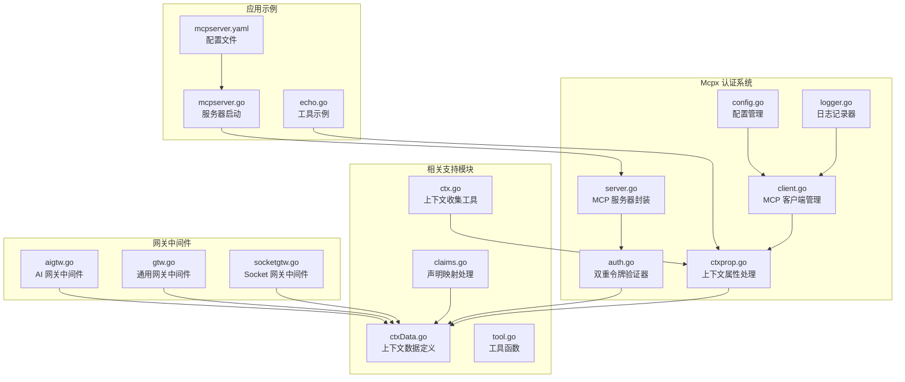
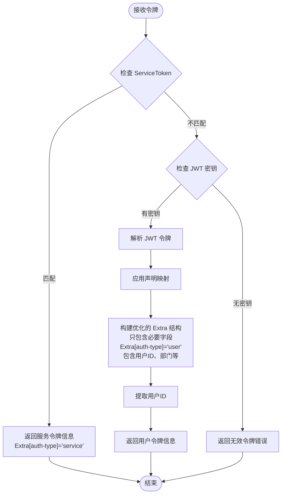
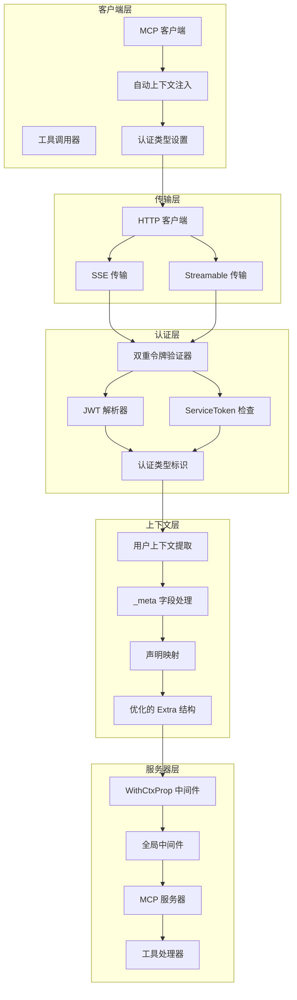
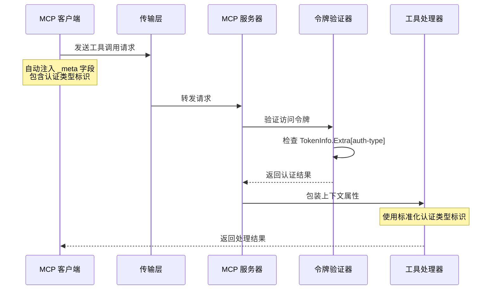
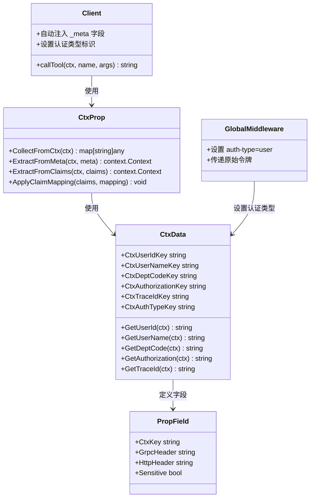
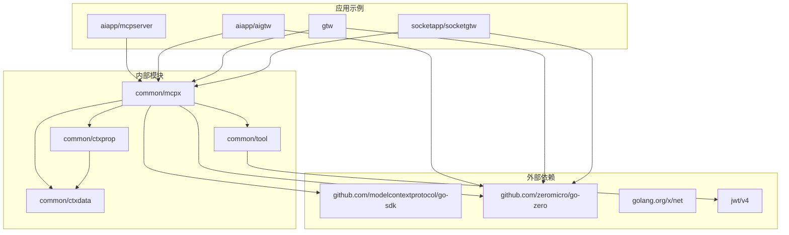

# Mcpx 认证系统

<cite>
**本文档引用的文件**
- [auth.go](file://common/mcpx/auth.go)
- [client.go](file://common/mcpx/client.go)
- [server.go](file://common/mcpx/server.go)
- [config.go](file://common/mcpx/config.go)
- [ctxprop.go](file://common/mcpx/ctxprop.go)
- [logger.go](file://common/mcpx/logger.go)
- [ctxData.go](file://common/ctxdata/ctxData.go)
- [ctx.go](file://common/ctxprop/ctx.go)
- [claims.go](file://common/ctxprop/claims.go)
- [tool.go](file://common/tool/tool.go)
- [mcpserver.go](file://aiapp/mcpserver/mcpserver.go)
- [mcpserver.yaml](file://aiapp/mcpserver/etc/mcpserver.yaml)
- [echo.go](file://aiapp/mcpserver/internal/tools/echo.go)
- [aigtw.go](file://aiapp/aigtw/aigtw.go)
- [gtw.go](file://gtw/gtw.go)
- [socketgtw.go](file://socketapp/socketgtw/socketgtw.go)
</cite>

## 更新摘要
**所做更改**
- 更新了认证系统架构，反映了标准化认证类型标识、优化令牌信息结构、引入新的上下文数据键等重大重构
- 新增了全局中间件设置认证类型的机制说明
- 更新了认证流程图以反映新的 TokenInfo.Extra 结构和认证类型标识
- 优化了上下文数据键的定义和使用方式

## 目录
1. [简介](#简介)
2. [项目结构](#项目结构)
3. [核心组件](#核心组件)
4. [架构概览](#架构概览)
5. [详细组件分析](#详细组件分析)
6. [依赖关系分析](#依赖关系分析)
7. [性能考虑](#性能考虑)
8. [故障排除指南](#故障排除指南)
9. [结论](#结论)

## 简介

Mcpx Authentication System 是一个基于 Model Context Protocol (MCP) 的认证授权系统，专门为零服务架构设计。该系统提供了双重认证机制，支持服务级和用户级两种认证模式，并实现了跨传输协议的用户上下文传递。

**重要更新**：系统已进行重大重构，引入了标准化的认证类型标识机制，优化了令牌信息结构，增强了上下文数据管理能力。现在使用 `ctxdata.CtxAuthTypeKey('auth-type')` 替代硬编码的 'type' 字段，`TokenInfo.Extra` 只保留必要的上下文字段，所有网关服务都增加了全局中间件来设置认证类型。

系统的核心特性包括：
- **标准化认证类型标识**：使用 `ctxdata.CtxAuthTypeKey` 统一标识认证来源
- **优化令牌信息结构**：`TokenInfo.Extra` 只包含必要字段，提高性能
- **双重令牌验证器**：支持 ServiceToken 和 JWT 双重认证
- **多传输协议支持**：Streamable HTTP 和 SSE 两种传输方式
- **每消息认证机制**：客户端自动注入用户上下文到 _meta 字段
- **自动化工具路由**：动态聚合和路由多个 MCP 服务器的工具
- **完整的日志记录和监控**

## 项目结构

Mcpx 认证系统位于 `common/mcpx/` 目录下，包含以下核心文件：

**图表来源**
- [auth.go:1-87](file://common/mcpx/auth.go#L1-L87)
- [client.go:1-358](file://common/mcpx/client.go#L1-L358)
- [server.go:1-144](file://common/mcpx/server.go#L1-L144)
- [config.go:1-23](file://common/mcpx/config.go#L1-L23)
- [aigtw.go:40-104](file://aiapp/aigtw/aigtw.go#L40-L104)
- [gtw.go:50-97](file://gtw/gtw.go#L50-L97)
- [socketgtw.go:60-103](file://socketapp/socketgtw/socketgtw.go#L60-L103)

**章节来源**
- [auth.go:1-87](file://common/mcpx/auth.go#L1-L87)
- [client.go:1-358](file://common/mcpx/client.go#L1-L358)
- [server.go:1-144](file://common/mcpx/server.go#L1-L144)
- [config.go:1-23](file://common/mcpx/config.go#L1-L23)

## 核心组件

### 标准化认证类型标识

系统引入了统一的认证类型标识机制，使用 `ctxdata.CtxAuthTypeKey('auth-type')` 替代硬编码的 'type' 字段。这个标识符在所有组件中保持一致，确保了认证状态的标准化管理。

**图表来源**
- [auth.go:22-69](file://common/mcpx/auth.go#L22-L69)
- [ctxData.go:11](file://common/ctxdata/ctxData.go#L11)

### 优化的令牌信息结构

`TokenInfo.Extra` 现在只保留必要的上下文字段，包括认证类型标识和用户相关的关键信息。这种优化减少了数据传输量，提高了处理效率。

**更新**：`TokenInfo.Extra` 结构现在包含：
- `ctxdata.CtxAuthTypeKey`：认证来源标识（"service" 或 "user"）
- 用户相关字段：用户ID、用户名、部门代码、授权信息、追踪ID
- `exp`：过期时间（用于 JWT）

**章节来源**
- [auth.go:44-59](file://common/mcpx/auth.go#L44-L59)
- [ctxData.go:34-41](file://common/ctxdata/ctxData.go#L34-L41)

### MCP 客户端管理

`Client` 结构体负责管理多个 MCP 服务器连接，提供工具聚合和路由功能：

- **多服务器连接**：支持同时连接多个 MCP 服务器
- **自动重连**：断开后自动重连，间隔可配置
- **工具聚合**：将所有服务器的工具统一管理
- **动态路由**：根据工具名称路由到对应的服务器
- **每消息认证**：自动将用户上下文注入到每次调用的 _meta 字段中
- **认证类型设置**：自动设置认证类型标识

**更新**：客户端现在在每次工具调用时自动注入认证类型标识，无需手动处理会话状态。

**章节来源**
- [client.go:291-318](file://common/mcpx/client.go#L291-L318)
- [client.go:346-357](file://common/mcpx/client.go#L346-L357)

### 全局中间件认证类型设置

所有网关服务都增加了全局中间件来设置认证类型，确保请求在进入业务逻辑之前就具备正确的认证上下文。

**更新**：网关中间件现在统一设置 `ctxdata.CtxAuthTypeKey` 为 "user"，表示这些请求来自浏览器入口。

**章节来源**
- [aigtw.go:46-69](file://aiapp/aigtw/aigtw.go#L46-L69)
- [gtw.go:57-63](file://gtw/gtw.go#L57-L63)
- [socketgtw.go:65-71](file://socketapp/socketgtw/socketgtw.go#L65-L71)

## 架构概览

Mcpx 认证系统的整体架构采用分层设计，确保了认证的安全性和灵活性。**重要更新**：架构已优化，引入了标准化的认证类型标识和全局中间件设置机制。

**图表来源**
- [client.go:294-301](file://common/mcpx/client.go#L294-L301)
- [auth.go:29](file://common/mcpx/auth.go#L29)
- [ctxprop.go:37](file://common/mcpx/ctxprop.go#L37)
- [aigtw.go:50](file://aiapp/aigtw/aigtw.go#L50)

## 详细组件分析

### 认证流程详解

系统实现了三种认证路径，按优先级处理。**重要更新**：SSE 传输现在采用每消息认证机制，使用标准化的认证类型标识。

**图表来源**
- [ctxprop.go:37](file://common/mcpx/ctxprop.go#L37)
- [auth.go:29](file://common/mcpx/auth.go#L29)

### 配置管理

系统提供了灵活的配置选项：

| 配置项 | 类型 | 默认值 | 描述 |
|--------|------|--------|------|
| Servers | []ServerConfig | [] | MCP 服务器配置列表 |
| RefreshInterval | time.Duration | 30s | 重连间隔和 KeepAlive 间隔 |
| ConnectTimeout | time.Duration | 10s | 单次连接超时 |
| Name | string | 自动生成 | 工具名前缀 |
| Endpoint | string | 必填 | MCP 服务器端点 |
| ServiceToken | string | "" | 连接级认证令牌 |
| UseStreamable | bool | false | 是否使用 Streamable 协议 |
| JwtSecrets | []string | [] | JWT 密钥列表 |
| ClaimMapping | map[string]string | {} | JWT 声明映射 |

**章节来源**
- [config.go:11-22](file://common/mcpx/config.go#L11-L22)
- [mcpserver.yaml:14-24](file://aiapp/mcpserver/etc/mcpserver.yaml#L14-L24)

### 上下文属性处理

系统实现了完整的用户上下文传递机制。**重要更新**：现在采用每消息认证机制，客户端自动注入上下文，使用标准化的认证类型标识。

**图表来源**
- [ctxprop.go:9-38](file://common/mcpx/ctxprop.go#L9-L38)
- [ctxData.go:22-41](file://common/ctxdata/ctxData.go#L22-L41)
- [client.go:294-301](file://common/mcpx/client.go#L294-L301)
- [aigtw.go:50](file://aiapp/aigtw/aigtw.go#L50)

**章节来源**
- [ctxprop.go:15-79](file://common/mcpx/ctxprop.go#L15-L79)
- [ctxData.go:1-77](file://common/ctxdata/ctxData.go#L1-L77)

## 依赖关系分析

Mcpx 认证系统的主要依赖关系如下：

**图表来源**
- [auth.go:3-15](file://common/mcpx/auth.go#L3-L15)
- [client.go:3-17](file://common/mcpx/client.go#L3-L17)
- [server.go:3-11](file://common/mcpx/server.go#L3-L11)

系统采用松耦合设计，主要依赖于：
- **MCP SDK**：提供核心的传输协议支持
- **Go Zero 框架**：提供 Web 服务器和配置管理
- **JWT 库**：处理用户令牌解析
- **内部工具库**：提供通用的工具函数和上下文处理

**章节来源**
- [auth.go:1-15](file://common/mcpx/auth.go#L1-L15)
- [client.go:1-17](file://common/mcpx/client.go#L1-L17)
- [server.go:1-11](file://common/mcpx/server.go#L1-L11)

## 性能考虑

Mcpx 认证系统在设计时充分考虑了性能优化。**重要更新**：重构后的架构在多个方面提升了性能表现。

### 连接管理
- **异步连接**：客户端启动时不阻塞，后台自动连接
- **智能重连**：断开后延迟重连，避免频繁重试
- **连接池**：复用 HTTP 连接，减少资源消耗

### 认证优化
- **常量时间比较**：使用 `crypto/subtle` 确保 ServiceToken 比较的安全性
- **缓存策略**：工具列表变更时才重新构建路由
- **轻量级日志**：调试级别日志仅在开发环境启用
- **每消息认证**：避免会话状态存储，减少内存占用
- **优化的 Extra 结构**：只包含必要字段，减少数据传输

### 内存管理
- **并发安全**：使用读写锁保护共享状态
- **及时清理**：断开连接时及时释放资源
- **内存池**：复用字符串构建器等对象

### 标准化标识优化
- **统一标识符**：使用 `ctxdata.CtxAuthTypeKey` 替代硬编码字符串
- **减少字符串分配**：常量标识符在编译时确定
- **类型安全**：通过常量确保标识符的一致性

## 故障排除指南

### 常见问题及解决方案

#### 认证失败
**症状**：工具调用返回 401 未授权错误
**可能原因**：
1. ServiceToken 不正确或缺失
2. JWT 令牌格式错误或已过期
3. JWT 密钥配置不正确
4. **认证类型标识不正确**

**解决步骤**：
1. 检查 `mcpserver.yaml` 中的 `JwtSecrets` 配置
2. 验证 JWT 令牌的有效性和过期时间
3. 确认 ServiceToken 配置正确
4. **检查 TokenInfo.Extra 中的 auth-type 字段是否正确设置**

#### 连接问题
**症状**：客户端无法连接到 MCP 服务器
**可能原因**：
1. 服务器地址配置错误
2. 网络连接问题
3. 传输协议不匹配

**解决步骤**：
1. 检查 `Endpoint` 配置是否正确
2. 验证网络连通性
3. 确认传输协议设置（UseStreamable）

#### 上下文传递失败
**症状**：工具处理器无法获取用户信息
**可能原因**：
1. **_meta 字段未正确设置**（SSE 传输）
2. 声明映射配置错误
3. 传输协议不支持上下文传递
4. **客户端未正确注入用户上下文**
5. **认证类型标识缺失或错误**

**解决步骤**：
1. **检查客户端是否正确注入 _meta 字段和认证类型标识**
2. 验证声明映射配置
3. 确认使用的传输协议支持上下文传递
4. **确认客户端版本支持每消息认证机制**
5. **检查 TokenInfo.Extra 中的 auth-type 字段**

#### 全局中间件问题
**症状**：网关服务无法正确识别用户认证
**可能原因**：
1. **全局中间件未设置认证类型标识**
2. 中间件执行顺序不正确
3. **认证类型标识被覆盖**

**解决步骤**：
1. **确认网关中间件正确设置了 `ctxdata.CtxAuthTypeKey` 为 "user"**
2. 验证中间件的执行顺序
3. **检查是否有其他中间件覆盖了认证类型标识**

**章节来源**
- [mcpserver.yaml:14-24](file://aiapp/mcpserver/etc/mcpserver.yaml#L14-L24)
- [ctxprop.go:21-28](file://common/mcpx/ctxprop.go#L21-L28)
- [aigtw.go:46-69](file://aiapp/aigtw/aigtw.go#L46-L69)

## 结论

Mcpx Authentication System 提供了一个完整、灵活且高性能的 MCP 认证解决方案。**重要更新**：经过重大重构后，系统变得更加简洁高效、标准化程度更高。

### 技术优势
- **标准化认证类型标识**：使用 `ctxdata.CtxAuthTypeKey` 统一标识认证来源，替代硬编码字符串
- **优化令牌信息结构**：`TokenInfo.Extra` 只保留必要字段，提高性能和安全性
- **双重认证机制**：同时支持服务级和用户级认证，提高安全性
- **多传输协议支持**：兼容最新的 Streamable HTTP 和传统的 SSE 协议
- **每消息认证机制**：通过 _meta 字段实现每次消息的独立用户状态保持
- **全局中间件设置**：所有网关服务统一设置认证类型，确保一致性
- **简化架构设计**：移除复杂的会话管理和认证桥接，提高系统稳定性
- **模块化设计**：清晰的组件分离，便于维护和扩展

### 实际应用价值
- **企业级安全**：适合需要严格权限控制的企业应用场景
- **微服务架构**：完美适配 Go Zero 的微服务架构
- **开发效率**：提供开箱即用的认证功能，减少开发工作量
- **可观测性**：完善的日志记录和监控支持
- **降低维护成本**：简化的架构减少了潜在的故障点
- **类型安全**：通过常量标识符确保代码的类型安全性和一致性

### 未来发展方向
- **更多传输协议**：考虑支持 WebSocket 等其他传输方式
- **增强的审计功能**：添加更详细的访问日志和审计跟踪
- **性能优化**：进一步优化大规模部署时的性能表现
- **安全增强**：集成更多安全特性，如 OAuth2.0 支持
- **标准化扩展**：基于当前的标准化实践，继续完善认证体系

**重要更新总结**：本次重构将复杂的会话管理和认证处理简化为每消息认证机制，显著提高了系统的可靠性、性能和可维护性。新的架构在保持强大功能的同时，大幅降低了实现复杂度，为开发者提供了更好的使用体验。标准化的认证类型标识和优化的令牌信息结构为系统的长期发展奠定了坚实基础。