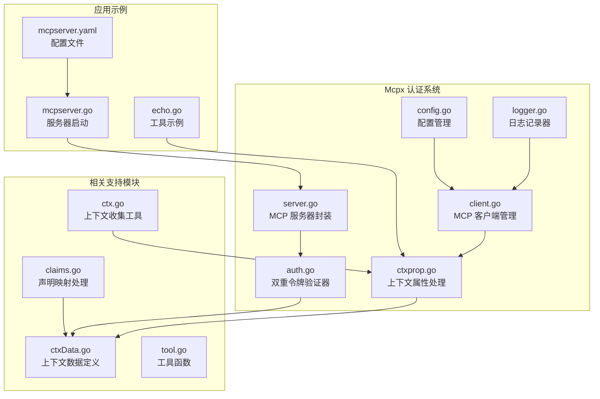
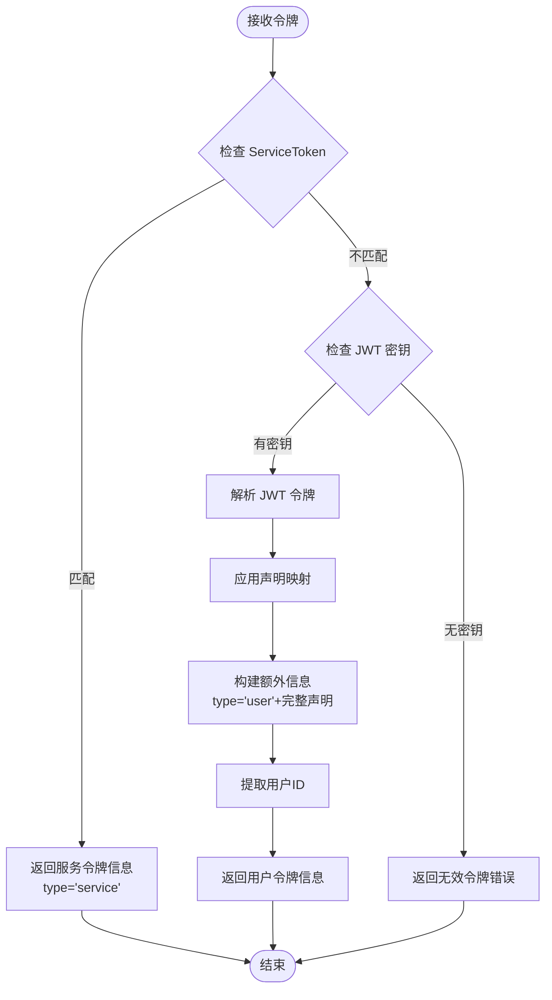
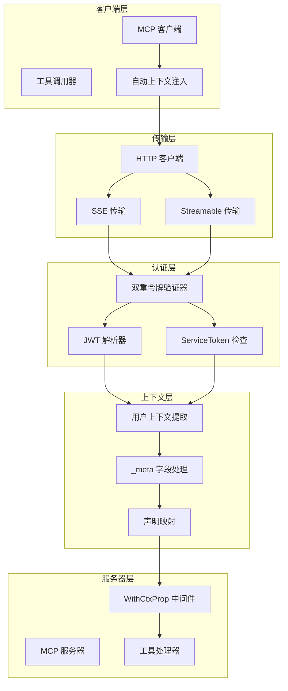
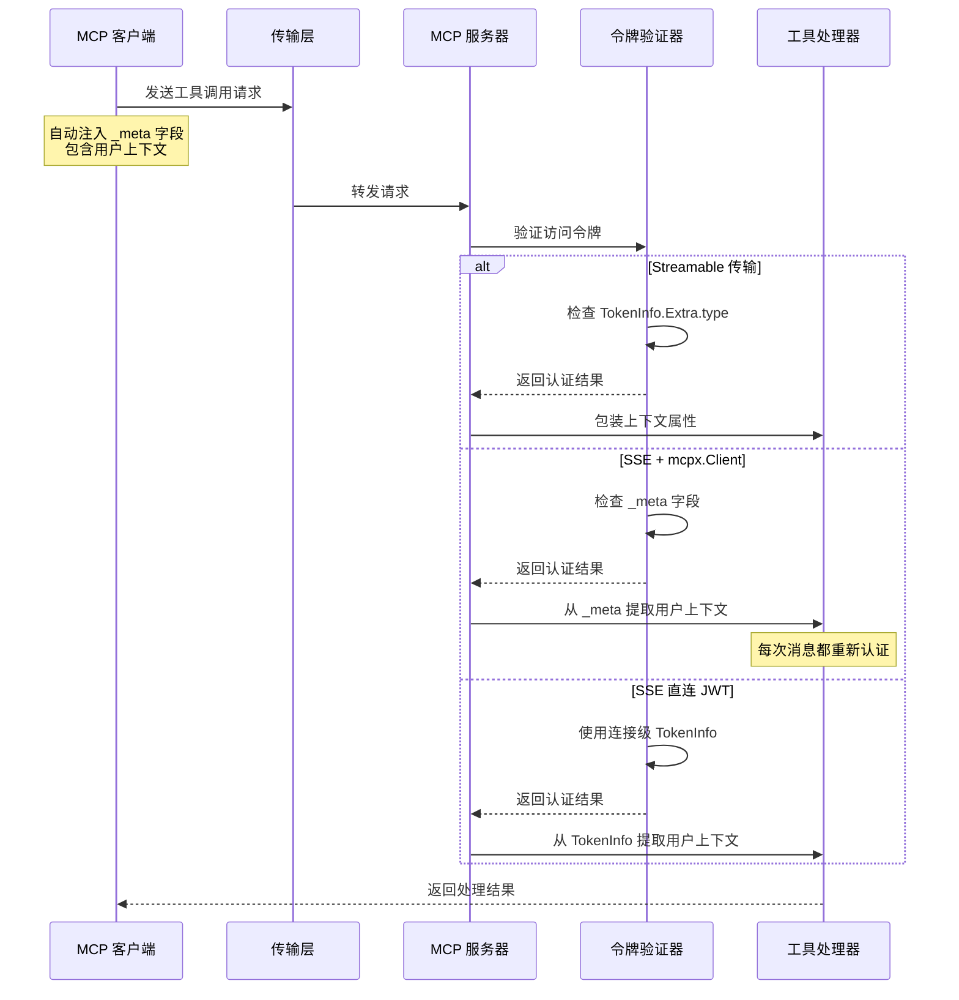
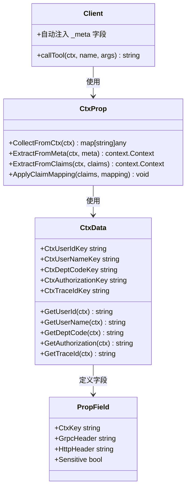
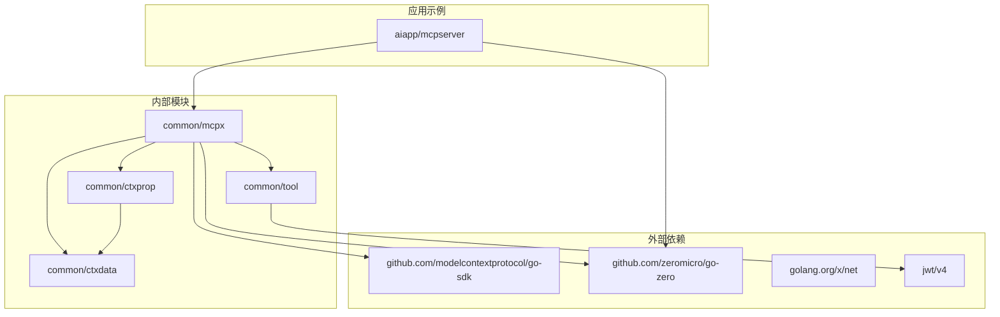

# Mcpx 认证系统

<cite>
**本文档引用的文件**
- [auth.go](file://common/mcpx/auth.go)
- [client.go](file://common/mcpx/client.go)
- [server.go](file://common/mcpx/server.go)
- [config.go](file://common/mcpx/config.go)
- [ctxprop.go](file://common/mcpx/ctxprop.go)
- [logger.go](file://common/mcpx/logger.go)
- [ctxData.go](file://common/ctxdata/ctxData.go)
- [ctx.go](file://common/ctxprop/ctx.go)
- [claims.go](file://common/ctxprop/claims.go)
- [tool.go](file://common/tool/tool.go)
- [mcpserver.go](file://aiapp/mcpserver/mcpserver.go)
- [mcpserver.yaml](file://aiapp/mcpserver/etc/mcpserver.yaml)
- [echo.go](file://aiapp/mcpserver/internal/tools/echo.go)
</cite>

## 更新摘要
**所做更改**
- 更新了 SSE 认证系统的架构说明，反映了从复杂 authSSEHandler 和会话管理到简单每消息认证机制的重构
- 新增了客户端自动注入用户上下文到 _meta 字段的机制说明
- 更新了认证流程图和架构图以反映新的认证模式
- 移除了关于会话管理和复杂认证处理的相关内容

## 目录
1. [简介](#简介)
2. [项目结构](#项目结构)
3. [核心组件](#核心组件)
4. [架构概览](#架构概览)
5. [详细组件分析](#详细组件分析)
6. [依赖关系分析](#依赖关系分析)
7. [性能考虑](#性能考虑)
8. [故障排除指南](#故障排除指南)
9. [结论](#结论)

## 简介

Mcpx Authentication System 是一个基于 Model Context Protocol (MCP) 的认证授权系统，专门为零服务架构设计。该系统提供了双重认证机制，支持服务级和用户级两种认证模式，并实现了跨传输协议的用户上下文传递。

**重要更新**：系统已进行重大重构，删除了复杂的 SSE 认证处理器和会话管理系统，改用更简单的每消息认证机制。现在客户端会在每次消息调用时自动注入用户上下文到 _meta 字段，服务器端通过 WithCtxProp 中间件自动提取并应用这些上下文信息。

系统的核心特性包括：
- 双重令牌验证器：支持 ServiceToken 和 JWT 双重认证
- 多传输协议支持：Streamable HTTP 和 SSE 两种传输方式
- **每消息认证机制**：客户端自动注入用户上下文到 _meta 字段
- 自动化工具路由：动态聚合和路由多个 MCP 服务器的工具
- 完整的日志记录和监控

## 项目结构

Mcpx 认证系统位于 `common/mcpx/` 目录下，包含以下核心文件：

**图表来源**
- [auth.go:1-81](file://common/mcpx/auth.go#L1-L81)
- [client.go:1-350](file://common/mcpx/client.go#L1-L350)
- [server.go:1-144](file://common/mcpx/server.go#L1-L144)
- [config.go:1-23](file://common/mcpx/config.go#L1-L23)

**章节来源**
- [auth.go:1-81](file://common/mcpx/auth.go#L1-L81)
- [client.go:1-350](file://common/mcpx/client.go#L1-L350)
- [server.go:1-144](file://common/mcpx/server.go#L1-L144)
- [config.go:1-23](file://common/mcpx/config.go#L1-L23)

## 核心组件

### 双重令牌验证器

系统的核心是 `NewDualTokenVerifier` 函数，它创建了一个智能的令牌验证器，支持两种认证模式：

1. **服务级认证（ServiceToken）**：使用常量时间比较确保安全性
2. **用户级认证（JWT）**：解析 JWT 令牌并提取用户信息

**图表来源**
- [auth.go:22-63](file://common/mcpx/auth.go#L22-L63)

### MCP 客户端管理

`Client` 结构体负责管理多个 MCP 服务器连接，提供工具聚合和路由功能：

- **多服务器连接**：支持同时连接多个 MCP 服务器
- **自动重连**：断开后自动重连，间隔可配置
- **工具聚合**：将所有服务器的工具统一管理
- **动态路由**：根据工具名称路由到对应的服务器
- ****每消息认证**：自动将用户上下文注入到每次调用的 _meta 字段中

**更新**：客户端现在在每次工具调用时自动注入用户上下文，无需手动处理会话状态。

**章节来源**
- [client.go:19-109](file://common/mcpx/client.go#L19-L109)
- [client.go:281-311](file://common/mcpx/client.go#L281-L311)

### MCP 服务器封装

`McpServer` 提供了带认证功能的 MCP 服务器封装，与 go-zero 的原生实现保持一致：

- **传输协议支持**：支持 Streamable HTTP 和 SSE 两种协议
- **认证中间件**：可选的 JWT 和 ServiceToken 认证
- **路由注册**：自动注册 GET、POST、DELETE 路由
- **CORS 支持**：可配置跨域资源共享
- ****简化认证处理**：SSE 传输直接使用 SDK 的标准处理，无需自定义认证桥接

**更新**：SSE 传输现在使用 SDK 的标准认证处理，无需复杂的自定义认证处理器。

**章节来源**
- [server.go:24-72](file://common/mcpx/server.go#L24-L72)
- [server.go:93-103](file://common/mcpx/server.go#L93-L103)

## 架构概览

Mcpx 认证系统的整体架构采用分层设计，确保了认证的安全性和灵活性。**重要更新**：架构已简化，移除了复杂的会话管理和认证桥接层。

**图表来源**
- [client.go:291-294](file://common/mcpx/client.go#L291-L294)
- [auth.go:22-63](file://common/mcpx/auth.go#L22-L63)
- [ctxprop.go:29-58](file://common/mcpx/ctxprop.go#L29-L58)

## 详细组件分析

### 认证流程详解

系统实现了三种认证路径，按优先级处理。**重要更新**：SSE 传输现在采用每消息认证机制，无需会话状态管理。

**图表来源**
- [ctxprop.go:29-58](file://common/mcpx/ctxprop.go#L29-L58)
- [server.go:93-103](file://common/mcpx/server.go#L93-L103)

### 配置管理

系统提供了灵活的配置选项：

| 配置项 | 类型 | 默认值 | 描述 |
|--------|------|--------|------|
| Servers | []ServerConfig | [] | MCP 服务器配置列表 |
| RefreshInterval | time.Duration | 30s | 重连间隔和 KeepAlive 间隔 |
| ConnectTimeout | time.Duration | 10s | 单次连接超时 |
| Name | string | 自动生成 | 工具名前缀 |
| Endpoint | string | 必填 | MCP 服务器端点 |
| ServiceToken | string | "" | 连接级认证令牌 |
| UseStreamable | bool | false | 是否使用 Streamable 协议 |

**章节来源**
- [config.go:11-22](file://common/mcpx/config.go#L11-L22)
- [mcpserver.yaml:14-24](file://aiapp/mcpserver/etc/mcpserver.yaml#L14-L24)

### 上下文属性处理

系统实现了完整的用户上下文传递机制。**重要更新**：现在采用每消息认证机制，客户端自动注入上下文。

**图表来源**
- [ctxprop.go:9-38](file://common/mcpx/ctxprop.go#L9-L38)
- [ctxData.go:22-38](file://common/ctxdata/ctxData.go#L22-L38)
- [client.go:291-294](file://common/mcpx/client.go#L291-L294)

**章节来源**
- [ctxprop.go:15-79](file://common/mcpx/ctxprop.go#L15-L79)
- [ctxData.go:1-74](file://common/ctxdata/ctxData.go#L1-L74)

## 依赖关系分析

Mcpx 认证系统的主要依赖关系如下：

**图表来源**
- [auth.go:3-15](file://common/mcpx/auth.go#L3-L15)
- [client.go:3-17](file://common/mcpx/client.go#L3-L17)
- [server.go:3-11](file://common/mcpx/server.go#L3-L11)

系统采用松耦合设计，主要依赖于：
- **MCP SDK**：提供核心的传输协议支持
- **Go Zero 框架**：提供 Web 服务器和配置管理
- **JWT 库**：处理用户令牌解析
- **内部工具库**：提供通用的工具函数和上下文处理

**章节来源**
- [auth.go:1-15](file://common/mcpx/auth.go#L1-L15)
- [client.go:1-17](file://common/mcpx/client.go#L1-L17)
- [server.go:1-11](file://common/mcpx/server.go#L1-L11)

## 性能考虑

Mcpx 认证系统在设计时充分考虑了性能优化。**重要更新**：简化后的架构减少了不必要的状态管理和认证开销。

### 连接管理
- **异步连接**：客户端启动时不阻塞，后台自动连接
- **智能重连**：断开后延迟重连，避免频繁重试
- **连接池**：复用 HTTP 连接，减少资源消耗

### 认证优化
- **常量时间比较**：使用 `crypto/subtle` 确保 ServiceToken 比较的安全性
- **缓存策略**：工具列表变更时才重新构建路由
- **轻量级日志**：调试级别日志仅在开发环境启用
- ****每消息认证**：避免会话状态存储，减少内存占用

### 内存管理
- **并发安全**：使用读写锁保护共享状态
- **及时清理**：断开连接时及时释放资源
- **内存池**：复用字符串构建器等对象

## 故障排除指南

### 常见问题及解决方案

#### 认证失败
**症状**：工具调用返回 401 未授权错误
**可能原因**：
1. ServiceToken 不正确或缺失
2. JWT 令牌格式错误或已过期
3. JWT 密钥配置不正确

**解决步骤**：
1. 检查 `mcpserver.yaml` 中的 `JwtSecrets` 配置
2. 验证 JWT 令牌的有效性和过期时间
3. 确认 ServiceToken 配置正确

#### 连接问题
**症状**：客户端无法连接到 MCP 服务器
**可能原因**：
1. 服务器地址配置错误
2. 网络连接问题
3. 传输协议不匹配

**解决步骤**：
1. 检查 `Endpoint` 配置是否正确
2. 验证网络连通性
3. 确认传输协议设置（UseStreamable）

#### 上下文传递失败
**症状**：工具处理器无法获取用户信息
**可能原因**：
1. **_meta 字段未正确设置**（SSE 传输）
2. 声明映射配置错误
3. 传输协议不支持上下文传递
4. **客户端未正确注入用户上下文**

**解决步骤**：
1. **检查客户端是否正确注入 _meta 字段**
2. 验证声明映射配置
3. 确认使用的传输协议支持上下文传递
4. **确认客户端版本支持每消息认证机制**

**章节来源**
- [mcpserver.yaml:14-24](file://aiapp/mcpserver/etc/mcpserver.yaml#L14-L24)
- [ctxprop.go:21-28](file://common/mcpx/ctxprop.go#L21-L28)

## 结论

Mcpx Authentication System 提供了一个完整、灵活且高性能的 MCP 认证解决方案。**重要更新**：经过重大重构后，系统变得更加简洁高效。

### 技术优势
- **双重认证机制**：同时支持服务级和用户级认证，提高安全性
- **多传输协议支持**：兼容最新的 Streamable HTTP 和传统的 SSE 协议
- ****每消息认证机制**：通过 _meta 字段实现每次消息的独立用户状态保持
- ****简化架构设计**：移除复杂的会话管理和认证桥接，提高系统稳定性
- **模块化设计**：清晰的组件分离，便于维护和扩展

### 实际应用价值
- **企业级安全**：适合需要严格权限控制的企业应用场景
- **微服务架构**：完美适配 Go Zero 的微服务架构
- **开发效率**：提供开箱即用的认证功能，减少开发工作量
- **可观测性**：完善的日志记录和监控支持
- ****降低维护成本**：简化的架构减少了潜在的故障点

### 未来发展方向
- **更多传输协议**：考虑支持 WebSocket 等其他传输方式
- **增强的审计功能**：添加更详细的访问日志和审计跟踪
- **性能优化**：进一步优化大规模部署时的性能表现
- **安全增强**：集成更多安全特性，如 OAuth2.0 支持

**重要更新总结**：本次重构将复杂的会话管理和认证处理简化为每消息认证机制，显著提高了系统的可靠性、性能和可维护性。新的架构在保持强大功能的同时，大幅降低了实现复杂度，为开发者提供了更好的使用体验。