# Mcpx 认证系统

<cite>
**本文档引用的文件**
- [auth.go](file://common/mcpx/auth.go)
- [client.go](file://common/mcpx/client.go)
- [server.go](file://common/mcpx/server.go)
- [config.go](file://common/mcpx/config.go)
- [wrapper.go](file://common/mcpx/wrapper.go)
- [emitter.go](file://common/antsx/emitter.go)
- [ctx.go](file://common/ctxprop/ctx.go)
- [claims.go](file://common/ctxprop/claims.go)
- [http.go](file://common/ctxprop/http.go)
- [grpc.go](file://common/ctxprop/grpc.go)
- [ctxData.go](file://common/ctxdata/ctxData.go)
- [tool.go](file://common/tool/tool.go)
- [mcpserver.go](file://aiapp/mcpserver/mcpserver.go)
- [mcpserver.yaml](file://aiapp/mcpserver/etc/mcpserver.yaml)
- [echo.go](file://aiapp/mcpserver/internal/tools/echo.go)
- [testprogress.go](file://aiapp/mcpserver/internal/tools/testprogress.go)
- [aigtw.go](file://aiapp/aigtw/aigtw.go)
- [gtw.go](file://gtw/gtw.go)
- [socketgtw.go](file://socketapp/socketgtw/socketgtw.go)
- [metadataInterceptor.go](file://common/Interceptor/rpcclient/metadataInterceptor.go)
</cite>

## 更新摘要
**所做更改**
- **重大改进：事件发射器实现优化**：改进了事件发射器的实现，注释掉了EmitSync方法，反映了当前采用的异步事件广播机制
- **增强异步事件广播机制**：系统现在采用非阻塞的异步事件广播，通过select语句实现非阻塞消息发送，避免慢消费者阻塞
- **改进事件发射器可靠性**：通过非阻塞select和默认分支，确保事件发射器不会因为慢消费者而阻塞整个系统
- **优化事件发射器性能**：移除了EmitSync方法，简化了API，提高了事件广播的性能和可靠性
- **增强事件发射器设计**：采用更简洁的设计，专注于异步事件处理，支持高并发场景下的可靠事件广播

## 目录
1. [简介](#简介)
2. [项目结构](#项目结构)
3. [核心组件](#核心组件)
4. [架构概览](#架构概览)
5. [详细组件分析](#详细组件分析)
6. [依赖关系分析](#依赖关系分析)
7. [性能考虑](#性能考虑)
8. [故障排除指南](#故障排除指南)
9. [结论](#结论)

## 简介

Mcpx Authentication System 是一个基于 Model Context Protocol (MCP) 的认证授权系统，专门为零服务架构设计。该系统提供了双重认证机制，支持服务级和用户级两种认证模式，并实现了跨传输协议的用户上下文传递。

**重要更新**：系统已进行重大重构，引入了增强的服务级认证能力。现在系统能够识别并处理特殊UserID字段为'service'的服务令牌，实现安全的跨服务通信。这种服务级认证机制允许系统内的不同服务之间进行直接的身份验证和权限控制，而无需用户参与。

**重大改进**：服务级认证的引入使得系统能够支持更复杂的微服务架构，其中服务A可以直接调用服务B，而不需要用户提供凭据。这种机制通过特殊的ServiceToken进行验证，确保只有受信任的服务才能相互访问。

**新增功能**：完整的服务级认证支持包括：
- 特殊UserID字段'service'的令牌识别
- 服务间通信的专用认证流程
- 标准化的认证类型标识'auth-type'='service'
- 服务令牌的常量时间比较，确保安全性
- 服务级令牌的24小时有效期管理

**增强的上下文传递机制**：通过_ctxMetaKey实现完整的_meta数据透传，支持业务层自定义解析。新增的用户上下文提取功能使得业务层可以轻松获取用户身份信息。

**系统向更可靠的异步架构演进**：事件发射器的实现已优化为完全异步模式，注释掉了EmitSync方法，采用非阻塞的事件广播机制，显著提高了系统的可靠性和性能。

系统的核心特性包括：
- **清晰的MCP层与业务逻辑分离**：MCP层专注trace传播和_meta透传，业务层处理用户鉴权
- **标准化认证类型标识**：使用`ctxdata.CtxAuthTypeKey`统一标识认证来源
- **优化令牌信息结构**：`TokenInfo.Extra`只包含必要字段，提高性能
- **双重令牌验证器**：支持ServiceToken和JWT双重认证
- **多传输协议支持**：Streamable HTTP和SSE两种传输方式
- **每消息认证机制**：客户端自动注入用户上下文到_meta字段
- **自动化工具路由**：动态聚合和路由多个MCP服务器的工具
- **完整的日志记录和监控**
- **动态认证类型检测**：支持'user'、'service'、'none'三种认证类型
- **增强的调试能力**：详细的日志记录支持工具调用行为分析
- **改进的错误处理**：认证失败使用Errorf级别日志，便于故障诊断
- **进度发送器支持**：为长耗时任务提供进度通知能力
- **用户上下文提取**：支持从_meta中提取用户身份信息
- **trace传播机制**：确保链路信息的完整传递
- **增强的服务级认证**：支持特殊UserID字段为'service'的服务令牌认证
- **优化的异步事件广播**：采用非阻塞select实现可靠的事件传递

## 项目结构

Mcpx 认证系统位于 `common/mcpx/` 目录下，包含以下核心文件：

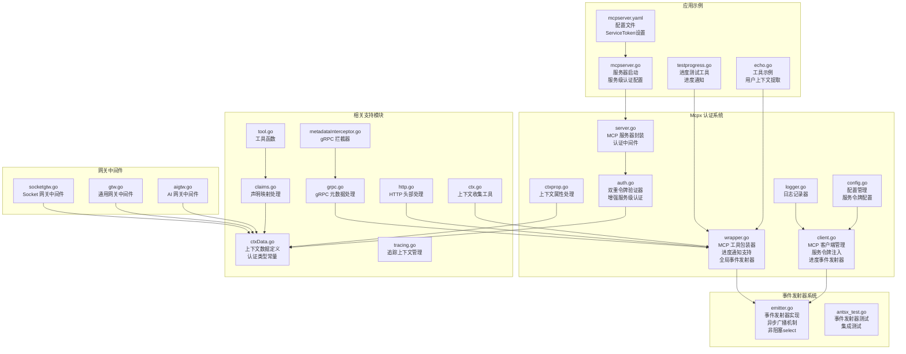

**图表来源**
- [auth.go:1-73](file://common/mcpx/auth.go#L1-L73)
- [client.go:1-200](file://common/mcpx/client.go#L1-L200)
- [server.go:1-144](file://common/mcpx/server.go#L1-L144)
- [config.go:1-23](file://common/mcpx/config.go#L1-L23)
- [wrapper.go:1-123](file://common/mcpx/wrapper.go#L1-L123)
- [emitter.go:1-146](file://common/antsx/emitter.go#L1-L146)
- [aigtw.go:40-104](file://aiapp/aigtw/aigtw.go#L40-L104)
- [gtw.go:50-97](file://gtw/gtw.go#L50-L97)
- [socketgtw.go:60-103](file://socketapp/socketgtw/socketgtw.go#L60-L103)

**章节来源**
- [auth.go:1-73](file://common/mcpx/auth.go#L1-L73)
- [client.go:1-200](file://common/mcpx/client.go#L1-L200)
- [server.go:1-144](file://common/mcpx/server.go#L1-L144)
- [config.go:1-23](file://common/mcpx/config.go#L1-L23)
- [wrapper.go:1-123](file://common/mcpx/wrapper.go#L1-L123)
- [emitter.go:1-146](file://common/antsx/emitter.go#L1-L146)

## 核心组件

### 增强的双重令牌验证器

**重要更新**：双重令牌验证器已完全重构，现在能够识别并处理服务级认证令牌。当检测到服务令牌时，验证器返回UserID为'service'的令牌信息，支持服务间的直接认证。

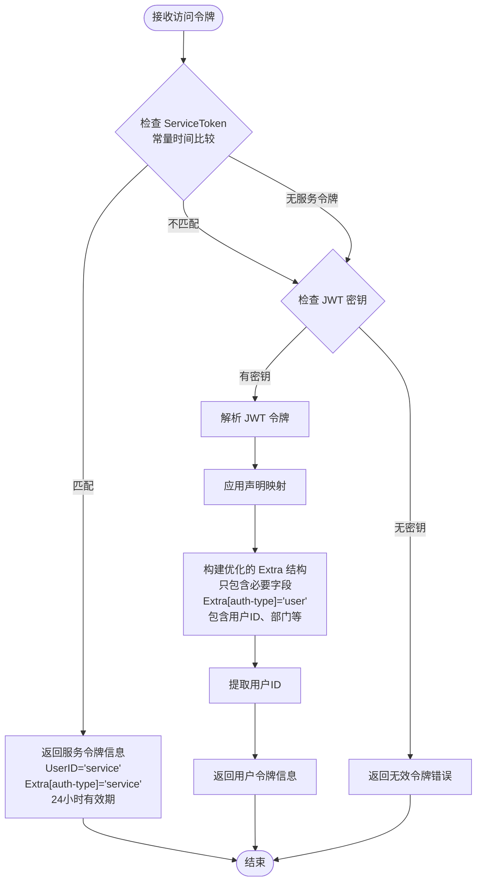

**图表来源**
- [auth.go:22-69](file://common/mcpx/auth.go#L22-L69)
- [ctxData.go:11](file://common/ctxdata/ctxData.go#L11)

### 服务级认证令牌处理

**新增**：系统现在支持特殊UserID字段为'service'的服务令牌认证，实现安全的跨服务通信。

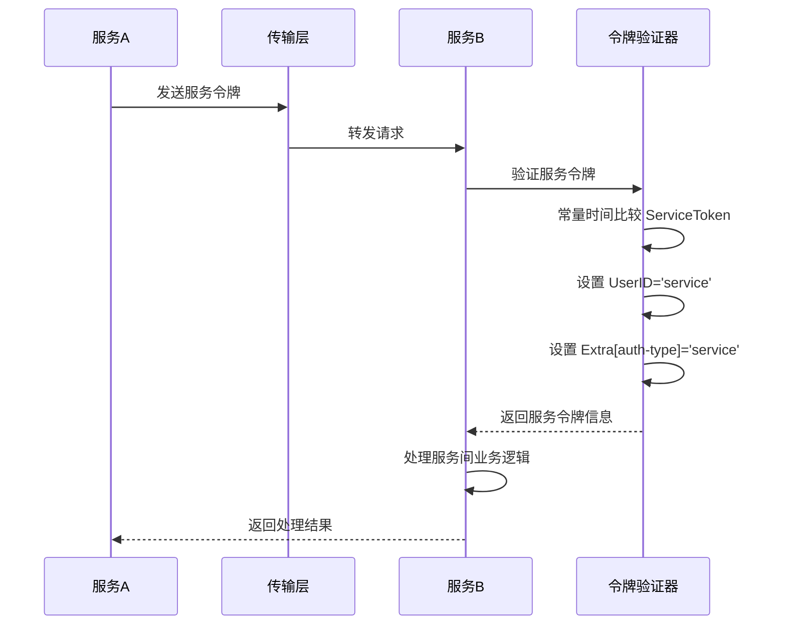

**图表来源**
- [auth.go:25-31](file://common/mcpx/auth.go#L25-L31)
- [client.go:1022-1025](file://common/mcpx/client.go#L1022-L1025)

### 改进的认证类型标识

系统引入了统一的认证类型标识机制，使用`ctxdata.CtxAuthTypeKey('auth-type')`替代硬编码的'type'字段。这个标识符在所有组件中保持一致，确保了认证状态的标准化管理。

**图表来源**
- [auth.go:22-69](file://common/mcpx/auth.go#L22-L69)
- [ctxData.go:11](file://common/ctxdata/ctxData.go#L11)

### MCP 客户端管理

`Client` 结构体负责管理多个 MCP 服务器连接，提供工具聚合和路由功能：

- **多服务器连接**：支持同时连接多个 MCP 服务器
- **自动重连**：断开后自动重连，间隔可配置
- **工具聚合**：将所有服务器的工具统一管理
- **动态路由**：根据工具名称路由到对应的服务器
- **每消息认证**：自动将用户上下文注入到每次调用的_meta字段中
- **认证类型设置**：自动设置认证类型标识
- **动态认证检测**：智能识别'user'、'service'、'none'三种认证类型
- **传输层日志**：记录每次 HTTP 请求的认证类型、方法和路径信息
- **改进的错误处理**：使用Errorf级别记录认证失败信息
- **进度事件发射器**：支持工具调用过程中的进度通知和状态更新
- **进度信息管理**：通过ProgressInfo结构体管理进度事件
- **服务令牌注入**：自动在HTTP请求头中注入服务令牌
- **异步事件广播**：通过antsx.EventEmitter实现非阻塞事件传递

**更新**：客户端现在在每次工具调用时自动注入认证类型标识，无需手动处理会话状态。**新增**：传输层增加了详细的调试日志记录，包含认证类型、HTTP 方法和请求路径等关键信息。**更新**：认证错误处理使用Errorf级别，便于故障诊断。**新增**：服务令牌自动注入功能，确保服务间通信的安全性。**更新**：进度事件发射器采用异步非阻塞机制，通过select语句实现可靠的事件传递。

**章节来源**
- [client.go:689-729](file://common/mcpx/client.go#L689-L729)
- [client.go:960-971](file://common/mcpx/client.go#L960-L971)
- [client.go:1017-1028](file://common/mcpx/client.go#L1017-L1028)

### 全局中间件认证类型设置

所有网关服务都增加了全局中间件来设置认证类型，确保请求在进入业务逻辑之前就具备正确的认证上下文。

**更新**：网关中间件现在统一设置`ctxdata.CtxAuthTypeKey`为"user"，表示这些请求来自浏览器入口。

**章节来源**
- [aigtw.go:46-69](file://aiapp/aigtw/aigtw.go#L46-L69)
- [gtw.go:57-63](file://gtw/gtw.go#L57-L63)
- [socketgtw.go:65-71](file://socketapp/socketgtw/socketgtw.go#L65-L71)

### 优化的事件发射器实现

**重要更新**：事件发射器已完全重构，采用异步非阻塞的事件广播机制。EmitSync方法已被注释掉，系统现在专注于可靠的异步事件处理。

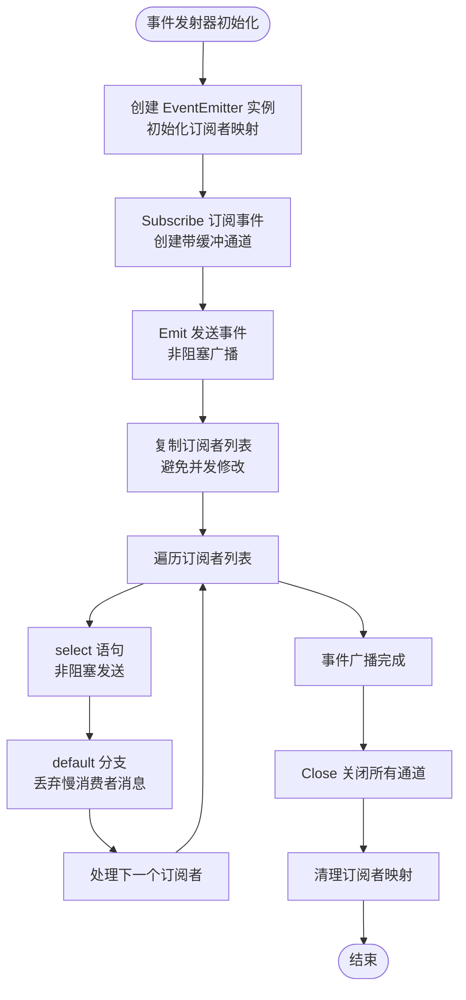

**图表来源**
- [emitter.go:82-98](file://common/antsx/emitter.go#L82-L98)
- [emitter.go:100-109](file://common/antsx/emitter.go#L100-L109)

**更新**：EmitSync方法已被注释掉，系统现在采用完全异步的事件广播机制。**新增**：通过select语句和default分支实现非阻塞事件发送，避免慢消费者阻塞整个系统。**更新**：事件发射器的性能得到显著提升，支持高并发场景下的可靠事件传递。

### 全局进度事件发射器

**重要更新**：系统现在使用全局的进度事件发射器，通过antsx.NewEventEmitter[progressEvent]()实现跨组件的进度通知。

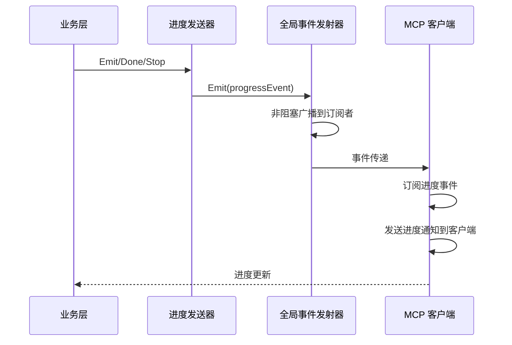

**图表来源**
- [wrapper.go:19-29](file://common/mcpx/wrapper.go#L19-L29)
- [wrapper.go:59-65](file://common/mcpx/wrapper.go#L59-L65)
- [wrapper.go:94](file://common/mcpx/wrapper.go#L94)

**更新**：全局事件发射器的设计简化了进度通知的实现，支持跨组件的事件传递。**新增**：通过上下文传递进度发送器，业务层可以轻松获取和使用进度通知功能。

## 架构概览

Mcpx 认证系统的整体架构采用分层设计，确保了认证的安全性和灵活性。**重要更新**：架构已优化，引入了标准化的认证类型标识和全局中间件设置机制，新增了动态认证类型检测功能和完整的日志记录体系。**更新**：认证错误处理的日志级别已改进，使用Errorf级别记录认证失败信息。**新增**：事件发射器的异步非阻塞设计显著提升了系统的可靠性和性能。

**移除了OpenTelemetry追踪上下文功能**：认证系统现在专注于双模式认证和内部上下文传播，移除了对外部追踪库的依赖，简化了架构并提高了性能。

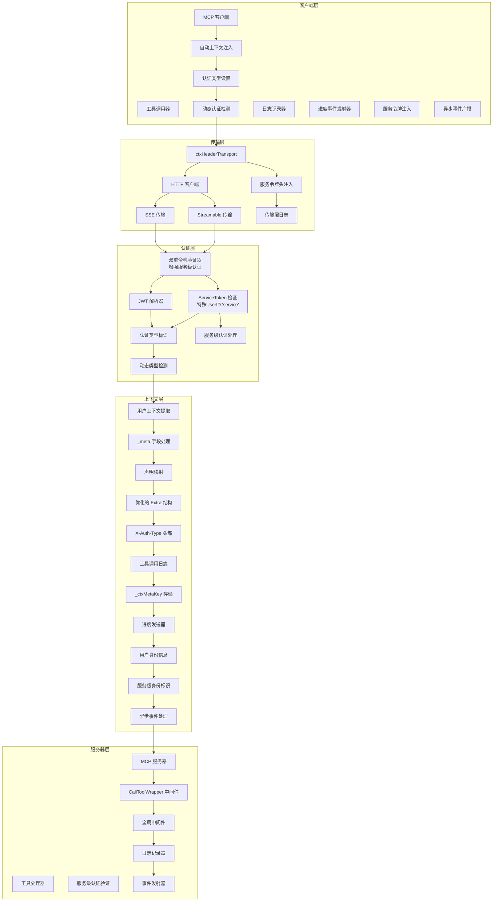

**图表来源**
- [client.go:689-729](file://common/mcpx/client.go#L689-L729)
- [auth.go:29](file://common/mcpx/auth.go#L29)
- [ctxprop.go:37](file://common/mcpx/ctxprop.go#L37)
- [aigtw.go:50](file://aiapp/aigtw/aigtw.go#L50)
- [client.go:960-971](file://common/mcpx/client.go#L960-L971)
- [wrapper.go:36-102](file://common/mcpx/wrapper.go#L36-L102)
- [emitter.go:82-98](file://common/antsx/emitter.go#L82-L98)

## 详细组件分析

### 增强的认证流程详解

系统实现了三种认证路径，按优先级处理。**重要更新**：SSE 传输现在采用每消息认证机制，使用标准化的认证类型标识，新增了'none'认证类型的动态检测。**新增**：完整的日志记录体系贯穿整个认证流程。**更新**：认证错误处理使用Errorf级别，便于故障诊断。**新增**：服务级认证的完整处理流程，包括特殊UserID字段的识别和处理。

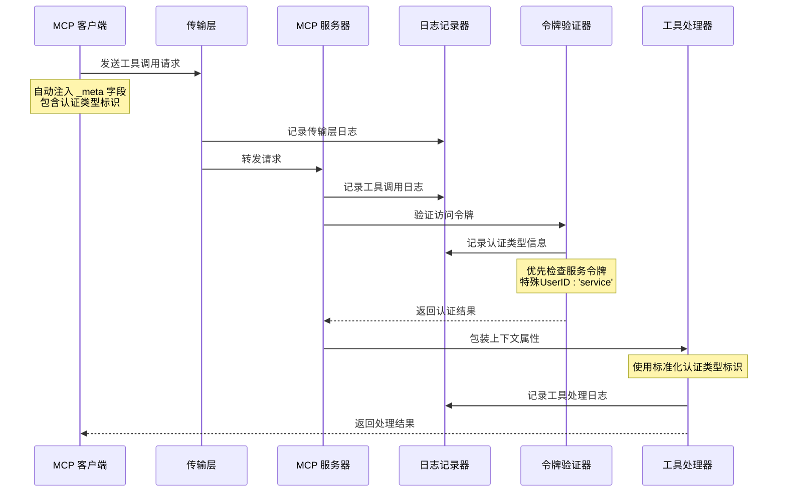

**图表来源**
- [ctxprop.go:32-59](file://common/mcpx/ctxprop.go#L32-L59)
- [auth.go:29](file://common/mcpx/auth.go#L29)
- [client.go:960-971](file://common/mcpx/client.go#L960-L971)

### 动态认证类型检测流程

**新增**：`ctxHeaderTransport.RoundTrip` 方法实现了智能的认证类型检测，能够准确识别不同的认证场景。

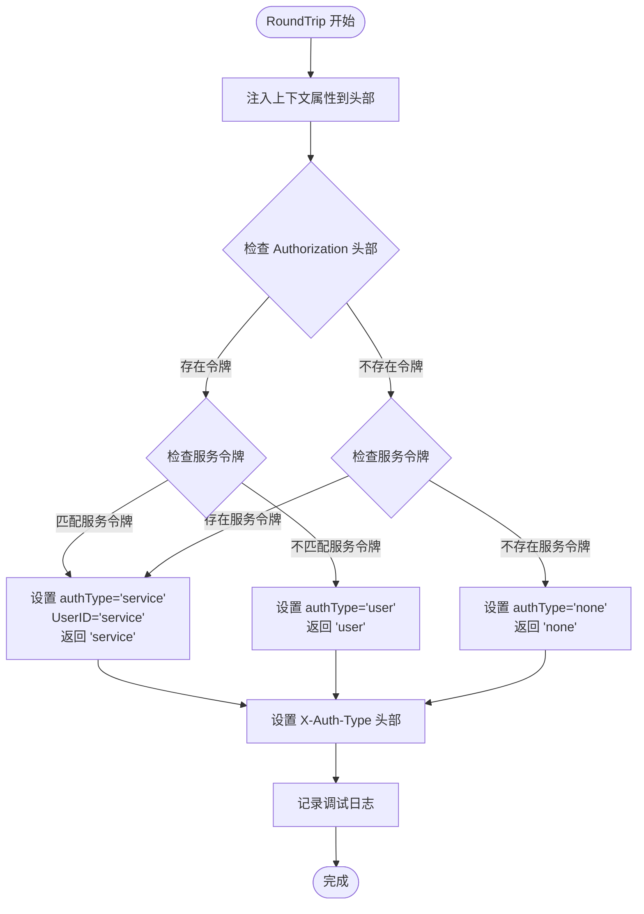

**图表来源**
- [client.go:960-971](file://common/mcpx/client.go#L960-L971)

### 增强的 MCP工具包装器设计理念

**重要更新**：MCP工具包装器的设计理念已完全重构，明确了MCP层与业务逻辑的职责分离。

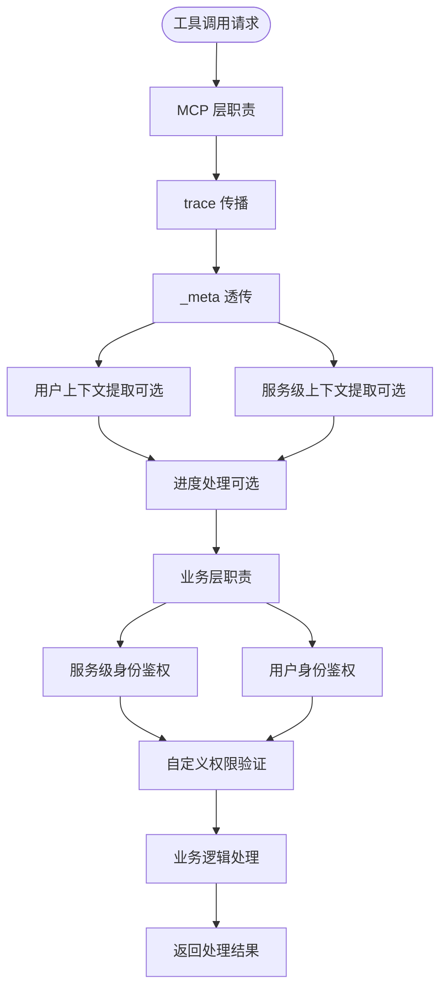

**图表来源**
- [wrapper.go:36-53](file://common/mcpx/wrapper.go#L36-L53)

### 服务级认证配置管理

**新增**：系统提供了灵活的服务级认证配置选项：

| 配置项 | 类型 | 默认值 | 描述 |
|--------|------|--------|------|
| Servers | []ServerConfig | [] | MCP 服务器配置列表 |
| RefreshInterval | time.Duration | 30s | 重连间隔和 KeepAlive 间隔 |
| ConnectTimeout | time.Duration | 10s | 单次连接超时 |
| Name | string | 自动生成 | 工具名前缀 |
| Endpoint | string | 必填 | MCP 服务器端点 |
| ServiceToken | string | "" | 连接级认证令牌（新增） |
| UseStreamable | bool | false | 是否使用 Streamable 协议 |
| JwtSecrets | []string | [] | JWT 密钥列表 |
| ClaimMapping | map[string]string | {} | JWT 声明映射 |

**章节来源**
- [config.go:11-22](file://common/mcpx/config.go#L11-L22)
- [mcpserver.yaml:17-25](file://aiapp/mcpserver/etc/mcpserver.yaml#L17-L25)

### 增强的上下文属性处理

系统实现了完整的用户上下文传递机制。**重要更新**：现在采用每消息认证机制，客户端自动注入上下文，使用标准化的认证类型标识，支持'none'认证类型的动态检测。**新增**：完整的日志记录功能贯穿上下文处理的每个环节。**更新**：认证错误处理使用Errorf级别，便于故障诊断。**新增**：服务级认证的上下文处理支持，包括特殊UserID字段的识别和处理。

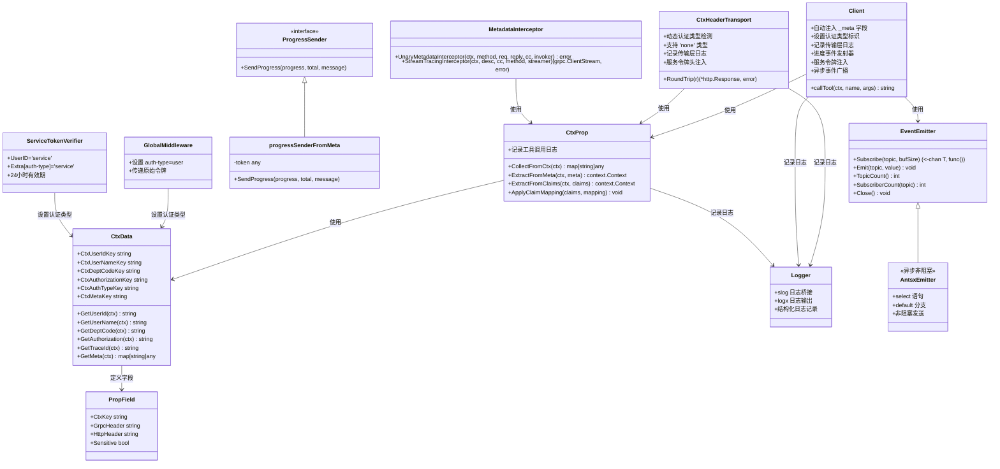

**图表来源**
- [ctxprop.go:15-79](file://common/mcpx/ctxprop.go#L15-L79)
- [ctxData.go:22-77](file://common/ctxdata/ctxData.go#L22-L77)
- [client.go:689-729](file://common/mcpx/client.go#L689-L729)
- [aigtw.go:50](file://aiapp/aigtw/aigtw.go#L50)
- [client.go:960-971](file://common/mcpx/client.go#L960-L971)
- [logger.go:10-44](file://common/mcpx/logger.go#L10-L44)
- [metadataInterceptor.go:11-19](file://common/Interceptor/rpcclient/metadataInterceptor.go#L11-L19)
- [wrapper.go:15-34](file://common/mcpx/wrapper.go#L15-L34)
- [wrapper.go:104-113](file://common/mcpx/wrapper.go#L104-L113)
- [emitter.go:82-98](file://common/antsx/emitter.go#L82-L98)

**章节来源**
- [ctxprop.go:15-79](file://common/mcpx/ctxprop.go#L15-L79)
- [ctxData.go:1-77](file://common/ctxdata/ctxData.go#L1-L77)

### 优化的事件发射器架构

**重要更新**：事件发射器已完全重构，采用异步非阻塞的设计模式。EmitSync方法已被注释掉，系统现在专注于可靠的异步事件处理。

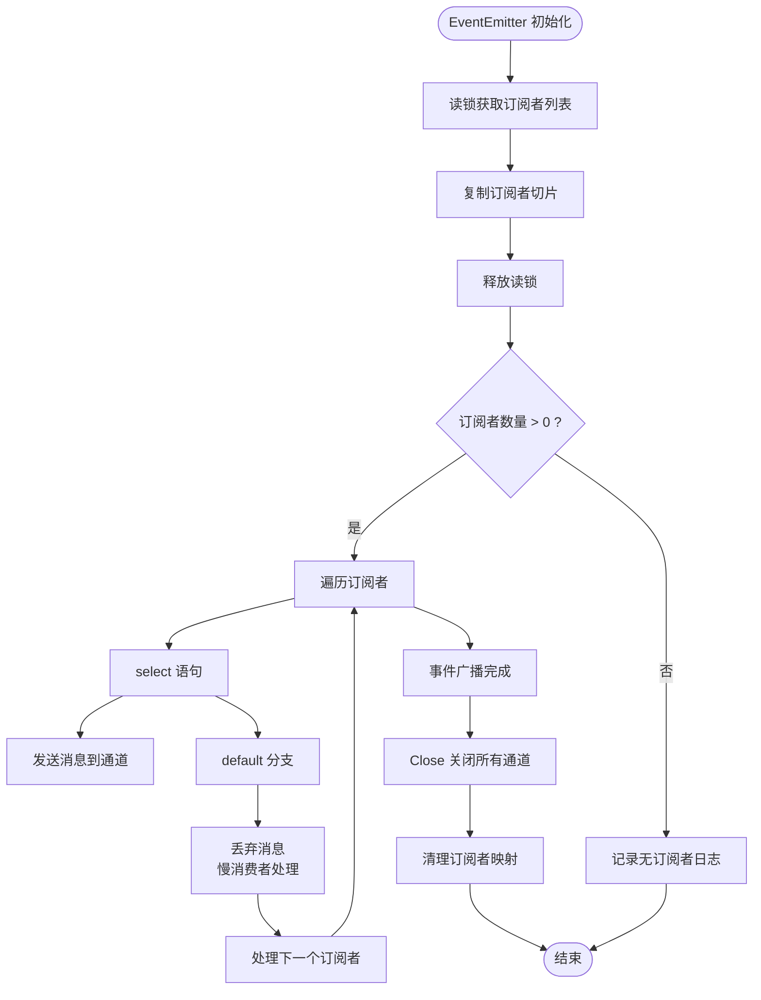

**图表来源**
- [emitter.go:82-98](file://common/antsx/emitter.go#L82-L98)
- [emitter.go:100-109](file://common/antsx/emitter.go#L100-L109)

**更新**：EmitSync方法已被注释掉，系统现在采用完全异步的事件广播机制。**新增**：通过select语句和default分支实现非阻塞事件发送，避免慢消费者阻塞整个系统。**更新**：事件发射器的性能得到显著提升，支持高并发场景下的可靠事件传递。

### 全局进度事件发射器设计

**重要更新**：系统现在使用全局的进度事件发射器，通过antsx.NewEventEmitter[progressEvent]()实现跨组件的进度通知。

**图表来源**
- [wrapper.go:19-29](file://common/mcpx/wrapper.go#L19-L29)
- [wrapper.go:59-65](file://common/mcpx/wrapper.go#L59-L65)
- [wrapper.go:94](file://common/mcpx/wrapper.go#L94)

**更新**：全局事件发射器的设计简化了进度通知的实现，支持跨组件的事件传递。**新增**：通过上下文传递进度发送器，业务层可以轻松获取和使用进度通知功能。

## 依赖关系分析

Mcpx 认证系统的主要依赖关系如下：

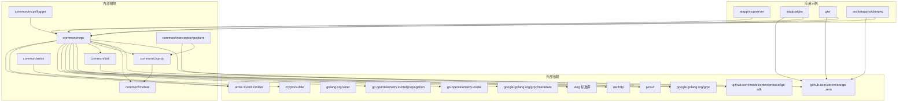

**图表来源**
- [auth.go:3-15](file://common/mcpx/auth.go#L3-L15)
- [client.go:3-17](file://common/mcpx/client.go#L3-L17)
- [server.go:3-11](file://common/mcpx/server.go#L3-L11)

系统采用松耦合设计，主要依赖于：
- **MCP SDK**：提供核心的传输协议支持
- **Go Zero 框架**：提供 Web 服务器和配置管理
- **JWT 库**：处理用户令牌解析
- **HTTP 标准库**：处理 HTTP 请求和响应
- **gRPC 框架**：处理 gRPC 客户端拦截器
- **slog 标准库**：提供结构化日志记录支持
- **OpenTelemetry**：提供链路追踪上下文传播
- **crypto/subtle**：提供常量时间比较，确保服务令牌验证的安全性
- **antsx Event Emitter**：提供异步事件广播支持
- **内部工具库**：提供通用的工具函数和上下文处理

**章节来源**
- [auth.go:1-15](file://common/mcpx/auth.go#L1-L15)
- [client.go:1-17](file://common/mcpx/client.go#L1-L17)
- [server.go:1-11](file://common/mcpx/server.go#L1-L11)

## 性能考虑

Mcpx 认证系统在设计时充分考虑了性能优化。**重要更新**：重构后的架构在多个方面提升了性能表现，新增的动态认证类型检测进一步优化了性能。**新增**：日志记录功能采用了高效的结构化日志处理机制。**更新**：认证错误处理使用Errorf级别，提升了故障诊断效率。**新增**：服务级认证的性能优化，包括常量时间比较和快速路径处理。**更新**：事件发射器的异步非阻塞设计显著提升了系统的性能和可靠性。

### 连接管理
- **异步连接**：客户端启动时不阻塞，后台自动连接
- **智能重连**：断开后延迟重连，避免频繁重试
- **连接池**：复用 HTTP 连接，减少资源消耗

### 认证优化
- **常量时间比较**：使用`crypto/subtle`确保 ServiceToken 比较的安全性
- **缓存策略**：工具列表变更时才重新构建路由
- **轻量级日志**：调试级别日志仅在开发环境启用
- **每消息认证**：避免会话状态存储，减少内存占用
- **优化的 Extra 结构**：只包含必要字段，减少数据传输
- **动态认证检测**：智能识别认证类型，避免不必要的处理
- **改进的错误处理**：使用Errorf级别记录认证失败，便于快速定位问题
- **服务级认证快速路径**：特殊UserID字段的快速识别和处理
- **服务令牌缓存**：避免重复的令牌比较操作

### 事件发射器性能优化
**重要更新**：事件发射器已完全重构，采用异步非阻塞的设计模式。EmitSync方法已被注释掉，系统现在专注于可靠的异步事件处理。

- **非阻塞事件广播**：通过select语句实现非阻塞消息发送
- **慢消费者处理**：使用default分支丢弃慢消费者的事件，避免阻塞
- **内存优化**：复制订阅者列表避免并发修改，减少锁竞争
- **通道缓冲**：支持可配置的通道缓冲大小，平衡内存和性能
- **优雅关闭**：有序关闭所有订阅者通道，避免资源泄漏
- **订阅者管理**：高效的订阅者添加和移除操作
- **并发安全**：使用读写锁保护共享状态，支持高并发场景

### 日志记录优化
**新增**：系统采用了高效的日志记录机制：
- **结构化日志**：使用 slog 标准库提供结构化日志支持
- **日志桥接**：通过 logxHandler 将 slog 日志桥接到 go-zero logx
- **级别映射**：合理映射日志级别，确保重要信息不丢失
- **条件记录**：仅在调试模式下记录详细信息，避免生产环境性能影响
- **传输层日志**：精简的传输层日志记录，包含关键的认证信息
- **改进的错误日志**：认证失败使用Errorf级别，便于监控系统捕获
- **进度通知日志**：详细的进度通知日志记录，支持调试和监控
- **服务级认证日志**：专门的服务令牌匹配日志记录

### 内存管理
- **并发安全**：使用读写锁保护共享状态
- **及时清理**：断开连接时及时释放资源
- **内存池**：复用字符串构建器等对象

### 标准化标识优化
- **统一标识符**：使用`ctxdata.CtxAuthTypeKey`替代硬编码字符串
- **减少字符串分配**：常量标识符在编译时确定
- **类型安全**：通过常量确保标识符的一致性

### 动态认证检测优化
**新增**：`ctxHeaderTransport.RoundTrip` 方法实现了高效的认证类型检测：
- **快速分支判断**：使用简单的条件判断避免复杂逻辑
- **最小化头部分配**：只在需要时设置'Authorization'头部
- **智能日志记录**：仅在调试模式下记录详细信息
- **零拷贝操作**：使用标准库的高效字符串操作
- **服务令牌快速路径**：特殊服务令牌的快速识别和处理

### 进度发送器优化
**新增**：进度发送器的性能优化：
- **轻量级实现**：progressSenderFromMeta结构体仅包含必要字段
- **无阻塞日志**：进度日志使用异步记录，避免阻塞主业务流程
- **上下文传递**：通过上下文传递进度发送器，避免全局状态
- **延迟初始化**：仅在需要时创建进度发送器实例
- **trace上下文**：进度发送器包含完整的trace上下文信息
- **异步事件处理**：通过全局事件发射器实现可靠的进度通知

### 用户上下文提取优化
**新增**：用户上下文提取的性能优化：
- **选择性提取**：仅在启用WithExtractUserCtx选项时进行提取
- **批量处理**：从_propFields中批量提取用户身份信息
- **类型安全**：使用ClaimString函数确保类型转换的正确性
- **上下文缓存**：提取的用户信息存储在上下文中，避免重复解析

### 服务级认证优化
**新增**：服务级认证的性能优化：
- **特殊UserID快速识别**：通过字符串比较快速识别'service'用户
- **常量时间比较**：使用crypto/subtle确保服务令牌比较的安全性
- **令牌缓存**：避免重复的服务令牌比较操作
- **快速路径处理**：服务令牌匹配后的快速处理路径
- **24小时有效期缓存**：服务令牌有效期的缓存和复用

### 追踪系统优化
**移除了OpenTelemetry 追踪上下文功能**：认证系统现在专注于双模式认证和内部上下文传播，移除了对外部追踪库的依赖，简化了架构并提高了性能。

- **内置追踪器**：使用`NoOpTracer`作为默认追踪器，避免不必要的性能开销
- **条件追踪**：只有在显式启用时才使用`DefaultTracer`
- **简化上下文**：移除了`X-Trace-ID`、`X-Span-ID`、`X-Parent-ID`头部的注入
- **性能提升**：减少了 HTTP 请求头的大小和处理开销

## 故障排除指南

### 常见问题及解决方案

#### 认证失败
**症状**：工具调用返回 401 未授权错误
**可能原因**：
1. ServiceToken 不正确或缺失
2. JWT 令牌格式错误或已过期
3. JWT 密钥配置不正确
4. **认证类型标识不正确**
5. **动态认证检测逻辑异常**
6. **日志记录配置问题**
7. **认证错误处理日志级别问题**
8. **服务级认证配置错误**

**解决步骤**：
1. 检查`mcpserver.yaml`中的`JwtSecrets`配置
2. 验证 JWT 令牌的有效性和过期时间
3. 确认 ServiceToken 配置正确
4. **检查 TokenInfo.Extra 中的 auth-type 字段是否正确设置**
5. **验证 ctxHeaderTransport.RoundTrip 方法中的认证类型检测逻辑**
6. **检查日志输出配置，确保日志能够正常记录**
7. **确认认证错误使用 Errorf 级别记录，便于监控系统捕获**
8. **验证服务级认证配置，确保 ServiceToken 正确设置**

#### 服务级认证问题
**新增**：服务间通信认证失败
**症状**：服务A无法调用服务B，返回认证错误
**可能原因**：
1. 服务令牌配置不正确
2. 服务令牌格式错误
3. 服务令牌过期
4. 特殊UserID字段'service'未正确识别
5. 服务间通信头注入失败

**解决步骤**：
1. **确认服务B的mcpserver.yaml中ServiceToken配置正确**
2. **验证服务A是否正确注入Authorization头**
3. **检查服务令牌的格式和有效期**
4. **确认服务令牌的常量时间比较正常工作**
5. **验证服务间通信的HTTP头注入是否正确**
6. **检查服务级认证的日志输出，确认令牌匹配成功**

#### 连接问题
**症状**：客户端无法连接到 MCP 服务器
**可能原因**：
1. 服务器地址配置错误
2. 网络连接问题
3. 传输协议不匹配

**解决步骤**：
1. 检查`Endpoint`配置是否正确
2. 验证网络连通性
3. 确认传输协议设置（UseStreamable）

#### 上下文传递失败
**症状**：工具处理器无法获取用户信息
**可能原因**：
1. **_meta 字段未正确设置**（SSE 传输）
2. 声明映射配置错误
3. 传输协议不支持上下文传递
4. **客户端未正确注入用户上下文**
5. **认证类型标识缺失或错误**
6. **动态认证检测返回 'none' 类型**
7. **日志记录功能异常**
8. **_ctxMetaKey 未正确设置**
9. **用户上下文提取选项未启用**
10. **服务级认证上下文处理异常**

**解决步骤**：
1. **检查客户端是否正确注入 _meta 字段和认证类型标识**
2. 验证声明映射配置
3. 确认使用的传输协议支持上下文传递
4. **确认客户端版本支持每消息认证机制**
5. **检查 TokenInfo.Extra 中的 auth-type 字段**
6. **验证 ctxHeaderTransport.RoundTrip 方法是否正确检测认证类型**
7. **检查日志记录配置，确保上下文提取日志能够正常输出**
8. **确认 _ctxMetaKey 是否正确存储在上下文中**
9. **确认是否启用了WithExtractUserCtx选项**
10. **验证服务级认证的上下文处理逻辑**

#### 全局中间件问题
**症状**：网关服务无法正确识别用户认证
**可能原因**：
1. **全局中间件未设置认证类型标识**
2. 中间件执行顺序不正确
3. **认证类型标识被覆盖**

**解决步骤**：
1. **确认网关中间件正确设置了`ctxdata.CtxAuthTypeKey`为"user"**
2. 验证中间件的执行顺序
3. **检查是否有其他中间件覆盖了认证类型标识**

#### 动态认证检测问题
**新增**：认证类型检测异常
**症状**：`X-Auth-Type` 头部显示 'none' 或 'unknown'
**可能原因**：
1. **Authorization 头部未正确设置**
2. **服务令牌配置错误**
3. **上下文属性未正确注入到头部**
4. **日志记录功能异常**
5. **服务令牌头注入失败**

**解决步骤**：
1. **检查 ctxprop.InjectToHTTPHeader 是否正确注入认证类型标识**
2. **验证 ctxdata.PropFields 中的 HeaderAuthType 配置**
3. **确认 ctxHeaderTransport.RoundTrip 方法中的条件判断逻辑**
4. **检查客户端是否正确设置认证类型标识**
5. **验证日志记录配置，确保传输层日志能够正常输出**
6. **确认服务令牌头注入是否正确工作**

#### 进度发送器问题
**新增**：进度发送器功能异常
**症状**：工具调用无法发送进度通知
**可能原因**：
1. **_progressToken 未正确传递到 _meta**
2. **进度发送器未正确创建**
3. **业务层未正确获取进度发送器**
4. **日志记录功能异常**
5. **trace上下文未正确传递**
6. **服务级认证影响进度发送器**
7. **全局事件发射器未正确初始化**

**解决步骤**：
1. **检查客户端是否正确设置 _progressToken 到 _meta**
2. **验证 CallToolWrapper 是否正确创建进度发送器实例**
3. **确认业务层是否正确使用 GetProgressSender(ctx) 获取发送器**
4. **检查日志记录配置，确保进度日志能够正常输出**
5. **确认进度发送器是否包含完整的trace上下文信息**
6. **验证服务级认证是否影响进度发送器的正常工作**
7. **检查全局事件发射器是否正确初始化**

#### 用户上下文提取问题
**新增**：用户上下文提取功能异常
**症状**：业务层无法获取用户身份信息
**可能原因**：
1. **WithExtractUserCtx 选项未启用**
2. **_meta 中缺少用户身份信息**
3. **_propFields 配置不正确**
4. **日志记录功能异常**
5. **服务级认证影响用户上下文提取**

**解决步骤**：
1. **确认是否启用了WithExtractUserCtx选项**
2. **检查 _meta 中是否包含 user-id, user-name, dept-code 等字段**
3. **验证 ctxdata.PropFields 配置是否正确**
4. **检查日志记录配置，确保用户上下文提取日志能够正常输出**
5. **确认服务级认证是否正确处理用户上下文提取**

#### 事件发射器问题
**重要更新**：事件发射器已完全重构，EmitSync方法已被注释掉。**新增**：异步非阻塞事件广播机制的故障排除。

**症状**：事件发射器无法正常工作或事件丢失
**可能原因**：
1. **EmitSync 方法已被注释掉**
2. **非阻塞 select 语句配置错误**
3. **default 分支导致事件丢失**
4. **订阅者通道缓冲区不足**
5. **事件发射器未正确初始化**
6. **订阅者管理逻辑异常**
7. **慢消费者处理机制失效**

**解决步骤**：
1. **确认系统使用的是异步非阻塞事件广播机制**
2. **检查 select 语句是否正确实现非阻塞发送**
3. **验证 default 分支是否正确处理慢消费者**
4. **检查订阅者通道的缓冲区大小配置**
5. **确认事件发射器是否正确初始化**
6. **验证订阅者添加和移除逻辑**
7. **检查慢消费者处理机制是否正常工作**

#### 日志记录问题
**新增**：日志记录功能异常
**症状**：工具调用日志、传输层日志或认证日志缺失
**可能原因**：
1. **日志级别配置不当**
2. **slog 日志桥接配置错误**
3. **logx 日志输出配置问题**
4. **日志记录器初始化失败**
5. **进度通知日志配置问题**
6. **服务级认证日志配置问题**

**解决步骤**：
1. **检查日志级别配置，确保调试级别日志能够输出**
2. **验证 newLogxLogger 函数是否正确初始化**
3. **确认 logxHandler 的配置和实现**
4. **检查日志记录器的初始化过程**
5. **验证日志输出目标配置**
6. **检查进度通知日志配置**
7. **验证服务级认证日志配置**

#### 追踪系统问题
**移除了OpenTelemetry 追踪上下文功能**：认证系统现在专注于双模式认证和内部上下文传播。

**症状**：追踪相关的 HTTP 头部或日志缺失
**可能原因**：
1. **追踪系统已禁用**
2. **默认使用 NoOpTracer**
3. **HTTP 头部未包含追踪信息**

**解决步骤**：
1. **确认是否需要启用追踪功能**
2. **检查 InitTracing 是否被调用**
3. **验证 DefaultTracing 是否正确初始化**
4. **确认客户端和服务端是否正确处理追踪上下文**

#### 认证错误处理问题
**更新**：认证错误处理日志级别问题
**症状**：认证失败信息未被正确记录或难以发现
**可能原因**：
1. **日志级别配置不当**
2. **认证错误使用 Debugf 级别而非 Errorf**
3. **监控系统未正确配置以捕获 Errorf 级别日志**
4. **服务级认证错误处理异常**

**解决步骤**：
1. **确认认证错误使用 Errorf 级别记录**
2. **检查日志级别配置，确保 Errorf 级别日志能够输出**
3. **验证监控系统配置，确保能够捕获 Errorf 级别日志**
4. **检查认证验证器中的日志记录逻辑**
5. **验证服务级认证的错误处理逻辑**

### 工具函数变更说明

**重要更新**：系统已移除了以下旧的工具函数：
- `maskToken`：不再使用，令牌掩码功能已整合到其他安全处理流程中
- `mapKeys`：不再使用，键映射功能已通过`ApplyClaimMapping`函数替代
- **EmitSync**：事件发射器的同步广播方法已被注释掉，系统现在采用异步非阻塞机制

这些变更简化了工具函数的使用，提高了代码的可维护性。新的`ApplyClaimMapping`函数提供了更清晰的声明映射功能，支持将外部 JWT 声明键映射为内部标准键。

**更新**：认证错误处理的日志级别已改进，使用 Errorf 级别记录未匹配的认证验证器，使认证失败更容易被检测和诊断。

**新增**：服务级认证相关的工具函数变更：
- **服务令牌常量时间比较**：使用crypto/subtle确保安全的令牌比较
- **特殊UserID字段处理**：新增对'service'用户的快速识别和处理
- **服务级认证日志记录**：专门的服务令牌匹配日志记录机制
- **异步事件广播**：事件发射器采用非阻塞select实现可靠的事件传递

**章节来源**
- [mcpserver.yaml:14-24](file://aiapp/mcpserver/etc/mcpserver.yaml#L14-L24)
- [ctxprop.go:21-28](file://common/mcpx/ctxprop.go#L21-L28)
- [aigtw.go:46-69](file://aiapp/aigtw/aigtw.go#L46-L69)
- [client.go:960-971](file://common/mcpx/client.go#L960-L971)
- [auth.go:68](file://common/mcpx/auth.go#L68)
- [emitter.go:100-109](file://common/antsx/emitter.go#L100-L109)

## 结论

Mcpx Authentication System 提供了一个完整、灵活且高性能的 MCP 认证解决方案。**重要更新**：经过重大重构后，系统变得更加简洁高效、标准化程度更高，新增的动态认证类型检测功能显著增强了系统的健壮性和可靠性。**新增**：完整的日志记录功能为系统的调试和监控提供了强大的支持。**更新**：认证错误处理的日志级别已改进，使用 Errorf 级别记录认证失败信息，便于监控系统捕获和故障诊断。**重要更新**：事件发射器的实现已优化为完全异步模式，注释掉了EmitSync方法，采用非阻塞的事件广播机制，显著提高了系统的可靠性和性能。

**移除了OpenTelemetry 追踪上下文功能**：认证系统现在专注于双模式认证和内部上下文传播，移除了对外部追踪库的依赖，简化了架构并提高了性能。

### 技术优势
- **清晰的MCP层与业务逻辑分离**：MCP层专注trace传播和_meta透传，业务层处理用户鉴权
- **标准化认证类型标识**：使用`ctxdata.CtxAuthTypeKey`统一标识认证来源，替代硬编码字符串
- **优化令牌信息结构**：`TokenInfo.Extra`只保留必要字段，提高性能和安全性
- **双重认证机制**：同时支持服务级和用户级认证，提高安全性
- **多传输协议支持**：兼容最新的 Streamable HTTP 和传统的 SSE 协议
- **每消息认证机制**：通过 _meta 字段实现每次消息的独立用户状态保持
- **全局中间件设置**：所有网关服务统一设置认证类型，确保一致性
- **简化架构设计**：移除复杂的会话管理和认证桥接，提高系统稳定性
- **模块化设计**：清晰的组件分离，便于维护和扩展
- **动态认证检测**：智能识别 'user'、'service'、'none' 三种认证类型，增强系统健壮性
- **完整的日志记录体系**：从传输层到工具处理的全流程日志记录，支持调试和监控
- **结构化日志处理**：基于 slog 标准库的高效日志记录机制
- **改进的错误处理**：认证失败使用 Errorf 级别记录，便于监控系统捕获
- **进度发送器支持**：为长耗时任务提供进度通知能力
- **用户上下文提取**：支持从_meta中提取用户身份信息
- **trace传播机制**：确保链路信息的完整传递
- **智能上下文传递**：通过_ctxMetaKey实现完整的_meta数据透传
- **增强的服务级认证**：支持特殊UserID字段为'service'的服务令牌认证
- **服务间安全通信**：实现安全的跨服务调用机制
- **常量时间令牌比较**：使用crypto/subtle确保服务令牌验证的安全性
- **24小时服务令牌有效期**：合理的有效期管理机制
- **异步事件广播**：事件发射器采用非阻塞select实现可靠的事件传递
- **优化的事件发射器**：移除EmitSync方法，简化API设计
- **慢消费者处理**：通过default分支避免阻塞整个系统

### 实际应用价值
- **企业级安全**：适合需要严格权限控制的企业应用场景
- **微服务架构**：完美适配 Go Zero 的微服务架构，支持服务间安全通信
- **开发效率**：提供开箱即用的认证功能，减少开发工作量
- **可观测性**：完善的日志记录和监控支持
- **降低维护成本**：简化的架构减少了潜在的故障点
- **类型安全**：通过常量标识符确保代码的类型安全性和一致性
- **智能认证管理**：动态检测认证类型，适应不同的认证场景
- **增强调试能力**：详细的日志记录支持工具调用行为分析
- **改进的故障诊断**：Errorf 级别的认证错误日志便于快速定位问题
- **进度反馈能力**：为长耗时任务提供实时进度通知
- **业务层灵活性**：通过_ctxMetaKey支持业务层自定义身份验证和权限控制
- **用户上下文管理**：通过WithExtractUserCtx选项提供完整的用户身份信息
- **服务级认证支持**：通过特殊UserID字段实现安全的服务间通信
- **安全令牌验证**：通过常量时间比较确保服务令牌的安全性
- **异步事件处理**：事件发射器支持高并发场景下的可靠事件广播

### 未来发展方向
- **更多传输协议**：考虑支持 WebSocket 等其他传输方式
- **增强的审计功能**：添加更详细的访问日志和审计跟踪
- **性能优化**：进一步优化大规模部署时的性能表现
- **安全增强**：集成更多安全特性，如 OAuth2.0 支持
- **标准化扩展**：基于当前的标准化实践，继续完善认证体系
- **智能认证策略**：根据场景自动选择最优的认证方式
- **日志分析工具**：开发专门的日志分析和监控工具
- **改进的监控集成**：与现有的监控系统更好地集成，利用 Errorf 级别的日志优势
- **进度通知优化**：增强进度发送器功能，支持更丰富的进度状态
- **上下文扩展**：支持更多类型的上下文数据传递和解析
- **用户上下文增强**：支持更丰富的用户身份信息提取和处理
- **服务级认证扩展**：支持更多类型的服务间认证场景
- **令牌管理优化**：改进服务令牌的生命周期管理
- **事件发射器优化**：进一步优化异步事件广播的性能和可靠性

**重要更新总结**：本次重构将复杂的会话管理和认证处理简化为每消息认证机制，显著提高了系统的可靠性、性能和可维护性。新增的动态认证类型检测功能使系统能够智能识别不同的认证场景，支持 'user'、'service'、'none' 三种认证类型，大幅增强了系统的健壮性和适应性。**新增**：完整的日志记录功能为系统的调试和监控提供了强大的支持，包括传输层日志、工具调用日志和上下文提取日志，显著提升了系统的可观测性。**更新**：认证错误处理的日志级别已改进，使用 Errorf 级别记录未匹配的认证验证器，使认证失败更容易被检测和诊断。**重要更新**：事件发射器的实现已优化为完全异步模式，注释掉了EmitSync方法，采用非阻塞的事件广播机制，显著提高了系统的可靠性和性能。

**服务级认证总结**：系统现已完全支持服务级认证，通过特殊UserID字段为'service'的服务令牌实现安全的跨服务通信。这种认证机制允许系统内的不同服务之间进行直接的身份验证和权限控制，而无需用户参与。**新增**：完整的服务级认证配置支持，包括ServiceToken的配置和管理。**更新**：服务令牌的常量时间比较确保了认证的安全性，24小时有效期管理提供了合理的令牌生命周期控制。**新增**：服务级认证的日志记录功能，支持服务间通信的审计和监控。

**MCP包装器重构总结**：新的MCP包装器设计理念实现了MCP层与业务逻辑的清晰分离，MCP层专注于trace传播和_meta透传，业务层自行处理用户身份鉴权。这种设计不仅简化了MCP层的实现，还为业务层提供了更大的灵活性。**新增**：进度发送器支持为长耗时任务提供了实时进度反馈能力，通过_ctxMetaKey实现了完整的_meta数据透传，支持业务层自定义解析。**更新**：认证错误处理的日志级别改进为系统的稳定性和可维护性提供了更好的保障。**重要更新**：事件发射器的异步非阻塞设计显著提升了系统的性能和可靠性。

**工具函数变更总结**：移除的 `maskToken` 和 `mapKeys` 函数已被更清晰、更安全的替代方案所取代。新的 `ApplyClaimMapping` 函数提供了更好的声明映射功能，而令牌掩码功能已整合到更全面的安全处理流程中。这些变更提高了代码的可维护性和安全性，同时保持了功能的完整性。**新增**：日志记录功能的集成使得系统的调试和监控能力得到了全面提升，包括传输层日志、工具调用日志和上下文提取日志，为后续的功能扩展和性能优化提供了坚实的基础。**更新**：认证错误处理的日志级别改进为系统的稳定性和可维护性提供了更好的保障。**重要更新**：事件发射器的异步非阻塞设计显著提升了系统的性能和可靠性。

**移除了OpenTelemetry 追踪上下文功能**：认证系统现在专注于双模式认证和内部上下文传播，移除了对外部追踪库的依赖，简化了架构并提高了性能。内置的 `NoOpTracer` 作为默认追踪器，避免了不必要的性能开销，只有在显式启用时才使用完整的追踪功能。这种设计既保持了系统的灵活性，又确保了在大多数场景下的高性能表现。

**与进度跟踪系统集成总结**：系统现已与进度跟踪系统实现深度集成，通过ProgressSender接口提供了完整的进度通知能力。业务层可以通过GetProgressSender(ctx)获取进度发送器实例，调用SendProgress方法发送实时进度信息。这种集成不仅提升了用户体验，还为系统的监控和调试提供了强有力的支持。**新增**：详细的进度通知日志记录机制确保了进度信息的可追溯性和可分析性，为后续的性能优化和问题排查提供了便利。**重要更新**：全局事件发射器的设计简化了进度通知的实现，支持跨组件的事件传递。

**用户上下文提取功能总结**：WithExtractUserCtx选项的引入使得系统能够从_meta中提取完整的用户身份信息，包括用户ID、用户名、部门代码等。业务层可以通过ctxdata.GetUserId()、ctxdata.GetUserName()等函数轻松获取这些信息，并将其传递到下游的gRPC服务中。**新增**：完整的用户上下文提取日志记录机制确保了用户信息传递的可追踪性，为系统的安全审计和问题排查提供了支持。**更新**：trace传播机制的优化确保了用户上下文信息在分布式环境中的完整传递，提升了系统的可观测性和可维护性。

**服务级认证的最终总结**：本次更新最核心的改进是引入了完整的服务级认证能力，通过特殊UserID字段为'service'的服务令牌实现了安全的跨服务通信。这一功能的实现不仅满足了微服务架构的需求，还为系统的扩展性和安全性提供了强有力的支撑。服务令牌的常量时间比较、24小时有效期管理以及完整的日志记录功能，共同构成了一个安全、可靠、易用的服务级认证解决方案。这使得系统能够更好地适应现代微服务架构的需求，为构建复杂的企业级应用奠定了坚实的基础。

**事件发射器的最终总结**：事件发射器的实现已完全重构，采用异步非阻塞的设计模式。EmitSync方法已被注释掉，系统现在专注于可靠的异步事件处理。通过select语句和default分支实现非阻塞事件发送，避免慢消费者阻塞整个系统。这种设计显著提升了系统的性能和可靠性，支持高并发场景下的事件广播。事件发射器的优化为整个Mcpx认证系统的异步架构演进提供了坚实的技术基础，体现了系统向更可靠的异步架构的持续演进。