# Mcpx Client Package

<cite>
**本文档引用的文件**
- [client.go](file://common/mcpx/client.go)
- [config.go](file://common/mcpx/config.go)
- [auth.go](file://common/mcpx/auth.go)
- [server.go](file://common/mcpx/server.go)
- [wrapper.go](file://common/mcpx/wrapper.go)
- [logger.go](file://common/mcpx/logger.go)
- [async_result.go](file://common/mcpx/async_result.go)
- [memory_handler.go](file://common/mcpx/memory_handler.go)
- [testprogress.go](file://aiapp/mcpserver/internal/tools/testprogress.go)
- [idutil.go](file://common/tool/idutil.go)
- [tool.go](file://common/tool/tool.go)
- [mcpserver.go](file://aiapp/mcpserver/mcpserver.go)
- [servicecontext.go](file://aiapp/aichat/internal/svc/servicecontext.go)
- [echo.go](file://aiapp/mcpserver/internal/tools/echo.go)
- [mcpserver.yaml](file://aiapp/mcpserver/etc/mcpserver.yaml)
- [asynctoolcalllogic.go](file://aiapp/aichat/internal/logic/asynctoolcalllogic.go)
- [asynctoolresultlogic.go](file://aiapp/aichat/internal/logic/asynctoolresultlogic.go)
- [asyncToolCallLogic.go](file://aiapp/aigtw/internal/logic/pass/asyncToolCallLogic.go)
- [asyncToolCallHandler.go](file://aiapp/aigtw/internal/handler/pass/asyncToolCallHandler.go)
- [emitter.go](file://common/antsx/emitter.go)
</cite>

## 更新摘要
**变更内容**
- Mcpx包装器系统完全重构，从直接MCP客户端通信转向事件驱动架构
- 新增全局progressEmitter事件发射器、ProgressEvent结构和NotifyProgress函数
- 实现异步事件驱动的进度通知系统，支持跨进程和跨服务的进度通信
- 更新UUID生成机制部分，反映从外部github.com/google/uuid库重构为内部tool.SimpleUUID()函数
- 增强上下文取消检查部分，说明测试进度工具中的上下文取消机制
- 更新依赖关系分析，反映内部UUID生成器的使用和EventEmitter的引入
- 增强性能考虑部分，包含事件驱动架构的内存效率和并发优势

## 目录
1. [简介](#简介)
2. [项目结构](#项目结构)
3. [核心组件](#核心组件)
4. [架构概览](#架构概览)
5. [详细组件分析](#详细组件分析)
6. [异步工具调用](#异步工具调用)
7. [异步结果管理](#异步结果管理)
8. [内存处理器](#内存处理器)
9. [事件驱动架构](#事件驱动架构)
10. [依赖关系分析](#依赖关系分析)
11. [性能考虑](#性能考虑)
12. [故障排除指南](#故障排除指南)
13. [结论](#结论)

## 简介

Mcpx Client Package 是一个基于 Model Context Protocol (MCP) 协议构建的客户端包，专注于连接管理和 MCP 协议的完整支持。该包提供了对工具（Tools）、提示（Prompts）、资源（Resources）、日志（Logging）、进度（Progress）、采样（Sampling）和诱导（Elicitation）等所有 MCP 核心功能的支持。

**最新更新**：Mcpx包装器系统已完全重构，从直接MCP客户端通信转向事件驱动架构。新增的全局progressEmitter事件发射器、ProgressEvent结构和NotifyProgress函数实现了异步事件驱动的进度通知系统，支持跨进程和跨服务的进度通信。这一重构显著提升了系统的解耦性和可扩展性，为整个AI聊天生态系统提供了更加灵活和高效的异步处理能力。

该包的设计目标是为 GoZero 微服务框架提供完整的 MCP 客户端解决方案，支持多服务器连接、自动重连、事件驱动进度通知、用户上下文传递等功能。它既可以用作独立的 MCP 客户端，也可以作为服务端 MCP 服务器的客户端使用。

## 项目结构

Mcpx 包位于 `common/mcpx/` 目录下，包含以下核心文件：

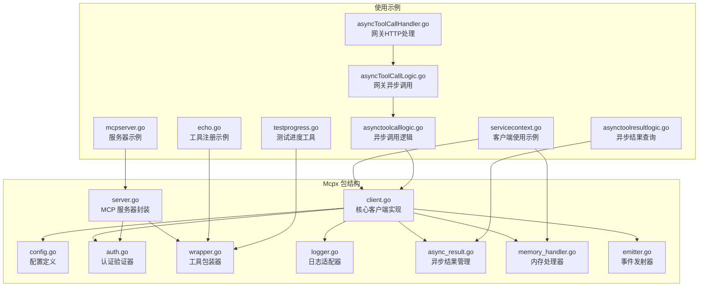
```mermaid
graph TB
subgraph "Mcpx 包结构"
A[client.go<br/>核心客户端实现]
B[config.go<br/>配置定义]
C[auth.go<br/>认证验证器]
D[server.go<br/>MCP 服务器封装]
E[wrapper.go<br/>工具包装器]
F[logger.go<br/>日志适配器]
G[async_result.go<br/>异步结果管理]
H[memory_handler.go<br/>内存处理器]
I[emitter.go<br/>事件发射器]
end
subgraph "使用示例"
J[mcpserver.go<br/>服务器示例]
K[servicecontext.go<br/>客户端使用示例]
L[echo.go<br/>工具注册示例]
M[testprogress.go<br/>测试进度工具]
N[asynctoolcalllogic.go<br/>异步调用逻辑]
O[asynctoolresultlogic.go<br/>异步结果查询]
P[asyncToolCallLogic.go<br/>网关异步调用]
Q[asyncToolCallHandler.go<br/>网关HTTP处理]
end
A --> B
A --> C
A --> F
A --> G
A --> H
A --> I
D --> C
D --> E
J --> D
K --> A
K --> H
L --> E
M --> E
N --> A
O --> G
P --> N
Q --> P
```

**图表来源**
- [client.go:1-50](file://common/mcpx/client.go#L1-L50)
- [config.go:1-23](file://common/mcpx/config.go#L1-L23)
- [async_result.go:1-34](file://common/mcpx/async_result.go#L1-L34)
- [memory_handler.go:1-146](file://common/mcpx/memory_handler.go#L1-L146)
- [emitter.go:1-118](file://common/antsx/emitter.go#L1-L118)

**章节来源**
- [client.go:1-154](file://common/mcpx/client.go#L1-L154)
- [config.go:1-23](file://common/mcpx/config.go#L1-L23)

## 核心组件

Mcpx 包包含以下核心组件：

### 客户端组件

1. **Client** - 主要的 MCP 客户端，管理多个连接
2. **Connection** - 单个 MCP 服务连接
3. **Config** - 客户端配置
4. **ServerConfig** - 服务器配置

### 服务器组件

1. **McpServer** - 带认证的 MCP 服务器封装
2. **McpServerConf** - 服务器配置

### 工具包装器

1. **CallToolWrapper** - 工具调用包装器
2. **ProgressSender** - 进度发送器

### 异步处理组件

1. **AsyncToolResult** - 异步工具执行结果
2. **AsyncResultHandler** - 异步结果处理器接口
3. **CallToolAsyncRequest** - 异步工具调用请求
4. **MemoryAsyncResultHandler** - 内存版异步结果处理器

### 事件驱动组件

1. **progressEmitter** - 全局事件发射器
2. **ProgressEvent** - 进度事件结构
3. **EventEmitter** - 通用事件发射器实现

### UUID生成机制

1. **SimpleUUID** - 内部UUID生成器，替代外部github.com/google/uuid依赖
2. **IdUtil.SimpleUUID** - 基于IdUtil的UUID生成方法

**更新** 新增了完整的事件驱动架构组件，包括全局事件发射器、进度事件结构和NotifyProgress函数，以及内存处理器用于任务状态存储。

**章节来源**
- [client.go:25-86](file://common/mcpx/client.go#L25-L86)
- [server.go:24-31](file://common/mcpx/server.go#L24-L31)
- [wrapper.go:18-28](file://common/mcpx/wrapper.go#L18-L28)
- [async_result.go:5-33](file://common/mcpx/async_result.go#L5-L33)
- [memory_handler.go:16-29](file://common/mcpx/memory_handler.go#L16-L29)
- [emitter.go:13-25](file://common/antsx/emitter.go#L13-L25)
- [tool.go:133-140](file://common/tool/tool.go#L133-L140)

## 架构概览

Mcpx 包采用分层架构设计，支持多种传输协议和认证机制，并新增了事件驱动处理能力：

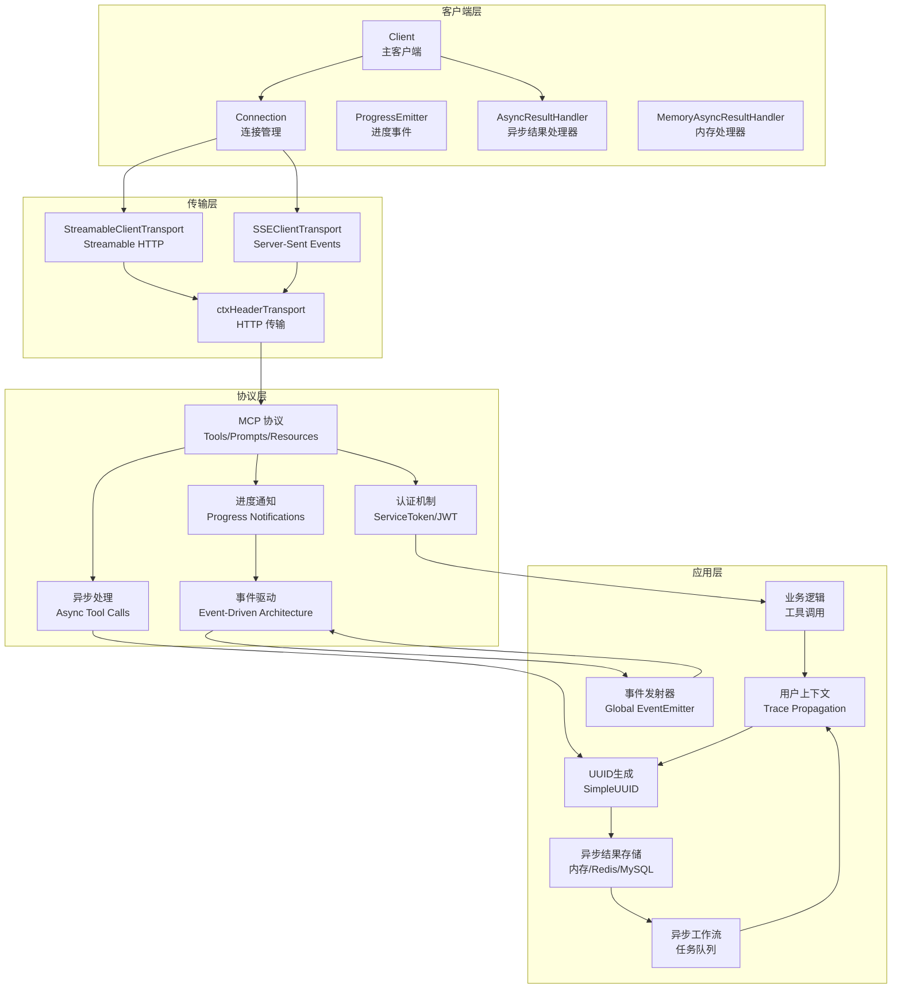
```mermaid
graph TB
subgraph "客户端层"
A[Client<br/>主客户端]
B[Connection<br/>连接管理]
C[ProgressEmitter<br/>进度事件]
D[AsyncResultHandler<br/>异步结果处理器]
E[MemoryAsyncResultHandler<br/>内存处理器]
end
subgraph "传输层"
F[StreamableClientTransport<br/>Streamable HTTP]
G[SSEClientTransport<br/>Server-Sent Events]
H[ctxHeaderTransport<br/>HTTP 传输]
end
subgraph "协议层"
I[MCP 协议<br/>Tools/Prompts/Resources]
J[进度通知<br/>Progress Notifications]
K[认证机制<br/>ServiceToken/JWT]
L[异步处理<br/>Async Tool Calls]
M[事件驱动<br/>Event-Driven Architecture]
end
subgraph "应用层"
N[业务逻辑<br/>工具调用]
O[用户上下文<br/>Trace Propagation]
P[UUID生成<br/>SimpleUUID]
Q[异步结果存储<br/>内存/Redis/MySQL]
R[异步工作流<br/>任务队列]
S[事件发射器<br/>Global EventEmitter]
end
A --> B
A --> D
B --> F
B --> G
F --> H
G --> H
H --> I
I --> J
I --> K
I --> L
J --> M
K --> N
L --> P
M --> S
N --> O
O --> P
P --> Q
Q --> R
R --> O
S --> M
```

**图表来源**
- [client.go:512-582](file://common/mcpx/client.go#L512-L582)
- [server.go:93-113](file://common/mcpx/server.go#L93-L113)
- [async_result.go:16-33](file://common/mcpx/async_result.go#L16-L33)
- [memory_handler.go:16-29](file://common/mcpx/memory_handler.go#L16-L29)
- [emitter.go:13-25](file://common/antsx/emitter.go#L13-L25)

## 详细组件分析

### Client 组件分析

Client 是 Mcpx 包的核心组件，负责管理多个 MCP 服务器连接：

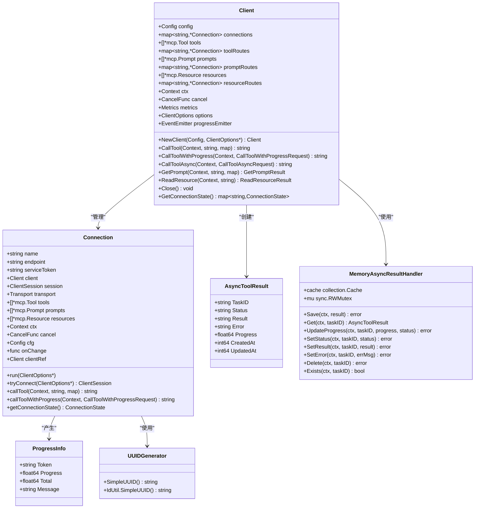
```mermaid
classDiagram
class Client {
+Config config
+map~string,*Connection~ connections
+[]*mcp.Tool tools
+map~string,*Connection~ toolRoutes
+[]*mcp.Prompt prompts
+map~string,*Connection~ promptRoutes
+[]*mcp.Resource resources
+map~string,*Connection~ resourceRoutes
+Context ctx
+CancelFunc cancel
+Metrics metrics
+ClientOptions options
+EventEmitter progressEmitter
+NewClient(Config, ClientOptions*) Client
+CallTool(Context, string, map) string
+CallToolWithProgress(Context, CallToolWithProgressRequest) string
+CallToolAsync(Context, CallToolAsyncRequest) string
+GetPrompt(Context, string, map) GetPromptResult
+ReadResource(Context, string) ReadResourceResult
+Close() void
+GetConnectionState() map~string,ConnectionState~
}
class Connection {
+string name
+string endpoint
+string serviceToken
+Client client
+ClientSession session
+Transport transport
+[]*mcp.Tool tools
+[]*mcp.Prompt prompts
+[]*mcp.Resource resources
+Context ctx
+CancelFunc cancel
+Config cfg
+func onChange
+Client clientRef
+run(ClientOptions*)
+tryConnect(ClientOptions*) ClientSession
+callTool(Context, string, map) string
+callToolWithProgress(Context, CallToolWithProgressRequest) string
+getConnectionState() ConnectionState
}
class ProgressInfo {
+string Token
+float64 Progress
+float64 Total
+string Message
}
class UUIDGenerator {
+SimpleUUID() string
+IdUtil.SimpleUUID() string
}
class AsyncToolResult {
+string TaskID
+string Status
+string Result
+string Error
+float64 Progress
+int64 CreatedAt
+int64 UpdatedAt
}
class MemoryAsyncResultHandler {
+cache collection.Cache
+mu sync.RWMutex
+Save(ctx, result) error
+Get(ctx, taskID) AsyncToolResult
+UpdateProgress(ctx, taskID, progress, status) error
+SetStatus(ctx, taskID, status) error
+SetResult(ctx, taskID, result) error
+SetError(ctx, taskID, errMsg) error
+Delete(ctx, taskID) error
+Exists(ctx, taskID) bool
}
Client --> Connection : "管理"
Connection --> ProgressInfo : "产生"
Connection --> UUIDGenerator : "使用"
Client --> AsyncToolResult : "创建"
Client --> MemoryAsyncResultHandler : "使用"
```

**图表来源**
- [client.go:27-74](file://common/mcpx/client.go#L27-L74)
- [client.go:87-92](file://common/mcpx/client.go#L87-L92)
- [async_result.go:6-14](file://common/mcpx/async_result.go#L6-L14)
- [memory_handler.go:18-28](file://common/mcpx/memory_handler.go#L18-L28)
- [tool.go:133-140](file://common/tool/tool.go#L133-L140)

#### 连接管理流程

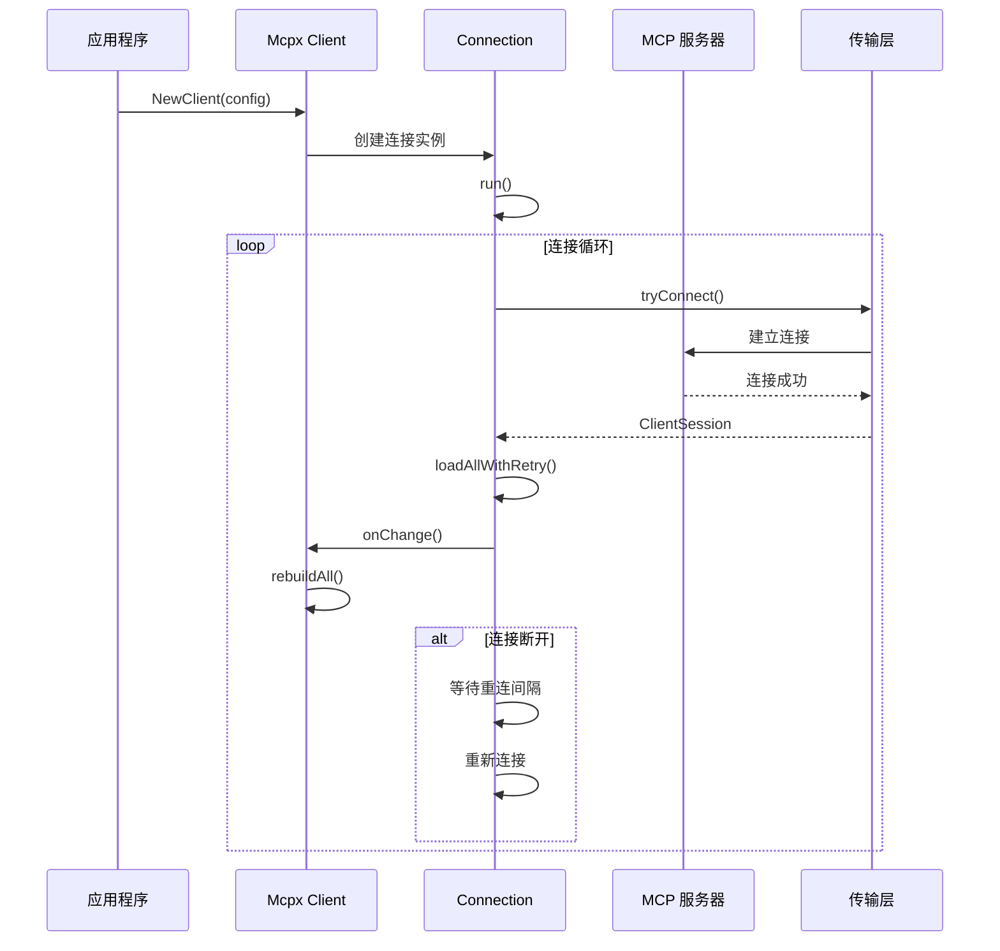
```mermaid
sequenceDiagram
participant App as 应用程序
participant Client as Mcpx Client
participant Conn as Connection
participant Server as MCP 服务器
participant Transport as 传输层
App->>Client : NewClient(config)
Client->>Conn : 创建连接实例
Conn->>Conn : run()
loop 连接循环
Conn->>Transport : tryConnect()
Transport->>Server : 建立连接
Server-->>Transport : 连接成功
Transport-->>Conn : ClientSession
Conn->>Conn : loadAllWithRetry()
Conn->>Client : onChange()
Client->>Client : rebuildAll()
alt 连接断开
Conn->>Conn : 等待重连间隔
Conn->>Conn : 重新连接
end
end
```

**图表来源**
- [client.go:512-535](file://common/mcpx/client.go#L512-L535)
- [client.go:538-582](file://common/mcpx/client.go#L538-L582)

**章节来源**
- [client.go:94-154](file://common/mcpx/client.go#L94-L154)
- [client.go:511-582](file://common/mcpx/client.go#L511-L582)

### 服务器组件分析

McpServer 提供了带认证的 MCP 服务器封装：

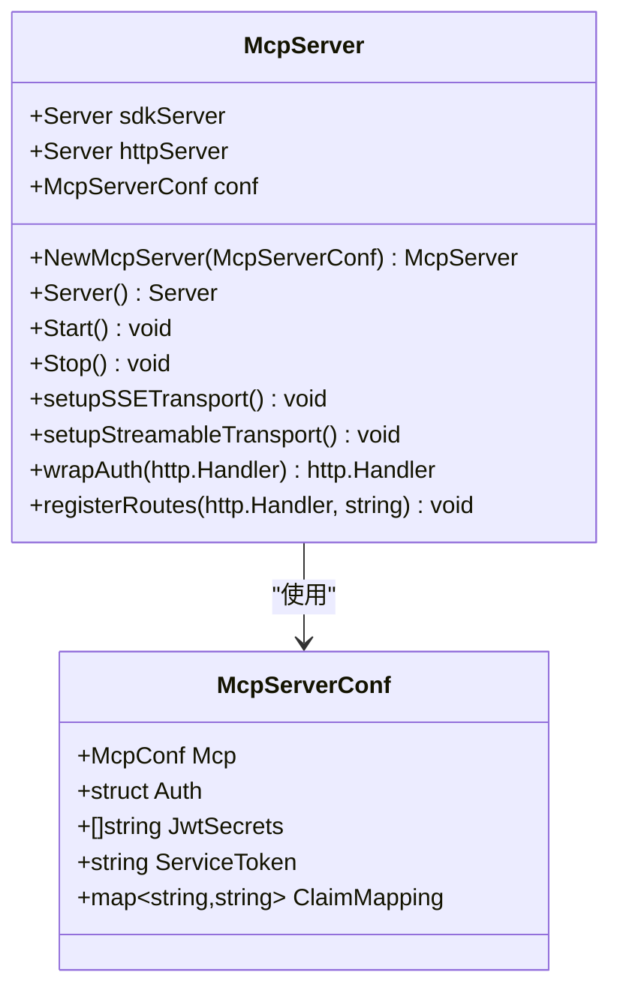
```mermaid
classDiagram
class McpServer {
+Server sdkServer
+Server httpServer
+McpServerConf conf
+NewMcpServer(McpServerConf) McpServer
+Server() Server
+Start() void
+Stop() void
+setupSSETransport() void
+setupStreamableTransport() void
+wrapAuth(http.Handler) http.Handler
+registerRoutes(http.Handler, string) void
}
class McpServerConf {
+McpConf Mcp
+struct Auth
+[]string JwtSecrets
+string ServiceToken
+map~string,string~ ClaimMapping
}
McpServer --> McpServerConf : "使用"
```

**图表来源**
- [server.go:13-31](file://common/mcpx/server.go#L13-L31)
- [server.go:15-22](file://common/mcpx/server.go#L15-L22)

#### 认证流程

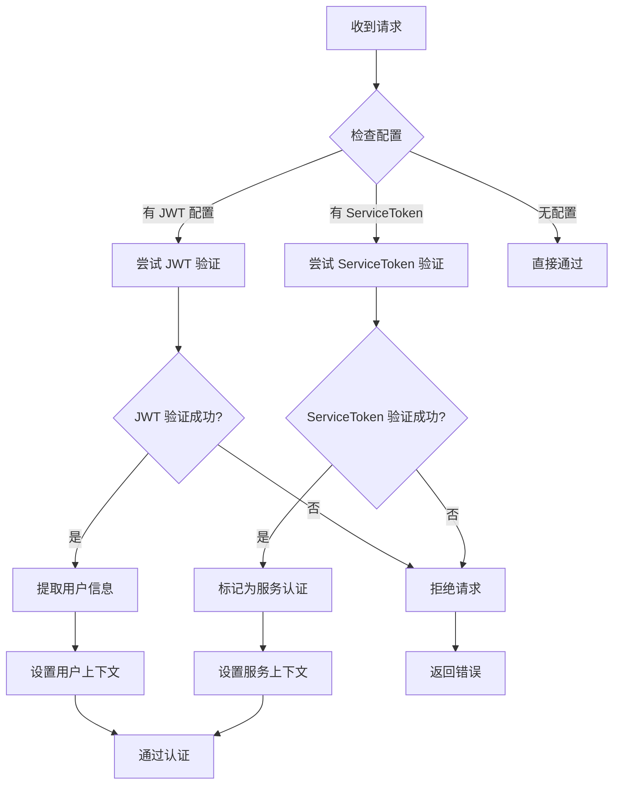
```mermaid
flowchart TD
A[收到请求] --> B{检查配置}
B --> |有 JWT 配置| C[尝试 JWT 验证]
B --> |有 ServiceToken| D[尝试 ServiceToken 验证]
B --> |无配置| E[直接通过]
C --> F{JWT 验证成功?}
F --> |是| G[提取用户信息]
F --> |否| H[拒绝请求]
D --> I{ServiceToken 验证成功?}
I --> |是| J[标记为服务认证]
I --> |否| H
G --> K[设置用户上下文]
J --> L[设置服务上下文]
K --> M[通过认证]
L --> M
H --> N[返回错误]
```

**图表来源**
- [auth.go:22-71](file://common/mcpx/auth.go#L22-L71)

**章节来源**
- [server.go:33-72](file://common/mcpx/server.go#L33-L72)
- [auth.go:17-71](file://common/mcpx/auth.go#L17-L71)

### 工具包装器分析

CallToolWrapper 提供了工具调用的包装功能：

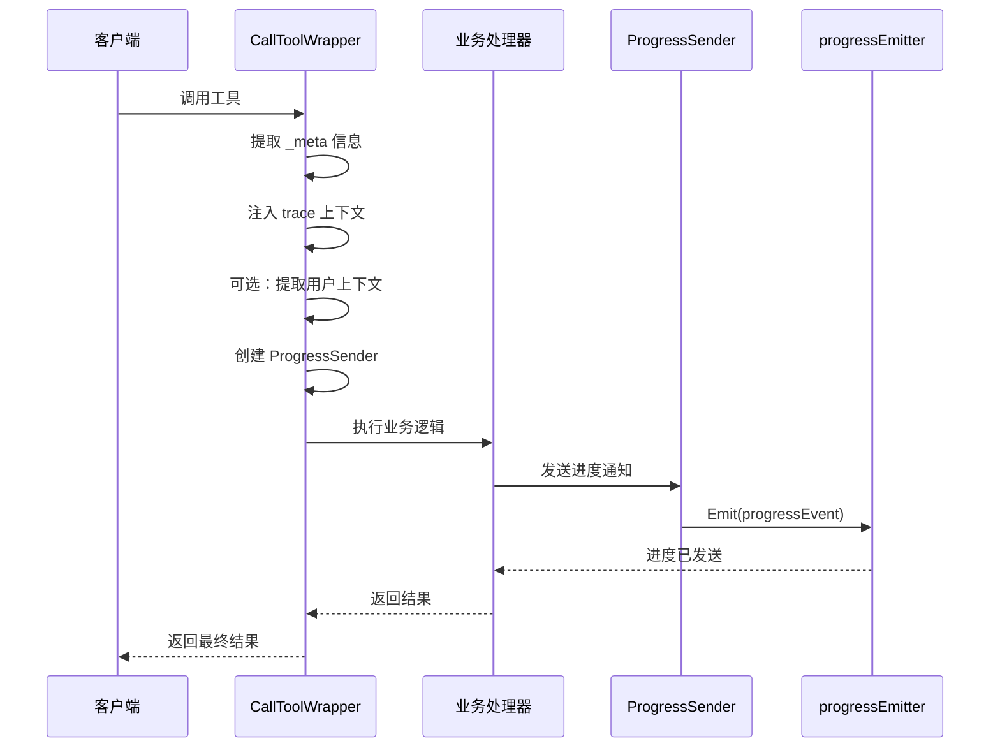
```mermaid
sequenceDiagram
participant Client as 客户端
participant Wrapper as CallToolWrapper
participant Handler as 业务处理器
participant Sender as ProgressSender
participant Emitter as progressEmitter
Client->>Wrapper : 调用工具
Wrapper->>Wrapper : 提取 _meta 信息
Wrapper->>Wrapper : 注入 trace 上下文
Wrapper->>Wrapper : 可选：提取用户上下文
Wrapper->>Wrapper : 创建 ProgressSender
Wrapper->>Handler : 执行业务逻辑
Handler->>Sender : 发送进度通知
Sender->>Emitter : Emit(progressEvent)
Emitter-->>Handler : 进度已发送
Handler-->>Wrapper : 返回结果
Wrapper-->>Client : 返回最终结果
```

**图表来源**
- [wrapper.go:95-157](file://common/mcpx/wrapper.go#L95-L157)

**更新** 新增了上下文取消检查机制，确保长运行操作能够及时响应取消信号。

**章节来源**
- [wrapper.go:71-157](file://common/mcpx/wrapper.go#L71-L157)

### 测试进度工具分析

测试进度工具展示了上下文取消检查和资源管理的最佳实践：

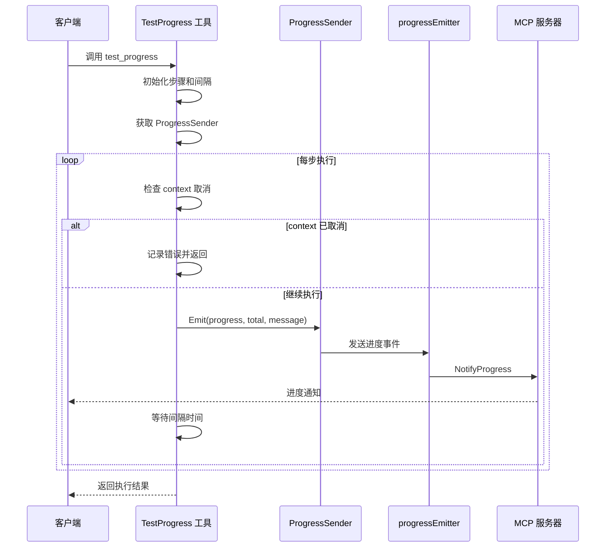
```mermaid
sequenceDiagram
participant Client as 客户端
participant TestTool as TestProgress 工具
participant Sender as ProgressSender
participant Emitter as progressEmitter
participant Server as MCP 服务器
Client->>TestTool : 调用 test_progress
TestTool->>TestTool : 初始化步骤和间隔
TestTool->>TestTool : 获取 ProgressSender
loop 每步执行
TestTool->>TestTool : 检查 context 取消
alt context 已取消
TestTool->>TestTool : 记录错误并返回
else 继续执行
TestTool->>Sender : Emit(progress, total, message)
Sender->>Emitter : 发送进度事件
Emitter->>Server : NotifyProgress
Server-->>Client : 进度通知
TestTool->>TestTool : 等待间隔时间
end
end
TestTool-->>Client : 返回执行结果
```

**图表来源**
- [testprogress.go:27-77](file://aiapp/mcpserver/internal/tools/testprogress.go#L27-L77)

**章节来源**
- [testprogress.go:1-78](file://aiapp/mcpserver/internal/tools/testprogress.go#L1-L78)

## 异步工具调用

Mcpx 包新增了完整的异步工具调用能力，支持非阻塞的工具执行和结果查询：

### CallToolAsync 方法

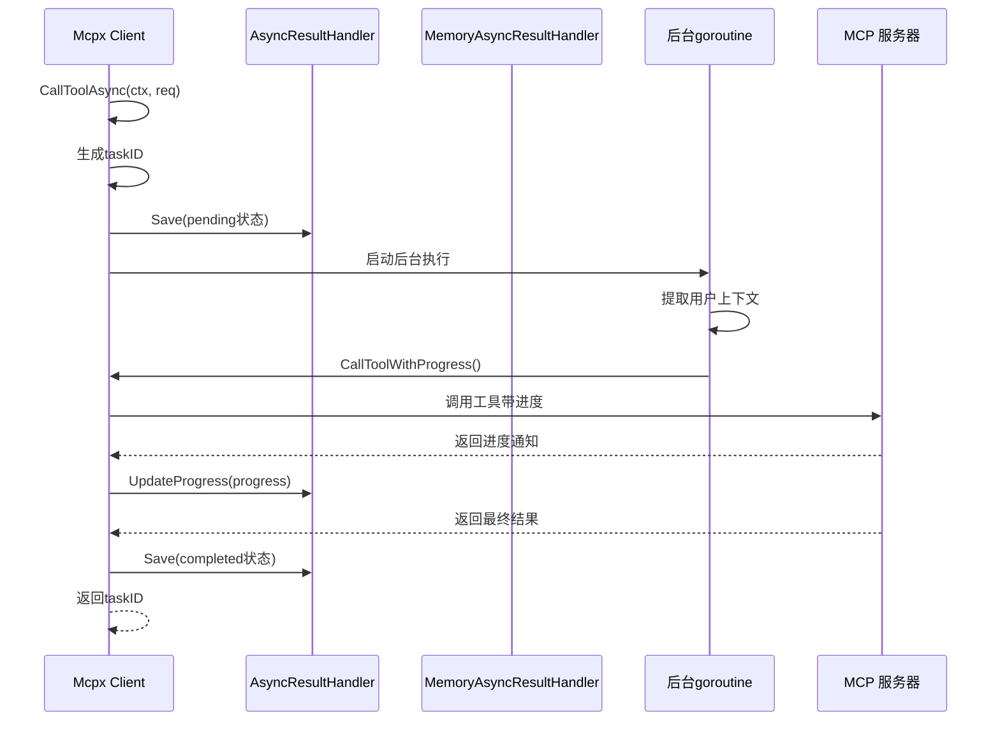
```mermaid
sequenceDiagram
participant Client as Mcpx Client
participant AsyncHandler as AsyncResultHandler
participant MemoryHandler as MemoryAsyncResultHandler
participant Background as 后台goroutine
participant Server as MCP 服务器
Client->>Client : CallToolAsync(ctx, req)
Client->>Client : 生成taskID
Client->>AsyncHandler : Save(pending状态)
Client->>Background : 启动后台执行
Background->>Background : 提取用户上下文
Background->>Client : CallToolWithProgress()
Client->>Server : 调用工具带进度
Server-->>Client : 返回进度通知
Client->>AsyncHandler : UpdateProgress(progress)
Server-->>Client : 返回最终结果
Client->>AsyncHandler : Save(completed状态)
Client-->>Client : 返回taskID
```

**图表来源**
- [client.go:913-981](file://common/mcpx/client.go#L913-L981)

### 异步调用流程

```mermaid
flowchart TD
A[调用 CallToolAsync] --> B[生成唯一taskID]
B --> C[保存pending状态到AsyncHandler]
C --> D[启动后台goroutine]
D --> E[提取用户上下文字段]
E --> F[调用CallToolWithProgress]
F --> G{进度通知}
G --> |进度更新| H[AsyncHandler.UpdateProgress]
G --> |完成| I[AsyncHandler.Save(completed)]
H --> J{继续执行}
J --> |继续| G
J --> |完成| K[返回taskID]
I --> K
```

**图表来源**
- [client.go:932-981](file://common/mcpx/client.go#L932-L981)

**章节来源**
- [client.go:913-981](file://common/mcpx/client.go#L913-L981)

## 异步结果管理

AsyncToolResult 和 AsyncResultHandler 提供了完整的异步结果管理功能：

### AsyncToolResult 结构

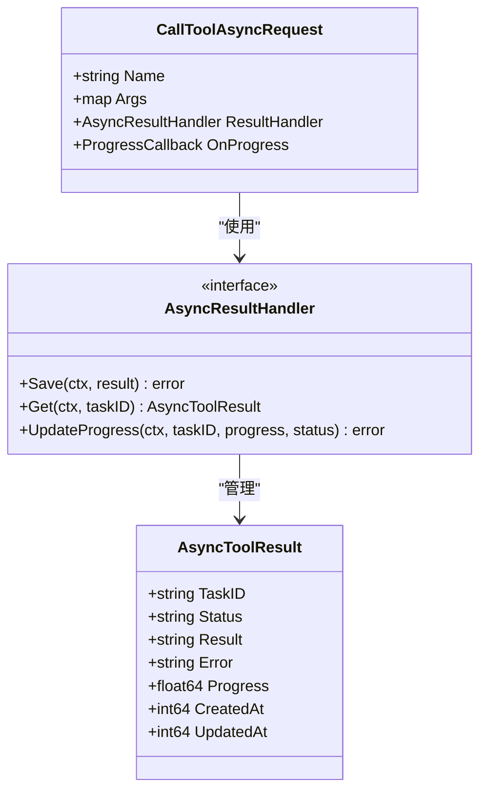
```mermaid
classDiagram
class AsyncToolResult {
+string TaskID
+string Status
+string Result
+string Error
+float64 Progress
+int64 CreatedAt
+int64 UpdatedAt
}
class AsyncResultHandler {
<<interface>>
+Save(ctx, result) error
+Get(ctx, taskID) AsyncToolResult
+UpdateProgress(ctx, taskID, progress, status) error
}
class CallToolAsyncRequest {
+string Name
+map Args
+AsyncResultHandler ResultHandler
+ProgressCallback OnProgress
}
AsyncResultHandler --> AsyncToolResult : "管理"
CallToolAsyncRequest --> AsyncResultHandler : "使用"
```

**图表来源**
- [async_result.go:5-33](file://common/mcpx/async_result.go#L5-L33)

### 异步结果处理流程

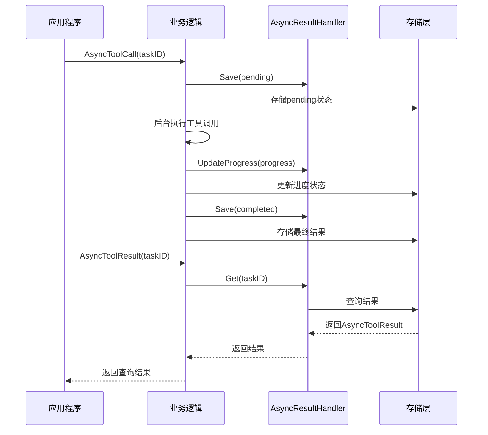
```mermaid
sequenceDiagram
participant App as 应用程序
participant Logic as 业务逻辑
participant Handler as AsyncResultHandler
participant Storage as 存储层
App->>Logic : AsyncToolCall(taskID)
Logic->>Handler : Save(pending)
Logic->>Storage : 存储pending状态
Logic->>Logic : 后台执行工具调用
Logic->>Handler : UpdateProgress(progress)
Logic->>Storage : 更新进度状态
Logic->>Handler : Save(completed)
Logic->>Storage : 存储最终结果
App->>Logic : AsyncToolResult(taskID)
Logic->>Handler : Get(taskID)
Handler->>Storage : 查询结果
Storage-->>Handler : 返回AsyncToolResult
Handler-->>Logic : 返回结果
Logic-->>App : 返回查询结果
```

**图表来源**
- [async_result.go:16-33](file://common/mcpx/async_result.go#L16-L33)

**章节来源**
- [async_result.go:1-34](file://common/mcpx/async_result.go#L1-L34)

## 内存处理器

MemoryAsyncResultHandler 提供了基于内存的异步结果存储解决方案：

### 内存处理器功能

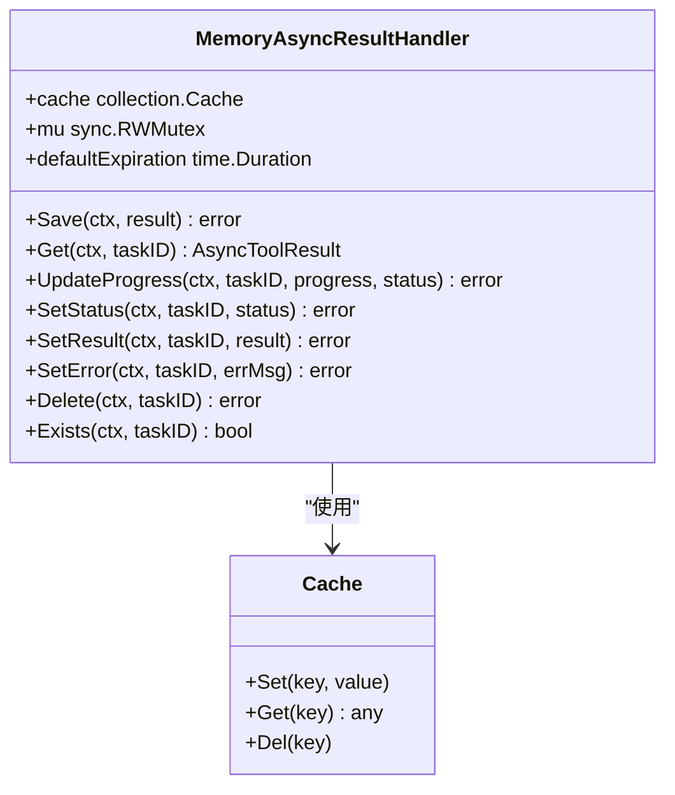
```mermaid
classDiagram
class MemoryAsyncResultHandler {
+cache collection.Cache
+mu sync.RWMutex
+defaultExpiration time.Duration
+Save(ctx, result) error
+Get(ctx, taskID) AsyncToolResult
+UpdateProgress(ctx, taskID, progress, status) error
+SetStatus(ctx, taskID, status) error
+SetResult(ctx, taskID, result) error
+SetError(ctx, taskID, errMsg) error
+Delete(ctx, taskID) error
+Exists(ctx, taskID) bool
}
class Cache {
+Set(key, value)
+Get(key) any
+Del(key)
}
MemoryAsyncResultHandler --> Cache : "使用"
```

**图表来源**
- [memory_handler.go:16-29](file://common/mcpx/memory_handler.go#L16-L29)
- [memory_handler.go:31-45](file://common/mcpx/memory_handler.go#L31-L45)

### 内存存储流程

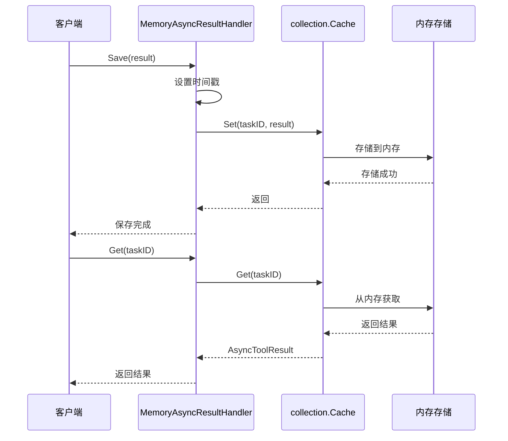
```mermaid
sequenceDiagram
participant Client as 客户端
participant MemoryHandler as MemoryAsyncResultHandler
participant Cache as collection.Cache
participant Storage as 内存存储
Client->>MemoryHandler : Save(result)
MemoryHandler->>MemoryHandler : 设置时间戳
MemoryHandler->>Cache : Set(taskID, result)
Cache->>Storage : 存储到内存
Storage-->>Cache : 存储成功
Cache-->>MemoryHandler : 返回
MemoryHandler-->>Client : 保存完成
Client->>MemoryHandler : Get(taskID)
MemoryHandler->>Cache : Get(taskID)
Cache->>Storage : 从内存获取
Storage-->>Cache : 返回结果
Cache-->>MemoryHandler : AsyncToolResult
MemoryHandler-->>Client : 返回结果
```

**图表来源**
- [memory_handler.go:31-61](file://common/mcpx/memory_handler.go#L31-L61)

**章节来源**
- [memory_handler.go:1-146](file://common/mcpx/memory_handler.go#L1-L146)

## 事件驱动架构

Mcpx 包引入了全新的事件驱动架构，实现了跨进程和跨服务的进度通信：

### 全局事件发射器

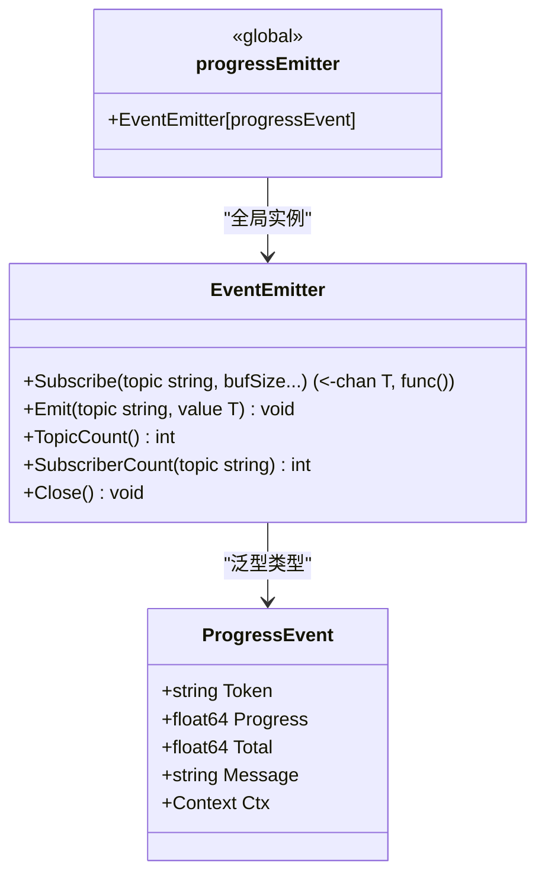
```mermaid
classDiagram
class EventEmitter {
+Subscribe(topic string, bufSize...) (<-chan T, func())
+Emit(topic string, value T) void
+TopicCount() int
+SubscriberCount(topic string) int
+Close() void
}
class progressEmitter {
<<global>>
+EventEmitter[progressEvent]
}
class ProgressEvent {
+string Token
+float64 Progress
+float64 Total
+string Message
+Context Ctx
}
EventEmitter --> ProgressEvent : "泛型类型"
progressEmitter --> EventEmitter : "全局实例"
```

**图表来源**
- [emitter.go:13-25](file://common/antsx/emitter.go#L13-L25)
- [wrapper.go:18-28](file://common/mcpx/wrapper.go#L18-L28)

### 进度事件传播流程

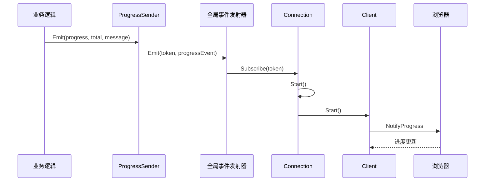
```mermaid
sequenceDiagram
participant Business as 业务逻辑
participant ProgressSender as ProgressSender
participant progressEmitter as 全局事件发射器
participant Connection as Connection
participant Client as Client
participant Browser as 浏览器
Business->>ProgressSender : Emit(progress, total, message)
ProgressSender->>progressEmitter : Emit(token, progressEvent)
progressEmitter->>Connection : Subscribe(token)
Connection->>Connection : Start()
Connection->>Client : Start()
Client->>Browser : NotifyProgress
Browser-->>Client : 进度更新
```

**图表来源**
- [wrapper.go:43-68](file://common/mcpx/wrapper.go#L43-L68)
- [client.go:250-260](file://common/mcpx/client.go#L250-L260)

### 事件驱动进度通知

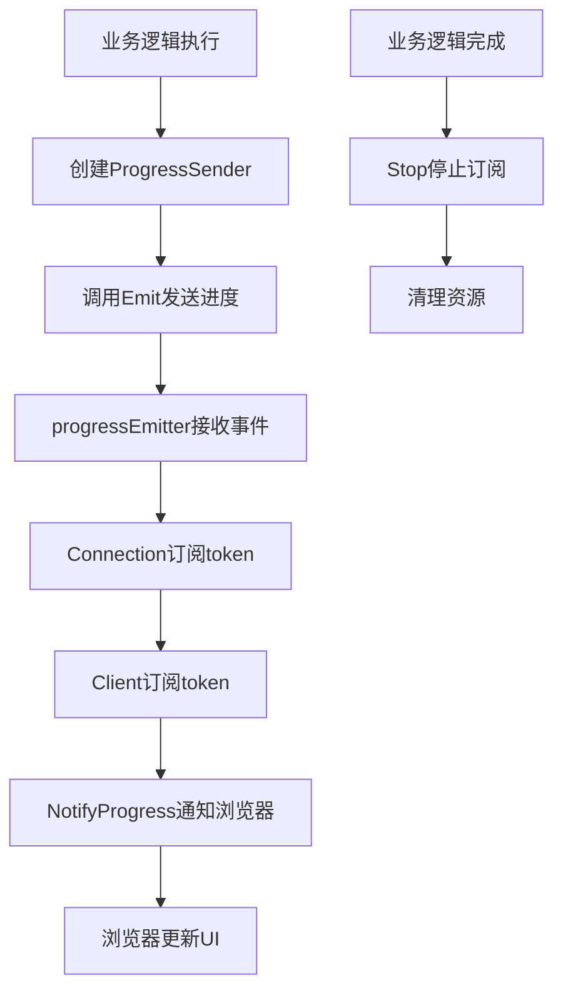
```mermaid
flowchart TD
A[业务逻辑执行] --> B[创建ProgressSender]
B --> C[调用Emit发送进度]
C --> D[progressEmitter接收事件]
D --> E[Connection订阅token]
E --> F[Client订阅token]
F --> G[NotifyProgress通知浏览器]
G --> H[浏览器更新UI]
I[业务逻辑完成] --> J[Stop停止订阅]
J --> K[清理资源]
```

**图表来源**
- [wrapper.go:54-75](file://common/mcpx/wrapper.go#L54-L75)
- [client.go:774-796](file://common/mcpx/client.go#L774-L796)

**章节来源**
- [wrapper.go:18-75](file://common/mcpx/wrapper.go#L18-L75)
- [emitter.go:13-83](file://common/antsx/emitter.go#L13-L83)

## 依赖关系分析

Mcpx 包的依赖关系如下：

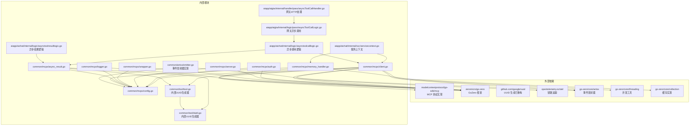
```mermaid
graph TB
subgraph "外部依赖"
A[modelcontextprotocol/go-sdk/mcp<br/>MCP 协议实现]
B[zeromicro/go-zero<br/>GoZero 框架]
C[github.com/google/uuid<br/>UUID 生成已重构]
D[opentelemetry.io/otel<br/>链路追踪]
E[go-zero/core/antsx<br/>事件发射器]
F[go-zero/core/threading<br/>并发工具]
G[go-zero/core/collection<br/>缓存实现]
end
subgraph "内部模块"
H[common/mcpx/client.go]
I[common/mcpx/config.go]
J[common/mcpx/auth.go]
K[common/mcpx/server.go]
L[common/mcpx/wrapper.go]
M[common/mcpx/logger.go]
N[common/mcpx/async_result.go]
O[common/mcpx/memory_handler.go]
P[common/tool/tool.go<br/>内部UUID生成器]
Q[common/tool/idutil.go<br/>内部UUID生成器]
R[common/antsx/emitter.go<br/>事件发射器实现]
S[aiapp/aichat/internal/svc/servicecontext.go<br/>服务上下文]
T[aiapp/aichat/internal/logic/asynctoolcalllogic.go<br/>异步调用逻辑]
U[aiapp/aichat/internal/logic/asynctoolresultlogic.go<br/>异步结果逻辑]
V[aiapp/aigtw/internal/logic/pass/asyncToolCallLogic.go<br/>网关异步调用]
W[aiapp/aigtw/internal/handler/pass/asyncToolCallHandler.go<br/>网关HTTP处理]
end
H --> A
H --> B
H --> P
H --> D
H --> E
H --> F
J --> B
K --> B
L --> B
M --> B
N --> P
N --> Q
O --> G
O --> B
R --> E
H --> I
J --> I
K --> I
L --> I
M --> I
N --> I
O --> I
R --> I
P --> Q
S --> H
S --> O
T --> H
T --> N
U --> N
V --> T
W --> V
```

**更新** 依赖关系已更新，显示UUID生成机制从外部github.com/google/uuid重构为内部tool.SimpleUUID()函数，并新增了事件驱动架构相关的依赖，包括common/antsx/emitter.go用于全局事件发射器实现。

**图表来源**
- [client.go:3-23](file://common/mcpx/client.go#L3-L23)
- [auth.go:3-15](file://common/mcpx/auth.go#L3-L15)
- [tool.go:18-23](file://common/tool/tool.go#L18-L23)
- [memory_handler.go:3-10](file://common/mcpx/memory_handler.go#L3-L10)
- [emitter.go:1-6](file://common/antsx/emitter.go#L1-6)

**章节来源**
- [client.go:1-23](file://common/mcpx/client.go#L1-L23)
- [auth.go:1-15](file://common/mcpx/auth.go#L1-L15)

## 性能考虑

Mcpx 包在设计时考虑了多个性能优化点：

### 连接管理优化
- **自动重连机制**：连接断开后自动重连，默认重连间隔为 30 秒
- **并发安全**：使用 RWMutex 确保多 goroutine 安全访问
- **资源清理**：优雅关闭时清理所有连接和资源

### 传输协议选择
- **Streamable HTTP**：支持 2025-03-26 规范，提供更好的性能
- **SSE 兼容**：支持 2024-11-05 规范，向后兼容
- **动态切换**：根据服务器配置自动选择合适的传输协议

### 进度通知优化
- **事件驱动**：使用 EventEmitter 实现异步进度通知
- **内存效率**：避免阻塞调用，提高并发性能
- **令牌管理**：使用内部SimpleUUID()函数生成唯一进度令牌
- **非阻塞广播**：EventEmitter的Emit方法采用非阻塞模式，防止慢消费者影响整体性能

### 资源管理优化
- **上下文取消检查**：在长运行操作中定期检查上下文取消状态
- **及时资源释放**：通过select语句快速响应取消信号
- **错误处理优化**：在取消时返回清晰的错误信息

### 异步处理优化
- **非阻塞调用**：CallToolAsync立即返回taskID，不阻塞主线程
- **后台执行**：使用threading.GoSafe确保后台任务的异常安全
- **进度实时更新**：通过AsyncResultHandler实时更新进度状态
- **状态持久化**：异步结果通过ResultHandler持久化存储
- **内存缓存优化**：MemoryAsyncResultHandler使用collection.Cache提供高效的内存存储
- **并发安全**：内存处理器使用RWMutex确保多goroutine安全访问

### 事件驱动架构优化
- **解耦通信**：通过全局事件发射器实现业务逻辑与进度通知的解耦
- **跨进程支持**：事件发射器支持跨进程的进度通信
- **内存友好**：EventEmitter采用非阻塞广播，避免慢消费者阻塞生产者
- **资源管理**：自动清理无订阅者的topic，防止内存泄漏
- **并发安全**：EventEmitter内部使用互斥锁确保多goroutine安全访问

### 内存处理器优化
- **默认过期时间**：24小时的默认过期时间平衡内存使用和数据保留
- **缓存命名**：使用"async-result"命名空间便于调试和监控
- **原子操作**：使用互斥锁确保缓存操作的原子性
- **内存友好**：适合开发测试和小规模部署场景

**更新** 新增了事件驱动架构相关的性能优化，包括解耦通信、跨进程支持、非阻塞广播和资源管理等特性。

**章节来源**
- [testprogress.go:42-49](file://aiapp/mcpserver/internal/tools/testprogress.go#L42-L49)
- [client.go:770-772](file://common/mcpx/client.go#L770-L772)
- [client.go:932-981](file://common/mcpx/client.go#L932-L981)
- [memory_handler.go:12-14](file://common/mcpx/memory_handler.go#L12-L14)
- [emitter.go:69-83](file://common/antsx/emitter.go#L69-L83)

## 故障排除指南

### 常见问题及解决方案

#### 连接问题
1. **连接失败**
   - 检查服务器地址和端口配置
   - 验证网络连通性
   - 确认防火墙设置

2. **认证失败**
   - 验证 ServiceToken 配置
   - 检查 JWT 密钥配置
   - 确认用户权限

#### 性能问题
1. **高延迟**
   - 检查网络延迟
   - 调整连接超时设置
   - 优化工具实现

2. **内存泄漏**
   - 确保正确关闭客户端
   - 检查长连接管理
   - 监控资源使用情况

#### UUID生成问题
1. **UUID生成失败**
   - 检查内部UUID生成器依赖
   - 验证随机数生成器状态
   - 确认字符串替换逻辑

#### 上下文取消问题
1. **长运行操作无法取消**
   - 检查上下文取消检查逻辑
   - 验证select语句实现
   - 确认错误处理机制

#### 异步处理问题
1. **异步调用无响应**
   - 检查AsyncResultHandler配置
   - 验证后台goroutine执行状态
   - 确认进度回调函数实现
   - 验证MemoryAsyncResultHandler初始化

2. **异步结果查询失败**
   - 检查ResultHandler的Get方法实现
   - 验证存储层连接状态
   - 确认taskID格式正确
   - 检查缓存过期设置

3. **内存处理器问题**
   - 检查缓存初始化状态
   - 验证内存使用情况
   - 确认过期时间设置合理
   - 检查并发访问控制

#### 事件驱动架构问题
1. **进度通知丢失**
   - 检查progressEmitter的订阅状态
   - 验证token生成和传递
   - 确认EventEmitter的缓冲区大小
   - 检查订阅取消逻辑

2. **事件发射器内存泄漏**
   - 验证订阅者的取消函数调用
   - 检查TopicCount和SubscriberCount
   - 确认Close方法的正确使用
   - 验证无订阅topic的自动清理

3. **跨进程通信问题**
   - 检查EventEmitter的进程隔离
   - 验证token的唯一性
   - 确认进度通知的传递路径
   - 检查上下文传播机制

#### 网关集成问题
1. **异步调用HTTP接口失败**
   - 检查网关路由配置
   - 验证参数解析逻辑
   - 确认RPC调用状态
   - 验证JSON序列化

2. **异步结果查询接口失败**
   - 检查服务上下文配置
   - 验证AsyncResultHandler注入
   - 确认结果处理器状态
   - 验证错误处理逻辑

**更新** 新增了事件驱动架构相关的故障排除指南，包括进度通知丢失、事件发射器内存泄漏和跨进程通信问题等。

**章节来源**
- [client.go:511-535](file://common/mcpx/client.go#L511-L535)
- [client.go:598-619](file://common/mcpx/client.go#L598-L619)
- [testprogress.go:42-49](file://aiapp/mcpserver/internal/tools/testprogress.go#L42-L49)
- [memory_handler.go:24-29](file://common/mcpx/memory_handler.go#L24-L29)
- [emitter.go:35-67](file://common/antsx/emitter.go#L35-L67)

## 结论

Mcpx Client Package 提供了一个功能完整、性能优异的 MCP 客户端解决方案。其主要特点包括：

1. **完整的 MCP 协议支持**：支持所有核心 MCP 功能
2. **灵活的连接管理**：多服务器连接、自动重连、负载均衡
3. **强大的认证机制**：支持 ServiceToken 和 JWT 双重认证
4. **优秀的性能表现**：并发安全、内存高效、低延迟
5. **易于使用的 API**：简洁的接口设计，丰富的使用示例
6. **内部依赖优化**：重构UUID生成机制，减少外部依赖
7. **资源管理增强**：通过上下文取消检查改进长运行操作的资源管理
8. **完整的异步处理能力**：新增异步工具调用和结果管理功能，为AI聊天生态系统提供强大的异步处理能力
9. **内存存储优化**：新增MemoryAsyncResultHandler提供高效的内存级异步结果存储
10. **完整的生态系统**：从工具注册、业务逻辑到网关集成的完整异步处理链路
11. **事件驱动架构**：全新的事件驱动进度通知系统，支持跨进程和跨服务通信
12. **解耦通信**：通过全局事件发射器实现业务逻辑与进度通知的完全解耦

**最新更新**：通过完全重构的事件驱动架构，Mcpx包装器系统现在实现了从直接MCP客户端通信到事件驱动架构的转变。新增的全局progressEmitter事件发射器、ProgressEvent结构和NotifyProgress函数，为整个系统提供了异步事件驱动的进度通知能力。这一重构显著提升了系统的解耦性和可扩展性，支持跨进程和跨服务的进度通信，为AI应用中的复杂异步任务处理提供了坚实的技术基础。

该包适用于各种微服务架构场景，特别是需要与 MCP 服务器进行交互的应用程序。通过合理配置和使用，可以显著提升系统的集成能力和扩展性，特别是在需要处理大量异步任务的AI应用中。事件驱动架构的引入使得系统能够更好地应对高并发场景，同时保持良好的性能和可维护性。