# Mcpx客户端包

<cite>
**本文档引用的文件**
- [client.go](file://common/mcpx/client.go)
- [server.go](file://common/mcpx/server.go)
- [config.go](file://common/mcpx/config.go)
- [wrapper.go](file://common/mcpx/wrapper.go)
- [logger.go](file://common/mcpx/logger.go)
- [async_result.go](file://common/mcpx/async_result.go)
- [memory_handler.go](file://common/mcpx/memory_handler.go)
- [auth.go](file://common/mcpx/auth.go)
- [mcpserver.go](file://aiapp/mcpserver/mcpserver.go)
- [mcpserver.yaml](file://aiapp/mcpserver/etc/mcpserver.yaml)
- [config.go](file://aiapp/mcpserver/internal/config/config.go)
- [servicecontext.go](file://aiapp/mcpserver/internal/svc/servicecontext.go)
- [registry.go](file://aiapp/mcpserver/internal/tools/registry.go)
- [echo.go](file://aiapp/mcpserver/internal/tools/echo.go)
- [modbus.go](file://aiapp/mcpserver/internal/tools/modbus.go)
- [testprogress.go](file://aiapp/mcpserver/internal/tools/testprogress.go)
- [chatcompletionlogic.go](file://aiapp/aichat/internal/logic/chatcompletionlogic.go)
- [idutil.go](file://common/tool/idutil.go)
</cite>

## 更新摘要
**变更内容**
- 新增带进度通知的工具调用功能，支持任务ID生成和进度回调机制
- 增强了ProgressSender和ProgressInfo结构体，提供完整的进度通知支持
- 添加了异步工具调用和任务观察者模式
- 完善了内存存储的异步结果管理功能

## 目录
1. [简介](#简介)
2. [项目结构](#项目结构)
3. [核心组件](#核心组件)
4. [架构概览](#架构概览)
5. [详细组件分析](#详细组件分析)
6. [依赖关系分析](#依赖关系分析)
7. [性能考虑](#性能考虑)
8. [故障排除指南](#故障排除指南)
9. [结论](#结论)

## 简介

Mcpx客户端包是一个基于Model Context Protocol (MCP)协议的客户端SDK，专为连接和管理多个MCP服务器而设计。该包提供了完整的MCP协议支持，包括工具调用、提示模板管理、资源访问、进度通知等功能，并集成了Go Zero框架的微服务特性。

Mcpx包的核心目标是简化MCP协议的使用，提供统一的客户端接口，支持多服务器连接管理和自动重连机制。它特别适用于需要与多个AI模型或服务进行交互的应用场景，现已增强支持带进度通知的工具调用功能，提供完整的任务ID生成和进度回调机制。

## 项目结构

Mcpx客户端包位于`common/mcpx/`目录下，包含以下主要文件：

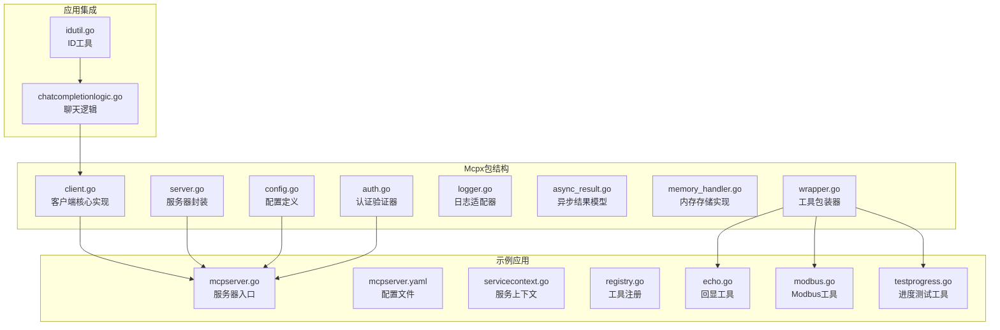

**图表来源**
- [client.go:1-1030](file://common/mcpx/client.go#L1-L1030)
- [server.go:1-144](file://common/mcpx/server.go#L1-L144)
- [mcpserver.go:1-41](file://aiapp/mcpserver/mcpserver.go#L1-L41)
- [testprogress.go:1-80](file://aiapp/mcpserver/internal/tools/testprogress.go#L1-L80)
- [chatcompletionlogic.go:70-98](file://aiapp/aichat/internal/logic/chatcompletionlogic.go#L70-L98)

**章节来源**
- [client.go:1-1030](file://common/mcpx/client.go#L1-L1030)
- [server.go:1-144](file://common/mcpx/server.go#L1-L144)
- [config.go:1-23](file://common/mcpx/config.go#L1-L23)

## 核心组件

Mcpx客户端包包含以下核心组件：

### 客户端组件
- **Client**: 主要的MCP客户端，管理多个服务器连接
- **Connection**: 单个MCP服务器连接的封装
- **Config**: 客户端配置结构体
- **ProgressInfo**: 进度信息结构体，包含Token、Progress、Total、Message
- **ProgressCallback**: 进度回调函数类型

### 服务器组件
- **McpServer**: 带认证的MCP服务器封装
- **McpServerConf**: 服务器配置扩展

### 工具包装器
- **CallToolWrapper**: 工具调用的包装器，处理上下文传递和进度通知
- **ProgressSender**: 进度发送器，支持发布订阅模式，具备GetToken方法

### 存储和异步处理
- **AsyncResultStore**: 异步结果存储接口
- **MemoryAsyncResultStore**: 内存版存储实现，支持TTL过期清理
- **TaskObserver**: 任务观察者接口
- **DefaultTaskObserver**: 默认任务观察者实现

### 新增功能组件
- **CallToolWithProgressRequest**: 带进度通知的工具调用请求
- **CallToolAsyncRequest**: 异步工具调用请求
- **ProgressMessage**: 进度消息记录，支持消息历史

**章节来源**
- [client.go:76-93](file://common/mcpx/client.go#L76-L93)
- [client.go:256-258](file://common/mcpx/client.go#L256-L258)
- [wrapper.go:33-41](file://common/mcpx/wrapper.go#L33-L41)
- [async_result.go:14-44](file://common/mcpx/async_result.go#L14-L44)
- [memory_handler.go:13-31](file://common/mcpx/memory_handler.go#L13-L31)

## 架构概览

Mcpx客户端包采用分层架构设计，实现了MCP协议的完整支持，现已增强进度通知功能：

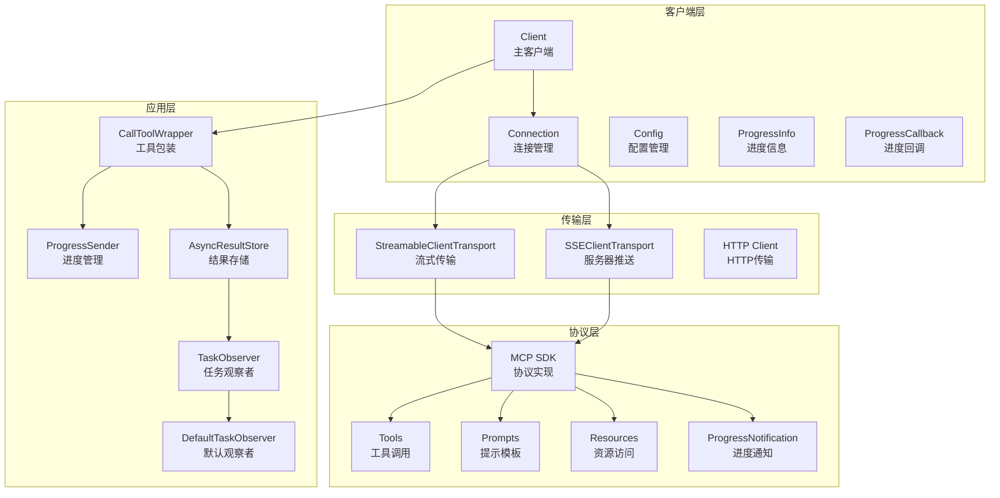

**图表来源**
- [client.go:53-74](file://common/mcpx/client.go#L53-L74)
- [server.go:27-31](file://common/mcpx/server.go#L27-L31)
- [wrapper.go:36-41](file://common/mcpx/wrapper.go#L36-L41)
- [client.go:247-255](file://common/mcpx/client.go#L247-L255)

## 详细组件分析

### Client类分析

Client类是Mcpx包的核心组件，负责管理多个MCP服务器的连接和通信，现已增强进度通知功能：

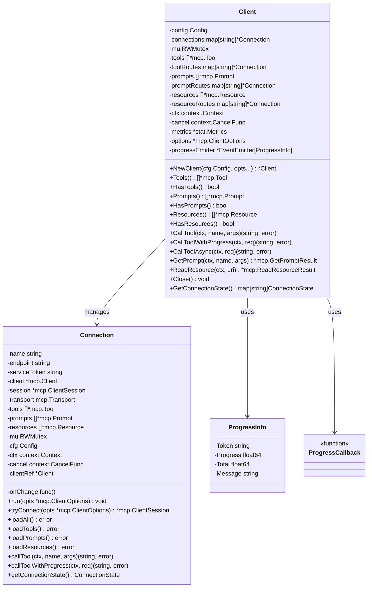

**图表来源**
- [client.go:27-74](file://common/mcpx/client.go#L27-L74)
- [client.go:76-85](file://common/mcpx/client.go#L76-L85)

#### 连接管理流程

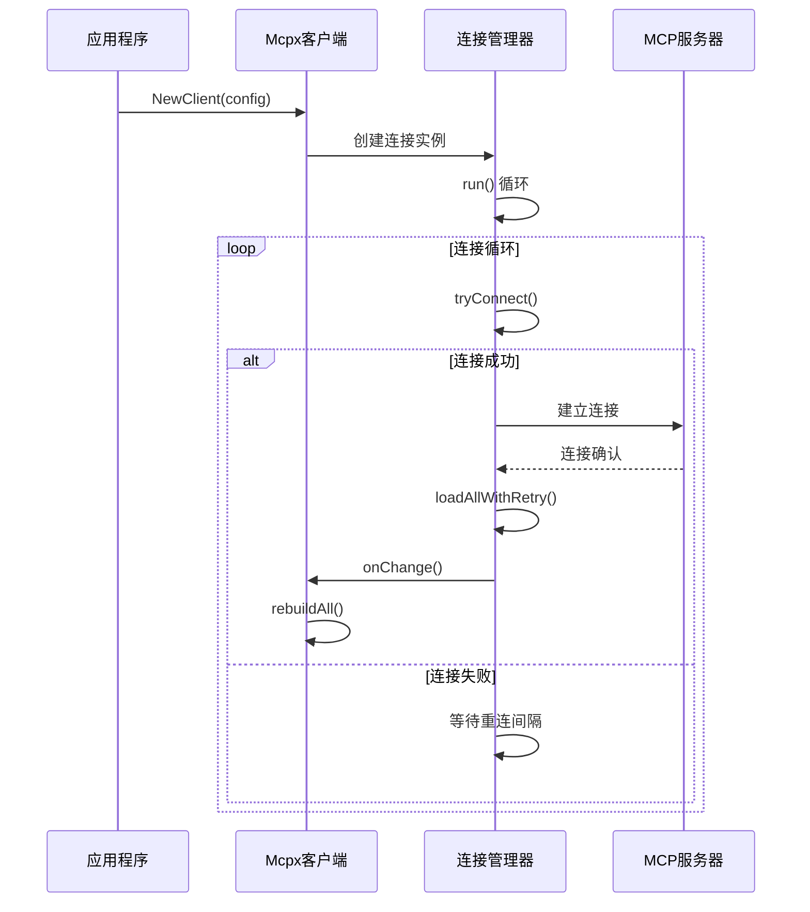

**图表来源**
- [client.go:505-576](file://common/mcpx/client.go#L505-L576)

**章节来源**
- [client.go:94-154](file://common/mcpx/client.go#L94-L154)
- [client.go:505-576](file://common/mcpx/client.go#L505-L576)

### 服务器封装分析

McpServer类提供了带认证功能的MCP服务器封装：

```mermaid
classDiagram
class McpServerConf {
+McpConf McpConf
+Auth struct {
+JwtSecrets []string
+ServiceToken string
+ClaimMapping map[string]string
}
}
class McpServer {
-sdkServer *sdkmcp.Server
-httpServer *rest.Server
-conf McpServerConf
+NewMcpServer(c McpServerConf) *McpServer
+Server() *sdkmcp.Server
+Start() void
+Stop() void
+setupSSETransport() void
+setupStreamableTransport() void
+wrapAuth(handler) http.Handler
+registerRoutes(handler, endpoint) void
}
class DualTokenVerifier {
+NewDualTokenVerifier(jwtSecrets, serviceToken, claimMapping) auth.TokenVerifier
}
McpServerConf --> McpServer : 配置
McpServer --> DualTokenVerifier : 使用
```

**图表来源**
- [server.go:13-31](file://common/mcpx/server.go#L13-L31)
- [auth.go:17-72](file://common/mcpx/auth.go#L17-L72)

#### 认证流程

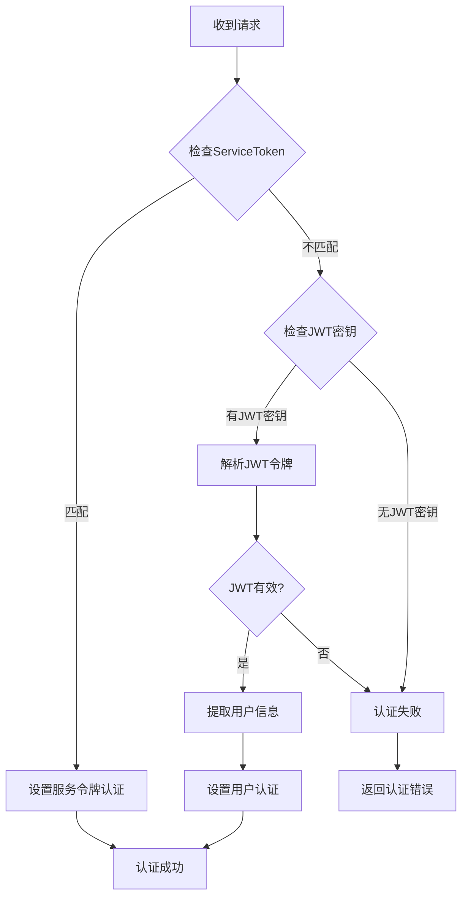

**图表来源**
- [auth.go:22-71](file://common/mcpx/auth.go#L22-L71)

**章节来源**
- [server.go:33-72](file://common/mcpx/server.go#L33-L72)
- [auth.go:17-72](file://common/mcpx/auth.go#L17-L72)

### 工具包装器分析

CallToolWrapper提供了工具调用的包装功能，处理上下文传递和进度通知，现已增强支持任务ID生成：

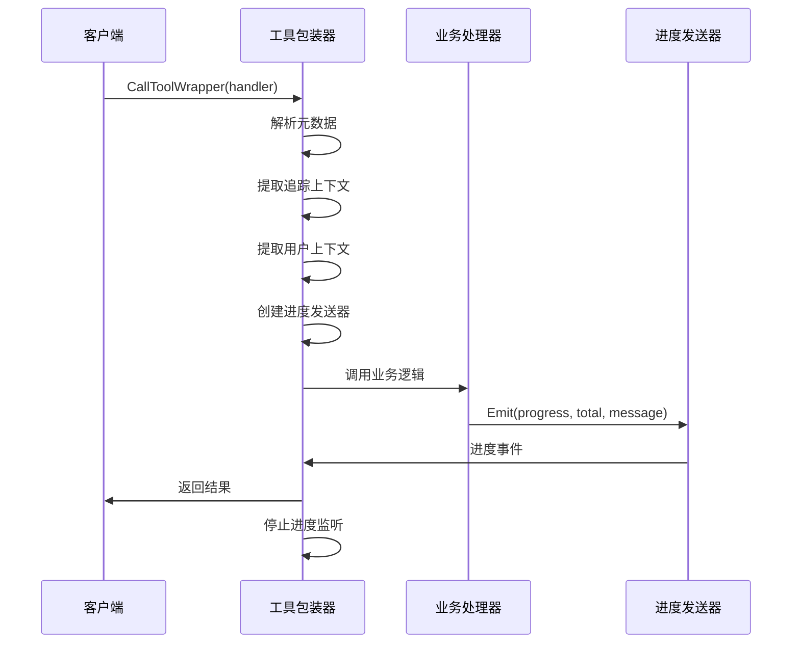

**图表来源**
- [wrapper.go:134-206](file://common/mcpx/wrapper.go#L134-L206)

#### 异步结果处理

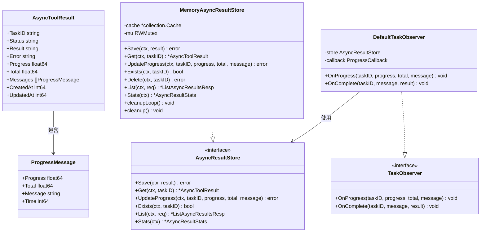

**图表来源**
- [async_result.go:14-91](file://common/mcpx/async_result.go#L14-L91)
- [memory_handler.go:13-414](file://common/mcpx/memory_handler.go#L13-L414)

**章节来源**
- [wrapper.go:134-206](file://common/mcpx/wrapper.go#L134-L206)
- [async_result.go:14-91](file://common/mcpx/async_result.go#L14-L91)
- [memory_handler.go:13-414](file://common/mcpx/memory_handler.go#L13-L414)

### 新增功能分析

#### 带进度通知的工具调用

Mcpx客户端包现已支持带进度通知的工具调用功能，提供完整的任务ID生成和进度回调机制：

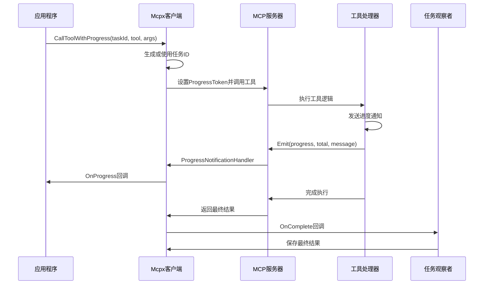

**图表来源**
- [client.go:754-801](file://common/mcpx/client.go#L754-L801)
- [client.go:911-968](file://common/mcpx/client.go#L911-L968)

#### 异步工具调用

支持异步工具调用，立即返回任务ID，后台执行工具并通知进度：

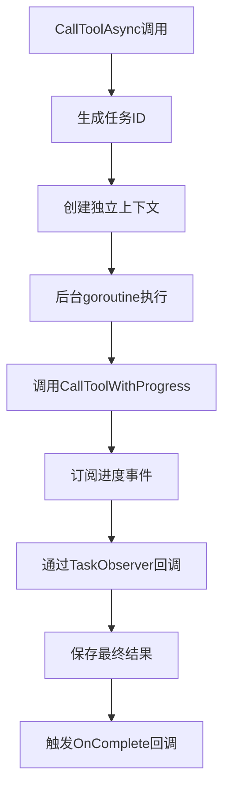

**图表来源**
- [client.go:911-968](file://common/mcpx/client.go#L911-L968)

**章节来源**
- [client.go:754-801](file://common/mcpx/client.go#L754-L801)
- [client.go:911-968](file://common/mcpx/client.go#L911-L968)

### 示例应用分析

示例应用展示了Mcpx包的实际使用方法，现已包含进度通知功能：

#### Echo工具示例

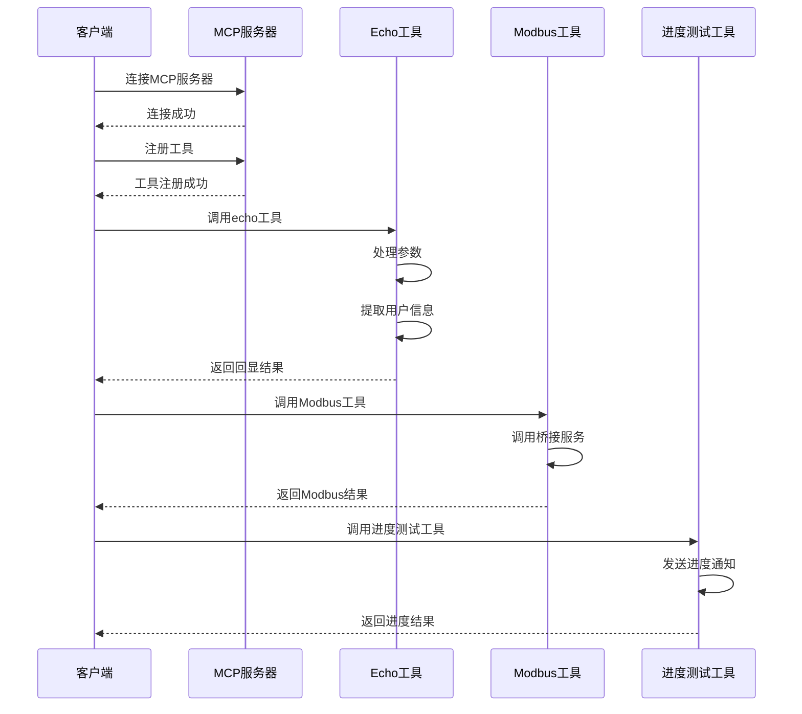

**图表来源**
- [echo.go:25-42](file://aiapp/mcpserver/internal/tools/echo.go#L25-L42)
- [modbus.go:35-69](file://aiapp/mcpserver/internal/tools/modbus.go#L35-L69)
- [testprogress.go:30-79](file://aiapp/mcpserver/internal/tools/testprogress.go#L30-L79)

#### 进度测试工具

新增的进度测试工具演示了完整的进度通知机制：

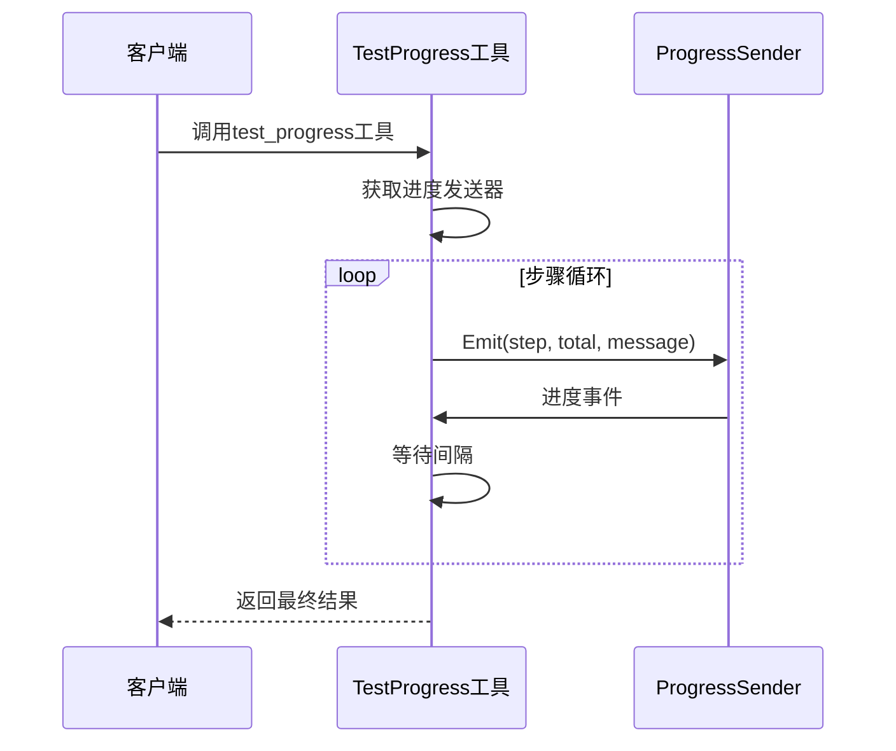

**图表来源**
- [testprogress.go:45-79](file://aiapp/mcpserver/internal/tools/testprogress.go#L45-L79)

**章节来源**
- [mcpserver.go:19-41](file://aiapp/mcpserver/mcpserver.go#L19-L41)
- [echo.go:18-43](file://aiapp/mcpserver/internal/tools/echo.go#L18-L43)
- [modbus.go:29-129](file://aiapp/mcpserver/internal/tools/modbus.go#L29-L129)
- [testprogress.go:1-80](file://aiapp/mcpserver/internal/tools/testprogress.go#L1-80)

## 依赖关系分析

Mcpx客户端包的依赖关系如下：

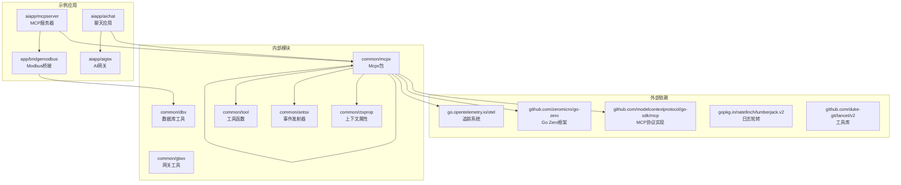

**图表来源**
- [client.go:3-23](file://common/mcpx/client.go#L3-L23)
- [server.go:3-11](file://common/mcpx/server.go#L3-L11)
- [idutil.go:1-59](file://common/tool/idutil.go#L1-L59)

**章节来源**
- [client.go:3-23](file://common/mcpx/client.go#L3-L23)
- [server.go:3-11](file://common/mcpx/server.go#L3-L11)
- [idutil.go:1-59](file://common/tool/idutil.go#L1-L59)

## 性能考虑

Mcpx客户端包在设计时充分考虑了性能优化，现已针对进度通知功能进行了专门优化：

### 连接管理优化
- **自动重连机制**: 支持断线自动重连，重连间隔可配置
- **并发连接**: 支持同时连接多个MCP服务器
- **连接池管理**: 通过RWMutex确保线程安全

### 缓存策略
- **工具列表缓存**: 缓存服务器的工具列表，减少重复查询
- **提示模板缓存**: 缓存提示模板，提高访问速度
- **资源列表缓存**: 缓存资源信息，支持快速查找

### 进度处理优化
- **事件驱动**: 使用事件发射器处理进度通知
- **异步处理**: 进度处理采用异步方式，不影响主流程
- **内存存储**: 提供内存存储实现，适合小规模使用
- **TTL过期**: 内存存储支持定时清理过期数据
- **任务ID生成**: 使用SimpleUUID生成唯一任务ID，避免冲突

### 性能监控
- **指标收集**: 集成Go Zero的统计系统
- **延迟测量**: 自动记录工具调用的执行时间
- **错误统计**: 统计失败的工具调用次数
- **进度回调优化**: 进度回调采用非阻塞方式

## 故障排除指南

### 常见问题及解决方案

#### 连接问题
1. **连接超时**: 检查网络连接和服务器端点配置
2. **认证失败**: 验证ServiceToken和JWT密钥配置
3. **断线重连**: 查看重连间隔配置是否合理

#### 工具调用问题
1. **工具未找到**: 确认工具名称和前缀配置
2. **参数错误**: 检查工具参数的JSON Schema
3. **权限不足**: 验证用户上下文和权限配置

#### 进度处理问题
1. **进度不显示**: 检查进度事件发射器配置
2. **进度丢失**: 验证内存存储的过期时间设置
3. **回调不触发**: 确认回调函数的注册和调用
4. **任务ID冲突**: 检查SimpleUUID生成的唯一性

#### 异步处理问题
1. **任务未完成**: 检查TaskObserver的实现和回调
2. **内存泄漏**: 验证内存存储的清理机制
3. **进度不准确**: 检查进度计算和消息合并逻辑

**章节来源**
- [client.go:505-576](file://common/mcpx/client.go#L505-L576)
- [auth.go:22-72](file://common/mcpx/auth.go#L22-L72)
- [memory_handler.go:34-54](file://common/mcpx/memory_handler.go#L34-L54)

## 结论

Mcpx客户端包是一个功能完整、设计合理的MCP协议客户端SDK。它提供了以下核心价值：

### 主要优势
- **完整的MCP协议支持**: 支持所有MCP核心功能，包括工具、提示、资源等
- **多服务器连接管理**: 支持同时连接多个MCP服务器，提供统一的访问接口
- **强大的认证机制**: 支持ServiceToken和JWT双重认证
- **灵活的工具包装**: 提供工具调用的包装器，简化业务逻辑
- **完善的异步处理**: 支持异步工具调用和进度跟踪
- **增强的进度通知**: 现已支持带进度通知的工具调用，提供完整的任务ID生成和进度回调机制

### 技术特点
- **基于Go Zero框架**: 充分利用Go Zero的微服务特性
- **事件驱动架构**: 使用事件发射器处理异步操作
- **内存存储实现**: 提供轻量级的内存存储方案，支持TTL过期清理
- **日志集成**: 与Go Zero的日志系统无缝集成
- **任务观察者模式**: 支持任务状态变化的观察和处理

### 应用场景
Mcpx客户端包适用于需要与多个AI模型或服务进行交互的应用场景，特别是：
- AI助手和聊天机器人（支持进度反馈）
- 数据采集和处理系统（支持长时间任务进度跟踪）
- 工业控制系统集成（支持实时进度监控）
- 多服务协调平台（支持异步任务管理）

通过其模块化的设计和丰富的功能，Mcpx客户端包为开发者提供了一个强大而易用的MCP协议客户端解决方案。新增的带进度通知功能进一步增强了其实用性和用户体验，使其能够更好地满足现代应用对实时反馈和进度跟踪的需求。