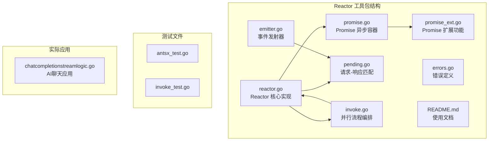
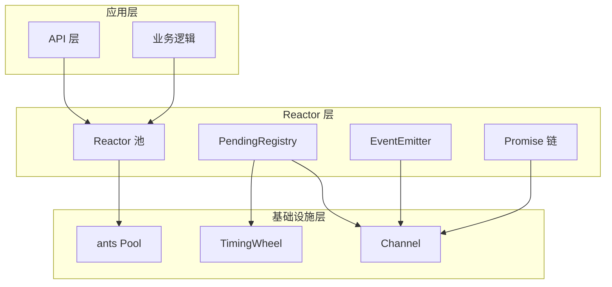
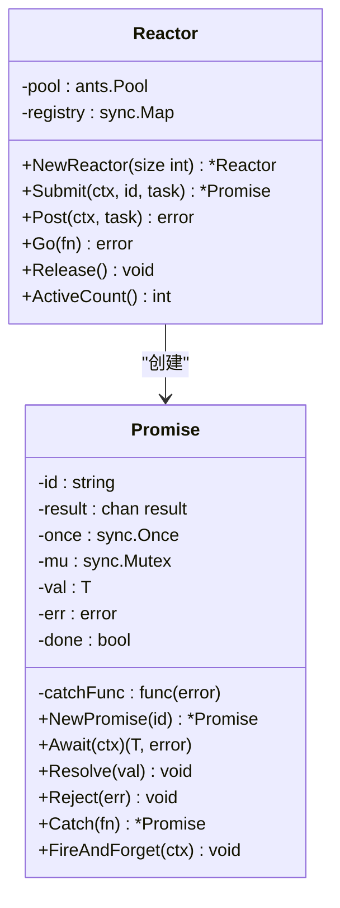
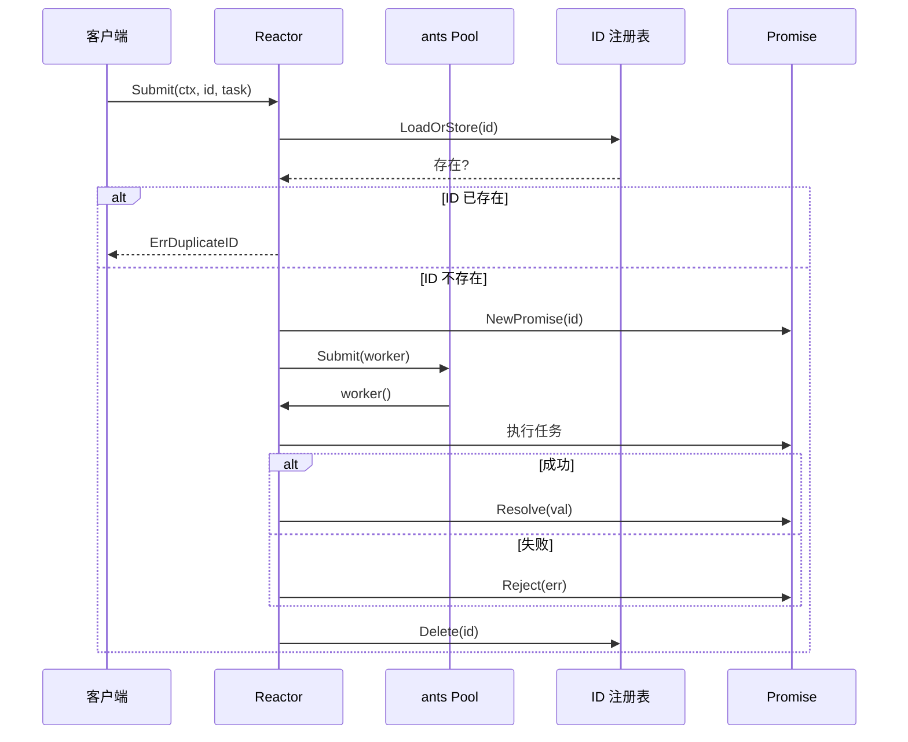
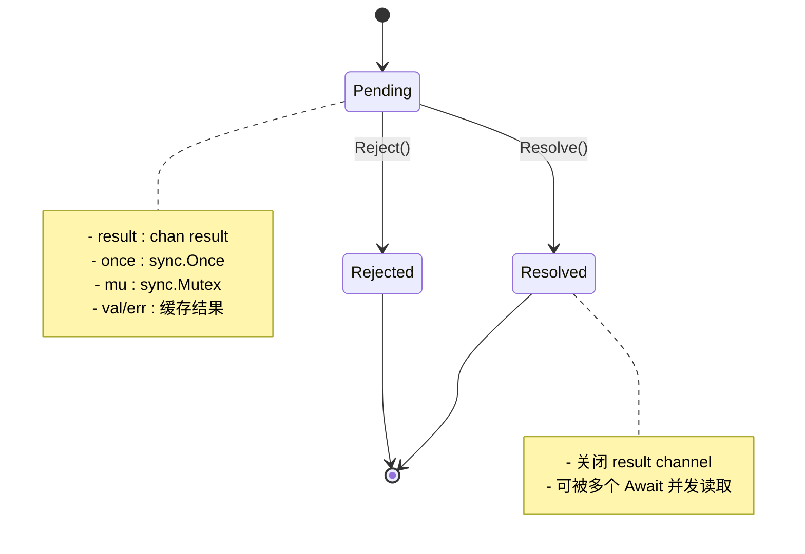
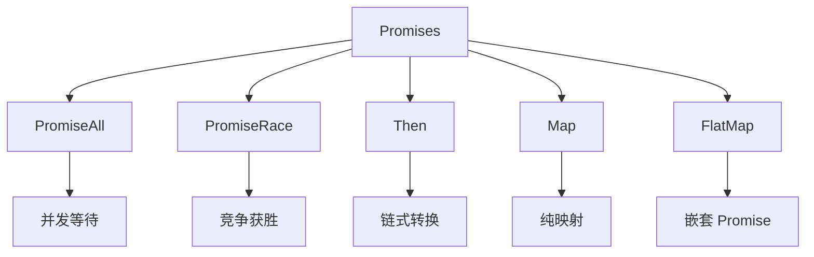
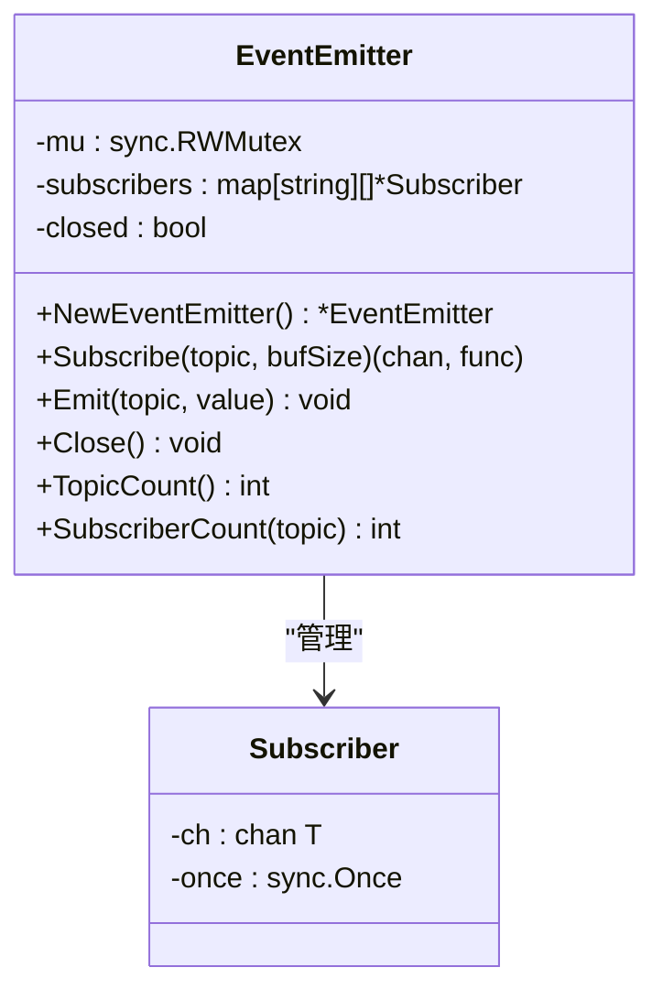
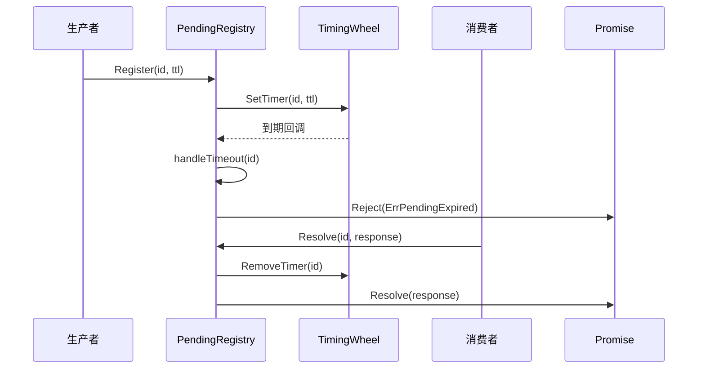
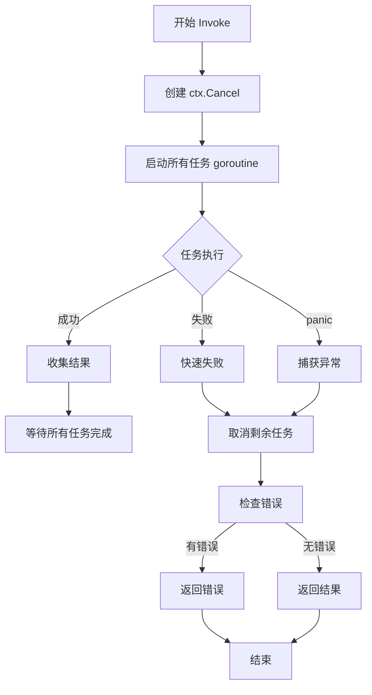
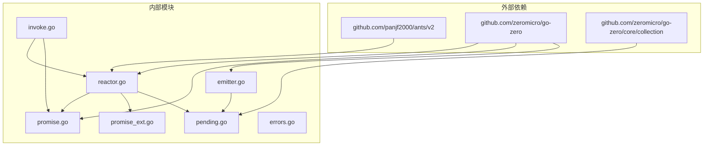

# Reactor goroutine池

<cite>
**本文档引用的文件**
- [reactor.go](file://common/antsx/reactor.go)
- [promise.go](file://common/antsx/promise.go)
- [promise_ext.go](file://common/antsx/promise_ext.go)
- [emitter.go](file://common/antsx/emitter.go)
- [pending.go](file://common/antsx/pending.go)
- [invoke.go](file://common/antsx/invoke.go)
- [errors.go](file://common/antsx/errors.go)
- [antsx_test.go](file://common/antsx/antsx_test.go)
- [invoke_test.go](file://common/antsx/invoke_test.go)
- [README.md](file://common/antsx/README.md)
- [chatcompletionstreamlogic.go](file://aiapp/aichat/internal/logic/chatcompletionstreamlogic.go)
</cite>

## 目录
1. [简介](#简介)
2. [项目结构](#项目结构)
3. [核心组件](#核心组件)
4. [架构概览](#架构概览)
5. [详细组件分析](#详细组件分析)
6. [依赖关系分析](#依赖关系分析)
7. [性能考量](#性能考量)
8. [故障排查指南](#故障排查指南)
9. [结论](#结论)

## 简介

Reactor 是一个基于 ants goroutine 池的响应式编程工具包，参考 Java Project Reactor 理念，以 Go 惯用风格实现。它提供了高并发场景下的 goroutine 池化管理、任务去重、异步结果处理等功能，是构建高性能分布式系统的重要基础设施。

Reactor 的设计目标是在保证并发安全的前提下，提供简洁易用的 API 来处理复杂的异步工作流，特别适用于需要控制 goroutine 数量和进行任务去重的场景。

## 项目结构

Reactor 工具包位于 `common/antsx` 目录下，包含以下核心文件：

**图表来源**
- [reactor.go:1-93](file://common/antsx/reactor.go#L1-L93)
- [promise.go:1-150](file://common/antsx/promise.go#L1-L150)
- [promise_ext.go:1-134](file://common/antsx/promise_ext.go#L1-L134)

**章节来源**
- [reactor.go:1-93](file://common/antsx/reactor.go#L1-L93)
- [promise.go:1-150](file://common/antsx/promise.go#L1-L150)
- [promise_ext.go:1-134](file://common/antsx/promise_ext.go#L1-L134)

## 核心组件

Reactor 工具包包含以下核心组件：

### 1. Reactor - 池调度器
- 基于 ants 库的 goroutine 池
- 支持任务去重和并发控制
- 提供 Submit、Post、Go 三种提交方式

### 2. Promise - 异步结果容器
- 泛型异步结果容器
- 支持链式调用、错误处理
- 提供 Await、Then、Map、FlatMap 等操作

### 3. EventEmitter - 事件发射器
- Topic 级别的发布/订阅机制
- 支持多个订阅者
- 非阻塞事件广播

### 4. PendingRegistry - 请求-响应匹配
- 关联 ID 的请求-响应匹配
- 自动过期机制
- 支持 MQ、TCP 等解耦场景

### 5. Invoke - 并行流程编排
- 多任务并行执行
- 支持超时控制和快速失败
- 提供 Reactor 池化版本

**章节来源**
- [reactor.go:14-92](file://common/antsx/reactor.go#L14-L92)
- [promise.go:16-29](file://common/antsx/promise.go#L16-L29)
- [emitter.go:15-20](file://common/antsx/emitter.go#L15-L20)
- [pending.go:43-53](file://common/antsx/pending.go#L43-L53)
- [invoke.go:10-15](file://common/antsx/invoke.go#L10-L15)

## 架构概览

Reactor 的整体架构采用分层设计，各组件职责明确：

**图表来源**
- [reactor.go:14-28](file://common/antsx/reactor.go#L14-L28)
- [promise.go:17-29](file://common/antsx/promise.go#L17-L29)
- [pending.go:52-83](file://common/antsx/pending.go#L52-L83)

## 详细组件分析

### Reactor 核心实现

Reactor 是整个工具包的核心，负责 goroutine 池化管理和任务调度：

**图表来源**
- [reactor.go:14-92](file://common/antsx/reactor.go#L14-L92)
- [promise.go:17-139](file://common/antsx/promise.go#L17-L139)

#### Reactor 主要特性

1. **goroutine 池化**: 使用 ants 库限制并发数量
2. **任务去重**: 通过 sync.Map 确保相同 ID 的任务不重复执行
3. **异常恢复**: 自动捕获任务 panic 并转换为错误
4. **生命周期管理**: 提供 Release 方法优雅关闭

#### Submit 流程

**图表来源**
- [reactor.go:31-61](file://common/antsx/reactor.go#L31-L61)

**章节来源**
- [reactor.go:14-92](file://common/antsx/reactor.go#L14-L92)

### Promise 异步容器

Promise 提供了完整的异步结果处理能力：

**图表来源**
- [promise.go:17-139](file://common/antsx/promise.go#L17-L139)

#### Promise 扩展功能

Promise 提供了丰富的组合和转换操作：

**图表来源**
- [promise_ext.go:10-126](file://common/antsx/promise_ext.go#L10-L126)

**章节来源**
- [promise.go:16-150](file://common/antsx/promise.go#L16-L150)
- [promise_ext.go:10-134](file://common/antsx/promise_ext.go#L10-L134)

### EventEmitter 事件系统

EventEmitter 实现了高效的发布/订阅模式：

**图表来源**
- [emitter.go:15-146](file://common/antsx/emitter.go#L15-L146)

#### 订阅者管理

EventEmitter 采用高效的数据结构管理订阅者：

1. **线程安全**: 使用 RWMutex 保护并发访问
2. **非阻塞广播**: 使用 select 语句避免慢消费者阻塞
3. **优雅取消**: 支持订阅者主动取消订阅
4. **内存优化**: 删除订阅者时使用 copy 避免内存泄漏

**章节来源**
- [emitter.go:15-146](file://common/antsx/emitter.go#L15-L146)

### PendingRegistry 请求-响应匹配

PendingRegistry 解决了解耦场景下的请求-响应匹配问题：

**图表来源**
- [pending.go:105-182](file://common/antsx/pending.go#L105-L182)

#### TimingWheel 优化

PendingRegistry 使用 go-zero 的 TimingWheel 实现高效的时间管理：

1. **共享定时器**: 多个定时器共享同一个 ticker
2. **内存效率**: 避免大量 goroutine 的内存开销
3. **精确控制**: 可配置的刻度间隔和槽位数量

**章节来源**
- [pending.go:43-244](file://common/antsx/pending.go#L43-L244)

### Invoke 并行编排

Invoke 提供了灵活的并行任务执行能力：

**图表来源**
- [invoke.go:20-149](file://common/antsx/invoke.go#L20-L149)

**章节来源**
- [invoke.go:17-150](file://common/antsx/invoke.go#L17-L150)

## 依赖关系分析

Reactor 工具包的依赖关系清晰，模块间耦合度低：

**图表来源**
- [reactor.go:3-10](file://common/antsx/reactor.go#L3-L10)
- [pending.go:9-10](file://common/antsx/pending.go#L9-L10)

### 关键依赖说明

1. **ants**: 提供 goroutine 池功能
2. **go-zero**: 提供日志、集合工具等基础设施
3. **go-zero/collection**: 提供 TimingWheel 实现

**章节来源**
- [reactor.go:3-10](file://common/antsx/reactor.go#L3-L10)
- [pending.go:9-10](file://common/antsx/pending.go#L9-L10)

## 性能考量

Reactor 在设计时充分考虑了性能优化：

### 1. goroutine 池优化
- 使用 ants 库替代标准库 runtime.GOMAXPROCS
- 动态调整池大小适应负载变化
- 避免频繁创建销毁 goroutine

### 2. 内存管理优化
- 使用 sync.Pool 减少内存分配
- 及时清理注册表中的过期条目
- 非阻塞事件广播避免缓冲区堆积

### 3. 并发安全优化
- 使用 sync.Map 替代互斥锁保护的 map
- 读写分离的 RWMutex 提高读取性能
- Once 保证 Promise 只能完成一次

### 4. 资源管理
- 提供 Release 方法优雅关闭
- 及时清理定时器避免内存泄漏
- 支持上下文取消及时停止任务

## 故障排查指南

### 常见问题及解决方案

#### 1. 任务超时问题
- **现象**: Promise.Await 返回 context.DeadlineExceeded
- **原因**: 任务执行时间超过预期
- **解决方案**: 
  - 增加超时时间
  - 优化任务实现
  - 使用 InvokeWithReactor 限制并发

#### 2. ID 重复错误
- **现象**: Submit 返回 ErrDuplicateID
- **原因**: 相同 ID 的任务已在执行
- **解决方案**:
  - 生成唯一 ID
  - 检查任务状态
  - 使用 PendingRegistry 进行匹配

#### 3. 内存泄漏
- **现象**: 内存持续增长
- **原因**: Promise 未正确完成或订阅者未取消
- **解决方案**:
  - 确保所有 Promise 最终都会完成
  - 及时调用订阅者的取消函数
  - 使用 defer 语句确保资源释放

#### 4. goroutine 泄漏
- **现象**: goroutine 数量持续增加
- **原因**: 任务 panic 未被捕获
- **解决方案**:
  - 检查任务函数的异常处理
  - 使用 Post 方法进行 fire-and-forget
  - 监控 ActiveCount 指标

**章节来源**
- [errors.go:5-9](file://common/antsx/errors.go#L5-L9)
- [reactor.go:84-92](file://common/antsx/reactor.go#L84-L92)

## 结论

Reactor goroutine池是一个设计精良的并发编程工具包，具有以下特点：

### 优势
1. **高性能**: 基于 ants 池化技术，有效控制 goroutine 数量
2. **易用性**: 提供简洁的 API 和丰富的组合操作
3. **可靠性**: 完善的错误处理和异常恢复机制
4. **扩展性**: 模块化设计，易于集成到现有系统

### 适用场景
- 高并发消息处理
- 异步任务队列
- 请求-响应匹配
- 事件驱动架构
- 流式数据处理

### 最佳实践
1. 合理设置池大小，避免过大或过小
2. 使用 ID 去重防止重复任务
3. 及时清理资源，避免内存泄漏
4. 监控关键指标，及时发现性能问题
5. 使用上下文控制任务生命周期

Reactor 为 Go 语言的并发编程提供了强有力的支持，是构建高性能分布式系统的理想选择。