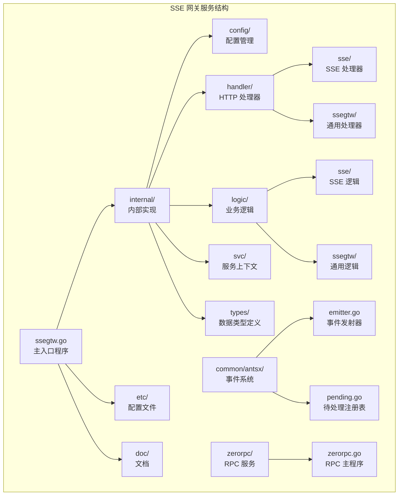
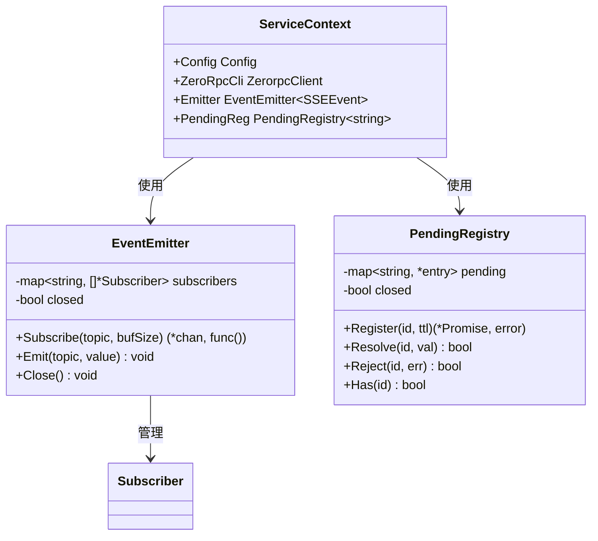
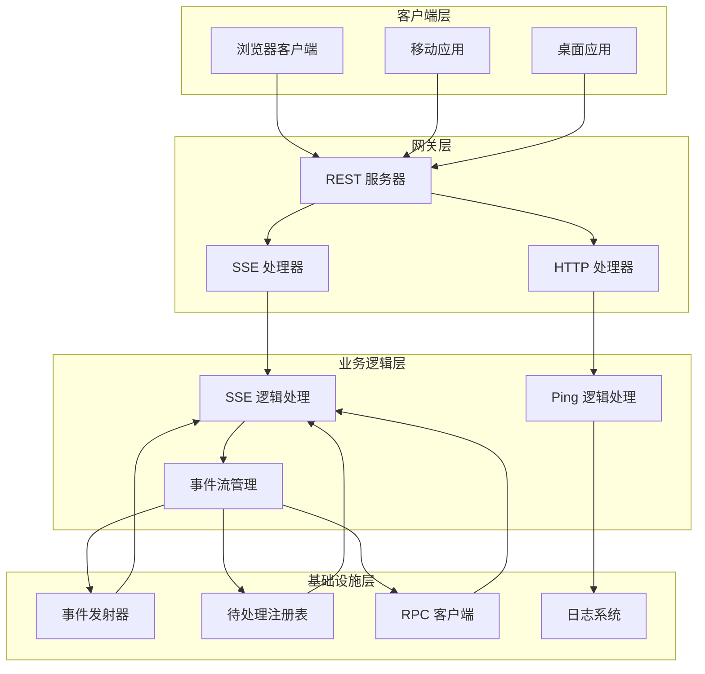
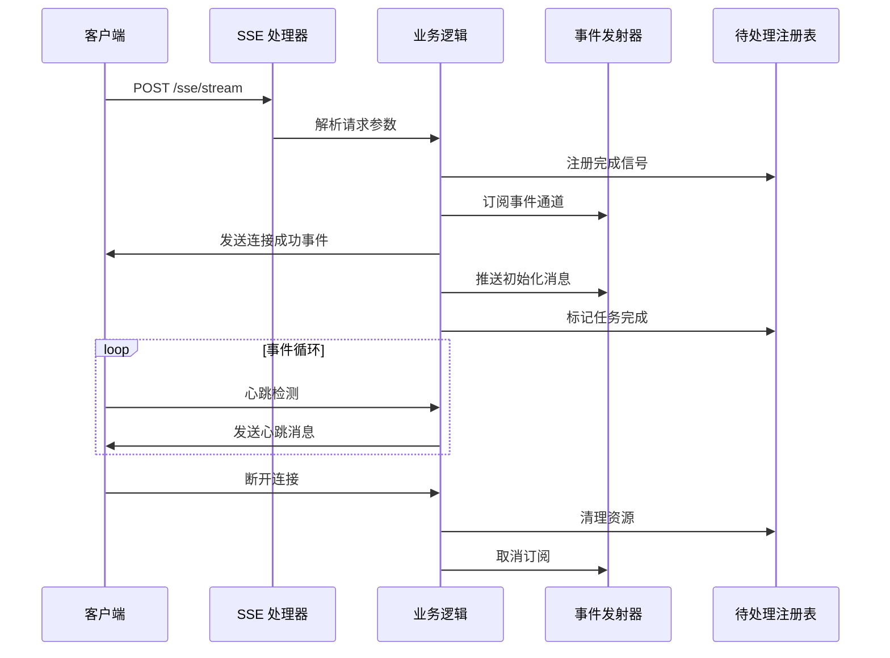
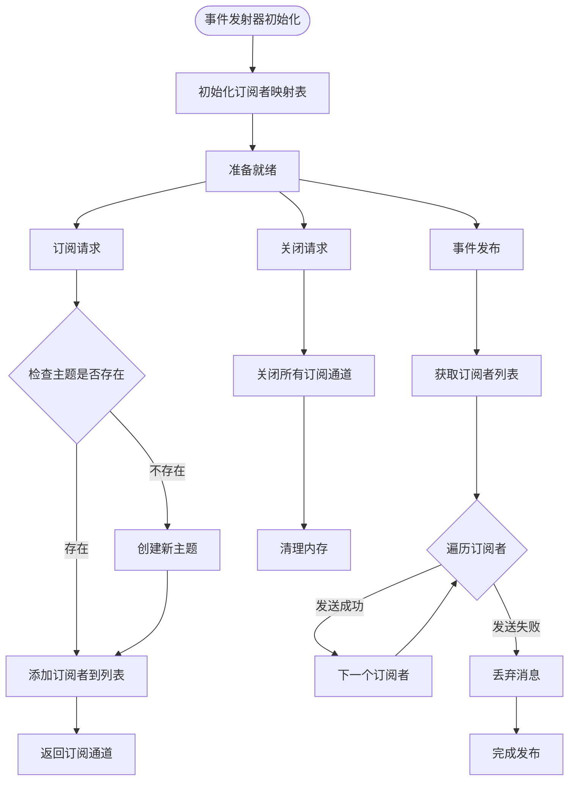
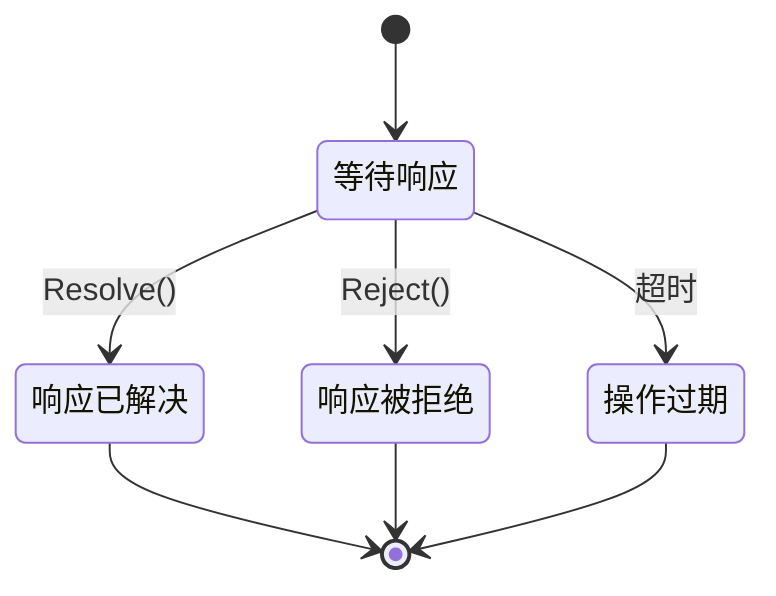
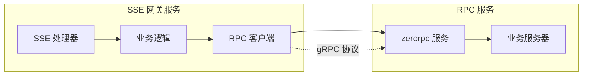
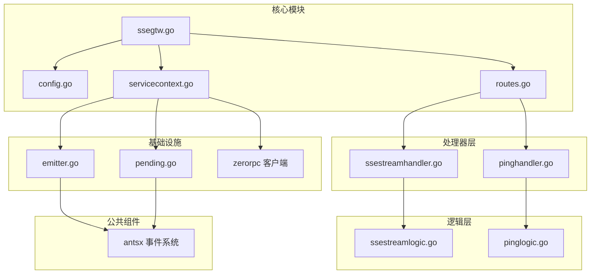

# SSE 网关服务

<cite>
**本文档引用的文件**
- [ssegtw.go](file://aiapp/ssegtw/ssegtw.go)
- [ssegtw.yaml](file://aiapp/ssegtw/etc/ssegtw.yaml)
- [types.go](file://aiapp/ssegtw/internal/types/types.go)
- [config.go](file://aiapp/ssegtw/internal/config/config.go)
- [ssegtw.api](file://aiapp/ssegtw/ssegtw.api)
- [servicecontext.go](file://aiapp/ssegtw/internal/svc/servicecontext.go)
- [routes.go](file://aiapp/ssegtw/internal/handler/routes.go)
- [ssestreamhandler.go](file://aiapp/ssegtw/internal/handler/sse/ssestreamhandler.go)
- [ssestreamlogic.go](file://aiapp/ssegtw/internal/logic/sse/ssestreamlogic.go)
- [emitter.go](file://common/antsx/emitter.go)
- [pending.go](file://common/antsx/pending.go)
- [pinghandler.go](file://aiapp/ssegtw/internal/handler/ssegtw/pinghandler.go)
- [zerorpc.go](file://zerorpc/zerorpc.go)
- [sse_demo.html](file://aiapp/ssegtw/sse_demo.html)
</cite>

## 目录
1. [简介](#简介)
2. [项目结构](#项目结构)
3. [核心组件](#核心组件)
4. [架构概览](#架构概览)
5. [详细组件分析](#详细组件分析)
6. [依赖关系分析](#依赖关系分析)
7. [性能考虑](#性能考虑)
8. [故障排除指南](#故障排除指南)
9. [结论](#结论)

## 简介

SSE 网关服务是一个基于 Go-Zero 框架构建的 Server-Sent Events (SSE) 网关服务，专门用于处理实时事件流和 AI 对话流。该服务提供了两种主要功能：

1. **SSE 事件流**：支持标准的 Server-Sent Events 协议，用于向客户端推送实时更新
2. **AI 对话流**：提供 AI 对话能力，通过与 zerorpc 服务集成实现智能对话功能

该服务采用模块化设计，使用事件驱动架构，支持高并发连接和优雅的连接管理。

## 项目结构

SSE 网关服务遵循 Go-Zero 标准的项目结构，主要包含以下目录：

**图表来源**
- [ssegtw.go:1-60](file://aiapp/ssegtw/ssegtw.go#L1-L60)
- [config.go:1-15](file://aiapp/ssegtw/internal/config/config.go#L1-L15)
- [servicecontext.go:1-39](file://aiapp/ssegtw/internal/svc/servicecontext.go#L1-L39)

**章节来源**
- [ssegtw.go:1-60](file://aiapp/ssegtw/ssegtw.go#L1-L60)
- [ssegtw.yaml:1-14](file://aiapp/ssegtw/etc/ssegtw.yaml#L1-L14)

## 核心组件

### 1. 服务配置管理

服务配置通过 YAML 文件进行管理，支持多种运行模式和网络配置：

| 配置项 | 类型 | 默认值 | 描述 |
|--------|------|--------|------|
| Name | string | ssegtw | 服务名称 |
| Host | string | 0.0.0.0 | 绑定主机地址 |
| Port | int | 11004 | 服务端口 |
| Timeout | int | 0 | 请求超时时间 |
| Mode | string | dev | 运行模式 |
| Log.Encoding | string | plain | 日志编码格式 |
| Log.Path | string | /opt/logs/ssegtw | 日志路径 |
| ZeroRpcConf.Endpoints | []string | [127.0.0.1:21001] | RPC 服务端点 |

### 2. 数据类型定义

服务定义了两个核心数据结构：

**ChatStreamRequest** - AI 对话请求
- `channel`: 通道标识符（可选）
- `prompt`: 对话提示词（可选）

**SSEStreamRequest** - SSE 事件流请求  
- `channel`: 通道标识符（可选）

**章节来源**
- [types.go:1-18](file://aiapp/ssegtw/internal/types/types.go#L1-L18)
- [config.go:11-15](file://aiapp/ssegtw/internal/config/config.go#L11-L15)

### 3. 事件系统架构

服务使用自定义的事件系统，基于 `antsx` 包实现：

**图表来源**
- [servicecontext.go:17-28](file://aiapp/ssegtw/internal/svc/servicecontext.go#L17-L28)
- [emitter.go:13-25](file://common/antsx/emitter.go#L13-L25)
- [pending.go:29-50](file://common/antsx/pending.go#L29-L50)

**章节来源**
- [servicecontext.go:17-39](file://aiapp/ssegtw/internal/svc/servicecontext.go#L17-L39)
- [emitter.go:1-118](file://common/antsx/emitter.go#L1-L118)
- [pending.go:1-184](file://common/antsx/pending.go#L1-L184)

## 架构概览

SSE 网关服务采用分层架构设计，实现了清晰的关注点分离：

**图表来源**
- [ssegtw.go:26-59](file://aiapp/ssegtw/ssegtw.go#L26-L59)
- [routes.go:17-50](file://aiapp/ssegtw/internal/handler/routes.go#L17-L50)
- [servicecontext.go:30-38](file://aiapp/ssegtw/internal/svc/servicecontext.go#L30-L38)

### 核心流程

1. **启动流程**：服务启动时加载配置，初始化事件系统和 RPC 客户端
2. **请求处理**：HTTP 请求进入 REST 服务器，根据路由分发到相应处理器
3. **SSE 连接**：建立持久连接，支持心跳机制和优雅断开
4. **事件推送**：通过事件发射器向订阅者推送消息
5. **生命周期管理**：自动清理过期连接和资源

**章节来源**
- [ssegtw.go:26-59](file://aiapp/ssegtw/ssegtw.go#L26-L59)
- [routes.go:17-50](file://aiapp/ssegtw/internal/handler/routes.go#L17-L50)

## 详细组件分析

### SSE 事件流处理

#### 处理器架构

**图表来源**
- [ssestreamhandler.go:18-32](file://aiapp/ssegtw/internal/handler/sse/ssestreamhandler.go#L18-L32)
- [ssestreamlogic.go:38-119](file://aiapp/ssegtw/internal/logic/sse/ssestreamlogic.go#L38-L119)

#### 核心处理逻辑

SSE 事件流的核心处理流程包括以下步骤：

1. **请求解析**：从 HTTP 请求中提取通道标识符
2. **通道管理**：如果未指定通道，则生成唯一标识符
3. **连接确认**：向客户端发送连接成功的 SSE 事件
4. **事件推送**：模拟推送初始化消息序列
5. **完成标记**：通过待处理注册表标记任务完成
6. **心跳维护**：定期发送心跳消息保持连接活跃
7. **优雅断开**：监听客户端断开事件并清理资源

**章节来源**
- [ssestreamhandler.go:17-33](file://aiapp/ssegtw/internal/handler/sse/ssestreamhandler.go#L17-L33)
- [ssestreamlogic.go:38-119](file://aiapp/ssegtw/internal/logic/sse/ssestreamlogic.go#L38-L119)

### 事件发射器实现

事件发射器是服务的核心组件，实现了发布-订阅模式：

**图表来源**
- [emitter.go:27-83](file://common/antsx/emitter.go#L27-L83)

#### 关键特性

1. **线程安全**：使用读写锁保护共享数据结构
2. **非阻塞发送**：对慢消费者采用丢弃策略防止阻塞
3. **动态订阅**：支持运行时动态添加和移除订阅者
4. **资源管理**：自动清理不再使用的主题和订阅者

**章节来源**
- [emitter.go:1-118](file://common/antsx/emitter.go#L1-L118)

### 待处理注册表

待处理注册表用于管理异步操作的关联关系：

**图表来源**
- [pending.go:52-107](file://common/antsx/pending.go#L52-L107)

#### 功能特性

1. **超时管理**：支持可配置的超时时间
2. **重复 ID 检测**：防止重复注册相同的 ID
3. **自动清理**：超时后自动清理过期条目
4. **优雅关闭**：支持服务关闭时的资源清理

**章节来源**
- [pending.go:1-184](file://common/antsx/pending.go#L1-L184)

### RPC 服务集成

服务通过 zerorpc 实现与后端服务的通信：

**图表来源**
- [servicecontext.go:33-34](file://aiapp/ssegtw/internal/svc/servicecontext.go#L33-L34)
- [zerorpc.go:35-43](file://zerorpc/zerorpc.go#L35-L43)

**章节来源**
- [zerorpc.go:1-59](file://zerorpc/zerorpc.go#L1-L59)

## 依赖关系分析

### 外部依赖

服务的主要外部依赖包括：

| 依赖包 | 版本 | 用途 |
|--------|------|------|
| github.com/zeromicro/go-zero | 最新版 | Web 框架和 RPC 框架 |
| google.golang.org/grpc | 最新版 | gRPC 通信协议 |
| golang.org/x/net | 最新版 | 网络工具包 |

### 内部依赖关系

**图表来源**
- [ssegtw.go:11-14](file://aiapp/ssegtw/ssegtw.go#L11-L14)
- [routes.go:17-50](file://aiapp/ssegtw/internal/handler/routes.go#L17-L50)
- [servicecontext.go:30-38](file://aiapp/ssegtw/internal/svc/servicecontext.go#L30-L38)

**章节来源**
- [ssegtw.go:11-22](file://aiapp/ssegtw/ssegtw.go#L11-L22)
- [routes.go:17-50](file://aiapp/ssegtw/internal/handler/routes.go#L17-L50)

## 性能考虑

### 并发模型

服务采用 goroutine + channel 的并发模型，具有以下特点：

1. **高并发支持**：每个 SSE 连接独立运行在单独的 goroutine 中
2. **内存效率**：使用 channel 实现 goroutine 间通信，避免共享内存竞争
3. **背压处理**：事件发射器对慢消费者采用非阻塞策略

### 资源管理

1. **连接池管理**：合理设置 SSE 连接的生命周期
2. **内存监控**：定期检查事件发射器的订阅者数量
3. **垃圾回收**：及时清理断开连接的资源

### 网络优化

1. **心跳机制**：30 秒的心跳间隔平衡保活和带宽消耗
2. **批量发送**：合并多个小消息减少网络往返
3. **压缩支持**：可选的消息压缩机制

## 故障排除指南

### 常见问题及解决方案

#### 1. SSE 连接失败

**症状**：客户端无法建立 SSE 连接
**可能原因**：
- 端口被占用
- CORS 配置不正确
- 服务器配置错误

**解决方案**：
1. 检查端口占用情况
2. 验证 CORS 配置
3. 查看服务日志

#### 2. 事件推送异常

**症状**：客户端接收不到事件消息
**可能原因**：
- 事件发射器配置错误
- 订阅者通道阻塞
- 主题不存在

**解决方案**：
1. 检查事件发射器状态
2. 监控订阅者通道长度
3. 验证主题名称

#### 3. RPC 通信问题

**症状**：AI 对话功能不可用
**可能原因**：
- RPC 服务未启动
- 网络连接异常
- 认证信息错误

**解决方案**：
1. 检查 RPC 服务状态
2. 验证网络连通性
3. 重新配置认证信息

### 调试工具

服务提供了完整的调试工具集：

1. **内置测试页面**：`sse_demo.html` 提供完整的测试界面
2. **日志系统**：详细的访问日志和错误日志
3. **健康检查**：`/ping` 端点用于服务状态检查

**章节来源**
- [sse_demo.html:1-665](file://aiapp/ssegtw/sse_demo.html#L1-L665)
- [pinghandler.go:14-26](file://aiapp/ssegtw/internal/handler/ssegtw/pinghandler.go#L14-L26)

## 结论

SSE 网关服务是一个设计精良的实时事件流处理系统，具有以下优势：

1. **架构清晰**：采用分层架构，职责分离明确
2. **性能优异**：基于 goroutine 和 channel 的并发模型
3. **扩展性强**：模块化设计便于功能扩展
4. **易于维护**：完善的日志系统和监控机制

该服务适用于需要实时数据推送的各种应用场景，如实时通知、状态更新、AI 对话等。通过合理的资源配置和监控，可以确保服务的稳定性和高性能运行。

未来可以考虑的功能增强包括：
- 支持更多的事件格式（JSON、Protobuf 等）
- 添加更细粒度的权限控制
- 实现事件重放和持久化
- 增强负载均衡和集群支持