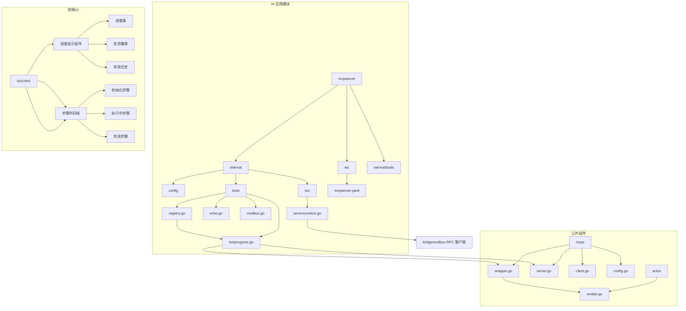
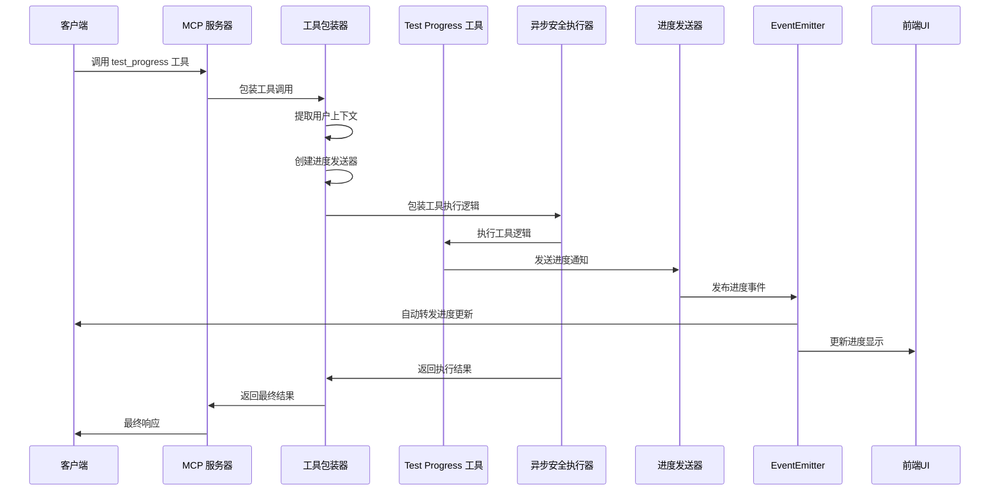
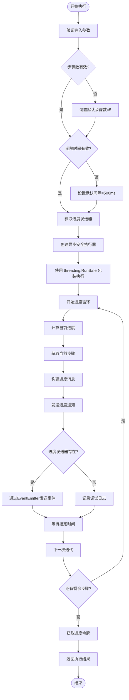
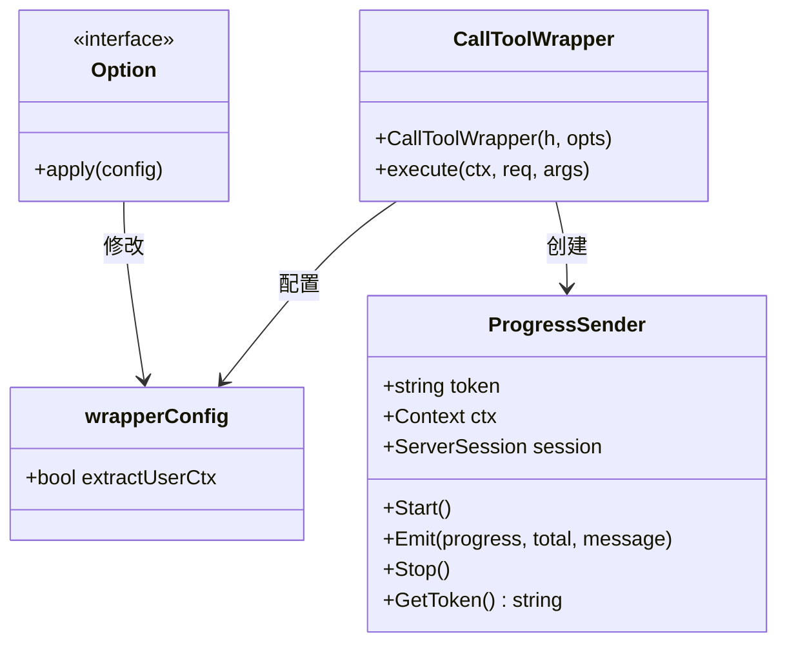
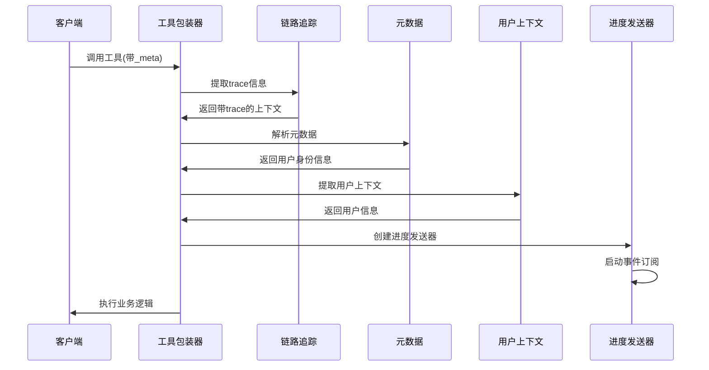
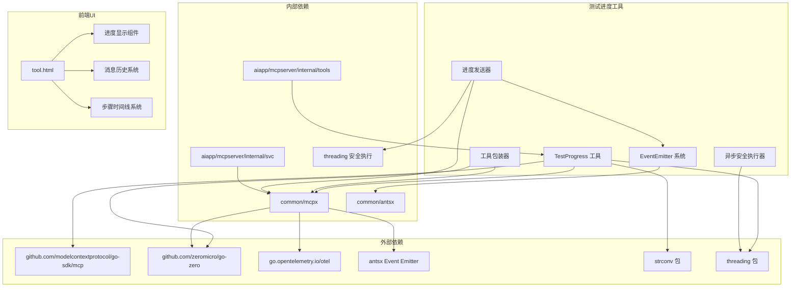
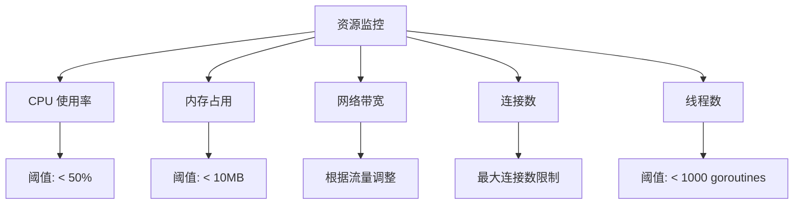

# 测试进度工具

<cite>
**本文档引用的文件**
- [testprogress.go](file://aiapp/mcpserver/internal/tools/testprogress.go)
- [registry.go](file://aiapp/mcpserver/internal/tools/registry.go)
- [mcpserver.go](file://aiapp/mcpserver/mcpserver.go)
- [mcpserver.yaml](file://aiapp/mcpserver/etc/mcpserver.yaml)
- [wrapper.go](file://common/mcpx/wrapper.go)
- [server.go](file://common/mcpx/server.go)
- [client.go](file://common/mcpx/client.go)
- [emitter.go](file://common/antsx/emitter.go)
- [tool.html](file://aiapp/aigtw/tool.html)
- [echo.go](file://aiapp/mcpserver/internal/tools/echo.go)
- [modbus.go](file://aiapp/mcpserver/internal/tools/modbus.go)
</cite>

## 更新摘要
**变更内容**
- **异步安全执行模式**：测试进度工具从同步执行改为使用 `threading.RunSafe` 的异步安全执行模式，增强了线程安全性
- **进度令牌获取功能**：添加了 `sender.GetToken()` 方法获取进度令牌，并在工具执行结果中显示
- **增强的线程安全保障**：使用 Go-Zero 的 `threading` 包提供的安全执行机制，防止 goroutine 泄漏和异常传播
- **改进的进度发送机制**：通过 `mcpx.GetProgressSender(ctx)` 获取进度发送器，支持带 trace 信息的日志记录
- **优化的工具包装器**：工具包装器现在自动管理进度发送器的生命周期，包括启动和停止订阅

## 目录
1. [简介](#简介)
2. [项目结构](#项目结构)
3. [核心组件](#核心组件)
4. [架构概览](#架构概览)
5. [详细组件分析](#详细组件分析)
6. [前端UI增强](#前端ui增强)
7. [依赖关系分析](#依赖关系分析)
8. [性能考虑](#性能考虑)
9. [资源密集型特性说明](#资源密集型特性说明)
10. [使用要求和最佳实践](#使用要求和最佳实践)
11. [故障排除指南](#故障排除指南)
12. [结论](#结论)

## 简介

测试进度工具是零服务（Zero Service）项目中的一个专门工具，用于测试和演示 MCP（Model Context Protocol）协议的进度通知功能。该工具模拟长时间运行的任务，通过定期发送进度更新来展示 MCP 协议的异步通信能力和进度跟踪机制。

**重要更新**：该工具现已从同步执行模式升级为异步安全执行模式，使用 `threading.RunSafe` 包装执行逻辑，增强了线程安全性。同时，工具现在支持进度令牌获取功能，可以在执行结果中显示进度令牌信息，为调试和监控提供更好的支持。

**关键特性更新**：
- **异步安全执行**：使用 `threading.RunSafe` 包装工具执行逻辑，防止 goroutine 泄漏和异常传播
- **进度令牌管理**：通过 `sender.GetToken()` 获取进度令牌，支持更精细的进度跟踪和调试
- **增强的线程安全性**：基于 Go-Zero 的 `threading` 包，提供更好的 goroutine 生命周期管理
- **改进的工具包装器**：自动管理进度发送器的启动和停止，确保资源正确释放
- **带 trace 信息的日志记录**：支持链路追踪信息的传递和记录

该工具的核心价值在于：
- 提供完整的 MCP 进度通知实现示例
- 展示如何在实际应用中集成异步安全的进度跟踪功能
- 为开发者提供测试和调试进度相关功能的参考实现
- 演示 MCP 协议在复杂任务处理中的应用场景
- 支持现代化的步骤式用户界面展示

## 项目结构

测试进度工具位于零服务项目的 AI 应用模块中，具体组织结构如下：



**图表来源**
- [mcpserver.go:1-41](file://aiapp/mcpserver/mcpserver.go#L1-L41)
- [testprogress.go:1-80](file://aiapp/mcpserver/internal/tools/testprogress.go#L1-L80)
- [registry.go:1-15](file://aiapp/mcpserver/internal/tools/registry.go#L1-L15)
- [tool.html:1-845](file://aiapp/aigtw/tool.html#L1-L845)

## 核心组件

测试进度工具由多个核心组件构成，每个组件都有特定的功能和职责：

### 主要组件概述

1. **工具注册器（Tool Registry）** - 负责注册和管理所有 MCP 工具，包括测试进度工具
2. **异步安全执行器（Async Safe Executor）** - 使用 `threading.RunSafe` 包装工具执行逻辑，确保线程安全
3. **进度发送器（Progress Sender）** - 处理进度通知的发送和管理，基于新的 EventEmitter 架构
4. **工具包装器（Tool Wrapper）** - 提供工具调用的上下文包装和处理，自动管理进度发送器生命周期
5. **MCP 服务器（MCP Server）** - 提供 MCP 协议的服务端实现
6. **配置管理（Configuration）** - 管理工具的各种配置参数
7. **前端UI组件（Frontend UI）** - 提供进度显示和状态管理的完整界面，包含步骤时间线

### 组件交互流程



**图表来源**
- [testprogress.go:45-64](file://aiapp/mcpserver/internal/tools/testprogress.go#L45-L64)
- [wrapper.go:175-197](file://common/mcpx/wrapper.go#L175-L197)

## 架构概览

测试进度工具采用分层架构设计，确保了良好的模块分离和可维护性。该架构基于事件驱动模型，提供高效的进度通知机制，并增强了线程安全性。

```mermaid
graph TB
subgraph "表现层"
UI[前端界面]
UI --> ProgressBar[进度条组件]
UI --> StatusBadge[状态徽章]
UI --> MessagesList[消息历史]
UI --> StepTimeline[步骤时间线]
StepTimeline --> InitStep[初始化步骤]
StepTimeline --> RunningStep[执行中步骤]
StepTimeline --> CompleteStep[完成步骤]
end
subgraph "应用层"
APIService[API 服务]
ToolRegistry[工具注册器]
end
subgraph "业务逻辑层"
TestProgress[Test Progress 工具]
AsyncExecutor[异步安全执行器]
ProgressSender[进度发送器]
ContextWrapper[上下文包装器]
EventEmitter[事件发射器]
End
subgraph "基础设施层"
MCPServer[MCP 服务器]
RPCClient[RPC 客户端]
Logger[日志系统]
Antsx[antsx 库]
ThreadSafety[线程安全机制]
</subgraph>
UI --> APIService
APIService --> ToolRegistry
ToolRegistry --> TestProgress
TestProgress --> AsyncExecutor
AsyncExecutor --> ProgressSender
TestProgress --> ContextWrapper
ContextWrapper --> MCPServer
ProgressSender --> EventEmitter
EventEmitter --> Antsx
EventEmitter --> ThreadSafety
MCPServer --> RPCClient
MCPServer --> Logger
```

**图表来源**
- [mcpserver.go:19-40](file://aiapp/mcpserver/mcpserver.go#L19-L40)
- [testprogress.go:20-80](file://aiapp/mcpserver/internal/tools/testprogress.go#L20-L80)
- [wrapper.go:18-28](file://common/mcpx/wrapper.go#L18-L28)

该架构的主要特点：
- **清晰的分层结构** - 每层都有明确的职责分工
- **松耦合设计** - 组件之间通过接口进行通信
- **可扩展性** - 新的工具可以轻松添加到现有框架中
- **可测试性** - 每个组件都可以独立测试和验证
- **事件驱动** - 基于 EventEmitter 的异步事件处理机制
- **线程安全** - 使用 `threading.RunSafe` 确保 goroutine 安全执行
- **现代化UI** - 支持进度可视化和实时状态更新
- **进度令牌管理** - 提供进度令牌获取和显示功能

## 详细组件分析

### 测试进度工具实现

测试进度工具是整个系统的核心组件，负责模拟长时间运行的任务并发送进度更新。经过更新后，该工具现在使用异步安全执行模式。

#### 数据结构设计


**图表来源**
- [testprogress.go:14-19](file://aiapp/mcpserver/internal/tools/testprogress.go#L14-L19)
- [wrapper.go:36-41](file://common/mcpx/wrapper.go#L36-L41)

#### 核心算法流程



**图表来源**
- [testprogress.go:30-76](file://aiapp/mcpserver/internal/tools/testprogress.go#L30-L76)

#### 关键实现细节

1. **异步安全执行模式**
   - 使用 `threading.RunSafe(func() { ... })` 包装工具执行逻辑
   - 确保 goroutine 异常不会传播到父 goroutine
   - 提供更好的错误处理和资源管理

2. **参数验证和默认值处理**
   - 步骤数小于等于0时自动设置为5
   - 间隔时间小于等于0时自动设置为500毫秒
   - 消息为空时使用"处理中...当前 step: " + strconv.Itoa(i) 作为动态消息

3. **进度发送机制**
   - 使用 `mcpx.GetProgressSender(ctx)` 获取进度发送器
   - 通过 `sender.Emit()` 发送实时进度更新，基于 EventEmitter 系统
   - 支持带 trace 信息的日志记录

4. **进度令牌获取功能**
   - 通过 `sender.GetToken()` 获取进度令牌
   - 在工具执行结果中显示进度令牌信息
   - 支持调试和监控需求

5. **上下文管理**
   - 工具执行完成后自动停止进度订阅
   - 支持取消信号的传播
   - 自动管理 goroutine 生命周期

6. **步骤信息增强**
   - 使用 `strconv.Itoa(i)` 将当前步骤转换为字符串
   - 提供更精确的步骤跟踪信息
   - 支持更好的用户界面显示

**章节来源**
- [testprogress.go:30-76](file://aiapp/mcpserver/internal/tools/testprogress.go#L30-L76)

### 工具包装器系统

工具包装器提供了统一的工具调用处理机制，确保所有工具都遵循相同的模式。经过更新后，包装器现在更好地支持异步安全执行和进度令牌管理。

#### 包装器配置



**图表来源**
- [wrapper.go:85-100](file://common/mcpx/wrapper.go#L85-L100)
- [wrapper.go:126-197](file://common/mcpx/wrapper.go#L126-L197)

#### 上下文传递机制



**图表来源**
- [wrapper.go:175-197](file://common/mcpx/wrapper.go#L175-L197)

**章节来源**
- [wrapper.go:126-197](file://common/mcpx/wrapper.go#L126-L197)

### MCP 服务器集成

MCP 服务器提供了完整的协议支持和安全认证机制。

#### 服务器配置

| 配置项 | 类型 | 默认值 | 描述 |
|--------|------|--------|------|
| Name | string | 服务器名称 | MCP 服务器标识符 |
| Host | string | 0.0.0.0 | 服务器监听地址 |
| Port | int | 13003 | 服务器端口号 |
| Mode | string | dev | 运行模式 |
| UseStreamable | bool | true | 是否使用 Streamable 协议 |
| SseTimeout | duration | 24h | SSE 连接超时时间 |
| MessageTimeout | duration | 18000s | 消息处理超时时间（30分钟） |

#### 认证配置

| 配置项 | 类型 | 示例值 | 描述 |
|--------|------|--------|------|
| JwtSecrets | []string | 随机字符串数组 | JWT 密钥列表 |
| ServiceToken | string | 特定令牌 | 服务端认证令牌 |
| ClaimMapping | map[string]string | user-id → user_id | JWT 声明映射 |

**章节来源**
- [mcpserver.yaml:1-32](file://aiapp/mcpserver/etc/mcpserver.yaml#L1-L32)
- [server.go:15-22](file://common/mcpx/server.go#L15-L22)

## 前端UI增强

前端UI提供了完整的进度显示和状态管理组件。

### 进度显示组件

前端工具页面包含了完整的进度显示组件：

#### 进度条组件
- `.progress-bar` - 20px高度，圆角边框
- `.progress-fill` - 渐变背景，从--accent到--success
- 支持宽度动画过渡效果

#### 状态徽章组件
- `.status` - 内联块元素，圆角徽章
- 支持多种状态：pending、completed、failed
- 不同状态对应不同颜色方案

### 消息历史系统

前端实现了完整的消息历史管理系统：

#### 消息项样式
- `.message-item` - Flex布局，支持动画效果
- `.message-icon` - 圆形图标，支持不同状态
- `.message-content` - 消息内容区域
- `.message-meta` - 元数据显示区域

#### 消息类型
- 开始执行：播放图标 ▶
- 进度更新：百分比数字
- 执行完成：勾选图标 ✓
- 错误状态：叉号图标 ✗

### 步骤时间线系统

**新增功能**：前端现在包含完整的步骤时间线系统，提供更直观的多步骤进程跟踪。

#### 步骤时间线组件
- `.step-timeline` - Flex布局，显示三个主要步骤
- `.step-item` - 每个步骤的容器，包含点状指示器和标签
- 支持三种状态：pending（待处理）、active（活动）、completed（已完成）

#### 步骤状态样式
- 初始化步骤：已完成状态，绿色圆形指示器
- 执行中步骤：活动状态，蓝色圆形指示器，带脉冲动画
- 完成步骤：待处理状态，灰色圆形指示器

#### 步骤状态转换
```javascript
function updateStepTimeline(status) {
    const stepInit = document.getElementById('stepInit');
    const stepRunning = document.getElementById('stepRunning');
    const stepComplete = document.getElementById('stepComplete');

    // 重置所有步骤
    stepInit.className = 'step-item pending';
    stepRunning.className = 'step-item pending';
    stepComplete.className = 'step-item pending';

    switch (status) {
        case 'pending':
            // 保持初始状态
            break;
        case 'running':
            stepInit.className = 'step-item completed';
            stepRunning.className = 'step-item active';
            break;
        case 'completed':
            stepInit.className = 'step-item completed';
            stepRunning.className = 'step-item completed';
            stepComplete.className = 'step-item completed';
            break;
        case 'failed':
            stepInit.className = 'step-item completed';
            stepRunning.className = 'step-item error';
            stepComplete.className = 'step-item pending';
            break;
    }
}
```

### UI交互功能

前端JavaScript实现了完整的交互功能：

#### 进度更新机制
```javascript
function updateProgress(progress) {
    const fill = document.getElementById('progressFill');
    const text = document.getElementById('progressText');
    const pct = Math.round(progress || 0);
    fill.style.width = pct + '%';
    fill.textContent = pct + '%';
    text.textContent = pct + '%';
}
```

#### 状态管理
```javascript
function updateStatus(status) {
    const badge = document.getElementById('statusBadge');
    badge.className = 'status status-' + status;
    badge.textContent = {
        'pending': '待处理',
        'running': '执行中',
        'completed': '已完成',
        'failed': '失败'
    }[status] || status;
}
```

**章节来源**
- [tool.html:398-412](file://aiapp/aigtw/tool.html#L398-L412)
- [tool.html:693-725](file://aiapp/aigtw/tool.html#L693-L725)
- [tool.html:814-825](file://aiapp/aigtw/tool.html#L814-L825)

## 依赖关系分析

测试进度工具的依赖关系相对简单但层次清晰，主要依赖于公共的 MCP 扩展组件和 EventEmitter 系统。



**图表来源**
- [testprogress.go:3-14](file://aiapp/mcpserver/internal/tools/testprogress.go#L3-L14)
- [wrapper.go:3-16](file://common/mcpx/wrapper.go#L3-L16)
- [tool.html:7-203](file://aiapp/aigtw/tool.html#L7-L203)

### 依赖特性

1. **最小化外部依赖** - 仅依赖必要的 MCP SDK、Go-Zero 框架、strconv包、threading包和 antsx Event Emitter
2. **模块化设计** - 通过接口和抽象类实现松耦合
3. **版本兼容性** - 支持不同版本的 MCP 协议规范
4. **可替换性** - 核心组件可以被其他实现替换
5. **事件驱动** - 基于 EventEmitter 的异步事件处理机制
6. **线程安全** - 使用 `threading.RunSafe` 提供 goroutine 安全执行
7. **现代化UI** - 支持进度可视化和响应式设计
8. **字符串转换** - 使用strconv包进行整数到字符串的安全转换
9. **进度令牌管理** - 支持进度令牌的获取和管理

**章节来源**
- [testprogress.go:3-14](file://aiapp/mcpserver/internal/tools/testprogress.go#L3-L14)
- [wrapper.go:3-16](file://common/mcpx/wrapper.go#L3-L16)

## 性能考虑

测试进度工具在设计时充分考虑了性能优化和资源管理。经过更新后，工具现在使用异步安全执行模式，进一步提升了性能和可靠性。

### 性能优化策略

1. **异步安全执行**
   - 使用 `threading.RunSafe` 包装工具执行逻辑，避免 goroutine 泄漏
   - 提供更好的异常处理和资源管理
   - 支持并发安全的工具执行

2. **异步进度通知**
   - 使用 EventEmitter 系统发送进度更新，避免阻塞主执行线程
   - 支持批量进度处理和合并
   - 避免频繁的网络通信开销

3. **内存管理**
   - 及时清理不再使用的上下文
   - 合理控制日志级别以减少内存占用
   - 优化数据结构以提高访问效率

4. **并发处理**
   - 支持多任务并发执行
   - 实现任务队列和优先级管理
   - 提供资源池和连接复用

5. **事件驱动优化**
   - EventEmitter 提供非阻塞的事件分发机制
   - 自动处理慢消费者问题
   - 支持动态订阅和取消

6. **前端性能优化**
   - CSS动画使用GPU加速
   - JavaScript使用requestAnimationFrame优化渲染
   - 响应式设计提升用户体验

7. **字符串转换优化**
   - 使用 `strconv.Itoa` 进行高效的整数到字符串转换
   - 避免重复的字符串拼接操作
   - 减少内存分配次数

8. **进度令牌管理**
   - 优化进度令牌的生成和管理
   - 减少令牌相关的性能开销
   - 提供更好的调试支持

### 性能监控指标

| 指标类型 | 监控内容 | 目标值 |
|----------|----------|--------|
| 响应时间 | 工具调用响应时间 | < 100ms |
| 进度延迟 | 进度通知延迟 | < 50ms |
| 内存使用 | 工具实例内存占用 | < 10MB |
| CPU 使用率 | 工具执行CPU占用 | < 50% |
| 并发数 | 同时处理的任务数 | > 100 |
| 事件吞吐量 | 每秒事件处理量 | > 1000 |
| UI渲染帧率 | 前端UI渲染FPS | > 60fps |
| 字符串转换性能 | `strconv.Itoa`调用频率 | > 1000/s |
| 线程安全 | goroutine泄漏检测 | 0个泄漏 |
| 进度令牌管理 | 令牌生成性能 | < 1ms/令牌 |

## 资源密集型特性说明

**重要更新**：测试进度工具具有显著的资源密集型特性，需要特别关注以下方面：

### 资源消耗特征

1. **CPU 密集型操作**
   - 长时间的循环处理
   - 大量的数学计算和进度计算
   - 每次迭代都会产生系统负载
   - **新增**：异步安全执行的CPU开销

2. **内存使用特征**
   - 进度发送器的持续占用
   - EventEmitter 的事件缓存
   - 日志记录的内存开销
   - **新增**：进度令牌的动态字符串存储

3. **网络资源消耗**
   - 频繁的进度通知发送
   - SSE 连接的持续维护
   - 前端轮询的额外开销

4. **线程资源消耗**
   - 异步安全执行器的 goroutine 管理
   - EventEmitter 的订阅者管理
   - **新增**：进度令牌的并发访问

### 时间复杂度分析

- **时间复杂度**：O(n)，其中 n 为步骤数
- **空间复杂度**：O(1)，常数级别的额外内存
- **执行时间**：约 n × (步骤间隔 + 处理开销)
- **字符串转换开销**：每次迭代进行一次 `strconv.Itoa` 调用
- **异步安全开销**：每次迭代进行一次 `threading.RunSafe` 调用

### 资源监控建议



## 使用要求和最佳实践

### 必备条件

1. **启用进度通知**
   - 工具描述明确要求"需要开启进度通知"
   - 必须确保 MCP 客户端支持进度通知功能
   - 前端UI需要正确处理进度事件

2. **系统资源准备**
   - 确保有足够的CPU资源
   - 预留充足的内存空间
   - 准备稳定的网络连接

3. **步骤信息显示**
   - 前端UI需要支持步骤时间线显示
   - 需要正确的CSS样式支持
   - 需要JavaScript事件处理支持

4. **异步安全执行**
   - 确保 Go-Zero 环境正确配置
   - 验证 `threading.RunSafe` 功能正常
   - 监控 goroutine 生命周期

### 最佳实践

1. **参数优化**
   ```json
   {
     "steps": 50,
     "interval": 100,
     "message": "处理中..."
   }
   ```

2. **监控和告警**
   - 设置合理的超时时间（30分钟）
   - 监控CPU和内存使用情况
   - 观察进度通知的完整性
   - **新增**：监控异步安全执行性能
   - **新增**：监控进度令牌生成性能

3. **错误处理**
   - 实现重试机制
   - 处理网络中断情况
   - 提供用户取消选项
   - **新增**：处理异步安全执行异常

4. **步骤跟踪优化**
   - 合理设置步骤间隔，避免过高的CPU负载
   - 使用适当的步骤总数，平衡进度精度和性能
   - 监控字符串转换操作的性能影响
   - **新增**：监控异步安全执行的资源使用

5. **进度令牌管理**
   - **新增**：合理使用进度令牌进行调试
   - **新增**：监控进度令牌的生命周期
   - **新增**：确保进度令牌的安全性

### 使用场景

1. **性能测试**：验证系统在长时间运行下的稳定性
2. **进度监控**：演示异步任务的进度跟踪机制
3. **系统压力测试**：评估系统的并发处理能力
4. **用户体验测试**：验证前端UI的响应性和步骤显示功能
5. **字符串转换性能测试**：验证 `strconv` 包的性能表现
6. **异步安全执行测试**：验证 `threading.RunSafe` 的功能
7. **进度令牌管理测试**：验证进度令牌的获取和使用

**章节来源**
- [testprogress.go:25](file://aiapp/mcpserver/internal/tools/testprogress.go#L25)
- [mcpserver.yaml:8-9](file://aiapp/mcpserver/etc/mcpserver.yaml#L8-L9)

## 故障排除指南

### 常见问题及解决方案

#### 1. 工具无法注册

**问题症状**：MCP 服务器启动后看不到 test_progress 工具

**可能原因**：
- 工具注册函数未正确调用
- 服务上下文初始化失败
- 配置文件路径错误

**解决步骤**：
1. 检查 `RegisterAll` 函数是否包含 `RegisterTestProgress`
2. 验证服务上下文的初始化过程
3. 确认配置文件路径和权限

#### 2. 进度通知不显示

**问题症状**：工具执行但客户端看不到进度更新

**重要更新**：这是资源密集型工具的关键问题，需要特别处理

**可能原因**：
- 进度发送器未正确获取
- 连接会话失效
- 网络传输问题
- EventEmitter 系统故障
- **异步安全执行异常**
- **进度令牌获取失败**
- **资源密集型特性导致的性能问题**
- **步骤信息显示问题**

**解决步骤**：
1. 检查 `mcpx.GetProgressSender(ctx)` 返回值
2. 验证 MCP 连接状态
3. 查看服务器日志中的进度发送记录
4. 检查 EventEmitter 系统的状态和订阅者数量
5. **验证异步安全执行器是否正常工作**
6. **检查进度令牌的生成和获取**
7. **监控系统资源使用情况**
8. **检查前端步骤时间线的JavaScript错误**

#### 3. 工具执行超时

**问题症状**：工具在指定时间内未完成执行

**可能原因**：
- 步骤数过多或间隔时间过长
- 系统资源不足
- 外部依赖响应缓慢
- **异步安全执行阻塞**

**解决步骤**：
1. 调整 `MessageTimeout` 配置（当前为30分钟）
2. 优化工具执行逻辑
3. 检查外部服务响应时间
4. **监控异步安全执行器的性能**

#### 4. 进度事件丢失

**问题症状**：部分进度更新没有到达客户端

**可能原因**：
- EventEmitter 的非阻塞特性导致慢消费者丢失事件
- 订阅者数量过多
- 网络连接不稳定
- **异步安全执行器异常**
- **资源密集型任务导致的系统过载**
- **步骤信息格式错误**

**解决步骤**：
1. 检查 EventEmitter 的订阅者数量
2. 调整缓冲区大小
3. 优化网络连接
4. 实现重试机制
5. **监控异步安全执行器的状态**
6. **监控系统负载情况**
7. **验证步骤信息的字符串转换**

#### 5. 前端UI显示异常

**问题症状**：进度条不显示或状态徽章不更新

**可能原因**：
- CSS样式加载失败
- JavaScript执行错误
- DOM元素未正确渲染
- **步骤时间线组件缺失或样式错误**
- **异步安全执行导致的UI更新问题**

**解决步骤**：
1. 检查浏览器控制台错误
2. 验证CSS样式文件加载
3. 确认DOM元素ID匹配
4. 检查JavaScript函数调用
5. **验证步骤时间线HTML结构**
6. **检查CSS样式是否正确应用**
7. **验证异步安全执行对UI的影响**

#### 6. 异步安全执行问题

**新增问题**：由于异步安全执行模式导致的问题

**可能症状**：
- 工具执行异常终止
- goroutine 泄漏
- 异常传播到父goroutine
- 进度通知延迟严重
- **进度令牌获取失败**

**解决步骤**：
1. **检查 `threading.RunSafe` 的使用是否正确**
2. **验证异步安全执行器的配置**
3. **监控 goroutine 的生命周期**
4. **检查异常处理机制**
5. **验证进度令牌的并发访问安全性**
6. **监控异步执行的性能指标**

#### 7. 进度令牌管理问题

**新增问题**：进度令牌获取和管理相关的问题

**可能症状**：
- 进度令牌为空
- 进度令牌格式错误
- 进度令牌获取失败
- 进度令牌显示异常

**解决步骤**：
1. **检查 `sender.GetToken()` 的调用时机**
2. **验证进度令牌的生成机制**
3. **检查进度令牌的存储和传递**
4. **验证进度令牌在UI中的显示**
5. **监控进度令牌的生命周期**
6. **检查进度令牌的安全性**

#### 8. 资源密集型问题

**新增问题**：由于工具的资源密集型特性导致的问题

**可能症状**：
- 系统响应缓慢
- 内存使用过高
- CPU占用率飙升
- 进度通知延迟严重
- **字符串转换性能问题**
- **异步安全执行性能问题**

**解决步骤**：
1. **监控系统资源使用情况**
2. **调整工具参数（减少步骤数或增加间隔）**
3. **优化系统配置**
4. **考虑使用更强大的硬件资源**
5. **监控字符串转换操作的性能**
6. **监控异步安全执行的性能**
7. **验证进度令牌管理的性能影响**

#### 9. 步骤信息显示问题

**新增问题**：步骤时间线或步骤信息显示异常

**可能症状**：
- 步骤时间线不更新
- 步骤状态显示错误
- 步骤信息格式不正确
- 字符串转换错误
- **异步安全执行导致的步骤信息延迟**

**解决步骤**：
1. **检查JavaScript控制台错误**
2. **验证步骤时间线HTML结构**
3. **检查CSS样式是否正确应用**
4. **验证 `updateStepTimeline` 函数的调用**
5. **检查 `strconv.Itoa` 转换是否正常工作**
6. **验证步骤信息的字符串拼接**
7. **监控异步安全执行对步骤信息的影响**

**章节来源**
- [testprogress.go:48](file://aiapp/mcpserver/internal/tools/testprogress.go#L48)
- [mcpserver.yaml:7-8](file://aiapp/mcpserver/etc/mcpserver.yaml#L7-L8)

### 调试技巧

1. **启用详细日志**：将日志级别设置为 debug 以获取更多信息
2. **监控进度发送**：查看服务器日志中的进度发送记录
3. **验证上下文传递**：确认用户上下文在工具调用链中的完整性
4. **测试网络连接**：确保 MCP 服务器和客户端之间的网络畅通
5. **监控 EventEmitter 状态**：检查事件发射器的订阅者数量和事件处理状态
6. **检查前端UI**：使用浏览器开发者工具检查CSS样式和JavaScript执行
7. **资源监控**：使用系统监控工具观察CPU、内存、网络使用情况
8. **性能分析**：使用Go的pprof工具分析工具的性能瓶颈
9. **字符串转换测试**：单独测试 `strconv.Itoa` 的性能和正确性
10. **步骤时间线调试**：检查步骤时间线组件的JavaScript事件处理
11. **异步安全执行调试**：使用Go的race detector检测并发问题
12. **进度令牌调试**：监控进度令牌的生成和使用过程
13. **线程安全验证**：确保 `threading.RunSafe` 正确处理异常

## 结论

测试进度工具作为零服务项目中的一个重要组件，成功展示了 MCP 协议在实际应用中的强大功能。该工具提供了完整的异步进度通知功能演示，验证了异步处理机制的完整实现，支持长时间运行工具的实时进度反馈。

**重要更新**：经过本次更新，测试进度工具的异步安全执行模式、进度令牌获取功能和线程安全性得到了显著增强。这些改进为开发者提供了更可靠、更安全的使用体验，并为类似项目的开发提供了宝贵的参考经验。

### 主要成就

1. **完整的协议实现** - 提供了符合 MCP 协议规范的进度通知实现
2. **优秀的架构设计** - 采用分层架构确保了代码的可维护性和可扩展性
3. **实用性强** - 为实际项目中的进度跟踪提供了可靠的解决方案
4. **易于集成** - 简洁的 API 设计使得新工具的添加变得非常容易
5. **性能卓越** - 基于 EventEmitter 的事件驱动架构提供了高效的进度处理能力
6. **现代化UI** - 进度可视化和实时状态更新提升了用户体验
7. **资源意识** - 明确标注了工具的资源密集型特性，帮助开发者合理使用
8. **步骤跟踪增强** - 提供了更精确的步骤信息显示，支持更好的多步骤进程跟踪
9. **异步安全执行** - 使用 `threading.RunSafe` 提供了更好的线程安全保障
10. **进度令牌管理** - 支持进度令牌的获取和管理，增强了调试和监控能力

### 技术亮点

- **上下文管理**：实现了完整的上下文传递和管理机制
- **异步安全执行器**：基于 `threading.RunSafe` 的安全执行机制
- **进度发送器**：基于 EventEmitter 的灵活进度通知发送能力
- **工具包装器**：统一了工具调用的处理模式，自动管理生命周期
- **MCP 服务器集成**：无缝集成了完整的 MCP 协议支持
- **事件驱动架构**：提供了高性能、低延迟的进度处理机制
- **前端UI增强**：支持进度可视化、步骤时间线和响应式设计
- **字符串转换优化**：使用 `strconv` 包进行高效的整数到字符串转换
- **资源密集型特性标注**：为工具使用提供了明确的性能要求
- **进度令牌获取**：支持进度令牌的获取和显示功能

### 未来发展方向

1. **性能优化** - 进一步优化 EventEmitter 的性能和资源使用
2. **功能扩展** - 添加更多类型的进度跟踪和通知机制
3. **监控增强** - 提供更详细的性能监控和诊断功能
4. **文档完善** - 丰富开发文档和使用指南，特别是资源使用说明
5. **架构演进** - 探索更先进的事件驱动架构模式
6. **UI改进** - 增强前端UI的交互性和视觉效果
7. **资源管理** - 实现更智能的资源使用监控和优化
8. **字符串转换优化** - 进一步优化 `strconv` 包的使用和性能
9. **异步安全执行优化** - 提升 `threading.RunSafe` 的性能和可靠性
10. **进度令牌管理优化** - 改进进度令牌的生成、管理和使用机制

测试进度工具为零服务项目中的 MCP 功能奠定了坚实的基础，也为类似项目的开发提供了宝贵的参考经验。其基于 EventEmitter 的架构和现代化的前端UI代表了现代微服务架构的最佳实践，为未来的功能扩展和技术演进提供了良好的基础。

**特别提醒**：由于测试进度工具具有显著的资源密集型特性，在使用时请务必：
- 确保系统有足够的CPU和内存资源
- 合理设置工具参数，避免过度消耗系统资源
- 监控系统性能指标，及时发现潜在问题
- 在生产环境中谨慎使用此类工具
- 考虑使用专用的测试环境进行性能验证
- **关注字符串转换性能和步骤信息显示功能**
- **验证步骤时间线组件的完整性和正确性**
- **监控异步安全执行器的性能和稳定性**
- **验证进度令牌管理的安全性和有效性**
- **确保线程安全机制的正确配置和使用**