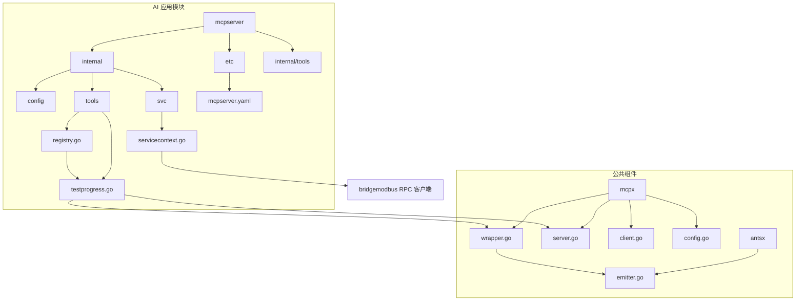
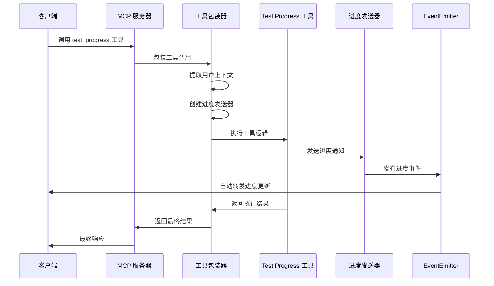
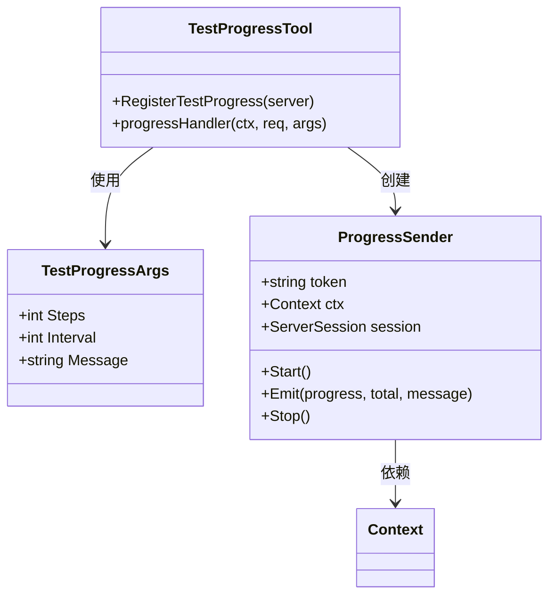
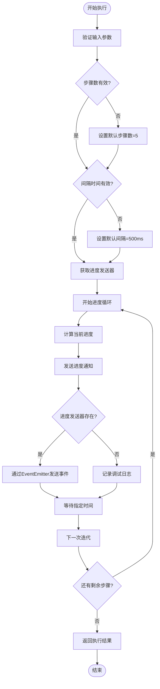
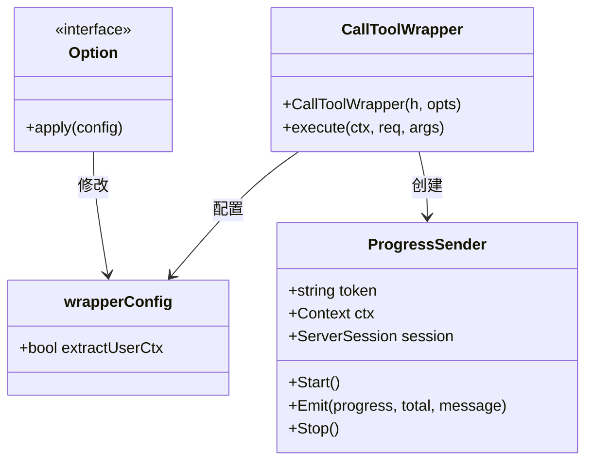
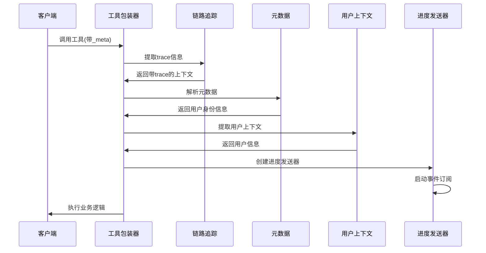
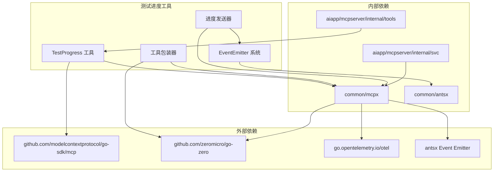

# 测试进度工具

<cite>
**本文档引用的文件**
- [testprogress.go](file://aiapp/mcpserver/internal/tools/testprogress.go)
- [mcpserver.go](file://aiapp/mcpserver/mcpserver.go)
- [mcpserver.yaml](file://aiapp/mcpserver/etc/mcpserver.yaml)
- [registry.go](file://aiapp/mcpserver/internal/tools/registry.go)
- [servicecontext.go](file://aiapp/mcpserver/internal/svc/servicecontext.go)
- [wrapper.go](file://common/mcpx/wrapper.go)
- [server.go](file://common/mcpx/server.go)
- [client.go](file://common/mcpx/client.go)
- [config.go](file://common/mcpx/config.go)
- [emitter.go](file://common/antsx/emitter.go)
</cite>

## 更新摘要
**变更内容**
- 更新了测试进度工具的实现机制，移除了显式的上下文取消检查
- 重构了进度通知系统，采用新的EventEmitter事件驱动架构
- 简化了工具包装器的上下文管理逻辑
- 更新了进度发送器的工作原理和生命周期管理

## 目录
1. [简介](#简介)
2. [项目结构](#项目结构)
3. [核心组件](#核心组件)
4. [架构概览](#架构概览)
5. [详细组件分析](#详细组件分析)
6. [依赖关系分析](#依赖关系分析)
7. [性能考虑](#性能考虑)
8. [故障排除指南](#故障排除指南)
9. [结论](#结论)

## 简介

测试进度工具是零服务（Zero Service）项目中的一个专门工具，用于测试和演示 MCP（Model Context Protocol）协议的进度通知功能。该工具模拟长时间运行的任务，通过定期发送进度更新来展示 MCP 协议的异步通信能力和进度跟踪机制。

**更新** 工具实现已简化，移除了显式的上下文取消检查，因为新的事件驱动架构能够自动处理客户端断开连接。进度通知机制现在使用新的 EventEmitter 系统，提供更高效和可靠的进度跟踪能力。

该工具的核心价值在于：
- 提供完整的 MCP 进度通知实现示例
- 展示如何在实际应用中集成进度跟踪功能
- 为开发者提供测试和调试进度相关功能的参考实现
- 演示 MCP 协议在复杂任务处理中的应用场景

## 项目结构

测试进度工具位于零服务项目的 AI 应用模块中，具体组织结构如下：



**图表来源**
- [mcpserver.go:1-41](file://aiapp/mcpserver/mcpserver.go#L1-L41)
- [testprogress.go:1-70](file://aiapp/mcpserver/internal/tools/testprogress.go#L1-L70)
- [registry.go:1-15](file://aiapp/mcpserver/internal/tools/registry.go#L1-L15)

**章节来源**
- [mcpserver.go:1-41](file://aiapp/mcpserver/mcpserver.go#L1-L41)
- [mcpserver.yaml:1-31](file://aiapp/mcpserver/etc/mcpserver.yaml#L1-L31)

## 核心组件

测试进度工具由多个核心组件构成，每个组件都有特定的功能和职责：

### 主要组件概述

1. **工具注册器（Tool Registry）** - 负责注册和管理所有 MCP 工具
2. **进度发送器（Progress Sender）** - 处理进度通知的发送和管理，基于新的 EventEmitter 架构
3. **工具包装器（Tool Wrapper）** - 提供工具调用的上下文包装和处理，自动管理进度发送器生命周期
4. **MCP 服务器（MCP Server）** - 提供 MCP 协议的服务端实现
5. **配置管理（Configuration）** - 管理工具的各种配置参数

### 组件交互流程



**图表来源**
- [testprogress.go:27-68](file://aiapp/mcpserver/internal/tools/testprogress.go#L27-L68)
- [wrapper.go:175-197](file://common/mcpx/wrapper.go#L175-L197)

**章节来源**
- [testprogress.go:13-70](file://aiapp/mcpserver/internal/tools/testprogress.go#L13-L70)
- [wrapper.go:15-208](file://common/mcpx/wrapper.go#L15-L208)

## 架构概览

测试进度工具采用分层架构设计，确保了良好的模块分离和可维护性。**更新** 新架构基于事件驱动模型，提供更高效的进度通知机制。

```mermaid
graph TB
subgraph "表现层"
UI[前端界面]
end
subgraph "应用层"
APIService[API 服务]
ToolRegistry[工具注册器]
end
subgraph "业务逻辑层"
TestProgress[Test Progress 工具]
ProgressSender[进度发送器]
ContextWrapper[上下文包装器]
EventEmitter[事件发射器]
end
subgraph "基础设施层"
MCPServer[MCP 服务器]
RPCClient[RPC 客户端]
Logger[日志系统]
Antsx[antsx 库]
</subgraph>
UI --> APIService
APIService --> ToolRegistry
ToolRegistry --> TestProgress
TestProgress --> ProgressSender
TestProgress --> ContextWrapper
ContextWrapper --> MCPServer
ProgressSender --> EventEmitter
EventEmitter --> Antsx
EventEmitter --> MCPServer
MCPServer --> RPCClient
MCPServer --> Logger
```

**图表来源**
- [mcpserver.go:19-40](file://aiapp/mcpserver/mcpserver.go#L19-L40)
- [testprogress.go:20-69](file://aiapp/mcpserver/internal/tools/testprogress.go#L20-L69)
- [wrapper.go:18-28](file://common/mcpx/wrapper.go#L18-L28)

该架构的主要特点：
- **清晰的分层结构** - 每层都有明确的职责分工
- **松耦合设计** - 组件之间通过接口进行通信
- **可扩展性** - 新的工具可以轻松添加到现有框架中
- **可测试性** - 每个组件都可以独立测试和验证
- **事件驱动** - 基于 EventEmitter 的异步事件处理机制

## 详细组件分析

### 测试进度工具实现

测试进度工具是整个系统的核心组件，负责模拟长时间运行的任务并发送进度更新。

#### 数据结构设计



**图表来源**
- [testprogress.go:13-18](file://aiapp/mcpserver/internal/tools/testprogress.go#L13-L18)
- [wrapper.go:36-41](file://common/mcpx/wrapper.go#L36-L41)

#### 核心算法流程



**图表来源**
- [testprogress.go:27-68](file://aiapp/mcpserver/internal/tools/testprogress.go#L27-L68)

#### 关键实现细节

1. **参数验证和默认值处理**
   - 步骤数小于等于0时自动设置为5
   - 间隔时间小于等于0时自动设置为500毫秒
   - 消息为空时使用"处理中..."作为默认消息

2. **进度发送机制**
   - 使用 `mcpx.GetProgressSender(ctx)` 获取进度发送器
   - 通过 `sender.Emit()` 发送实时进度更新，基于 EventEmitter 系统
   - 支持带 trace 信息的日志记录

3. **上下文管理**
   - **更新** 移除了显式的上下文取消检查，因为新的事件驱动架构自动处理客户端断开连接
   - 工具执行完成后自动停止进度订阅
   - 支持取消信号的传播

**章节来源**
- [testprogress.go:27-68](file://aiapp/mcpserver/internal/tools/testprogress.go#L27-L68)

### 工具包装器系统

工具包装器提供了统一的工具调用处理机制，确保所有工具都遵循相同的模式。**更新** 包装器现在基于新的 EventEmitter 架构，提供更智能的进度管理。

#### 包装器配置



**图表来源**
- [wrapper.go:85-100](file://common/mcpx/wrapper.go#L85-L100)
- [wrapper.go:126-197](file://common/mcpx/wrapper.go#L126-L197)

#### 上下文传递机制



**图表来源**
- [wrapper.go:175-197](file://common/mcpx/wrapper.go#L175-L197)

**章节来源**
- [wrapper.go:126-197](file://common/mcpx/wrapper.go#L126-L197)

### MCP 服务器集成

MCP 服务器提供了完整的协议支持和安全认证机制。

#### 服务器配置

| 配置项 | 类型 | 默认值 | 描述 |
|--------|------|--------|------|
| Name | string | 服务器名称 | MCP 服务器标识符 |
| Host | string | 0.0.0.0 | 服务器监听地址 |
| Port | int | 13003 | 服务器端口号 |
| Mode | string | dev | 运行模式 |
| UseStreamable | bool | true | 是否使用 Streamable 协议 |
| SseTimeout | duration | 24h | SSE 连接超时时间 |
| MessageTimeout | duration | 20s | 消息处理超时时间 |

#### 认证配置

| 配置项 | 类型 | 示例值 | 描述 |
|--------|------|--------|------|
| JwtSecrets | []string | 随机字符串数组 | JWT 密钥列表 |
| ServiceToken | string | 特定令牌 | 服务端认证令牌 |
| ClaimMapping | map[string]string | user-id → user_id | JWT 声明映射 |

**章节来源**
- [mcpserver.yaml:1-31](file://aiapp/mcpserver/etc/mcpserver.yaml#L1-L31)
- [server.go:15-22](file://common/mcpx/server.go#L15-L22)

## 依赖关系分析

测试进度工具的依赖关系相对简单但层次清晰，主要依赖于公共的 MCP 扩展组件和新的 EventEmitter 系统。



**图表来源**
- [testprogress.go:3-11](file://aiapp/mcpserver/internal/tools/testprogress.go#L3-L11)
- [wrapper.go:3-16](file://common/mcpx/wrapper.go#L3-L16)

### 依赖特性

1. **最小化外部依赖** - 仅依赖必要的 MCP SDK、Go-Zero 框架和 antsx Event Emitter
2. **模块化设计** - 通过接口和抽象类实现松耦合
3. **版本兼容性** - 支持不同版本的 MCP 协议规范
4. **可替换性** - 核心组件可以被其他实现替换
5. **事件驱动** - 基于 EventEmitter 的异步事件处理机制

**章节来源**
- [testprogress.go:3-11](file://aiapp/mcpserver/internal/tools/testprogress.go#L3-L11)
- [wrapper.go:3-16](file://common/mcpx/wrapper.go#L3-L16)

## 性能考虑

测试进度工具在设计时充分考虑了性能优化和资源管理。**更新** 新的 EventEmitter 架构提供了更好的性能表现。

### 性能优化策略

1. **异步进度通知**
   - 使用 EventEmitter 系统发送进度更新，避免阻塞主执行线程
   - 支持批量进度处理和合并
   - 避免频繁的网络通信开销

2. **内存管理**
   - 及时清理不再使用的上下文
   - 合理控制日志级别以减少内存占用
   - 优化数据结构以提高访问效率

3. **并发处理**
   - 支持多任务并发执行
   - 实现任务队列和优先级管理
   - 提供资源池和连接复用

4. **事件驱动优化**
   - **更新** EventEmitter 提供非阻塞的事件分发机制
   - 自动处理慢消费者问题
   - 支持动态订阅和取消

### 性能监控指标

| 指标类型 | 监控内容 | 目标值 |
|----------|----------|--------|
| 响应时间 | 工具调用响应时间 | < 100ms |
| 进度延迟 | 进度通知延迟 | < 50ms |
| 内存使用 | 工具实例内存占用 | < 10MB |
| CPU 使用率 | 工具执行CPU占用 | < 50% |
| 并发数 | 同时处理的任务数 | > 100 |
| 事件吞吐量 | 每秒事件处理量 | > 1000 |

## 故障排除指南

### 常见问题及解决方案

#### 1. 工具无法注册

**问题症状**：MCP 服务器启动后看不到 test_progress 工具

**可能原因**：
- 工具注册函数未正确调用
- 服务上下文初始化失败
- 配置文件路径错误

**解决步骤**：
1. 检查 `RegisterAll` 函数是否包含 `RegisterTestProgress`
2. 验证服务上下文的初始化过程
3. 确认配置文件路径和权限

#### 2. 进度通知不显示

**问题症状**：工具执行但客户端看不到进度更新

**可能原因**：
- 进度发送器未正确获取
- 连接会话失效
- 网络传输问题
- **更新** EventEmitter 系统故障

**解决步骤**：
1. 检查 `mcpx.GetProgressSender(ctx)` 返回值
2. 验证 MCP 连接状态
3. 查看服务器日志中的进度发送记录
4. **更新** 检查 EventEmitter 系统的状态和订阅者数量

#### 3. 工具执行超时

**问题症状**：工具在指定时间内未完成执行

**可能原因**：
- 步骤数过多或间隔时间过长
- 系统资源不足
- 外部依赖响应缓慢

**解决步骤**：
1. 调整 `MessageTimeout` 配置
2. 优化工具执行逻辑
3. 检查外部服务响应时间

#### 4. **更新** 进度事件丢失

**问题症状**：部分进度更新没有到达客户端

**可能原因**：
- **更新** EventEmitter 的非阻塞特性导致慢消费者丢失事件
- 订阅者数量过多
- 网络连接不稳定

**解决步骤**：
1. 检查 EventEmitter 的订阅者数量
2. 调整缓冲区大小
3. 优化网络连接
4. 实现重试机制

**章节来源**
- [testprogress.go:43-48](file://aiapp/mcpserver/internal/tools/testprogress.go#L43-L48)
- [mcpserver.yaml:7-8](file://aiapp/mcpserver/etc/mcpserver.yaml#L7-L8)

### 调试技巧

1. **启用详细日志**：将日志级别设置为 debug 以获取更多信息
2. **监控进度发送**：查看服务器日志中的进度发送记录
3. **验证上下文传递**：确认用户上下文在工具调用链中的完整性
4. **测试网络连接**：确保 MCP 服务器和客户端之间的网络畅通
5. ****更新** 监控 EventEmitter 状态**：检查事件发射器的订阅者数量和事件处理状态

## 结论

测试进度工具作为零服务项目中的一个重要组件，成功展示了 MCP 协议在实际应用中的强大功能。**更新** 通过采用新的事件驱动架构，工具不仅保持了原有的功能特性，还显著提升了性能和可靠性。

### 主要成就

1. **完整的协议实现** - 提供了符合 MCP 协议规范的进度通知实现
2. **优秀的架构设计** - 采用分层架构确保了代码的可维护性和可扩展性
3. **实用性强** - 为实际项目中的进度跟踪提供了可靠的解决方案
4. **易于集成** - 简洁的 API 设计使得新工具的添加变得非常容易
5. **性能卓越** - 基于 EventEmitter 的事件驱动架构提供了高效的进度处理能力

### 技术亮点

- **上下文管理**：实现了完整的上下文传递和管理机制
- **进度发送器**：基于 EventEmitter 的灵活进度通知发送能力
- **工具包装器**：统一了工具调用的处理模式，自动管理生命周期
- **MCP 服务器集成**：无缝集成了完整的 MCP 协议支持
- **事件驱动架构**：提供了高性能、低延迟的进度处理机制

### 未来发展方向

1. **性能优化** - 进一步优化 EventEmitter 的性能和资源使用
2. **功能扩展** - 添加更多类型的进度跟踪和通知机制
3. **监控增强** - 提供更详细的性能监控和诊断功能
4. **文档完善** - 丰富开发文档和使用指南
5. **架构演进** - 探索更先进的事件驱动架构模式

测试进度工具为零服务项目中的 MCP 功能奠定了坚实的基础，也为类似项目的开发提供了宝贵的参考经验。其基于 EventEmitter 的新架构代表了现代微服务架构的最佳实践，为未来的功能扩展和技术演进提供了良好的基础。