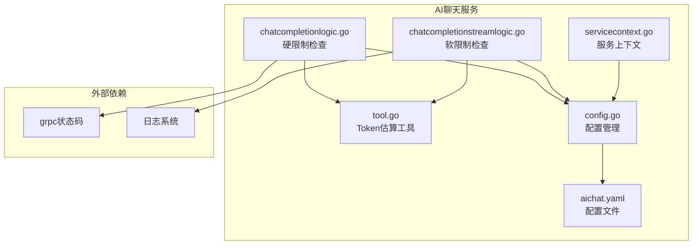
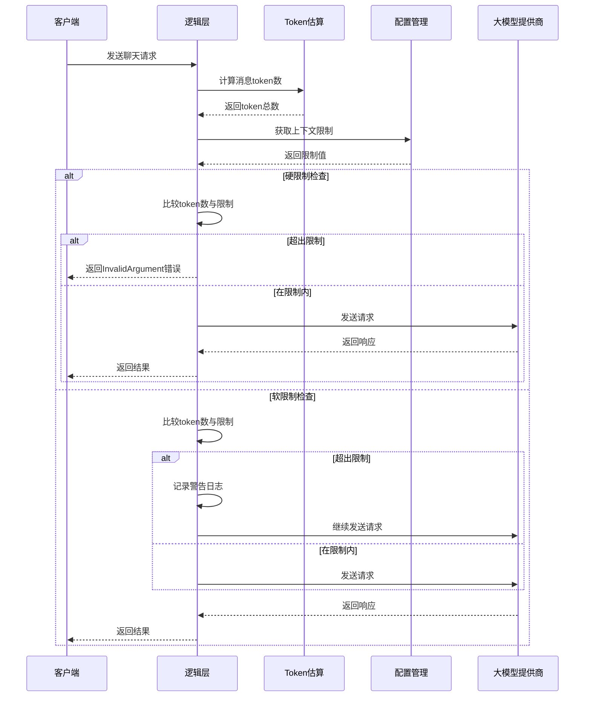
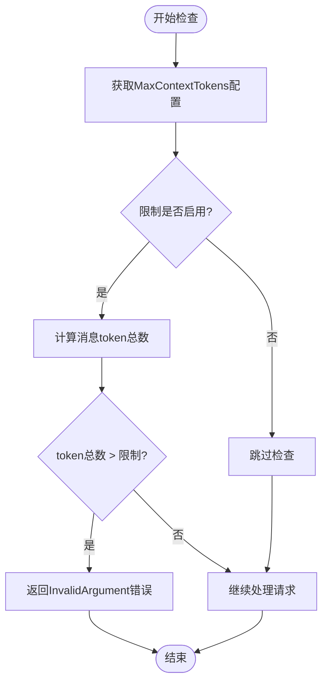
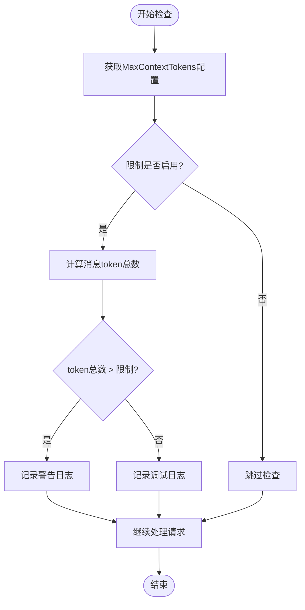
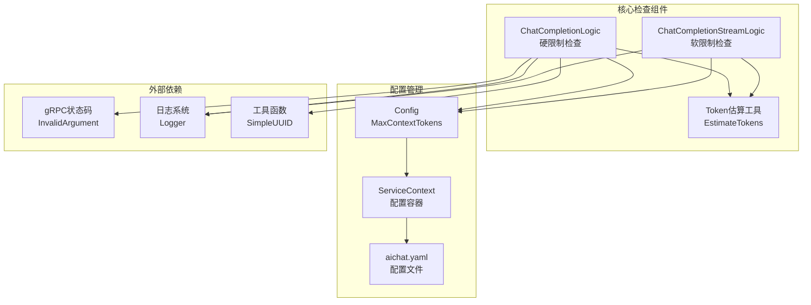

# 上下文大小检查机制

<cite>
**本文档引用的文件**
- [chatcompletionlogic.go](file://aiapp/aichat/internal/logic/chatcompletionlogic.go)
- [chatcompletionstreamlogic.go](file://aiapp/aichat/internal/logic/chatcompletionstreamlogic.go)
- [tool.go](file://common/tool/tool.go)
- [config.go](file://aiapp/aichat/internal/config/config.go)
- [servicecontext.go](file://aiapp/aichat/internal/svc/servicecontext.go)
- [aichat.yaml](file://aiapp/aichat/etc/aichat.yaml)
- [aichat.proto](file://aiapp/aichat/aichat.proto)
</cite>

## 目录
1. [简介](#简介)
2. [项目结构](#项目结构)
3. [核心组件](#核心组件)
4. [架构概览](#架构概览)
5. [详细组件分析](#详细组件分析)
6. [依赖关系分析](#依赖关系分析)
7. [性能考虑](#性能考虑)
8. [故障排除指南](#故障排除指南)
9. [结论](#结论)

## 简介

上下文大小检查机制是AI聊天服务中的关键功能，用于监控和控制对话历史的长度，防止超出大语言模型的上下文窗口限制。该机制通过估算消息的token数量来判断是否超过预设的上下文限制，并采取相应的处理策略。

在本项目中，上下文大小检查机制主要应用于两个场景：
- **硬限制检查**：在非流式聊天完成接口中，如果上下文过大则直接拒绝请求
- **软限制检查**：在流式聊天完成接口中，如果上下文过大则发出警告但继续处理

## 项目结构

AI聊天服务采用模块化设计，上下文大小检查机制分布在以下关键文件中：

**图表来源**
- [chatcompletionlogic.go:1-225](file://aiapp/aichat/internal/logic/chatcompletionlogic.go#L1-L225)
- [chatcompletionstreamlogic.go:1-353](file://aiapp/aichat/internal/logic/chatcompletionstreamlogic.go#L1-L353)
- [tool.go:470-527](file://common/tool/tool.go#L470-L527)

**章节来源**
- [chatcompletionlogic.go:1-225](file://aiapp/aichat/internal/logic/chatcompletionlogic.go#L1-L225)
- [chatcompletionstreamlogic.go:1-353](file://aiapp/aichat/internal/logic/chatcompletionstreamlogic.go#L1-L353)
- [tool.go:470-527](file://common/tool/tool.go#L470-L527)

## 核心组件

### Token估算工具

Token估算工具提供了精确的消息长度计算能力，采用多语言字符识别算法：

- **中文字符**：约2 tokens/字符
- **英文单词**：约1.3 tokens/单词  
- **标点符号**：约0.25 tokens/字符
- **空格字符**：约0.25 tokens/字符

估算公式考虑了消息格式开销，每条消息额外增加4 tokens。

### 上下文配置管理

配置系统支持灵活的上下文限制设置：

- **MaxContextTokens**：全局上下文token上限，默认128000
- **MaxToolRounds**：工具调用最大轮次，默认10
- **StreamTimeout**：流式请求总超时时间，默认600秒
- **StreamIdleTimeout**：流式请求空闲超时时间，默认90秒

**章节来源**
- [tool.go:470-527](file://common/tool/tool.go#L470-L527)
- [config.go:1-36](file://aiapp/aichat/internal/config/config.go#L1-L36)
- [aichat.yaml:1-52](file://aiapp/aichat/etc/aichat.yaml#L1-L52)

## 架构概览

上下文大小检查机制在整个AI聊天服务中的工作流程如下：

**图表来源**
- [chatcompletionlogic.go:50-59](file://aiapp/aichat/internal/logic/chatcompletionlogic.go#L50-L59)
- [chatcompletionstreamlogic.go:87-98](file://aiapp/aichat/internal/logic/chatcompletionstreamlogic.go#L87-L98)
- [tool.go:481-516](file://common/tool/tool.go#L481-L516)

## 详细组件分析

### 硬限制检查机制

硬限制检查机制在非流式聊天完成接口中实施，具有强制性特征：

#### 实现原理

**图表来源**
- [chatcompletionlogic.go:50-59](file://aiapp/aichat/internal/logic/chatcompletionlogic.go#L50-L59)

#### 错误处理策略

当检测到上下文过大时，系统返回标准的gRPC InvalidArgument错误，包含详细的错误信息：
- 当前token总数
- 配置的限制值
- 明确的错误描述

#### 处理流程

1. **配置读取**：从ServiceContext.Config中获取MaxContextTokens
2. **token计算**：遍历所有消息，使用EstimateTokens函数计算
3. **限制比较**：直接比较总token数与限制值
4. **错误响应**：超过限制时立即终止请求处理

**章节来源**
- [chatcompletionlogic.go:50-59](file://aiapp/aichat/internal/logic/chatcompletionlogic.go#L50-L59)

### 软限制检查机制

软限制检查机制在流式聊天完成接口中实施，具有警告性质：

#### 实现原理

**图表来源**
- [chatcompletionstreamlogic.go:87-98](file://aiapp/aichat/internal/logic/chatcompletionstreamlogic.go#L87-L98)

#### 日志记录策略

软限制检查使用不同的日志级别：
- **警告级别**：当token数超过限制时记录详细信息
- **调试级别**：当token数在限制内时记录简要信息
- **性能监控**：提供上下文使用率的统计信息

#### 处理流程

1. **配置读取**：从ServiceContext.Config获取MaxContextTokens
2. **token计算**：遍历所有消息，使用EstimateTokens函数计算
3. **日志记录**：根据结果记录相应级别的日志
4. **继续处理**：无论是否超过限制都继续请求处理

**章节来源**
- [chatcompletionstreamlogic.go:87-98](file://aiapp/aichat/internal/logic/chatcompletionstreamlogic.go#L87-L98)

### Token估算算法

Token估算算法采用多语言字符识别技术，提供准确的消息长度估计：

#### 字符分类规则

| 字符类型 | 估算规则 | tokens/单位 |
|---------|---------|------------|
| 中文字符 | U+4E00-U+9FFF | 2.0 |
| CJK标点 | U+3000-U+303F | 0.25 |
| 全角字符 | U+FF00-U+FFEF | 2.0 |
| 英文字母 | a-z, A-Z | 1.3 tokens/单词 |
| 空白字符 | 空格、制表符 | 0.25 |
| ASCII符号 | < 128 | 0.25 |
| 其他字符 | emoji等 | 2.0 |

#### 消息格式开销

每条消息额外增加4 tokens作为格式开销，包括：
- 角色信息包装
- 内容边界标记
- JSON序列化开销

**章节来源**
- [tool.go:474-516](file://common/tool/tool.go#L474-L516)

## 依赖关系分析

上下文大小检查机制涉及多个组件的协作：

**图表来源**
- [chatcompletionlogic.go:18-30](file://aiapp/aichat/internal/logic/chatcompletionlogic.go#L18-L30)
- [chatcompletionstreamlogic.go:56-68](file://aiapp/aichat/internal/logic/chatcompletionstreamlogic.go#L56-L68)
- [config.go:28-36](file://aiapp/aichat/internal/config/config.go#L28-L36)

### 组件耦合度分析

- **高内聚**：Token估算功能独立封装，便于测试和维护
- **低耦合**：检查逻辑与具体的大模型提供商解耦
- **清晰职责**：硬限制和软限制分别处理不同场景需求

### 外部依赖关系

- **gRPC集成**：使用标准的InvalidArgument错误码
- **配置系统**：依赖go-zero的配置管理框架
- **日志系统**：使用go-zero的日志组件
- **工具库**：依赖通用的UUID生成工具

**章节来源**
- [servicecontext.go:11-16](file://aiapp/aichat/internal/svc/servicecontext.go#L11-L16)
- [config.go:28-36](file://aiapp/aichat/internal/config/config.go#L28-L36)

## 性能考虑

### 估算精度权衡

Token估算算法在准确性与性能之间取得平衡：

- **时间复杂度**：O(n)，其中n为消息字符数
- **空间复杂度**：O(1)，只使用常量额外内存
- **估算误差**：±10-20%，对于大多数应用场景足够准确

### 性能优化策略

1. **早期短路**：当配置为0时跳过所有检查
2. **增量计算**：只对新增消息进行token计算
3. **缓存机制**：重复消息可以复用估算结果
4. **批量处理**：工具调用轮次限制避免无限循环

### 内存使用优化

- **零拷贝设计**：使用rune切片避免不必要的字符串复制
- **流式处理**：支持大型消息的分块处理
- **资源回收**：及时释放临时计算结果

## 故障排除指南

### 常见问题诊断

#### 上下文过大错误

**症状**：客户端收到InvalidArgument错误，提示context too large

**可能原因**：
1. 消息历史过长
2. 大量图片或多媒体内容
3. 配置的上下文限制过小

**解决方案**：
1. 清理历史消息
2. 减少多媒体内容
3. 调整MaxContextTokens配置

#### 警告日志频繁出现

**症状**：系统日志中频繁出现context large警告

**可能原因**：
1. 用户习惯发送长文本
2. 缺少消息清理机制
3. 配置过于严格

**解决方案**：
1. 实施消息摘要功能
2. 添加自动清理策略
3. 调整上下文限制阈值

### 监控指标建议

建议监控以下关键指标：
- 上下文使用率分布
- Token估算准确度
- 错误请求比例
- 平均响应时间

**章节来源**
- [chatcompletionlogic.go:56-57](file://aiapp/aichat/internal/logic/chatcompletionlogic.go#L56-L57)
- [chatcompletionstreamlogic.go:93-94](file://aiapp/aichat/internal/logic/chatcompletionstreamlogic.go#L93-L94)

## 结论

上下文大小检查机制通过硬限制和软限制两种策略，有效保障了AI聊天服务的稳定性和可靠性。该机制具有以下特点：

**技术优势**：
- 精确的Token估算算法
- 灵活的配置管理
- 清晰的错误处理
- 良好的性能表现

**应用价值**：
- 防止系统过载
- 提升用户体验
- 降低运营成本
- 增强系统稳定性

通过合理的配置和监控，该机制能够适应不同规模和类型的AI聊天应用场景，为构建可靠的AI服务基础设施提供了重要支撑。