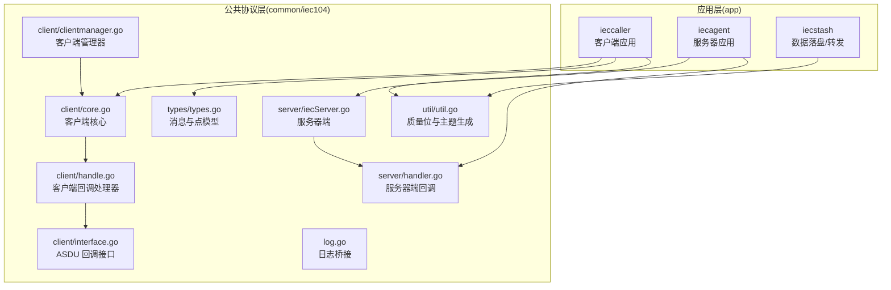
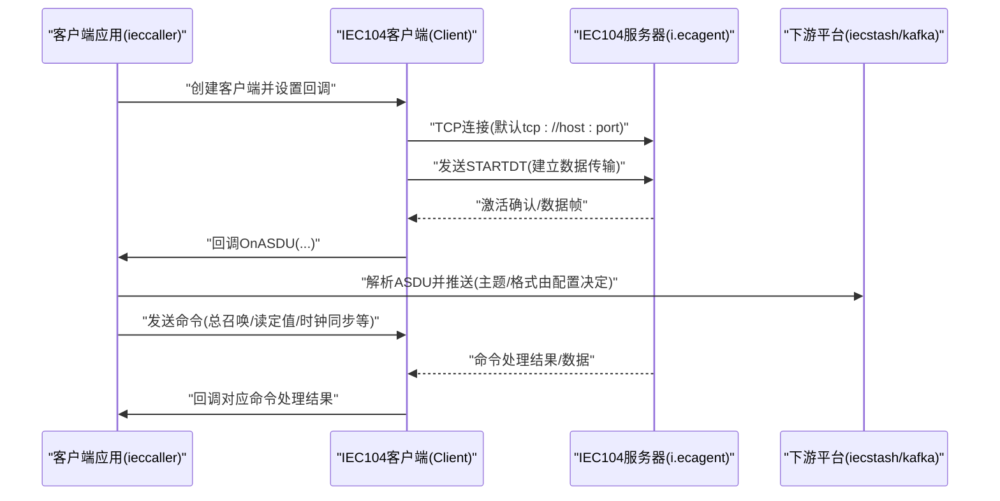
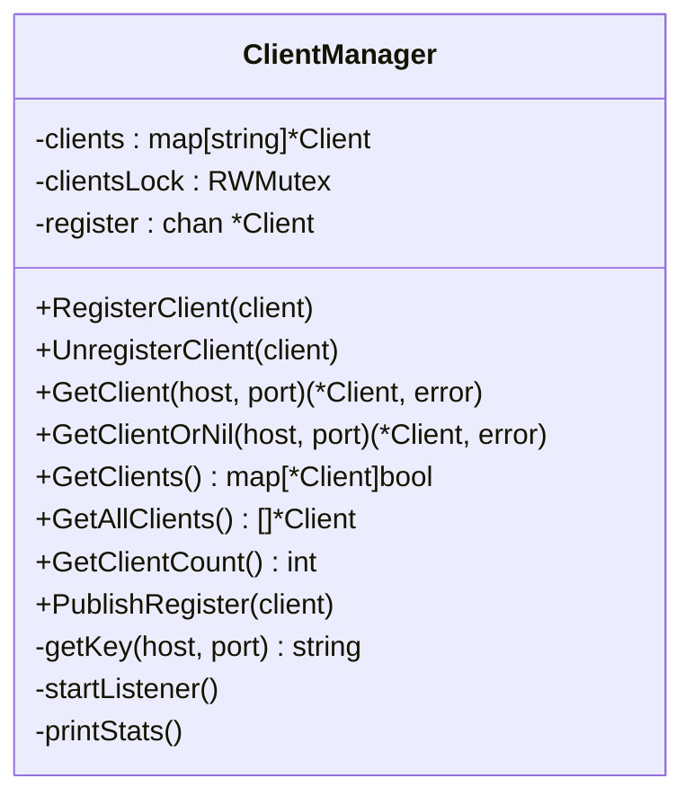
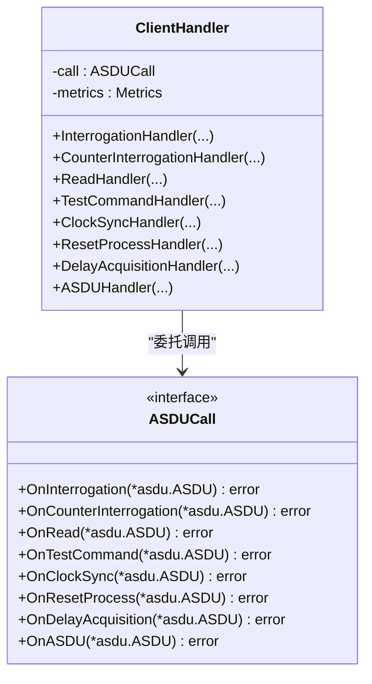
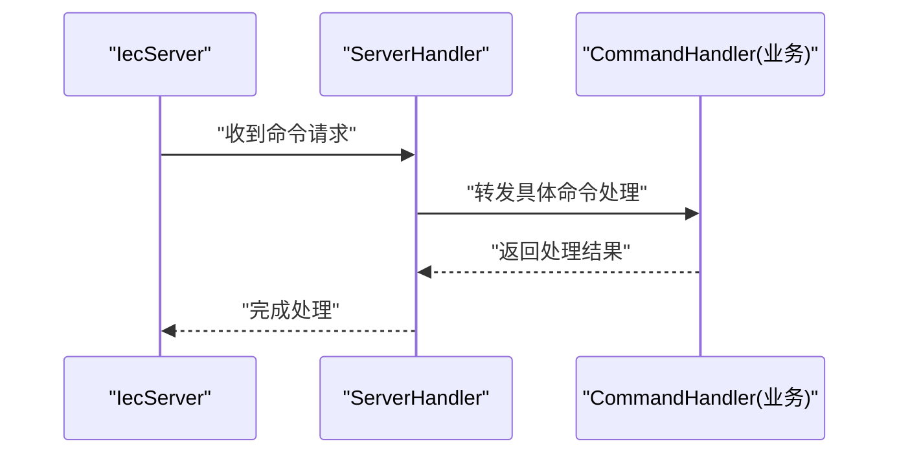
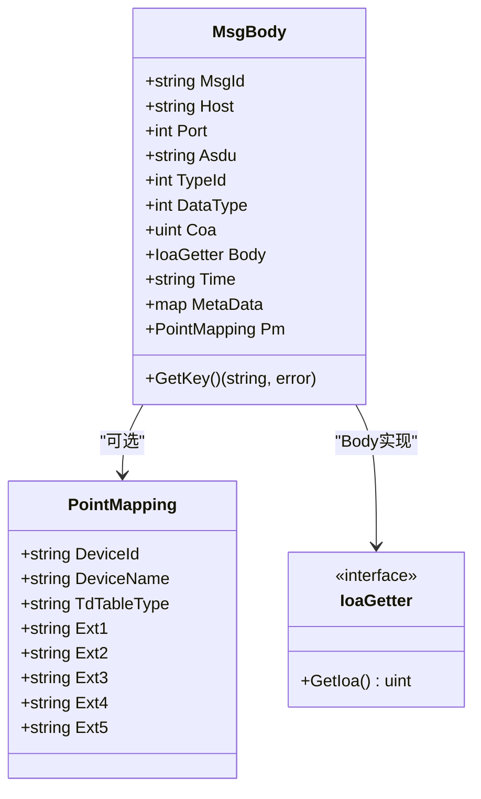
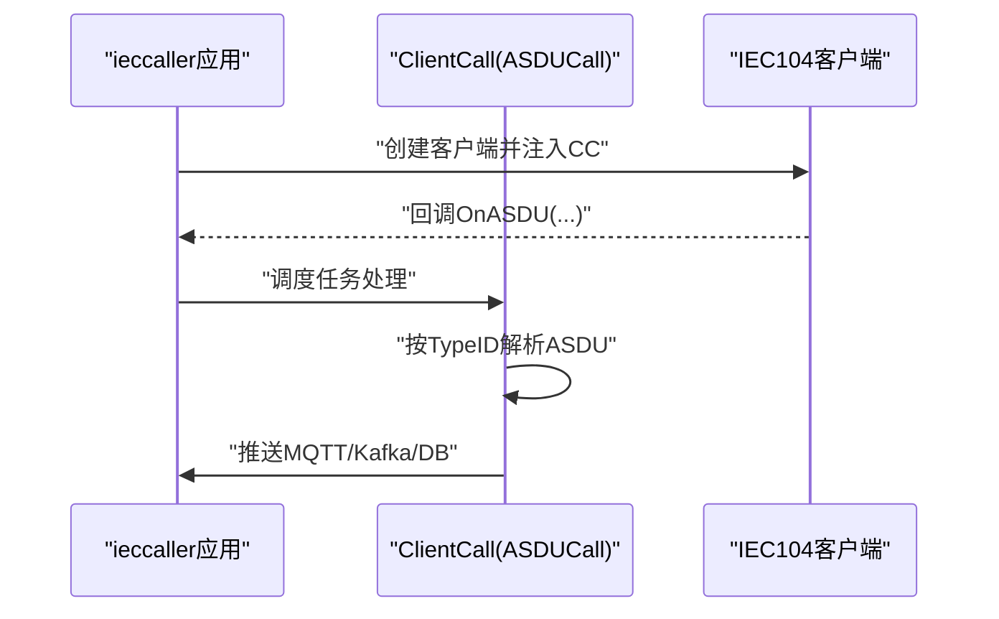
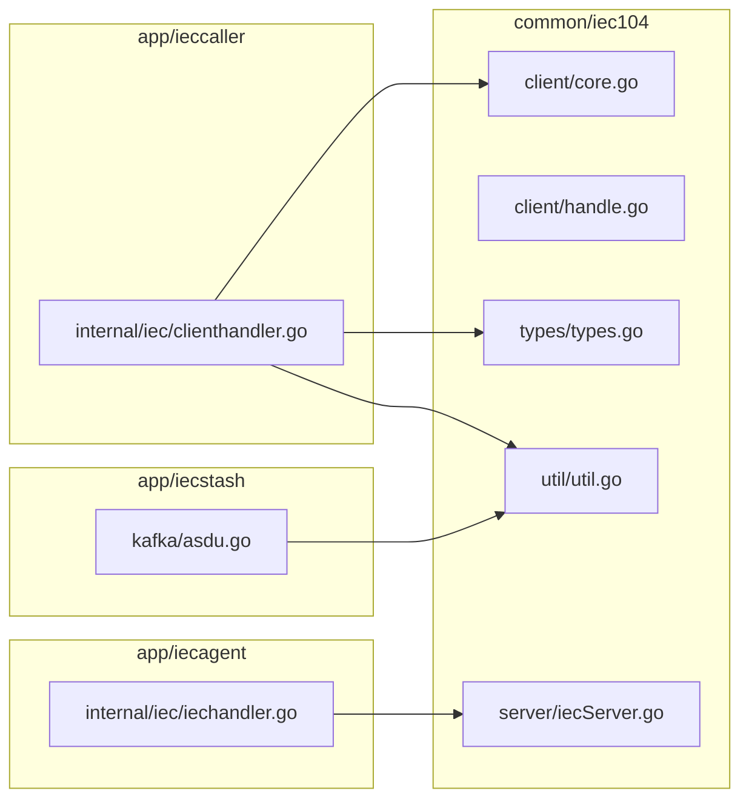

# IEC104 协议处理

<cite>
**本文引用的文件**
- [clientmanager.go](file://common/iec104/client/clientmanager.go)
- [core.go](file://common/iec104/client/core.go)
- [handle.go](file://common/iec104/client/handle.go)
- [interface.go](file://common/iec104/client/interface.go)
- [errors.go](file://common/iec104/client/errors.go)
- [log.go](file://common/iec104/log.go)
- [types.go](file://common/iec104/types/types.go)
- [util.go](file://common/iec104/util/util.go)
- [iecServer.go](file://common/iec104/server/iecServer.go)
- [handler.go](file://common/iec104/server/handler.go)
- [clienthandler.go](file://app/ieccaller/internal/iec/clienthandler.go)
- [iechandler.go](file://app/iecagent/internal/iec/iechandler.go)
- [asdu.go](file://app/iecstash/kafka/asdu.go)
- [ieccaller.yaml](file://app/ieccaller/etc/ieccaller.yaml)
- [iecagent.yaml](file://app/iecagent/etc/iecagent.yaml)
- [iecstash.yaml](file://app/iecstash/etc/iecstash.yaml)
</cite>

## 目录
1. [引言](#引言)
2. [项目结构](#项目结构)
3. [核心组件](#核心组件)
4. [架构总览](#架构总览)
5. [详细组件分析](#详细组件分析)
6. [依赖关系分析](#依赖关系分析)
7. [性能考虑](#性能考虑)
8. [故障排查指南](#故障排查指南)
9. [结论](#结论)
10. [附录](#附录)

## 引言
本技术文档围绕 IEC104 协议处理组件展开，系统性阐述协议实现原理、ASDU 解析与数据编码、通信流程、客户端管理器设计、协议核心组件实现细节、配置参数与调优、性能监控方法，并给出与数采平台集成模式及故障处理策略。读者可据此快速理解并部署 IEC104 客户端与服务器端，完成与远端 SCADA/保护装置的稳定通信。

## 项目结构
IEC104 相关代码主要分布在以下模块：
- common/iec104：协议核心、类型定义、工具函数、日志桥接
- app/ieccaller：IEC104 客户端侧应用，负责连接远端服务器、解析 ASDU 并推送至下游
- app/iecagent：IEC104 服务器侧应用，模拟设备响应各类命令
- app/iecstash：接收并落盘/转发 IEC104 报文的应用



**图表来源**
- [core.go:1-446](file://common/iec104/client/core.go#L1-L446)
- [handle.go:1-155](file://common/iec104/client/handle.go#L1-L155)
- [interface.go:1-71](file://common/iec104/client/interface.go#L1-L71)
- [clientmanager.go:1-145](file://common/iec104/client/clientmanager.go#L1-L145)
- [iecServer.go:1-38](file://common/iec104/server/iecServer.go#L1-L38)
- [handler.go:1-60](file://common/iec104/server/handler.go#L1-L60)
- [types.go:1-323](file://common/iec104/types/types.go#L1-L323)
- [util.go:1-242](file://common/iec104/util/util.go#L1-L242)
- [log.go:1-49](file://common/iec104/log.go#L1-L49)
- [clienthandler.go:1-541](file://app/ieccaller/internal/iec/clienthandler.go#L1-L541)
- [iechandler.go:1-124](file://app/iecagent/internal/iec/iechandler.go#L1-L124)
- [asdu.go:1-25](file://app/iecstash/kafka/asdu.go#L1-L25)

**章节来源**
- [core.go:1-446](file://common/iec104/client/core.go#L1-L446)
- [clientmanager.go:1-145](file://common/iec104/client/clientmanager.go#L1-L145)
- [types.go:1-323](file://common/iec104/types/types.go#L1-L323)
- [util.go:1-242](file://common/iec104/util/util.go#L1-L242)
- [log.go:1-49](file://common/iec104/log.go#L1-L49)
- [iecServer.go:1-38](file://common/iec104/server/iecServer.go#L1-L38)
- [handler.go:1-60](file://common/iec104/server/handler.go#L1-L60)
- [clienthandler.go:1-541](file://app/ieccaller/internal/iec/clienthandler.go#L1-L541)
- [iechandler.go:1-124](file://app/iecagent/internal/iec/iechandler.go#L1-L124)
- [asdu.go:1-25](file://app/iecstash/kafka/asdu.go#L1-L25)

## 核心组件
- 客户端核心 Client：封装 cs104 客户端，负责连接、自动重连、命令发送、事件回调、日志桥接与指标统计。
- 客户端处理器 ClientHandler：将底层回调映射到上层 ASDU 回调接口，统一记录耗时指标。
- 客户端管理器 ClientManager：集中注册/注销/查询 IEC104 客户端，提供统计与健康检查。
- 服务器端 IecServer：基于 cs104 服务器，监听端口，处理来自客户端的命令请求。
- 类型与工具 types/util：定义报文结构、点模型、质量位解析、主题模板生成等。
- 日志桥接：将 cs104 日志接入 go-zero 日志体系，便于统一采集与检索。

**章节来源**
- [core.go:19-117](file://common/iec104/client/core.go#L19-L117)
- [handle.go:34-109](file://common/iec104/client/handle.go#L34-L109)
- [clientmanager.go:11-47](file://common/iec104/client/clientmanager.go#L11-L47)
- [iecServer.go:12-37](file://common/iec104/server/iecServer.go#L12-L37)
- [types.go:11-58](file://common/iec104/types/types.go#L11-L58)
- [util.go:13-93](file://common/iec104/util/util.go#L13-L93)
- [log.go:8-49](file://common/iec104/log.go#L8-L49)

## 架构总览
IEC104 客户端-服务器双向通信模型如下：



**图表来源**
- [core.go:119-147](file://common/iec104/client/core.go#L119-L147)
- [clienthandler.go:94-140](file://app/ieccaller/internal/iec/clienthandler.go#L94-L140)
- [iechandler.go:25-123](file://app/iecagent/internal/iec/iechandler.go#L25-L123)
- [asdu.go:20-24](file://app/iecstash/kafka/asdu.go#L20-L24)

## 详细组件分析

### 客户端管理器 ClientManager
- 职责：集中管理多个 IEC104 客户端实例，提供注册、注销、查询、遍历与统计。
- 关键能力：
  - 注册/注销：以 host:port 为键，避免重复注册。
  - 查询：按 host/port 获取客户端；提供安全版本返回 nil。
  - 统计：每分钟打印连接状态统计，便于运维观察。
  - 并发：读写锁保证并发安全；内部通道异步监听注册请求。



**图表来源**
- [clientmanager.go:11-145](file://common/iec104/client/clientmanager.go#L11-L145)

**章节来源**
- [clientmanager.go:17-145](file://common/iec104/client/clientmanager.go#L17-L145)

### 客户端 Client 与命令发送
- 配置校验：Host 必填，Port 合法范围。
- 连接与事件：自动重连、断开事件、服务器主动激活事件。
- 命令发送：封装多种命令（总召唤、计数器召唤、时钟同步、读定值、复位进程、测试命令、各类控制命令），统一走 doSend，内部根据 TypeID 分派。
- 日志与指标：启用 cs104 日志桥接，记录连接事件；处理器对每类回调统计耗时。

```mermaid
flowchart TD
Start(["发送命令入口"]) --> CheckConn{"已连接?"}
CheckConn --> |否| Err["返回 NotConnected 错误"]
CheckConn --> |是| BuildCoa["构建激活COA"]
BuildCoa --> SwitchType{"TypeID 分支"}
SwitchType --> |总召唤| IC["InterrogationCmd"]
SwitchType --> |计数器| CI["CounterInterrogationCmd"]
SwitchType --> |时钟同步| CS["ClockSynchronizationCmd"]
SwitchType --> |读定值| RD["ReadCmd"]
SwitchType --> |复位进程| RP["ResetProcessCmd"]
SwitchType --> |测试| TS["TestCommand"]
SwitchType --> |单命令| SC["SingleCmd"]
SwitchType --> |双命令| DC["DoubleCmd"]
SwitchType --> |步命令| RC["StepCmd"]
SwitchType --> |设定值(Normal/Scaled/Float)| SE["SetpointCmd*"]
SwitchType --> |位串| BO["BitsString32Cmd"]
IC --> Done(["完成"])
CI --> Done
CS --> Done
RD --> Done
RP --> Done
TS --> Done
SC --> Done
DC --> Done
RC --> Done
SE --> Done
BO --> Done
Err --> End(["结束"])
Done --> End
```

**图表来源**
- [core.go:304-436](file://common/iec104/client/core.go#L304-L436)

**章节来源**
- [core.go:19-117](file://common/iec104/client/core.go#L19-L117)
- [core.go:119-147](file://common/iec104/client/core.go#L119-L147)
- [core.go:182-231](file://common/iec104/client/core.go#L182-L231)
- [core.go:304-436](file://common/iec104/client/core.go#L304-L436)
- [errors.go:5-8](file://common/iec104/client/errors.go#L5-L8)

### 客户端回调处理器 ClientHandler
- 将底层回调映射到上层 ASDUCall 接口，统一记录耗时指标。
- 支持的回调类型：总召唤、计数器、读定值、测试、时钟同步、进程重置、延迟获取、通用 ASDU 上报。



**图表来源**
- [handle.go:34-109](file://common/iec104/client/handle.go#L34-L109)
- [interface.go:5-23](file://common/iec104/client/interface.go#L5-L23)

**章节来源**
- [handle.go:34-155](file://common/iec104/client/handle.go#L34-L155)
- [interface.go:5-71](file://common/iec104/client/interface.go#L5-L71)

### 服务器端 IecServer 与命令处理
- 服务器端基于 cs104.NewServer，设置参数与日志，绑定地址启动监听。
- 服务器回调接口 ServerHandler 将命令请求转交给业务 CommandHandler 实现。



**图表来源**
- [iecServer.go:17-37](file://common/iec104/server/iecServer.go#L17-L37)
- [handler.go:16-60](file://common/iec104/server/handler.go#L16-L60)

**章节来源**
- [iecServer.go:12-37](file://common/iec104/server/iecServer.go#L12-L37)
- [handler.go:8-60](file://common/iec104/server/handler.go#L8-L60)

### 类型与数据编码（ASDU 结构与质量位）
- MsgBody：统一报文载体，包含 host/port/typeId/dataType/coa/body/time/metaData/pm 等。
- PointMapping：设备与主题扩展字段映射，用于下游主题拆分与路由。
- 多种 ASDU 信息体结构：单点、双点、测量值（规一化/标度化/短浮点）、步位置、位串、累计量、保护设备事件等。
- 质量位工具：提供 QDS/QDP 的解析与字符串化，便于诊断与告警。



**图表来源**
- [types.go:11-58](file://common/iec104/types/types.go#L11-L58)
- [types.go:31-40](file://common/iec104/types/types.go#L31-L40)

**章节来源**
- [types.go:11-323](file://common/iec104/types/types.go#L11-L323)
- [util.go:13-93](file://common/iec104/util/util.go#L13-L93)

### 主题生成与质量位解析
- GenerateTopic：基于模板规则生成 MQTT 主题，包含校验（占位符解析、非法字符、斜杠规范）。
- 质量位工具：Qds/Qdp 的位运算与描述字符串化，支持溢出、封锁、替代、非实时、无效等标志。

**章节来源**
- [util.go:197-242](file://common/iec104/util/util.go#L197-L242)
- [util.go:13-93](file://common/iec104/util/util.go#L13-L93)

### 日志桥接与指标统计
- 日志桥接：将 cs104 日志接入 go-zero Logger，支持上下文字段透传。
- 指标统计：ClientHandler 对每类回调使用 stat.Metrics 记录耗时，便于性能观测。

**章节来源**
- [log.go:8-49](file://common/iec104/log.go#L8-L49)
- [handle.go:40-108](file://common/iec104/client/handle.go#L40-L108)

### 应用集成与工作流

#### 客户端应用（ieccaller）
- 通过 ClientCall 实现 ASDUCall 接口，解析各类 ASDU 并推送至下游（MQTT/Kafka/数据库等）。
- 支持任务并发调度（TaskRunner），按 TypeID 分派处理逻辑。
- 配置项：IecServerConfig（Host/Port/IcCoaList/CcCoaList/MetaData/LogEnable/TaskConcurrency）、KafkaConfig、MqttConfig、StreamEventConf 等。



**图表来源**
- [clienthandler.go:94-140](file://app/ieccaller/internal/iec/clienthandler.go#L94-L140)
- [clienthandler.go:142-541](file://app/ieccaller/internal/iec/clienthandler.go#L142-L541)
- [ieccaller.yaml:22-79](file://app/ieccaller/etc/ieccaller.yaml#L22-L79)

**章节来源**
- [clienthandler.go:21-44](file://app/ieccaller/internal/iec/clienthandler.go#L21-L44)
- [clienthandler.go:94-140](file://app/ieccaller/internal/iec/clienthandler.go#L94-L140)
- [clienthandler.go:142-541](file://app/ieccaller/internal/iec/clienthandler.go#L142-L541)
- [ieccaller.yaml:22-79](file://app/ieccaller/etc/ieccaller.yaml#L22-L79)

#### 服务器应用（iecagent）
- 模拟设备侧响应：总召唤、计数器、读定值、时钟同步、进程重置、延迟获取、控制命令等。
- 通过 asdu.* 方法构造各类 ASDU/命令帧并发送。

**章节来源**
- [iechandler.go:25-123](file://app/iecagent/internal/iec/iechandler.go#L25-L123)
- [iecagent.yaml:10-14](file://app/iecagent/etc/iecagent.yaml#L10-L14)

#### 数据落盘/转发（iecstash）
- 从 Kafka 消费 ASDU 文本，写入本地缓冲或转发到下游。

**章节来源**
- [asdu.go:20-24](file://app/iecstash/kafka/asdu.go#L20-L24)
- [iecstash.yaml:18-46](file://app/iecstash/etc/iecstash.yaml#L18-L46)

## 依赖关系分析
- 内部依赖
  - common/iec104/client 依赖 github.com/wendy512/go-iecp5/cs104 与 asdu。
  - app/ieccaller 依赖 common/iec104/types/util 与 go-zero 组件。
  - app/iecagent 依赖 asdu 库与 go-zero 日志。
  - app/iecstash 依赖 go-zero 与 Kafka 客户端。
- 外部依赖
  - cs104：IEC104 协议栈实现。
  - asdu：IEC101/104 ASDU 数据模型与序列化。
  - go-zero：日志、指标、并发任务、配置加载等基础设施。



**图表来源**
- [core.go:1-17](file://common/iec104/client/core.go#L1-L17)
- [handle.go:1-7](file://common/iec104/client/handle.go#L1-L7)
- [types.go:1-9](file://common/iec104/types/types.go#L1-L9)
- [util.go:1-11](file://common/iec104/util/util.go#L1-L11)
- [iecServer.go:1-10](file://common/iec104/server/iecServer.go#L1-L10)
- [clienthandler.go:1-19](file://app/ieccaller/internal/iec/clienthandler.go#L1-L19)
- [iechandler.go:1-10](file://app/iecagent/internal/iec/iechandler.go#L1-L10)
- [asdu.go:1-8](file://app/iecstash/kafka/asdu.go#L1-L8)

**章节来源**
- [core.go:1-17](file://common/iec104/client/core.go#L1-L17)
- [clienthandler.go:1-19](file://app/ieccaller/internal/iec/clienthandler.go#L1-L19)
- [iechandler.go:1-10](file://app/iecagent/internal/iec/iechandler.go#L1-L10)
- [asdu.go:1-8](file://app/iecstash/kafka/asdu.go#L1-L8)

## 性能考虑
- 并发与限速
  - 客户端回调使用 TaskRunner 控制并发度，避免下游拥塞。
  - 客户端管理器统计连接状态，便于容量规划。
- 指标与可观测性
  - 回调耗时指标记录，结合日志定位慢路径。
  - 客户端管理器每分钟统计，辅助运维监控。
- 网络与序列化
  - 建议使用 TCP 无阻塞与合适的 SO_TIMEOUT，减少握手抖动。
  - 主题模板解析失败即刻返回，避免无效消息进入下游。
- 存储与转发
  - iecstash 的 Kafka 消费并发与批大小可根据 CPU/磁盘/网络调优。

[本节为通用指导，无需特定文件来源]

## 故障排查指南
- 常见错误
  - 未连接发送命令：检查 IsConnected 与连接事件回调，必要时启用自动重连。
  - 主题模板解析失败：检查模板中未解析占位符、非法字符、斜杠规范。
  - 质量位异常：利用 Qds/Qdp 工具函数判断溢出、封锁、无效等标志。
- 日志与诊断
  - 启用 cs104 日志桥接，结合连接事件与回调耗时定位问题。
  - 使用客户端管理器统计观察连接波动。
- 建议流程
  - 端到端抓包验证帧序与参数。
  - 逐步缩小范围：先验证服务器可达与参数，再验证客户端回调与下游推送。

**章节来源**
- [errors.go:5-8](file://common/iec104/client/errors.go#L5-L8)
- [util.go:197-242](file://common/iec104/util/util.go#L197-L242)
- [log.go:18-49](file://common/iec104/log.go#L18-L49)
- [clientmanager.go:117-144](file://common/iec104/client/clientmanager.go#L117-L144)

## 结论
该 IEC104 协议处理组件以清晰的分层设计实现了客户端与服务器端的完整链路：从配置与连接管理、命令发送与解析，到类型建模与质量位处理，再到日志与指标、应用集成与落盘转发。通过客户端管理器与回调处理器，系统具备良好的可扩展性与可观测性，适合在数采平台中大规模部署与运维。

[本节为总结，无需特定文件来源]

## 附录

### 协议配置参数与调优要点
- 客户端配置（ieccaller.yaml）
  - IecServerConfig：Host/Port、定时总召唤/计数器 COA 列表、MetaData、LogEnable、TaskConcurrency。
  - KafkaConfig：Brokers、Topic、BroadcastTopic、BroadcastGroupId。
  - MqttConfig：Broker、Username/Password、Qos、Topic 列表（含模板变量）、IsPush。
  - StreamEventConf：事件推送目标与超时。
  - PushAsduChunkBytes：批量推送字节数。
- 服务器配置（iecagent.yaml）
  - Host/Port、LogMode。
- 服务器端配置（iecstash.yaml）
  - KafkaASDUConfig：Name/Brokers/Topic/Group/Conns/Consumers/Processors/MinBytes/MaxBytes/CommitInOrder/Offset。
  - StreamEventConf、PushAsduChunkBytes、GracePeriod。

**章节来源**
- [ieccaller.yaml:22-79](file://app/ieccaller/etc/ieccaller.yaml#L22-L79)
- [iecagent.yaml:10-14](file://app/iecagent/etc/iecagent.yaml#L10-L14)
- [iecstash.yaml:18-46](file://app/iecstash/etc/iecstash.yaml#L18-L46)

### 通信参数调优建议
- 自动重连间隔：根据网络稳定性设置 ReconnectInterval，避免频繁抖动。
- 回调并发：TaskConcurrency 与下游吞吐匹配，防止积压。
- 主题模板：尽量减少动态变量层级，提升解析效率。
- Kafka 批大小：根据消息体积与网络带宽调整 MinBytes/MaxBytes。

[本节为通用指导，无需特定文件来源]

### 实际使用示例（步骤说明）
- 客户端侧（ieccaller）
  - 创建 ClientCall 并注入到客户端，设置 MetaData 与并发度。
  - 在 OnASDU 中按 TypeID 解析并推送至 MQTT/Kafka/数据库。
  - 参考路径：[clienthandler.go:30-44](file://app/ieccaller/internal/iec/clienthandler.go#L30-L44)、[clienthandler.go:94-140](file://app/ieccaller/internal/iec/clienthandler.go#L94-L140)、[clienthandler.go:142-541](file://app/ieccaller/internal/iec/clienthandler.go#L142-L541)
- 服务器侧（iecagent）
  - 实现 CommandHandler 接口，按需构造各类 ASDU/命令帧。
  - 参考路径：[iechandler.go:25-123](file://app/iecagent/internal/iec/iechandler.go#L25-L123)
- 数据落盘/转发（iecstash）
  - 从 Kafka 消费并写入本地缓冲或转发。
  - 参考路径：[asdu.go:20-24](file://app/iecstash/kafka/asdu.go#L20-L24)

**章节来源**
- [clienthandler.go:30-44](file://app/ieccaller/internal/iec/clienthandler.go#L30-L44)
- [clienthandler.go:94-140](file://app/ieccaller/internal/iec/clienthandler.go#L94-L140)
- [clienthandler.go:142-541](file://app/ieccaller/internal/iec/clienthandler.go#L142-L541)
- [iechandler.go:25-123](file://app/iecagent/internal/iec/iechandler.go#L25-L123)
- [asdu.go:20-24](file://app/iecstash/kafka/asdu.go#L20-L24)