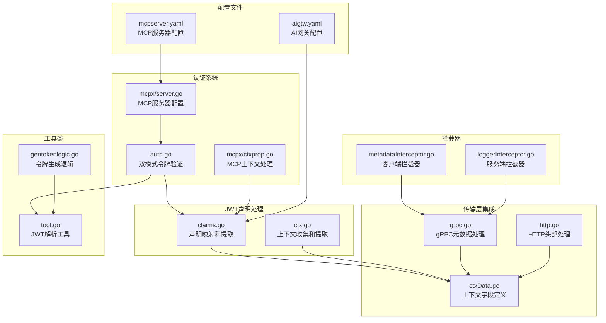
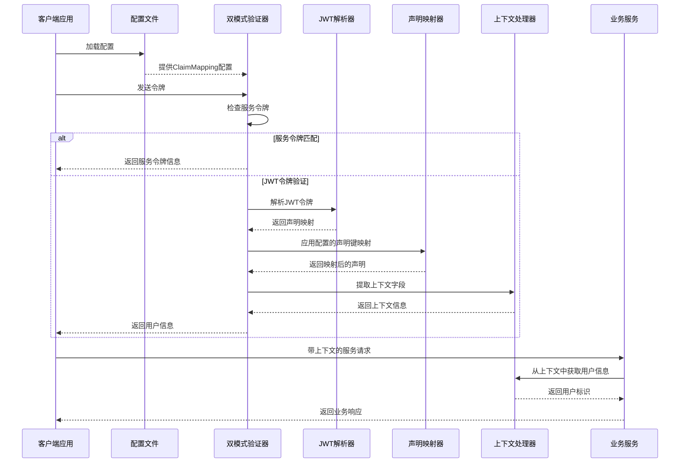
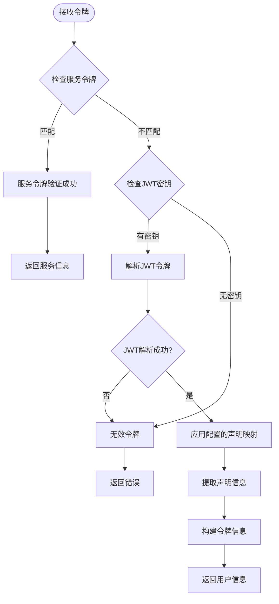
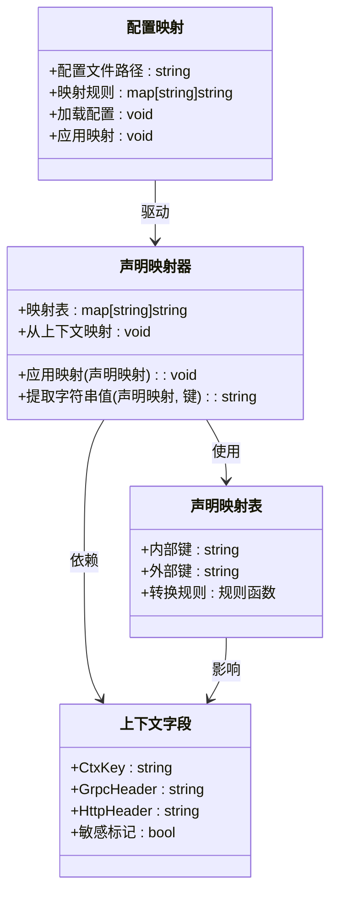
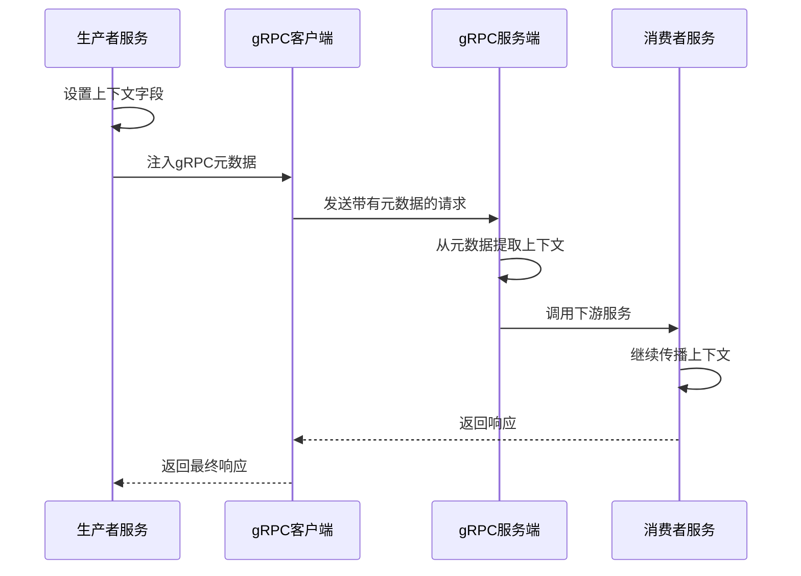
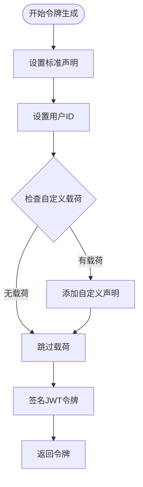
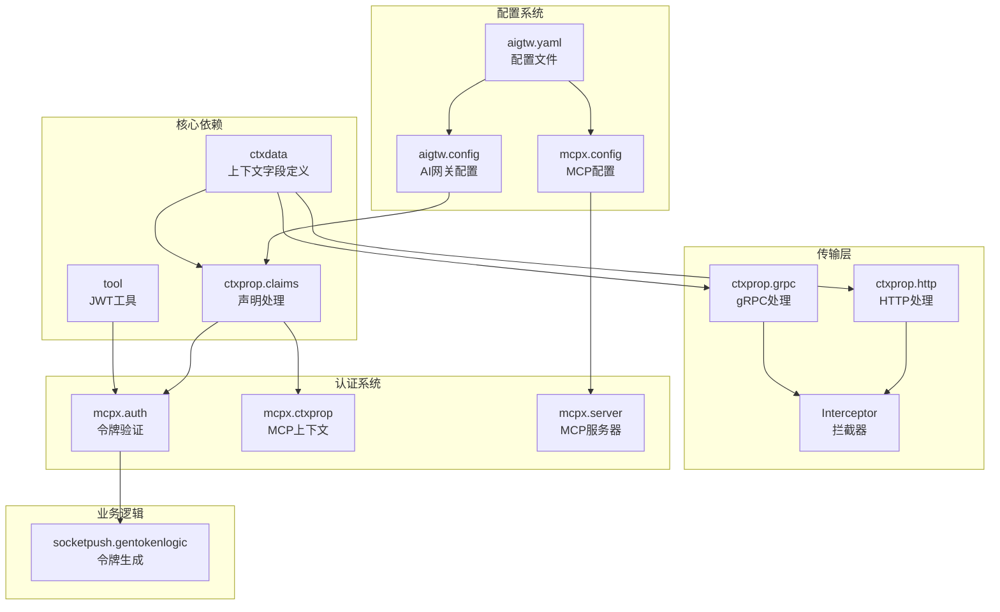

# JWT声明键映射系统

<cite>
**本文档引用的文件**
- [common/ctxprop/claims.go](file://common/ctxprop/claims.go)
- [common/ctxprop/ctx.go](file://common/ctxprop/ctx.go)
- [common/ctxprop/grpc.go](file://common/ctxprop/grpc.go)
- [common/ctxprop/http.go](file://common/ctxprop/http.go)
- [common/ctxdata/ctxData.go](file://common/ctxdata/ctxData.go)
- [common/mcpx/auth.go](file://common/mcpx/auth.go)
- [common/mcpx/ctxprop.go](file://common/mcpx/ctxprop.go)
- [common/mcpx/server.go](file://common/mcpx/server.go)
- [common/Interceptor/rpcclient/metadataInterceptor.go](file://common/Interceptor/rpcclient/metadataInterceptor.go)
- [common/Interceptor/rpcserver/loggerInterceptor.go](file://common/Interceptor/rpcserver/loggerInterceptor.go)
- [common/tool/tool.go](file://common/tool/tool.go)
- [socketapp/socketpush/internal/logic/gentokenlogic.go](file://socketapp/socketpush/internal/logic/gentokenlogic.go)
- [aiapp/aigtw/etc/aigtw.yaml](file://aiapp/aigtw/etc/aigtw.yaml)
- [aiapp/mcpserver/etc/mcpserver.yaml](file://aiapp/mcpserver/etc/mcpserver.yaml)
- [aiapp/aigtw/aigtw.go](file://aiapp/aigtw/aigtw.go)
- [aiapp/mcpserver/mcpserver.go](file://aiapp/mcpserver/mcpserver.go)
- [aiapp/aigtw/internal/config/config.go](file://aiapp/aigtw/internal/config/config.go)
- [common/mcpx/config.go](file://common/mcpx/config.go)
</cite>

## 更新摘要
**所做更改**
- 新增配置文件支持章节，详细说明aigtw.yaml和mcpserver.yaml中的ClaimMapping配置
- 更新架构概览图，展示配置驱动的声明键映射流程
- 新增配置加载和使用章节，说明配置文件如何影响声明映射行为
- 更新故障排除指南，包含配置相关的问题诊断

## 目录
1. [简介](#简介)
2. [项目结构](#项目结构)
3. [核心组件](#核心组件)
4. [配置文件支持](#配置文件支持)
5. [架构概览](#架构概览)
6. [详细组件分析](#详细组件分析)
7. [配置加载和使用](#配置加载和使用)
8. [依赖关系分析](#依赖关系分析)
9. [性能考虑](#性能考虑)
10. [故障排除指南](#故障排除指南)
11. [结论](#结论)

## 简介

JWT声明键映射系统是Zero Service微服务架构中的关键组件，负责处理JWT令牌的声明键转换、上下文传递和跨服务身份验证。该系统提供了灵活的声明键映射机制，支持外部JWT声明键与内部标准键之间的双向转换，确保不同服务间的一致性和兼容性。

系统的核心功能包括：
- 外部JWT声明键到内部标准键的映射
- 上下文字段在gRPC和HTTP传输层间的自动传播
- 双模式令牌验证器（服务令牌和JWT令牌）
- 标准化用户身份信息提取和处理
- **新增：配置驱动的声明键映射支持**

## 项目结构

JWT声明键映射系统主要分布在以下目录中：



**图表来源**
- [common/ctxprop/claims.go:1-68](file://common/ctxprop/claims.go#L1-L68)
- [common/ctxdata/ctxData.go:1-74](file://common/ctxdata/ctxData.go#L1-L74)
- [common/mcpx/auth.go:1-80](file://common/mcpx/auth.go#L1-L80)
- [aiapp/aigtw/etc/aigtw.yaml:14-18](file://aiapp/aigtw/etc/aigtw.yaml#L14-L18)
- [aiapp/mcpserver/etc/mcpserver.yaml:19-23](file://aiapp/mcpserver/etc/mcpserver.yaml#L19-L23)

**章节来源**
- [common/ctxprop/claims.go:1-68](file://common/ctxprop/claims.go#L1-L68)
- [common/ctxdata/ctxData.go:1-74](file://common/ctxdata/ctxData.go#L1-L74)
- [common/mcpx/auth.go:1-80](file://common/mcpx/auth.go#L1-L80)
- [aiapp/aigtw/etc/aigtw.yaml:14-18](file://aiapp/aigtw/etc/aigtw.yaml#L14-L18)
- [aiapp/mcpserver/etc/mcpserver.yaml:19-23](file://aiapp/mcpserver/etc/mcpserver.yaml#L19-L23)

## 核心组件

### 上下文字段定义系统

系统通过统一的上下文字段定义确保跨服务的一致性：

| 字段名称 | 内部键 | gRPC头 | HTTP头 | 敏感信息 |
|---------|--------|--------|--------|----------|
| 用户ID | user-id | x-user-id | X-User-Id | 否 |
| 用户名 | user-name | x-user-name | X-User-Name | 否 |
| 部门代码 | dept-code | x-dept-code | X-Dept-Code | 否 |
| 授权令牌 | authorization | authorization | Authorization | 是 |
| 追踪ID | trace-id | x-trace-id | X-Trace-Id | 否 |

### 声明映射处理器

提供双向声明键映射功能，支持外部JWT声明键与内部标准键之间的转换。

**章节来源**
- [common/ctxprop/claims.go:25-48](file://common/ctxprop/claims.go#L25-L48)
- [common/ctxdata/ctxData.go:30-38](file://common/ctxdata/ctxData.go#L30-L38)

## 配置文件支持

### 配置文件结构

系统现已支持通过配置文件启用声明键映射功能，主要涉及两个配置文件：

#### AI网关配置 (aigtw.yaml)

```yaml
JwtAuth:
  AccessSecret: allcoreisapowerfulmicroservicearchitectureupgradedandoptimizedfromacommercialproject
  # ClaimMapping: 外部 JWT claim key -> 内部标准 key（按需配置）
  ClaimMapping:
    user-id: "user_id"
    user-name: "user_name"
    dept-code: "dept_code"
```

#### MCP服务器配置 (mcpserver.yaml)

```yaml
Auth:
  JwtSecrets:
    - "629c6233-1a76-471b-bd25-b87208762219"
  ServiceToken: "mcp-internal-service-token-2026"
  # ClaimMapping: 外部 JWT claim key -> 内部标准 key（按需配置）
  ClaimMapping:
    user-id: "user_id"
    user-name: "user_name"
    dept-code: "dept_code"
```

### 配置字段说明

| 配置项 | 类型 | 必需 | 描述 | 默认值 |
|--------|------|------|------|--------|
| JwtAuth.AccessSecret | string | 否 | JWT访问密钥 | 空字符串 |
| JwtAuth.ClaimMapping | map[string]string | 否 | 声明键映射配置 | 空映射 |
| Auth.JwtSecrets | []string | 否 | JWT密钥列表 | 空数组 |
| Auth.ServiceToken | string | 否 | 服务令牌 | 空字符串 |
| Auth.ClaimMapping | map[string]string | 否 | 声明键映射配置 | 空映射 |

### 配置映射规则

配置文件中的声明键映射遵循以下规则：
- **键值对格式**：`内部键: 外部键`
- **映射方向**：从外部JWT声明键映射到内部标准键
- **支持的数据类型**：字符串映射，键和值均为字符串类型

**章节来源**
- [aiapp/aigtw/etc/aigtw.yaml:12-18](file://aiapp/aigtw/etc/aigtw.yaml#L12-L18)
- [aiapp/mcpserver/etc/mcpserver.yaml:14-23](file://aiapp/mcpserver/etc/mcpserver.yaml#L14-L23)

## 架构概览

JWT声明键映射系统采用分层架构设计，确保声明处理、上下文传递和认证验证的分离。**新增配置驱动的声明键映射流程**：



**图表来源**
- [common/mcpx/auth.go:22-63](file://common/mcpx/auth.go#L22-L63)
- [common/ctxprop/claims.go:28-48](file://common/ctxprop/claims.go#L28-L48)
- [aiapp/aigtw/aigtw.go:60-71](file://aiapp/aigtw/aigtw.go#L60-L71)

## 详细组件分析

### 双模式令牌验证器

双模式令牌验证器支持两种认证模式，提供安全且灵活的身份验证机制：



**图表来源**
- [common/mcpx/auth.go:22-63](file://common/mcpx/auth.go#L22-L63)

#### 关键特性

1. **常量时间比较**：使用`crypto/subtle`包进行服务令牌的安全比较
2. **多密钥支持**：支持多个JWT密钥进行令牌验证
3. **配置驱动映射**：自动处理配置文件中的声明键映射
4. **上下文注入**：将用户信息注入到上下文中供后续处理

**章节来源**
- [common/mcpx/auth.go:17-63](file://common/mcpx/auth.go#L17-L63)

### 声明键映射系统

声明键映射系统提供灵活的键转换机制，支持复杂的映射需求：



**图表来源**
- [common/ctxprop/claims.go:25-48](file://common/ctxprop/claims.go#L25-L48)
- [common/ctxdata/ctxData.go:22-28](file://common/ctxdata/ctxData.go#L22-L28)
- [aiapp/aigtw/etc/aigtw.yaml:14-18](file://aiapp/aigtw/etc/aigtw.yaml#L14-L18)

#### 映射策略

系统支持多种映射策略：

1. **直接映射**：简单的键到键转换
2. **类型转换**：处理不同的数据类型（如float64到string）
3. **上下文映射**：从上下文值到声明的转换
4. **配置驱动映射**：从配置文件加载的映射规则
5. **默认值处理**：为空值时的默认行为

**章节来源**
- [common/ctxprop/claims.go:50-68](file://common/ctxprop/claims.go#L50-L68)

### 上下文传播机制

系统实现了完整的上下文传播机制，确保用户身份信息在微服务间的正确传递：



**图表来源**
- [common/Interceptor/rpcclient/metadataInterceptor.go:11-19](file://common/Interceptor/rpcclient/metadataInterceptor.go#L11-L19)
- [common/Interceptor/rpcserver/loggerInterceptor.go:14-21](file://common/Interceptor/rpcserver/loggerInterceptor.go#L14-L21)

#### 传输层支持

系统支持多种传输层的上下文传播：

1. **gRPC元数据**：通过`metadata.MD`传递上下文字段
2. **HTTP头部**：通过标准HTTP头部传递用户信息
3. **MCP协议**：支持Model Context Protocol的消息传递

**章节来源**
- [common/ctxprop/grpc.go:11-34](file://common/ctxprop/grpc.go#L11-L34)
- [common/ctxprop/http.go:10-32](file://common/ctxprop/http.go#L10-L32)

### JWT令牌生成系统

令牌生成系统提供了标准化的JWT令牌创建功能：



**图表来源**
- [socketapp/socketpush/internal/logic/gentokenlogic.go:57-78](file://socketapp/socketpush/internal/logic/gentokenlogic.go#L57-L78)

#### 标准声明处理

系统自动处理JWT的标准声明：

| 声明类型 | 键名 | 说明 | 处理方式 |
|---------|------|------|----------|
| 签发时间 | iat | 令牌签发时间 | 自动设置为当前时间 |
| 过期时间 | exp | 令牌过期时间 | 基于访问过期时间计算 |
| 令牌ID | jti | 唯一令牌标识符 | 自动生成 |
| 主题 | sub | 令牌主题 | 可选配置 |
| 签发人 | iss | 令牌签发者 | 可选配置 |
| 不生效时间 | nbf | 令牌生效时间 | 可选配置 |
| 接收方 | aud | 令牌接收方 | 可选配置 |

**章节来源**
- [socketapp/socketpush/internal/logic/gentokenlogic.go:47-78](file://socketapp/socketpush/internal/logic/gentokenlogic.go#L47-L78)

## 配置加载和使用

### 配置文件加载机制

系统通过配置文件驱动声明键映射功能，主要涉及以下组件：

#### AI网关配置加载

AI网关通过以下方式加载和使用配置：

```go
// 从配置文件加载JWT认证配置
conf.MustLoad(*configFile, &c)

// 检查是否存在ClaimMapping配置
if len(c.JwtAuth.ClaimMapping) > 0 {
    claimMapping := c.JwtAuth.ClaimMapping
    server.Use(func(next http.HandlerFunc) http.HandlerFunc {
        return func(w http.ResponseWriter, r *http.Request) {
            ctx := ctxprop.ApplyClaimMappingToCtx(r.Context(), claimMapping)
            next(w, r.WithContext(ctx))
        }
    })
}
```

#### MCP服务器配置加载

MCP服务器通过以下方式加载和使用配置：

```go
// 创建带鉴权的MCP服务器
server := mcpx.NewMcpServer(c.McpServerConf)

// wrapAuth方法自动应用配置中的ClaimMapping
func (s *McpServer) wrapAuth(handler http.Handler) http.Handler {
    if len(s.conf.Auth.JwtSecrets) == 0 && s.conf.Auth.ServiceToken == "" {
        return handler
    }
    verifier := NewDualTokenVerifier(s.conf.Auth.JwtSecrets, s.conf.Auth.ServiceToken, s.conf.Auth.ClaimMapping)
    return auth.RequireBearerToken(verifier, nil)(handler)
}
```

### 配置映射实现

配置文件中的声明键映射通过以下步骤实现：

1. **配置解析**：从YAML文件解析ClaimMapping配置
2. **映射应用**：在令牌验证过程中应用声明键映射
3. **上下文注入**：将映射后的声明注入到上下文中

**章节来源**
- [aiapp/aigtw/aigtw.go:60-71](file://aiapp/aigtw/aigtw.go#L60-L71)
- [common/mcpx/server.go:115-122](file://common/mcpx/server.go#L115-L122)
- [aiapp/aigtw/etc/aigtw.yaml:14-18](file://aiapp/aigtw/etc/aigtw.yaml#L14-L18)
- [aiapp/mcpserver/etc/mcpserver.yaml:19-23](file://aiapp/mcpserver/etc/mcpserver.yaml#L19-L23)

## 依赖关系分析

JWT声明键映射系统的依赖关系呈现清晰的层次结构：



**图表来源**
- [common/ctxdata/ctxData.go:1-74](file://common/ctxdata/ctxData.go#L1-L74)
- [common/tool/tool.go:35-65](file://common/tool/tool.go#L35-L65)
- [aiapp/aigtw/internal/config/config.go:20-28](file://aiapp/aigtw/internal/config/config.go#L20-L28)
- [common/mcpx/config.go:11-22](file://common/mcpx/config.go#L11-L22)

### 关键依赖链

1. **上下文定义依赖**：所有声明处理都依赖于统一的上下文字段定义
2. **工具类依赖**：认证系统依赖JWT解析工具进行令牌验证
3. **拦截器依赖**：传输层依赖上下文传播机制
4. **配置依赖**：业务逻辑依赖配置文件中的声明键映射规则
5. **业务逻辑依赖**：令牌生成依赖认证工具和上下文定义

**章节来源**
- [common/mcpx/auth.go:9-15](file://common/mcpx/auth.go#L9-L15)
- [common/Interceptor/rpcclient/metadataInterceptor.go:6](file://common/Interceptor/rpcclient/metadataInterceptor.go#L6)
- [aiapp/aigtw/aigtw.go:38-39](file://aiapp/aigtw/aigtw.go#L38-L39)

## 性能考虑

### 内存优化策略

1. **声明映射缓存**：对于频繁使用的映射规则，可以考虑缓存映射结果
2. **上下文字段复用**：重用已分配的上下文字段，避免重复分配
3. **令牌解析优化**：使用连接池减少JWT解析的开销
4. **配置缓存**：缓存已解析的配置映射规则，避免重复解析

### 并发安全性

系统在设计时充分考虑了并发安全性：

1. **无锁数据结构**：使用只读的映射表，避免并发修改
2. **不可变声明**：声明映射一旦创建就不再修改
3. **线程安全的上下文**：使用Go的内置线程安全机制
4. **配置只读访问**：配置文件解析后作为只读数据使用

### 性能监控

建议实施以下性能监控指标：

1. **令牌验证延迟**：监控JWT解析和验证的时间
2. **上下文传播延迟**：监控gRPC和HTTP请求的上下文处理时间
3. **内存使用情况**：监控声明映射和上下文的内存占用
4. **配置加载时间**：监控配置文件解析和应用的时间

## 故障排除指南

### 常见问题诊断

#### 令牌验证失败

**症状**：用户无法通过JWT认证，返回无效令牌错误

**可能原因**：
1. JWT密钥配置错误
2. 令牌格式不正确
3. 令牌已过期
4. 声明映射配置错误

**解决方案**：
1. 检查JWT密钥配置
2. 验证令牌格式和签名
3. 确认令牌时间戳有效性
4. 验证声明映射规则

#### 上下文字段丢失

**症状**：用户身份信息在服务调用过程中丢失

**可能原因**：
1. gRPC拦截器未正确配置
2. HTTP头部未正确传递
3. 上下文字段定义不一致

**解决方案**：
1. 检查gRPC客户端和服务端拦截器配置
2. 验证HTTP头部处理逻辑
3. 确认上下文字段定义的一致性

#### 声明键映射错误

**症状**：用户信息提取失败或提取到错误的数据

**可能原因**：
1. 声明键映射规则配置错误
2. 数据类型转换问题
3. 声明键名称不匹配

**解决方案**：
1. 检查声明键映射规则
2. 验证数据类型转换逻辑
3. 确认声明键名称的大小写和格式

#### 配置文件加载失败

**症状**：声明键映射功能无法正常工作

**可能原因**：
1. 配置文件路径错误
2. YAML语法错误
3. 配置字段类型不匹配

**解决方案**：
1. 检查配置文件路径和权限
2. 验证YAML语法格式
3. 确认配置字段的数据类型正确

#### 配置映射不生效

**症状**：配置文件中的声明键映射规则未被应用

**可能原因**：
1. 配置文件未正确加载
2. 声明键映射逻辑错误
3. 上下文传播机制问题

**解决方案**：
1. 检查配置文件加载日志
2. 验证声明键映射函数的实现
3. 确认上下文传播机制正常工作

**章节来源**
- [common/mcpx/auth.go:35-39](file://common/mcpx/auth.go#L35-L39)
- [common/ctxprop/claims.go:50-68](file://common/ctxprop/claims.go#L50-L68)
- [aiapp/aigtw/aigtw.go:60-71](file://aiapp/aigtw/aigtw.go#L60-L71)

## 结论

JWT声明键映射系统通过其模块化设计和清晰的职责分离，为Zero Service微服务架构提供了强大而灵活的身份验证和上下文管理能力。**新增的配置文件支持进一步增强了系统的灵活性和可维护性**。

系统的主要优势包括：

1. **灵活性**：支持外部声明键到内部标准键的双向映射
2. **一致性**：通过统一的上下文字段定义确保跨服务的一致性
3. **安全性**：提供双模式认证机制，支持服务令牌和JWT令牌
4. **可扩展性**：模块化的架构设计便于功能扩展和维护
5. **配置驱动**：通过配置文件实现声明键映射的灵活配置和管理

**新增特性总结**：
- 配置文件驱动的声明键映射支持
- 动态配置加载和应用机制
- 支持AI网关和MCP服务器的声明键映射
- 灵活的映射规则配置选项

该系统为微服务环境下的身份验证和上下文传播提供了最佳实践，是构建现代分布式系统的重要基础设施组件。配置文件的支持使得系统更加易于部署和维护，同时保持了高度的灵活性和可扩展性。