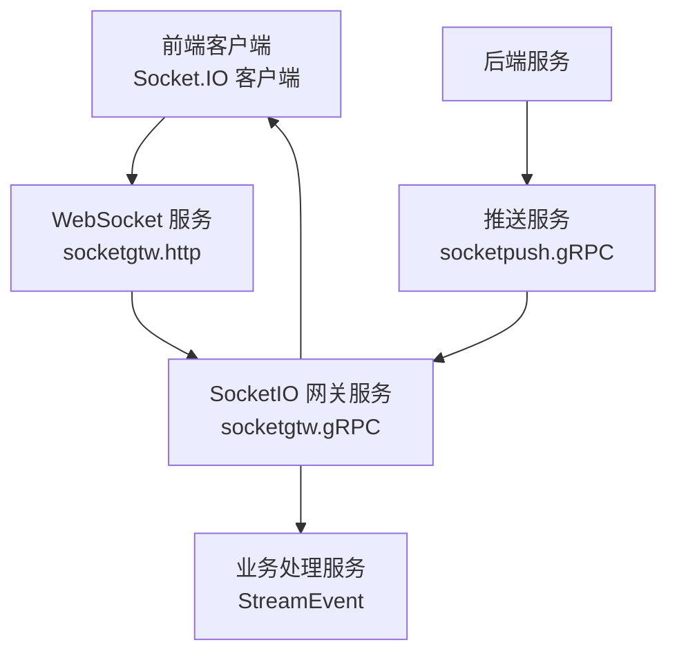
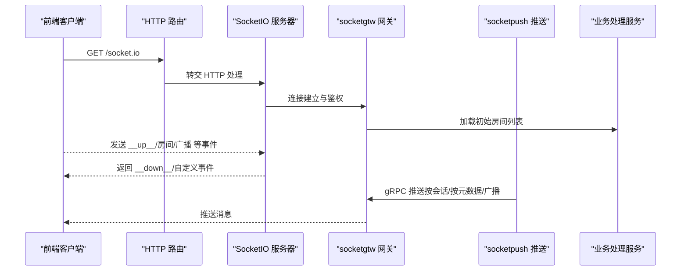
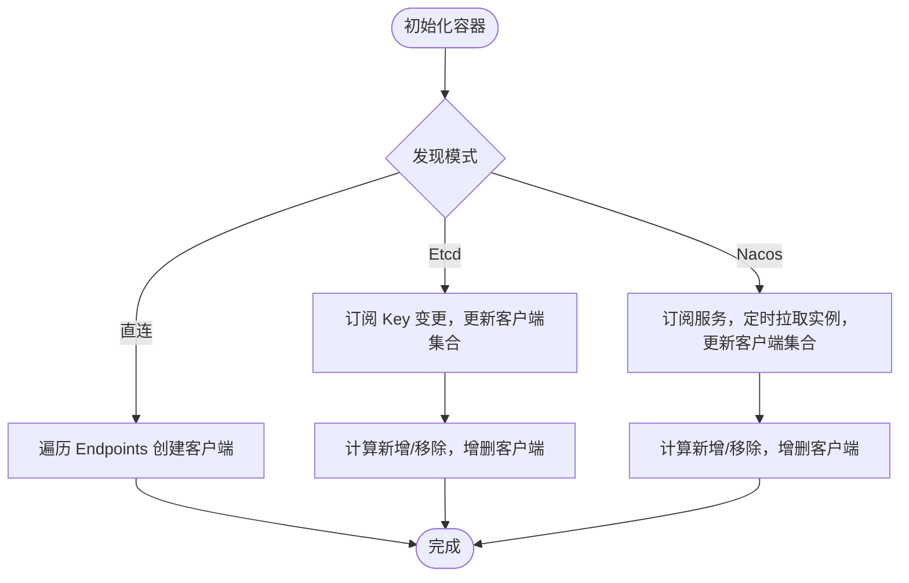
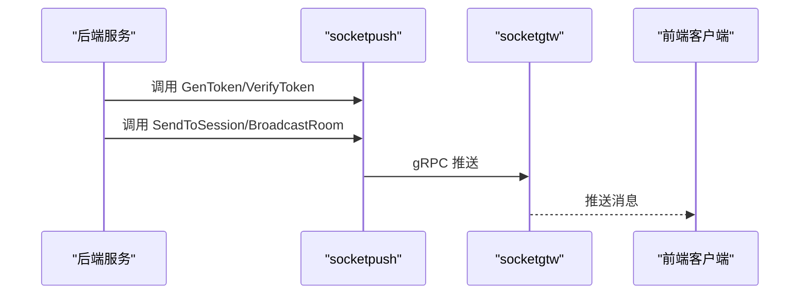
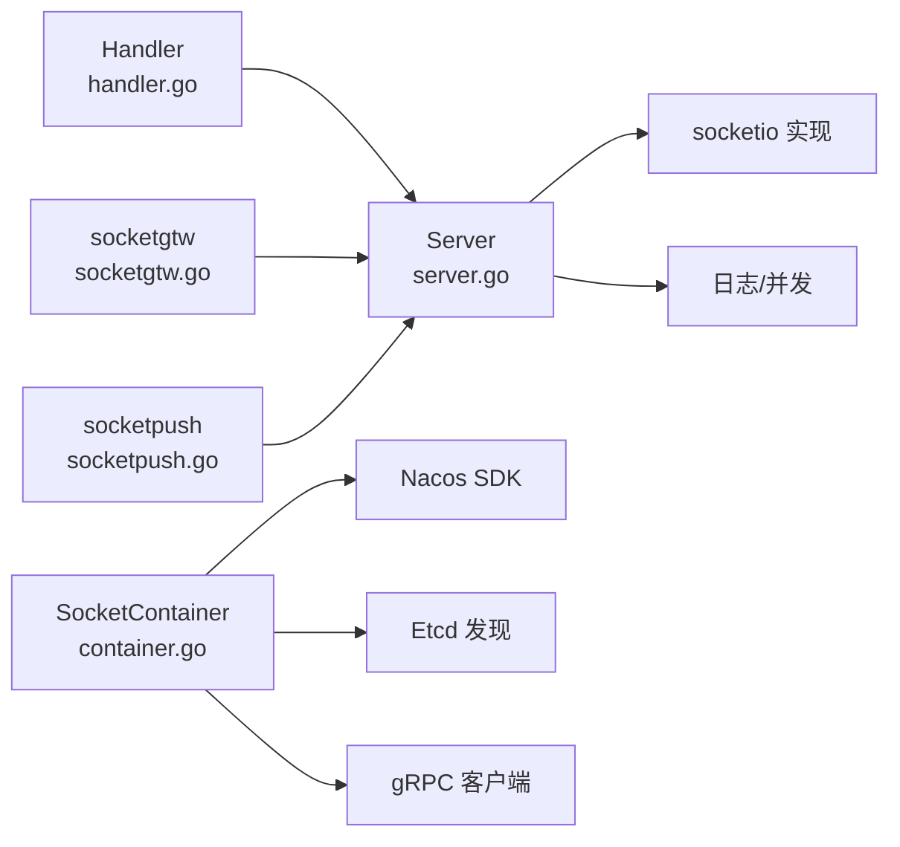

# SocketIO 集成 (socketiox)

<cite>
**本文引用的文件**
- [common/socketiox/server.go](file://common/socketiox/server.go)
- [common/socketiox/handler.go](file://common/socketiox/handler.go)
- [common/socketiox/container.go](file://common/socketiox/container.go)
- [common/socketiox/test-socketio.html](file://common/socketiox/test-socketio.html)
- [socketapp/socketgtw/socketgtw.proto](file://socketapp/socketgtw/socketgtw.proto)
- [socketapp/socketpush/socketpush.proto](file://socketapp/socketpush/socketpush.proto)
- [socketapp/socketgtw/etc/socketgtw.yaml](file://socketapp/socketgtw/etc/socketgtw.yaml)
- [socketapp/socketpush/etc/socketpush.yaml](file://socketapp/socketpush/etc/socketpush.yaml)
- [socketapp/socketgtw/socketgtw.go](file://socketapp/socketgtw/socketgtw.go)
- [socketapp/socketpush/socketpush.go](file://socketapp/socketpush/socketpush.go)
- [docs/socketiox-documentation.md](file://docs/socketiox-documentation.md)
</cite>

## 目录
1. [简介](#简介)
2. [项目结构](#项目结构)
3. [核心组件](#核心组件)
4. [架构总览](#架构总览)
5. [详细组件分析](#详细组件分析)
6. [依赖关系分析](#依赖关系分析)
7. [性能考量](#性能考量)
8. [故障排查指南](#故障排查指南)
9. [结论](#结论)
10. [附录](#附录)

## 简介
本技术文档面向 SocketIO 集成组件（socketiox），系统性阐述其在微服务架构中的实现与集成方式，覆盖连接管理、房间管理、消息路由、容器化设计模式（会话容器、连接池与资源分配）、处理器组件（事件处理、消息分发、状态同步）、与微服务的对接（服务发现、负载均衡、故障转移）。同时提供配置参数、性能调优与监控指标使用指南，并给出实际使用示例与最佳实践。

## 项目结构
socketiox 相关代码位于 common/socketiox，配套的 socketgtw 与 socketpush 服务位于 socketapp/socketgtw 与 socketapp/socketpush，二者通过 gRPC 协议协同工作，形成“前端 WebSocket + 网关服务 + 推送服务”的三层架构。



图示来源
- [socketapp/socketgtw/socketgtw.go:30-91](file://socketapp/socketgtw/socketgtw.go#L30-L91)
- [socketapp/socketpush/socketpush.go:27-70](file://socketapp/socketpush/socketpush.go#L27-L70)
- [docs/socketiox-documentation.md:16-27](file://docs/socketiox-documentation.md#L16-L27)

章节来源
- [socketapp/socketgtw/socketgtw.go:30-91](file://socketapp/socketgtw/socketgtw.go#L30-L91)
- [socketapp/socketpush/socketpush.go:27-70](file://socketapp/socketpush/socketpush.go#L27-L70)
- [docs/socketiox-documentation.md:16-27](file://docs/socketiox-documentation.md#L16-L27)

## 核心组件
- SocketIO 服务器（Server）：负责连接生命周期、鉴权、事件绑定、房间管理、广播、状态统计与会话查询。
- 会话容器（SocketContainer）：负责动态维护 gRPC 客户端集合，支持直连、Etcd 与 Nacos 三种发现方式，自动增删连接并限制连接池规模。
- HTTP 处理器（Handler）：将 REST 路由映射到 SocketIO 服务器的 HTTP 处理器，暴露 /socket.io 接口。
- 网关与推送服务：socketgtw 提供 WebSocket + gRPC；socketpush 提供 Token 生成/校验与推送 API。

章节来源
- [common/socketiox/server.go:299-312](file://common/socketiox/server.go#L299-L312)
- [common/socketiox/container.go:30-33](file://common/socketiox/container.go#L30-L33)
- [common/socketiox/handler.go:19-40](file://common/socketiox/handler.go#L19-L40)
- [socketapp/socketgtw/socketgtw.proto:9-32](file://socketapp/socketgtw/socketgtw.proto#L9-L32)
- [socketapp/socketpush/socketpush.proto:9-36](file://socketapp/socketpush/socketpush.proto#L9-L36)

## 架构总览
SocketIO 集成采用“前端 WebSocket + 网关服务 + 推送服务 + 业务处理服务”的分层设计。前端通过 /socket.io 建立长连接；socketgtw 负责连接管理、房间管理与消息路由；socketpush 提供后端推送能力；业务处理通过 StreamEvent 服务完成。



图示来源
- [socketapp/socketgtw/socketgtw.go:50-61](file://socketapp/socketgtw/socketgtw.go#L50-L61)
- [common/socketiox/handler.go:33-35](file://common/socketiox/handler.go#L33-L35)
- [docs/socketiox-documentation.md:16-27](file://docs/socketiox-documentation.md#L16-L27)

## 详细组件分析

### SocketIO 服务器（Server）
- 连接管理：建立连接时注入鉴权钩子，支持 TokenValidator 与 TokenValidatorWithClaims；连接断开时执行 DisconnectHook 并清理会话。
- 房间管理：支持加入/离开房间；提供按元数据查询会话的能力（如按 userId/deviceId）。
- 事件处理：内置系统事件（__up__、__join_room_up__、__leave_room_up__、__room_broadcast_up__、__global_broadcast_up__）与自定义事件；对每个事件进行参数校验与异步处理。
- 广播与分发：支持房间广播与全局广播；通过 __down__ 事件返回响应，或通过自定义事件推送。
- 状态同步：周期性向每个会话推送 __stat_down__，包含会话 ID、房间列表、命名空间与元数据等。

```mermaid
classDiagram
class Server {
-Io
-eventHandlers
-sessions
-lock
-statInterval
-stopChan
-contextKeys
-tokenValidator
-tokenValidatorWithClaims
-connectHook
-disconnectHook
-preJoinRoomHook
+bindEvents()
+BroadcastRoom(room,event,payload,reqId)
+BroadcastGlobal(event,payload,reqId)
+statLoop()
+cleanInvalidSession(sId)
+SessionCount() int
+GetSession(sId) *Session
+GetSessionByDeviceId(deviceId) ([]*Session,bool)
+GetSessionByUserId(userId) ([]*Session,bool)
+GetSessionByKey(key,value) ([]*Session,bool)
+JoinRoom(sId,room)
+LeaveRoom(sId,room)
}
class Session {
-id
-socket
-lock
-metadata
-roomLoadError
+Close() error
+ID() string
+GetMetadata(key) interface{}
+AllMetadata() map[string]string
+SetMetadata(key,val)
+EmitAny(event,payload) error
+EmitString(event,msg) error
+EmitDown(event,payload,reqId) error
+EmitEventDown(data) error
+ReplyEventDown(code,msg,payload,reqId) error
+JoinRoom(room) error
+LeaveRoom(room) error
}
Server --> Session : "管理会话"
```

图示来源
- [common/socketiox/server.go:119-232](file://common/socketiox/server.go#L119-L232)
- [common/socketiox/server.go:299-312](file://common/socketiox/server.go#L299-L312)

章节来源
- [common/socketiox/server.go:337-676](file://common/socketiox/server.go#L337-L676)
- [common/socketiox/server.go:702-747](file://common/socketiox/server.go#L702-L747)
- [common/socketiox/server.go:761-800](file://common/socketiox/server.go#L761-L800)

### 会话容器（SocketContainer）
- 容器职责：维护目标服务的 gRPC 客户端集合，支持直连、Etcd 与 Nacos 三种发现方式；自动增删连接并限制连接池规模（随机采样）。
- Etcd/Nacos：订阅服务变更，增量更新客户端集合；过滤健康且启用的实例，提取 gRPC 端口。
- 连接池策略：对实例列表进行洗牌并限制采样数量，避免连接池过大；为每个地址创建独立客户端，统一拦截器与 gRPC 选项。



图示来源
- [common/socketiox/container.go:83-130](file://common/socketiox/container.go#L83-L130)
- [common/socketiox/container.go:156-242](file://common/socketiox/container.go#L156-L242)
- [common/socketiox/container.go:267-316](file://common/socketiox/container.go#L267-L316)

章节来源
- [common/socketiox/container.go:35-61](file://common/socketiox/container.go#L35-L61)
- [common/socketiox/container.go:83-130](file://common/socketiox/container.go#L83-L130)
- [common/socketiox/container.go:156-242](file://common/socketiox/container.go#L156-L242)
- [common/socketiox/container.go:267-316](file://common/socketiox/container.go#L267-L316)

### HTTP 处理器（Handler）
- 将 /socket.io 路由映射到 SocketIO 服务器的 HTTP 处理器，确保 WebSocket 握手与升级正常进行。
- 支持通过 WithServer 注入自定义 Server 实例，便于在不同服务中复用。

章节来源
- [common/socketiox/handler.go:19-40](file://common/socketiox/handler.go#L19-L40)

### 微服务集成（socketgtw 与 socketpush）
- socketgtw：提供 WebSocket 服务与 gRPC 网关，负责连接、房间与消息路由；可注册到 Nacos，暴露 gRPC 端口元数据。
- socketpush：提供 Token 生成/校验与推送 API（按会话、按元数据、广播等），后端服务通过 gRPC 调用推送消息。



图示来源
- [socketapp/socketgtw/socketgtw.proto:9-32](file://socketapp/socketgtw/socketgtw.proto#L9-L32)
- [socketapp/socketpush/socketpush.proto:9-36](file://socketapp/socketpush/socketpush.proto#L9-L36)
- [socketapp/socketgtw/socketgtw.go:40-46](file://socketapp/socketgtw/socketgtw.go#L40-L46)
- [socketapp/socketpush/socketpush.go:37-43](file://socketapp/socketpush/socketpush.go#L37-L43)

章节来源
- [socketapp/socketgtw/socketgtw.proto:9-32](file://socketapp/socketgtw/socketgtw.proto#L9-L32)
- [socketapp/socketpush/socketpush.proto:9-36](file://socketapp/socketpush/socketpush.proto#L9-L36)
- [socketapp/socketgtw/socketgtw.go:40-46](file://socketapp/socketgtw/socketgtw.go#L40-L46)
- [socketapp/socketpush/socketpush.go:37-43](file://socketapp/socketpush/socketpush.go#L37-L43)

## 依赖关系分析
- 服务器依赖：go-zero 的 socketio 实现、日志与并发工具、gRPC 客户端与拦截器。
- 容器依赖：Nacos SDK、Etcd 发现、gRPC 客户端工厂。
- 服务依赖：REST 与 gRPC 服务器框架、Nacos 注册中心。



图示来源
- [common/socketiox/server.go:3-18](file://common/socketiox/server.go#L3-L18)
- [common/socketiox/container.go:3-28](file://common/socketiox/container.go#L3-L28)
- [socketapp/socketgtw/socketgtw.go:3-26](file://socketapp/socketgtw/socketgtw.go#L3-L26)
- [socketapp/socketpush/socketpush.go:3-23](file://socketapp/socketpush/socketpush.go#L3-L23)

章节来源
- [common/socketiox/server.go:3-18](file://common/socketiox/server.go#L3-L18)
- [common/socketiox/container.go:3-28](file://common/socketiox/container.go#L3-L28)
- [socketapp/socketgtw/socketgtw.go:3-26](file://socketapp/socketgtw/socketgtw.go#L3-L26)
- [socketapp/socketpush/socketpush.go:3-23](file://socketapp/socketpush/socketpush.go#L3-L23)

## 性能考量
- 连接池规模控制：容器对实例列表进行洗牌并限制采样数量，避免连接过多导致资源浪费。
- gRPC 选项：设置最大消息大小，平衡吞吐与内存占用。
- 异步处理：事件处理通过安全 goroutine 执行，避免阻塞主事件循环。
- 统计与可观测性：周期性推送 __stat_down__，便于前端感知房间与元数据状态；结合日志级别与中间件统计，辅助定位性能瓶颈。

章节来源
- [common/socketiox/container.go:348-356](file://common/socketiox/container.go#L348-L356)
- [common/socketiox/container.go:112-118](file://common/socketiox/container.go#L112-L118)
- [common/socketiox/server.go:702-740](file://common/socketiox/server.go#L702-L740)

## 故障排查指南
- 连接失败：检查鉴权配置与 Token 生成/校验流程；确认前端通过 auth 传递 token。
- 房间加载错误：关注 __stat_down__ 中的 roomLoadError 字段，必要时断联重连或提示用户刷新。
- 事件参数错误：确保 __up__/房间/广播事件的必填字段完整，避免 400 错误。
- gRPC 连接异常：检查 socketpush 与 socketgtw 的 Endpoints/Nacos 配置，确认服务注册与发现正常。
- 日志与中间件：利用日志级别与中间件统计，定位请求耗时与错误分布。

章节来源
- [docs/socketiox-documentation.md:447-454](file://docs/socketiox-documentation.md#L447-L454)
- [docs/socketiox-documentation.md:411-441](file://docs/socketiox-documentation.md#L411-L441)
- [socketapp/socketgtw/etc/socketgtw.yaml:21-37](file://socketapp/socketgtw/etc/socketgtw.yaml#L21-L37)
- [socketapp/socketpush/etc/socketpush.yaml:14-28](file://socketapp/socketpush/etc/socketpush.yaml#L14-L28)

## 结论
socketiox 通过清晰的分层设计与容器化服务发现，实现了高可用的 SocketIO 集成方案。Server 提供完善的连接、房间与消息路由能力；SocketContainer 保障连接池的弹性与稳定性；socketgtw 与 socketpush 构建了前后端互通的桥梁。配合合理的配置与监控，可在微服务环境中稳定支撑大规模实时通信场景。

## 附录

### 配置参数与使用示例
- socketgtw.yaml
  - http: WebSocket 服务监听地址与端口
  - JwtAuth: Token 密钥与过期时间
  - SocketMetaData: 从 Token 声明中提取的元数据字段
  - StreamEventConf: 业务处理服务 Endpoints
- socketpush.yaml
  - JwtAuth: Token 密钥与过期时间
  - SocketGtwConf: socketgtw 的 Endpoints

章节来源
- [socketapp/socketgtw/etc/socketgtw.yaml:1-37](file://socketapp/socketgtw/etc/socketgtw.yaml#L1-L37)
- [socketapp/socketpush/etc/socketpush.yaml:1-28](file://socketapp/socketpush/etc/socketpush.yaml#L1-L28)

### 实际使用示例
- 前端连接与事件监听：参考测试页面与文档中的示例，使用 auth 传递 token，监听 __down__ 与自定义事件。
- 后端推送：通过 socketpush 的 gRPC 接口（如 GenToken、SendToSession、BroadcastRoom 等）推送消息至前端。

章节来源
- [common/socketiox/test-socketio.html:1-800](file://common/socketiox/test-socketio.html#L1-L800)
- [docs/socketiox-documentation.md:68-142](file://docs/socketiox-documentation.md#L68-L142)
- [docs/socketiox-documentation.md:628-644](file://docs/socketiox-documentation.md#L628-L644)