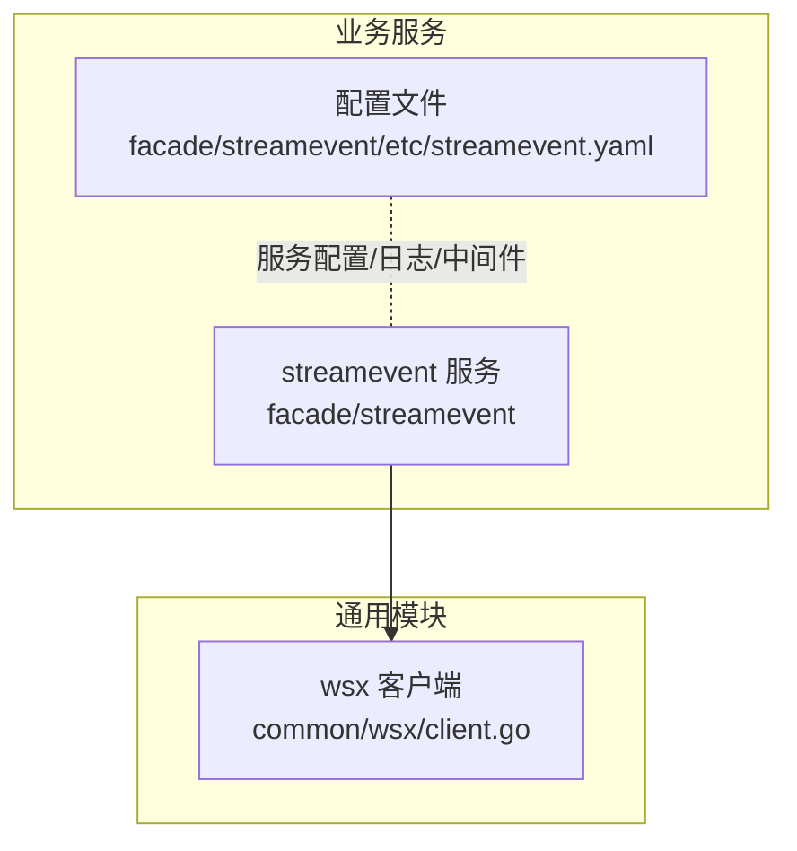
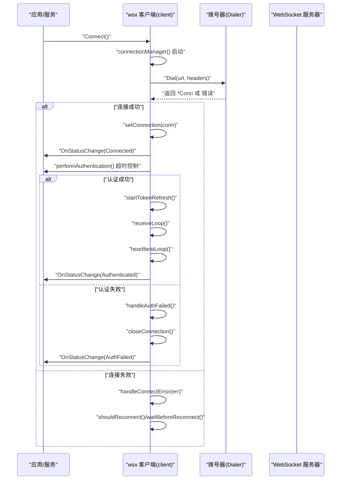
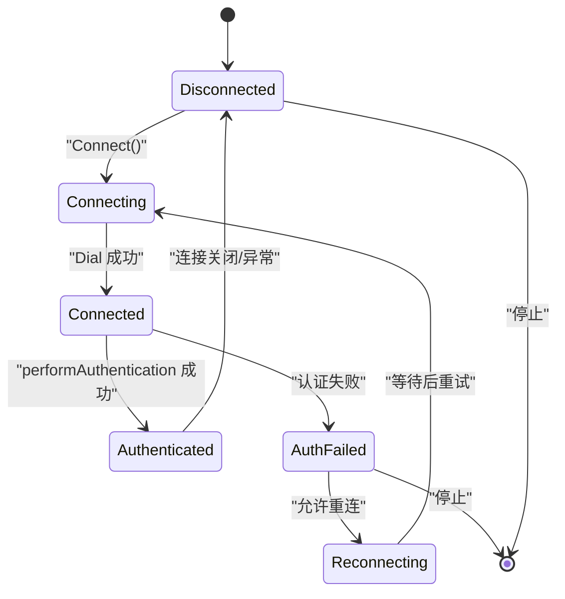
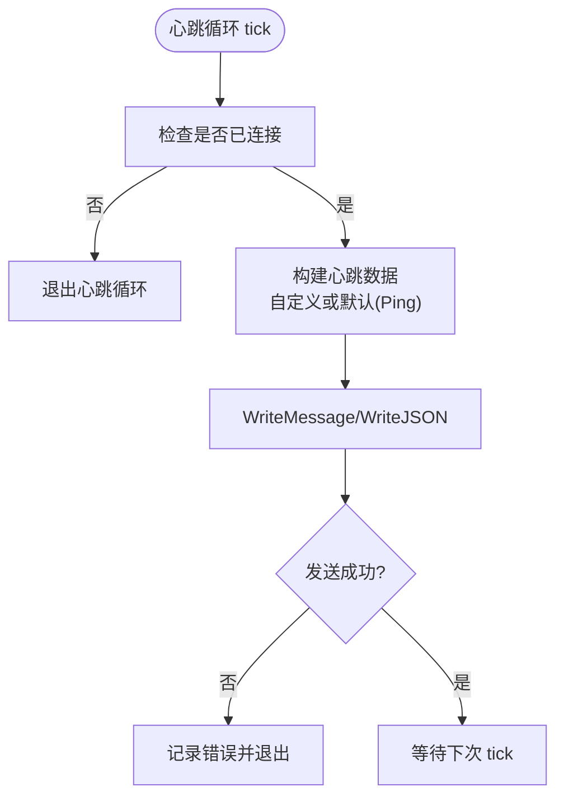
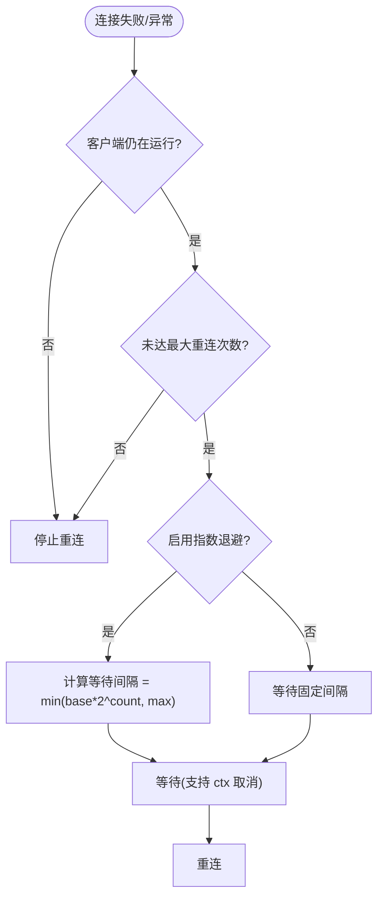
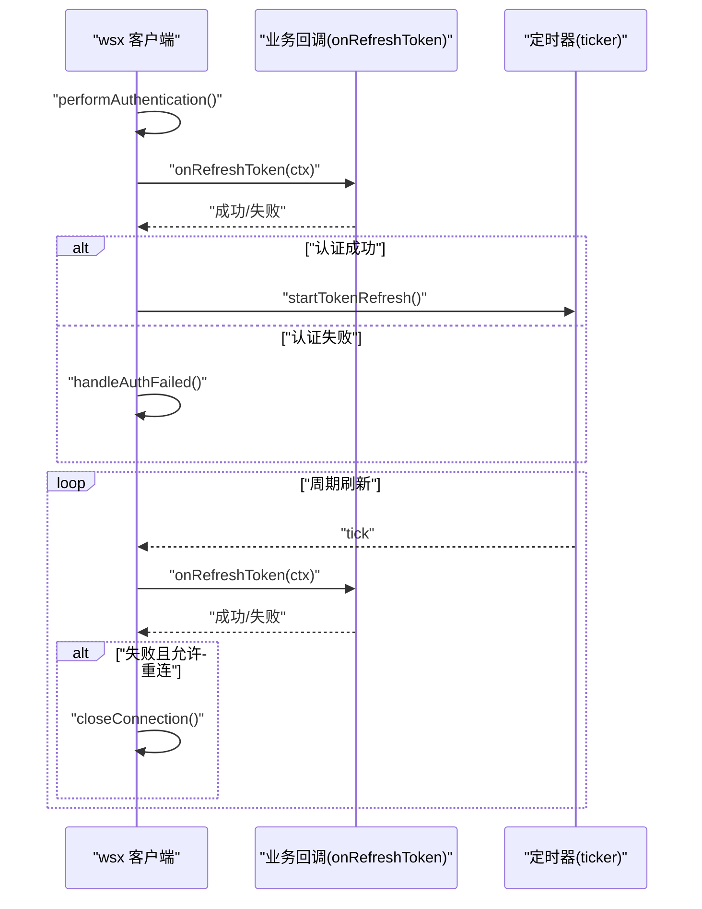
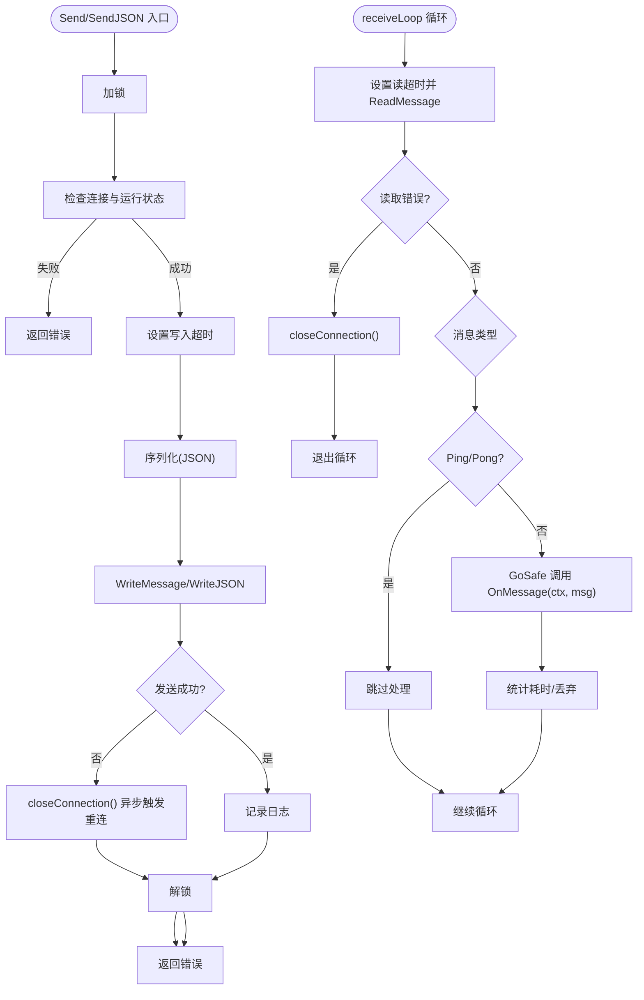
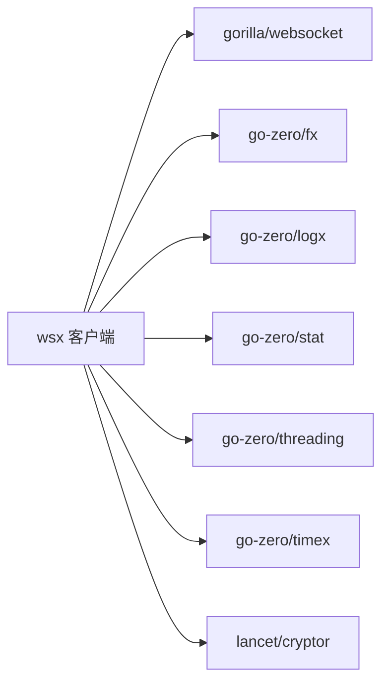

# WebSocket 客户端 (wsx)

<cite>
**本文引用的文件**
- [common/wsx/client.go](file://common/wsx/client.go)
- [facade/streamevent/etc/streamevent.yaml](file://facade/streamevent/etc/streamevent.yaml)
- [facade/streamevent/internal/logic/receivewsmessagelogic.go](file://facade/streamevent/internal/logic/receivewsmessagelogic.go)
- [go.mod](file://go.mod)
</cite>

## 目录
1. [简介](#简介)
2. [项目结构](#项目结构)
3. [核心组件](#核心组件)
4. [架构总览](#架构总览)
5. [详细组件分析](#详细组件分析)
6. [依赖分析](#依赖分析)
7. [性能考虑](#性能考虑)
8. [故障排查指南](#故障排查指南)
9. [结论](#结论)
10. [附录](#附录)

## 简介
本文件为 WebSocket 客户端 (wsx) 组件的全面技术文档，面向希望在服务中集成高可用 WebSocket 连接的工程师与架构师。文档围绕以下主题展开：
- 连接建立、心跳检测、断线重连与错误恢复机制
- 消息发送/接收、消息队列与并发安全
- 连接状态管理、超时控制与资源清理
- 客户端配置项、连接参数调优与性能优化建议
- 实际使用示例与与其他微服务的通信模式及最佳实践

## 项目结构
wsx 组件位于 common/wsx 目录下，提供一个可扩展、高可用的 WebSocket 客户端实现，具备：
- 配置驱动的连接参数
- 可插拔的认证、心跳与回调机制
- 指数退避的断线重连策略
- 基于 goroutine 的异步消息收发与心跳循环
- 原子状态与互斥锁保障并发安全
- 资源清理与优雅关闭

图示来源
- [common/wsx/client.go:1-895](file://common/wsx/client.go#L1-L895)
- [facade/streamevent/etc/streamevent.yaml:1-28](file://facade/streamevent/etc/streamevent.yaml#L1-L28)

章节来源
- [common/wsx/client.go:1-895](file://common/wsx/client.go#L1-L895)
- [facade/streamevent/etc/streamevent.yaml:1-28](file://facade/streamevent/etc/streamevent.yaml#L1-L28)

## 核心组件
- 接口与实现
  - Client 接口：对外暴露 Connect、Send、SendJSON、Close、IsConnected、IsAuthenticated、RefreshToken 等能力
  - client 结构体：封装连接、拨号器、回调、状态、计时器、上下文与互斥锁等内部状态
- 配置与选项
  - Config：URL、心跳间隔、重连间隔、最大重连次数、拨号超时、Token 刷新间隔、认证超时、指数退避开关、最大重连间隔
  - ClientOptions：Headers、Dialer、OnMessage、OnStatusChange、OnRefreshToken、OnHeartbeat、ReconnectOnAuthFailed、ReconnectOnTokenExpire
- 状态模型
  - ConnStatus：Disconnected、Connecting、Connected、Authenticated、AuthFailed、Reconnecting
- 并发与资源
  - 原子变量 running、authenticated；互斥锁保护关键字段；WaitGroup 等待 goroutine 退出；context 控制生命周期

章节来源
- [common/wsx/client.go:65-142](file://common/wsx/client.go#L65-L142)
- [common/wsx/client.go:83-107](file://common/wsx/client.go#L83-L107)
- [common/wsx/client.go:33-63](file://common/wsx/client.go#L33-L63)

## 架构总览
wsx 客户端采用“连接管理器 + 子循环”的架构：
- 连接管理器负责拨号、认证、状态切换与重连决策
- 收消息循环负责读取消息并交由业务回调处理
- 心跳循环负责周期性发送心跳（默认 Ping 或自定义）
- Token 刷新循环按配置周期触发刷新回调

图示来源
- [common/wsx/client.go:386-445](file://common/wsx/client.go#L386-L445)
- [common/wsx/client.go:448-487](file://common/wsx/client.go#L448-L487)
- [common/wsx/client.go:538-577](file://common/wsx/client.go#L538-L577)

## 详细组件分析

### 连接生命周期与状态机
- 状态流转
  - Connecting → Connected → Authenticated
  - Connecting → Connected → AuthFailed → Reconnecting/Disconnected
  - Disconnected → Connecting（根据重连策略）
- 关键行为
  - setConnection：设置 PongHandler、启动 receiveLoop 与 heartbeatLoop
  - clearConnection/closeConnection：清理与关闭连接，通知 connClosed
  - connectionManager：主循环，贯穿拨号、认证、重连与退出

图示来源
- [common/wsx/client.go:386-445](file://common/wsx/client.go#L386-L445)
- [common/wsx/client.go:489-508](file://common/wsx/client.go#L489-L508)
- [common/wsx/client.go:510-535](file://common/wsx/client.go#L510-L535)

章节来源
- [common/wsx/client.go:386-445](file://common/wsx/client.go#L386-L445)
- [common/wsx/client.go:489-535](file://common/wsx/client.go#L489-L535)

### 心跳检测与 Pong 处理
- 心跳循环：按 heartbeatInterval 触发，优先使用自定义 OnHeartbeat，否则发送 Ping
- PongHandler：收到 Pong 后刷新 ReadDeadline，提升对静默断开的敏感度
- 发送侧写入超时：每次 WriteMessage/WriteJSON 前设置写入超时，避免阻塞

图示来源
- [common/wsx/client.go:641-697](file://common/wsx/client.go#L641-L697)
- [common/wsx/client.go:498-502](file://common/wsx/client.go#L498-L502)
- [common/wsx/client.go:327-351](file://common/wsx/client.go#L327-L351)
- [common/wsx/client.go:353-384](file://common/wsx/client.go#L353-L384)

章节来源
- [common/wsx/client.go:641-697](file://common/wsx/client.go#L641-L697)
- [common/wsx/client.go:498-502](file://common/wsx/client.go#L498-L502)
- [common/wsx/client.go:327-384](file://common/wsx/client.go#L327-L384)

### 断线重连与指数退避
- shouldReconnect：判断是否仍在运行且未达到最大重连次数
- waitBeforeReconnect：支持指数退避（base * 2^count），上限为 MaxReconnectInterval
- handleConnectError：状态变更通知；handleAuthFailed：认证失败后的处理

图示来源
- [common/wsx/client.go:579-633](file://common/wsx/client.go#L579-L633)
- [common/wsx/client.go:635-638](file://common/wsx/client.go#L635-L638)
- [common/wsx/client.go:573-577](file://common/wsx/client.go#L573-L577)

章节来源
- [common/wsx/client.go:579-633](file://common/wsx/client.go#L579-L633)
- [common/wsx/client.go:635-638](file://common/wsx/client.go#L635-L638)
- [common/wsx/client.go:573-577](file://common/wsx/client.go#L573-L577)

### 认证与 Token 刷新
- performAuthentication：在 authTimeout 内执行 onRefreshToken，支持超时与取消
- startTokenRefresh/stopTokenRefresh/doRefreshToken：按 tokenRefreshInterval 周期刷新，失败可选择是否触发重连
- RefreshToken：手动触发一次刷新

图示来源
- [common/wsx/client.go:538-577](file://common/wsx/client.go#L538-L577)
- [common/wsx/client.go:700-763](file://common/wsx/client.go#L700-L763)
- [common/wsx/client.go:765-774](file://common/wsx/client.go#L765-L774)

章节来源
- [common/wsx/client.go:538-577](file://common/wsx/client.go#L538-L577)
- [common/wsx/client.go:700-763](file://common/wsx/client.go#L700-L763)
- [common/wsx/client.go:765-774](file://common/wsx/client.go#L765-L774)

### 消息发送/接收与并发安全
- 发送
  - Send/SendJSON：加锁、设置写入超时、发送消息；发送失败时关闭连接以触发重连
- 接收
  - receiveLoop：设置读取超时（2×心跳间隔）、读取消息、区分 Ping/Pong、通过 GoSafe 异步调用业务回调
  - metrics 统计处理耗时与丢弃
- 并发
  - mu 保护连接、计数器、定时器等共享状态
  - wg 等待 goroutine 退出
  - atomic 管理 running 与 authenticated

图示来源
- [common/wsx/client.go:327-384](file://common/wsx/client.go#L327-L384)
- [common/wsx/client.go:777-823](file://common/wsx/client.go#L777-L823)
- [common/wsx/client.go:825-866](file://common/wsx/client.go#L825-L866)

章节来源
- [common/wsx/client.go:327-384](file://common/wsx/client.go#L327-L384)
- [common/wsx/client.go:777-823](file://common/wsx/client.go#L777-L823)
- [common/wsx/client.go:825-866](file://common/wsx/client.go#L825-L866)

### 关闭与资源清理
- Close：标记停止、取消上下文、关闭连接、停止定时器、通知关闭、等待 goroutine 退出、最终状态通知
- safeClose：避免重复关闭通道

章节来源
- [common/wsx/client.go:825-866](file://common/wsx/client.go#L825-L866)
- [common/wsx/client.go:887-895](file://common/wsx/client.go#L887-L895)

## 依赖分析
- 外部依赖
  - gorilla/websocket：WebSocket 协议实现
  - go-zero 核心库：fx（超时控制）、logx（日志）、stat（指标）、threading（协程安全）、timex（时间）
  - lancet/cryptor：MD5 工具
- 内部集成点
  - 业务服务通过 wsx 客户端与上游 WebSocket 服务交互，配置与日志由服务侧管理

图示来源
- [go.mod:23-50](file://go.mod#L23-L50)
- [common/wsx/client.go:3-21](file://common/wsx/client.go#L3-L21)

章节来源
- [go.mod:23-50](file://go.mod#L23-L50)
- [common/wsx/client.go:3-21](file://common/wsx/client.go#L3-L21)

## 性能考虑
- 心跳与读写超时
  - 心跳间隔应小于服务器空闲超时；读超时设为 2×心跳间隔，有助于快速发现静默断开
- 指数退避
  - 合理设置基础重连间隔与最大重连间隔，避免风暴重连
- 并发与背压
  - 使用 GoSafe 异步处理消息，避免阻塞接收循环；如业务处理耗时较长，建议在回调内投递到工作池
- 指标与日志
  - 利用内置 metrics 统计处理耗时与丢弃；结合日志级别定位问题
- 资源释放
  - 在认证失败或异常时及时关闭连接并清理定时器，防止 goroutine 泄漏

## 故障排查指南
- 常见问题与定位
  - 连接失败：查看 dial 返回的错误与响应体内容；确认 URL、Headers、网络连通性
  - 认证超时/失败：检查 onRefreshToken 回调实现与 authTimeout；关注 AuthFailed 状态
  - 心跳失败：检查自定义心跳回调或默认 Ping；确认写入超时设置
  - 读取异常：区分正常关闭与异常错误；关注 PongHandler 对 ReadDeadline 的刷新
  - 重连策略：确认 ReconnectMaxRetries、指数退避与最大间隔配置
- 建议步骤
  - 提升日志级别至 debug，观察状态变化与错误栈
  - 使用 metrics 分析消息处理耗时与丢弃率
  - 在回调中增加幂等与限流，避免抖动放大

章节来源
- [common/wsx/client.go:448-487](file://common/wsx/client.go#L448-L487)
- [common/wsx/client.go:538-577](file://common/wsx/client.go#L538-L577)
- [common/wsx/client.go:641-697](file://common/wsx/client.go#L641-L697)
- [common/wsx/client.go:777-823](file://common/wsx/client.go#L777-L823)
- [common/wsx/client.go:579-633](file://common/wsx/client.go#L579-L633)

## 结论
wsx 客户端通过清晰的状态机、可插拔的回调、指数退避的重连策略与完善的资源管理，提供了高可用的 WebSocket 连接能力。结合合理的配置与性能优化建议，可在生产环境中稳定支撑各类实时通信场景。

## 附录

### 客户端配置与调优要点
- 连接参数
  - URL：目标 WebSocket 地址
  - DialTimeout：拨号超时，建议与网络延迟匹配
- 心跳与超时
  - HeartbeatInterval：建议与服务器空闲超时一致或略小
  - AuthTimeout：认证超时，建议与鉴权服务性能匹配
- 重连策略
  - ReconnectInterval：初始重连间隔
  - ReconnectBackoff/MaxReconnectInterval：指数退避与上限
  - ReconnectMaxRetries：最大重连次数（0 表示无限）
- Token 刷新
  - TokenRefreshInterval：刷新周期；失败时是否重连由 OnRefreshToken 返回决定

章节来源
- [common/wsx/client.go:83-94](file://common/wsx/client.go#L83-L94)
- [common/wsx/client.go:277-299](file://common/wsx/client.go#L277-L299)

### 实际使用示例与集成模式
- 在服务中集成 wsx 客户端
  - 构造 Config 与 ClientOptions（设置 Headers、OnMessage、OnStatusChange、OnRefreshToken、OnHeartbeat 等）
  - 调用 NewClient/ MustNewClient 创建客户端并 Connect
  - 在业务逻辑中调用 Send/SendJSON 发送消息；在 OnMessage 中处理业务消息
  - 通过 Close 优雅关闭；利用 RefreshToken 手动刷新
- 与微服务通信模式
  - 作为下游消费者：订阅上游推送事件，回调中进行业务处理与落库
  - 作为上游发起者：定时发送心跳与指令，配合指数退避与超时控制
- 示例参考
  - 业务服务配置与日志：facade/streamevent/etc/streamevent.yaml
  - 业务逻辑模板：facade/streamevent/internal/logic/receivewsmessagelogic.go

章节来源
- [common/wsx/client.go:215-275](file://common/wsx/client.go#L215-L275)
- [common/wsx/client.go:65-81](file://common/wsx/client.go#L65-L81)
- [facade/streamevent/etc/streamevent.yaml:1-28](file://facade/streamevent/etc/streamevent.yaml#L1-L28)
- [facade/streamevent/internal/logic/receivewsmessagelogic.go:1-32](file://facade/streamevent/internal/logic/receivewsmessagelogic.go#L1-L32)