# antsX 反应式编程工具包

<cite>
**本文档引用的文件**
- [README.md](file://common/antsx/README.md)
- [emitter.go](file://common/antsx/emitter.go)
- [promise.go](file://common/antsx/promise.go)
- [promise_ext.go](file://common/antsx/promise_ext.go)
- [reactor.go](file://common/antsx/reactor.go)
- [pending.go](file://common/antsx/pending.go)
- [invoke.go](file://common/antsx/invoke.go)
- [errors.go](file://common/antsx/errors.go)
- [antsx_test.go](file://common/antsx/antsx_test.go)
</cite>

## 目录
1. [简介](#简介)
2. [项目结构](#项目结构)
3. [核心组件](#核心组件)
4. [架构概览](#架构概览)
5. [详细组件分析](#详细组件分析)
6. [依赖关系分析](#依赖关系分析)
7. [性能考虑](#性能考虑)
8. [故障排除指南](#故障排除指南)
9. [结论](#结论)

## 简介

antsX 是一个基于 Go 语言的反应式编程工具包，参考了 Java Project Reactor 的设计理念，专门为 Go 语言环境提供了现代化的异步编程能力。该工具包专注于构建高性能、可扩展的并发应用程序，特别适用于微服务架构和高并发场景。

### 主要特性

- **并发安全设计**：所有类型都经过精心设计，确保在多 goroutine 环境下的安全性
- **内置错误恢复**：在关键入口点捕获用户函数的 panic，防止 goroutine 泄漏
- **响应式编程模型**：提供类似 Java Reactor 的响应式编程体验
- **高性能并发**：基于 ants goroutine 池，优化资源利用率
- **丰富的组合器**：提供多种 Promise 组合和并发控制模式

## 项目结构

antsX 工具包位于 `common/antsx/` 目录下，采用模块化设计，每个核心功能都封装在独立的文件中：

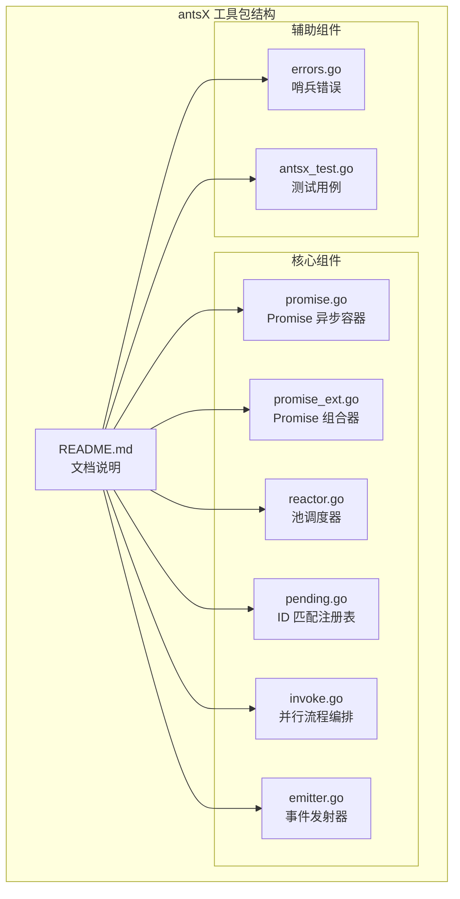

**图表来源**
- [README.md:1-360](file://common/antsx/README.md#L1-L360)
- [promise.go:1-147](file://common/antsx/promise.go#L1-L147)
- [reactor.go:1-93](file://common/antsx/reactor.go#L1-L93)

**章节来源**
- [README.md:1-360](file://common/antsx/README.md#L1-L360)

## 核心组件

antsX 工具包包含七个核心组件，每个组件都有明确的职责和使用场景：

### Promise[T] - 异步结果容器

Promise 是异步操作的结果容器，支持链式调用和错误处理。它提供了标准的异步编程模式，包括 `Resolve`、`Reject`、`Await` 等操作。

### Reactor - 池调度器

Reactor 基于 ants goroutine 池，提供带 ID 去重的任务调度功能。它支持三种任务提交方式：带 Promise 的提交、fire-and-forget 提交和裸 goroutine 提交。

### PendingRegistry[T] - 关联 ID 匹配

用于异步请求-响应匹配的注册表，支持超时控制和自动清理。典型应用场景包括消息队列相关 ID 匹配和网络协议中的序列号匹配。

### Invoke - 并行流程编排

提供强大的并行执行能力，支持单任务超时和整体超时控制。它可以在 goroutine 池中执行任务，也可以直接使用裸 goroutine。

### EventEmitter[T] - 发布/订阅

基于 topic 的事件发布订阅系统，支持非阻塞广播和慢消费者丢弃机制。适用于实时数据推送和事件驱动架构。

### Promise 组合器

包括 `PromiseAll`、`PromiseRace`、`Map`、`FlatMap` 等高级组合器，提供复杂的异步操作编排能力。

**章节来源**
- [README.md:7-15](file://common/antsx/README.md#L7-L15)
- [promise.go:16-29](file://common/antsx/promise.go#L16-L29)
- [reactor.go:14-17](file://common/antsx/reactor.go#L14-L17)
- [pending.go:29-36](file://common/antsx/pending.go#L29-L36)
- [invoke.go:10-15](file://common/antsx/invoke.go#L10-L15)
- [emitter.go:13-18](file://common/antsx/emitter.go#L13-L18)

## 架构概览

antsX 工具包采用了分层架构设计，各组件之间通过清晰的接口进行交互：

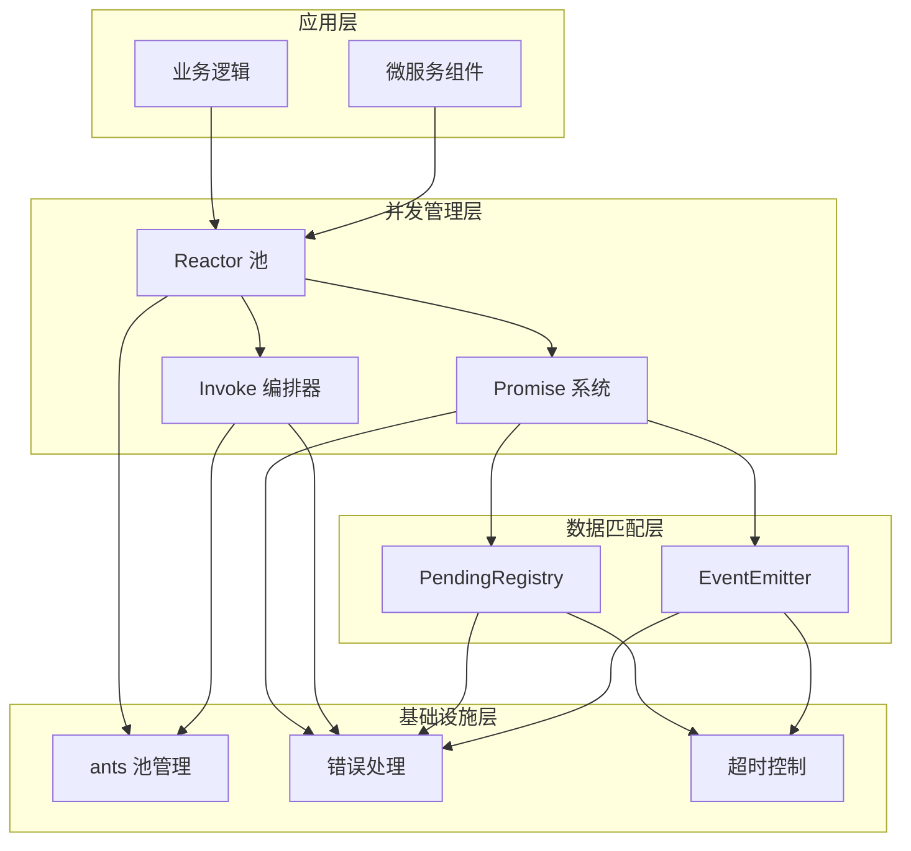

**图表来源**
- [reactor.go:14-28](file://common/antsx/reactor.go#L14-L28)
- [promise.go:16-29](file://common/antsx/promise.go#L16-L29)
- [pending.go:29-36](file://common/antsx/pending.go#L29-L36)
- [invoke.go:10-15](file://common/antsx/invoke.go#L10-L15)
- [emitter.go:13-18](file://common/antsx/emitter.go#L13-L18)

### 数据流架构

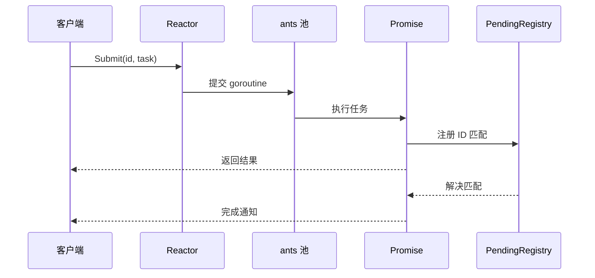

**图表来源**
- [reactor.go:32-61](file://common/antsx/reactor.go#L32-L61)
- [pending.go:52-90](file://common/antsx/pending.go#L52-L90)

## 详细组件分析

### Promise 系统

Promise 是 antsX 的核心抽象，提供了完整的异步编程能力：

#### Promise 类设计

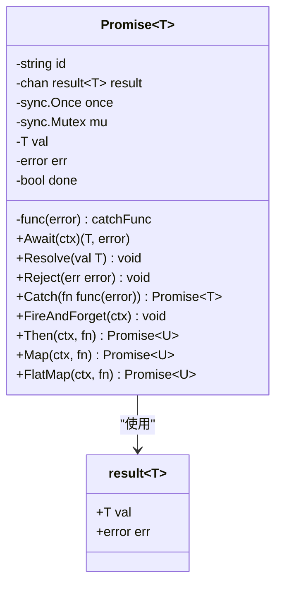

**图表来源**
- [promise.go:16-29](file://common/antsx/promise.go#L16-L29)
- [promise.go:11-14](file://common/antsx/promise.go#L11-L14)

#### Promise 组合器

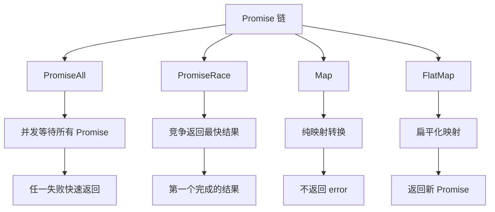

**图表来源**
- [promise_ext.go:10-43](file://common/antsx/promise_ext.go#L10-L43)
- [promise_ext.go:45-73](file://common/antsx/promise_ext.go#L45-L73)
- [promise_ext.go:75-95](file://common/antsx/promise_ext.go#L75-L95)
- [promise_ext.go:97-124](file://common/antsx/promise_ext.go#L97-L124)

**章节来源**
- [promise.go:16-147](file://common/antsx/promise.go#L16-L147)
- [promise_ext.go:1-132](file://common/antsx/promise_ext.go#L1-132)

### Reactor 池调度器

Reactor 提供了智能的 goroutine 池管理，支持 ID 去重和错误恢复：

#### Reactor 架构

```mermaid
classDiagram
class Reactor {
-Pool pool
-sync.Map registry
+NewReactor(size int) Reactor
+Submit(ctx, id, task) Promise~T~
+Post(ctx, task) error
+Go(fn) error
+Release() void
+ActiveCount() int
}
class Pool {
+Running() int
+Submit(fn) error
+Release() void
}
class sync.Map {
+LoadOrStore(key, val) (interface{}, bool)
+Delete(key) void
}
Reactor --> Pool : "使用"
Reactor --> sync.Map : "管理"
```

**图表来源**
- [reactor.go:14-17](file://common/antsx/reactor.go#L14-L17)
- [reactor.go:19-29](file://common/antsx/reactor.go#L19-L29)

#### 任务提交流程

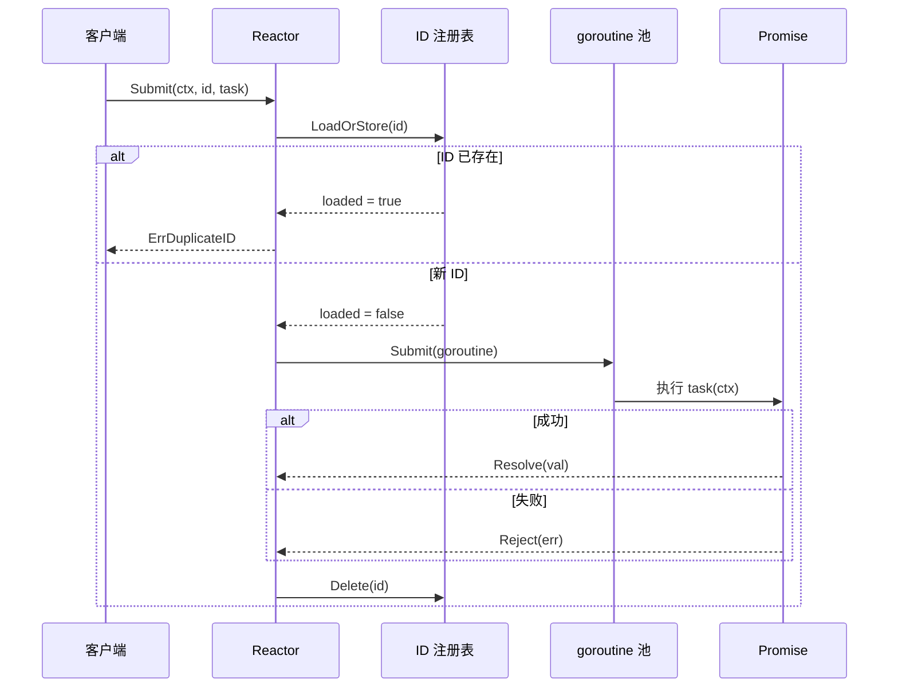

**图表来源**
- [reactor.go:32-61](file://common/antsx/reactor.go#L32-L61)

**章节来源**
- [reactor.go:1-93](file://common/antsx/reactor.go#L1-L93)

### PendingRegistry - ID 匹配系统

PendingRegistry 提供了可靠的异步请求-响应匹配机制：

#### 注册表设计

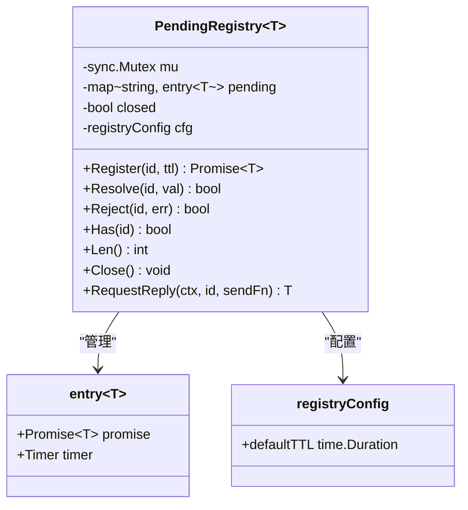

**图表来源**
- [pending.go:29-36](file://common/antsx/pending.go#L29-L36)
- [pending.go:24-27](file://common/antsx/pending.go#L24-L27)
- [pending.go:13-15](file://common/antsx/pending.go#L13-L15)

#### 请求-响应匹配流程

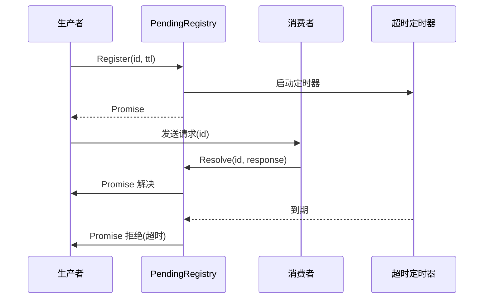

**图表来源**
- [pending.go:52-90](file://common/antsx/pending.go#L52-L90)
- [pending.go:72-81](file://common/antsx/pending.go#L72-L81)

**章节来源**
- [pending.go:1-184](file://common/antsx/pending.go#L1-L184)

### Invoke 并行编排器

Invoke 提供了强大的并行执行能力，支持复杂的超时控制：

#### 并行执行流程

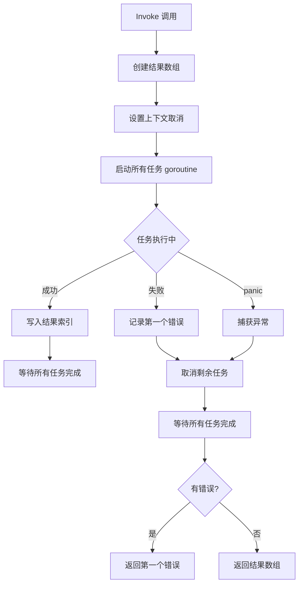

**图表来源**
- [invoke.go:20-72](file://common/antsx/invoke.go#L20-L72)
- [invoke.go:87-149](file://common/antsx/invoke.go#L87-L149)

**章节来源**
- [invoke.go:1-150](file://common/antsx/invoke.go#L1-L150)

### EventEmitter 事件系统

EventEmitter 提供了高效的发布-订阅模式：

#### 事件发射器架构

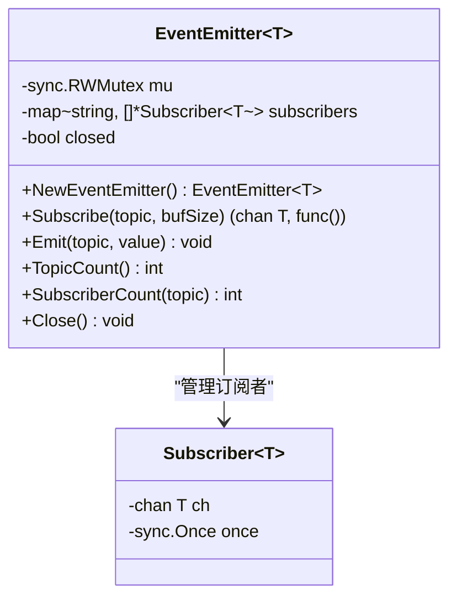

**图表来源**
- [emitter.go:13-18](file://common/antsx/emitter.go#L13-L18)
- [emitter.go:7-11](file://common/antsx/emitter.go#L7-L11)

#### 事件传播机制

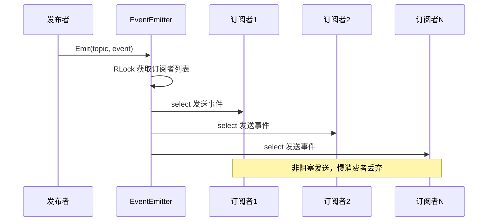

**图表来源**
- [emitter.go:69-83](file://common/antsx/emitter.go#L69-L83)

**章节来源**
- [emitter.go:1-118](file://common/antsx/emitter.go#L1-L118)

## 依赖关系分析

antsX 工具包具有清晰的依赖层次结构，各组件之间的耦合度较低：

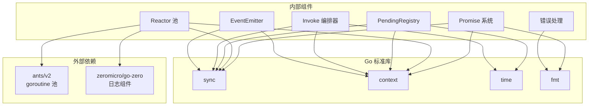

**图表来源**
- [reactor.go:3-10](file://common/antsx/reactor.go#L3-L10)
- [promise.go:3-7](file://common/antsx/promise.go#L3-L7)
- [pending.go:3-8](file://common/antsx/pending.go#L3-L8)
- [invoke.go:3-8](file://common/antsx/invoke.go#L3-L8)
- [emitter.go:3-5](file://common/antsx/emitter.go#L3-L5)

### 组件间交互

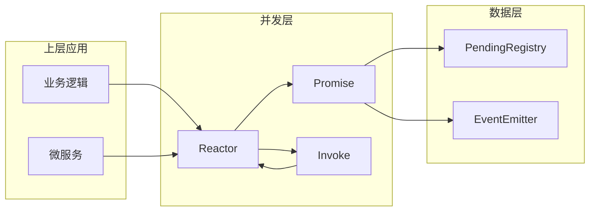

**图表来源**
- [reactor.go:32-61](file://common/antsx/reactor.go#L32-L61)
- [promise.go:66-92](file://common/antsx/promise.go#L66-L92)
- [invoke.go:17-72](file://common/antsx/invoke.go#L17-L72)

**章节来源**
- [reactor.go:1-93](file://common/antsx/reactor.go#L1-L93)
- [promise.go:1-147](file://common/antsx/promise.go#L1-L147)
- [invoke.go:1-150](file://common/antsx/invoke.go#L1-L150)

## 性能考虑

antsX 工具包在设计时充分考虑了性能优化：

### 并发性能优化

1. **goroutine 池复用**：通过 ants 池减少 goroutine 创建开销
2. **零拷贝设计**：Promise 使用 channel 通信，避免不必要的数据复制
3. **批量操作**：Invoke 支持批量任务执行，提高吞吐量
4. **非阻塞事件**：EventEmitter 采用非阻塞发送，防止慢消费者影响整体性能

### 内存管理

1. **及时清理**：PendingRegistry 自动清理超时的注册项
2. **通道缓冲**：EventEmitter 支持可配置的通道缓冲大小
3. **懒加载**：Promise 结果缓存，避免重复计算

### 错误处理性能

1. **快速失败**：PromiseAll 和 Invoke 的快速失败机制
2. **panic 恢复**：内置的 panic 恢复机制，防止级联故障
3. **超时控制**：精确的超时控制，避免资源泄漏

## 故障排除指南

### 常见错误类型

antsX 定义了三种主要的哨兵错误：

| 错误类型 | 触发条件 | 处理建议 |
|---------|---------|---------|
| ErrPendingExpired | PendingRegistry 条目超时 | 检查 TTL 设置和网络延迟 |
| ErrDuplicateID | Reactor 中 ID 重复 | 确保任务 ID 唯一性 |
| ErrRegistryClosed | PendingRegistry 已关闭 | 检查注册表生命周期 |

### 调试技巧

1. **启用详细日志**：使用 Reactor 的 Post 方法记录错误信息
2. **监控 goroutine 数量**：定期检查 Reactor.ActiveCount()
3. **跟踪 Promise 状态**：使用 Catch 回调捕获错误
4. **验证 ID 唯一性**：确保 PendingRegistry 的 ID 不冲突

### 性能问题诊断

1. **goroutine 泄漏**：检查 Reactor 是否正确释放
2. **内存泄漏**：监控 PendingRegistry 的长度
3. **死锁检测**：使用 context 超时避免无限等待

**章节来源**
- [errors.go:5-9](file://common/antsx/errors.go#L5-L9)
- [reactor.go:84-92](file://common/antsx/reactor.go#L84-L92)
- [pending.go:134-140](file://common/antsx/pending.go#L134-L140)

## 结论

antsX 反应式编程工具包为 Go 语言开发者提供了一套完整且高性能的异步编程解决方案。通过精心设计的组件架构和丰富的功能特性，它能够满足现代微服务架构对并发性和可扩展性的需求。

### 主要优势

1. **生产级稳定性**：经过充分测试，支持复杂的企业级应用场景
2. **高性能并发**：基于 goroutine 池的高效并发模型
3. **易用性强**：简洁的 API 设计，学习成本低
4. **功能丰富**：涵盖从基础 Promise 到复杂事件系统的完整生态

### 适用场景

- 微服务架构中的异步通信
- 高并发数据处理管道
- 实时事件驱动系统
- 分布式系统中的请求-响应匹配

### 发展方向

随着 Go 语言生态的不断发展，antsX 工具包将继续演进，为开发者提供更加强大和易用的反应式编程能力。建议关注后续版本的功能更新和性能优化。