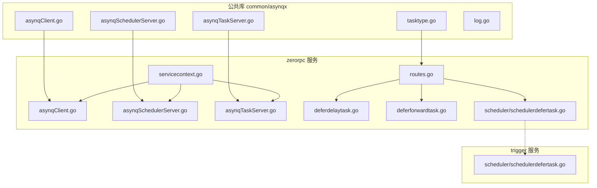
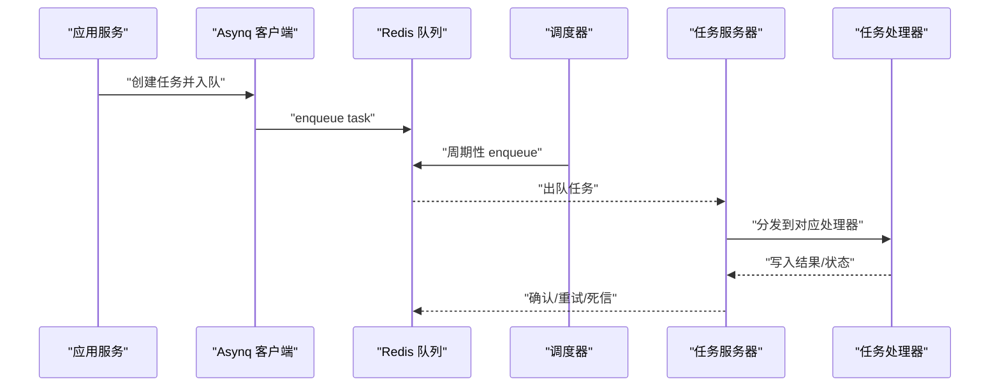
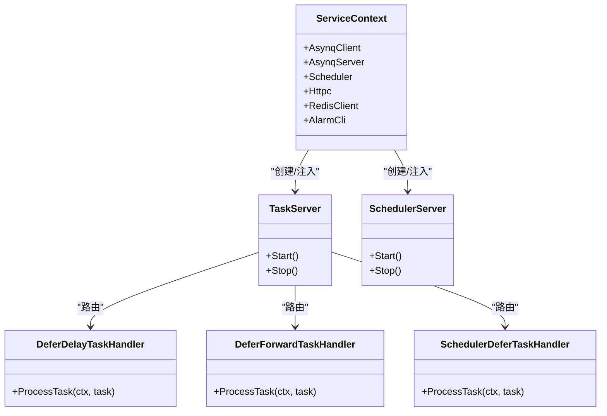

# 任务调度系统 (asynqx)

<cite>
**本文引用的文件**
- [common/asynqx/asynqClient.go](file://common/asynqx/asynqClient.go)
- [common/asynqx/asynqSchedulerServer.go](file://common/asynqx/asynqSchedulerServer.go)
- [common/asynqx/asynqTaskServer.go](file://common/asynqx/asynqTaskServer.go)
- [common/asynqx/tasktype.go](file://common/asynqx/tasktype.go)
- [common/asynqx/log.go](file://common/asynqx/log.go)
- [zerorpc/internal/task/deferdelaytask.go](file://zerorpc/internal/task/deferdelaytask.go)
- [zerorpc/internal/task/deferforwardtask.go](file://zerorpc/internal/task/deferforwardtask.go)
- [zerorpc/internal/task/routes.go](file://zerorpc/internal/task/routes.go)
- [zerorpc/internal/svc/asynqClient.go](file://zerorpc/internal/svc/asynqClient.go)
- [zerorpc/internal/svc/asynqSchedulerServer.go](file://zerorpc/internal/svc/asynqSchedulerServer.go)
- [zerorpc/internal/svc/asynqTaskServer.go](file://zerorpc/internal/svc/asynqTaskServer.go)
- [zerorpc/internal/svc/servicecontext.go](file://zerorpc/internal/svc/servicecontext.go)
- [zerorpc/internal/task/scheduler/schedulerdefertask.go](file://zerorpc/internal/task/scheduler/schedulerdefertask.go)
- [app/trigger/internal/task/scheduler/schedulerdefertask.go](file://app/trigger/internal/task/scheduler/schedulerdefertask.go)
</cite>

## 目录
1. [简介](#简介)
2. [项目结构](#项目结构)
3. [核心组件](#核心组件)
4. [架构总览](#架构总览)
5. [详细组件分析](#详细组件分析)
6. [依赖分析](#依赖分析)
7. [性能考虑](#性能考虑)
8. [故障排查指南](#故障排查指南)
9. [结论](#结论)
10. [附录：使用示例与最佳实践](#附录使用示例与最佳实践)

## 简介
本技术文档围绕基于 Asynq 的任务调度系统（asynqx）进行系统化梳理，覆盖任务客户端、调度器服务器、任务处理器的设计与实现；深入解析定时任务、延迟任务与周期性任务的运行机制；阐述任务类型定义、任务序列化与反序列化流程；说明调度器配置项、并发控制与队列权重策略；并提供监控、日志与错误处理的最佳实践及微服务集成示例。

## 项目结构
该仓库采用多模块微服务架构，任务调度能力通过公共库 common/asynqx 提供通用封装，具体业务服务（如 zerorpc、trigger 等）在各自 internal/svc 中组合 Redis 客户端、Asynq Server 与 Scheduler，并在 internal/task 下注册任务处理器与路由。

图表来源
- [common/asynqx/asynqClient.go:1-31](file://common/asynqx/asynqClient.go#L1-L31)
- [common/asynqx/asynqSchedulerServer.go:1-62](file://common/asynqx/asynqSchedulerServer.go#L1-L62)
- [common/asynqx/asynqTaskServer.go:1-87](file://common/asynqx/asynqTaskServer.go#L1-L87)
- [common/asynqx/tasktype.go:1-10](file://common/asynqx/tasktype.go#L1-L10)
- [common/asynqx/log.go:1-37](file://common/asynqx/log.go#L1-L37)
- [zerorpc/internal/svc/servicecontext.go:1-102](file://zerorpc/internal/svc/servicecontext.go#L1-L102)
- [zerorpc/internal/svc/asynqClient.go:1-28](file://zerorpc/internal/svc/asynqClient.go#L1-L28)
- [zerorpc/internal/svc/asynqSchedulerServer.go:1-63](file://zerorpc/internal/svc/asynqSchedulerServer.go#L1-L63)
- [zerorpc/internal/svc/asynqTaskServer.go:1-75](file://zerorpc/internal/svc/asynqTaskServer.go#L1-L75)
- [zerorpc/internal/task/routes.go:1-37](file://zerorpc/internal/task/routes.go#L1-L37)
- [zerorpc/internal/task/deferdelaytask.go:1-37](file://zerorpc/internal/task/deferdelaytask.go#L1-L37)
- [zerorpc/internal/task/deferforwardtask.go:1-97](file://zerorpc/internal/task/deferforwardtask.go#L1-L97)
- [zerorpc/internal/task/scheduler/schedulerdefertask.go:1-25](file://zerorpc/internal/task/scheduler/schedulerdefertask.go#L1-L25)
- [app/trigger/internal/task/scheduler/schedulerdefertask.go:1-25](file://app/trigger/internal/task/scheduler/schedulerdefertask.go#L1-L25)

章节来源
- [common/asynqx/asynqClient.go:1-31](file://common/asynqx/asynqClient.go#L1-L31)
- [common/asynqx/asynqSchedulerServer.go:1-62](file://common/asynqx/asynqSchedulerServer.go#L1-L62)
- [common/asynqx/asynqTaskServer.go:1-87](file://common/asynqx/asynqTaskServer.go#L1-L87)
- [common/asynqx/tasktype.go:1-10](file://common/asynqx/tasktype.go#L1-L10)
- [common/asynqx/log.go:1-37](file://common/asynqx/log.go#L1-L37)
- [zerorpc/internal/svc/servicecontext.go:1-102](file://zerorpc/internal/svc/servicecontext.go#L1-L102)
- [zerorpc/internal/svc/asynqClient.go:1-28](file://zerorpc/internal/svc/asynqClient.go#L1-L28)
- [zerorpc/internal/svc/asynqSchedulerServer.go:1-63](file://zerorpc/internal/svc/asynqSchedulerServer.go#L1-L63)
- [zerorpc/internal/svc/asynqTaskServer.go:1-75](file://zerorpc/internal/svc/asynqTaskServer.go#L1-L75)
- [zerorpc/internal/task/routes.go:1-37](file://zerorpc/internal/task/routes.go#L1-L37)
- [zerorpc/internal/task/deferdelaytask.go:1-37](file://zerorpc/internal/task/deferdelaytask.go#L1-L37)
- [zerorpc/internal/task/deferforwardtask.go:1-97](file://zerorpc/internal/task/deferforwardtask.go#L1-L97)
- [zerorpc/internal/task/scheduler/schedulerdefertask.go:1-25](file://zerorpc/internal/task/scheduler/schedulerdefertask.go#L1-L25)
- [app/trigger/internal/task/scheduler/schedulerdefertask.go:1-25](file://app/trigger/internal/task/scheduler/schedulerdefertask.go#L1-L25)

## 核心组件
- 任务客户端：封装 Redis 连接与 Asynq Client/Inspector 初始化，提供生产者侧链路追踪标注。
- 调度器服务器：封装 Asynq Scheduler，负责周期性任务注册与执行，内置日志适配器。
- 任务服务器：封装 Asynq Server，负责消费队列、并发控制、队列优先级与中间件。
- 任务类型定义：统一管理延迟任务、触发任务、调度器任务等类型常量。
- 日志适配器：将 Asynq 日志桥接到统一日志框架。
- 业务处理器：按任务类型实现 ProcessTask，完成序列化/反序列化、上下文传播与结果写入。

章节来源
- [common/asynqx/asynqClient.go:17-31](file://common/asynqx/asynqClient.go#L17-L31)
- [common/asynqx/asynqSchedulerServer.go:32-52](file://common/asynqx/asynqSchedulerServer.go#L32-L52)
- [common/asynqx/asynqTaskServer.go:39-64](file://common/asynqx/asynqTaskServer.go#L39-L64)
- [common/asynqx/tasktype.go:1-10](file://common/asynqx/tasktype.go#L1-L10)
- [common/asynqx/log.go:8-37](file://common/asynqx/log.go#L8-L37)

## 架构总览
下图展示了任务从生产到消费的全链路：应用通过任务客户端将任务入队，调度器按计划周期性地将任务入队，任务服务器根据队列优先级并发消费，处理器完成业务处理并写入结果。

图表来源
- [common/asynqx/asynqClient.go:17-31](file://common/asynqx/asynqClient.go#L17-L31)
- [common/asynqx/asynqSchedulerServer.go:32-52](file://common/asynqx/asynqSchedulerServer.go#L32-L52)
- [common/asynqx/asynqTaskServer.go:39-64](file://common/asynqx/asynqTaskServer.go#L39-L64)
- [zerorpc/internal/task/routes.go:22-36](file://zerorpc/internal/task/routes.go#L22-L36)
- [zerorpc/internal/task/deferdelaytask.go:23-36](file://zerorpc/internal/task/deferdelaytask.go#L23-L36)
- [zerorpc/internal/task/deferforwardtask.go:31-96](file://zerorpc/internal/task/deferforwardtask.go#L31-L96)

## 详细组件分析

### 任务客户端与 Inspector
- 功能：创建 Asynq Client 与 Inspector，支持 Redis 地址、密码与 DB 选择；提供生产者侧 OpenTelemetry Span 标注，便于链路追踪。
- 关键点：统一的 Redis 连接参数；Span 名称与类型属性设置。

章节来源
- [common/asynqx/asynqClient.go:17-31](file://common/asynqx/asynqClient.go#L17-L31)
- [zerorpc/internal/svc/asynqClient.go:18-27](file://zerorpc/internal/svc/asynqClient.go#L18-L27)

### 调度器服务器（周期性任务）
- 功能：封装 Asynq Scheduler，设置时区、连接参数、后置入队回调与日志适配器；提供启动/停止；注册周期性任务。
- 关键点：PostEnqueueFunc 记录入队成功/失败；SchedulerOpts.Location 指定 Asia/Shanghai；注册表达式“*/1 * * * *”每分钟一次。

章节来源
- [common/asynqx/asynqSchedulerServer.go:32-52](file://common/asynqx/asynqSchedulerServer.go#L32-L52)
- [common/asynqx/asynqSchedulerServer.go:54-61](file://common/asynqx/asynqSchedulerServer.go#L54-L61)
- [zerorpc/internal/svc/asynqSchedulerServer.go:34-53](file://zerorpc/internal/svc/asynqSchedulerServer.go#L34-L53)
- [zerorpc/internal/svc/asynqSchedulerServer.go:55-62](file://zerorpc/internal/svc/asynqSchedulerServer.go#L55-L62)

### 任务服务器（消费与并发）
- 功能：封装 Asynq Server，配置并发数、队列优先级、失败判定与日志适配器；提供启动/停止；内置日志中间件。
- 关键点：Concurrency=20；Queues 按 critical/default/low 分配权重；LoggingMiddleware 输出耗时与错误。

章节来源
- [common/asynqx/asynqTaskServer.go:39-64](file://common/asynqx/asynqTaskServer.go#L39-L64)
- [common/asynqx/asynqTaskServer.go:73-87](file://common/asynqx/asynqTaskServer.go#L73-L87)
- [zerorpc/internal/svc/asynqTaskServer.go:35-51](file://zerorpc/internal/svc/asynqTaskServer.go#L35-L51)
- [zerorpc/internal/svc/asynqTaskServer.go:60-75](file://zerorpc/internal/svc/asynqTaskServer.go#L60-L75)

### 任务类型定义
- 类型常量：延迟任务、触发任务、触发 Proto 任务、调度器延迟任务。
- 用途：作为 ServeMux 的路由键，区分不同处理器。

章节来源
- [common/asynqx/tasktype.go:3-10](file://common/asynqx/tasktype.go#L3-L10)

### 日志适配器
- 功能：将 Asynq 的 Debug/Info/Warn/Error/Fatal 映射到统一日志框架，保证日志一致性。
- 注意：Fatal 会触发进程退出。

章节来源
- [common/asynqx/log.go:8-37](file://common/asynqx/log.go#L8-L37)

### 任务处理器与序列化/反序列化
- 延迟任务处理器：从 Payload 解析消息体，提取并注入 OpenTelemetry 上下文，执行业务逻辑并返回。
- 转发任务处理器：解析消息体，发起 HTTP 请求，根据响应状态写入结果并触发告警；异常时记录错误与 IP。
- 调度器任务处理器：打印负载并写入“success”。

章节来源
- [zerorpc/internal/task/deferdelaytask.go:23-36](file://zerorpc/internal/task/deferdelaytask.go#L23-L36)
- [zerorpc/internal/task/deferforwardtask.go:31-96](file://zerorpc/internal/task/deferforwardtask.go#L31-L96)
- [zerorpc/internal/task/scheduler/schedulerdefertask.go:20-24](file://zerorpc/internal/task/scheduler/schedulerdefertask.go#L20-L24)
- [app/trigger/internal/task/scheduler/schedulerdefertask.go:20-24](file://app/trigger/internal/task/scheduler/schedulerdefertask.go#L20-L24)

### 任务路由与注册
- ServeMux 注册延迟任务、触发任务与调度器任务处理器；统一挂载 LoggingMiddleware。
- 启动时输出注册信息，便于运维观察。

章节来源
- [zerorpc/internal/task/routes.go:22-36](file://zerorpc/internal/task/routes.go#L22-L36)

### 服务上下文与依赖注入
- ServiceContext 统一创建 Asynq Client/Server/Scheduler，注入 Redis、HTTP 客户端、告警客户端与模型层。
- 为各服务提供一致的调度能力入口。

章节来源
- [zerorpc/internal/svc/servicecontext.go:35-101](file://zerorpc/internal/svc/servicecontext.go#L35-L101)

## 依赖分析
- 组件耦合：业务处理器依赖 ServiceContext 获取外部服务；调度器与任务服务器依赖 Redis；日志适配器依赖统一日志框架。
- 并发与队列：任务服务器通过 Queues 对 critical/default/low 设置不同权重，结合 Concurrency 控制最大并发。
- 失败策略：IsFailure 总是返回 true，确保错误被记录并进入重试/失败处理流程。

图表来源
- [zerorpc/internal/svc/servicecontext.go:19-33](file://zerorpc/internal/svc/servicecontext.go#L19-L33)
- [common/asynqx/asynqTaskServer.go:16-37](file://common/asynqx/asynqTaskServer.go#L16-L37)
- [common/asynqx/asynqSchedulerServer.go:11-31](file://common/asynqx/asynqSchedulerServer.go#L11-L31)
- [zerorpc/internal/task/routes.go:22-36](file://zerorpc/internal/task/routes.go#L22-L36)
- [zerorpc/internal/task/deferdelaytask.go:13-21](file://zerorpc/internal/task/deferdelaytask.go#L13-L21)
- [zerorpc/internal/task/deferforwardtask.go:21-29](file://zerorpc/internal/task/deferforwardtask.go#L21-L29)
- [zerorpc/internal/task/scheduler/schedulerdefertask.go:10-18](file://zerorpc/internal/task/scheduler/schedulerdefertask.go#L10-L18)

章节来源
- [zerorpc/internal/svc/servicecontext.go:19-33](file://zerorpc/internal/svc/servicecontext.go#L19-L33)
- [common/asynqx/asynqTaskServer.go:16-37](file://common/asynqx/asynqTaskServer.go#L16-L37)
- [common/asynqx/asynqSchedulerServer.go:11-31](file://common/asynqx/asynqSchedulerServer.go#L11-L31)
- [zerorpc/internal/task/routes.go:22-36](file://zerorpc/internal/task/routes.go#L22-L36)
- [zerorpc/internal/task/deferdelaytask.go:13-21](file://zerorpc/internal/task/deferdelaytask.go#L13-L21)
- [zerorpc/internal/task/deferforwardtask.go:21-29](file://zerorpc/internal/task/deferforwardtask.go#L21-L29)
- [zerorpc/internal/task/scheduler/schedulerdefertask.go:10-18](file://zerorpc/internal/task/scheduler/schedulerdefertask.go#L10-L18)

## 性能考虑
- 并发与队列权重：通过 Queues 为 critical/default/low 设置不同权重，结合 Concurrency 控制整体吞吐；建议根据业务峰值与资源情况动态调整。
- 连接池与超时：Redis 连接设置 Dial/Read/Write 超时与 PoolSize，避免阻塞与资源浪费。
- 日志与中间件：LoggingMiddleware 记录耗时与错误，便于定位慢任务；建议仅在开发/测试环境开启详细日志。
- 负载均衡：多实例部署时，共享同一 Redis，由 Asynq 自动均衡；注意避免重复消费与幂等设计。

## 故障排查指南
- 入队失败：检查 PostEnqueueFunc 回调日志与 Redis 连通性；确认任务类型与路由是否匹配。
- 消费异常：查看 LoggingMiddleware 输出的错误与耗时；核对 IsFailure 判定与重试策略。
- 调度未触发：确认 Scheduler 时区与 Cron 表达式；检查 Register 是否成功。
- 结果写入：处理器需通过 ResultWriter 写入结果，否则可能影响可观测性与后续处理。

章节来源
- [common/asynqx/asynqSchedulerServer.go:45-49](file://common/asynqx/asynqSchedulerServer.go#L45-L49)
- [common/asynqx/asynqTaskServer.go:73-87](file://common/asynqx/asynqTaskServer.go#L73-L87)
- [zerorpc/internal/svc/asynqSchedulerServer.go:42-50](file://zerorpc/internal/svc/asynqSchedulerServer.go#L42-L50)
- [zerorpc/internal/task/deferforwardtask.go:67-90](file://zerorpc/internal/task/deferforwardtask.go#L67-L90)

## 结论
该 asynqx 组件以公共库形式提供统一的 Asynq 封装，结合业务服务的 ServiceContext 实现可插拔的任务客户端、调度器与任务服务器。通过明确的任务类型、序列化/反序列化规范与日志中间件，系统具备良好的可观测性与扩展性。建议在生产环境中结合监控与告警体系，持续优化并发与队列权重，保障高可用与高性能。

## 附录：使用示例与最佳实践

### 在微服务中集成任务调度
- 创建 ServiceContext 并注入 Asynq Client/Server/Scheduler。
- 在内部注册任务处理器与路由，挂载 LoggingMiddleware。
- 使用任务客户端创建任务并入队，或通过调度器注册周期性任务。

章节来源
- [zerorpc/internal/svc/servicecontext.go:87-101](file://zerorpc/internal/svc/servicecontext.go#L87-L101)
- [zerorpc/internal/task/routes.go:22-36](file://zerorpc/internal/task/routes.go#L22-L36)
- [zerorpc/internal/svc/asynqClient.go:18-20](file://zerorpc/internal/svc/asynqClient.go#L18-L20)
- [zerorpc/internal/svc/asynqSchedulerServer.go:34-53](file://zerorpc/internal/svc/asynqSchedulerServer.go#L34-L53)
- [zerorpc/internal/svc/asynqTaskServer.go:35-51](file://zerorpc/internal/svc/asynqTaskServer.go#L35-L51)

### 任务类型与序列化/反序列化最佳实践
- 明确任务类型常量，保持跨服务一致。
- Payload 使用结构化数据（如 JSON），处理器中进行解包与校验。
- 通过 OpenTelemetry 上下文传播，确保链路追踪连贯。

章节来源
- [common/asynqx/tasktype.go:3-10](file://common/asynqx/tasktype.go#L3-L10)
- [zerorpc/internal/task/deferdelaytask.go:23-36](file://zerorpc/internal/task/deferdelaytask.go#L23-L36)
- [zerorpc/internal/task/deferforwardtask.go:31-96](file://zerorpc/internal/task/deferforwardtask.go#L31-L96)

### 配置选项与并发控制
- Redis 连接参数：Addr、Password、DB、DialTimeout、ReadTimeout、WriteTimeout、PoolSize。
- 并发与队列：Concurrency 控制最大并发；Queues 为 critical/default/low 设置权重。
- 失败判定：IsFailure 返回 true，确保错误被记录与处理。

章节来源
- [common/asynqx/asynqTaskServer.go:39-64](file://common/asynqx/asynqTaskServer.go#L39-L64)
- [zerorpc/internal/svc/asynqTaskServer.go:35-51](file://zerorpc/internal/svc/asynqTaskServer.go#L35-L51)

### 监控、日志与告警
- 使用 LoggingMiddleware 输出处理耗时与错误。
- 通过 PostEnqueueFunc 记录入队结果。
- 处理器中根据业务写入 ResultWriter，并在异常时触发告警。

章节来源
- [common/asynqx/asynqTaskServer.go:73-87](file://common/asynqx/asynqTaskServer.go#L73-L87)
- [common/asynqx/asynqSchedulerServer.go:45-49](file://common/asynqx/asynqSchedulerServer.go#L45-L49)
- [zerorpc/internal/svc/asynqSchedulerServer.go:42-50](file://zerorpc/internal/svc/asynqSchedulerServer.go#L42-L50)
- [zerorpc/internal/task/deferforwardtask.go:53-90](file://zerorpc/internal/task/deferforwardtask.go#L53-L90)