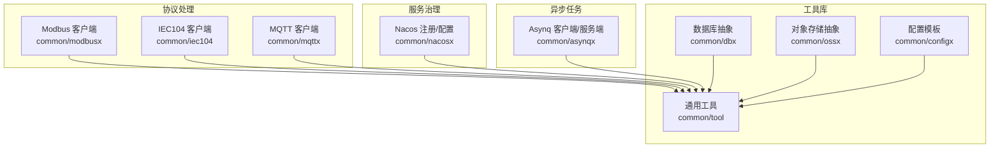
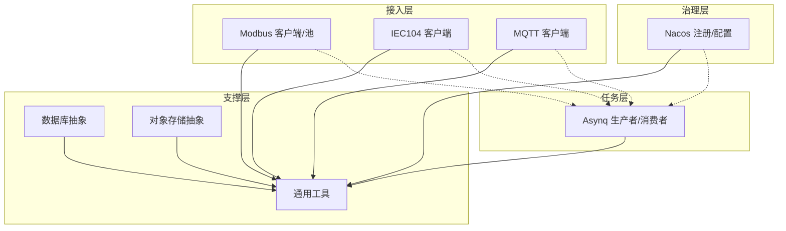
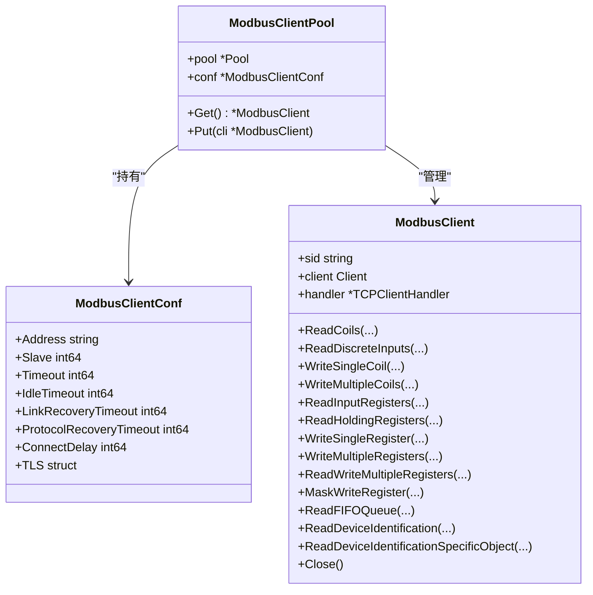
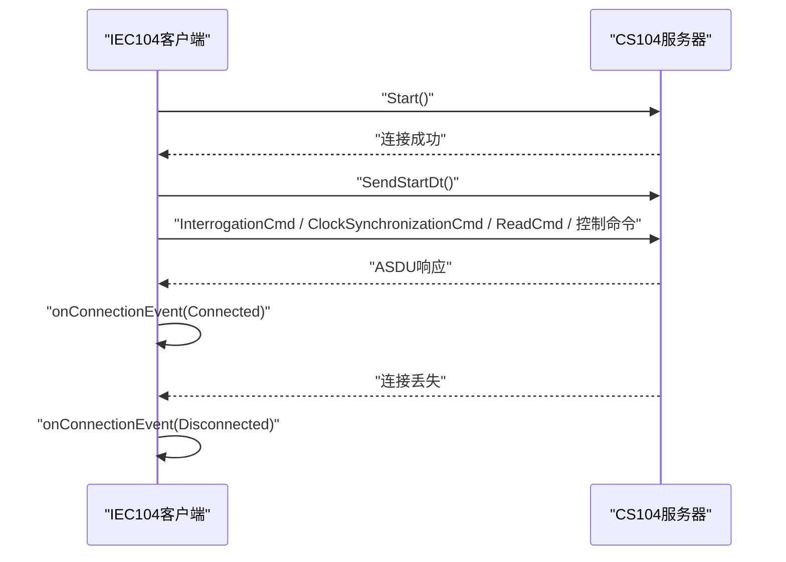
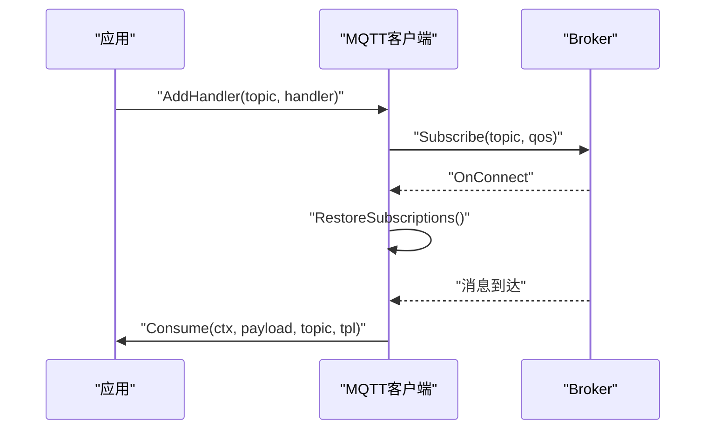
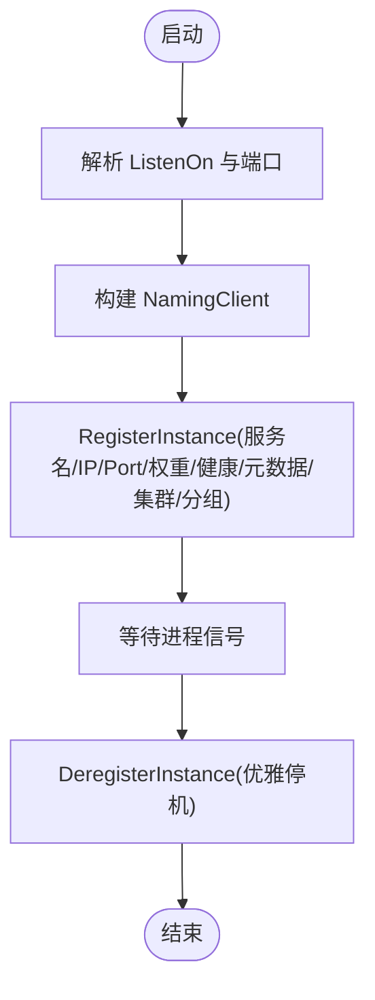
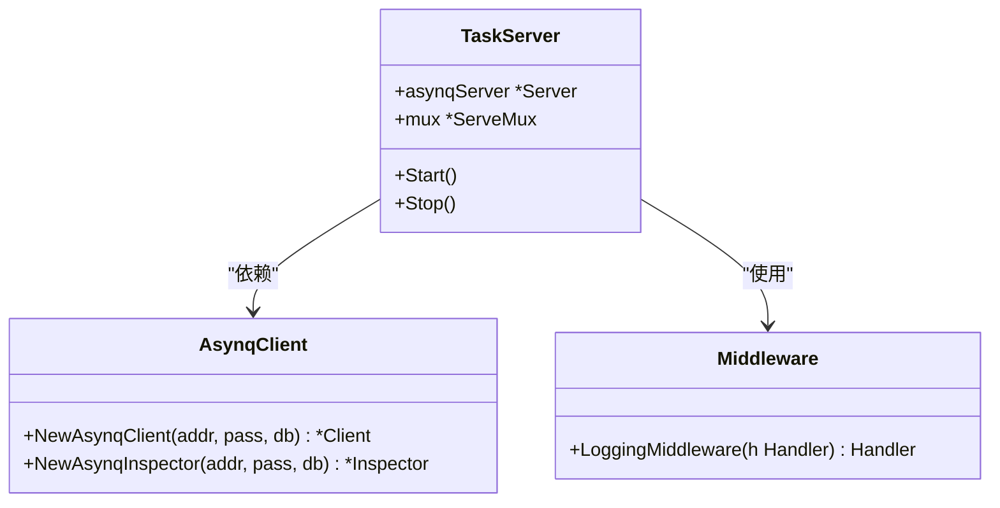
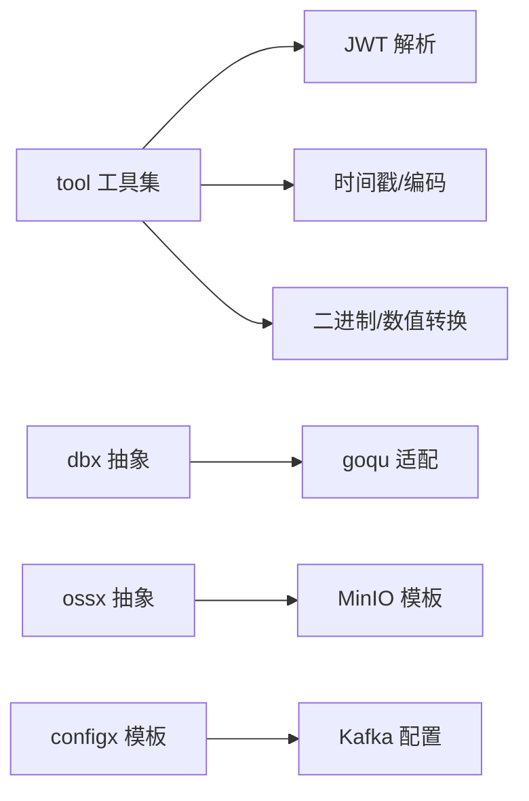
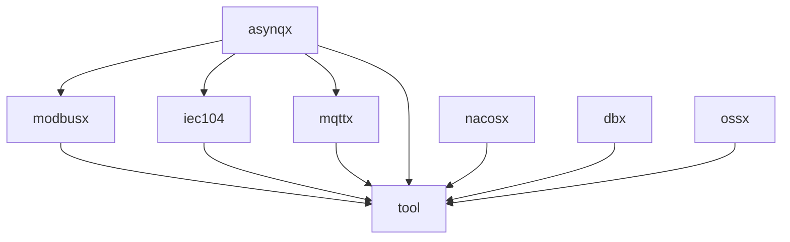

# 公共组件库

<cite>
**本文引用的文件**
- [common/modbusx/client.go](file://common/modbusx/client.go)
- [common/modbusx/config.go](file://common/modbusx/config.go)
- [common/iec104/client/core.go](file://common/iec104/client/core.go)
- [common/iec104/types/types.go](file://common/iec104/types/types.go)
- [common/mqttx/mqttx.go](file://common/mqttx/mqttx.go)
- [common/nacosx/register.go](file://common/nacosx/register.go)
- [common/nacosx/config.go](file://common/nacosx/config.go)
- [common/asynqx/asynqClient.go](file://common/asynqx/asynqClient.go)
- [common/asynqx/asynqTaskServer.go](file://common/asynqx/asynqTaskServer.go)
- [common/asynqx/tasktype.go](file://common/asynqx/tasktype.go)
- [common/tool/tool.go](file://common/tool/tool.go)
- [common/dbx/dbx.go](file://common/dbx/dbx.go)
- [common/ossx/ossx.go](file://common/ossx/ossx.go)
- [common/configx/kqConfig.go](file://common/configx/kqConfig.go)
</cite>

## 目录
1. [简介](#简介)
2. [项目结构](#项目结构)
3. [核心组件](#核心组件)
4. [架构总览](#架构总览)
5. [详细组件分析](#详细组件分析)
6. [依赖关系分析](#依赖关系分析)
7. [性能考量](#性能考量)
8. [故障排查指南](#故障排查指南)
9. [结论](#结论)
10. [附录](#附录)

## 简介
本文件系统性梳理 Zero-Service 的公共组件库，覆盖工业协议处理（Modbus、IEC104）、服务治理（Nacos 集成）、异步任务（Asynq）、工具库（配置、日志、加密、通用工具）、以及数据库与对象存储抽象。文档面向不同技术背景读者，既提供高层架构视图，也给出代码级细节、调用流程、最佳实践与排障建议，并给出如何基于这些组件快速开发新微服务与扩展功能的方法。

## 项目结构
公共组件主要位于 common 目录下，按功能域划分：
- 协议处理：modbusx、iec104、mqttx
- 服务治理：nacosx
- 异步任务：asynqx
- 工具库：tool、dbx、ossx、configx
- 其他：ctxdata、bytex、carbonx、imagex、mediax、powerwechatx、socketiox、ssex、wsx 等（按需使用）

**图表来源**
- [common/modbusx/client.go:1-218](file://common/modbusx/client.go#L1-L218)
- [common/iec104/client/core.go:1-446](file://common/iec104/client/core.go#L1-L446)
- [common/mqttx/mqttx.go:1-389](file://common/mqttx/mqttx.go#L1-L389)
- [common/nacosx/register.go:1-99](file://common/nacosx/register.go#L1-L99)
- [common/asynqx/asynqClient.go:1-31](file://common/asynqx/asynqClient.go#L1-L31)
- [common/asynqx/asynqTaskServer.go:1-87](file://common/asynqx/asynqTaskServer.go#L1-L87)
- [common/tool/tool.go:1-469](file://common/tool/tool.go#L1-L469)
- [common/dbx/dbx.go:1-155](file://common/dbx/dbx.go#L1-L155)
- [common/ossx/ossx.go:1-152](file://common/ossx/ossx.go#L1-L152)
- [common/configx/kqConfig.go:1-7](file://common/configx/kqConfig.go#L1-L7)

**章节来源**
- [common/modbusx/client.go:1-218](file://common/modbusx/client.go#L1-L218)
- [common/iec104/client/core.go:1-446](file://common/iec104/client/core.go#L1-L446)
- [common/mqttx/mqttx.go:1-389](file://common/mqttx/mqttx.go#L1-L389)
- [common/nacosx/register.go:1-99](file://common/nacosx/register.go#L1-L99)
- [common/asynqx/asynqClient.go:1-31](file://common/asynqx/asynqClient.go#L1-L31)
- [common/asynqx/asynqTaskServer.go:1-87](file://common/asynqx/asynqTaskServer.go#L1-L87)
- [common/tool/tool.go:1-469](file://common/tool/tool.go#L1-L469)
- [common/dbx/dbx.go:1-155](file://common/dbx/dbx.go#L1-L155)
- [common/ossx/ossx.go:1-152](file://common/ossx/ossx.go#L1-L152)
- [common/configx/kqConfig.go:1-7](file://common/configx/kqConfig.go#L1-L7)

## 核心组件
- Modbus 客户端与连接池：提供标准功能码封装、TLS 支持、连接池与会话日志。
- IEC104 客户端：封装 CS104 客户端，支持自动重连、命令发送、连接事件回调。
- MQTT 客户端：统一的发布/订阅、处理器注册、自动重连、链路追踪与指标统计。
- Nacos 集成：服务注册、反注册、监听生命周期、日志配置。
- Asynq 异步任务：生产者/消费者封装、队列配置、中间件与追踪。
- 工具库：JWT 解析、时间戳、Base62、二进制转换、上下文用户信息提取等。
- 数据库抽象：自动识别 MySQL/PostgreSQL/SQLite/TAOS 并提供 goqu 适配。
- 对象存储抽象：多厂商模板（当前最小实现为 MinIO），租户隔离与路径规则。

**章节来源**
- [common/modbusx/client.go:1-218](file://common/modbusx/client.go#L1-L218)
- [common/modbusx/config.go:1-125](file://common/modbusx/config.go#L1-L125)
- [common/iec104/client/core.go:1-446](file://common/iec104/client/core.go#L1-L446)
- [common/iec104/types/types.go:1-323](file://common/iec104/types/types.go#L1-L323)
- [common/mqttx/mqttx.go:1-389](file://common/mqttx/mqttx.go#L1-L389)
- [common/nacosx/register.go:1-99](file://common/nacosx/register.go#L1-L99)
- [common/nacosx/config.go:1-38](file://common/nacosx/config.go#L1-L38)
- [common/asynqx/asynqClient.go:1-31](file://common/asynqx/asynqClient.go#L1-L31)
- [common/asynqx/asynqTaskServer.go:1-87](file://common/asynqx/asynqTaskServer.go#L1-L87)
- [common/asynqx/tasktype.go:1-10](file://common/asynqx/tasktype.go#L1-L10)
- [common/tool/tool.go:1-469](file://common/tool/tool.go#L1-L469)
- [common/dbx/dbx.go:1-155](file://common/dbx/dbx.go#L1-L155)
- [common/ossx/ossx.go:1-152](file://common/ossx/ossx.go#L1-L152)
- [common/configx/kqConfig.go:1-7](file://common/configx/kqConfig.go#L1-L7)

## 架构总览
公共组件围绕“协议接入—服务治理—任务编排—工具支撑”四条主线协同工作，形成可插拔、可观测、可扩展的基础设施层。

**图表来源**
- [common/modbusx/client.go:1-218](file://common/modbusx/client.go#L1-L218)
- [common/iec104/client/core.go:1-446](file://common/iec104/client/core.go#L1-L446)
- [common/mqttx/mqttx.go:1-389](file://common/mqttx/mqttx.go#L1-L389)
- [common/nacosx/register.go:1-99](file://common/nacosx/register.go#L1-L99)
- [common/asynqx/asynqClient.go:1-31](file://common/asynqx/asynqClient.go#L1-L31)
- [common/asynqx/asynqTaskServer.go:1-87](file://common/asynqx/asynqTaskServer.go#L1-L87)
- [common/tool/tool.go:1-469](file://common/tool/tool.go#L1-L469)
- [common/dbx/dbx.go:1-155](file://common/dbx/dbx.go#L1-L155)
- [common/ossx/ossx.go:1-152](file://common/ossx/ossx.go#L1-L152)

## 详细组件分析

### Modbus 客户端与连接池
- 功能定位：对标准功能码进行封装，支持 TCP/TLS、超时与恢复策略、连接池与会话日志。
- 关键点：
  - 配置项涵盖地址、从站、超时、空闲、重连、协议恢复、TLS 证书与 CA。
  - 提供 MustNewModbusClient/NewModbusClient 两种构造方式。
  - 连接池管理多个客户端实例，带最大存活时间与回收策略。
  - 自定义日志器将地址、MD5、会话ID注入上下文，便于链路追踪。
- 使用建议：
  - 为不同设备/网段设置独立 modbusCode，便于池化管理。
  - 合理设置超时与恢复时间，避免频繁抖动。
  - 在高并发场景下使用连接池，注意资源上限与自动回收。

**图表来源**
- [common/modbusx/client.go:20-143](file://common/modbusx/client.go#L20-L143)
- [common/modbusx/config.go:32-61](file://common/modbusx/config.go#L32-L61)

**章节来源**
- [common/modbusx/client.go:1-218](file://common/modbusx/client.go#L1-L218)
- [common/modbusx/config.go:1-125](file://common/modbusx/config.go#L1-L125)

### IEC104 客户端
- 功能定位：CS104 客户端封装，支持自动重连、连接事件回调、命令发送（总召唤、时钟同步、读命令、控制命令等）。
- 关键点：
  - 配置校验、默认参数、日志开关与元数据。
  - 连接建立后发送 START_DT，断开时更新运行态。
  - 命令发送根据 TypeID 分派至具体 asdu 命令，统一参数与时间戳处理。
  - 提供连接事件枚举与回调通知。
- 使用建议：
  - 为每个远端服务器维护独立客户端实例。
  - 合理设置自动重连间隔，避免频繁抖动。
  - 在处理器中做好幂等与异常捕获。

**图表来源**
- [common/iec104/client/core.go:119-175](file://common/iec104/client/core.go#L119-L175)

**章节来源**
- [common/iec104/client/core.go:1-446](file://common/iec104/client/core.go#L1-L446)
- [common/iec104/types/types.go:1-323](file://common/iec104/types/types.go#L1-L323)

### MQTT 客户端
- 功能定位：统一的 MQTT 客户端，支持处理器注册、自动订阅、自动重连、链路追踪与指标统计。
- 关键点：
  - 配置包含 Broker、ClientID、用户名/密码、QoS、超时、心跳、初始订阅、事件映射。
  - 支持一次性 OnReady 回调、连接恢复订阅。
  - 消息处理包装器统一提取 OpenTelemetry 上下文、记录耗时、panic 捕获与指标上报。
  - 提供 Publish/Subscribe/Close 等核心方法。
- 使用建议：
  - 为不同业务域定义主题模板，统一处理器注册。
  - 合理设置 QoS 与超时，平衡可靠性与性能。
  - 在处理器中避免阻塞，必要时异步化。

**图表来源**
- [common/mqttx/mqttx.go:180-255](file://common/mqttx/mqttx.go#L180-L255)

**章节来源**
- [common/mqttx/mqttx.go:1-389](file://common/mqttx/mqttx.go#L1-L389)

### Nacos 集成
- 功能定位：服务注册与反注册、生命周期监听、日志配置。
- 关键点：
  - RegisterService 接收 Options，解析 ListenOn，注册实例（权重、健康、元数据、集群、分组）。
  - 通过进程关闭监听触发反注册。
  - 提供 LoggerConfig 与 SetUpLogger 初始化全局日志。
- 使用建议：
  - 在服务启动时完成注册，在退出时确保反注册。
  - 根据环境设置 Cluster/Group，区分测试/生产。

**图表来源**
- [common/nacosx/register.go:21-76](file://common/nacosx/register.go#L21-L76)
- [common/nacosx/config.go:23-37](file://common/nacosx/config.go#L23-L37)

**章节来源**
- [common/nacosx/register.go:1-99](file://common/nacosx/register.go#L1-L99)
- [common/nacosx/config.go:1-38](file://common/nacosx/config.go#L1-L38)

### Asynq 异步任务
- 功能定位：生产者/消费者封装、队列配置、中间件与追踪。
- 关键点：
  - NewAsynqClient/Inspector 快速创建 Redis 客户端与检查器。
  - NewTaskServer 封装 asynq.Server，内置失败判定、并发、队列优先级、日志。
  - LoggingMiddleware 统一记录任务类型、ID、耗时与错误。
  - StartAsynqProducerSpan/StartAsynqConsumerSpan 提供 OpenTelemetry 追踪。
  - 任务类型常量：延迟任务、触发器任务、调度器任务。
- 使用建议：
  - 明确任务类型命名规范，便于监控与排障。
  - 合理设置队列优先级与并发，避免热点队列阻塞。
  - 在处理器中实现幂等与重试策略。

**图表来源**
- [common/asynqx/asynqTaskServer.go:16-87](file://common/asynqx/asynqTaskServer.go#L16-L87)
- [common/asynqx/asynqClient.go:17-31](file://common/asynqx/asynqClient.go#L17-L31)
- [common/asynqx/tasktype.go:3-10](file://common/asynqx/tasktype.go#L3-L10)

**章节来源**
- [common/asynqx/asynqClient.go:1-31](file://common/asynqx/asynqClient.go#L1-L31)
- [common/asynqx/asynqTaskServer.go:1-87](file://common/asynqx/asynqTaskServer.go#L1-L87)
- [common/asynqx/tasktype.go:1-10](file://common/asynqx/tasktype.go#L1-L10)

### 工具组件
- 通用工具：JWT 解析（支持多密钥轮换）、金额转换、Base62 编码、短路径生成、二进制/十进制格式化、时间戳生成、上下文用户信息提取、二进制与布尔位互转、字节与整型数组互转等。
- 数据库抽象：自动识别数据库类型并创建连接；提供 goqu 适配器与日志桥接。
- 对象存储抽象：OssTemplate 接口与 MinIO 实现，支持桶/文件操作、签名、批量删除；租户模式与路径规则。
- 配置模板：KqConfig 用于 Kafka 配置结构。

**图表来源**
- [common/tool/tool.go:35-140](file://common/tool/tool.go#L35-L140)
- [common/dbx/dbx.go:46-138](file://common/dbx/dbx.go#L46-L138)
- [common/ossx/ossx.go:28-152](file://common/ossx/ossx.go#L28-L152)
- [common/configx/kqConfig.go:3-7](file://common/configx/kqConfig.go#L3-L7)

**章节来源**
- [common/tool/tool.go:1-469](file://common/tool/tool.go#L1-L469)
- [common/dbx/dbx.go:1-155](file://common/dbx/dbx.go#L1-L155)
- [common/ossx/ossx.go:1-152](file://common/ossx/ossx.go#L1-L152)
- [common/configx/kqConfig.go:1-7](file://common/configx/kqConfig.go#L1-L7)

## 依赖关系分析
- 组件内聚与耦合：
  - 协议组件（Modbus/IEC104/MQTT）均依赖工具库（日志、时间、追踪）。
  - Asynq 作为任务编排中心，被各业务模块通过生产者/消费者间接依赖。
  - Nacos 提供服务治理能力，贯穿注册/发现/配置。
  - dbx/ossx 作为基础设施，被上层业务逻辑复用。
- 外部依赖：
  - Modbus 客户端依赖第三方库；IEC104 客户端依赖 go-iecp5；MQTT 客户端依赖 eclipse/paho。
  - Asynq 依赖 Redis；Nacos 依赖 Nacos 服务端。
- 潜在循环依赖：当前文件间未见直接循环导入，但应避免在工具库中引入业务层。

**图表来源**
- [common/modbusx/client.go:1-18](file://common/modbusx/client.go#L1-L18)
- [common/iec104/client/core.go:3-17](file://common/iec104/client/core.go#L3-L17)
- [common/mqttx/mqttx.go:3-23](file://common/mqttx/mqttx.go#L3-L23)
- [common/asynqx/asynqClient.go:3-11](file://common/asynqx/asynqClient.go#L3-L11)
- [common/nacosx/register.go:3-19](file://common/nacosx/register.go#L3-L19)
- [common/dbx/dbx.go:3-20](file://common/dbx/dbx.go#L3-L20)
- [common/ossx/ossx.go:3-15](file://common/ossx/ossx.go#L3-L15)

**章节来源**
- [common/modbusx/client.go:1-218](file://common/modbusx/client.go#L1-L218)
- [common/iec104/client/core.go:1-446](file://common/iec104/client/core.go#L1-L446)
- [common/mqttx/mqttx.go:1-389](file://common/mqttx/mqttx.go#L1-L389)
- [common/asynqx/asynqClient.go:1-31](file://common/asynqx/asynqClient.go#L1-L31)
- [common/nacosx/register.go:1-99](file://common/nacosx/register.go#L1-L99)
- [common/dbx/dbx.go:1-155](file://common/dbx/dbx.go#L1-L155)
- [common/ossx/ossx.go:1-152](file://common/ossx/ossx.go#L1-L152)

## 性能考量
- 连接池与超时：
  - Modbus 连接池设置最大存活时间，避免资源泄露；合理配置超时与恢复时间，降低抖动。
  - MQTT/IEC104/Nacos 客户端均具备自动重连与恢复策略，需结合业务场景调优。
- 并发与队列：
  - Asynq 通过队列优先级与并发度控制任务吞吐；建议将高优先级任务与低优先级任务分离。
- 日志与追踪：
  - 统一使用 go-zero 日志与 OpenTelemetry，避免高频日志影响性能；对关键路径打点。
- 数据库与对象存储：
  - dbx 自动识别数据库类型并选择合适驱动；ossx 模板化减少重复初始化成本。

[本节为通用指导，无需列出具体文件来源]

## 故障排查指南
- Modbus
  - 症状：连接失败/超时
  - 排查：确认 Address/Slave/Timeout/TLS 配置；查看会话日志中的 addressMd5 与 session 字段。
  - 参考
    - [common/modbusx/client.go:107-143](file://common/modbusx/client.go#L107-L143)
    - [common/modbusx/config.go:32-61](file://common/modbusx/config.go#L32-L61)
- IEC104
  - 症状：无法连接/断线
  - 排查：检查 Host/Port/自动重连间隔；关注连接事件回调；确认服务器是否发送 START_DT。
  - 参考
    - [common/iec104/client/core.go:119-175](file://common/iec104/client/core.go#L119-L175)
- MQTT
  - 症状：订阅失败/消息未达
  - 排查：确认 Broker/ClientID/QoS/超时；检查 OnConnect/OnConnectionLost 回调；查看处理器是否注册。
  - 参考
    - [common/mqttx/mqttx.go:137-178](file://common/mqttx/mqttx.go#L137-L178)
- Nacos
  - 症状：注册失败/反注册异常
  - 排查：核对 ListenOn、服务名、集群/分组、元数据；检查日志级别与目录。
  - 参考
    - [common/nacosx/register.go:21-76](file://common/nacosx/register.go#L21-L76)
    - [common/nacosx/config.go:23-37](file://common/nacosx/config.go#L23-L37)
- Asynq
  - 症状：任务积压/失败
  - 排查：查看队列优先级与并发；检查 LoggingMiddleware 输出；确认 Redis 连通性。
  - 参考
    - [common/asynqx/asynqTaskServer.go:39-87](file://common/asynqx/asynqTaskServer.go#L39-L87)
- 工具与数据库
  - 症状：金额转换异常/二进制转换错误
  - 排查：确认输入参数类型与边界；核对字节序与位掩码。
  - 参考
    - [common/tool/tool.go:70-140](file://common/tool/tool.go#L70-L140)
    - [common/dbx/dbx.go:31-64](file://common/dbx/dbx.go#L31-L64)

**章节来源**
- [common/modbusx/client.go:107-143](file://common/modbusx/client.go#L107-L143)
- [common/modbusx/config.go:32-61](file://common/modbusx/config.go#L32-L61)
- [common/iec104/client/core.go:119-175](file://common/iec104/client/core.go#L119-L175)
- [common/mqttx/mqttx.go:137-178](file://common/mqttx/mqttx.go#L137-L178)
- [common/nacosx/register.go:21-76](file://common/nacosx/register.go#L21-L76)
- [common/nacosx/config.go:23-37](file://common/nacosx/config.go#L23-L37)
- [common/asynqx/asynqTaskServer.go:39-87](file://common/asynqx/asynqTaskServer.go#L39-L87)
- [common/tool/tool.go:70-140](file://common/tool/tool.go#L70-L140)
- [common/dbx/dbx.go:31-64](file://common/dbx/dbx.go#L31-L64)

## 结论
公共组件库以“协议—治理—任务—工具”为主线，提供了工业级协议接入、服务治理、异步任务编排与通用工具支撑。通过连接池、自动重连、OpenTelemetry 追踪与日志体系，组件具备良好的稳定性与可观测性。建议在新微服务开发中优先复用这些组件，遵循命名规范与配置约定，确保一致性与可维护性。

[本节为总结性内容，无需列出具体文件来源]

## 附录
- 最佳实践
  - 协议接入：为每类设备/网段建立独立连接池与配置；统一错误处理与告警。
  - 任务编排：明确任务类型与队列优先级；在处理器中实现幂等与重试。
  - 服务治理：在启动阶段注册、退出阶段反注册；合理设置集群/分组与元数据。
  - 工具使用：统一时间戳与编码策略；在跨模块传递数据时使用 Protobuf 或 JSON 规范。
- 扩展建议
  - Modbus：支持更多功能码与广播；增加批量读写优化。
  - IEC104：扩展更多 ASDU 类型与点表映射；增强异常诊断。
  - MQTT：支持多 Broker 负载均衡与 TLS；增加主题路由规则。
  - Asynq：引入任务依赖与 DAG；增强可视化面板。
  - 工具库：补充更多加密算法与压缩工具；完善国际化与本地化。

[本节为通用指导，无需列出具体文件来源]