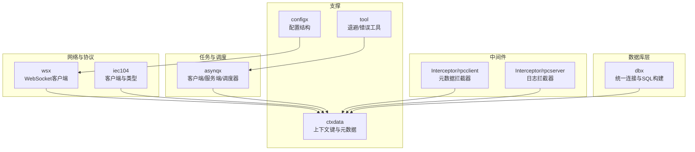
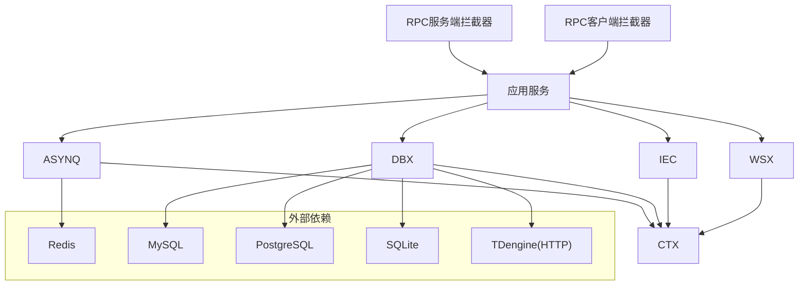
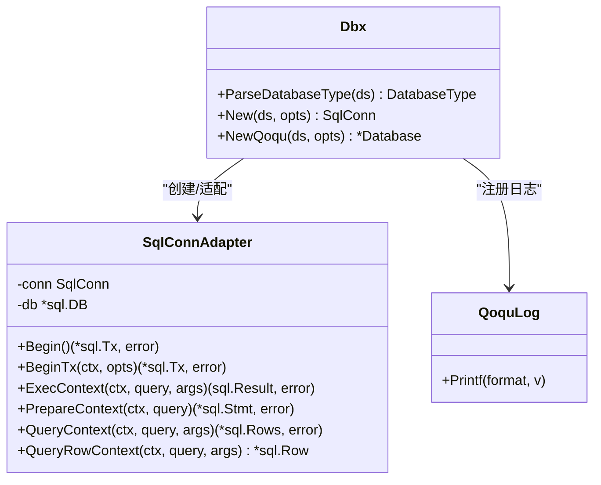
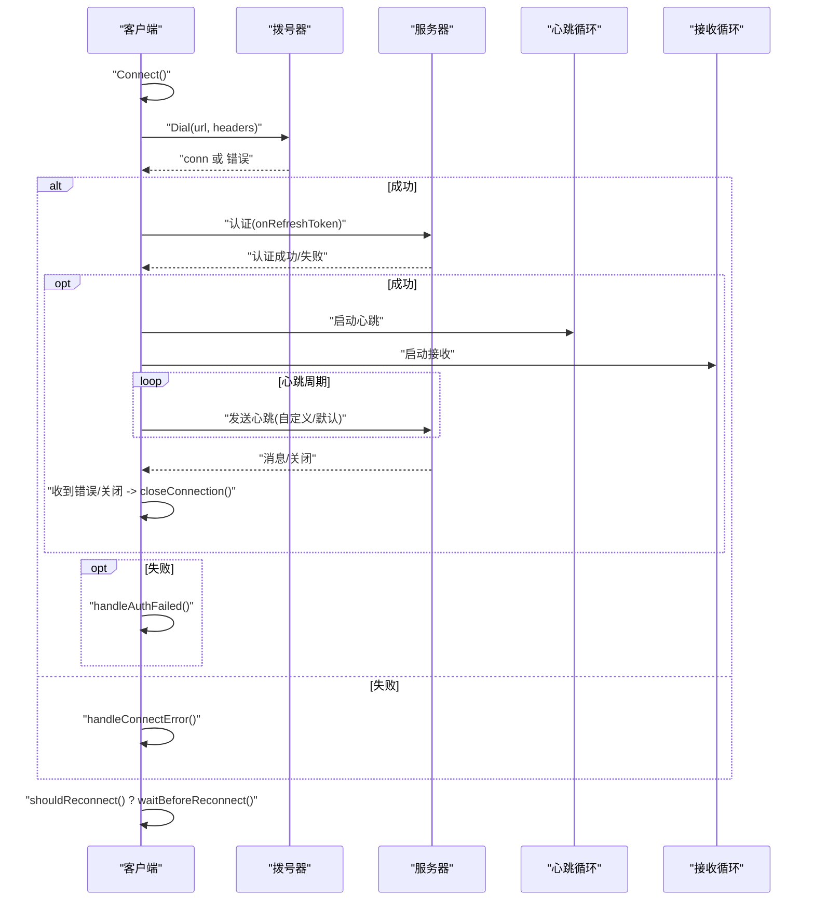
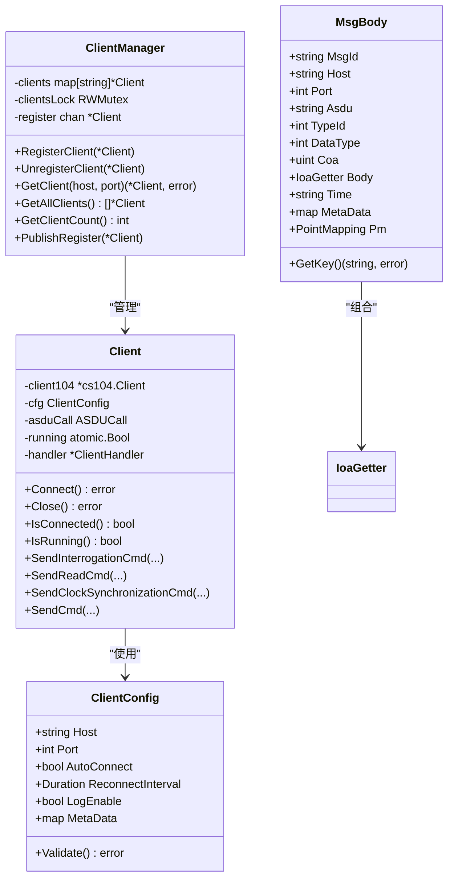
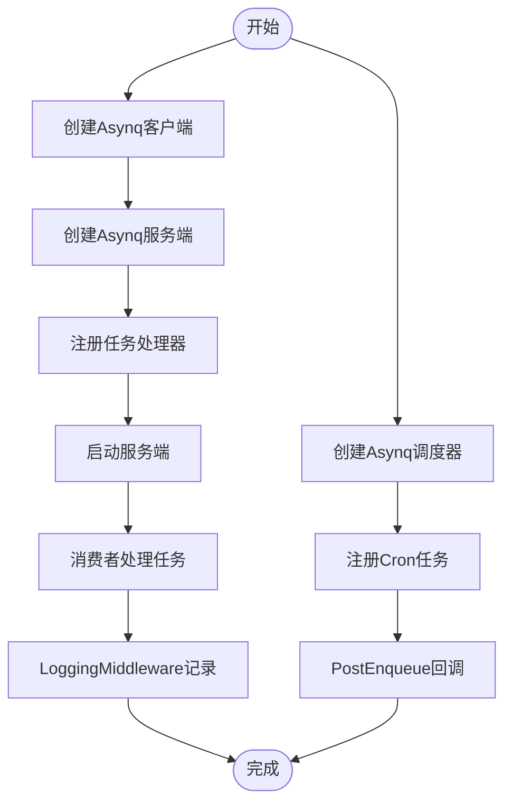
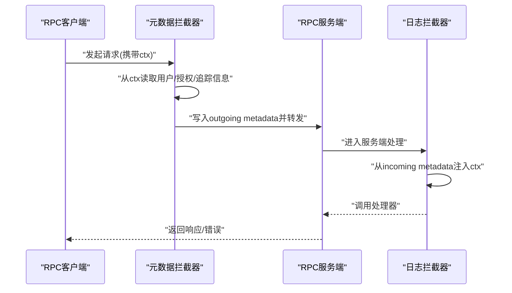
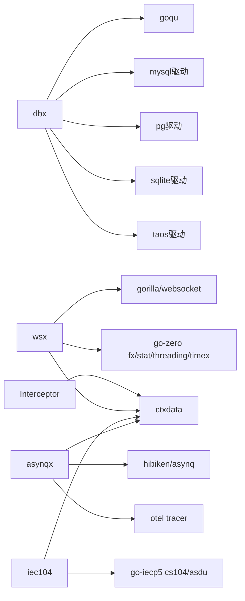

# 公共组件库

<cite>
**本文引用的文件**   
- [common/dbx/dbx.go](file://common/dbx/dbx.go)
- [common/dbx/sqlitesql.go](file://common/dbx/sqlitesql.go)
- [common/dbx/taossql.go](file://common/dbx/taossql.go)
- [common/wsx/client.go](file://common/wsx/client.go)
- [common/iec104/client/core.go](file://common/iec104/client/core.go)
- [common/iec104/client/clientmanager.go](file://common/iec104/client/clientmanager.go)
- [common/iec104/types/types.go](file://common/iec104/types/types.go)
- [common/asynqx/asynqClient.go](file://common/asynqx/asynqClient.go)
- [common/asynqx/asynqTaskServer.go](file://common/asynqx/asynqTaskServer.go)
- [common/asynqx/asynqSchedulerServer.go](file://common/asynqx/asynqSchedulerServer.go)
- [common/Interceptor/rpcclient/metadataInterceptor.go](file://common/Interceptor/rpcclient/metadataInterceptor.go)
- [common/Interceptor/rpcserver/loggerInterceptor.go](file://common/Interceptor/rpcserver/loggerInterceptor.go)
- [common/ctxdata/ctxData.go](file://common/ctxdata/ctxData.go)
- [common/configx/kqConfig.go](file://common/configx/kqConfig.go)
- [common/tool/backoff.go](file://common/tool/backoff.go)
- [common/tool/errorutil.go](file://common/tool/errorutil.go)
- [common/wsx/client.go](file://common/wsx/client.go)
</cite>

## 目录
1. [简介](#简介)
2. [项目结构](#项目结构)
3. [核心组件](#核心组件)
4. [架构总览](#架构总览)
5. [组件详解](#组件详解)
6. [依赖关系分析](#依赖关系分析)
7. [性能与可靠性](#性能与可靠性)
8. [故障排查指南](#故障排查指南)
9. [结论](#结论)
10. [附录](#附录)

## 简介
本文件为 zero-service 公共组件库的技术参考文档，面向开发者与运维人员，系统性介绍以下核心能力：
- 数据库抽象层（dbx）：统一数据访问接口、连接池与事务适配、SQL 构建器集成
- WebSocket 客户端（wsx）：高可用连接管理、认证与心跳、消息处理与错误恢复
- IEC104 协议处理组件：客户端管理、协议解析与设备通信
- 任务调度系统（asynqx）：队列实现、调度器设计与监控中间件
- 拦截器系统（Interceptor）：RPC 与 HTTP 中间件（元数据透传与日志）

文档提供设计理念、实现原理、使用方法、配置项、扩展接口与集成示例，帮助快速正确地使用与扩展这些组件。

## 项目结构
公共组件主要位于 common 目录下，按功能域划分清晰：
- dbx：数据库抽象与 SQL 构建器适配
- wsx：WebSocket 客户端
- iec104：IEC104 客户端与类型定义
- asynqx：异步任务队列客户端与服务端封装
- Interceptor：RPC 客户端/服务端拦截器
- ctxdata：上下文与 gRPC 元数据键常量
- configx：通用配置结构
- tool：通用工具（退避策略、错误转换）
- 其他：socketiox、mqttx、modbusx 等不在本次目标范围内

**章节来源**
- [common/dbx/dbx.go:1-155](file://common/dbx/dbx.go#L1-L155)
- [common/wsx/client.go:1-895](file://common/wsx/client.go#L1-L895)
- [common/iec104/client/core.go:1-446](file://common/iec104/client/core.go#L1-L446)
- [common/asynqx/asynqClient.go:1-31](file://common/asynqx/asynqClient.go#L1-L31)
- [common/Interceptor/rpcclient/metadataInterceptor.go:1-56](file://common/Interceptor/rpcclient/metadataInterceptor.go#L1-L56)
- [common/Interceptor/rpcserver/loggerInterceptor.go:1-45](file://common/Interceptor/rpcserver/loggerInterceptor.go#L1-L45)
- [common/ctxdata/ctxData.go:1-76](file://common/ctxdata/ctxData.go#L1-L76)
- [common/configx/kqConfig.go:1-7](file://common/configx/kqConfig.go#L1-L7)
- [common/tool/backoff.go:1-41](file://common/tool/backoff.go#L1-L41)
- [common/tool/errorutil.go:1-91](file://common/tool/errorutil.go#L1-L91)

## 核心组件
- 数据库抽象层（dbx）
  - 自动识别数据源类型（MySQL、PostgreSQL、SQLite、TDengine/HTTP）
  - 提供统一连接创建与适配器，支持原生 sql.DB 与 goqu SQL 构建器
  - 提供事务 Begin/BeginTx 与上下文查询/执行接口
- WebSocket 客户端（wsx）
  - 状态机：断开/连接中/已连接/已认证/认证失败/重连中
  - 支持心跳、认证超时、Token 刷新、指数退避重连、消息回调与指标统计
- IEC104 协议处理
  - 客户端：连接、自动重连、命令发送（总召、读、时钟同步、控制等）、事件回调
  - 客户端管理器：注册/注销、统计、并发安全
  - 类型定义：消息体、点映射、各类 ASDU 信息体
- 任务调度系统（asynqx）
  - 客户端：Redis 连接、生产者 Span
  - 任务服务端：并发、队列优先级、日志与中间件
  - 调度器：Cron 调度、保留期、PostEnqueue 回调
- 拦截器系统（Interceptor）
  - RPC 客户端：将上下文中的用户/授权/追踪信息注入 outgoing metadata
  - RPC 服务端：从 incoming metadata 解析并注入到上下文，统一错误日志

**章节来源**
- [common/dbx/dbx.go:46-138](file://common/dbx/dbx.go#L46-L138)
- [common/wsx/client.go:33-81](file://common/wsx/client.go#L33-L81)
- [common/iec104/client/core.go:48-117](file://common/iec104/client/core.go#L48-L117)
- [common/iec104/client/clientmanager.go:11-27](file://common/iec104/client/clientmanager.go#L11-L27)
- [common/asynqx/asynqClient.go:17-30](file://common/asynqx/asynqClient.go#L17-L30)
- [common/asynqx/asynqTaskServer.go:16-63](file://common/asynqx/asynqTaskServer.go#L16-L63)
- [common/asynqx/asynqSchedulerServer.go:11-52](file://common/asynqx/asynqSchedulerServer.go#L11-L52)
- [common/Interceptor/rpcclient/metadataInterceptor.go:11-32](file://common/Interceptor/rpcclient/metadataInterceptor.go#L11-L32)
- [common/Interceptor/rpcserver/loggerInterceptor.go:12-44](file://common/Interceptor/rpcserver/loggerInterceptor.go#L12-L44)

## 架构总览
公共组件围绕“统一抽象 + 高可用 + 可观测”的设计目标协作：
- 抽象层（dbx、asynqx）屏蔽底层差异，提供一致接口
- 网络与协议层（wsx、iec104）提供稳定连接与消息处理
- 中间件层（Interceptor）贯穿 RPC 请求链路，统一上下文与日志
- 工具层（tool、ctxdata、configx）提供通用能力与配置

**图表来源**
- [common/dbx/dbx.go:46-138](file://common/dbx/dbx.go#L46-L138)
- [common/wsx/client.go:302-445](file://common/wsx/client.go#L302-L445)
- [common/iec104/client/core.go:119-147](file://common/iec104/client/core.go#L119-L147)
- [common/asynqx/asynqClient.go:17-30](file://common/asynqx/asynqClient.go#L17-L30)
- [common/Interceptor/rpcclient/metadataInterceptor.go:11-32](file://common/Interceptor/rpcclient/metadataInterceptor.go#L11-L32)
- [common/Interceptor/rpcserver/loggerInterceptor.go:12-44](file://common/Interceptor/rpcserver/loggerInterceptor.go#L12-L44)

## 组件详解

### 数据库抽象层（dbx）
- 设计理念
  - 依据数据源 URL 自动识别数据库类型，统一封装连接与事务
  - 对接 goqu SQL 构建器，提供日志桥接与方言注册
- 实现要点
  - ParseDatabaseType：根据前缀/关键字判定类型
  - New/NewQoqu：按类型创建连接或 goqu 数据库实例
  - SqlConnAdapter：将 sqlx.SqlConn 适配为 sql.DB，供 goqu 使用
  - QoquLog：将 goqu 日志桥接到 logx
- 使用建议
  - 在多数据库场景下优先使用 NewQoqu 获取统一的 SQL 构建体验
  - 事务处理优先使用 sqlx.SqlConn 或 Adapter.Begin/BeginTx

**图表来源**
- [common/dbx/dbx.go:31-138](file://common/dbx/dbx.go#L31-L138)
- [common/dbx/sqlitesql.go:10-12](file://common/dbx/sqlitesql.go#L10-L12)
- [common/dbx/taossql.go:11-13](file://common/dbx/taossql.go#L11-L13)

**章节来源**
- [common/dbx/dbx.go:31-155](file://common/dbx/dbx.go#L31-L155)
- [common/dbx/sqlitesql.go:1-13](file://common/dbx/sqlitesql.go#L1-L13)
- [common/dbx/taossql.go:1-14](file://common/dbx/taossql.go#L1-L14)

### WebSocket 客户端（wsx）
- 设计理念
  - 状态机驱动的连接生命周期管理；可插拔的消息回调、心跳与 Token 刷新
  - 支持认证超时、指数退避重连、读写超时与 Pong 自动续期
- 关键流程
  - 连接管理循环：拨号 → 认证（带超时）→ 心跳/接收 → 断开清理 → 重连决策
  - 发送路径：设置写超时 → 文本/JSON 发送 → 失败触发关闭与重连
  - Token 刷新：周期性触发回调，失败可选择关闭连接触发重连
- 配置项
  - 心跳间隔、重连间隔、最大重连次数、拨号超时、Token 刷新间隔、认证超时、指数退避与最大重连间隔
- 扩展接口
  - OnMessage、OnStatusChange、OnRefreshToken、OnHeartbeat、ReconnectOnAuthFailed、ReconnectOnTokenExpire
- 使用示例（步骤）
  - 构造 Config 与 ClientOptions
  - NewClient/ MustNewClient 创建客户端
  - SetHeader/WithOnMessage/WithOnStatusChange 等选项注入
  - Connect 启动，Send/SendJSON 发送消息
  - Close 安全关闭并等待 goroutine 退出

**图表来源**
- [common/wsx/client.go:386-445](file://common/wsx/client.go#L386-L445)
- [common/wsx/client.go:448-508](file://common/wsx/client.go#L448-L508)
- [common/wsx/client.go:538-577](file://common/wsx/client.go#L538-L577)
- [common/wsx/client.go:579-633](file://common/wsx/client.go#L579-L633)
- [common/wsx/client.go:640-697](file://common/wsx/client.go#L640-L697)
- [common/wsx/client.go:699-774](file://common/wsx/client.go#L699-L774)
- [common/wsx/client.go:776-823](file://common/wsx/client.go#L776-L823)
- [common/wsx/client.go:825-866](file://common/wsx/client.go#L825-L866)

**章节来源**
- [common/wsx/client.go:23-94](file://common/wsx/client.go#L23-L94)
- [common/wsx/client.go:109-205](file://common/wsx/client.go#L109-L205)
- [common/wsx/client.go:208-275](file://common/wsx/client.go#L208-L275)
- [common/wsx/client.go:302-445](file://common/wsx/client.go#L302-L445)
- [common/wsx/client.go:448-508](file://common/wsx/client.go#L448-L508)
- [common/wsx/client.go:538-577](file://common/wsx/client.go#L538-L577)
- [common/wsx/client.go:579-633](file://common/wsx/client.go#L579-L633)
- [common/wsx/client.go:640-697](file://common/wsx/client.go#L640-L697)
- [common/wsx/client.go:699-774](file://common/wsx/client.go#L699-L774)
- [common/wsx/client.go:776-823](file://common/wsx/client.go#L776-L823)
- [common/wsx/client.go:825-866](file://common/wsx/client.go#L825-L866)

### IEC104 协议处理组件
- 客户端（client）
  - 配置校验、连接事件回调、自动重连与重连间隔
  - 命令发送封装：总召唤、计数器召唤、时钟同步、读、复位进程、测试、各类控制命令
  - 运行状态与连接状态查询
- 客户端管理器（ClientManager）
  - 并发安全注册/注销/查询
  - 统计打印：每分钟统计总数、已连接、未连接
- 类型定义（types）
  - 消息体、点映射、各类 ASDU 信息体（单点、双点、测量值、步位置、位串、累计量、保护事件等）
  - IoaGetter 接口统一信息对象地址访问

**图表来源**
- [common/iec104/client/core.go:19-117](file://common/iec104/client/core.go#L19-L117)
- [common/iec104/client/core.go:149-180](file://common/iec104/client/core.go#L149-L180)
- [common/iec104/client/core.go:182-231](file://common/iec104/client/core.go#L182-L231)
- [common/iec104/client/clientmanager.go:11-27](file://common/iec104/client/clientmanager.go#L11-L27)
- [common/iec104/types/types.go:11-58](file://common/iec104/types/types.go#L11-L58)

**章节来源**
- [common/iec104/client/core.go:19-446](file://common/iec104/client/core.go#L19-L446)
- [common/iec104/client/clientmanager.go:11-145](file://common/iec104/client/clientmanager.go#L11-L145)
- [common/iec104/types/types.go:11-323](file://common/iec104/types/types.go#L11-L323)

### 任务调度系统（asynqx）
- 客户端（asynqClient）
  - Redis 客户端封装、Inspector、生产者 Span 注入
- 任务服务端（asynqTaskServer）
  - Server 配置：并发、队列优先级、日志、超时参数
  - LoggingMiddleware：统一记录处理耗时与错误
- 调度器（asynqSchedulerServer）
  - Scheduler 配置：时区、PostEnqueue 回调、日志
  - Cron 注册示例与保留期设置

**图表来源**
- [common/asynqx/asynqClient.go:17-30](file://common/asynqx/asynqClient.go#L17-L30)
- [common/asynqx/asynqTaskServer.go:16-87](file://common/asynqx/asynqTaskServer.go#L16-L87)
- [common/asynqx/asynqSchedulerServer.go:11-62](file://common/asynqx/asynqSchedulerServer.go#L11-L62)

**章节来源**
- [common/asynqx/asynqClient.go:17-31](file://common/asynqx/asynqClient.go#L17-L31)
- [common/asynqx/asynqTaskServer.go:16-87](file://common/asynqx/asynqTaskServer.go#L16-L87)
- [common/asynqx/asynqSchedulerServer.go:11-62](file://common/asynqx/asynqSchedulerServer.go#L11-L62)

### 拦截器系统（Interceptor）
- RPC 客户端拦截器（metadataInterceptor）
  - 将用户ID、用户名、部门编码、Authorization、TraceId 等注入 outgoing metadata
- RPC 服务端拦截器（loggerInterceptor）
  - 从 incoming metadata 解析并注入到上下文，统一错误日志输出

**图表来源**
- [common/Interceptor/rpcclient/metadataInterceptor.go:11-32](file://common/Interceptor/rpcclient/metadataInterceptor.go#L11-L32)
- [common/Interceptor/rpcserver/loggerInterceptor.go:12-44](file://common/Interceptor/rpcserver/loggerInterceptor.go#L12-L44)
- [common/ctxdata/ctxData.go:9-24](file://common/ctxdata/ctxData.go#L9-L24)

**章节来源**
- [common/Interceptor/rpcclient/metadataInterceptor.go:11-56](file://common/Interceptor/rpcclient/metadataInterceptor.go#L11-L56)
- [common/Interceptor/rpcserver/loggerInterceptor.go:12-45](file://common/Interceptor/rpcserver/loggerInterceptor.go#L12-L45)
- [common/ctxdata/ctxData.go:1-76](file://common/ctxdata/ctxData.go#L1-L76)

## 依赖关系分析
- 组件内聚与耦合
  - dbx 与 asynqx 低耦合，分别面向存储与任务；均通过统一的 logx 输出
  - wsx 与 iec104 通过 ctxdata 的 Header 键进行上下文透传
  - Interceptor 与 ctxdata 强关联，贯穿 RPC 请求链
- 外部依赖
  - dbx：goqu、go-sql-driver/mysql、lib/pq、modernc.org/sqlite、taosRestful
  - wsx：gorilla/websocket、go-zero fx/stat/threading/timex
  - asynqx：hibiken/asynq、otel tracing
  - iec104：go-iecp5 cs104/asdu
- 循环依赖
  - 未发现直接循环依赖；各模块通过接口与常量键解耦

**图表来源**
- [common/dbx/dbx.go:3-20](file://common/dbx/dbx.go#L3-L20)
- [common/wsx/client.go:3-21](file://common/wsx/client.go#L3-L21)
- [common/asynqx/asynqClient.go:3-11](file://common/asynqx/asynqClient.go#L3-L11)
- [common/iec104/client/core.go:3-17](file://common/iec104/client/core.go#L3-L17)
- [common/Interceptor/rpcclient/metadataInterceptor.go:3-9](file://common/Interceptor/rpcclient/metadataInterceptor.go#L3-L9)
- [common/Interceptor/rpcserver/loggerInterceptor.go:3-10](file://common/Interceptor/rpcserver/loggerInterceptor.go#L3-L10)
- [common/ctxdata/ctxData.go:3-7](file://common/ctxdata/ctxData.go#L3-L7)

**章节来源**
- [common/dbx/dbx.go:3-20](file://common/dbx/dbx.go#L3-L20)
- [common/wsx/client.go:3-21](file://common/wsx/client.go#L3-L21)
- [common/asynqx/asynqClient.go:3-11](file://common/asynqx/asynqClient.go#L3-L11)
- [common/iec104/client/core.go:3-17](file://common/iec104/client/core.go#L3-L17)
- [common/Interceptor/rpcclient/metadataInterceptor.go:3-9](file://common/Interceptor/rpcclient/metadataInterceptor.go#L3-L9)
- [common/Interceptor/rpcserver/loggerInterceptor.go:3-10](file://common/Interceptor/rpcserver/loggerInterceptor.go#L3-L10)
- [common/ctxdata/ctxData.go:3-7](file://common/ctxdata/ctxData.go#L3-L7)

## 性能与可靠性
- 连接与池化
  - dbx 通过 sqlx/redis 客户端管理连接；asynqx 服务端配置并发与队列优先级
- 退避与重试
  - wsx 支持指数退避与最大间隔；tool/backoff 提供通用退避策略
- 可观测性
  - wsx metrics 统计、asynqx LoggingMiddleware 记录耗时与错误
- 资源释放
  - wsx Close 安全关闭连接、停止定时器、等待 goroutine 退出

**章节来源**
- [common/wsx/client.go:598-633](file://common/wsx/client.go#L598-L633)
- [common/tool/backoff.go:9-41](file://common/tool/backoff.go#L9-L41)
- [common/asynqx/asynqTaskServer.go:73-87](file://common/asynqx/asynqTaskServer.go#L73-L87)
- [common/wsx/client.go:825-866](file://common/wsx/client.go#L825-L866)

## 故障排查指南
- 数据库连接问题
  - 检查 ParseDatabaseType 判定是否正确；确认驱动导入与数据源格式
  - 使用 NewQoqu 并观察 QoquLog 输出定位 SQL 问题
- WebSocket 连接失败
  - 查看拨号错误与响应体内容；关注认证超时与重连次数
  - 检查 OnRefreshToken 返回与 Token 刷新策略
- IEC104 通信异常
  - 关注连接事件回调与自动重连配置；检查命令发送参数与 ASDU 类型匹配
- 任务处理失败
  - 通过 LoggingMiddleware 查看错误堆栈与耗时；检查队列优先级与并发配置
- RPC 上下文缺失
  - 确认拦截器是否正确注入/提取 Header；核对 ctxdata 键名大小写

**章节来源**
- [common/dbx/dbx.go:31-44](file://common/dbx/dbx.go#L31-L44)
- [common/wsx/client.go:448-487](file://common/wsx/client.go#L448-L487)
- [common/wsx/client.go:538-577](file://common/wsx/client.go#L538-L577)
- [common/iec104/client/core.go:119-147](file://common/iec104/client/core.go#L119-L147)
- [common/asynqx/asynqTaskServer.go:73-87](file://common/asynqx/asynqTaskServer.go#L73-L87)
- [common/Interceptor/rpcclient/metadataInterceptor.go:11-32](file://common/Interceptor/rpcclient/metadataInterceptor.go#L11-L32)
- [common/Interceptor/rpcserver/loggerInterceptor.go:12-44](file://common/Interceptor/rpcserver/loggerInterceptor.go#L12-L44)

## 结论
本公共组件库以“统一抽象 + 高可用 + 可观测”为核心，覆盖数据库、网络、协议、任务与中间件的关键能力。通过清晰的接口与完善的错误处理、可观测性与扩展点，开发者可以快速集成并稳定运行各类业务场景。

## 附录
- 配置与扩展清单
  - dbx：数据源 URL、驱动导入、goqu 方言注册
  - wsx：Config 与 ClientOptions、回调注入、指标统计
  - iec104：ClientConfig、命令封装、ClientManager 统计
  - asynqx：客户端/服务端/调度器配置、中间件与 Span
  - Interceptor：ctxdata 键与拦截器注入
- 常用工具
  - tool/backoff：指数退避策略
  - tool/errorutil：基于 protobuf Code 的错误转换

**章节来源**
- [common/configx/kqConfig.go:1-7](file://common/configx/kqConfig.go#L1-L7)
- [common/tool/backoff.go:9-41](file://common/tool/backoff.go#L9-L41)
- [common/tool/errorutil.go:12-91](file://common/tool/errorutil.go#L12-L91)