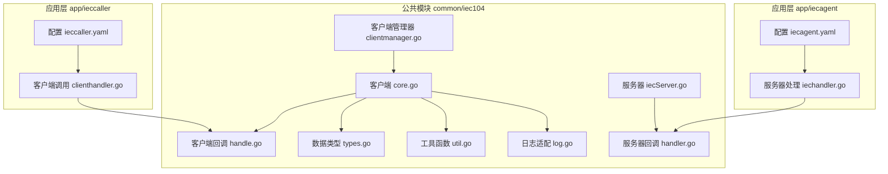
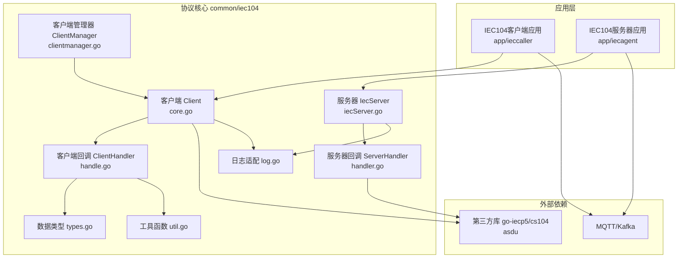
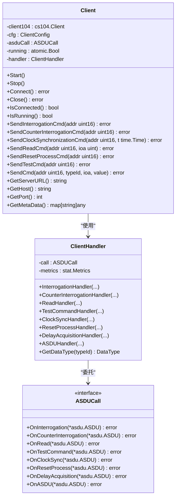
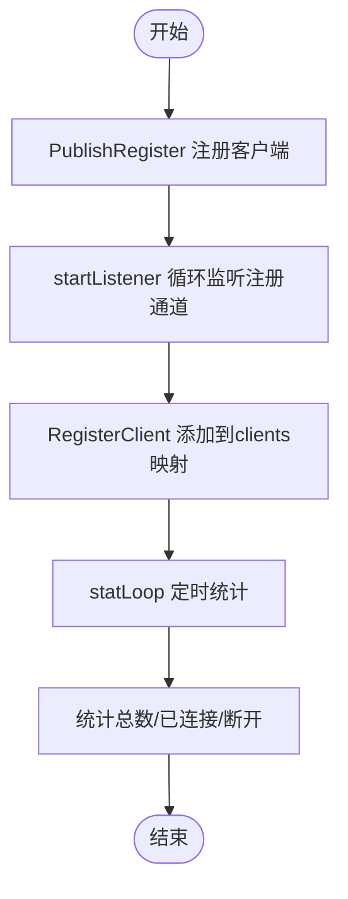
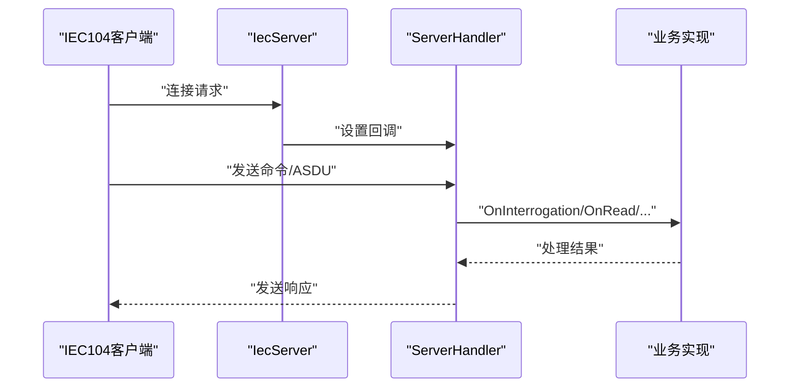
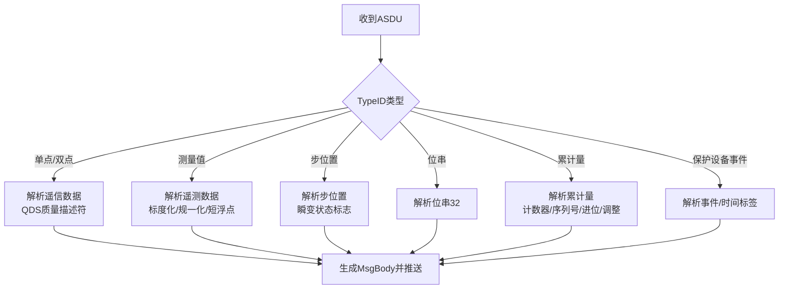
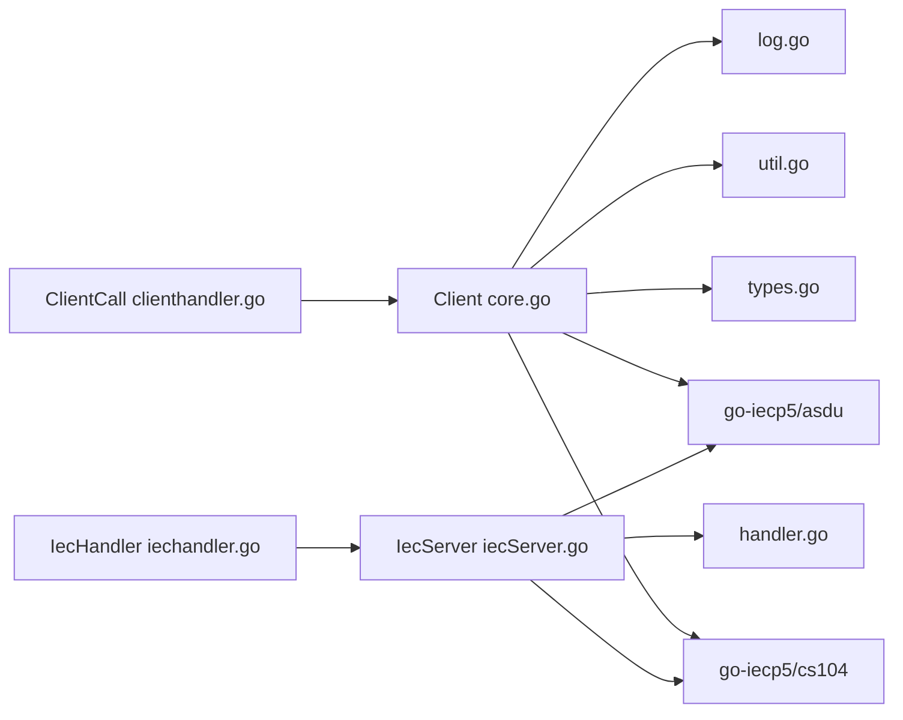
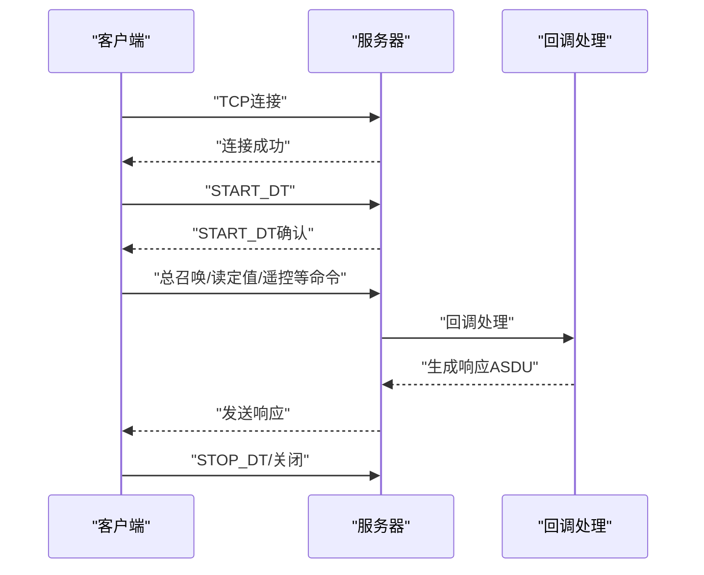

# IEC104协议处理组件

<cite>
**本文档引用的文件**
- [clientmanager.go](file://common/iec104/client/clientmanager.go)
- [core.go](file://common/iec104/client/core.go)
- [handle.go](file://common/iec104/client/handle.go)
- [interface.go](file://common/iec104/client/interface.go)
- [errors.go](file://common/iec104/client/errors.go)
- [iecServer.go](file://common/iec104/server/iecServer.go)
- [handler.go](file://common/iec104/server/handler.go)
- [types.go](file://common/iec104/types/types.go)
- [util.go](file://common/iec104/util/util.go)
- [log.go](file://common/iec104/log.go)
- [clienthandler.go](file://app/ieccaller/internal/iec/clienthandler.go)
- [iechandler.go](file://app/iecagent/internal/iec/iechandler.go)
- [ieccaller.yaml](file://app/ieccaller/etc/ieccaller.yaml)
- [iecagent.yaml](file://app/iecagent/etc/iecagent.yaml)
- [waitgroup.go](file://common/iec104/waitgroup/waitgroup.go)
</cite>

## 目录
1. [引言](#引言)
2. [项目结构](#项目结构)
3. [核心组件](#核心组件)
4. [架构概览](#架构概览)
5. [详细组件分析](#详细组件分析)
6. [依赖分析](#依赖分析)
7. [性能考虑](#性能考虑)
8. [故障排除指南](#故障排除指南)
9. [结论](#结论)
10. [附录](#附录)

## 引言
本技术文档面向Zero-Service项目的IEC104协议处理组件，系统性阐述IEC60870-5-104（简称IEC104）协议在该项目中的客户端与服务器端实现。内容涵盖：
- IEC104客户端核心实现：ASDU数据结构解析、APCI控制信息处理、TS过时位处理、可变结构限定词处理等
- 客户端管理器ClientManager：主站连接管理、遥测/遥信信息处理、遥控命令执行
- IEC104服务器端实现：连接监听、数据接收处理、ASDU解析、响应发送
- 协议栈实现细节、数据帧格式说明、错误处理策略与性能优化建议
- IEC104协议交互流程图、ASDU数据结构示例与常见问题解决方案

## 项目结构
IEC104相关代码主要分布在以下模块：
- common/iec104：协议核心实现（客户端、服务器、类型定义、工具函数、日志适配）
- app/ieccaller：IEC104客户端应用，负责连接远端主站并处理ASDU数据
- app/iecagent：IEC104服务器端应用，模拟主站向客户端下发命令
- 配置文件：ieccaller.yaml、iecagent.yaml

**图表来源**
- [core.go:1-446](file://common/iec104/client/core.go#L1-L446)
- [handle.go:1-155](file://common/iec104/client/handle.go#L1-L155)
- [types.go:1-323](file://common/iec104/types/types.go#L1-L323)
- [util.go:1-242](file://common/iec104/util/util.go#L1-L242)
- [log.go:1-49](file://common/iec104/log.go#L1-L49)
- [iecServer.go:1-38](file://common/iec104/server/iecServer.go#L1-L38)
- [handler.go:1-60](file://common/iec104/server/handler.go#L1-L60)
- [clientmanager.go:1-145](file://common/iec104/client/clientmanager.go#L1-L145)
- [clienthandler.go:1-541](file://app/ieccaller/internal/iec/clienthandler.go#L1-L541)
- [iechandler.go:1-124](file://app/iecagent/internal/iec/iechandler.go#L1-L124)
- [ieccaller.yaml:1-79](file://app/ieccaller/etc/ieccaller.yaml#L1-L79)
- [iecagent.yaml:1-14](file://app/iecagent/etc/iecagent.yaml#L1-L14)

**章节来源**
- [clientmanager.go:1-145](file://common/iec104/client/clientmanager.go#L1-L145)
- [core.go:1-446](file://common/iec104/client/core.go#L1-L446)
- [handle.go:1-155](file://common/iec104/client/handle.go#L1-L155)
- [interface.go:1-71](file://common/iec104/client/interface.go#L1-L71)
- [errors.go](file://common/iec104/client/errors.go)
- [iecServer.go:1-38](file://common/iec104/server/iecServer.go#L1-L38)
- [handler.go:1-60](file://common/iec104/server/handler.go#L1-L60)
- [types.go:1-323](file://common/iec104/types/types.go#L1-L323)
- [util.go:1-242](file://common/iec104/util/util.go#L1-L242)
- [log.go:1-49](file://common/iec104/log.go#L1-L49)
- [clienthandler.go:1-541](file://app/ieccaller/internal/iec/clienthandler.go#L1-L541)
- [iechandler.go:1-124](file://app/iecagent/internal/iec/iechandler.go#L1-L124)
- [ieccaller.yaml:1-79](file://app/ieccaller/etc/ieccaller.yaml#L1-L79)
- [iecagent.yaml:1-14](file://app/iecagent/etc/iecagent.yaml#L1-L14)

## 核心组件
本节概述IEC104协议处理的核心组件及其职责。

- 客户端（Client）
  - 负责与IEC104服务器建立连接、发送控制命令、接收ASDU数据并进行解析
  - 支持自动重连、连接事件回调、日志记录
  - 提供多种命令发送方法：总召唤、计数器召唤、时钟同步、读命令、复位进程、测试命令、遥控命令等

- 客户端管理器（ClientManager）
  - 管理多个IEC104客户端实例，提供注册、注销、查询、统计功能
  - 内置定时统计日志，便于运维监控

- 服务器端（IecServer）
  - 基于第三方库封装的CS104服务器，负责监听端口、处理连接、转发ASDU到业务回调

- 服务器回调（ServerHandler）
  - 定义命令处理接口：总召唤、计数器召唤、读定值、时钟同步、进程重置、延迟获取、通用ASDU
  - 将底层库回调转交给业务实现

- 类型定义（types）
  - 定义消息体结构、点映射、各类ASDU数据结构（遥信、遥测、步位置、位串、累计量、保护设备事件等）

- 工具函数（util）
  - 质量描述符解析（QDS/QDP）、规一化值转换、主题生成、站点ID生成等

- 日志适配（log.go）
  - 将底层库的日志桥接到统一的日志系统

**章节来源**
- [core.go:1-446](file://common/iec104/client/core.go#L1-L446)
- [clientmanager.go:1-145](file://common/iec104/client/clientmanager.go#L1-L145)
- [iecServer.go:1-38](file://common/iec104/server/iecServer.go#L1-L38)
- [handler.go:1-60](file://common/iec104/server/handler.go#L1-L60)
- [types.go:1-323](file://common/iec104/types/types.go#L1-L323)
- [util.go:1-242](file://common/iec104/util/util.go#L1-L242)
- [log.go:1-49](file://common/iec104/log.go#L1-L49)

## 架构概览
下图展示IEC104协议栈在Zero-Service中的整体架构与交互路径：

**图表来源**
- [clienthandler.go:1-541](file://app/ieccaller/internal/iec/clienthandler.go#L1-L541)
- [iechandler.go:1-124](file://app/iecagent/internal/iec/iechandler.go#L1-L124)
- [core.go:1-446](file://common/iec104/client/core.go#L1-L446)
- [handle.go:1-155](file://common/iec104/client/handle.go#L1-L155)
- [types.go:1-323](file://common/iec104/types/types.go#L1-L323)
- [util.go:1-242](file://common/iec104/util/util.go#L1-L242)
- [log.go:1-49](file://common/iec104/log.go#L1-L49)
- [iecServer.go:1-38](file://common/iec104/server/iecServer.go#L1-L38)
- [handler.go:1-60](file://common/iec104/server/handler.go#L1-L60)
- [clientmanager.go:1-145](file://common/iec104/client/clientmanager.go#L1-L145)

## 详细组件分析

### 客户端核心实现（Client）
- 连接与生命周期
  - 支持自动重连与重连间隔配置
  - 连接建立后发送START_DT，断开时发送STOP_DT
  - 提供连接状态查询与运行状态标记

- 命令发送
  - 总召唤、计数器召唤、时钟同步、读命令、复位进程、测试命令、遥控命令（单点、双点、步位置、设定值、位串）
  - 命令参数校验与类型转换，确保发送前数据有效性

- 回调处理
  - 通过ClientHandler将底层库回调转交至业务接口ASDUCall
  - 对各类ASDU进行解析并按数据类型分发到具体处理函数

- 错误处理
  - 连接断开、服务器活动、未知类型ID等场景下的错误处理
  - 通过日志提供可观测性

**图表来源**
- [core.go:1-446](file://common/iec104/client/core.go#L1-L446)
- [handle.go:1-155](file://common/iec104/client/handle.go#L1-L155)
- [interface.go:1-71](file://common/iec104/client/interface.go#L1-L71)

**章节来源**
- [core.go:1-446](file://common/iec104/client/core.go#L1-L446)
- [handle.go:1-155](file://common/iec104/client/handle.go#L1-L155)
- [interface.go:1-71](file://common/iec104/client/interface.go#L1-L71)

### 客户端管理器（ClientManager）
- 功能
  - 注册/注销客户端、按host:port查询、遍历所有客户端
  - 提供客户端数量统计与连接状态统计
  - 内置注册通道与统计循环，便于异步注册与周期性监控

- 并发安全
  - 使用读写锁保护客户端映射，保证高并发场景下的数据一致性

**图表来源**
- [clientmanager.go:1-145](file://common/iec104/client/clientmanager.go#L1-L145)

**章节来源**
- [clientmanager.go:1-145](file://common/iec104/client/clientmanager.go#L1-L145)

### IEC104服务器端实现（IecServer）
- 功能
  - 创建CS104服务器实例，设置参数与日志模式
  - 监听指定地址与端口，处理连接与关闭

- 回调
  - 通过ServerHandler将命令请求转交给业务实现（总召唤、计数器、读定值、时钟同步、进程重置、延迟获取、通用ASDU）

**图表来源**
- [iecServer.go:1-38](file://common/iec104/server/iecServer.go#L1-L38)
- [handler.go:1-60](file://common/iec104/server/handler.go#L1-L60)

**章节来源**
- [iecServer.go:1-38](file://common/iec104/server/iecServer.go#L1-L38)
- [handler.go:1-60](file://common/iec104/server/handler.go#L1-L60)

### ASDU数据结构解析与TS过时位处理
- 数据类型映射
  - 单点信息、双点信息、测量值（标度化/规一化/短浮点）、步位置、位串、累计量、保护设备事件、SCD成组单点等
  - 通过GetDataType将TypeID映射到内部DataType枚举，便于分发处理

- TS过时位与质量描述符
  - QDS/QDP质量描述符解析与字符串化，支持溢出、封锁、替代、非实时、无效等标志位判断
  - 规一化值与浮点值互转，满足不同ASDU类型的数值表达

- 时间戳与时钟同步
  - 支持CP24/CP56时间标签解析与生成，确保事件时间准确性

**图表来源**
- [handle.go:111-155](file://common/iec104/client/handle.go#L111-L155)
- [types.go:60-323](file://common/iec104/types/types.go#L60-L323)
- [util.go:13-93](file://common/iec104/util/util.go#L13-L93)

**章节来源**
- [handle.go:1-155](file://common/iec104/client/handle.go#L1-L155)
- [types.go:1-323](file://common/iec104/types/types.go#L1-L323)
- [util.go:1-242](file://common/iec104/util/util.go#L1-L242)

### APCI控制信息处理与可变结构限定词
- APCI控制信息
  - CauseOfTransmission（传输原因）：激活、激活确认、激活终止、询问、自发等
  - CommonAddress（公共地址）、信息对象地址（IOA）解析与校验

- 可变结构限定词（VFT）
  - 在总召唤、计数器召唤等命令中使用，控制数据项数量与冻结/读取行为
  - 客户端侧通过doSend根据TypeID选择对应命令并填充限定词

- 遥控命令执行
  - 支持单命令、双命令、步位置命令、设定值命令（规一化/标度化/短浮点）、位串命令
  - 命令参数类型转换与时间戳注入（针对带时标命令）

**章节来源**
- [core.go:293-436](file://common/iec104/client/core.go#L293-L436)
- [iechandler.go:25-123](file://app/iecagent/internal/iec/iechandler.go#L25-L123)

### 遥测/遥信信息处理与点映射
- 遥信/遥测解析
  - 通过ClientCall.OnASDU入口，按TypeID分派到具体处理函数
  - 解析完成后构造MsgBody，填充Host、Port、ASDU名称、TypeID、DataType、COA、Body、MetaData等字段

- 点映射（PointMapping）
  - 支持设备ID、设备名、TD表类型、扩展字段（ext1-ext5）等，便于下游系统按主题/维度聚合

- 主题生成与推送
  - 利用模板生成MQTT主题，支持stationId、TypeId、Ioa、设备ID、扩展字段等变量
  - 支持批量推送与广播组配置

**章节来源**
- [clienthandler.go:94-140](file://app/ieccaller/internal/iec/clienthandler.go#L94-L140)
- [types.go:11-40](file://common/iec104/types/types.go#L11-L40)
- [util.go:197-241](file://common/iec104/util/util.go#L197-L241)
- [ieccaller.yaml:35-57](file://app/ieccaller/etc/ieccaller.yaml#L35-L57)

## 依赖分析
- 外部库依赖
  - go-iecp5/cs104：CS104协议栈实现
  - go-iecp5/asdu：ASDU数据模型与命令封装
  - go-zero：日志、指标、并发任务调度、配置加载

- 内部模块耦合
  - 客户端与服务器均依赖types与util，确保数据结构与工具函数的一致性
  - 应用层通过回调接口与协议核心解耦，便于替换或扩展

**图表来源**
- [core.go:1-446](file://common/iec104/client/core.go#L1-L446)
- [iecServer.go:1-38](file://common/iec104/server/iecServer.go#L1-L38)
- [handler.go:1-60](file://common/iec104/server/handler.go#L1-L60)
- [clienthandler.go:1-541](file://app/ieccaller/internal/iec/clienthandler.go#L1-L541)
- [iechandler.go:1-124](file://app/iecagent/internal/iec/iechandler.go#L1-L124)

**章节来源**
- [core.go:1-446](file://common/iec104/client/core.go#L1-L446)
- [iecServer.go:1-38](file://common/iec104/server/iecServer.go#L1-L38)
- [handler.go:1-60](file://common/iec104/server/handler.go#L1-L60)
- [clienthandler.go:1-541](file://app/ieccaller/internal/iec/clienthandler.go#L1-L541)
- [iechandler.go:1-124](file://app/iecagent/internal/iec/iechandler.go#L1-L124)

## 性能考虑
- 并发与限流
  - 使用TaskRunner对ASDU处理进行并发控制，避免高并发冲击下游系统
  - ClientManager内置统计循环，便于观察连接与运行状态

- 指标与观测
  - ClientHandler在各回调中记录处理耗时，便于定位性能瓶颈
  - 日志提供关键事件的上下文字段，便于追踪

- 批量推送
  - 支持批量推送ASDU，降低网络开销与系统压力
  - 配置项PushAsduChunkBytes控制批次大小

- 超时与等待
  - waitgroup提供WaitTimeout能力，避免长时间阻塞导致资源泄漏

**章节来源**
- [clienthandler.go:107-138](file://app/ieccaller/internal/iec/clienthandler.go#L107-L138)
- [handle.go:40-109](file://common/iec104/client/handle.go#L40-L109)
- [clientmanager.go:117-144](file://common/iec104/client/clientmanager.go#L117-L144)
- [waitgroup.go:1-113](file://common/iec104/waitgroup/waitgroup.go#L1-L113)
- [ieccaller.yaml:78-79](file://app/ieccaller/etc/ieccaller.yaml#L78-L79)

## 故障排除指南
- 连接失败
  - 检查目标主机与端口配置、网络连通性
  - 查看日志中的连接事件与错误信息

- 命令超时或无响应
  - 调整重连间隔与超时配置
  - 确认服务器端是否正确处理命令并发送确认帧

- ASDU解析异常
  - 检查ASDU类型是否受支持，必要时扩展类型映射
  - 校验QDS/QDP标志位，识别数据质量与异常状态

- MQTT主题生成失败
  - 确认模板语法正确，无未解析占位符
  - 避免主题包含连续斜杠、以斜杠开头或结尾

- 并发处理积压
  - 适当提高TaskConcurrency，或优化下游处理逻辑
  - 使用WaitTimeout避免阻塞

**章节来源**
- [errors.go](file://common/iec104/client/errors.go)
- [util.go:197-241](file://common/iec104/util/util.go#L197-L241)
- [clienthandler.go:107-138](file://app/ieccaller/internal/iec/clienthandler.go#L107-L138)
- [ieccaller.yaml:35-57](file://app/ieccaller/etc/ieccaller.yaml#L35-L57)

## 结论
Zero-Service的IEC104协议处理组件以清晰的模块划分与良好的接口设计实现了完整的主站/从站通信能力。客户端侧提供完善的命令发送与ASDU解析能力，并通过回调接口与应用层解耦；服务器侧通过统一的回调接口承接各类IEC104命令；公共模块提供一致的数据类型与工具函数，确保跨组件的一致性与可维护性。结合并发控制、指标观测与批量推送等机制，系统在性能与可靠性方面具备良好表现。

## 附录

### IEC104协议交互流程图

[此图为概念性流程示意，不直接映射具体源码文件]

### 常见ASDU数据结构示例
- 遥信（M_SP_NA_1/M_SP_TA_1/M_SP_TB_1）
  - 字段：IOA、Value（布尔）、QDS质量描述符、时间戳等
  - 示例路径：[types.go:60-77](file://common/iec104/types/types.go#L60-L77)

- 遥测（M_ME_NA_1/M_ME_TA_1/M_ME_TD_1/M_ME_ND_1）
  - 字段：IOA、Value（规一化值）、NVA（计算得到的物理值）、QDS质量描述符、时间戳等
  - 示例路径：[types.go:117-138](file://common/iec104/types/types.go#L117-L138)

- 遥控（C_SC_NA_1/C_SC_TA_1）
  - 字段：IOA、Value（布尔）、QOC限定词、时间戳（可选）
  - 示例路径：[core.go:327-341](file://common/iec104/client/core.go#L327-L341)

**章节来源**
- [types.go:60-138](file://common/iec104/types/types.go#L60-L138)
- [core.go:327-341](file://common/iec104/client/core.go#L327-L341)