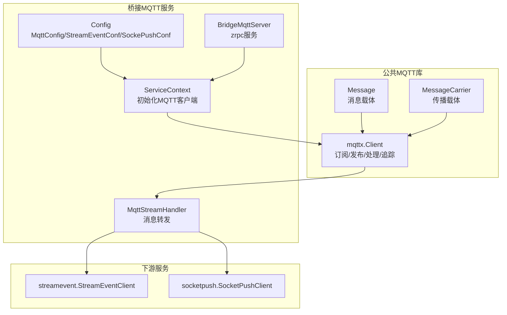
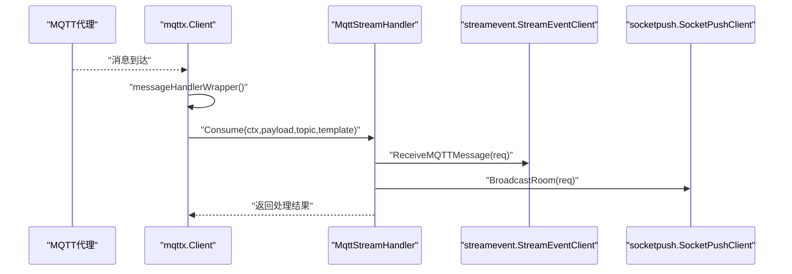
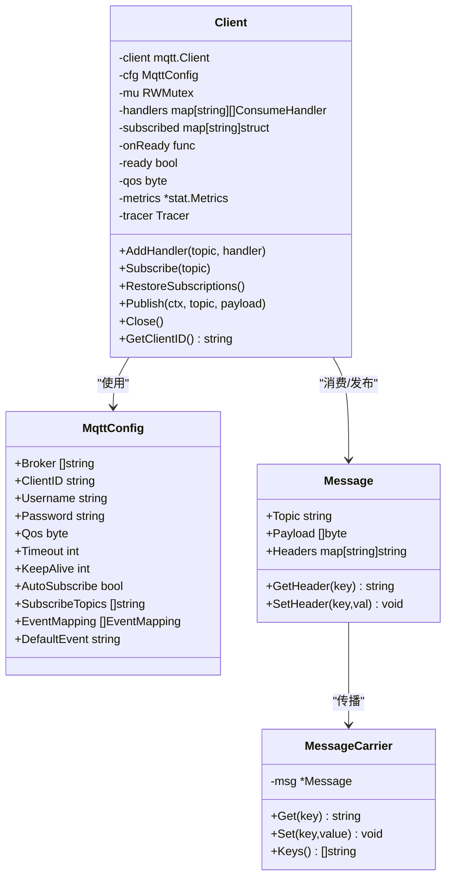
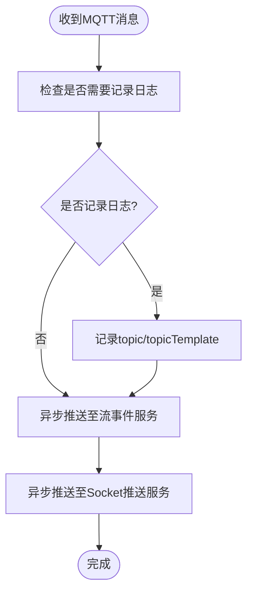
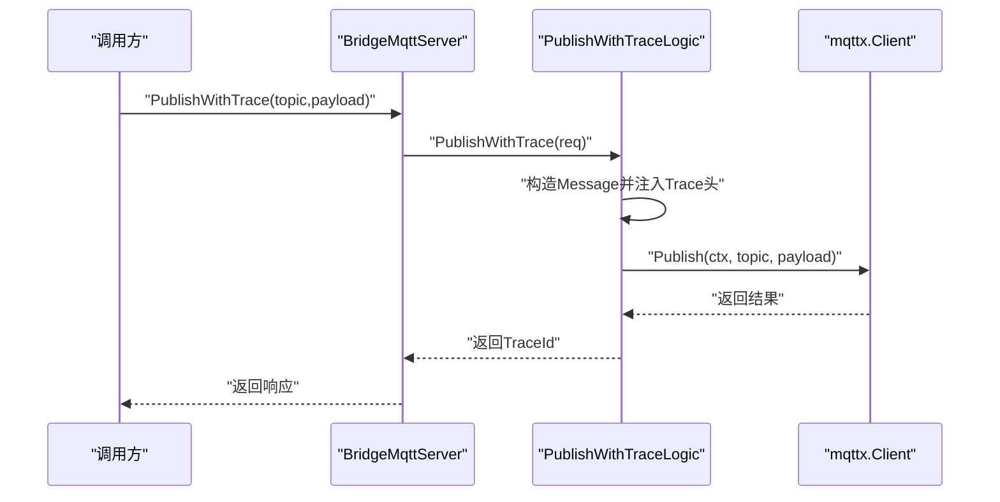
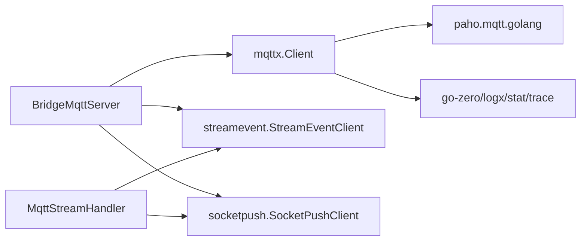

# MQTT协议处理组件

<cite>
**本文引用的文件**
- [common/mqttx/mqttx.go](file://common/mqttx/mqttx.go)
- [common/mqttx/message.go](file://common/mqttx/message.go)
- [common/mqttx/trace.go](file://common/mqttx/trace.go)
- [app/bridgemqtt/internal/handler/mqttstreamhandler.go](file://app/bridgemqtt/internal/handler/mqttstreamhandler.go)
- [app/bridgemqtt/internal/logic/publishlogic.go](file://app/bridgemqtt/internal/logic/publishlogic.go)
- [app/bridgemqtt/internal/logic/publishwithtracelogic.go](file://app/bridgemqtt/internal/logic/publishwithtracelogic.go)
- [app/bridgemqtt/etc/bridgemqtt.yaml](file://app/bridgemqtt/etc/bridgemqtt.yaml)
- [app/bridgemqtt/internal/config/config.go](file://app/bridgemqtt/internal/config/config.go)
- [app/bridgemqtt/internal/svc/servicecontext.go](file://app/bridgemqtt/internal/svc/servicecontext.go)
- [app/bridgemqtt/internal/server/bridgemqttserver.go](file://app/bridgemqtt/internal/server/bridgemqttserver.go)
- [app/bridgemqtt/bridgemqtt.go](file://app/bridgemqtt/bridgemqtt.go)
- [facade/streamevent/internal/logic/receivemqttmessagelogic.go](file://facade/streamevent/internal/logic/receivemqttmessagelogic.go)
- [socketapp/socketpush/internal/logic/broadcastroomlogic.go](file://socketapp/socketpush/internal/logic/broadcastroomlogic.go)
</cite>

## 目录
1. [简介](#简介)
2. [项目结构](#项目结构)
3. [核心组件](#核心组件)
4. [架构总览](#架构总览)
5. [详细组件分析](#详细组件分析)
6. [依赖分析](#依赖分析)
7. [性能考虑](#性能考虑)
8. [故障排查指南](#故障排查指南)
9. [结论](#结论)
10. [附录](#附录)

## 简介
本技术文档面向Zero-Service中的MQTT协议处理组件，系统性阐述MQTT客户端管理、消息处理机制、Trace追踪与性能监控、配置项与使用示例、以及与桥接服务的集成方式与优化建议。文档以代码级分析为基础，辅以多种可视化图示，帮助开发者快速理解并正确使用该组件。

## 项目结构
MQTT处理相关代码主要分布在以下模块：
- 公共MQTT库：封装客户端生命周期、订阅/发布、消息处理、OpenTelemetry追踪与指标统计。
- 桥接MQTT服务：基于zrpc提供Publish/PublishWithTrace等接口，负责将MQTT消息桥接到流事件与WebSocket推送。
- 配置与上下文：读取配置、初始化MQTT客户端、注册消息处理器。
- 上游下游服务：流事件服务与Socket推送服务通过RPC对接桥接服务。

**图表来源**
- [common/mqttx/mqttx.go:76-87](file://common/mqttx/mqttx.go#L76-L87)
- [common/mqttx/message.go:3-7](file://common/mqttx/message.go#L3-L7)
- [common/mqttx/trace.go:8-14](file://common/mqttx/trace.go#L8-L14)
- [app/bridgemqtt/internal/config/config.go:9-23](file://app/bridgemqtt/internal/config/config.go#L9-L23)
- [app/bridgemqtt/internal/svc/servicecontext.go:16-59](file://app/bridgemqtt/internal/svc/servicecontext.go#L16-L59)
- [app/bridgemqtt/internal/handler/mqttstreamhandler.go:99-119](file://app/bridgemqtt/internal/handler/mqttstreamhandler.go#L99-L119)
- [app/bridgemqtt/internal/server/bridgemqttserver.go:15-42](file://app/bridgemqtt/internal/server/bridgemqttserver.go#L15-L42)

**章节来源**
- [app/bridgemqtt/etc/bridgemqtt.yaml:1-48](file://app/bridgemqtt/etc/bridgemqtt.yaml#L1-L48)
- [app/bridgemqtt/internal/config/config.go:9-23](file://app/bridgemqtt/internal/config/config.go#L9-L23)
- [app/bridgemqtt/internal/svc/servicecontext.go:21-60](file://app/bridgemqtt/internal/svc/servicecontext.go#L21-L60)

## 核心组件
- MQTT客户端管理
  - 连接建立：自动重连、心跳、超时控制、首次连接回调。
  - 主题订阅：自动/手动订阅、断线重连后恢复订阅。
  - 消息发布：带超时与错误上报、QoS封装。
  - 会话状态：连接状态、订阅状态、客户端ID生成。
- 消息处理机制
  - 消息格式：支持透传原始payload或嵌入Message结构体；当嵌入时可携带Trace头并通过TextMap传播。
  - QoS处理：按配置QoS发布/消费，Span中记录QoS。
  - 保留消息：当前实现未显式处理保留位，遵循paho默认行为。
  - 会话状态：通过内部map维护订阅状态，断线清空后恢复。
- Trace追踪机制
  - 生产者/消费者Span：分别标记Producer/Consumer，设置客户端ID、主题、消息ID、QoS、动作等属性。
  - 文本映射传播：通过MessageCarrier正确实现OpenTelemetry TextMapCarrier接口进行trace上下文注入/提取。
  - 指标统计：基于stat.Metrics记录处理耗时。
- 桥接服务集成
  - 将MQTT消息转发至流事件服务与Socket推送服务，支持事件映射与日志控制。

**更新** MessageCarrier现在正确实现了OpenTelemetry TextMapCarrier接口，确保与OpenTelemetry传播标准的一致性，消除了之前的接口实现注释问题。

**章节来源**
- [common/mqttx/mqttx.go:98-178](file://common/mqttx/mqttx.go#L98-L178)
- [common/mqttx/mqttx.go:180-255](file://common/mqttx/mqttx.go#L180-L255)
- [common/mqttx/mqttx.go:257-307](file://common/mqttx/mqttx.go#L257-L307)
- [common/mqttx/mqttx.go:309-333](file://common/mqttx/mqttx.go#L309-L333)
- [common/mqttx/mqttx.go:361-388](file://common/mqttx/mqttx.go#L361-L388)
- [common/mqttx/message.go:3-7](file://common/mqttx/message.go#L3-L7)
- [common/mqttx/trace.go:5-30](file://common/mqttx/trace.go#L5-L30)
- [app/bridgemqtt/internal/handler/mqttstreamhandler.go:99-188](file://app/bridgemqtt/internal/handler/mqttstreamhandler.go#L99-L188)

## 架构总览
下图展示从MQTT订阅到桥接转发的整体流程，包括RPC接口、消息处理与下游服务调用。

**图表来源**
- [common/mqttx/mqttx.go:257-307](file://common/mqttx/mqttx.go#L257-L307)
- [app/bridgemqtt/internal/handler/mqttstreamhandler.go:130-188](file://app/bridgemqtt/internal/handler/mqttstreamhandler.go#L130-L188)
- [facade/streamevent/internal/logic/receivemqttmessagelogic.go:26-31](file://facade/streamevent/internal/logic/receivemqttmessagelogic.go#L26-L31)
- [socketapp/socketpush/internal/logic/broadcastroomlogic.go:28-44](file://socketapp/socketpush/internal/logic/broadcastroomlogic.go#L28-L44)

## 详细组件分析

### 组件一：MQTT客户端（mqttx.Client）
- 设计要点
  - 使用paho.mqtt.golang作为底层客户端，统一配置与生命周期管理。
  - 支持自动重连、心跳、连接超时、首次连接回调。
  - 订阅状态与处理器映射采用并发安全设计。
  - 发布/消费均开启OpenTelemetry Span与耗时统计。
- 关键流程
  - 连接建立：设置broker、用户名密码、自动重连、心跳、超时；连接成功后触发onReady并恢复订阅。
  - 订阅恢复：遍历已注册主题与初始订阅列表，逐个恢复订阅。
  - 消息处理：解包可能的Message结构体，提取payload与Trace头；启动Span并调用所有处理器。
  - 发布：按配置QoS发布，超时与错误记录到Span。
- 错误处理
  - 连接超时/失败、订阅超时/失败、发布超时/失败均记录错误并设置Span状态。
  - 无处理器时触发默认处理器记录提示信息。

**图表来源**
- [common/mqttx/mqttx.go:76-87](file://common/mqttx/mqttx.go#L76-L87)
- [common/mqttx/mqttx.go:51-64](file://common/mqttx/mqttx.go#L51-L64)
- [common/mqttx/message.go:3-7](file://common/mqttx/message.go#L3-L7)
- [common/mqttx/trace.go:8-14](file://common/mqttx/trace.go#L8-L14)

**章节来源**
- [common/mqttx/mqttx.go:98-178](file://common/mqttx/mqttx.go#L98-L178)
- [common/mqttx/mqttx.go:180-255](file://common/mqttx/mqttx.go#L180-L255)
- [common/mqttx/mqttx.go:257-307](file://common/mqttx/mqttx.go#L257-L307)
- [common/mqttx/mqttx.go:309-333](file://common/mqttx/mqttx.go#L309-L333)
- [common/mqttx/mqttx.go:361-388](file://common/mqttx/mqttx.go#L361-L388)

### 组件二：消息处理与桥接（MqttStreamHandler）
- 功能职责
  - 将MQTT消息转发至流事件服务与Socket推送服务。
  - 支持事件映射（根据topicTemplate匹配事件名）。
  - 提供Topic级别的日志开关与最小日志间隔控制。
- 并发模型
  - 使用TaskRunner并发调度下游RPC调用，避免阻塞消息处理主路径。
- 日志控制
  - TopicLogManager基于sync.Map实现线程安全的配置缓存，默认允许打印payload。
- RPC调用
  - 流事件：ReceiveMQTTMessage，携带消息ID、发送时间、topic、payload等。
  - Socket推送：BroadcastRoom，按房间（topicTemplate）广播事件。

**图表来源**
- [app/bridgemqtt/internal/handler/mqttstreamhandler.go:130-188](file://app/bridgemqtt/internal/handler/mqttstreamhandler.go#L130-L188)

**章节来源**
- [app/bridgemqtt/internal/handler/mqttstreamhandler.go:99-188](file://app/bridgemqtt/internal/handler/mqttstreamhandler.go#L99-L188)

### 组件三：RPC服务与逻辑层
- BridgeMqttServer
  - 提供Ping、Publish、PublishWithTrace三个方法。
  - 将请求委派给对应Logic层。
- PublishLogic
  - 直接调用MqttClient.Publish进行发布。
- PublishWithTraceLogic
  - 将ctx中的trace上下文注入Message的Headers，再发布，便于端到端追踪。

**图表来源**
- [app/bridgemqtt/internal/server/bridgemqttserver.go:37-41](file://app/bridgemqtt/internal/server/bridgemqttserver.go#L37-L41)
- [app/bridgemqtt/internal/logic/publishwithtracelogic.go:30-47](file://app/bridgemqtt/internal/logic/publishwithtracelogic.go#L30-L47)
- [common/mqttx/mqttx.go:309-333](file://common/mqttx/mqttx.go#L309-L333)

**章节来源**
- [app/bridgemqtt/internal/server/bridgemqttserver.go:15-42](file://app/bridgemqtt/internal/server/bridgemqttserver.go#L15-L42)
- [app/bridgemqtt/internal/logic/publishlogic.go:26-33](file://app/bridgemqtt/internal/logic/publishlogic.go#L26-L33)
- [app/bridgemqtt/internal/logic/publishwithtracelogic.go:30-47](file://app/bridgemqtt/internal/logic/publishwithtracelogic.go#L30-L47)

### 组件四：配置与服务上下文
- 配置项
  - MqttConfig：Broker、ClientID、Username、Password、Qos、Timeout、KeepAlive、AutoSubscribe、SubscribeTopics、EventMapping、DefaultEvent。
  - StreamEventConf/SockePushConf：下游RPC客户端配置（地址、非阻塞、超时等）。
- 服务上下文
  - 初始化日志。
  - 可选构建流事件与Socket推送客户端。
  - 创建并启动mqttx.Client，首次连接成功后注册处理器，按SubscribeTopics批量订阅。

**章节来源**
- [app/bridgemqtt/etc/bridgemqtt.yaml:19-48](file://app/bridgemqtt/etc/bridgemqtt.yaml#L19-L48)
- [app/bridgemqtt/internal/config/config.go:9-23](file://app/bridgemqtt/internal/config/config.go#L9-L23)
- [app/bridgemqtt/internal/svc/servicecontext.go:21-60](file://app/bridgemqtt/internal/svc/servicecontext.go#L21-L60)

## 依赖分析
- 组件耦合
  - mqttx.Client对go-zero日志、指标、trace、paho.mqtt有直接依赖。
  - BridgeMqtt服务依赖mqttx.Client与下游RPC客户端。
  - MqttStreamHandler依赖streamevent与socketpush的客户端接口。
- 外部依赖
  - paho.mqtt.golang：MQTT协议栈。
  - OpenTelemetry：Tracing与Propagator。
  - go-zero：日志、指标、RPC框架、配置加载。

**图表来源**
- [common/mqttx/mqttx.go:1-23](file://common/mqttx/mqttx.go#L1-L23)
- [app/bridgemqtt/internal/svc/servicecontext.go:3-14](file://app/bridgemqtt/internal/svc/servicecontext.go#L3-L14)
- [app/bridgemqtt/internal/handler/mqttstreamhandler.go:8-17](file://app/bridgemqtt/internal/handler/mqttstreamhandler.go#L8-L17)

**章节来源**
- [common/mqttx/mqttx.go:1-23](file://common/mqttx/mqttx.go#L1-L23)
- [app/bridgemqtt/internal/svc/servicecontext.go:3-14](file://app/bridgemqtt/internal/svc/servicecontext.go#L3-L14)

## 性能考虑
- 并发与限速
  - 消息处理采用并发任务调度，避免阻塞主循环。
  - TopicLogManager使用原子操作与sync.Map，降低锁竞争。
- RPC调用优化
  - 下游RPC客户端设置最大消息大小，避免大包阻塞。
  - 非阻塞模式可提升吞吐，但需关注失败重试策略。
- 指标与追踪
  - 基于stat.Metrics记录处理耗时，结合Span属性定位瓶颈。
  - 通过QoS与消息ID属性辅助排查可靠性问题。
- 配置建议
  - 合理设置KeepAlive与Timeout，平衡资源占用与稳定性。
  - AutoSubscribe在大量主题场景下可减少重复订阅开销。

## 故障排查指南
- 连接问题
  - 检查Broker地址、认证信息与网络连通性。
  - 关注连接超时与自动重连日志。
- 订阅问题
  - 断线后订阅状态会被清空，确认OnConnect回调是否成功恢复订阅。
  - 若订阅超时，检查代理权限与主题通配符。
- 处理器问题
  - 无处理器时会触发默认处理器记录提示，确认AddHandler是否正确注册。
  - 处理器panic会被捕获并记录，检查日志定位根因。
- 发布问题
  - 发布超时或失败会在Span中记录错误，核对QoS与代理负载。
- 追踪问题
  - 确认Message结构体内Headers是否包含Trace头，下游是否正确传播。

**章节来源**
- [common/mqttx/mqttx.go:148-177](file://common/mqttx/mqttx.go#L148-L177)
- [common/mqttx/mqttx.go:235-255](file://common/mqttx/mqttx.go#L235-L255)
- [common/mqttx/mqttx.go:257-307](file://common/mqttx/mqttx.go#L257-L307)
- [common/mqttx/mqttx.go:309-333](file://common/mqttx/mqttx.go#L309-L333)
- [common/mqttx/trace.go:16-30](file://common/mqttx/trace.go#L16-L30)

## 结论
该MQTT协议处理组件以简洁的接口与完善的可观测性为核心，既满足轻量接入需求，又具备桥接转发与跨服务追踪能力。通过合理配置与并发优化，可在高吞吐场景下稳定运行。建议在生产环境中启用Trace与指标采集，并结合日志策略进行持续监控。

## 附录

### MQTT协议支持与配置说明
- 支持的MQTT特性
  - 连接：用户名/密码、TLS（由paho支持）、自动重连、心跳。
  - 订阅：通配符、批量恢复、断线重连后自动恢复。
  - 发布：QoS 0/1/2封装、超时控制、错误上报。
  - 消息格式：透传payload或嵌入Message结构体（含Headers用于传播）。
- 关键配置项
  - Broker：MQTT代理地址列表。
  - ClientID/Username/Password：认证信息。
  - Qos/Timeout/KeepAlive：连接参数。
  - AutoSubscribe/SubscribeTopics：订阅策略。
  - EventMapping/DefaultEvent：消息事件映射。
  - StreamEventConf/SockePushConf：下游RPC客户端配置。

**章节来源**
- [app/bridgemqtt/etc/bridgemqtt.yaml:19-48](file://app/bridgemqtt/etc/bridgemqtt.yaml#L19-L48)
- [common/mqttx/mqttx.go:51-64](file://common/mqttx/mqttx.go#L51-L64)

### 使用示例与最佳实践
- 示例
  - 通过BridgeMqttServer的Publish接口发布消息。
  - 通过PublishWithTrace接口发布并携带Trace上下文。
- 最佳实践
  - 在首次连接回调中注册处理器并批量订阅。
  - 对高频topic启用日志节流，避免日志风暴。
  - 对下游RPC设置合理的超时与最大消息大小。
  - 使用EventMapping将MQTT主题映射到语义化事件名。

**章节来源**
- [app/bridgemqtt/internal/server/bridgemqttserver.go:31-41](file://app/bridgemqtt/internal/server/bridgemqttserver.go#L31-L41)
- [app/bridgemqtt/internal/logic/publishlogic.go:26-33](file://app/bridgemqtt/internal/logic/publishlogic.go#L26-L33)
- [app/bridgemqtt/internal/logic/publishwithtracelogic.go:30-47](file://app/bridgemqtt/internal/logic/publishwithtracelogic.go#L30-L47)
- [app/bridgemqtt/internal/handler/mqttstreamhandler.go:74-97](file://app/bridgemqtt/internal/handler/mqttstreamhandler.go#L74-L97)

### 消息格式与交互流程
- 消息格式
  - 原始payload：直接透传。
  - 嵌入Message：包含topic、payload、headers（用于传播）。
- 交互流程
  - 订阅消息到达后，先尝试解包Message结构体，提取payload与Headers。
  - 通过正确实现的MessageCarrier进行OpenTelemetry上下文提取。
  - 启动Span并记录属性，随后调用所有注册处理器。
  - 处理完成后异步转发至下游服务。

**更新** MessageCarrier现在正确实现了OpenTelemetry TextMapCarrier接口，确保与OpenTelemetry传播标准的一致性，消除了之前的接口实现注释问题。

**章节来源**
- [common/mqttx/message.go:3-7](file://common/mqttx/message.go#L3-L7)
- [common/mqttx/mqttx.go:257-307](file://common/mqttx/mqttx.go#L257-L307)
- [common/mqttx/trace.go:5-30](file://common/mqttx/trace.go#L5-L30)
- [app/bridgemqtt/internal/handler/mqttstreamhandler.go:130-188](file://app/bridgemqtt/internal/handler/mqttstreamhandler.go#L130-L188)

### 常见问题与解决方案
- 问题：连接超时
  - 解决：检查Broker可达性、认证信息、网络策略与超时配置。
- 问题：订阅失败
  - 解决：确认主题权限、通配符语法与代理策略。
- 问题：消息无处理器
  - 解决：确保AddHandler正确注册，或检查AutoSubscribe配置。
- 问题：发布超时
  - 解决：降低QoS或增大超时，检查代理负载与网络质量。
- 问题：Trace未传播
  - 解决：确认使用Message结构体并正确注入Headers。

**更新** MessageCarrier现在正确实现了OpenTelemetry TextMapCarrier接口，确保与OpenTelemetry传播标准的一致性，消除了之前的接口实现注释问题。

**章节来源**
- [common/mqttx/mqttx.go:100-110](file://common/mqttx/mqttx.go#L100-L110)
- [common/mqttx/mqttx.go:215-233](file://common/mqttx/mqttx.go#L215-L233)
- [common/mqttx/mqttx.go:309-333](file://common/mqttx/mqttx.go#L309-L333)
- [common/mqttx/trace.go:5-30](file://common/mqttx/trace.go#L5-L30)