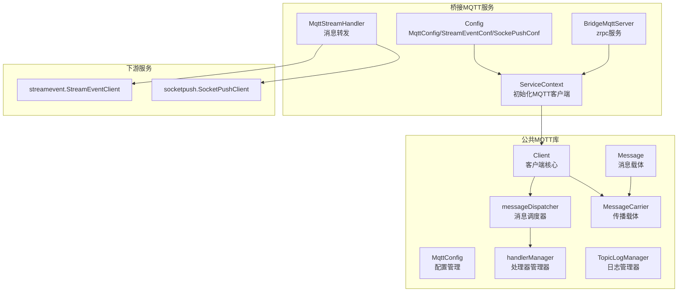
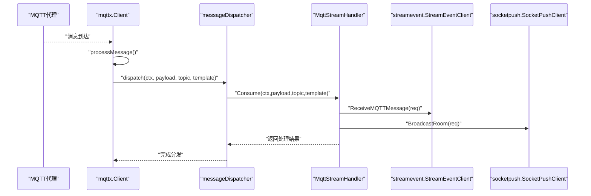
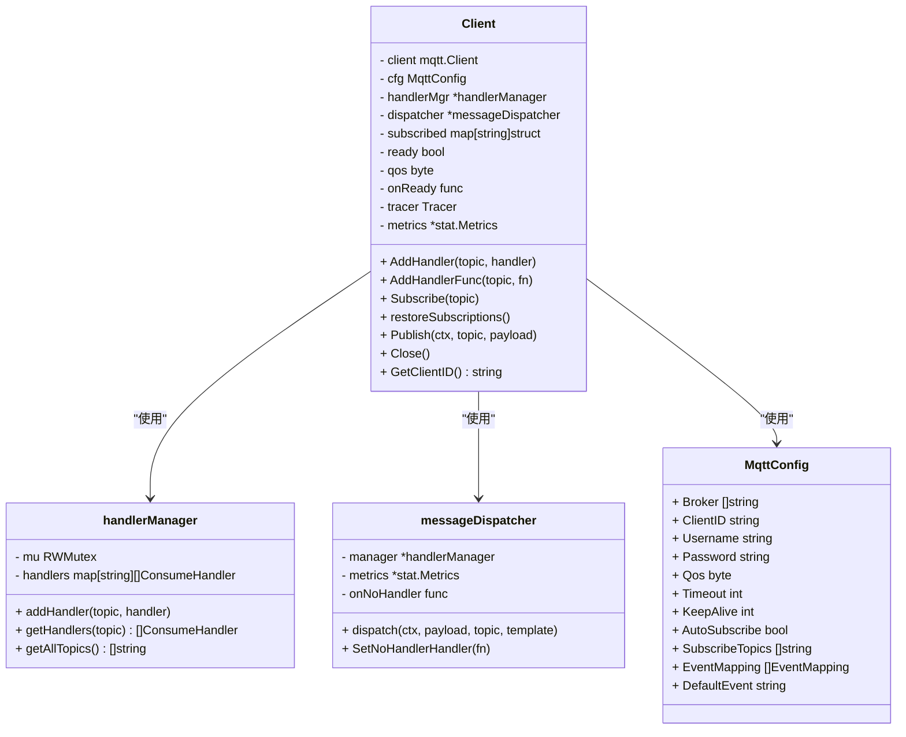
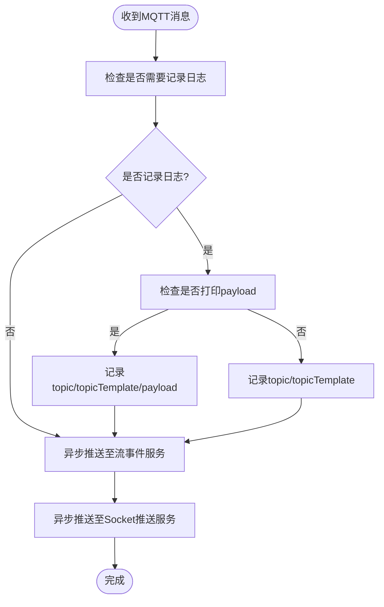
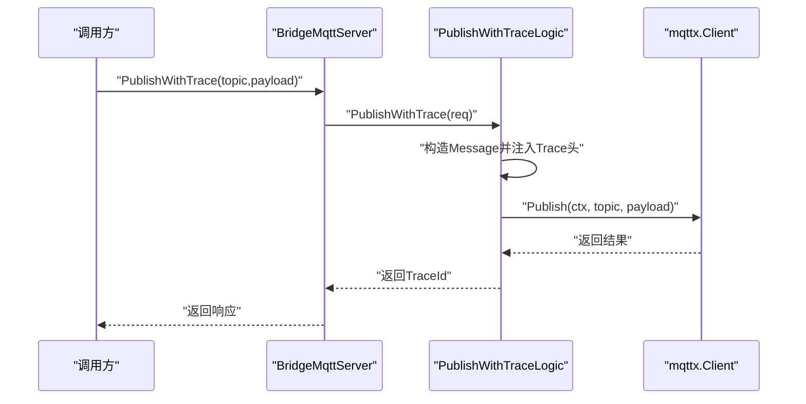
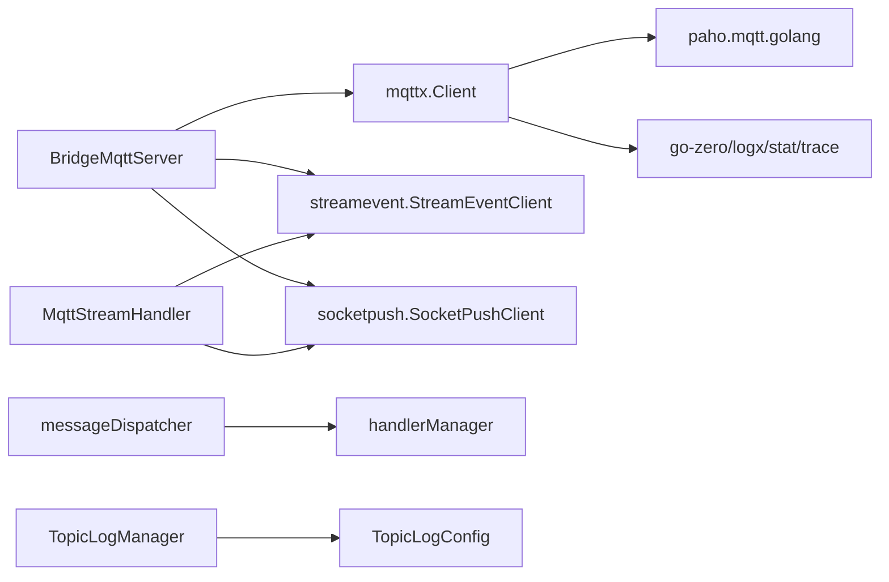

# MQTT协议处理组件

<cite>
**本文档引用的文件**
- [common/mqttx/client.go](file://common/mqttx/client.go)
- [common/mqttx/config.go](file://common/mqttx/config.go)
- [common/mqttx/dispatcher.go](file://common/mqttx/dispatcher.go)
- [common/mqttx/message.go](file://common/mqttx/message.go)
- [common/mqttx/topiclog.go](file://common/mqttx/topiclog.go)
- [common/mqttx/trace.go](file://common/mqttx/trace.go)
- [app/bridgemqtt/internal/handler/mqttstreamhandler.go](file://app/bridgemqtt/internal/handler/mqttstreamhandler.go)
- [app/bridgemqtt/internal/logic/publishlogic.go](file://app/bridgemqtt/internal/logic/publishlogic.go)
- [app/bridgemqtt/internal/logic/publishwithtracelogic.go](file://app/bridgemqtt/internal/logic/publishwithtracelogic.go)
- [app/bridgemqtt/etc/bridgemqtt.yaml](file://app/bridgemqtt/etc/bridgemqtt.yaml)
- [app/bridgemqtt/internal/config/config.go](file://app/bridgemqtt/internal/config/config.go)
- [app/bridgemqtt/internal/svc/servicecontext.go](file://app/bridgemqtt/internal/svc/servicecontext.go)
- [app/bridgemqtt/internal/server/bridgemqttserver.go](file://app/bridgemqtt/internal/server/bridgemqttserver.go)
- [app/bridgemqtt/bridgemqtt.go](file://app/bridgemqtt/bridgemqtt.go)
- [facade/streamevent/internal/logic/receivemqttmessagelogic.go](file://facade/streamevent/internal/logic/receivemqttmessagelogic.go)
</cite>

## 更新摘要
**所做更改**
- 新增完整的mqttx客户端库实现分析，包含新的Client架构、Handler管理器、消息调度器和Topic日志管理功能
- 删除旧的mqttx.go实现分析，引入更强大的消息处理能力和可观测性支持
- 更新架构总览图和组件关系图，反映新的模块化设计
- 增强消息处理机制说明，包括新的处理器管理和调度器架构
- 新增Topic日志管理功能的详细说明和使用示例
- 更新配置选项和最佳实践指南

## 目录
1. [简介](#简介)
2. [项目结构](#项目结构)
3. [核心组件](#核心组件)
4. [架构总览](#架构总览)
5. [详细组件分析](#详细组件分析)
6. [依赖分析](#依赖分析)
7. [性能考虑](#性能考虑)
8. [故障排查指南](#故障排查指南)
9. [结论](#结论)
10. [附录](#附录)

## 简介
本技术文档面向Zero-Service中的MQTT协议处理组件，系统性阐述全新的mqttx客户端库实现，包括MQTT客户端管理、消息处理机制、Trace追踪与性能监控、配置项与使用示例、以及与桥接服务的集成方式与优化建议。文档以代码级分析为基础，辅以多种可视化图示，帮助开发者快速理解并正确使用该组件。

## 项目结构
MQTT处理相关代码主要分布在以下模块：
- 公共MQTT库：封装客户端生命周期、订阅/发布、消息处理、OpenTelemetry追踪与指标统计。
- 桥接MQTT服务：基于zrpc提供Publish/PublishWithTrace等接口，负责将MQTT消息桥接到流事件与WebSocket推送。
- 配置与上下文：读取配置、初始化MQTT客户端、注册消息处理器。
- 上游下游服务：流事件服务与Socket推送服务通过RPC对接桥接服务。

**图表来源**
- [common/mqttx/client.go:34-46](file://common/mqttx/client.go#L34-L46)
- [common/mqttx/config.go:5-29](file://common/mqttx/config.go#L5-L29)
- [common/mqttx/dispatcher.go:69-75](file://common/mqttx/dispatcher.go#L69-L75)
- [common/mqttx/dispatcher.go:31-36](file://common/mqttx/dispatcher.go#L31-L36)
- [common/mqttx/topiclog.go:69-75](file://common/mqttx/topiclog.go#L69-L75)
- [common/mqttx/message.go:3-12](file://common/mqttx/message.go#L3-L12)
- [common/mqttx/trace.go:8-12](file://common/mqttx/trace.go#L8-L12)
- [app/bridgemqtt/etc/bridgemqtt.yaml:19-48](file://app/bridgemqtt/etc/bridgemqtt.yaml#L19-L48)
- [app/bridgemqtt/internal/svc/servicecontext.go:47-55](file://app/bridgemqtt/internal/svc/servicecontext.go#L47-L55)
- [app/bridgemqtt/internal/handler/mqttstreamhandler.go:18-27](file://app/bridgemqtt/internal/handler/mqttstreamhandler.go#L18-L27)

## 核心组件
- **MQTT客户端管理**
  - 连接建立：自动重连、心跳、超时控制、首次连接回调。
  - 主题订阅：自动/手动订阅、断线重连后恢复订阅。
  - 消息发布：带超时与错误上报、QoS封装。
  - 会话状态：连接状态、订阅状态、客户端ID生成。
- **消息处理机制**
  - **处理器管理器**：维护主题到处理器列表的映射，支持并发安全的处理器注册和查找。
  - **消息调度器**：负责将消息分发给对应的处理器，支持无处理器时的回调处理。
  - **消息格式**：支持透传原始payload或嵌入Message结构体；当嵌入时可携带Trace头并通过TextMap传播。
  - **QoS处理**：按配置QoS发布/消费，Span中记录QoS。
  - **保留消息**：当前实现未显式处理保留位，遵循paho默认行为。
  - **会话状态**：通过内部map维护订阅状态，断线清空后恢复。
- **Trace追踪机制**
  - 生产者/消费者Span：分别标记Producer/Consumer，设置客户端ID、主题、消息ID、QoS、动作等属性。
  - 文本映射传播：通过MessageCarrier正确实现OpenTelemetry TextMapCarrier接口进行trace上下文注入/提取。
  - 指标统计：基于stat.Metrics记录处理耗时。
- **Topic日志管理**
  - **日志配置**：支持按主题模板的日志配置，包括payload打印控制和最小日志间隔。
  - **日志管理器**：维护各topic的日志配置，并控制打印频率，避免日志刷屏。
  - **默认配置**：支持全局默认日志配置，按topic覆盖。
- **桥接服务集成**
  - 将MQTT消息转发至流事件服务与Socket推送服务，支持事件映射与日志控制。

**更新** 新的mqttx客户端库实现了模块化的架构设计，包含独立的处理器管理器、消息调度器和Topic日志管理功能，提供了更强大的消息处理能力和可观测性支持。

**章节来源**
- [common/mqttx/client.go:34-46](file://common/mqttx/client.go#L34-L46)
- [common/mqttx/dispatcher.go:31-36](file://common/mqttx/dispatcher.go#L31-L36)
- [common/mqttx/dispatcher.go:69-75](file://common/mqttx/dispatcher.go#L69-L75)
- [common/mqttx/topiclog.go:69-75](file://common/mqttx/topiclog.go#L69-L75)
- [common/mqttx/message.go:3-12](file://common/mqttx/message.go#L3-L12)
- [common/mqttx/trace.go:5-6](file://common/mqttx/trace.go#L5-L6)
- [app/bridgemqtt/internal/handler/mqttstreamhandler.go:18-27](file://app/bridgemqtt/internal/handler/mqttstreamhandler.go#L18-L27)

## 架构总览
下图展示从MQTT订阅到桥接转发的整体流程，包括RPC接口、消息处理与下游服务调用。

**图表来源**
- [common/mqttx/client.go:261-284](file://common/mqttx/client.go#L261-L284)
- [common/mqttx/dispatcher.go:87-106](file://common/mqttx/dispatcher.go#L87-L106)
- [app/bridgemqtt/internal/handler/mqttstreamhandler.go:54-65](file://app/bridgemqtt/internal/handler/mqttstreamhandler.go#L54-L65)

## 详细组件分析

### 组件一：MQTT客户端（mqttx.Client）
- **设计要点**
  - 使用paho.mqtt.golang作为底层客户端，统一配置与生命周期管理。
  - 支持自动重连、心跳、连接超时、首次连接回调。
  - 订阅状态与处理器映射采用并发安全设计。
  - 发布/消费均开启OpenTelemetry Span与耗时统计。
  - **新增**：集成了消息调度器和处理器管理器，提供更强大的消息处理能力。
- **关键流程**
  - 连接建立：设置broker、用户名密码、自动重连、心跳、超时；连接成功后触发onReady并恢复订阅。
  - 订阅恢复：遍历已注册主题与初始订阅列表，逐个恢复订阅。
  - **消息处理**：解包可能的Message结构体，提取payload与Trace头；启动Span并调用消息调度器分发给所有处理器。
  - 发布：按配置QoS发布，超时与错误记录到Span。
- **错误处理**
  - 连接超时/失败、订阅超时/失败、发布超时/失败均记录错误并设置Span状态。
  - **新增**：无处理器时触发默认处理器回调记录提示信息。

**图表来源**
- [common/mqttx/client.go:34-46](file://common/mqttx/client.go#L34-L46)
- [common/mqttx/dispatcher.go:31-36](file://common/mqttx/dispatcher.go#L31-L36)
- [common/mqttx/dispatcher.go:69-75](file://common/mqttx/dispatcher.go#L69-L75)
- [common/mqttx/config.go:5-29](file://common/mqttx/config.go#L5-L29)

**章节来源**
- [common/mqttx/client.go:48-100](file://common/mqttx/client.go#L48-L100)
- [common/mqttx/client.go:115-144](file://common/mqttx/client.go#L115-L144)
- [common/mqttx/client.go:146-170](file://common/mqttx/client.go#L146-L170)
- [common/mqttx/client.go:177-194](file://common/mqttx/client.go#L177-L194)
- [common/mqttx/client.go:201-231](file://common/mqttx/client.go#L201-L231)
- [common/mqttx/client.go:239-252](file://common/mqttx/client.go#L239-L252)
- [common/mqttx/client.go:254-284](file://common/mqttx/client.go#L254-L284)
- [common/mqttx/client.go:326-339](file://common/mqttx/client.go#L326-L339)

### 组件二：消息处理与桥接（MqttStreamHandler）
- **功能职责**
  - 将MQTT消息转发至流事件服务与Socket推送服务。
  - 支持事件映射（根据topicTemplate匹配事件名）。
  - **新增**：集成TopicLogManager进行日志控制，支持按主题模板的日志配置。
- **并发模型**
  - 使用TaskRunner并发调度下游RPC调用，避免阻塞消息处理主路径。
- **日志控制**
  - **新增**：TopicLogManager基于sync.Map实现线程安全的配置缓存，默认允许打印payload。
  - 支持最小日志间隔控制，避免日志刷屏。
- **RPC调用**
  - 流事件：ReceiveMQTTMessage，携带消息ID、发送时间、topic、payload等。
  - Socket推送：BroadcastRoom，按房间（topicTemplate）广播事件。

**图表来源**
- [app/bridgemqtt/internal/handler/mqttstreamhandler.go:54-65](file://app/bridgemqtt/internal/handler/mqttstreamhandler.go#L54-L65)
- [app/bridgemqtt/internal/handler/mqttstreamhandler.go:67-77](file://app/bridgemqtt/internal/handler/mqttstreamhandler.go#L67-L77)
- [app/bridgemqtt/internal/handler/mqttstreamhandler.go:79-98](file://app/bridgemqtt/internal/handler/mqttstreamhandler.go#L79-L98)
- [app/bridgemqtt/internal/handler/mqttstreamhandler.go:100-116](file://app/bridgemqtt/internal/handler/mqttstreamhandler.go#L100-L116)

**章节来源**
- [app/bridgemqtt/internal/handler/mqttstreamhandler.go:18-27](file://app/bridgemqtt/internal/handler/mqttstreamhandler.go#L18-L27)
- [app/bridgemqtt/internal/handler/mqttstreamhandler.go:29-43](file://app/bridgemqtt/internal/handler/mqttstreamhandler.go#L29-L43)
- [app/bridgemqtt/internal/handler/mqttstreamhandler.go:54-65](file://app/bridgemqtt/internal/handler/mqttstreamhandler.go#L54-L65)
- [app/bridgemqtt/internal/handler/mqttstreamhandler.go:67-77](file://app/bridgemqtt/internal/handler/mqttstreamhandler.go#L67-L77)
- [app/bridgemqtt/internal/handler/mqttstreamhandler.go:79-116](file://app/bridgemqtt/internal/handler/mqttstreamhandler.go#L79-L116)

### 组件三：RPC服务与逻辑层
- **BridgeMqttServer**
  - 提供Ping、Publish、PublishWithTrace三个方法。
  - 将请求委派给对应Logic层。
- **PublishLogic**
  - 直接调用MqttClient.Publish进行发布。
- **PublishWithTraceLogic**
  - 将ctx中的trace上下文注入Message的Headers，再发布，便于端到端追踪。

**图表来源**
- [app/bridgemqtt/internal/server/bridgemqttserver.go:26-36](file://app/bridgemqtt/internal/server/bridgemqttserver.go#L26-L36)
- [app/bridgemqtt/internal/logic/publishwithtracelogic.go:30-47](file://app/bridgemqtt/internal/logic/publishwithtracelogic.go#L30-L47)
- [common/mqttx/client.go:326-339](file://common/mqttx/client.go#L326-L339)

**章节来源**
- [app/bridgemqtt/internal/server/bridgemqttserver.go:15-37](file://app/bridgemqtt/internal/server/bridgemqttserver.go#L15-L37)
- [app/bridgemqtt/internal/logic/publishlogic.go:12-34](file://app/bridgemqtt/internal/logic/publishlogic.go#L12-L34)
- [app/bridgemqtt/internal/logic/publishwithtracelogic.go:16-48](file://app/bridgemqtt/internal/logic/publishwithtracelogic.go#L16-L48)

### 组件四：配置与服务上下文
- **配置项**
  - MqttConfig：Broker、ClientID、Username、Password、Qos、Timeout、KeepAlive、AutoSubscribe、SubscribeTopics、EventMapping、DefaultEvent。
  - StreamEventConf/SockePushConf：下游RPC客户端配置（地址、非阻塞、超时等）。
  - **新增**：TopicLogConfig：日志配置，支持按主题模板的日志控制。
- **服务上下文**
  - 初始化日志。
  - 可选构建流事件与Socket推送客户端。
  - 创建并启动mqttx.Client，首次连接成功后注册处理器，按SubscribeTopics批量订阅。

**章节来源**
- [app/bridgemqtt/etc/bridgemqtt.yaml:19-48](file://app/bridgemqtt/etc/bridgemqtt.yaml#L19-L48)
- [app/bridgemqtt/internal/config/config.go:9-25](file://app/bridgemqtt/internal/config/config.go#L9-L25)
- [app/bridgemqtt/internal/svc/servicecontext.go:21-61](file://app/bridgemqtt/internal/svc/servicecontext.go#L21-L61)

## 依赖分析
- **组件耦合**
  - mqttx.Client对go-zero日志、指标、trace、paho.mqtt有直接依赖。
  - BridgeMqtt服务依赖mqttx.Client与下游RPC客户端。
  - MqttStreamHandler依赖streamevent与socketpush的客户端接口。
  - **新增**：消息调度器依赖处理器管理器和指标统计。
- **外部依赖**
  - paho.mqtt.golang：MQTT协议栈。
  - OpenTelemetry：Tracing与Propagator。
  - go-zero：日志、指标、RPC框架、配置加载。

**图表来源**
- [common/mqttx/client.go:1-21](file://common/mqttx/client.go#L1-L21)
- [common/mqttx/dispatcher.go:3-10](file://common/mqttx/dispatcher.go#L3-L10)
- [app/bridgemqtt/internal/svc/servicecontext.go:3-14](file://app/bridgemqtt/internal/svc/servicecontext.go#L3-L14)
- [app/bridgemqtt/internal/handler/mqttstreamhandler.go:3-16](file://app/bridgemqtt/internal/handler/mqttstreamhandler.go#L3-L16)

**章节来源**
- [common/mqttx/client.go:1-21](file://common/mqttx/client.go#L1-L21)
- [common/mqttx/dispatcher.go:3-10](file://common/mqttx/dispatcher.go#L3-L10)
- [app/bridgemqtt/internal/svc/servicecontext.go:3-14](file://app/bridgemqtt/internal/svc/servicecontext.go#L3-L14)

## 性能考虑
- **并发与限速**
  - 消息处理采用并发任务调度，避免阻塞主循环。
  - **新增**：TopicLogManager使用原子操作与sync.Map，降低锁竞争。
  - **新增**：消息调度器支持无处理器时的回调处理，避免无效处理。
- **RPC调用优化**
  - 下游RPC客户端设置最大消息大小，避免大包阻塞。
  - 非阻塞模式可提升吞吐，但需关注失败重试策略。
- **指标与追踪**
  - 基于stat.Metrics记录处理耗时，结合Span属性定位瓶颈。
  - 通过QoS与消息ID属性辅助排查可靠性问题。
  - **新增**：支持按主题模板的日志控制，避免日志刷屏影响性能。
- **配置建议**
  - 合理设置KeepAlive与Timeout，平衡资源占用与稳定性。
  - AutoSubscribe在大量主题场景下可减少重复订阅开销。
  - **新增**：合理配置TopicLogConfig的最小日志间隔，避免频繁日志输出。

## 故障排查指南
- **连接问题**
  - 检查Broker地址、认证信息与网络连通性。
  - 关注连接超时与自动重连日志。
- **订阅问题**
  - 断线后订阅状态会被清空，确认OnConnect回调是否成功恢复订阅。
  - 若订阅超时，检查代理权限与主题通配符。
- **处理器问题**
  - 无处理器时会触发默认处理器回调记录提示，确认AddHandler是否正确注册。
  - 处理器panic会被捕获并记录，检查日志定位根因。
- **发布问题**
  - 发布超时或失败会在Span中记录错误，核对QoS与代理负载。
- **追踪问题**
  - 确认Message结构体内Headers是否包含Trace头，下游是否正确传播。
- **日志问题**
  - **新增**：检查TopicLogConfig配置，确认日志间隔和payload打印设置。
  - 确认TopicLogManager的ShouldLog和ShouldLogPayload返回值。

**章节来源**
- [common/mqttx/client.go:146-170](file://common/mqttx/client.go#L146-L170)
- [common/mqttx/client.go:209-231](file://common/mqttx/client.go#L209-L231)
- [common/mqttx/client.go:254-284](file://common/mqttx/client.go#L254-L284)
- [common/mqttx/client.go:326-339](file://common/mqttx/client.go#L326-L339)
- [common/mqttx/trace.go:5-6](file://common/mqttx/trace.go#L5-L6)
- [common/mqttx/topiclog.go:102-110](file://common/mqttx/topiclog.go#L102-L110)

## 结论
该MQTT协议处理组件以全新的模块化架构为基础，提供了更强大的消息处理能力和可观测性支持。通过独立的处理器管理器、消息调度器和Topic日志管理功能，既满足轻量接入需求，又具备桥接转发与跨服务追踪能力。建议在生产环境中启用Trace与指标采集，并结合日志策略进行持续监控。

## 附录

### MQTT协议支持与配置说明
- **支持的MQTT特性**
  - 连接：用户名/密码、TLS（由paho支持）、自动重连、心跳。
  - 订阅：通配符、批量恢复、断线重连后自动恢复。
  - 发布：QoS 0/1/2封装、超时控制、错误上报。
  - 消息格式：透传payload或嵌入Message结构体（含Headers用于传播）。
  - **新增**：支持按主题模板的日志控制和最小日志间隔。
- **关键配置项**
  - Broker：MQTT代理地址列表。
  - ClientID/Username/Password：认证信息。
  - Qos/Timeout/KeepAlive：连接参数。
  - AutoSubscribe/SubscribeTopics：订阅策略。
  - EventMapping/DefaultEvent：消息事件映射。
  - StreamEventConf/SockePushConf：下游RPC客户端配置。
  - **新增**：TopicLogConfig：日志配置，支持按主题模板的日志控制。

**章节来源**
- [app/bridgemqtt/etc/bridgemqtt.yaml:19-48](file://app/bridgemqtt/etc/bridgemqtt.yaml#L19-L48)
- [common/mqttx/config.go:5-29](file://common/mqttx/config.go#L5-L29)
- [common/mqttx/topiclog.go:19-26](file://common/mqttx/topiclog.go#L19-L26)

### 使用示例与最佳实践
- **示例**
  - 通过BridgeMqttServer的Publish接口发布消息。
  - 通过PublishWithTrace接口发布并携带Trace上下文。
  - **新增**：配置TopicLogConfig控制日志输出。
- **最佳实践**
  - 在首次连接回调中注册处理器并批量订阅。
  - 对高频topic启用日志节流，避免日志风暴。
  - 对下游RPC设置合理的超时与最大消息大小。
  - 使用EventMapping将MQTT主题映射到语义化事件名。
  - **新增**：合理配置TopicLogConfig的默认日志间隔和payload打印设置。

**章节来源**
- [app/bridgemqtt/internal/server/bridgemqttserver.go:26-36](file://app/bridgemqtt/internal/server/bridgemqttserver.go#L26-L36)
- [app/bridgemqtt/internal/logic/publishlogic.go:26-33](file://app/bridgemqtt/internal/logic/publishlogic.go#L26-L33)
- [app/bridgemqtt/internal/logic/publishwithtracelogic.go:30-47](file://app/bridgemqtt/internal/logic/publishwithtracelogic.go#L30-L47)
- [app/bridgemqtt/internal/handler/mqttstreamhandler.go:29-43](file://app/bridgemqtt/internal/handler/mqttstreamhandler.go#L29-L43)

### 消息格式与交互流程
- **消息格式**
  - 原始payload：直接透传。
  - 嵌入Message：包含topic、payload、headers（用于传播）。
- **交互流程**
  - 订阅消息到达后，先尝试解包Message结构体，提取payload与Headers。
  - 通过正确实现的MessageCarrier进行OpenTelemetry上下文提取。
  - 启动Span并记录属性，随后调用消息调度器分发给所有注册处理器。
  - 处理完成后异步转发至下游服务。

**更新** 新的mqttx客户端库实现了更强大的消息处理架构，包含独立的处理器管理器和消息调度器，提供了更好的并发处理能力和可观测性支持。

**章节来源**
- [common/mqttx/message.go:3-12](file://common/mqttx/message.go#L3-L12)
- [common/mqttx/client.go:261-284](file://common/mqttx/client.go#L261-L284)
- [common/mqttx/trace.go:5-6](file://common/mqttx/trace.go#L5-L6)
- [app/bridgemqtt/internal/handler/mqttstreamhandler.go:54-65](file://app/bridgemqtt/internal/handler/mqttstreamhandler.go#L54-L65)

### 常见问题与解决方案
- **问题**：连接超时
  - **解决**：检查Broker可达性、认证信息、网络策略与超时配置。
- **问题**：订阅失败
  - **解决**：确认主题权限、通配符语法与代理策略。
- **问题**：消息无处理器
  - **解决**：确保AddHandler正确注册，或检查AutoSubscribe配置。
- **问题**：发布超时
  - **解决**：降低QoS或增大超时，检查代理负载与网络质量。
- **问题**：Trace未传播
  - **解决**：确认使用Message结构体并正确注入Headers。
- **问题**：日志刷屏
  - **新增**：配置TopicLogConfig的最小日志间隔，避免频繁日志输出。
- **问题**：日志不显示payload
  - **新增**：检查TopicLogConfig中对应主题的LogPayload设置。

**更新** 新的mqttx客户端库提供了更强大的日志控制功能，支持按主题模板的日志配置和最小日志间隔控制。

**章节来源**
- [common/mqttx/client.go:115-144](file://common/mqttx/client.go#L115-L144)
- [common/mqttx/client.go:209-231](file://common/mqttx/client.go#L209-L231)
- [common/mqttx/client.go:326-339](file://common/mqttx/client.go#L326-L339)
- [common/mqttx/trace.go:5-6](file://common/mqttx/trace.go#L5-L6)
- [common/mqttx/topiclog.go:102-110](file://common/mqttx/topiclog.go#L102-L110)