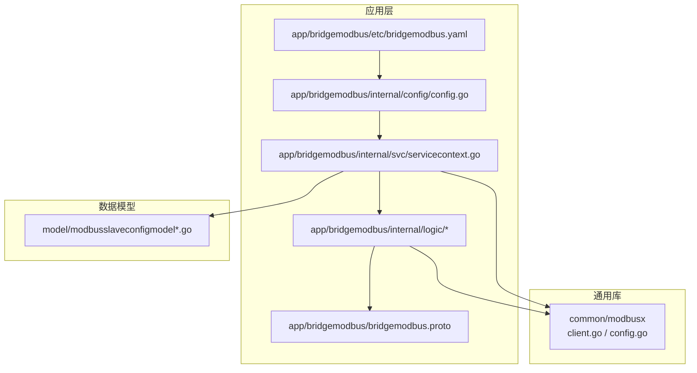
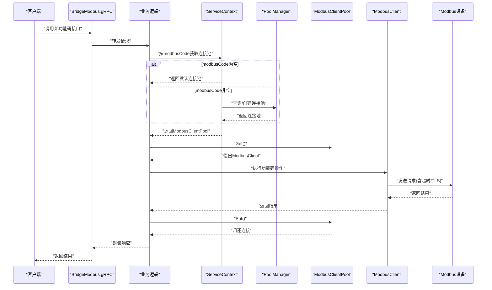
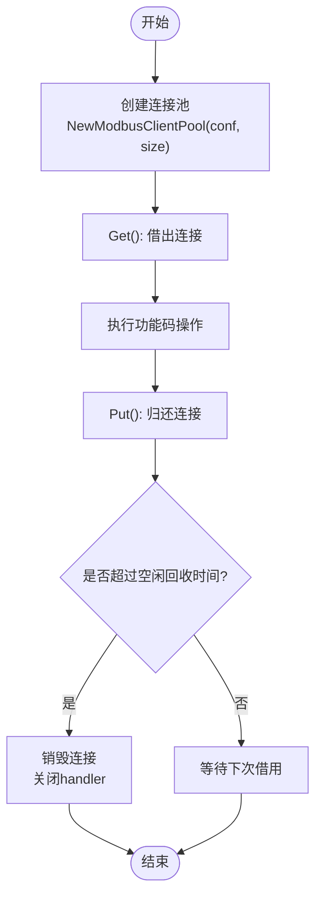
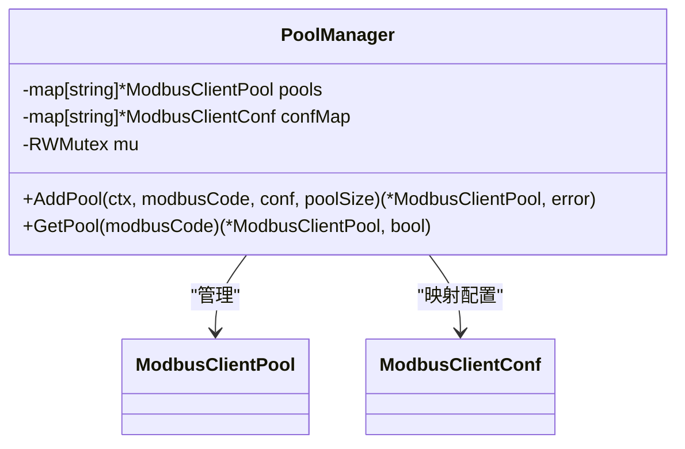
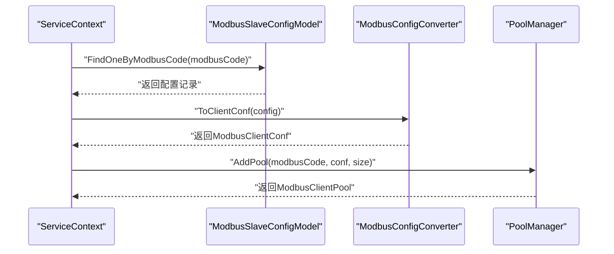
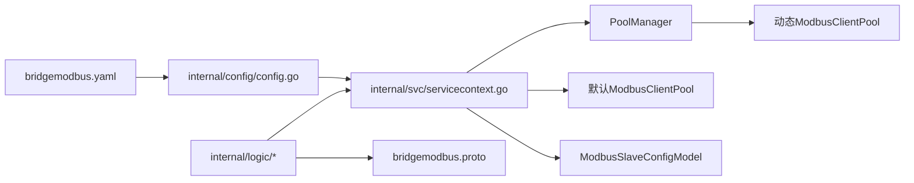

# Modbus协议处理组件

<cite>
**本文引用的文件**
- [common/modbusx/client.go](file://common/modbusx/client.go)
- [common/modbusx/config.go](file://common/modbusx/config.go)
- [app/bridgemodbus/etc/bridgemodbus.yaml](file://app/bridgemodbus/etc/bridgemodbus.yaml)
- [app/bridgemodbus/internal/config/config.go](file://app/bridgemodbus/internal/config/config.go)
- [app/bridgemodbus/internal/svc/servicecontext.go](file://app/bridgemodbus/internal/svc/servicecontext.go)
- [app/bridgemodbus/bridgemodbus.proto](file://app/bridgemodbus/bridgemodbus.proto)
- [app/bridgemodbus/internal/logic/readcoilslogic.go](file://app/bridgemodbus/internal/logic/readcoilslogic.go)
- [app/bridgemodbus/internal/logic/writesingleregisterlogic.go](file://app/bridgemodbus/internal/logic/writesingleregisterlogic.go)
- [app/bridgemodbus/internal/logic/readholdingregisterslogic.go](file://app/bridgemodbus/internal/logic/readholdingregisterslogic.go)
- [app/bridgemodbus/internal/logic/writemultiplecoilslogic.go](file://app/bridgemodbus/internal/logic/writemultiplecoilslogic.go)
- [app/bridgemodbus/internal/logic/readdeviceidentificationlogic.go](file://app/bridgemodbus/internal/logic/readdeviceidentificationlogic.go)
- [model/modbusslaveconfigmodel.go](file://model/modbusslaveconfigmodel.go)
- [model/modbusslaveconfigmodel_gen.go](file://model/modbusslaveconfigmodel_gen.go)
</cite>

## 目录
1. [简介](#简介)
2. [项目结构](#项目结构)
3. [核心组件](#核心组件)
4. [架构总览](#架构总览)
5. [详细组件分析](#详细组件分析)
6. [依赖关系分析](#依赖关系分析)
7. [性能考量](#性能考量)
8. [故障排查指南](#故障排查指南)
9. [结论](#结论)
10. [附录](#附录)

## 简介
本技术文档面向Zero-Service中的Modbus协议处理组件，系统性阐述以下内容：
- ModbusClient封装类的实现原理：TCP客户端处理器配置、连接建立流程、TLS安全连接支持等
- 各种功能码的数据读写操作：线圈读取(0x01)、离散输入读取(0x02)、保持寄存器读取(0x03)、输入寄存器读取(0x04)、单个线圈写入(0x05)、单个寄存器写入(0x06)、多个线圈写入(0x0F)、多个寄存器写入(0x10)、读写多个寄存器(0x17)、屏蔽寄存器写入(0x16)、FIFO队列读取(0x18)、设备标识读取(0x2B)等
- ModbusClientPool连接池的设计与实现：连接复用、资源管理、超时控制等机制
- 完整的配置项说明、使用示例、错误处理策略与性能优化建议
- Modbus协议交互流程图、配置示例与常见问题解决方案

## 项目结构
围绕Modbus协议处理的相关模块主要分布在如下位置：
- 通用库：common/modbusx 提供Modbus客户端封装与连接池管理
- 应用层：app/bridgemodbus 提供gRPC接口、配置、服务上下文与各功能逻辑
- 数据模型：model 提供从站配置模型及生成代码



**图表来源**
- [common/modbusx/client.go:1-218](file://common/modbusx/client.go#L1-L218)
- [common/modbusx/config.go:1-125](file://common/modbusx/config.go#L1-L125)
- [app/bridgemodbus/etc/bridgemodbus.yaml:1-26](file://app/bridgemodbus/etc/bridgemodbus.yaml#L1-L26)
- [app/bridgemodbus/internal/config/config.go:1-26](file://app/bridgemodbus/internal/config/config.go#L1-L26)
- [app/bridgemodbus/internal/svc/servicecontext.go:1-81](file://app/bridgemodbus/internal/svc/servicecontext.go#L1-L81)
- [app/bridgemodbus/bridgemodbus.proto:1-355](file://app/bridgemodbus/bridgemodbus.proto#L1-L355)
- [model/modbusslaveconfigmodel_gen.go:131-150](file://model/modbusslaveconfigmodel_gen.go#L131-L150)

**章节来源**
- [common/modbusx/client.go:1-218](file://common/modbusx/client.go#L1-L218)
- [common/modbusx/config.go:1-125](file://common/modbusx/config.go#L1-L125)
- [app/bridgemodbus/etc/bridgemodbus.yaml:1-26](file://app/bridgemodbus/etc/bridgemodbus.yaml#L1-L26)
- [app/bridgemodbus/internal/config/config.go:1-26](file://app/bridgemodbus/internal/config/config.go#L1-L26)
- [app/bridgemodbus/internal/svc/servicecontext.go:1-81](file://app/bridgemodbus/internal/svc/servicecontext.go#L1-L81)
- [app/bridgemodbus/bridgemodbus.proto:1-355](file://app/bridgemodbus/bridgemodbus.proto#L1-L355)
- [model/modbusslaveconfigmodel_gen.go:131-150](file://model/modbusslaveconfigmodel_gen.go#L131-L150)

## 核心组件
- ModbusClient：对底层modbus.Client进行薄封装，暴露标准功能码方法，并提供TLS配置、超时参数设置、日志增强等能力
- ModbusClientPool：基于syncx.Pool的连接池，负责连接复用、生命周期管理与资源回收
- PoolManager：多连接池管理器，按modbusCode维度管理不同配置的连接池
- ServiceContext：应用服务上下文，负责默认连接池与动态连接池的创建与获取
- gRPC接口与逻辑：通过bridgemodbus.proto定义的接口，调用ModbusClient完成具体功能码操作

**章节来源**
- [common/modbusx/client.go:20-143](file://common/modbusx/client.go#L20-L143)
- [common/modbusx/client.go:145-191](file://common/modbusx/client.go#L145-L191)
- [common/modbusx/config.go:63-124](file://common/modbusx/config.go#L63-L124)
- [app/bridgemodbus/internal/svc/servicecontext.go:14-80](file://app/bridgemodbus/internal/svc/servicecontext.go#L14-L80)

## 架构总览
下图展示了从gRPC请求到Modbus设备的完整交互路径，包括连接池选择、TLS配置、超时控制与日志追踪。



**图表来源**
- [app/bridgemodbus/internal/svc/servicecontext.go:56-80](file://app/bridgemodbus/internal/svc/servicecontext.go#L56-L80)
- [common/modbusx/config.go:78-107](file://common/modbusx/config.go#L78-L107)
- [common/modbusx/client.go:145-191](file://common/modbusx/client.go#L145-L191)
- [app/bridgemodbus/bridgemodbus.proto:10-83](file://app/bridgemodbus/bridgemodbus.proto#L10-L83)

## 详细组件分析

### ModbusClient封装类
- 功能覆盖：线圈读取(0x01)、离散输入读取(0x02)、保持寄存器读取(0x03)、输入寄存器读取(0x04)、单个线圈写入(0x05)、单个寄存器写入(0x06)、多个线圈写入(0x0F)、多个寄存器写入(0x10)、读写多个寄存器(0x17)、屏蔽寄存器写入(0x16)、FIFO队列读取(0x18)、设备标识读取(0x2B)
- TLS支持：当配置开启时，加载客户端证书与CA，构建tls.Config并注入TCPClientHandler
- 超时控制：支持Timeout、IdleTimeout、LinkRecoveryTimeout、ProtocolRecoveryTimeout、ConnectDelay
- 日志增强：自定义ModbusLogger，统一输出并携带会话ID与地址摘要，便于问题定位

```mermaid
classDiagram
class ModbusClient {
-string sid
-Client client
-TCPClientHandler handler
+ReadCoils(ctx, addr, qty) []byte
+ReadDiscreteInputs(ctx, addr, qty) []byte
+WriteSingleCoil(ctx, addr, value) []byte
+WriteMultipleCoils(ctx, addr, qty, bytes) []byte
+ReadInputRegisters(ctx, addr, qty) []byte
+ReadHoldingRegisters(ctx, addr, qty) []byte
+WriteSingleRegister(ctx, addr, value) []byte
+WriteMultipleRegisters(ctx, addr, qty, bytes) []byte
+ReadWriteMultipleRegisters(ctx, rAddr, rQty, wAddr, wQty, bytes) []byte
+MaskWriteRegister(ctx, addr, andMask, orMask) []byte
+ReadFIFOQueue(ctx, addr) []byte
+ReadDeviceIdentification(ctx, code) map[byte][]byte
+Close() error
}
class ModbusClientConf {
+string Address
+int64 Slave
+int64 Timeout
+int64 IdleTimeout
+int64 LinkRecoveryTimeout
+int64 ProtocolRecoveryTimeout
+int64 ConnectDelay
+TLS struct{Enable,CertFile,KeyFile,CAFile}
}
class ModbusLogger {
-ModbusClientConf conf
-string sid
+Printf(format, v...) void
}
ModbusClient --> ModbusClientConf : "使用"
ModbusClient --> ModbusLogger : "记录日志"
```

**图表来源**
- [common/modbusx/client.go:20-97](file://common/modbusx/client.go#L20-L97)
- [common/modbusx/client.go:99-143](file://common/modbusx/client.go#L99-L143)
- [common/modbusx/config.go:32-61](file://common/modbusx/config.go#L32-L61)
- [common/modbusx/client.go:193-217](file://common/modbusx/client.go#L193-L217)

**章节来源**
- [common/modbusx/client.go:29-87](file://common/modbusx/client.go#L29-L87)
- [common/modbusx/client.go:106-143](file://common/modbusx/client.go#L106-L143)
- [common/modbusx/config.go:32-61](file://common/modbusx/config.go#L32-L61)

### ModbusClientPool连接池
- 初始化：根据配置创建TCPClientHandler，注入超时与TLS参数，包装为modbus.Client
- 复用策略：基于syncx.Pool，支持最大空闲时间回收（默认10分钟）
- 生命周期：Get/Put配对使用，确保连接正确归还；池销毁回调负责关闭底层handler
- 使用注意：每次操作完成后务必Put回池，避免连接泄漏



**图表来源**
- [common/modbusx/client.go:153-178](file://common/modbusx/client.go#L153-L178)
- [common/modbusx/client.go:180-191](file://common/modbusx/client.go#L180-L191)

**章节来源**
- [common/modbusx/client.go:145-191](file://common/modbusx/client.go#L145-L191)

### PoolManager多连接池管理
- AddPool：按modbusCode新增连接池，若已存在则返回旧池；校验参数合法性
- GetPool：并发安全地按modbusCode获取连接池
- 适用场景：同一服务对接多个不同设备或网络环境，按modbusCode隔离连接池



**图表来源**
- [common/modbusx/config.go:63-124](file://common/modbusx/config.go#L63-L124)

**章节来源**
- [common/modbusx/config.go:78-124](file://common/modbusx/config.go#L78-L124)

### ServiceContext与动态连接池
- 默认连接池：基于应用配置创建
- 动态连接池：按modbusCode从数据库查询配置，转换为ModbusClientConf后交由PoolManager管理
- 获取策略：优先使用动态池，不存在则创建；为空则返回业务错误



**图表来源**
- [app/bridgemodbus/internal/svc/servicecontext.go:34-54](file://app/bridgemodbus/internal/svc/servicecontext.go#L34-L54)
- [model/modbusslaveconfigmodel_gen.go:131-150](file://model/modbusslaveconfigmodel_gen.go#L131-L150)

**章节来源**
- [app/bridgemodbus/internal/svc/servicecontext.go:34-80](file://app/bridgemodbus/internal/svc/servicecontext.go#L34-L80)
- [model/modbusslaveconfigmodel_gen.go:131-150](file://model/modbusslaveconfigmodel_gen.go#L131-L150)

### 功能码实现要点与示例

#### 线圈读取(0x01)
- 接口：ReadCoils
- 逻辑：从ServiceContext按modbusCode获取池 -> Get -> 调用ReadCoils -> Put
- 结果：原始字节结果 + 按位布尔值解析

**章节来源**
- [app/bridgemodbus/internal/logic/readcoilslogic.go:26-43](file://app/bridgemodbus/internal/logic/readcoilslogic.go#L26-L43)
- [common/modbusx/client.go:29-32](file://common/modbusx/client.go#L29-L32)

#### 保持寄存器读取(0x03)
- 接口：ReadHoldingRegisters
- 逻辑：Get -> ReadHoldingRegisters -> Put
- 结果：原始字节 + 无符号/有符号整型、十六进制、二进制等多维解析

**章节来源**
- [app/bridgemodbus/internal/logic/readholdingregisterslogic.go:27-57](file://app/bridgemodbus/internal/logic/readholdingregisterslogic.go#L27-L57)
- [common/modbusx/client.go:54-57](file://common/modbusx/client.go#L54-L57)

#### 单个寄存器写入(0x06)
- 接口：WriteSingleRegister
- 逻辑：参数校验(<=65535) -> Get -> WriteSingleRegister -> Put
- 结果：回显字节

**章节来源**
- [app/bridgemodbus/internal/logic/writesingleregisterlogic.go:29-54](file://app/bridgemodbus/internal/logic/writesingleregisterlogic.go#L29-L54)
- [common/modbusx/client.go:59-62](file://common/modbusx/client.go#L59-L62)

#### 多个线圈写入(0x0F)
- 接口：WriteMultipleCoils
- 逻辑：参数校验数量一致性 -> 布尔转位值 -> Get -> WriteMultipleCoils -> Put

**章节来源**
- [app/bridgemodbus/internal/logic/writemultiplecoilslogic.go:29-51](file://app/bridgemodbus/internal/logic/writemultiplecoilslogic.go#L29-L51)
- [common/modbusx/client.go:44-47](file://common/modbusx/client.go#L44-L47)

#### 设备标识读取(0x2B)
- 接口：ReadDeviceIdentification
- 逻辑：Get -> ReadDeviceIdentification -> Put
- 结果：十进制ID映射、十六进制ID映射、语义化映射

**章节来源**
- [app/bridgemodbus/internal/logic/readdeviceidentificationlogic.go:29-69](file://app/bridgemodbus/internal/logic/readdeviceidentificationlogic.go#L29-L69)
- [common/modbusx/client.go:84-87](file://common/modbusx/client.go#L84-L87)

## 依赖关系分析
- 应用配置与运行时
  - bridgemodbus.yaml提供监听端口、日志、默认ModbusPool大小与默认ModbusClientConf
  - internal/config/config.go将yaml映射为Config结构，包含ModbusPool与ModbusClientConf
- 服务上下文
  - ServiceContext负责创建默认连接池与PoolManager，并按modbusCode动态创建连接池
- 数据模型
  - ModbusSlaveConfigModel提供按modbusCode查询配置的能力，配合ServiceContext完成动态连接池创建
- gRPC接口
  - bridgemodbus.proto定义所有功能码接口，业务逻辑通过ServiceContext获取连接池并执行



**图表来源**
- [app/bridgemodbus/etc/bridgemodbus.yaml:1-26](file://app/bridgemodbus/etc/bridgemodbus.yaml#L1-L26)
- [app/bridgemodbus/internal/config/config.go:9-25](file://app/bridgemodbus/internal/config/config.go#L9-L25)
- [app/bridgemodbus/internal/svc/servicecontext.go:22-32](file://app/bridgemodbus/internal/svc/servicecontext.go#L22-L32)
- [model/modbusslaveconfigmodel_gen.go:131-150](file://model/modbusslaveconfigmodel_gen.go#L131-L150)
- [app/bridgemodbus/bridgemodbus.proto:10-83](file://app/bridgemodbus/bridgemodbus.proto#L10-L83)

**章节来源**
- [app/bridgemodbus/etc/bridgemodbus.yaml:1-26](file://app/bridgemodbus/etc/bridgemodbus.yaml#L1-L26)
- [app/bridgemodbus/internal/config/config.go:9-25](file://app/bridgemodbus/internal/config/config.go#L9-L25)
- [app/bridgemodbus/internal/svc/servicecontext.go:22-80](file://app/bridgemodbus/internal/svc/servicecontext.go#L22-L80)
- [model/modbusslaveconfigmodel_gen.go:131-150](file://model/modbusslaveconfigmodel_gen.go#L131-L150)
- [app/bridgemodbus/bridgemodbus.proto:10-83](file://app/bridgemodbus/bridgemodbus.proto#L10-L83)

## 性能考量
- 连接池大小：根据并发请求数与设备承载能力合理设置ModbusPool，避免频繁创建/销毁连接
- 超时参数：结合设备响应特性调整Timeout、IdleTimeout、LinkRecoveryTimeout、ProtocolRecoveryTimeout，减少无效等待
- TLS开销：仅在必要时启用TLS，证书加载与握手会带来额外CPU消耗
- 日志级别：生产环境建议降低日志量，避免高频打印影响性能
- 数据解析：对大量寄存器读取建议在上层做批量处理与缓存，减少重复解析

## 故障排查指南
- 连接失败
  - 检查Address与端口是否可达，确认防火墙策略
  - 若启用TLS，检查证书/密钥/CA文件路径与权限
- 超时错误
  - 提升Timeout与IdleTimeout，观察设备响应时间
  - 检查LinkRecoveryTimeout与ProtocolRecoveryTimeout是否过小
- 参数错误
  - 单个寄存器写入值需在16位范围内
  - 多线圈写入数量与布尔值数量必须一致
- 动态连接池未创建
  - 确认数据库中配置存在且状态为启用
  - 检查ServiceContext的AddPool流程与PoolManager的AddPool返回

**章节来源**
- [app/bridgemodbus/internal/logic/writesingleregisterlogic.go:38-40](file://app/bridgemodbus/internal/logic/writesingleregisterlogic.go#L38-L40)
- [app/bridgemodbus/internal/logic/writemultiplecoilslogic.go:31-33](file://app/bridgemodbus/internal/logic/writemultiplecoilslogic.go#L31-L33)
- [app/bridgemodbus/internal/svc/servicecontext.go:34-54](file://app/bridgemodbus/internal/svc/servicecontext.go#L34-L54)

## 结论
本组件通过ModbusClient封装与连接池机制，提供了稳定、可扩展的Modbus协议处理能力。结合gRPC接口与动态连接池管理，能够灵活适配多设备、多场景的工业通信需求。建议在生产环境中合理配置超时与连接池大小，并启用必要的TLS与日志策略，以获得更好的安全性与可观测性。

## 附录

### 配置项说明
- bridgemodbus.yaml
  - Name/ListenOn/Timeout/Mode/Log：服务基本信息与日志配置
  - ModbusPool：默认连接池大小
  - NacosConfig：注册中心配置（可选）
  - DB：数据库连接串
  - ModbusClientConf：默认Modbus客户端配置
- ModbusClientConf
  - Address：设备地址(IP:Port)
  - Slave：从站地址
  - Timeout/IdleTimeout/LinkRecoveryTimeout/ProtocolRecoveryTimeout/ConnectDelay：超时与延迟参数
  - TLS：证书/密钥/CA文件路径

**章节来源**
- [app/bridgemodbus/etc/bridgemodbus.yaml:1-26](file://app/bridgemodbus/etc/bridgemodbus.yaml#L1-L26)
- [app/bridgemodbus/internal/config/config.go:9-25](file://app/bridgemodbus/internal/config/config.go#L9-L25)
- [common/modbusx/config.go:32-61](file://common/modbusx/config.go#L32-L61)

### 使用示例（步骤说明）
- 默认连接池：直接通过modbusCode为空使用默认配置
- 动态连接池：在数据库中保存目标设备的Modbus配置，调用接口时传入对应的modbusCode，ServiceContext会自动创建并复用连接池
- 功能码调用：在业务逻辑中按需调用ReadCoils/ReadHoldingRegisters/WriteSingleRegister等接口，内部自动完成Get/Put

**章节来源**
- [app/bridgemodbus/internal/svc/servicecontext.go:56-80](file://app/bridgemodbus/internal/svc/servicecontext.go#L56-L80)
- [app/bridgemodbus/bridgemodbus.proto:10-83](file://app/bridgemodbus/bridgemodbus.proto#L10-L83)