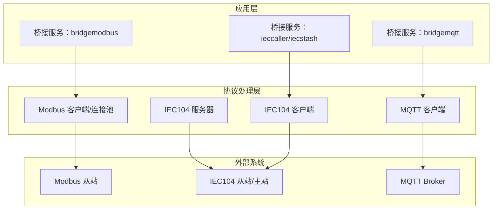
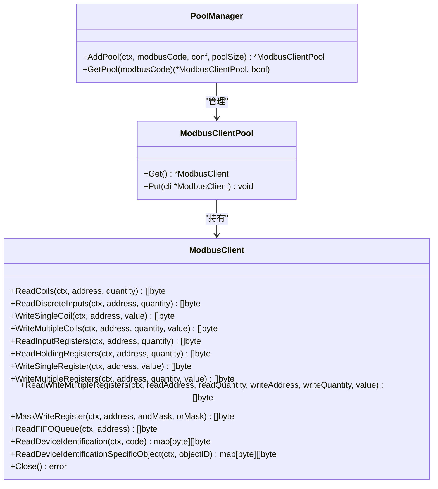
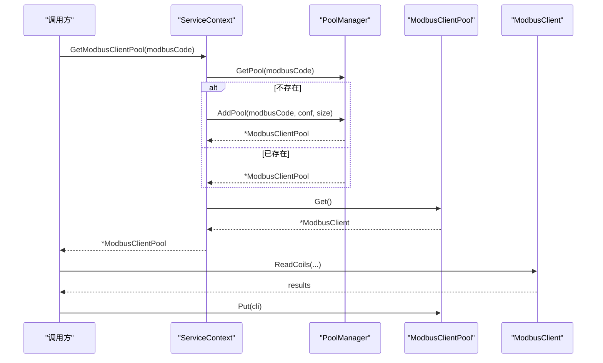
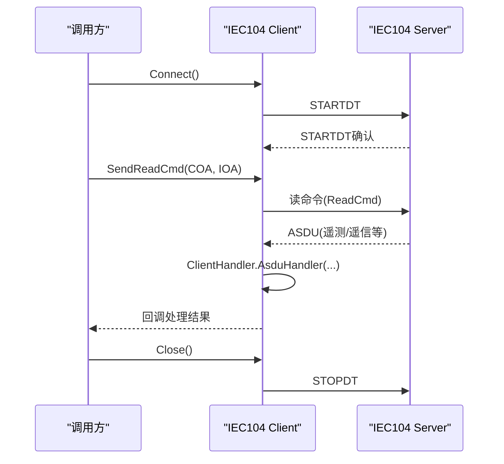
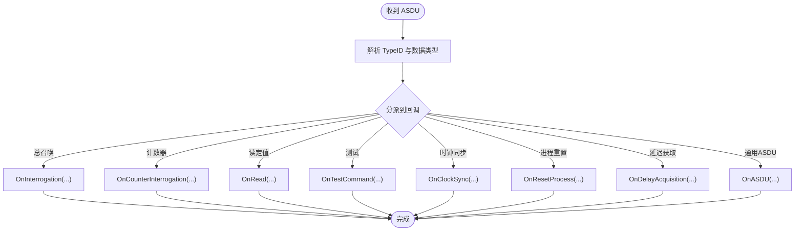
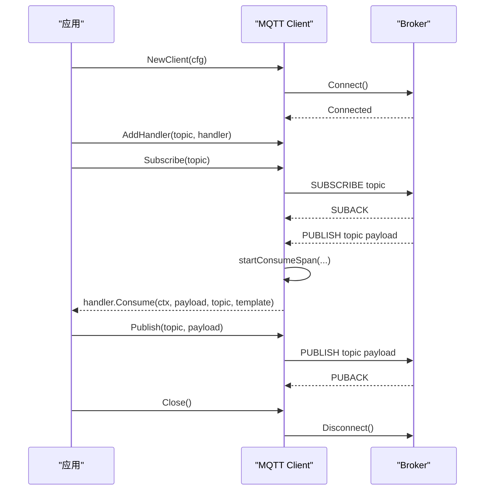
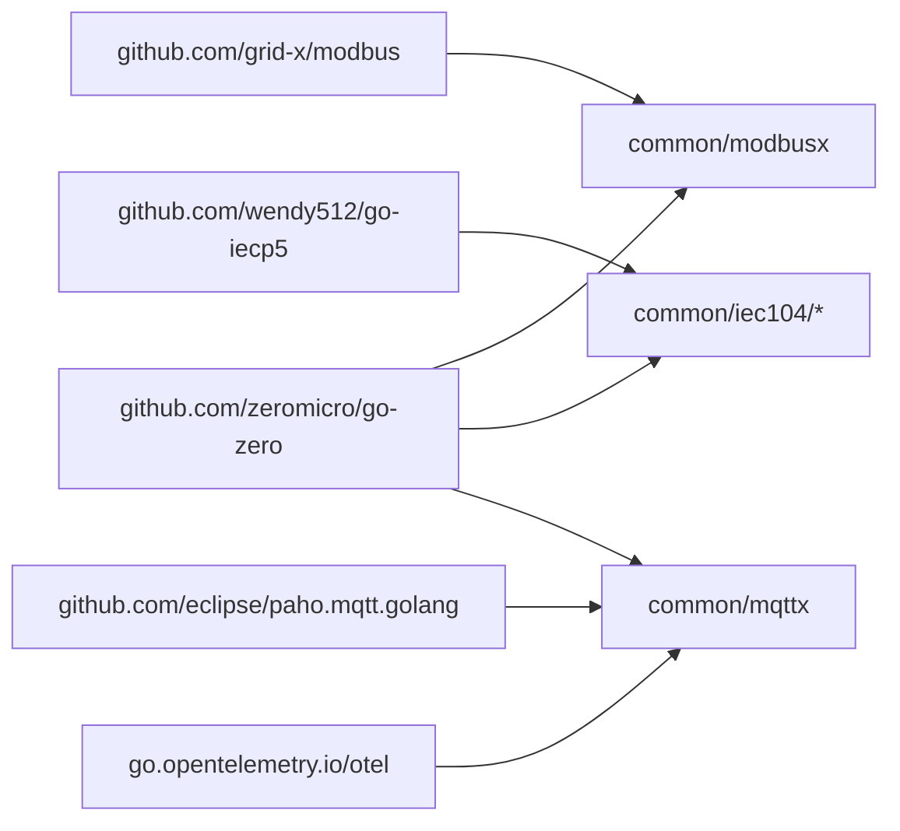

# 协议处理组件

<cite>
**本文引用的文件**
- [common/modbusx/client.go](file://common/modbusx/client.go)
- [common/modbusx/config.go](file://common/modbusx/config.go)
- [app/bridgemodbus/internal/svc/servicecontext.go](file://app/bridgemodbus/internal/svc/servicecontext.go)
- [app/bridgemodbus/internal/logic/readcoilslogic.go](file://app/bridgemodbus/internal/logic/readcoilslogic.go)
- [model/sql/modbus.sql](file://model/sql/modbus.sql)
- [common/iec104/client/core.go](file://common/iec104/client/core.go)
- [common/iec104/client/handle.go](file://common/iec104/client/handle.go)
- [common/iec104/server/iecServer.go](file://common/iec104/server/iecServer.go)
- [common/iec104/server/handler.go](file://common/iec104/server/handler.go)
- [common/iec104/types/types.go](file://common/iec104/types/types.go)
- [app/ieccaller/internal/logic/sendreadcmdlogic.go](file://app/ieccaller/internal/logic/sendreadcmdlogic.go)
- [docs/iec104-protocol.md](file://docs/iec104-protocol.md)
- [common/mqttx/mqttx.go](file://common/mqttx/mqttx.go)
- [common/mqttx/trace.go](file://common/mqttx/trace.go)
- [app/bridgemqtt/internal/logic/publishlogic.go](file://app/bridgemqtt/internal/logic/publishlogic.go)
- [app/bridgemqtt/bridgemqtt/bridgemqtt.pb.go](file://app/bridgemqtt/bridgemqtt/bridgemqtt.pb.go)
</cite>

## 目录
1. [简介](#简介)
2. [项目结构](#项目结构)
3. [核心组件](#核心组件)
4. [架构总览](#架构总览)
5. [详细组件分析](#详细组件分析)
6. [依赖分析](#依赖分析)
7. [性能考量](#性能考量)
8. [故障排查指南](#故障排查指南)
9. [结论](#结论)
10. [附录](#附录)

## 简介
本文件系统性梳理 Zero-Service 中的协议处理组件，覆盖以下三大协议栈：
- Modbus/TCP：提供客户端封装、连接池管理、TLS 安全连接、功能码读写（线圈、寄存器、设备标识等）。
- IEC 60870-5-104：提供客户端核心实现（连接管理、命令发送、ASDU 数据处理）、服务器端实现（监听与处理）、以及消息格式与类型定义。
- MQTT：提供客户端管理（连接、订阅、发布）、消息消费与生产、OpenTelemetry 追踪集成。

文档包含配置项说明、使用示例路径、错误处理策略与性能优化建议，并辅以多幅流程与时序图帮助理解。

## 项目结构
围绕协议处理的关键目录与文件如下：
- Modbus
  - 公共库：common/modbusx（客户端封装、连接池、配置）
  - 业务网关：app/bridgemodbus（服务上下文、逻辑层）
  - 数据模型：model/sql/modbus.sql（配置持久化字段）
- IEC104
  - 客户端：common/iec104/client（核心、处理器）
  - 服务器端：common/iec104/server（服务端、处理器接口）
  - 类型定义：common/iec104/types（消息体、ASDU 结构）
  - 文档：docs/iec104-protocol.md（消息格式与ASDU映射）
  - 调用示例：app/ieccaller/internal/logic/*（读命令等）
- MQTT
  - 客户端：common/mqttx（客户端、追踪）
  - 业务网关：app/bridgemqtt（发布逻辑）
  - 协议定义：app/bridgemqtt/bridgemqtt.proto（发布/带Trace发布）

```mermaid
graph TB
subgraph "Modbus"
A_modbus_client["common/modbusx/client.go<br/>ModbusClient/Pool"]
A_modbus_conf["common/modbusx/config.go<br/>ModbusClientConf/PoolManager"]
A_bridgemodbus_svc["app/bridgemodbus/internal/svc/servicecontext.go<br/>Get/Add Pool"]
A_bridgemodbus_logic["app/bridgemodbus/internal/logic/readcoilslogic.go<br/>ReadCoils"]
A_model_sql["model/sql/modbus.sql<br/>配置表"]
end
subgraph "IEC104"
B_client_core["common/iec104/client/core.go<br/>Client/命令发送"]
B_client_handle["common/iec104/client/handle.go<br/>ASDU处理"]
B_server["common/iec104/server/iecServer.go<br/>IecServer"]
B_server_handler["common/iec104/server/handler.go<br/>CommandHandler接口"]
B_types["common/iec104/types/types.go<br/>消息体/ASDU结构"]
B_doc["docs/iec104-protocol.md<br/>消息格式/ASDU映射"]
B_caller_logic["app/ieccaller/internal/logic/sendreadcmdlogic.go<br/>发送读命令"]
end
subgraph "MQTT"
C_mqtt_client["common/mqttx/mqttx.go<br/>Client/Publish/Subscribe"]
C_mqtt_trace["common/mqttx/trace.go<br/>TextMapCarrier"]
C_bridgemqtt_logic["app/bridgemqtt/internal/logic/publishlogic.go<br/>发布逻辑"]
C_bridgemqtt_proto["app/bridgemqtt/bridgemqtt/bridgemqtt.pb.go<br/>发布/带Trace发布"]
end
A_bridgemodbus_svc --> A_modbus_conf
A_bridgemodbus_svc --> A_modbus_client
A_bridgemodbus_logic --> A_bridgemodbus_svc
A_modbus_client --> A_model_sql
B_client_core --> B_client_handle
B_server --> B_server_handler
B_caller_logic --> B_client_core
B_doc --> B_types
C_bridgemqtt_logic --> C_mqtt_client
C_mqtt_trace --> C_mqtt_client
C_bridgemqtt_proto --> C_bridgemqtt_logic
```

**图表来源**
- [common/modbusx/client.go:1-218](file://common/modbusx/client.go#L1-L218)
- [common/modbusx/config.go:1-125](file://common/modbusx/config.go#L1-L125)
- [app/bridgemodbus/internal/svc/servicecontext.go:34-80](file://app/bridgemodbus/internal/svc/servicecontext.go#L34-L80)
- [app/bridgemodbus/internal/logic/readcoilslogic.go:1-44](file://app/bridgemodbus/internal/logic/readcoilslogic.go#L1-L44)
- [model/sql/modbus.sql:14-25](file://model/sql/modbus.sql#L14-L25)
- [common/iec104/client/core.go:1-446](file://common/iec104/client/core.go#L1-L446)
- [common/iec104/client/handle.go:1-155](file://common/iec104/client/handle.go#L1-L155)
- [common/iec104/server/iecServer.go:1-38](file://common/iec104/server/iecServer.go#L1-L38)
- [common/iec104/server/handler.go:1-60](file://common/iec104/server/handler.go#L1-L60)
- [common/iec104/types/types.go:1-323](file://common/iec104/types/types.go#L1-L323)
- [docs/iec104-protocol.md:1-884](file://docs/iec104-protocol.md#L1-L884)
- [app/ieccaller/internal/logic/sendreadcmdlogic.go:1-44](file://app/ieccaller/internal/logic/sendreadcmdlogic.go#L1-L44)
- [common/mqttx/mqttx.go:1-389](file://common/mqttx/mqttx.go#L1-L389)
- [common/mqttx/trace.go:1-31](file://common/mqttx/trace.go#L1-L31)
- [app/bridgemqtt/internal/logic/publishlogic.go:1-34](file://app/bridgemqtt/internal/logic/publishlogic.go#L1-L34)
- [app/bridgemqtt/bridgemqtt/bridgemqtt.pb.go:160-302](file://app/bridgemqtt/bridgemqtt/bridgemqtt.pb.go#L160-L302)

**章节来源**
- [common/modbusx/client.go:1-218](file://common/modbusx/client.go#L1-L218)
- [common/modbusx/config.go:1-125](file://common/modbusx/config.go#L1-L125)
- [app/bridgemodbus/internal/svc/servicecontext.go:34-80](file://app/bridgemodbus/internal/svc/servicecontext.go#L34-L80)
- [app/bridgemodbus/internal/logic/readcoilslogic.go:1-44](file://app/bridgemodbus/internal/logic/readcoilslogic.go#L1-L44)
- [model/sql/modbus.sql:14-25](file://model/sql/modbus.sql#L14-L25)
- [common/iec104/client/core.go:1-446](file://common/iec104/client/core.go#L1-L446)
- [common/iec104/client/handle.go:1-155](file://common/iec104/client/handle.go#L1-L155)
- [common/iec104/server/iecServer.go:1-38](file://common/iec104/server/iecServer.go#L1-L38)
- [common/iec104/server/handler.go:1-60](file://common/iec104/server/handler.go#L1-L60)
- [common/iec104/types/types.go:1-323](file://common/iec104/types/types.go#L1-L323)
- [docs/iec104-protocol.md:1-884](file://docs/iec104-protocol.md#L1-L884)
- [app/ieccaller/internal/logic/sendreadcmdlogic.go:1-44](file://app/ieccaller/internal/logic/sendreadcmdlogic.go#L1-L44)
- [common/mqttx/mqttx.go:1-389](file://common/mqttx/mqttx.go#L1-L389)
- [common/mqttx/trace.go:1-31](file://common/mqttx/trace.go#L1-L31)
- [app/bridgemqtt/internal/logic/publishlogic.go:1-34](file://app/bridgemqtt/internal/logic/publishlogic.go#L1-L34)
- [app/bridgemqtt/bridgemqtt/bridgemqtt.pb.go:160-302](file://app/bridgemqtt/bridgemqtt/bridgemqtt.pb.go#L160-L302)

## 核心组件
- Modbus/TCP 客户端与连接池
  - ModbusClient：对底层 modbus.Client 的薄封装，暴露常用功能码方法（线圈、寄存器、设备标识等），并支持 TLS。
  - ModbusClientPool：基于 syncx.Pool 的连接池，支持最大空闲时间回收与并发安全。
  - PoolManager：按 modbusCode 管理多个连接池，提供新增与查询能力。
  - 配置结构 ModbusClientConf：包含地址、从站ID、超时、重连间隔、连接延迟、TLS 等。
- IEC104 客户端与服务器
  - 客户端 Client：负责连接、自动重连、命令发送（总召唤、计数器、时钟同步、读命令、复位、测试、各类控制命令等），并设置连接事件回调。
  - 客户端处理器 ClientHandler：将收到的 ASDU 分派到上层回调（总召唤、计数器、读定值、测试、时钟同步、进程重置、延迟获取、通用ASDU）。
  - 服务器端 IecServer：基于 cs104.Server 提供监听与处理，支持日志与参数配置。
  - 类型定义 types：消息体 MsgBody、点位映射 PointMapping、以及各类 ASDU 信息体结构（单点、双点、规一化/标度化/短浮点遥测、步位置、位串、累加量、保护事件等）。
- MQTT 客户端
  - Client：支持连接、自动重连、订阅/发布、处理器注册、默认事件回退、指标统计与 OpenTelemetry 追踪。
  - Trace：通过 TextMapCarrier 实现跨服务传播头注入/提取。

**章节来源**
- [common/modbusx/client.go:20-197](file://common/modbusx/client.go#L20-L197)
- [common/modbusx/config.go:32-61](file://common/modbusx/config.go#L32-L61)
- [common/modbusx/config.go:63-125](file://common/modbusx/config.go#L63-L125)
- [common/iec104/client/core.go:48-176](file://common/iec104/client/core.go#L48-L176)
- [common/iec104/client/handle.go:34-155](file://common/iec104/client/handle.go#L34-L155)
- [common/iec104/server/iecServer.go:12-38](file://common/iec104/server/iecServer.go#L12-L38)
- [common/iec104/types/types.go:17-40](file://common/iec104/types/types.go#L17-L40)
- [common/mqttx/mqttx.go:76-178](file://common/mqttx/mqttx.go#L76-L178)
- [common/mqttx/trace.go:8-31](file://common/mqttx/trace.go#L8-L31)

## 架构总览
下图展示三大协议处理组件的高层交互与职责边界：

**图表来源**
- [common/modbusx/client.go:145-191](file://common/modbusx/client.go#L145-L191)
- [common/iec104/client/core.go:161-170](file://common/iec104/client/core.go#L161-L170)
- [common/iec104/server/iecServer.go:31-37](file://common/iec104/server/iecServer.go#L31-L37)
- [common/mqttx/mqttx.go:309-333](file://common/mqttx/mqttx.go#L309-L333)

## 详细组件分析

### Modbus/TCP 组件
- 客户端封装与功能码
  - 支持线圈读写（ReadCoils、WriteSingleCoil、WriteMultipleCoils）、离散输入读取、寄存器读写（ReadHoldingRegisters、WriteSingleRegister、WriteMultipleRegisters、ReadWriteMultipleRegisters、MaskWriteRegister、ReadFIFOQueue）。
  - 设备标识读取（ReadDeviceIdentification、ReadDeviceIdentificationSpecificObject）。
  - TLS 支持：当启用 TLS 时，加载客户端证书与 CA，配置 RootCAs 并传递给底层 TCPClientHandler。
- 连接池管理
  - NewModbusClientPool：初始化连接池，设置最大空闲时间（默认 10 分钟），池内对象创建与销毁均通过 NewModbusClient 完成。
  - Get/Put：并发安全地借还连接；Get 时更新 lastUsed 时间。
  - PoolManager：AddPool/GetPool 支持按 modbusCode 管理多个连接池，避免重复创建。
- 配置与持久化
  - ModbusClientConf：包含地址、从站ID、超时、空闲超时、连接恢复间隔、协议恢复间隔、连接延迟、TLS 开关与证书路径。
  - model/sql/modbus.sql：配置表字段与注释与上述结构一一对应，含状态与备注字段。
- 业务接入
  - ServiceContext.GetModbusClientPool：根据 modbusCode 获取或创建连接池；若配置未启用或不存在则返回业务错误。
  - ReadCoilsLogic：演示如何从连接池借出客户端、执行读取、归还连接。

**图表来源**
- [common/modbusx/client.go:20-97](file://common/modbusx/client.go#L20-L97)
- [common/modbusx/client.go:145-191](file://common/modbusx/client.go#L145-L191)
- [common/modbusx/config.go:63-125](file://common/modbusx/config.go#L63-L125)

**图表来源**
- [app/bridgemodbus/internal/svc/servicecontext.go:56-80](file://app/bridgemodbus/internal/svc/servicecontext.go#L56-L80)
- [common/modbusx/config.go:78-125](file://common/modbusx/config.go#L78-L125)
- [common/modbusx/client.go:180-191](file://common/modbusx/client.go#L180-L191)

**章节来源**
- [common/modbusx/client.go:29-97](file://common/modbusx/client.go#L29-L97)
- [common/modbusx/client.go:106-143](file://common/modbusx/client.go#L106-L143)
- [common/modbusx/client.go:145-191](file://common/modbusx/client.go#L145-L191)
- [common/modbusx/config.go:32-61](file://common/modbusx/config.go#L32-L61)
- [common/modbusx/config.go:78-125](file://common/modbusx/config.go#L78-L125)
- [app/bridgemodbus/internal/svc/servicecontext.go:34-80](file://app/bridgemodbus/internal/svc/servicecontext.go#L34-L80)
- [app/bridgemodbus/internal/logic/readcoilslogic.go:26-43](file://app/bridgemodbus/internal/logic/readcoilslogic.go#L26-L43)
- [model/sql/modbus.sql:14-25](file://model/sql/modbus.sql#L14-L25)

### IEC104 组件
- 客户端核心
  - ClientConfig：主机、端口、自动重连、重连间隔、日志开关、元数据。
  - NewClient/Start/Stop/Connect/Close/IsConnected/IsRunning：生命周期管理。
  - 命令发送：总召唤、计数器、时钟同步、读命令、复位进程、测试命令、单命令、双命令、步命令、设定值命令（规一化/标度化/短浮点）、位串命令。
  - 连接事件：连接建立、断开、服务器主动激活。
- 客户端处理器
  - ClientHandler：将收到的 ASDU 分派到上层回调（Interrogation/CounterInterrogation/Read/TestCommand/ClockSync/ResetProcess/DelayAcquisition/ASDU）。
  - GetDataType：根据 TypeID 映射到 DataType，便于上层路由与处理。
- 服务器端
  - IecServer：封装 cs104.Server，设置参数与日志，监听与关闭。
  - ServerHandler：定义 CommandHandler 接口，提供各命令的入口。
- 类型与消息
  - MsgBody：包含消息ID、主机、端口、ASDU 名称/类型ID、数据类型、公共地址、信息体、时间、元数据、点位映射。
  - PointMapping：设备ID/名称、TDengine 表类型、扩展字段。
  - 各类 ASDU 信息体结构：单点、双点、规一化/标度化/短浮点遥测、步位置、位串、累加量、保护事件、带变位检出的成组单点等。

**图表来源**
- [common/iec104/client/core.go:161-170](file://common/iec104/client/core.go#L161-L170)
- [common/iec104/client/handle.go:102-109](file://common/iec104/client/handle.go#L102-L109)
- [common/iec104/server/iecServer.go:31-37](file://common/iec104/server/iecServer.go#L31-L37)

**图表来源**
- [common/iec104/client/handle.go:39-109](file://common/iec104/client/handle.go#L39-L109)
- [common/iec104/types/types.go:17-40](file://common/iec104/types/types.go#L17-L40)

**章节来源**
- [common/iec104/client/core.go:19-37](file://common/iec104/client/core.go#L19-L37)
- [common/iec104/client/core.go:87-117](file://common/iec104/client/core.go#L87-L117)
- [common/iec104/client/core.go:182-210](file://common/iec104/client/core.go#L182-L210)
- [common/iec104/client/core.go:304-436](file://common/iec104/client/core.go#L304-L436)
- [common/iec104/client/handle.go:34-155](file://common/iec104/client/handle.go#L34-L155)
- [common/iec104/server/iecServer.go:17-37](file://common/iec104/server/iecServer.go#L17-L37)
- [common/iec104/server/handler.go:16-60](file://common/iec104/server/handler.go#L16-L60)
- [common/iec104/types/types.go:17-323](file://common/iec104/types/types.go#L17-L323)
- [docs/iec104-protocol.md:166-204](file://docs/iec104-protocol.md#L166-L204)

### MQTT 组件
- 客户端管理
  - NewClient：初始化与连接，自动重连、心跳、超时、默认QoS校正、首次连接回调。
  - AddHandler/AddHandlerFunc：为主题注册处理器；支持自动订阅与手动订阅。
  - Subscribe/RestoreSubscriptions：订阅主题与重连后恢复订阅。
  - Publish：发布消息并带超时与错误追踪。
  - Close：优雅断开。
- 追踪与指标
  - startConsumeSpan/startPublishSpan：为消费/发布创建 Span，设置属性（客户端ID、主题、QoS、消息ID、动作）。
  - TextMapCarrier：通过消息头注入/提取上下文，实现跨服务链路追踪。
- 业务接入
  - PublishLogic：桥接服务中的发布逻辑，直接委托 MQTT 客户端。

**图表来源**
- [common/mqttx/mqttx.go:98-178](file://common/mqttx/mqttx.go#L98-L178)
- [common/mqttx/mqttx.go:180-255](file://common/mqttx/mqttx.go#L180-L255)
- [common/mqttx/mqttx.go:309-333](file://common/mqttx/mqttx.go#L309-L333)
- [common/mqttx/mqttx.go:361-388](file://common/mqttx/mqttx.go#L361-L388)
- [common/mqttx/trace.go:8-31](file://common/mqttx/trace.go#L8-L31)

**章节来源**
- [common/mqttx/mqttx.go:76-178](file://common/mqttx/mqttx.go#L76-L178)
- [common/mqttx/mqttx.go:180-255](file://common/mqttx/mqttx.go#L180-L255)
- [common/mqttx/mqttx.go:309-333](file://common/mqttx/mqttx.go#L309-L333)
- [common/mqttx/mqttx.go:361-388](file://common/mqttx/mqttx.go#L361-L388)
- [common/mqttx/trace.go:8-31](file://common/mqttx/trace.go#L8-L31)
- [app/bridgemqtt/internal/logic/publishlogic.go:26-33](file://app/bridgemqtt/internal/logic/publishlogic.go#L26-L33)
- [app/bridgemqtt/bridgemqtt/bridgemqtt.pb.go:160-302](file://app/bridgemqtt/bridgemqtt/bridgemqtt.pb.go#L160-L302)

## 依赖分析
- Modbus
  - 依赖 go-iecp5 的 modbus 客户端库，支持 TCP 与 TLS。
  - 使用 go-zero 的 logx、syncx.Pool、工具库进行日志与资源池管理。
- IEC104
  - 依赖 github.com/wendy512/go-iecp5/cs104 与 asdu，提供协议栈实现与参数配置。
  - 依赖 go-zero 的日志与指标统计。
- MQTT
  - 依赖 github.com/eclipse/paho.mqtt.golang，集成 OpenTelemetry 进行追踪。
  - 依赖 go-zero 的日志、指标与进程钩子。

**图表来源**
- [common/modbusx/client.go:14-17](file://common/modbusx/client.go#L14-L17)
- [common/iec104/client/core.go:13-16](file://common/iec104/client/core.go#L13-L16)
- [common/mqttx/mqttx.go:13-23](file://common/mqttx/mqttx.go#L13-L23)

**章节来源**
- [common/modbusx/client.go:14-17](file://common/modbusx/client.go#L14-L17)
- [common/iec104/client/core.go:13-16](file://common/iec104/client/core.go#L13-L16)
- [common/mqttx/mqttx.go:13-23](file://common/mqttx/mqttx.go#L13-L23)

## 性能考量
- Modbus
  - 连接池复用：通过 ModbusClientPool 减少频繁建连/断连开销；合理设置池大小与最大空闲时间，避免资源泄露与过度占用。
  - 超时与恢复：合理配置 Timeout、IdleTimeout、LinkRecoveryTimeout、ProtocolRecoveryTimeout，平衡响应速度与稳定性。
  - 功能码批量读取：优先使用批量读取（如 ReadHoldingRegisters/ReadInputRegisters）减少往返次数。
- IEC104
  - 自动重连与参数：AutoConnect 与 ReconnectInterval 影响可用性；参数宽泛（ParamsWide）提升兼容性但可能增加处理压力。
  - 指标统计：ClientHandler 对各类 ASDU 处理耗时进行统计，便于定位瓶颈。
- MQTT
  - QoS 选择：0/1/2 的权衡；默认QoS校正与超时控制保障可靠性与吞吐。
  - 订阅恢复：断线后自动恢复订阅，避免消息丢失；建议预热订阅列表。
  - 追踪开销：Span 创建与属性设置带来一定开销，建议在高负载场景下调低日志级别或采样。

[本节为通用指导，无需列出具体文件来源]

## 故障排查指南
- Modbus
  - TLS 证书加载失败：检查 CertFile/KeyFile/CAFile 路径与权限；确认 Enable 开关与证书内容。
  - 连接池为空：确认 ServiceContext.GetModbusClientPool 是否正确传入 modbusCode，且配置已启用。
  - 超时/空闲断开：检查 Timeout、IdleTimeout、LinkRecoveryTimeout、ConnectDelay；适当增大以适应网络波动。
- IEC104
  - 未连接发送命令：doSend 在未连接时返回 NotConnected 错误；确保已 Connect 并处于运行状态。
  - 服务器主动激活/断开：关注连接事件回调，必要时触发重连或告警。
  - ASDU 解析：确认 TypeID 与数据类型映射正确，避免 UNKNOWN 类型导致处理失败。
- MQTT
  - 连接失败/超时：检查 Broker 地址、用户名密码、KeepAlive、ConnectTimeout；确认网络可达。
  - 订阅失败：确认客户端已连接后再订阅；查看订阅超时与错误日志。
  - 追踪无上下文：检查消息头注入/提取是否正确，确保 TextMapCarrier 与传播器一致。

**章节来源**
- [common/modbusx/client.go:106-143](file://common/modbusx/client.go#L106-L143)
- [app/bridgemodbus/internal/svc/servicecontext.go:56-80](file://app/bridgemodbus/internal/svc/servicecontext.go#L56-L80)
- [common/iec104/client/core.go:304-308](file://common/iec104/client/core.go#L304-L308)
- [common/mqttx/mqttx.go:100-110](file://common/mqttx/mqttx.go#L100-L110)
- [common/mqttx/mqttx.go:204-233](file://common/mqttx/mqttx.go#L204-L233)

## 结论
本组件库提供了 Modbus/TCP、IEC104 与 MQTT 三类工业与物联网协议的完整处理方案：从客户端封装、连接池管理、TLS 安全，到命令/ASDU 处理与消息发布订阅，再到 OpenTelemetry 追踪与指标统计。通过合理的配置与调优，可在复杂环境中实现稳定、可观测、高性能的协议交互。

[本节为总结性内容，无需列出具体文件来源]

## 附录

### 配置项说明（摘要）
- Modbus
  - address：TCP 设备地址（IP:Port）
  - slave：从站地址（Unit ID）
  - timeout：发送/接收超时（毫秒）
  - idleTimeout：空闲连接自动关闭时间（毫秒）
  - linkRecoveryTimeout：TCP 连接出错后的重连间隔（毫秒）
  - protocolRecoveryTimeout：协议异常时的重试间隔（毫秒）
  - connectDelay：连接建立后等待时间（毫秒）
  - tls.enable：是否启用 TLS
  - tls.certFile/keyFile/caFile：证书/密钥/CA 文件路径
- IEC104
  - host/port：服务器地址
  - autoConnect：自动重连
  - reconnectInterval：重连间隔
  - logEnable：日志开关
  - metaDta：元数据
- MQTT
  - broker：Broker 地址列表
  - clientID/username/password：认证信息
  - qos：QoS（0/1/2）
  - timeout/keepAlive：超时与心跳
  - autoSubscribe/subscribeTopics/eventMapping/defaultEvent：订阅与事件映射

**章节来源**
- [common/modbusx/config.go:32-61](file://common/modbusx/config.go#L32-L61)
- [common/iec104/client/core.go:19-37](file://common/iec104/client/core.go#L19-L37)
- [common/mqttx/mqttx.go:51-64](file://common/mqttx/mqttx.go#L51-L64)

### 使用示例（路径）
- Modbus 读线圈
  - 业务逻辑：[app/bridgemodbus/internal/logic/readcoilslogic.go:26-43](file://app/bridgemodbus/internal/logic/readcoilslogic.go#L26-L43)
  - 服务上下文：[app/bridgemodbus/internal/svc/servicecontext.go:56-80](file://app/bridgemodbus/internal/svc/servicecontext.go#L56-L80)
- IEC104 发送读命令
  - 业务逻辑：[app/ieccaller/internal/logic/sendreadcmdlogic.go:25-43](file://app/ieccaller/internal/logic/sendreadcmdlogic.go#L25-L43)
  - 客户端命令：[common/iec104/client/core.go:197-200](file://common/iec104/client/core.go#L197-L200)
- MQTT 发布
  - 业务逻辑：[app/bridgemqtt/internal/logic/publishlogic.go:26-33](file://app/bridgemqtt/internal/logic/publishlogic.go#L26-L33)
  - 客户端发布：[common/mqttx/mqttx.go:309-333](file://common/mqttx/mqttx.go#L309-L333)

**章节来源**
- [app/bridgemodbus/internal/logic/readcoilslogic.go:26-43](file://app/bridgemodbus/internal/logic/readcoilslogic.go#L26-L43)
- [app/bridgemodbus/internal/svc/servicecontext.go:56-80](file://app/bridgemodbus/internal/svc/servicecontext.go#L56-L80)
- [app/ieccaller/internal/logic/sendreadcmdlogic.go:25-43](file://app/ieccaller/internal/logic/sendreadcmdlogic.go#L25-L43)
- [common/iec104/client/core.go:197-200](file://common/iec104/client/core.go#L197-L200)
- [app/bridgemqtt/internal/logic/publishlogic.go:26-33](file://app/bridgemqtt/internal/logic/publishlogic.go#L26-L33)
- [common/mqttx/mqttx.go:309-333](file://common/mqttx/mqttx.go#L309-L333)

### 常见问题与解决方案
- Modbus
  - 问题：TLS 握手失败
    - 解决：确认证书与 CA 文件路径正确、Enable=true；检查证书有效期与权限。
  - 问题：连接池无法获取客户端
    - 解决：检查 modbusCode 是否正确、配置是否启用、池大小是否合理。
- IEC104
  - 问题：发送命令报“未连接”
    - 解决：先调用 Connect，确认 IsConnected/IsRunning 为真。
  - 问题：ASDU 类型识别为 UNKNOWN
    - 解决：核对 TypeID 是否受支持，或扩展 GetDataType 映射。
- MQTT
  - 问题：订阅超时
    - 解决：增大 timeout 或检查 Broker 可达性；确认主题匹配。
  - 问题：无消费回调
    - 解决：确认已 AddHandler 并在连接成功后恢复订阅。

**章节来源**
- [common/modbusx/client.go:106-143](file://common/modbusx/client.go#L106-L143)
- [common/iec104/client/core.go:304-308](file://common/iec104/client/core.go#L304-L308)
- [common/mqttx/mqttx.go:204-233](file://common/mqttx/mqttx.go#L204-L233)