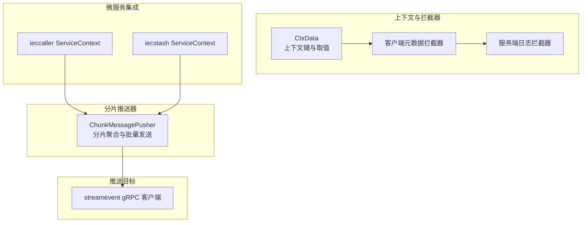
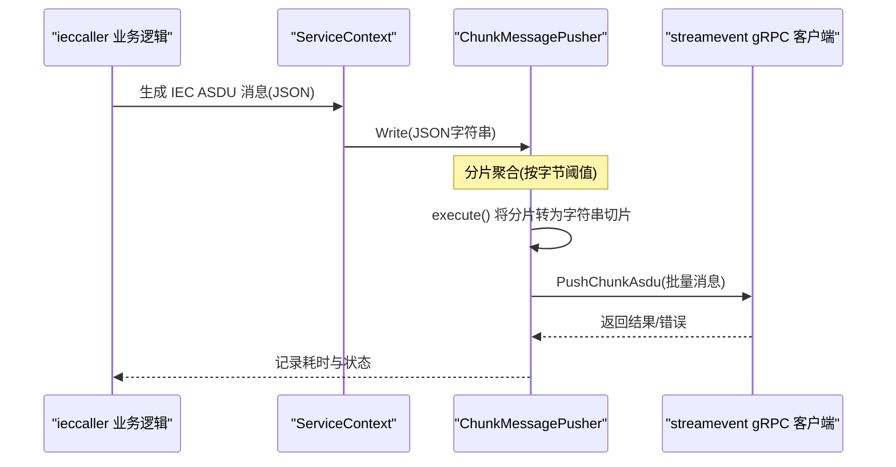
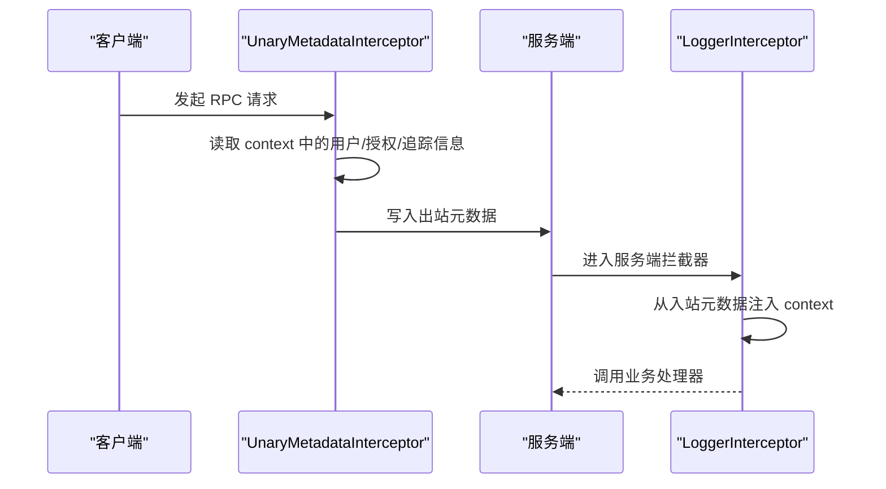
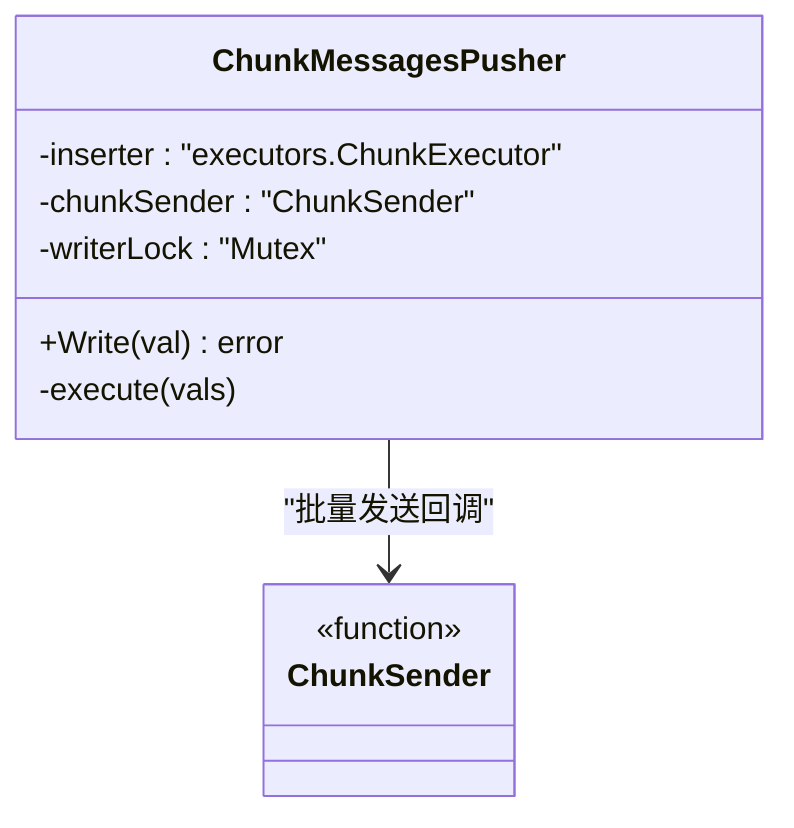
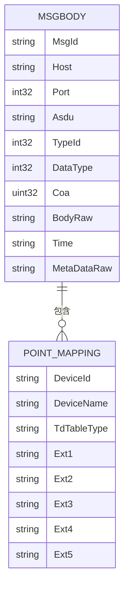
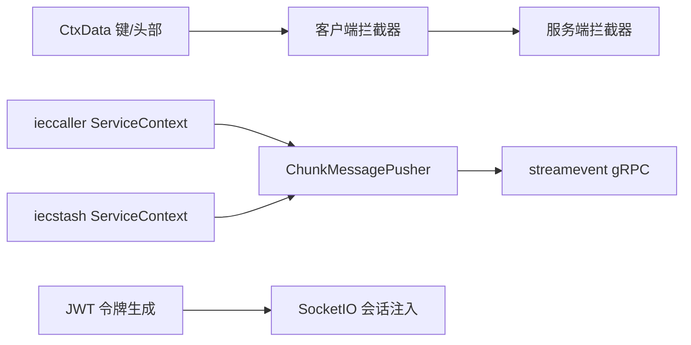

# 上下文执行工具

<cite>
**本文引用的文件**
- [common/ctxdata/ctxData.go](file://common/ctxdata/ctxData.go)
- [common/executorx/chunkmessagespusher.go](file://common/executorx/chunkmessagespusher.go)
- [common/Interceptor/rpcclient/metadataInterceptor.go](file://common/Interceptor/rpcclient/metadataInterceptor.go)
- [common/Interceptor/rpcserver/loggerInterceptor.go](file://common/Interceptor/rpcserver/loggerInterceptor.go)
- [app/ieccaller/internal/svc/servicecontext.go](file://app/ieccaller/internal/svc/servicecontext.go)
- [app/iecstash/internal/svc/servicecontext.go](file://app/iecstash/internal/svc/servicecontext.go)
- [facade/streamevent/streamevent/streamevent.pb.go](file://facade/streamevent/streamevent/streamevent.pb.go)
- [socketapp/socketpush/internal/logic/gentokenlogic.go](file://socketapp/socketpush/internal/logic/gentokenlogic.go)
- [common/socketiox/server.go](file://common/socketiox/server.go)
</cite>

## 目录
1. [简介](#简介)
2. [项目结构](#项目结构)
3. [核心组件](#核心组件)
4. [架构总览](#架构总览)
5. [组件详解](#组件详解)
6. [依赖关系分析](#依赖关系分析)
7. [性能与可靠性](#性能与可靠性)
8. [故障排查指南](#故障排查指南)
9. [结论](#结论)
10. [附录：使用示例与最佳实践](#附录使用示例与最佳实践)

## 简介
本技术文档聚焦于 Zero-Service 的两类关键执行工具：
- CtxData 上下文数据管理：统一承载用户标识、部门编码、鉴权令牌与链路追踪 ID，并通过 gRPC 元数据在微服务间传递，实现跨进程的数据隔离与权限控制。
- ChunkMessagePusher 分片消息推送器：基于 go-zero 的 ChunkExecutor 实现消息分片聚合、批量发送、并发安全与吞吐优化，适用于高并发日志、事件流与协议报文的批量推送。

文档将系统阐述两者的数据模型、调用流程、错误处理与性能特性，并给出在微服务中的使用范式与最佳实践。

## 项目结构
围绕上下文数据与分片推送的相关模块分布如下：
- 上下文数据与拦截器：common/ctxdata、common/Interceptor/rpcclient、common/Interceptor/rpcserver
- 分片推送器：common/executorx
- 微服务集成样例：app/ieccaller、app/iecstash
- 推送目标 gRPC 定义：facade/streamevent/streamevent
- 会话与令牌注入：socketapp/socketpush、common/socketiox

图表来源
- [common/ctxdata/ctxData.go:1-76](file://common/ctxdata/ctxData.go#L1-L76)
- [common/executorx/chunkmessagespusher.go:1-45](file://common/executorx/chunkmessagespusher.go#L1-L45)
- [common/Interceptor/rpcclient/metadataInterceptor.go:1-56](file://common/Interceptor/rpcclient/metadataInterceptor.go#L1-L56)
- [common/Interceptor/rpcserver/loggerInterceptor.go:1-45](file://common/Interceptor/rpcserver/loggerInterceptor.go#L1-L45)
- [app/ieccaller/internal/svc/servicecontext.go:1-311](file://app/ieccaller/internal/svc/servicecontext.go#L1-L311)
- [app/iecstash/internal/svc/servicecontext.go:1-92](file://app/iecstash/internal/svc/servicecontext.go#L1-L92)
- [facade/streamevent/streamevent/streamevent.pb.go:608-763](file://facade/streamevent/streamevent/streamevent.pb.go#L608-L763)

章节来源
- [common/ctxdata/ctxData.go:1-76](file://common/ctxdata/ctxData.go#L1-L76)
- [common/executorx/chunkmessagespusher.go:1-45](file://common/executorx/chunkmessagespusher.go#L1-L45)
- [common/Interceptor/rpcclient/metadataInterceptor.go:1-56](file://common/Interceptor/rpcclient/metadataInterceptor.go#L1-L56)
- [common/Interceptor/rpcserver/loggerInterceptor.go:1-45](file://common/Interceptor/rpcserver/loggerInterceptor.go#L1-L45)
- [app/ieccaller/internal/svc/servicecontext.go:1-311](file://app/ieccaller/internal/svc/servicecontext.go#L1-L311)
- [app/iecstash/internal/svc/servicecontext.go:1-92](file://app/iecstash/internal/svc/servicecontext.go#L1-L92)
- [facade/streamevent/streamevent/streamevent.pb.go:608-763](file://facade/streamevent/streamevent/streamevent.pb.go#L608-L763)

## 核心组件
- CtxData 上下文数据
  - 定义了上下文键常量与 gRPC 头部键常量，提供 GetUserId、GetUserName、GetDeptCode、GetAuthorization、GetTraceId 等便捷取值函数。
  - 在服务端拦截器中从入站元数据注入到 context；在客户端拦截器中将 context 值写入出站元数据，形成跨服务传递。
- ChunkMessagePusher 分片推送器
  - 通过 NewChunkMessagesPusher 构造，内部使用 go-zero 的 ChunkExecutor 按字节大小进行分片聚合。
  - 提供 Write 写入接口，execute 回调负责将分片转换为字符串切片后交由自定义 ChunkSender 批量发送。
  - 内置互斥锁保证并发安全。

章节来源
- [common/ctxdata/ctxData.go:9-76](file://common/ctxdata/ctxData.go#L9-L76)
- [common/executorx/chunkmessagespusher.go:9-45](file://common/executorx/chunkmessagespusher.go#L9-L45)

## 架构总览
以下序列图展示了“IEC 上下行消息”在微服务中的上下文传递与分片推送流程：

图表来源
- [app/ieccaller/internal/svc/servicecontext.go:144-244](file://app/ieccaller/internal/svc/servicecontext.go#L144-L244)
- [common/executorx/chunkmessagespusher.go:26-44](file://common/executorx/chunkmessagespusher.go#L26-L44)
- [facade/streamevent/streamevent/streamevent.pb.go:608-763](file://facade/streamevent/streamevent/streamevent.pb.go#L608-L763)

## 组件详解

### CtxData 上下文数据管理
- 数据模型与键空间
  - 上下文键：用户标识、用户名、部门编码、授权令牌、链路追踪 ID。
  - gRPC 头部键：与上下文键一一对应的小写头部名，便于跨服务传递。
- 取值与注入
  - 客户端拦截器：从 context 读取上述键值，写入出站元数据。
  - 服务端拦截器：从入站元数据读取头部值，注入回 context，供后续处理器使用。
- 权限与追踪
  - 授权令牌与追踪 ID 可用于审计、限流与问题定位。
  - 通过拦截器自动传播，避免在各层重复解析。

图表来源
- [common/Interceptor/rpcclient/metadataInterceptor.go:11-32](file://common/Interceptor/rpcclient/metadataInterceptor.go#L11-L32)
- [common/Interceptor/rpcserver/loggerInterceptor.go:12-44](file://common/Interceptor/rpcserver/loggerInterceptor.go#L12-L44)
- [common/ctxdata/ctxData.go:9-24](file://common/ctxdata/ctxData.go#L9-L24)

章节来源
- [common/ctxdata/ctxData.go:9-76](file://common/ctxdata/ctxData.go#L9-L76)
- [common/Interceptor/rpcclient/metadataInterceptor.go:11-32](file://common/Interceptor/rpcclient/metadataInterceptor.go#L11-L32)
- [common/Interceptor/rpcserver/loggerInterceptor.go:12-44](file://common/Interceptor/rpcserver/loggerInterceptor.go#L12-L44)

### ChunkMessagePusher 分片消息推送器
- 结构与职责
  - ChunkSender：批量发送回调，接收字符串切片。
  - ChunkMessagesPusher：封装 ChunkExecutor，负责并发安全写入与分片聚合。
- 分片策略
  - 使用 go-zero 的 ChunkExecutor，按字节阈值进行分片，提升吞吐与降低 RPC 次数。
- 并发与容错
  - 写入路径加互斥锁，保证多协程安全。
  - execute 回调将分片转换为字符串数组后调用自定义发送器；空分片直接返回，避免无效调用。
- 集成示例
  - ieccaller 与 iecstash 在 ServiceContext 中初始化 Pusher，并在业务逻辑中调用 Write。
  - 批量发送回调负责将 JSON 字段解析为 streamevent.MsgBody 列表，再调用 gRPC PushChunkAsdu。

图表来源
- [common/executorx/chunkmessagespusher.go:9-45](file://common/executorx/chunkmessagespusher.go#L9-L45)

章节来源
- [common/executorx/chunkmessagespusher.go:9-45](file://common/executorx/chunkmessagespusher.go#L9-L45)
- [app/ieccaller/internal/svc/servicecontext.go:76-131](file://app/ieccaller/internal/svc/servicecontext.go#L76-L131)
- [app/iecstash/internal/svc/servicecontext.go:36-92](file://app/iecstash/internal/svc/servicecontext.go#L36-L92)

### 推送目标：streamevent gRPC
- 消息体结构
  - MsgBody 包含消息标识、主机、端口、ASDU 类型、信息体类型、公共地址、原始信息体、时间戳与元数据等字段。
  - PointMapping 用于设备映射与扩展字段。
- 服务端处理
  - 服务端拦截器从元数据注入上下文键，便于后续鉴权与审计。
  - 客户端通过 PushChunkAsdu 批量推送，记录耗时与成功/失败状态。

图表来源
- [facade/streamevent/streamevent/streamevent.pb.go:608-763](file://facade/streamevent/streamevent/streamevent.pb.go#L608-L763)

章节来源
- [facade/streamevent/streamevent/streamevent.pb.go:608-763](file://facade/streamevent/streamevent/streamevent.pb.go#L608-L763)
- [common/Interceptor/rpcserver/loggerInterceptor.go:12-44](file://common/Interceptor/rpcserver/loggerInterceptor.go#L12-L44)

## 依赖关系分析
- CtxData 与拦截器
  - 客户端拦截器依赖 CtxData 的键与头部常量，将 context 注入出站元数据。
  - 服务端拦截器依赖 CtxData 的键，从入站元数据注入 context。
- 分片推送器与微服务
  - ieccaller 与 iecstash 的 ServiceContext 各自构造 ChunkMessagePusher，并在业务逻辑中调用 Write。
  - 批量发送回调将 JSON 转换为 streamevent.MsgBody 列表，调用 gRPC PushChunkAsdu。
- 令牌与会话
  - 令牌生成逻辑将用户标识写入 JWT 声明，SocketIO 服务器将令牌解析后的上下文键写入会话元数据，便于后续上下文传递。

图表来源
- [common/ctxdata/ctxData.go:9-24](file://common/ctxdata/ctxData.go#L9-L24)
- [common/Interceptor/rpcclient/metadataInterceptor.go:11-32](file://common/Interceptor/rpcclient/metadataInterceptor.go#L11-L32)
- [common/Interceptor/rpcserver/loggerInterceptor.go:12-44](file://common/Interceptor/rpcserver/loggerInterceptor.go#L12-L44)
- [app/ieccaller/internal/svc/servicecontext.go:76-131](file://app/ieccaller/internal/svc/servicecontext.go#L76-L131)
- [app/iecstash/internal/svc/servicecontext.go:36-92](file://app/iecstash/internal/svc/servicecontext.go#L36-L92)
- [socketapp/socketpush/internal/logic/gentokenlogic.go:57-78](file://socketapp/socketpush/internal/logic/gentokenlogic.go#L57-L78)
- [common/socketiox/server.go:337-380](file://common/socketiox/server.go#L337-L380)

章节来源
- [common/ctxdata/ctxData.go:9-24](file://common/ctxdata/ctxData.go#L9-L24)
- [common/Interceptor/rpcclient/metadataInterceptor.go:11-32](file://common/Interceptor/rpcclient/metadataInterceptor.go#L11-L32)
- [common/Interceptor/rpcserver/loggerInterceptor.go:12-44](file://common/Interceptor/rpcserver/loggerInterceptor.go#L12-L44)
- [app/ieccaller/internal/svc/servicecontext.go:76-131](file://app/ieccaller/internal/svc/servicecontext.go#L76-L131)
- [app/iecstash/internal/svc/servicecontext.go:36-92](file://app/iecstash/internal/svc/servicecontext.go#L36-L92)
- [socketapp/socketpush/internal/logic/gentokenlogic.go:57-78](file://socketapp/socketpush/internal/logic/gentokenlogic.go#L57-L78)
- [common/socketiox/server.go:337-380](file://common/socketiox/server.go#L337-L380)

## 性能与可靠性
- 分片聚合
  - 通过字节阈值控制单批消息大小，减少 RPC 次数，提升吞吐。
- 并发安全
  - 写入路径加锁，避免竞态；execute 回调内仅做转换与调用，逻辑轻量。
- 超时与可观测性
  - 微服务侧对 gRPC 调用设置超时，记录耗时与成功/失败标记，便于监控与告警。
- 可靠性保障
  - 批量发送失败时记录错误日志，不影响主流程继续写入；可在上层增加重试策略（建议结合幂等设计）。

[本节为通用性能讨论，不直接分析具体文件]

## 故障排查指南
- 上下文缺失
  - 现象：下游服务无法获取用户/授权/追踪信息。
  - 排查：确认客户端拦截器是否正确注入元数据；服务端拦截器是否正确从元数据注入 context。
- 分片未触发
  - 现象：Write 后未见批量发送。
  - 排查：检查分片字节阈值配置；确认未出现空分片导致的早返回；查看日志中批量大小与耗时。
- gRPC 调用失败
  - 现象：PushChunkAsdu 报错。
  - 排查：检查服务端是否启用大消息支持；核对消息体字段完整性；查看日志中的 tId 与耗时。
- 令牌与会话
  - 现象：SocketIO 连接后上下文键缺失。
  - 排查：确认令牌校验通过；检查 SocketIO 服务器是否将上下文键写入会话元数据。

章节来源
- [common/Interceptor/rpcclient/metadataInterceptor.go:11-32](file://common/Interceptor/rpcclient/metadataInterceptor.go#L11-L32)
- [common/Interceptor/rpcserver/loggerInterceptor.go:12-44](file://common/Interceptor/rpcserver/loggerInterceptor.go#L12-L44)
- [app/ieccaller/internal/svc/servicecontext.go:112-127](file://app/ieccaller/internal/svc/servicecontext.go#L112-L127)
- [app/iecstash/internal/svc/servicecontext.go:67-81](file://app/iecstash/internal/svc/servicecontext.go#L67-L81)
- [common/socketiox/server.go:337-380](file://common/socketiox/server.go#L337-L380)

## 结论
- CtxData 通过标准化的上下文键与 gRPC 元数据拦截器，实现了跨服务的用户、授权与追踪信息传递，是权限控制与审计追踪的基础。
- ChunkMessagePusher 基于分片聚合与批量发送，显著提升了高并发场景下的推送效率与稳定性。
- 在微服务中，建议在服务端拦截器注入上下文，在业务逻辑中通过 Pusher 进行异步批量推送，并结合超时与可观测性策略保障可靠性。

[本节为总结性内容，不直接分析具体文件]

## 附录：使用示例与最佳实践

### 上下文数据使用示例
- 令牌生成与注入
  - 在生成 JWT 时将用户标识写入声明，SocketIO 服务器将令牌解析后的上下文键写入会话元数据，便于后续在拦截器中注入 context。
- 客户端与服务端拦截器
  - 客户端拦截器从 context 读取用户/授权/追踪信息并写入出站元数据。
  - 服务端拦截器从入站元数据注入 context，供业务处理器使用。

章节来源
- [socketapp/socketpush/internal/logic/gentokenlogic.go:57-78](file://socketapp/socketpush/internal/logic/gentokenlogic.go#L57-L78)
- [common/socketiox/server.go:337-380](file://common/socketiox/server.go#L337-L380)
- [common/Interceptor/rpcclient/metadataInterceptor.go:11-32](file://common/Interceptor/rpcclient/metadataInterceptor.go#L11-L32)
- [common/Interceptor/rpcserver/loggerInterceptor.go:12-44](file://common/Interceptor/rpcserver/loggerInterceptor.go#L12-L44)

### 消息推送场景与最佳实践
- 场景一：IEC ASDU 批量推送
  - 在 ServiceContext 初始化 ChunkMessagePusher，配置分片字节阈值。
  - 业务逻辑中将消息序列化为 JSON，调用 Write 写入。
  - 批量回调解析 JSON 为 MsgBody 列表，调用 gRPC PushChunkAsdu。
- 场景二：广播/事件流
  - 与 IEC 场景类似，但消息结构与 Topic/分区策略不同，需在回调中适配。
- 最佳实践
  - 幂等设计：确保批量发送可幂等，避免重复消费导致副作用。
  - 超时与重试：为 gRPC 调用设置合理超时；在上层可增加指数退避重试。
  - 观测性：记录 tId、批量大小、耗时与成功率，便于定位问题。
  - 并发：Write 路径已加锁，避免在回调中进行阻塞操作；必要时将耗时操作异步化。

章节来源
- [app/ieccaller/internal/svc/servicecontext.go:76-131](file://app/ieccaller/internal/svc/servicecontext.go#L76-L131)
- [app/iecstash/internal/svc/servicecontext.go:36-92](file://app/iecstash/internal/svc/servicecontext.go#L36-L92)
- [facade/streamevent/streamevent/streamevent.pb.go:608-763](file://facade/streamevent/streamevent/streamevent.pb.go#L608-L763)