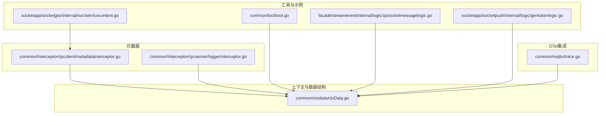
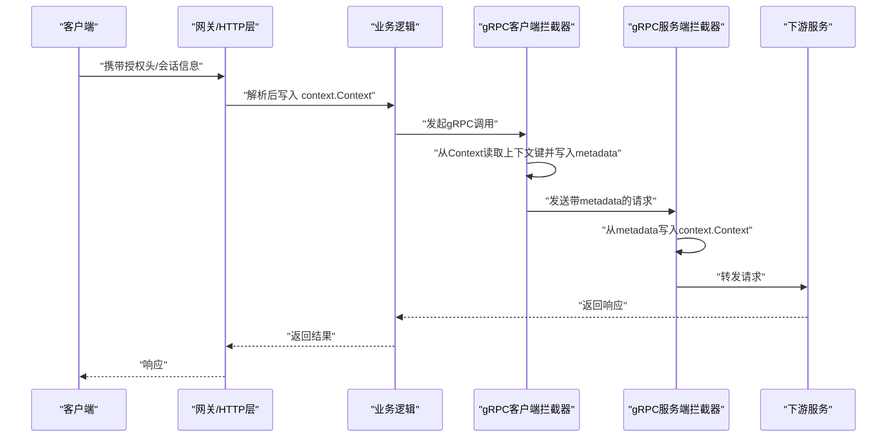
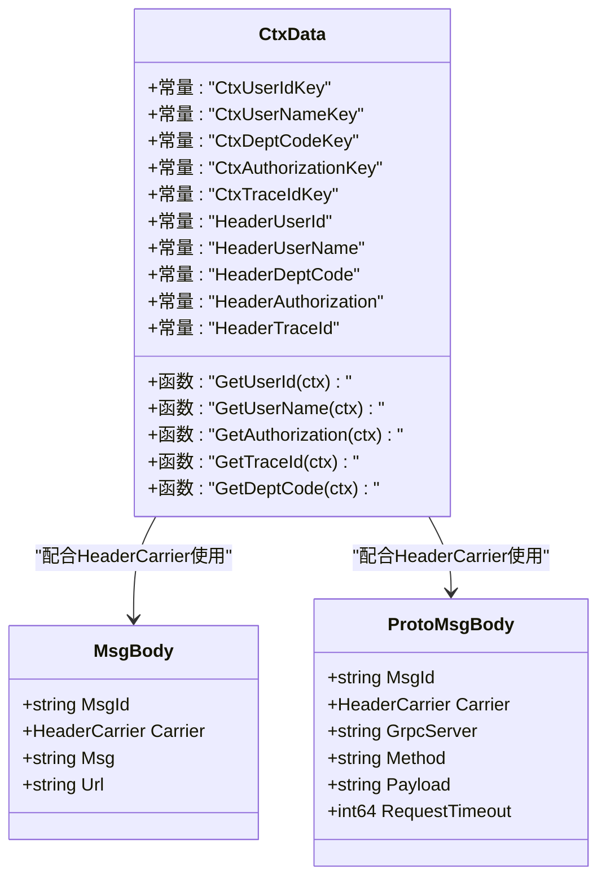
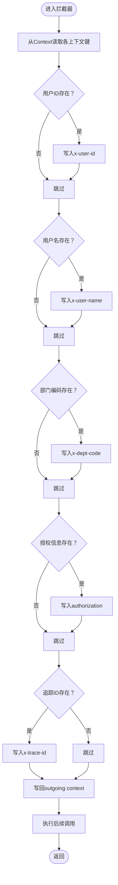
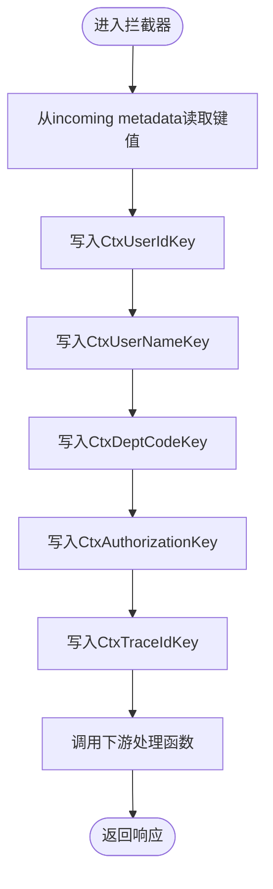
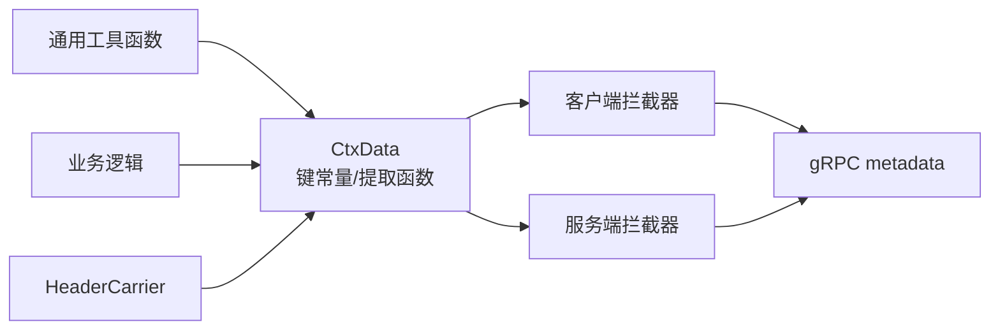

# 上下文数据管理

<cite>
**本文引用的文件**
- [common/ctxdata/ctxData.go](file://common/ctxdata/ctxData.go)
- [common/Interceptor/rpcclient/metadataInterceptor.go](file://common/Interceptor/rpcclient/metadataInterceptor.go)
- [common/Interceptor/rpcserver/loggerInterceptor.go](file://common/Interceptor/rpcserver/loggerInterceptor.go)
- [common/tool/tool.go](file://common/tool/tool.go)
- [socketapp/socketgtw/internal/svc/servicecontext.go](file://socketapp/socketgtw/internal/svc/servicecontext.go)
- [facade/streamevent/internal/logic/upsocketmessagelogic.go](file://facade/streamevent/internal/logic/upsocketmessagelogic.go)
- [socketapp/socketpush/internal/logic/gentokenlogic.go](file://socketapp/socketpush/internal/logic/gentokenlogic.go)
- [common/mqttx/trace.go](file://common/mqttx/trace.go)
</cite>

## 目录
1. [简介](#简介)
2. [项目结构](#项目结构)
3. [核心组件](#核心组件)
4. [架构总览](#架构总览)
5. [详细组件分析](#详细组件分析)
6. [依赖关系分析](#依赖关系分析)
7. [性能考量](#性能考量)
8. [故障排查指南](#故障排查指南)
9. [结论](#结论)
10. [附录](#附录)

## 简介
本文件系统性阐述 Zero-Service 中的 CtxData 上下文数据管理能力，覆盖以下主题：
- 上下文键常量与 gRPC 元数据头部键映射
- 数据结构 MsgBody 与 ProtoMsgBody 的设计意图
- 用户ID、用户名、部门编码、授权信息、追踪ID的提取函数与使用方式
- 在微服务调用链中通过 HTTP 请求头与 gRPC 元数据传递上下文数据的最佳实践
- OpenTelemetry HeaderCarrier 的使用与分布式追踪集成

## 项目结构
围绕 CtxData 的相关代码主要分布在如下模块：
- 上下文与数据结构：common/ctxdata/ctxData.go
- gRPC 客户端/服务端拦截器：common/Interceptor/rpcclient/metadataInterceptor.go、common/Interceptor/rpcserver/loggerInterceptor.go
- 工具与通用提取：common/tool/tool.go
- 业务服务上下文与拦截器装配：socketapp/socketgtw/internal/svc/servicecontext.go
- 业务逻辑中对上下文数据的使用示例：facade/streamevent/internal/logic/upsocketmessagelogic.go、socketapp/socketpush/internal/logic/gentokenlogic.go
- OpenTelemetry HeaderCarrier 的实现参考：common/mqttx/trace.go

图表来源
- [common/ctxdata/ctxData.go:1-76](file://common/ctxdata/ctxData.go#L1-L76)
- [common/Interceptor/rpcclient/metadataInterceptor.go:1-56](file://common/Interceptor/rpcclient/metadataInterceptor.go#L1-L56)
- [common/Interceptor/rpcserver/loggerInterceptor.go:1-45](file://common/Interceptor/rpcserver/loggerInterceptor.go#L1-L45)
- [common/tool/tool.go:200-399](file://common/tool/tool.go#L200-L399)
- [socketapp/socketgtw/internal/svc/servicecontext.go:1-134](file://socketapp/socketgtw/internal/svc/servicecontext.go#L1-L134)
- [facade/streamevent/internal/logic/upsocketmessagelogic.go:1-56](file://facade/streamevent/internal/logic/upsocketmessagelogic.go#L1-L56)
- [socketapp/socketpush/internal/logic/gentokenlogic.go:57-78](file://socketapp/socketpush/internal/logic/gentokenlogic.go#L57-L78)
- [common/mqttx/trace.go:1-30](file://common/mqttx/trace.go#L1-L30)

章节来源
- [common/ctxdata/ctxData.go:1-76](file://common/ctxdata/ctxData.go#L1-L76)
- [common/Interceptor/rpcclient/metadataInterceptor.go:1-56](file://common/Interceptor/rpcclient/metadataInterceptor.go#L1-L56)
- [common/Interceptor/rpcserver/loggerInterceptor.go:1-45](file://common/Interceptor/rpcserver/loggerInterceptor.go#L1-L45)
- [common/tool/tool.go:200-399](file://common/tool/tool.go#L200-L399)
- [socketapp/socketgtw/internal/svc/servicecontext.go:1-134](file://socketapp/socketgtw/internal/svc/servicecontext.go#L1-L134)
- [facade/streamevent/internal/logic/upsocketmessagelogic.go:1-56](file://facade/streamevent/internal/logic/upsocketmessagelogic.go#L1-L56)
- [socketapp/socketpush/internal/logic/gentokenlogic.go:57-78](file://socketapp/socketpush/internal/logic/gentokenlogic.go#L57-L78)
- [common/mqttx/trace.go:1-30](file://common/mqttx/trace.go#L1-L30)

## 核心组件
- 上下文键常量与 gRPC 头部键
  - 用户相关：用户ID、用户名、部门编码、授权信息、追踪ID
  - gRPC 元数据头部键（均需小写）：x-user-id、x-user-name、x-dept-code、authorization、x-trace-id
- 数据结构
  - MsgBody：包含消息ID、OpenTelemetry HeaderCarrier、消息体、目标URL
  - ProtoMsgBody：包含消息ID、OpenTelemetry HeaderCarrier、gRPC服务名、方法名、负载、请求超时
- 提取函数
  - GetUserId、GetUserName、GetAuthorization、GetTraceId、GetDeptCode：从 context.Context 中读取对应字符串值；不存在则返回空串

章节来源
- [common/ctxdata/ctxData.go:9-40](file://common/ctxdata/ctxData.go#L9-L40)
- [common/ctxdata/ctxData.go:42-75](file://common/ctxdata/ctxData.go#L42-L75)

## 架构总览
CtxData 在微服务中的流转路径：
- HTTP/WS 层：在进入业务逻辑前，将 JWT 或会话信息解析并写入 context.Context
- gRPC 客户端拦截器：从 context.Context 读取上下文数据，注入到 outgoing metadata
- gRPC 服务端拦截器：从 incoming metadata 读取并回写到 context.Context
- 业务逻辑层：通过提取函数读取上下文数据，用于鉴权、审计、追踪与跨服务透传

图表来源
- [common/Interceptor/rpcclient/metadataInterceptor.go:11-32](file://common/Interceptor/rpcclient/metadataInterceptor.go#L11-L32)
- [common/Interceptor/rpcserver/loggerInterceptor.go:12-28](file://common/Interceptor/rpcserver/loggerInterceptor.go#L12-L28)
- [socketapp/socketgtw/internal/svc/servicecontext.go:24-33](file://socketapp/socketgtw/internal/svc/servicecontext.go#L24-L33)

## 详细组件分析

### 上下文键与数据结构
- 键常量与头部键
  - 上下文键：user-id、user-name、dept-code、authorization、trace-id
  - gRPC 头部键：x-user-id、x-user-name、x-dept-code、authorization、x-trace-id
- 数据结构
  - MsgBody：用于承载消息ID、OpenTelemetry HeaderCarrier、消息内容与目标URL
  - ProtoMsgBody：用于承载消息ID、OpenTelemetry HeaderCarrier、gRPC服务名、方法名、负载与超时

图表来源
- [common/ctxdata/ctxData.go:9-40](file://common/ctxdata/ctxData.go#L9-L40)
- [common/ctxdata/ctxData.go:26-40](file://common/ctxdata/ctxData.go#L26-L40)

章节来源
- [common/ctxdata/ctxData.go:9-40](file://common/ctxdata/ctxData.go#L9-L40)
- [common/ctxdata/ctxData.go:26-40](file://common/ctxdata/ctxData.go#L26-L40)

### gRPC 客户端拦截器：MetadataInterceptor
- 功能
  - 从 context.Context 读取用户ID、用户名、部门编码、授权信息、追踪ID
  - 将其写入 outgoing metadata，并继续调用
- 关键点
  - 仅在非空时写入，避免冗余
  - 使用 gRPC 元数据头部键（小写）

图表来源
- [common/Interceptor/rpcclient/metadataInterceptor.go:11-32](file://common/Interceptor/rpcclient/metadataInterceptor.go#L11-L32)

章节来源
- [common/Interceptor/rpcclient/metadataInterceptor.go:11-32](file://common/Interceptor/rpcclient/metadataInterceptor.go#L11-L32)

### gRPC 服务端拦截器：LoggerInterceptor
- 功能
  - 从 incoming metadata 读取各头部键
  - 将其写回 context.Context，供业务逻辑使用
- 关键点
  - 仅在存在时写入
  - 便于日志与后续处理

图表来源
- [common/Interceptor/rpcserver/loggerInterceptor.go:12-28](file://common/Interceptor/rpcserver/loggerInterceptor.go#L12-L28)

章节来源
- [common/Interceptor/rpcserver/loggerInterceptor.go:12-28](file://common/Interceptor/rpcserver/loggerInterceptor.go#L12-L28)

### 业务上下文装配与拦截器注册
- 在服务上下文中注册 gRPC 客户端拦截器，确保所有出站 gRPC 调用都会自动携带上下文数据
- 同时可配置 gRPC 默认调用选项（如最大消息大小）

章节来源
- [socketapp/socketgtw/internal/svc/servicecontext.go:24-33](file://socketapp/socketgtw/internal/svc/servicecontext.go#L24-L33)

### 业务逻辑中的上下文数据使用
- Socket 事件逻辑中直接读取授权信息用于调试与后续处理
- 通用工具函数中提供从 context 或用户对象中提取用户ID/用户名/部门编码的能力

章节来源
- [facade/streamevent/internal/logic/upsocketmessagelogic.go:28-31](file://facade/streamevent/internal/logic/upsocketmessagelogic.go#L28-L31)
- [common/tool/tool.go:206-291](file://common/tool/tool.go#L206-L291)

### JWT 令牌与上下文键的结合
- 生成 JWT 时将用户ID写入声明，便于后续从令牌解析并写入 context.Context
- 令牌校验成功后，可在 HTTP/WS 层将用户ID、用户名、部门编码等写入 context.Context，供后续 gRPC 调用透传

章节来源
- [socketapp/socketpush/internal/logic/gentokenlogic.go:57-78](file://socketapp/socketpush/internal/logic/gentokenlogic.go#L57-L78)

### OpenTelemetry HeaderCarrier 的使用
- HeaderCarrier 是 OpenTelemetry 文本传播的标准载体
- CtxData 的 MsgBody/ProtoMsgBody 中包含 HeaderCarrier 字段，便于在消息体中携带与传播上下文
- 参考实现：MQTT 消息载体 MessageCarrier 实现了 TextMapCarrier 接口，展示如何将键值对写入消息头

章节来源
- [common/ctxdata/ctxData.go:26-40](file://common/ctxdata/ctxData.go#L26-L40)
- [common/mqttx/trace.go:1-30](file://common/mqttx/trace.go#L1-L30)

## 依赖关系分析
- 组件耦合
  - gRPC 客户端/服务端拦截器依赖 CtxData 的键常量与提取函数
  - 业务逻辑通过提取函数读取上下文数据，降低对具体传输协议的耦合
- 外部依赖
  - OpenTelemetry propagation 包用于 HeaderCarrier
  - go-zero 的 metadata 与 context.Context 用于拦截器与业务逻辑

图表来源
- [common/ctxdata/ctxData.go:9-40](file://common/ctxdata/ctxData.go#L9-L40)
- [common/Interceptor/rpcclient/metadataInterceptor.go:11-32](file://common/Interceptor/rpcclient/metadataInterceptor.go#L11-L32)
- [common/Interceptor/rpcserver/loggerInterceptor.go:12-28](file://common/Interceptor/rpcserver/loggerInterceptor.go#L12-L28)
- [common/tool/tool.go:206-291](file://common/tool/tool.go#L206-L291)

章节来源
- [common/ctxdata/ctxData.go:9-40](file://common/ctxdata/ctxData.go#L9-L40)
- [common/Interceptor/rpcclient/metadataInterceptor.go:11-32](file://common/Interceptor/rpcclient/metadataInterceptor.go#L11-L32)
- [common/Interceptor/rpcserver/loggerInterceptor.go:12-28](file://common/Interceptor/rpcserver/loggerInterceptor.go#L12-L28)
- [common/tool/tool.go:206-291](file://common/tool/tool.go#L206-L291)

## 性能考量
- 拦截器中的键读取与 metadata 写入均为 O(1)，开销极低
- 仅在键存在时写入 metadata，避免冗余
- HeaderCarrier 的使用不会引入额外的序列化成本，适合在消息体中透传

## 故障排查指南
- 症状：下游服务无法获取用户ID/授权信息
  - 检查上游是否正确将上下文键写入 context.Context
  - 确认客户端拦截器已注册并生效
  - 检查服务端拦截器是否从 metadata 正确回写到 context.Context
- 症状：追踪ID未在链路中传播
  - 确认客户端拦截器写入了 x-trace-id
  - 确认服务端拦截器从 metadata 读取并写回 context.Context
- 症状：HeaderCarrier 未被正确携带
  - 检查 MsgBody/ProtoMsgBody 中 Carrier 是否被正确填充
  - 确认下游服务是否正确从消息体中读取并注入 HeaderCarrier

章节来源
- [common/Interceptor/rpcclient/metadataInterceptor.go:11-32](file://common/Interceptor/rpcclient/metadataInterceptor.go#L11-L32)
- [common/Interceptor/rpcserver/loggerInterceptor.go:12-28](file://common/Interceptor/rpcserver/loggerInterceptor.go#L12-L28)
- [common/ctxdata/ctxData.go:26-40](file://common/ctxdata/ctxData.go#L26-L40)

## 结论
CtxData 通过统一的上下文键与 gRPC 元数据头部映射，实现了用户ID、用户名、部门编码、授权信息与追踪ID在微服务调用链中的透明传递。结合拦截器与 HeaderCarrier，既保证了易用性，又兼顾了性能与可观测性。建议在所有涉及跨服务调用的场景中统一使用该模式，并在 HTTP/WS 层完成上下文键的初始化与写入。

## 附录

### 常量与键映射速查
- 上下文键
  - user-id、user-name、dept-code、authorization、trace-id
- gRPC 头部键
  - x-user-id、x-user-name、x-dept-code、authorization、x-trace-id
- 数据结构字段
  - MsgBody：MsgId、Carrier、Msg、Url
  - ProtoMsgBody：MsgId、Carrier、GrpcServer、Method、Payload、RequestTimeout

章节来源
- [common/ctxdata/ctxData.go:9-40](file://common/ctxdata/ctxData.go#L9-L40)