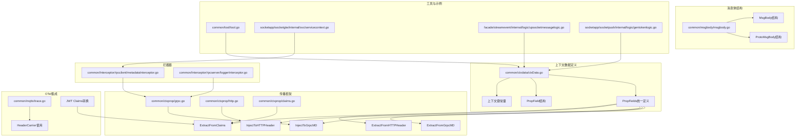
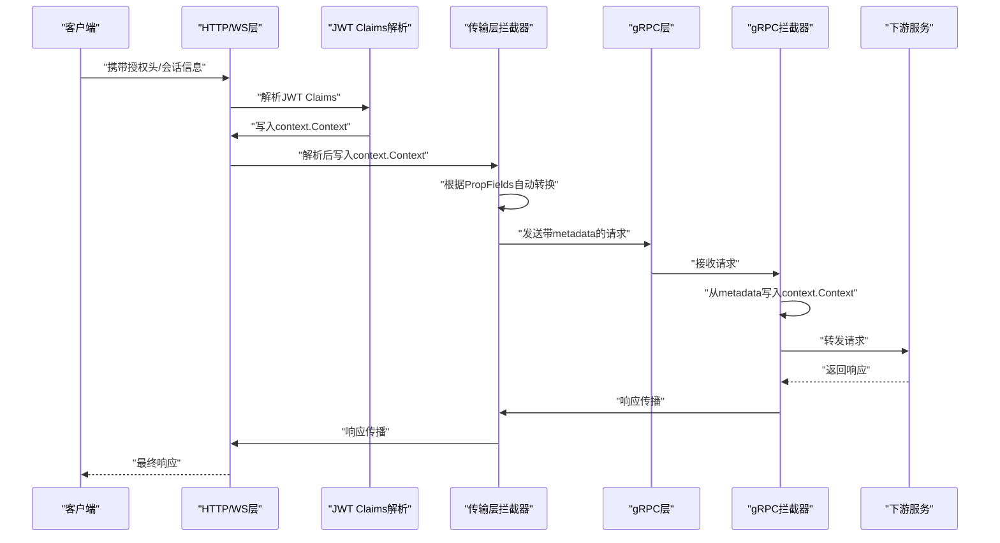
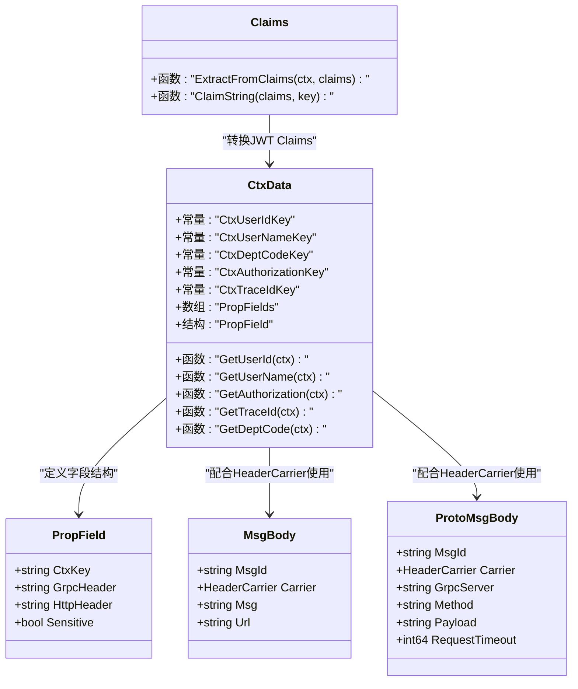
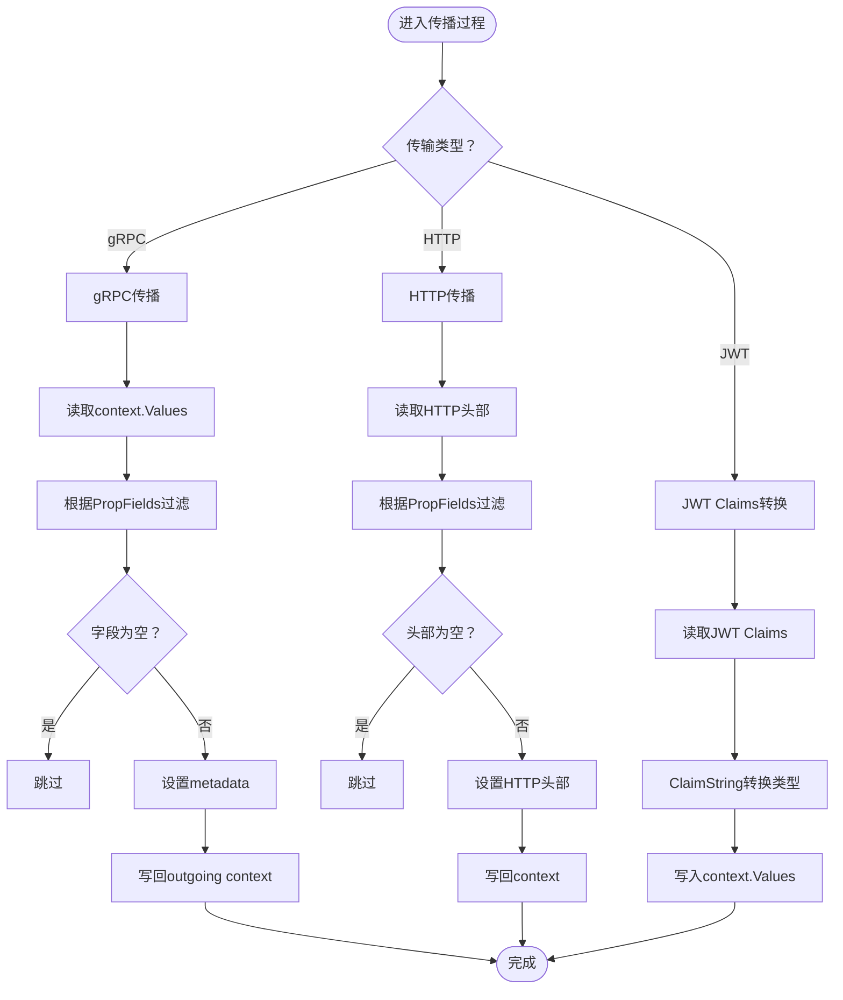
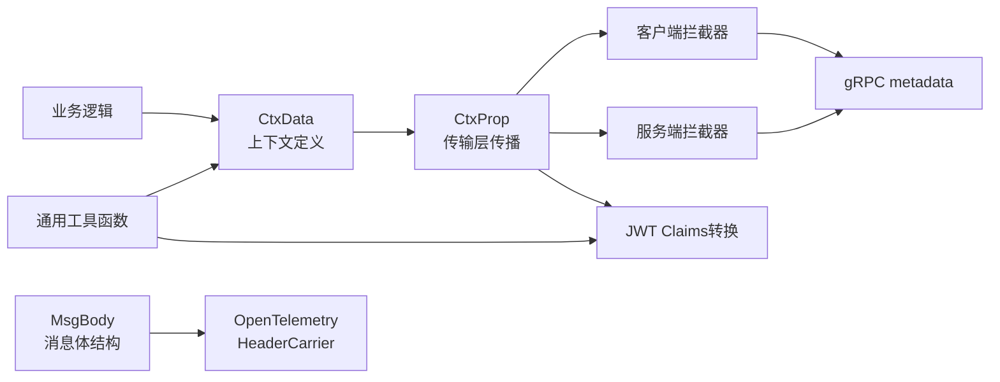

# 上下文数据管理

<cite>
**本文引用的文件**
- [common/ctxdata/ctxData.go](file://common/ctxdata/ctxData.go)
- [common/msgbody/msgbody.go](file://common/msgbody/msgbody.go)
- [common/ctxprop/grpc.go](file://common/ctxprop/grpc.go)
- [common/ctxprop/http.go](file://common/ctxprop/http.go)
- [common/ctxprop/claims.go](file://common/ctxprop/claims.go)
- [common/Interceptor/rpcclient/metadataInterceptor.go](file://common/Interceptor/rpcclient/metadataInterceptor.go)
- [common/Interceptor/rpcserver/loggerInterceptor.go](file://common/Interceptor/rpcserver/loggerInterceptor.go)
- [common/tool/tool.go](file://common/tool/tool.go)
- [socketapp/socketgtw/internal/svc/servicecontext.go](file://socketapp/socketgtw/internal/svc/servicecontext.go)
- [facade/streamevent/internal/logic/upsocketmessagelogic.go](file://facade/streamevent/internal/logic/upsocketmessagelogic.go)
- [socketapp/socketpush/internal/logic/gentokenlogic.go](file://socketapp/socketpush/internal/logic/gentokenlogic.go)
- [common/mqttx/trace.go](file://common/mqttx/trace.go)
</cite>

## 更新摘要
**所做更改**
- 更新了CtxData包的架构说明，反映ctxdata包重构为支持多传输层的PropFields机制
- 新增了ctxprop包作为统一的上下文传播框架，替代直接的gRPC元数据操作
- 更新了拦截器实现，从直接操作gRPC元数据改为使用ctxprop包的传播机制
- 新增了JWT Claims到上下文的转换机制
- 修正了上下文键常量的定义方式，采用统一的PropField结构
- 更新了OpenTelemetry HeaderCarrier的使用说明

## 目录
1. [简介](#简介)
2. [项目结构](#项目结构)
3. [核心组件](#核心组件)
4. [架构总览](#架构总览)
5. [详细组件分析](#详细组件分析)
6. [依赖关系分析](#依赖关系分析)
7. [性能考量](#性能考量)
8. [故障排查指南](#故障排查指南)
9. [结论](#结论)
10. [附录](#附录)

## 简介
本文件系统性阐述 Zero-Service 中的上下文数据管理能力，覆盖以下主题：
- 多传输层上下文传播机制（HTTP、gRPC、WebSocket）
- 上下文键常量与PropFields统一定义
- 消息体结构MsgBody和ProtoMsgBody的设计与OpenTelemetry支持
- 用户ID、用户名、部门编码、授权信息、追踪ID的提取函数与使用方式
- 在微服务调用链中通过HTTP请求头、gRPC元数据和消息体传递上下文数据的最佳实践
- OpenTelemetry HeaderCarrier的使用与分布式追踪集成
- JWT Claims到上下文的自动转换机制

## 项目结构
围绕上下文数据管理的相关代码主要分布在如下模块：
- 上下文数据定义：common/ctxdata/ctxData.go
- 传输层传播框架：common/ctxprop/（包含grpc.go、http.go、claims.go）
- 消息体结构：common/msgbody/msgbody.go
- gRPC 客户端/服务端拦截器：common/Interceptor/rpcclient/metadataInterceptor.go、common/Interceptor/rpcserver/loggerInterceptor.go
- 工具与通用提取：common/tool/tool.go
- 业务服务上下文与拦截器装配：socketapp/socketgtw/internal/svc/servicecontext.go
- 业务逻辑中对上下文数据的使用示例：facade/streamevent/internal/logic/upsocketmessagelogic.go、socketapp/socketpush/internal/logic/gentokenlogic.go
- OpenTelemetry HeaderCarrier 的实现参考：common/mqttx/trace.go

**图表来源**
- [common/ctxdata/ctxData.go:1-74](file://common/ctxdata/ctxData.go#L1-L74)
- [common/ctxprop/grpc.go:1-35](file://common/ctxprop/grpc.go#L1-L35)
- [common/ctxprop/http.go:1-33](file://common/ctxprop/http.go#L1-L33)
- [common/ctxprop/claims.go:1-44](file://common/ctxprop/claims.go#L1-L44)
- [common/msgbody/msgbody.go:1-20](file://common/msgbody/msgbody.go#L1-L20)

## 核心组件
- **多传输层上下文传播机制**
  - PropFields统一定义所有需要传播的上下文字段
  - PropField结构包含：CtxKey（context键）、GrpcHeader（gRPC头部）、HttpHeader（HTTP头部）、Sensitive（敏感性标记）
  - 支持HTTP、gRPC、WebSocket等多种传输层的自动转换
- **传播框架**
  - ctxprop包提供统一的上下文传播API
  - InjectToGrpcMD/ExtractFromGrpcMD：gRPC元数据传播
  - InjectToHTTPHeader/ExtractFromHTTPHeader：HTTP头部传播
  - ExtractFromClaims：JWT Claims到上下文的转换
- **消息体结构**
  - MsgBody：包含消息ID、OpenTelemetry HeaderCarrier、消息体、目标URL
  - ProtoMsgBody：包含消息ID、OpenTelemetry HeaderCarrier、gRPC服务名、方法名、负载、请求超时
- **提取函数**
  - GetUserId、GetUserName、GetAuthorization、GetTraceId、GetDeptCode：从 context.Context 中读取对应字符串值；不存在则返回空串
- **拦截器机制**
  - gRPC客户端拦截器：使用ctxprop.InjectToGrpcMD自动注入上下文数据
  - gRPC服务端拦截器：使用ctxprop.ExtractFromGrpcMD自动提取上下文数据

**章节来源**
- [common/ctxdata/ctxData.go:22-38](file://common/ctxdata/ctxData.go#L22-L38)
- [common/msgbody/msgbody.go:5-19](file://common/msgbody/msgbody.go#L5-L19)
- [common/ctxprop/grpc.go:11-34](file://common/ctxprop/grpc.go#L11-L34)
- [common/ctxprop/http.go:10-32](file://common/ctxprop/http.go#L10-L32)
- [common/ctxprop/claims.go:10-23](file://common/ctxprop/claims.go#L10-L23)

## 架构总览
上下文数据在多传输层中的流转路径：
- HTTP/WS 层：在进入业务逻辑前，将JWT或会话信息解析并写入context.Context
- 传输层拦截器：根据PropFields配置，自动在不同传输层间转换上下文数据
- gRPC 客户端拦截器：从context.Context读取上下文数据，注入到outgoing metadata
- gRPC 服务端拦截器：从incoming metadata读取并回写到context.Context
- 业务逻辑层：通过提取函数读取上下文数据，用于鉴权、审计、追踪与跨服务透传

**图表来源**
- [common/ctxprop/grpc.go:13-34](file://common/ctxprop/grpc.go#L13-L34)
- [common/ctxprop/http.go:12-32](file://common/ctxprop/http.go#L12-L32)
- [common/ctxprop/claims.go:13-23](file://common/ctxprop/claims.go#L13-L23)
- [common/Interceptor/rpcclient/metadataInterceptor.go:11-14](file://common/Interceptor/rpcclient/metadataInterceptor.go#L11-L14)
- [common/Interceptor/rpcserver/loggerInterceptor.go:14-20](file://common/Interceptor/rpcserver/loggerInterceptor.go#L14-L20)

## 详细组件分析

### 上下文数据定义与传播机制
- **PropFields统一定义**
  - 所有需要传播的上下文字段集中定义在PropFields切片中
  - 每个字段包含CtxKey、GrpcHeader、HttpHeader和Sensitive四个属性
  - 新增字段只需在此处添加，所有传输层自动生效
- **PropField结构详解**
  - CtxKey：用于context.WithValue的键名
  - GrpcHeader：gRPC元数据的头部键（必须小写）
  - HttpHeader：HTTP头部的标准格式
  - Sensitive：是否在日志中脱敏显示

**图表来源**
- [common/ctxdata/ctxData.go:5-38](file://common/ctxdata/ctxData.go#L5-L38)
- [common/msgbody/msgbody.go:5-19](file://common/msgbody/msgbody.go#L5-L19)
- [common/ctxprop/claims.go:13-43](file://common/ctxprop/claims.go#L13-L43)

**章节来源**
- [common/ctxdata/ctxData.go:5-38](file://common/ctxdata/ctxData.go#L5-L38)
- [common/msgbody/msgbody.go:5-19](file://common/msgbody/msgbody.go#L5-L19)
- [common/ctxprop/claims.go:10-43](file://common/ctxprop/claims.go#L10-L43)

### 传输层传播机制
- **gRPC传播机制**
  - InjectToGrpcMD：从context.Values提取所有字段，注入到outgoing metadata
  - ExtractFromGrpcMD：从incoming metadata提取所有字段，注入到context.Values
  - 自动处理字段过滤和类型转换
- **HTTP传播机制**
  - InjectToHTTPHeader：将上下文字段注入到HTTP头部
  - ExtractFromHTTPHeader：从HTTP头部提取字段到context
  - 支持标准HTTP头部格式
- **JWT Claims转换**
  - ExtractFromClaims：从JWT Claims映射到上下文键值
  - ClaimString：自动处理不同类型到字符串的转换

**图表来源**
- [common/ctxprop/grpc.go:13-34](file://common/ctxprop/grpc.go#L13-L34)
- [common/ctxprop/http.go:12-32](file://common/ctxprop/http.go#L12-L32)
- [common/ctxprop/claims.go:13-43](file://common/ctxprop/claims.go#L13-L43)

**章节来源**
- [common/ctxprop/grpc.go:11-34](file://common/ctxprop/grpc.go#L11-L34)
- [common/ctxprop/http.go:10-32](file://common/ctxprop/http.go#L10-L32)
- [common/ctxprop/claims.go:10-43](file://common/ctxprop/claims.go#L10-L43)

### 消息体结构设计
- **MsgBody结构**
  - MsgId：消息唯一标识符
  - Carrier：OpenTelemetry HeaderCarrier，用于分布式追踪传播
  - Msg：实际消息内容
  - Url：目标URL地址
- **ProtoMsgBody结构**
  - MsgId：消息唯一标识符
  - Carrier：OpenTelemetry HeaderCarrier
  - GrpcServer：目标gRPC服务名称
  - Method：目标方法名称
  - Payload：序列化后的消息负载
  - RequestTimeout：请求超时时间（毫秒）

**章节来源**
- [common/msgbody/msgbody.go:5-19](file://common/msgbody/msgbody.go#L5-L19)

### 业务逻辑中的上下文数据使用
- **Socket事件逻辑**：直接读取授权信息用于调试与后续处理
- **通用工具函数**：提供从context或用户对象中提取用户ID/用户名/部门编码的能力
- **JWT令牌集成**：生成JWT时将用户ID写入声明，便于后续从令牌解析并写入context.Context

**章节来源**
- [facade/streamevent/internal/logic/upsocketmessagelogic.go:28-31](file://facade/streamevent/internal/logic/upsocketmessagelogic.go#L28-L31)
- [common/tool/tool.go:206-291](file://common/tool/tool.go#L206-L291)
- [socketapp/socketpush/internal/logic/gentokenlogic.go:57-78](file://socketapp/socketpush/internal/logic/gentokenlogic.go#L57-L78)

### OpenTelemetry HeaderCarrier 的使用
- **HeaderCarrier集成**
  - 消息体结构中包含HeaderCarrier字段
  - 支持在消息体中携带与传播OpenTelemetry上下文
  - 便于跨服务调用时保持追踪链路的完整性
- **传播机制**
  - 通过PropFields机制自动处理HeaderCarrier的序列化和反序列化
  - 支持多种传输层的HeaderCarrier传播

**章节来源**
- [common/msgbody/msgbody.go:7,14](file://common/msgbody/msgbody.go#L7,L14)
- [common/mqttx/trace.go:1-30](file://common/mqttx/trace.go#L1-L30)

## 依赖关系分析
- **组件耦合**
  - 传输层拦截器依赖ctxprop包的传播函数
  - 业务逻辑通过ctxdata包的提取函数读取上下文数据
  - 消息体结构依赖OpenTelemetry的HeaderCarrier
  - JWT Claims转换依赖ctxprop包
- **外部依赖**
  - OpenTelemetry propagation包用于HeaderCarrier
  - go-zero的metadata与context.Context用于拦截器与业务逻辑
  - Google gRPC用于gRPC通信
  - golang-jwt用于JWT令牌处理

**图表来源**
- [common/ctxdata/ctxData.go:1-74](file://common/ctxdata/ctxData.go#L1-L74)
- [common/ctxprop/grpc.go:1-35](file://common/ctxprop/grpc.go#L1-L35)
- [common/msgbody/msgbody.go:1-20](file://common/msgbody/msgbody.go#L1-L20)

**章节来源**
- [common/ctxdata/ctxData.go:1-74](file://common/ctxdata/ctxData.go#L1-L74)
- [common/ctxprop/grpc.go:1-35](file://common/ctxprop/grpc.go#L1-L35)
- [common/msgbody/msgbody.go:1-20](file://common/msgbody/msgbody.go#L1-L20)

## 性能考量
- **传播机制优化**
  - PropFields集中定义减少了重复代码
  - 自动过滤空字段，避免冗余传输
  - HeaderCarrier的使用不会引入额外的序列化成本
- **拦截器性能**
  - 仅在字段存在时进行传播，避免不必要的处理
  - 批量处理多个字段，提高效率
- **内存使用**
  - HeaderCarrier按需创建和销毁
  - 消息体结构支持可选字段，减少内存占用
- **JWT Claims转换优化**
  - 类型自动转换避免了重复的类型判断
  - Claims到context的批量写入提高效率

## 故障排查指南
- **症状：下游服务无法获取用户ID/授权信息**
  - 检查上游是否正确将上下文键写入context.Context
  - 确认PropFields中是否包含相应的字段定义
  - 验证传输层拦截器是否正确配置
  - 检查JWT Claims转换是否正常工作
- **症状：追踪ID未在链路中传播**
  - 确认PropFields中trace-id字段的配置正确
  - 检查HeaderCarrier是否正确填充和传播
  - 验证下游服务是否正确提取HeaderCarrier
- **症状：消息体传播异常**
  - 检查MsgBody/ProtoMsgBody结构中的Carrier字段
  - 确认OpenTelemetry传播配置正确
  - 验证消息序列化和反序列化过程
- **症状：JWT认证失败**
  - 检查JWT Claims中是否存在对应的键值
  - 确认ExtractFromClaims函数是否正确执行
  - 验证Claims到上下文的转换逻辑

**章节来源**
- [common/ctxprop/grpc.go:13-34](file://common/ctxprop/grpc.go#L13-L34)
- [common/ctxprop/http.go:12-32](file://common/ctxprop/http.go#L12-L32)
- [common/ctxprop/claims.go:13-43](file://common/ctxprop/claims.go#L13-L43)
- [common/msgbody/msgbody.go:5-19](file://common/msgbody/msgbody.go#L5-L19)

## 结论
Zero-Service通过重构的上下文数据管理机制，实现了多传输层的统一上下文传播。新的PropFields机制简化了字段定义和传播逻辑，ctxprop包提供了统一的传播框架，消息体结构支持OpenTelemetry集成，拦截器机制提供了自动化的上下文传播。JWT Claims转换机制进一步增强了系统的易用性。这种设计既保证了系统的可扩展性，又确保了跨服务调用时上下文数据的一致性和完整性。建议在所有涉及跨服务调用的场景中统一使用该模式，并充分利用PropFields机制来管理上下文字段。

## 附录

### 常量与键映射速查
- **上下文键**
  - user-id、user-name、dept-code、authorization、trace-id
- **gRPC头部键**
  - x-user-id、x-user-name、x-dept-code、authorization、x-trace-id
- **HTTP头部键**
  - X-User-Id、X-User-Name、X-Dept-Code、Authorization、X-Trace-Id
- **数据结构字段**
  - MsgBody：MsgId、Carrier、Msg、Url
  - ProtoMsgBody：MsgId、Carrier、GrpcServer、Method、Payload、RequestTimeout
- **传播函数**
  - InjectToGrpcMD、ExtractFromGrpcMD、InjectToHTTPHeader、ExtractFromHTTPHeader、ExtractFromClaims

**章节来源**
- [common/ctxdata/ctxData.go:5-38](file://common/ctxdata/ctxData.go#L5-L38)
- [common/msgbody/msgbody.go:5-19](file://common/msgbody/msgbody.go#L5-L19)
- [common/ctxprop/grpc.go:11-34](file://common/ctxprop/grpc.go#L11-L34)
- [common/ctxprop/http.go:10-32](file://common/ctxprop/http.go#L10-L32)
- [common/ctxprop/claims.go:10-43](file://common/ctxprop/claims.go#L10-L43)