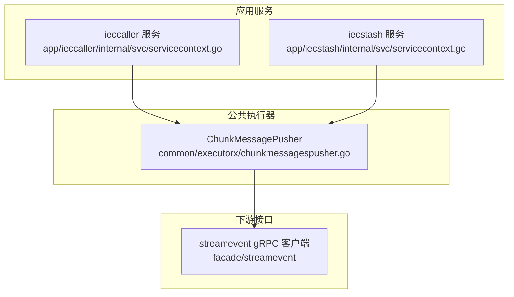
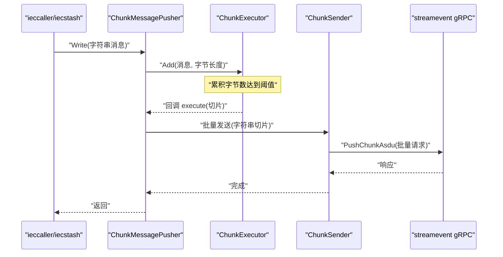
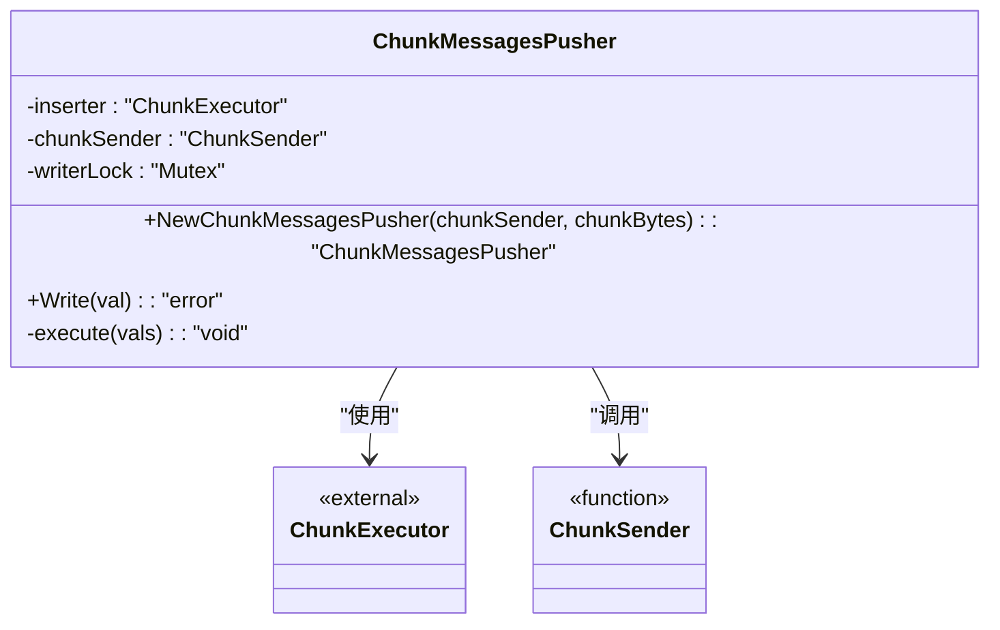
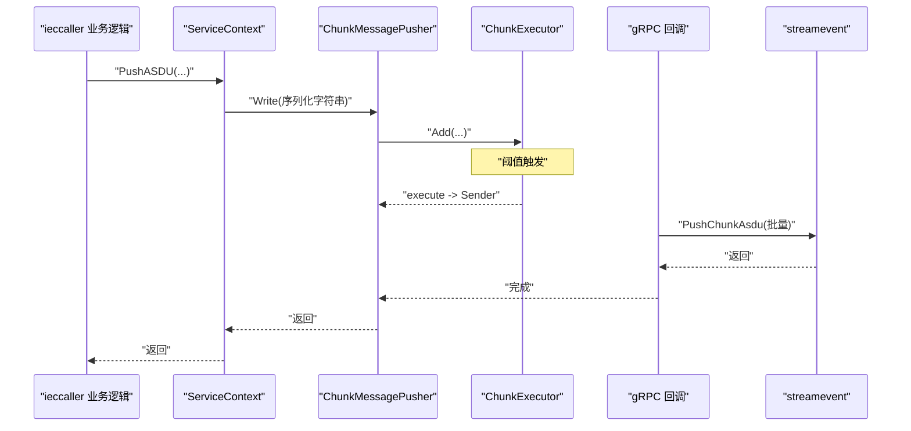
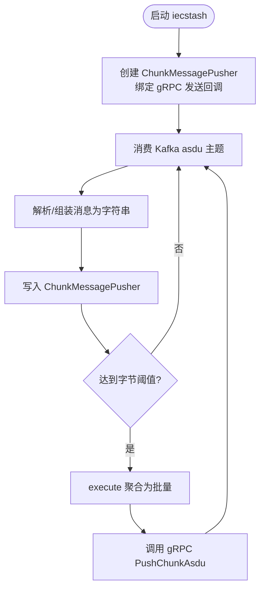
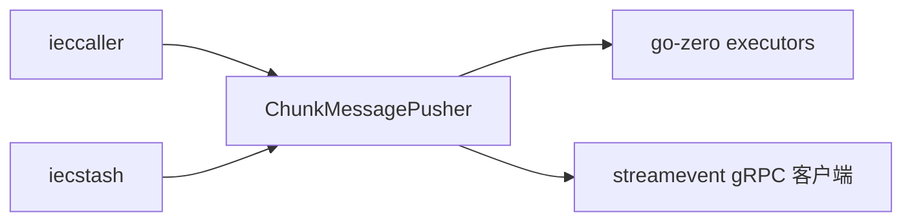

# 分片消息推送器

<cite>
**本文引用的文件**
- [common/executorx/chunkmessagespusher.go](file://common/executorx/chunkmessagespusher.go)
- [app/ieccaller/internal/svc/servicecontext.go](file://app/ieccaller/internal/svc/servicecontext.go)
- [app/iecstash/internal/svc/servicecontext.go](file://app/iecstash/internal/svc/servicecontext.go)
- [docs/iec104.md](file://docs/iec104.md)
</cite>

## 目录
1. [简介](#简介)
2. [项目结构](#项目结构)
3. [核心组件](#核心组件)
4. [架构概览](#架构概览)
5. [详细组件分析](#详细组件分析)
6. [依赖分析](#依赖分析)
7. [性能考量](#性能考量)
8. [故障排查指南](#故障排查指南)
9. [结论](#结论)
10. [附录](#附录)

## 简介
本技术文档围绕 Zero-Service 中的 ChunkMessagePusher 分片消息推送器展开，系统性阐述其在 IEC 104 数采链路中的作用、数据结构设计、批量推送策略、并发控制与错误恢复机制，并结合实际微服务场景给出集成与优化建议。该推送器以字节大小为聚合阈值，将高频小消息聚合成批量再推送，显著降低下游调用次数与网络开销，提升整体吞吐与稳定性。

## 项目结构
与分片消息推送器直接相关的代码与配置分布如下：
- 核心实现：common/executorx/chunkmessagespusher.go
- 使用方一（ieccaller）：app/ieccaller/internal/svc/servicecontext.go
- 使用方二（iecstash）：app/iecstash/internal/svc/servicecontext.go
- 文档说明：docs/iec104.md

图表来源
- [common/executorx/chunkmessagespusher.go:17-24](file://common/executorx/chunkmessagespusher.go#L17-L24)
- [app/ieccaller/internal/svc/servicecontext.go:76-131](file://app/ieccaller/internal/svc/servicecontext.go#L76-L131)
- [app/iecstash/internal/svc/servicecontext.go:36-84](file://app/iecstash/internal/svc/servicecontext.go#L36-L84)

章节来源
- [common/executorx/chunkmessagespusher.go:1-45](file://common/executorx/chunkmessagespusher.go#L1-L45)
- [app/ieccaller/internal/svc/servicecontext.go:1-311](file://app/ieccaller/internal/svc/servicecontext.go#L1-L311)
- [app/iecstash/internal/svc/servicecontext.go:1-92](file://app/iecstash/internal/svc/servicecontext.go#L1-L92)
- [docs/iec104.md:130-155](file://docs/iec104.md#L130-L155)

## 核心组件
- ChunkMessagesPusher：负责将字符串消息按字节阈值进行分片聚合，并在达到阈值或触发条件时批量调用外部发送函数。
- ChunkSender：外部回调函数签名，接收字符串切片并执行最终推送（如 gRPC 调用）。
- ChunkExecutor：来自 go-zero 的分片执行器，提供 Add/阈值触发/回调等能力；本实现通过 WithChunkBytes 设置字节级聚合阈值。

关键行为与约束
- 写入路径：Write 加锁后委托给 ChunkExecutor.Add，参数为消息内容及其字节长度。
- 执行路径：当满足阈值或触发条件时，ChunkExecutor 回调 execute，将 interface{} 转换为字符串切片，再交由 ChunkSender 批量发送。
- 错误处理：Write 返回底层 Add 的错误；execute 内部对空切片直接返回，避免无效调用。

章节来源
- [common/executorx/chunkmessagespusher.go:9-15](file://common/executorx/chunkmessagespusher.go#L9-L15)
- [common/executorx/chunkmessagespusher.go:17-24](file://common/executorx/chunkmessagespusher.go#L17-L24)
- [common/executorx/chunkmessagespusher.go:26-30](file://common/executorx/chunkmessagespusher.go#L26-L30)
- [common/executorx/chunkmessagespusher.go:32-44](file://common/executorx/chunkmessagespusher.go#L32-L44)

## 架构概览
下图展示分片消息推送在 IEC 104 数采链路中的位置与调用关系：

图表来源
- [common/executorx/chunkmessagespusher.go:26-30](file://common/executorx/chunkmessagespusher.go#L26-L30)
- [common/executorx/chunkmessagespusher.go:32-44](file://common/executorx/chunkmessagespusher.go#L32-L44)
- [app/ieccaller/internal/svc/servicecontext.go:76-131](file://app/ieccaller/internal/svc/servicecontext.go#L76-L131)
- [app/iecstash/internal/svc/servicecontext.go:36-84](file://app/iecstash/internal/svc/servicecontext.go#L36-L84)

## 详细组件分析

### 组件一：ChunkMessagePusher 类与方法
- 结构体字段
  - inserter：底层分片执行器实例
  - chunkSender：批量发送回调
  - writerLock：写入路径互斥锁
- 关键方法
  - NewChunkMessagesPusher：初始化并绑定发送回调与字节阈值
  - Write：加锁写入，委托 Add 并传入字节长度
  - execute：将 interface{} 切片还原为字符串切片，调用 ChunkSender

图表来源
- [common/executorx/chunkmessagespusher.go:11-15](file://common/executorx/chunkmessagespusher.go#L11-L15)
- [common/executorx/chunkmessagespusher.go:17-24](file://common/executorx/chunkmessagespusher.go#L17-L24)
- [common/executorx/chunkmessagespusher.go:26-30](file://common/executorx/chunkmessagespusher.go#L26-L30)
- [common/executorx/chunkmessagespusher.go:32-44](file://common/executorx/chunkmessagespusher.go#L32-L44)

章节来源
- [common/executorx/chunkmessagespusher.go:1-45](file://common/executorx/chunkmessagespusher.go#L1-L45)

### 组件二：ieccaller 中的使用
- 初始化：在服务上下文中创建 ChunkMessagePusher，绑定 gRPC 发送回调与字节阈值。
- 发送路径：在推送 ASDU 数据时，将序列化后的字符串写入推送器，内部按阈值聚合后批量调用 gRPC。
- 日志与监控：记录每次批量推送的耗时与结果状态，便于性能观测与问题定位。

图表来源
- [app/ieccaller/internal/svc/servicecontext.go:144-244](file://app/ieccaller/internal/svc/servicecontext.go#L144-L244)
- [app/ieccaller/internal/svc/servicecontext.go:234-242](file://app/ieccaller/internal/svc/servicecontext.go#L234-L242)
- [app/ieccaller/internal/svc/servicecontext.go:76-131](file://app/ieccaller/internal/svc/servicecontext.go#L76-L131)

章节来源
- [app/ieccaller/internal/svc/servicecontext.go:33-43](file://app/ieccaller/internal/svc/servicecontext.go#L33-L43)
- [app/ieccaller/internal/svc/servicecontext.go:76-131](file://app/ieccaller/internal/svc/servicecontext.go#L76-L131)
- [app/ieccaller/internal/svc/servicecontext.go:144-244](file://app/ieccaller/internal/svc/servicecontext.go#L144-L244)

### 组件三：iecstash 中的使用
- 初始化：同样创建 ChunkMessagePusher，但其发送回调直接消费 Kafka 消息并批量转发至 streamevent。
- 聚合策略：默认阈值为 1MB 字节，适合大规模下游消费场景。

图表来源
- [app/iecstash/internal/svc/servicecontext.go:25-92](file://app/iecstash/internal/svc/servicecontext.go#L25-L92)
- [docs/iec104.md:135-137](file://docs/iec104.md#L135-L137)

章节来源
- [app/iecstash/internal/svc/servicecontext.go:19-23](file://app/iecstash/internal/svc/servicecontext.go#L19-L23)
- [app/iecstash/internal/svc/servicecontext.go:36-84](file://app/iecstash/internal/svc/servicecontext.go#L36-L84)
- [docs/iec104.md:130-155](file://docs/iec104.md#L130-L155)

### 组件四：消息数据结构与推送策略
- 输入消息：字符串形式的 JSON，包含 ASDU 相关字段与可选点位映射信息。
- 聚合维度：以字节为单位的阈值控制，兼顾吞吐与延迟。
- 输出形态：批量发送至 streamevent 的 PushChunkAsdu 接口，减少网络往返与下游压力。

章节来源
- [app/ieccaller/internal/svc/servicecontext.go:76-131](file://app/ieccaller/internal/svc/servicecontext.go#L76-L131)
- [app/iecstash/internal/svc/servicecontext.go:36-84](file://app/iecstash/internal/svc/servicecontext.go#L36-L84)
- [docs/iec104.md:135-137](file://docs/iec104.md#L135-L137)

## 依赖分析
- 内部依赖
  - common/executorx/chunkmessagespusher.go 依赖 go-zero 的 executors 包提供的分片执行器能力。
  - 两个使用方均通过 gRPC 客户端调用 streamevent 的 PushChunkAsdu。
- 外部依赖
  - streamevent gRPC 客户端（zrpc）与日志库（logx）。
  - 在 ieccaller 中还可能涉及 Kafka/MQTT 等上游通道，但与本组件的分片逻辑解耦。

图表来源
- [common/executorx/chunkmessagespusher.go:6](file://common/executorx/chunkmessagespusher.go#L6)
- [app/ieccaller/internal/svc/servicecontext.go:65-74](file://app/ieccaller/internal/svc/servicecontext.go#L65-L74)
- [app/iecstash/internal/svc/servicecontext.go:26-34](file://app/iecstash/internal/svc/servicecontext.go#L26-L34)

章节来源
- [common/executorx/chunkmessagespusher.go:3-7](file://common/executorx/chunkmessagespusher.go#L3-L7)
- [app/ieccaller/internal/svc/servicecontext.go:10-29](file://app/ieccaller/internal/svc/servicecontext.go#L10-L29)
- [app/iecstash/internal/svc/servicecontext.go:7-17](file://app/iecstash/internal/svc/servicecontext.go#L7-L17)

## 性能考量
- 聚合阈值
  - 默认 1MB 字节阈值，适合大规模下游消费；可根据网络与下游服务能力调整。
- 并发与锁
  - 写入路径使用互斥锁保护，确保 Add 的线程安全；execute 由底层执行器调度，避免阻塞写入。
- 序列化与反序列化
  - 每批消息需进行 JSON 解析与字段提取，建议在上游尽量复用已序列化的字符串，减少重复序列化成本。
- 网络与超时
  - gRPC 调用建议设置合理的超时与重试策略，避免批量调用阻塞整体写入路径。
- 内存管理
  - execute 将 interface{} 还原为字符串切片，注意避免不必要的拷贝；批量大小应与下游最大消息大小匹配，防止单次调用过大导致内存峰值过高。

章节来源
- [docs/iec104.md:119](file://docs/iec104.md#L119)
- [docs/iec104.md:154](file://docs/iec104.md#L154)
- [app/ieccaller/internal/svc/servicecontext.go:112-126](file://app/ieccaller/internal/svc/servicecontext.go#L112-L126)
- [app/iecstash/internal/svc/servicecontext.go:67-81](file://app/iecstash/internal/svc/servicecontext.go#L67-L81)

## 故障排查指南
- 写入失败
  - 当 Write 返回错误时，通常来自底层 Add 的异常；检查上游调用是否正确传递字节长度，以及是否存在并发竞争。
- 批量调用失败
  - gRPC 调用失败会在回调中记录错误日志；建议开启重试与熔断，同时观察下游响应时间与错误码。
- 空批量
  - execute 对空切片直接返回，若频繁出现，检查上游写入是否正确或阈值设置是否过大。
- 性能异常
  - 若批量调用耗时过长，优先检查下游 streamevent 的处理能力与网络状况；必要时降低批量大小或增加并发。

章节来源
- [common/executorx/chunkmessagespusher.go:26-30](file://common/executorx/chunkmessagespusher.go#L26-L30)
- [common/executorx/chunkmessagespusher.go:40-42](file://common/executorx/chunkmessagespusher.go#L40-L42)
- [app/ieccaller/internal/svc/servicecontext.go:118-122](file://app/ieccaller/internal/svc/servicecontext.go#L118-L122)
- [app/iecstash/internal/svc/servicecontext.go:75-78](file://app/iecstash/internal/svc/servicecontext.go#L75-L78)

## 结论
ChunkMessagePusher 通过字节级阈值聚合，有效降低了下游调用频次与网络开销，在 IEC 104 数采链路中承担着“缓冲与批量化”的关键角色。结合 ieccaller 与 iecstash 的实际使用，可在不同部署模式与数据流中灵活适配。建议在生产环境根据下游能力与网络状况调优阈值，并完善超时、重试与可观测性策略，以获得更稳健的高并发表现。

## 附录
- 配置项参考
  - PushAsduChunkBytes：默认 1MB，可在配置中调整以平衡吞吐与延迟。
- 相关文档
  - IEC 104 数采平台文档对分片推送有明确说明与配置示例。

章节来源
- [docs/iec104.md:119](file://docs/iec104.md#L119)
- [docs/iec104.md:154](file://docs/iec104.md#L154)
- [docs/iec104.md:135-137](file://docs/iec104.md#L135-L137)