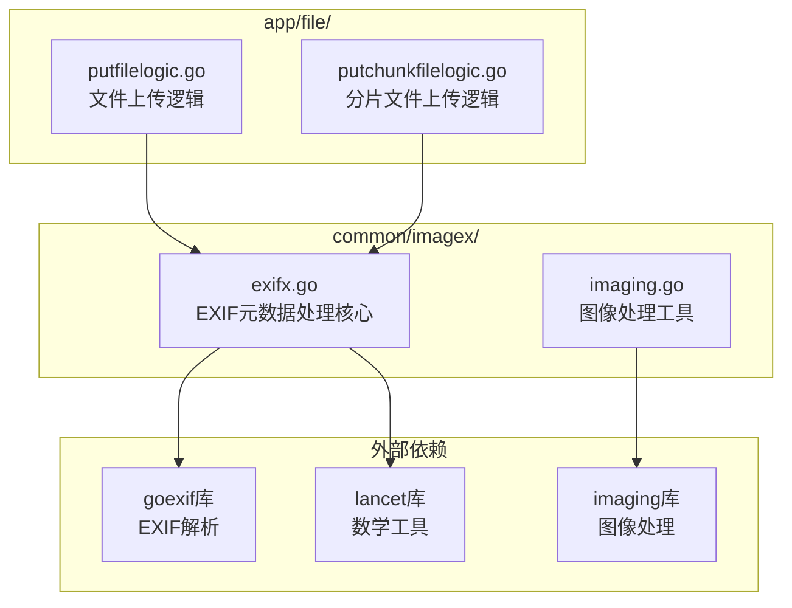
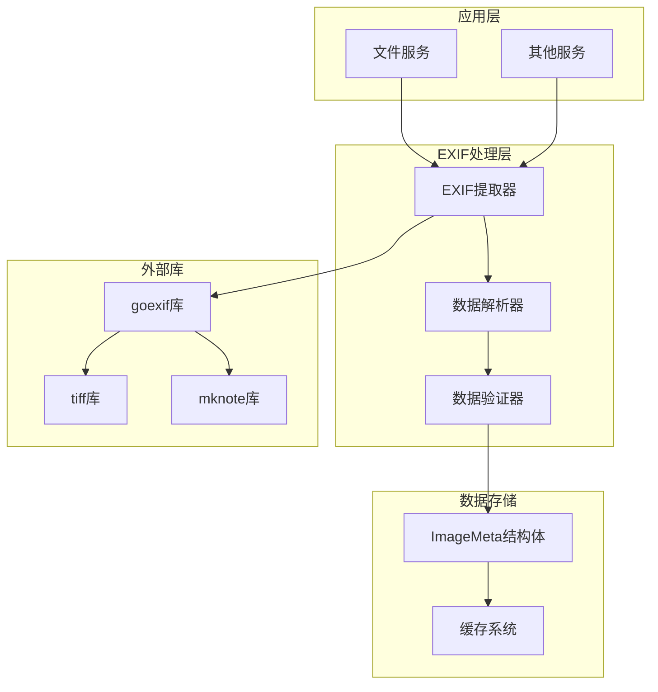
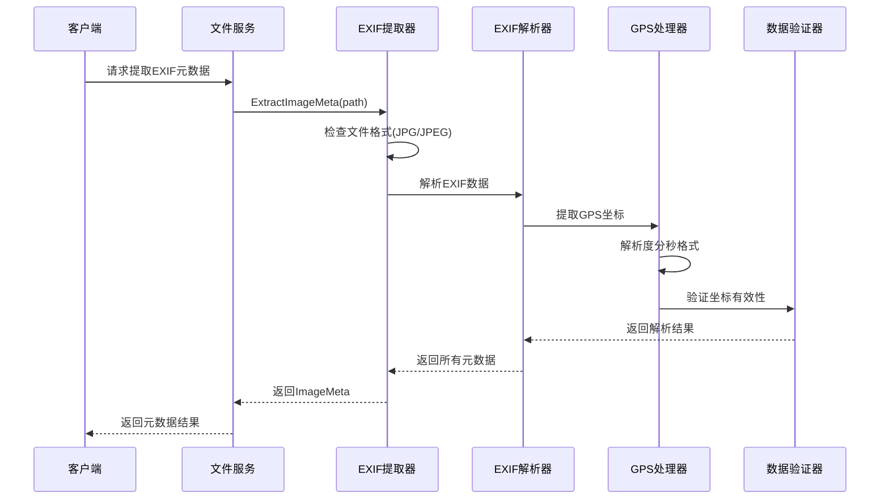
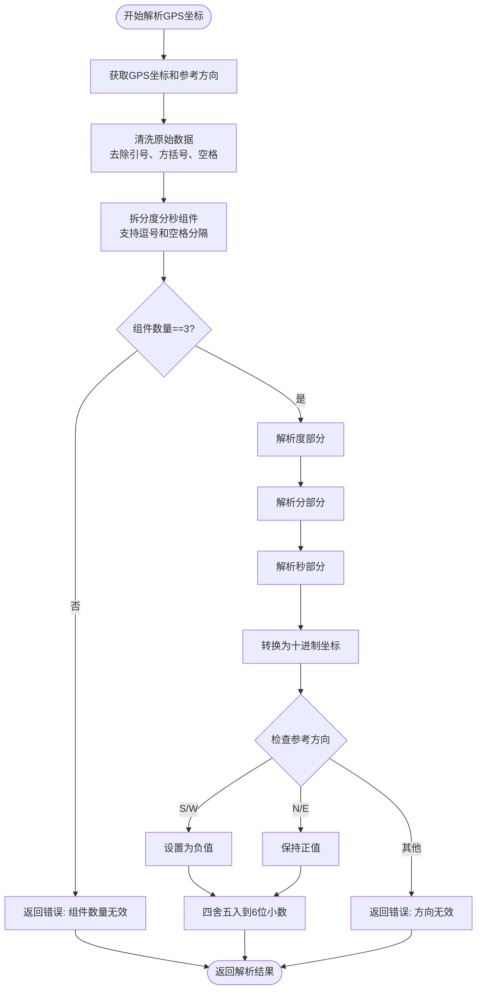
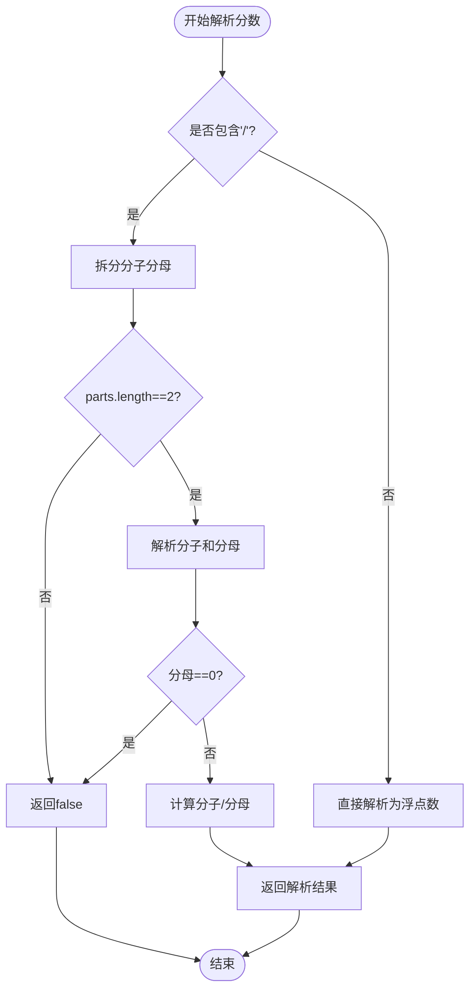
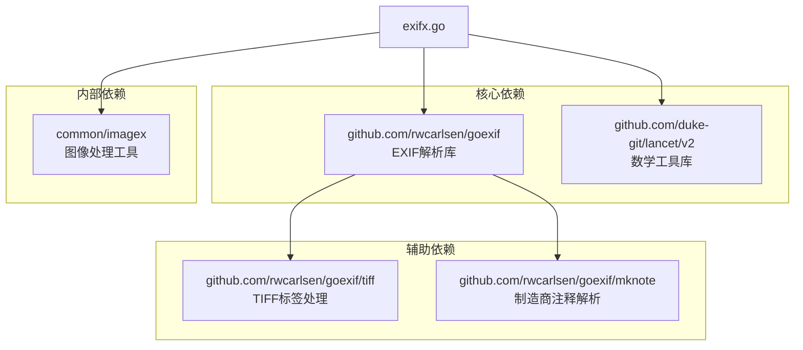

# EXIF元数据处理

<cite>
**本文引用的文件**
- [exifx.go](file://common/imagex/exifx.go)
- [imaging.go](file://common/imagex/imaging.go)
- [putchunkfilelogic.go](file://app/file/internal/logic/putchunkfilelogic.go)
- [putfilelogic.go](file://app/file/internal/logic/putfilelogic.go)
- [go.mod](file://go.mod)
- [README.md](file://README.md)
</cite>

## 目录
1. [简介](#简介)
2. [项目结构](#项目结构)
3. [核心组件](#核心组件)
4. [架构概览](#架构概览)
5. [详细组件分析](#详细组件分析)
6. [依赖分析](#依赖分析)
7. [性能考虑](#性能考虑)
8. [故障排除指南](#故障排除指南)
9. [结论](#结论)
10. [附录](#附录)

## 简介

Zero-Service项目中的EXIF元数据处理工具是一个专门用于提取和解析图片EXIF信息的组件。该工具基于Go语言开发，利用了`goexif`库来解析EXIF数据，并提供了完整的GPS坐标解析、拍摄时间处理、图片尺寸获取和相机信息提取功能。

该项目是基于go-zero微服务框架构建的工业级应用，专注于物联网数据采集、异步任务调度、实时通信等场景。EXIF元数据处理作为图像处理的重要组成部分，在文件服务中发挥着关键作用。

## 项目结构

EXIF元数据处理工具位于`common/imagex/`目录下，主要包含以下文件：



**图表来源**
- [exifx.go:1-294](file://common/imagex/exifx.go#L1-L294)
- [imaging.go:1-69](file://common/imagex/imaging.go#L1-L69)

**章节来源**
- [README.md:98-98](file://README.md#L98)
- [go.mod:38-16](file://go.mod#L38-L16)

## 核心组件

### ImageMeta结构体

ImageMeta是EXIF元数据处理的核心数据结构，包含了图片的所有重要元数据信息：

| 字段名 | 类型 | JSON标签 | 描述 | 示例值 |
|--------|------|----------|------|--------|
| Longitude | float64 | longitude | 经度坐标 | 116.3974 |
| Latitude | float64 | latitude | 纬度坐标 | 39.9092 |
| Time | string | time | 拍摄时间 | "2023-12-01 14:30:45" |
| ImgHeight | int | imgHeight | 图片高度（像素） | 4032 |
| ImgWidth | int | imgWidth | 图片宽度（像素） | 3024 |
| Altitude | float64 | altitude | 海拔高度（米） | 38.0 |
| CameraModel | string | cameraModel | 相机型号 | "Canon EOS R5" |

### 主要功能函数

1. **ExtractImageMeta** - 从文件路径提取EXIF元数据
2. **ExtractImageMetaFromBytes** - 从字节流提取EXIF元数据  
3. **ExtractImageMetaReader** - 从io.Reader提取EXIF元数据
4. **parseGPSCoordinate** - 解析GPS坐标（度分秒格式）
5. **parseFraction** - 解析分数格式数值
6. **parseFractionToInt** - 解析分数为整数

**章节来源**
- [exifx.go:20-29](file://common/imagex/exifx.go#L20-L29)
- [exifx.go:172-187](file://common/imagex/exifx.go#L172-L187)

## 架构概览

EXIF元数据处理工具在整个系统中的位置和交互关系如下：



**图表来源**
- [exifx.go:94-170](file://common/imagex/exifx.go#L94-L170)
- [go.mod:14-17](file://go.mod#L14-L17)

## 详细组件分析

### EXIF数据提取流程

EXIF元数据提取采用分步骤处理策略，确保每个字段都能被准确解析：



**图表来源**
- [exifx.go:94-170](file://common/imagex/exifx.go#L94-L170)
- [exifx.go:189-256](file://common/imagex/exifx.go#L189-L256)

### GPS坐标解析算法

GPS坐标解析是EXIF处理的核心功能之一，支持复杂的度分秒格式：



**图表来源**
- [exifx.go:189-256](file://common/imagex/exifx.go#L189-L256)

### 分数解析机制

EXIF数据中的数值经常以分数形式出现，系统提供了专门的解析函数：



**图表来源**
- [exifx.go:258-284](file://common/imagex/exifx.go#L258-L284)

**章节来源**
- [exifx.go:189-256](file://common/imagex/exifx.go#L189-L256)
- [exifx.go:258-293](file://common/imagex/exifx.go#L258-L293)

## 依赖分析

### 外部依赖关系

EXIF元数据处理工具依赖于多个第三方库：



**图表来源**
- [go.mod:14-17](file://go.mod#L14-L17)
- [exifx.go:3-18](file://common/imagex/exifx.go#L3-L18)

### 内部集成关系

EXIF处理工具在Zero-Service系统中的集成情况：

| 集成点 | 功能描述 | 使用方式 |
|--------|----------|----------|
| 文件服务 | 图片元数据提取 | putfilelogic.go, putchunkfilelogic.go |
| 缩略图生成 | 基于EXIF信息生成缩略图 | imaging.go配合使用 |
| 数据存储 | ImageMeta结构体存储 | protobuf定义 |

**章节来源**
- [go.mod:38-16](file://go.mod#L38-L16)
- [putfilelogic.go:67-72](file://app/file/internal/logic/putfilelogic.go#L67-L72)
- [putchunkfilelogic.go:212-218](file://app/file/internal/logic/putchunkfilelogic.go#L212-L218)

## 性能考虑

### 内存使用优化

1. **流式处理**：支持从io.Reader直接解析，避免大文件完全加载到内存
2. **按需解析**：只解析需要的EXIF字段，减少不必要的计算
3. **缓存策略**：对于重复的文件，可以考虑添加缓存机制

### 处理效率优化

1. **并发处理**：在批量处理大量图片时，可以考虑并发优化
2. **错误恢复**：对解析失败的图片进行快速跳过，不影响整体处理流程
3. **资源管理**：及时关闭文件句柄和释放内存

## 故障排除指南

### 常见错误及解决方案

| 错误类型 | 错误信息 | 可能原因 | 解决方案 |
|----------|----------|----------|----------|
| 文件格式错误 | "仅支持JPG/JPEG文件" | 非JPG/JPEG格式 | 确保输入文件为JPG或JPEG格式 |
| EXIF数据缺失 | "no exif data" | 图片无EXIF信息 | 返回默认值而非报错 |
| GPS坐标解析失败 | 度分秒格式无效 | 坐标格式不正确 | 检查EXIF数据完整性 |
| 分数解析错误 | 分母为零 | 分数格式错误 | 验证EXIF数据格式 |

### 调试技巧

1. **启用调试输出**：使用Walker结构体遍历所有EXIF标签
2. **日志记录**：记录详细的解析过程和中间结果
3. **单元测试**：为各种边界情况进行测试

**章节来源**
- [exifx.go:98-104](file://common/imagex/exifx.go#L98-L104)
- [exifx.go:189-256](file://common/imagex/exifx.go#L189-L256)

## 结论

Zero-Service项目的EXIF元数据处理工具是一个功能完善、设计合理的图像元数据提取组件。它具有以下特点：

1. **功能完整**：支持EXIF数据提取、GPS坐标解析、拍摄时间处理、图片尺寸获取和相机信息提取
2. **处理精确**：采用专门的度分秒解析算法，能够准确处理复杂的GPS坐标格式
3. **错误处理**：完善的错误处理机制，能够在各种异常情况下优雅降级
4. **性能优化**：支持流式处理和按需解析，适合大规模图片处理场景
5. **易于集成**：清晰的API设计，便于在其他服务中集成使用

该工具在Zero-Service系统中发挥着重要作用，特别是在文件服务中，为图片元数据的存储和后续处理提供了可靠的基础。

## 附录

### 使用示例

#### 从文件路径提取元数据
```go
meta, err := imagex.ExtractImageMeta("photo.jpg")
if err != nil {
    // 处理错误
}
// 使用meta数据
```

#### 从字节流提取元数据
```go
data, _ := ioutil.ReadFile("photo.jpg")
meta, err := imagex.ExtractImageMetaFromBytes(data)
if err != nil {
    // 处理错误
}
```

#### 从io.Reader提取元数据
```go
file, _ := os.Open("photo.jpg")
defer file.Close()
meta, err := imagex.ExtractImageMetaReader(file)
if err != nil {
    // 处理错误
}
```

### 最佳实践

1. **错误处理**：始终检查返回的错误，不要忽略EXIF解析失败的情况
2. **格式验证**：在处理前验证文件格式为JPG/JPEG
3. **内存管理**：对于大文件，优先使用流式处理方式
4. **数据验证**：对解析出的数据进行合理性检查
5. **性能监控**：在生产环境中监控EXIF解析的性能指标